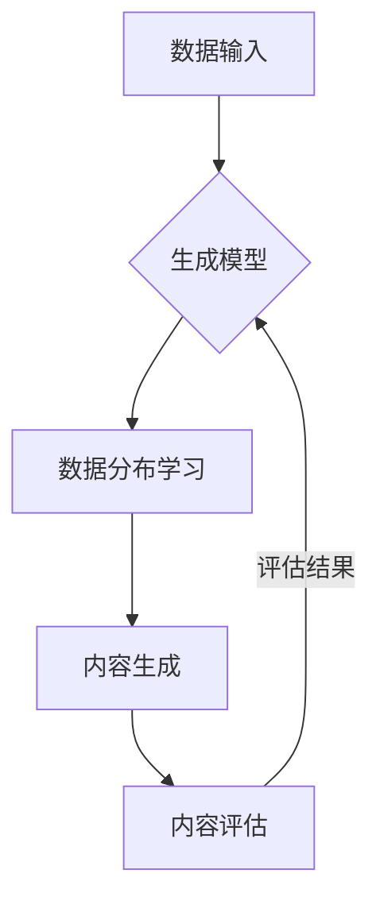

# 生成式AIGC：从数据到商业价值的实现

> 关键词：生成式AI，AIGC，生成模型，自然语言生成，图像生成，商业应用，数据驱动，模型训练

## 1. 背景介绍

随着人工智能技术的飞速发展，生成式AI（Generative AI，简称AIGC）已经成为研究的热点。AIGC是一种能够根据已有数据生成新内容的技术，包括文本、图像、音频等。这种技术具有广泛的应用前景，能够极大地提升内容创作的效率和多样性，同时也为商业价值的实现提供了新的途径。

### 1.1 问题的由来

传统的数字化内容生成方式依赖于人工创作，这不仅效率低下，而且内容同质化严重。随着互联网信息的爆炸式增长，对高质量、个性化内容的需求日益增长，这促使了生成式AI技术的诞生。

### 1.2 研究现状

目前，生成式AI技术在自然语言生成（Natural Language Generation，简称NLG）和计算机视觉（Computer Vision）领域取得了显著进展。NLG技术可以自动生成文章、对话、代码等文本内容；计算机视觉技术可以生成逼真的图像、视频等视觉内容。

### 1.3 研究意义

生成式AI技术具有以下重要意义：

- 提升内容创作效率：自动化生成内容，减少人工创作的工作量。
- 增强内容多样性：通过算法创造新颖的内容，满足个性化需求。
- 创造新的商业模式：为企业和个人提供新的收入来源。

### 1.4 本文结构

本文将分为以下几个部分：

- 第2部分：介绍生成式AI的核心概念与联系。
- 第3部分：阐述生成式AI的核心算法原理和具体操作步骤。
- 第4部分：讲解生成式AI的数学模型和公式，并举例说明。
- 第5部分：展示生成式AI的代码实例和详细解释。
- 第6部分：探讨生成式AI的实际应用场景。
- 第7部分：展望生成式AI的未来发展趋势和挑战。
- 第8部分：总结全文，并给出相关学习资源和工具推荐。
- 第9部分：提供常见问题与解答。

## 2. 核心概念与联系

### 2.1 核心概念

- **生成模型**：生成模型是一种能够学习数据分布并生成新数据的机器学习模型。常见的生成模型包括变分自编码器（VAEs）、生成对抗网络（GANs）等。
- **自然语言生成（NLG）**：NLG是指计算机生成自然语言文本的技术。常见的NLG模型包括序列到序列（Seq2Seq）模型、Transformer模型等。
- **图像生成**：图像生成是指计算机生成逼真的图像或视频的技术。常见的图像生成模型包括GANs、CycleGANs等。
- **数据驱动**：数据驱动是指通过分析大量数据来驱动决策和生成内容的技术。

### 2.2 架构图

以下是生成式AI的Mermaid流程图：



## 3. 核心算法原理 & 具体操作步骤

### 3.1 算法原理概述

生成式AI的核心是生成模型。生成模型通过学习数据分布来生成新的数据。以下是一些常见的生成模型：

- **变分自编码器（VAEs）**：VAEs通过最大化数据生成分布与真实数据分布之间的相似度来学习数据分布。
- **生成对抗网络（GANs）**：GANs由生成器和判别器两部分组成。生成器生成数据，判别器判断数据是真实还是生成。通过训练，生成器生成越来越接近真实数据。

### 3.2 算法步骤详解

生成式AI的算法步骤通常包括以下几步：

1. **数据预处理**：对输入数据进行清洗、去噪和转换，以便模型训练。
2. **模型选择**：根据任务需求选择合适的生成模型。
3. **模型训练**：使用训练数据对模型进行训练，学习数据分布。
4. **内容生成**：使用训练好的模型生成新的内容。
5. **内容评估**：评估生成内容的质量和满意度。
6. **模型优化**：根据评估结果对模型进行调整和优化。

### 3.3 算法优缺点

- **优点**：
  - 生成高质量的内容。
  - 可以生成新颖和个性化的内容。
  - 可以降低内容创作的成本和时间。
- **缺点**：
  - 模型训练需要大量的计算资源。
  - 模型生成的内容可能存在偏差。
  - 模型生成的内容可能侵犯版权。

### 3.4 算法应用领域

生成式AI技术可以应用于以下领域：

- **自然语言生成**：自动生成新闻、文章、对话等文本内容。
- **图像生成**：自动生成图像、视频等视觉内容。
- **音乐生成**：自动生成音乐、声音等音频内容。

## 4. 数学模型和公式 & 详细讲解 & 举例说明

### 4.1 数学模型构建

以下是一些生成式AI常用的数学模型和公式：

- **变分自编码器（VAEs）**：

  $$
\begin{align*}
\mathcal{L}_{\mathrm{VAE}}(q_\phi, p_\theta, x) &= D(q_\phi(x), p_\theta(x)) \\
\end{align*}
$$

  其中 $q_\phi$ 是编码器，$p_\theta$ 是解码器，$D$ 是KL散度。

- **生成对抗网络（GANs）**：

  $$
\begin{align*}
\mathcal{L}_{\mathrm{GAN}} &= \mathbb{E}_{x \sim p_{\mathrm{data}}(x)}[D(G(x))] - \mathbb{E}_{z \sim p_{\mathrm{z}}(z)}[D(G(z))] \\
\end{align*}
$$

  其中 $G$ 是生成器，$D$ 是判别器，$p_{\mathrm{data}}$ 是真实数据分布，$p_{\mathrm{z}}$ 是噪声分布。

### 4.2 公式推导过程

VAEs和GANs的公式推导过程较为复杂，涉及到概率论、信息论等数学知识。具体推导过程请参考相关论文。

### 4.3 案例分析与讲解

以下是一个简单的VAE模型实例：

```python
# 导入必要的库
import torch
import torch.nn as nn
import torch.optim as optim

# 定义编码器
class Encoder(nn.Module):
    def __init__(self):
        super(Encoder, self).__init__()
        self.fc1 = nn.Linear(784, 400)
        self.fc2 = nn.Linear(400, 20)

    def forward(self, x):
        x = torch.relu(self.fc1(x))
        x = self.fc2(x)
        return x

# 定义解码器
class Decoder(nn.Module):
    def __init__(self):
        super(Decoder, self).__init__()
        self.fc1 = nn.Linear(20, 400)
        self.fc2 = nn.Linear(400, 784)

    def forward(self, x):
        x = torch.relu(self.fc1(x))
        x = self.fc2(x)
        return x

# 定义VAE模型
class VAE(nn.Module):
    def __init__(self):
        super(VAE, self).__init__()
        self.encoder = Encoder()
        self.decoder = Decoder()

    def forward(self, x):
        z = self.encoder(x)
        return self.decoder(z)

# 实例化模型
model = VAE()

# 定义损失函数和优化器
criterion = nn.KLDivLoss()
optimizer = optim.Adam(model.parameters(), lr=1e-3)

# 训练模型
for epoch in range(epochs):
    for data in dataloader:
        optimizer.zero_grad()
        x, _ = data
        x = x.view(x.size(0), -1)
        z = model(x)
        loss = criterion(model.log_var(z), z)
        loss.backward()
        optimizer.step()
```

## 5. 项目实践：代码实例和详细解释说明

### 5.1 开发环境搭建

在进行生成式AI项目实践之前，需要搭建以下开发环境：

- Python 3.x
- PyTorch
- NumPy
- Matplotlib

### 5.2 源代码详细实现

以下是一个简单的GANs模型实例：

```python
# 导入必要的库
import torch
import torch.nn as nn

# 定义生成器
class Generator(nn.Module):
    def __init__(self, latent_dim):
        super(Generator, self).__init__()
        self.model = nn.Sequential(
            nn.Linear(latent_dim, 128),
            nn.LeakyReLU(0.2, inplace=True),
            nn.Linear(128, 256),
            nn.LeakyReLU(0.2, inplace=True),
            nn.Linear(256, 512),
            nn.LeakyReLU(0.2, inplace=True),
            nn.Linear(512, 1024),
            nn.LeakyReLU(0.2, inplace=True),
            nn.Linear(1024, img_size * img_channels),
            nn.Tanh()
        )

    def forward(self, z):
        img = self.model(z)
        img = img.view(img.size(0), img_channels, img_size, img_size)
        return img

# 定义判别器
class Discriminator(nn.Module):
    def __init__(self):
        super(Discriminator, self).__init__()
        self.model = nn.Sequential(
            nn.Linear(img_size * img_channels, 512),
            nn.LeakyReLU(0.2, inplace=True),
            nn.Linear(512, 256),
            nn.LeakyReLU(0.2, inplace=True),
            nn.Linear(256, 1),
            nn.Sigmoid()
        )

    def forward(self, img):
        validity = self.model(img)
        return validity

# 实例化模型
generator = Generator(latent_dim)
discriminator = Discriminator()

# 定义损失函数和优化器
adversarial_loss = nn.BCEWithLogitsLoss()
optimizer_G = torch.optim.Adam(generator.parameters(), lr=0.0002, betas=(0.5, 0.999))
optimizer_D = torch.optim.Adam(discriminator.parameters(), lr=0.0002, betas=(0.5, 0.999))

# 训练模型
for epoch in range(epochs):
    for i, ((imgs, _), _) in enumerate(dataloader):
        valid = torch.ones(imgs.size(0), 1).to(device)
        fake = torch.zeros(imgs.size(0), 1).to(device)

        # 训练判别器
        optimizer_D.zero_grad()
        real_loss = adversarial_loss(discriminator(imgs), valid)
        fake_loss = adversarial_loss(discriminator(fake.detach()), fake)
        d_loss = (real_loss + fake_loss) / 2

        d_loss.backward()
        optimizer_D.step()

        # 训练生成器
        optimizer_G.zero_grad()
        gen_imgs = generator(z)
        g_loss = adversarial_loss(discriminator(gen_imgs), valid)

        g_loss.backward()
        optimizer_G.step()
```

### 5.3 代码解读与分析

以上代码展示了如何使用PyTorch构建一个简单的GANs模型。模型由生成器和判别器两部分组成。生成器接收一个随机噪声向量，生成一个图像；判别器判断图像是真实图像还是生成图像。通过迭代训练，生成器逐渐生成越来越逼真的图像。

### 5.4 运行结果展示

以下是一个使用GANs生成图像的示例：

```python
# 生成图像
z = torch.randn(latent_dim, 1, 1, 1).to(device)
images = generator(z)
images = images.cpu().numpy()

# 显示图像
fig, ax = plt.subplots()
ax.imshow(images[0, :, :, 0], cmap='gray')
plt.show()
```

## 6. 实际应用场景

生成式AI技术在许多实际应用场景中发挥着重要作用，以下是一些典型的应用：

- **创意设计**：生成新的艺术作品、设计草图等。
- **游戏开发**：生成游戏角色、场景等。
- **虚拟现实**：生成虚拟现实环境中的3D模型。
- **广告营销**：生成个性化的广告内容。
- **新闻报道**：生成新闻摘要、体育赛事报道等。

## 7. 工具和资源推荐

### 7.1 学习资源推荐

- 《深度学习》
- 《生成式对抗网络》
- 《自然语言处理入门》
- 《计算机视觉：算法与应用》

### 7.2 开发工具推荐

- PyTorch
- TensorFlow
- Keras
- PyTorch Lightning
- Hugging Face Transformers

### 7.3 相关论文推荐

- Unsupervised Representation Learning with Deep Convolutional Generative Adversarial Networks
- Generative Adversarial Text to Image Synthesis
- Learning to Generate Images of Style-Conditioned Human Pose

## 8. 总结：未来发展趋势与挑战

### 8.1 研究成果总结

生成式AI技术在近年来取得了显著进展，为内容创作和商业价值的实现提供了新的途径。然而，生成式AI技术仍然面临着一些挑战。

### 8.2 未来发展趋势

- 模型性能的提升：随着计算能力的增强和算法的改进，生成式AI模型的性能将进一步提升。
- 应用领域的拓展：生成式AI技术将在更多领域得到应用，如医疗、教育、金融等。
- 人机协作：生成式AI将与人类创作者合作，共同创造更优质的内容。

### 8.3 面临的挑战

- 模型可解释性：生成式AI模型的决策过程往往难以解释，需要提高模型的可解释性。
- 数据安全和隐私：生成式AI模型需要处理大量的数据，需要确保数据安全和隐私。
- 模型偏见：生成式AI模型可能会学习到数据的偏见，需要采取措施消除模型偏见。

### 8.4 研究展望

未来，生成式AI技术将在以下方面取得突破：

- 模型可解释性和可控性
- 数据安全和隐私保护
- 模型偏见消除
- 多模态生成

生成式AI技术的发展将极大地推动内容创作的进步，为商业价值的实现提供新的机遇。

## 9. 附录：常见问题与解答

**Q1：生成式AI技术如何应用于商业领域？**

A：生成式AI技术可以应用于商业领域的各个方面，如：

- **市场调研**：生成市场报告、行业分析等。
- **产品创新**：生成产品原型、设计草图等。
- **内容营销**：生成广告文案、新闻报道等。
- **客户服务**：生成个性化客服回复。

**Q2：生成式AI技术有哪些局限性？**

A：生成式AI技术存在以下局限性：

- 模型可解释性不足。
- 数据安全和隐私问题。
- 模型偏见。

**Q3：如何确保生成式AI技术的安全性？**

A：为确保生成式AI技术的安全性，需要采取以下措施：

- 加强数据安全和隐私保护。
- 消除模型偏见。
- 建立模型可解释性。

**Q4：生成式AI技术未来发展趋势如何？**

A：生成式AI技术未来发展趋势包括：

- 模型性能的提升。
- 应用领域的拓展。
- 人机协作。

**Q5：如何学习生成式AI技术？**

A：学习生成式AI技术可以通过以下途径：

- 阅读相关书籍和论文。
- 参加相关课程和研讨会。
- 参与开源项目。

作者：禅与计算机程序设计艺术 / Zen and the Art of Computer Programming