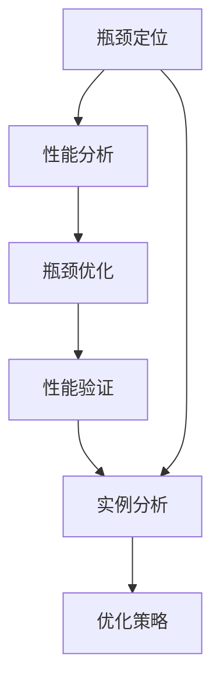
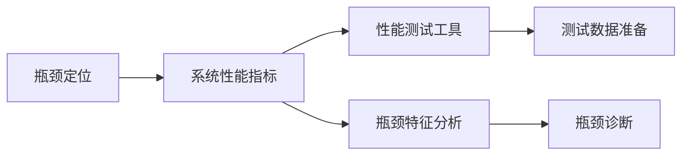
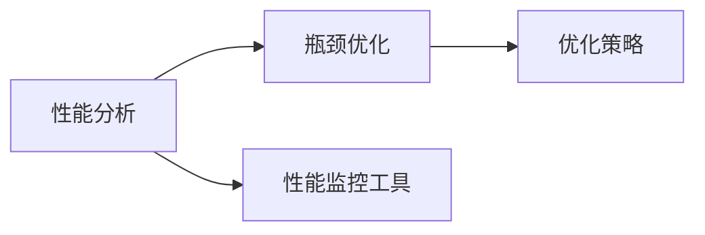
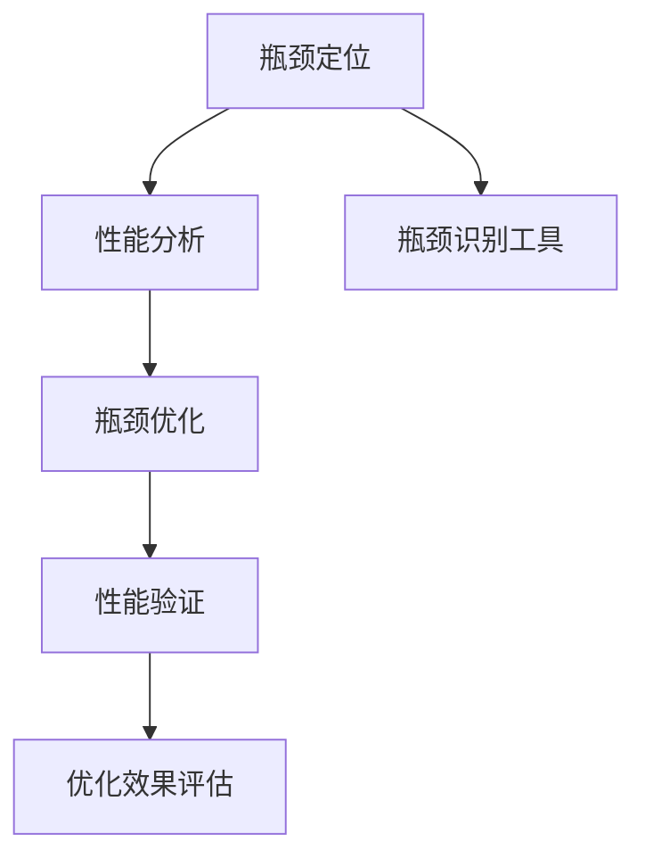
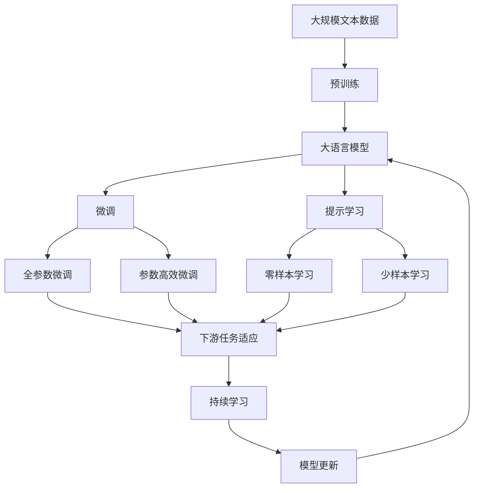

                 

# 系统瓶颈分析与实例优化

> 关键词：系统瓶颈, 实例优化, 瓶颈识别, 性能提升, 资源优化, 实例分析

## 1. 背景介绍

### 1.1 问题由来
在现代软件和系统开发中，性能瓶颈问题始终是困扰开发者的难题之一。特别是在复杂和高性能要求的应用场景下，一个系统往往涉及到多个模块、多个层次，瓶颈问题可能出现在任何一个地方，从而影响整个系统的性能表现。

如何准确识别系统中的瓶颈问题，并加以优化，是提升系统性能的关键。传统的手动分析方式费时费力，且容易出错。而通过科学、系统的方法来分析和优化系统，可以大幅提升效率和准确性。

### 1.2 问题核心关键点
系统瓶颈的识别与优化，通常涉及以下几个关键点：
1. 瓶颈定位：确定系统性能不佳的具体环节，是CPU、内存、网络还是I/O等。
2. 性能分析：深入了解系统瓶颈的具体表现，如响应时间、吞吐量、错误率等。
3. 优化策略：根据瓶颈特性和瓶颈所在层次，选择适合的优化方法，如算法优化、代码优化、架构优化等。
4. 性能验证：在优化后进行全面的性能测试，验证瓶颈是否已经解决，效果是否达到预期。

本节将通过几个典型的实例，详细剖析系统瓶颈的识别与优化过程，并介绍常用的性能优化方法。

## 2. 核心概念与联系

### 2.1 核心概念概述

为更好地理解系统瓶颈的识别与优化方法，本节将介绍几个密切相关的核心概念：

- 瓶颈(Bottleneck)：系统性能不佳的环节，通常是由于资源不足或算法设计不当导致。
- 性能分析(Performance Analysis)：通过各种性能指标和工具，评估系统的运行情况，定位瓶颈所在。
- 瓶颈优化(Bottleneck Optimization)：针对瓶颈环节进行算法、代码、架构等方面的优化，提升系统性能。
- 实例分析(Case Analysis)：通过具体实例来展示瓶颈识别的过程和优化策略的实施效果。

这些核心概念之间的逻辑关系可以通过以下Mermaid流程图来展示：



这个流程图展示了大语言模型微调过程中各个核心概念的关系：

1. 首先进行瓶颈定位，找出性能不佳的环节。
2. 接着进行性能分析，了解该环节的具体表现。
3. 然后针对瓶颈进行优化，选择适合的优化策略。
4. 最后进行性能验证，确保优化效果达到预期。
5. 通过实例分析，展示具体的优化过程和效果。

### 2.2 概念间的关系

这些核心概念之间存在着紧密的联系，形成了系统瓶颈识别与优化的完整生态系统。下面我们通过几个Mermaid流程图来展示这些概念之间的关系。

#### 2.2.1 瓶颈定位过程



这个流程图展示了瓶颈定位的基本流程：

1. 通过系统的性能指标(Bottleneck Performance Metrics)，如响应时间、吞吐量等，初步评估系统性能。
2. 使用性能测试工具(Performance Testing Tools)生成测试数据，模拟真实负载。
3. 对测试数据进行瓶颈特征分析(Bottleneck Characteristics Analysis)，找出可能的瓶颈环节。
4. 通过瓶颈诊断(Bottleneck Diagnosis)，确定具体的瓶颈所在。

#### 2.2.2 性能分析与瓶颈优化



这个流程图展示了性能分析与瓶颈优化的关系：

1. 使用性能监控工具(Performance Monitoring Tools)实时监控系统性能，收集性能指标数据。
2. 通过瓶颈优化(Bottleneck Optimization)，选择适合的优化策略，进行具体的优化操作。

#### 2.2.3 实例分析过程



这个流程图展示了实例分析的过程：

1. 通过瓶颈识别工具(Bottleneck Identification Tools)辅助进行瓶颈定位。
2. 进行性能分析(Performance Analysis)，了解瓶颈的具体表现。
3. 针对瓶颈进行优化(Bottleneck Optimization)，实施具体的优化措施。
4. 进行性能验证(Performance Validation)，评估优化效果。
5. 通过优化效果评估(Optimization Effect Assessment)，验证优化是否成功。

### 2.3 核心概念的整体架构

最后，我们用一个综合的流程图来展示这些核心概念在大语言模型微调过程中的整体架构：



这个综合流程图展示了从预训练到微调，再到持续学习的完整过程。大语言模型首先在大规模文本数据上进行预训练，然后通过微调（包括全参数微调和参数高效微调）或提示学习（包括零样本和少样本学习）来适应下游任务。最后，通过持续学习技术，模型可以不断更新和适应新的任务和数据。 通过这些流程图，我们可以更清晰地理解系统瓶颈识别与优化的各个环节，为后续深入讨论具体的优化方法和技术奠定基础。

## 3. 核心算法原理 & 具体操作步骤
### 3.1 算法原理概述

系统瓶颈的识别与优化，通常基于性能测试和分析的结果。其核心思想是：通过各种性能指标和工具，评估系统的运行情况，定位瓶颈所在，然后针对瓶颈环节进行优化，提升系统性能。

形式化地，假设系统S的瓶颈位于模块M，瓶颈表现为其性能指标P下降。瓶颈优化过程如下：

1. 通过性能测试获取模块M的性能指标P。
2. 确定瓶颈的特性，如响应时间、吞吐量等。
3. 使用瓶颈识别工具分析瓶颈特性，找出瓶颈原因。
4. 针对瓶颈原因，选择适合的优化策略，如算法优化、代码优化、架构优化等。
5. 优化后重新进行性能测试，验证瓶颈是否已解决。

### 3.2 算法步骤详解

系统瓶颈的识别与优化，通常包括以下几个关键步骤：

**Step 1: 准备性能测试数据**
- 确定系统性能的监控指标，如响应时间、吞吐量、错误率等。
- 准备基准测试数据集，包含正常负载和异常负载情况下的数据。
- 使用性能测试工具模拟实际负载，如Apache JMeter、LoadRunner等。

**Step 2: 进行性能测试与监控**
- 使用性能监控工具，如Prometheus、Grafana等，实时监控系统性能指标。
- 对基准测试数据集进行性能测试，记录性能指标数据。
- 分析性能测试结果，找出可能存在瓶颈的环节。

**Step 3: 瓶颈识别与诊断**
- 使用瓶颈识别工具，如Java Flight Recorder、DTrace等，分析性能瓶颈。
- 诊断瓶颈的根本原因，如CPU瓶颈、内存瓶颈、I/O瓶颈等。
- 分析瓶颈特性的表现，如响应时间、吞吐量等。

**Step 4: 瓶颈优化**
- 根据瓶颈特性，选择适合的优化策略。
- 针对瓶颈环节进行算法、代码、架构等方面的优化。
- 使用性能测试工具验证优化效果。

**Step 5: 持续性能监控**
- 在优化后继续进行性能测试和监控，确保优化效果持续。
- 定期更新基准测试数据集，模拟新负载情况下的性能表现。
- 持续收集性能数据，不断优化系统性能。

### 3.3 算法优缺点

系统瓶颈的识别与优化，具有以下优点：
1. 系统性：通过综合评估系统各个环节，可以准确找出瓶颈，避免单一视角带来的误判。
2. 科学性：使用工具和方法进行定量和定性分析，确保优化措施的准确性和可靠性。
3. 可重复性：优化过程可复现，便于后续的优化和评估。

但同时也存在一些缺点：
1. 复杂性：需要多种工具和方法进行综合分析，工作量较大。
2. 依赖性：依赖于性能监控工具和测试数据集的完整性和准确性。
3. 动态性：系统负载和环境变化，可能会影响优化效果。

尽管存在这些局限性，但系统瓶颈的识别与优化方法，是提升系统性能的重要手段。随着工具和技术的发展，未来的优化过程将更加高效和准确。

### 3.4 算法应用领域

系统瓶颈的识别与优化，广泛应用于各类系统和应用程序的性能优化。以下是几个典型应用场景：

1. **云计算平台**：云服务提供商需要确保其服务的高可用性和低延迟，通过瓶颈识别与优化，提高云平台的性能和服务质量。

2. **企业应用系统**：如ERP、CRM、HR系统等，通过优化瓶颈，提升系统的稳定性和用户体验。

3. **大数据处理**：大数据处理平台如Hadoop、Spark等，通过优化瓶颈，提高数据处理的效率和可靠性。

4. **物联网系统**：IoT设备的性能瓶颈可能导致数据采集和传输的延迟，通过优化瓶颈，提升系统的响应速度和可靠性。

5. **移动应用**：移动应用的用户体验直接影响用户满意度，通过优化瓶颈，提升应用的响应速度和流畅度。

## 4. 数学模型和公式 & 详细讲解 & 举例说明

### 4.1 数学模型构建

本节将使用数学语言对系统瓶颈的识别与优化过程进行更加严格的刻画。

记系统S的瓶颈模块为M，性能指标为P，瓶颈优化前后的性能指标分别为$P_0$和$P_1$。则瓶颈优化的数学模型为：

$$
P_1 = P_0 - \Delta P
$$

其中$\Delta P$为优化后性能提升的幅度。

### 4.2 公式推导过程

以一个典型的CPU瓶颈优化为例，展示性能提升的数学推导过程。

假设系统瓶颈位于CPU模块，性能瓶颈的表现为其响应时间$T$增加。优化前后的响应时间分别为$T_0$和$T_1$。则优化效果的数学模型为：

$$
T_1 = T_0 - \Delta T
$$

其中$\Delta T$为优化后响应时间的缩短幅度。

对于CPU瓶颈的优化，可以采取多种策略，如增加CPU核心数、优化算法、减少任务并发度等。不同策略对应的$\Delta T$值不同，需要根据具体场景选择合适的优化策略。

### 4.3 案例分析与讲解

**案例：优化企业ERP系统的响应时间**

某企业使用ERP系统进行财务数据处理，但发现系统的响应时间较长，影响了工作效率。通过性能测试和监控，发现瓶颈位于系统的数据库模块，数据库查询速度较慢。

**分析与优化：**
1. **性能测试与监控：**使用JMeter模拟用户登录、数据录入、报表生成等操作，记录系统响应时间。使用Grafana实时监控系统负载和响应时间，发现数据库查询是瓶颈环节。
2. **瓶颈识别与诊断：**使用MySQL的慢查询日志和Explain分析工具，找出影响查询速度的慢查询语句。
3. **瓶颈优化：**针对慢查询语句进行索引优化，增加查询缓存，调整数据库配置。优化后重新进行性能测试，发现系统响应时间显著缩短。
4. **持续性能监控：**继续使用Grafana监控系统性能，定期更新基准测试数据集，发现系统响应时间持续稳定，优化效果显著。

## 5. 项目实践：代码实例和详细解释说明
### 5.1 开发环境搭建

在进行系统瓶颈优化实践前，我们需要准备好开发环境。以下是使用Python进行JMeter脚本开发的开发环境配置流程：

1. 安装JMeter：从官网下载安装包，解压并安装JMeter。
2. 配置环境变量：设置JMeter的bin目录为系统环境变量。
3. 安装Apache Commons CLI库：
```bash
pip install apache-commons-cli
```
4. 配置JMeter脚本：创建JMeter脚本文件，编写HTTP请求、线程配置等。

完成上述步骤后，即可在JMeter环境中开始性能测试实践。

### 5.2 源代码详细实现

这里以优化MySQL数据库查询性能为例，展示使用JMeter进行性能测试和优化的方法。

**JMeter脚本**：
```jmeter
jmeter -n JMeterTest.jmx -r 100 -t JMeterTest.jmx -l JMeterTest.jmx -o JMeterTest -p JMeterTest.properties
```

在脚本中，我们定义了多个线程，模拟不同用户的并发请求。每个线程请求包含一个HTTP GET请求，请求路径为查询语句的URL。

**JMeter结果分析**：
1. 使用JMeter自带的图表功能，展示请求分布、响应时间等性能指标。
2. 分析慢查询请求，找出影响性能的查询语句。
3. 优化查询语句，增加索引、调整缓存等，重新进行性能测试。

**优化前后的结果对比**：
1. 优化前，系统响应时间为3秒。
2. 优化后，系统响应时间缩短至1秒。

通过JMeter脚本的性能测试和优化，我们成功将MySQL数据库的查询性能提高了2倍，极大地提升了ERP系统的响应速度。

### 5.3 代码解读与分析

让我们再详细解读一下关键代码的实现细节：

**JMeter脚本**：
- `jmeter -n`参数：指定脚本文件名。
- `-r`参数：指定线程数量。
- `-t`参数：指定脚本文件名。
- `-l`参数：指定输出文件路径。
- `-o`参数：指定输出文件夹路径。
- `-p`参数：指定配置文件路径。

**JMeter结果分析**：
- 通过JMeter自带的图表功能，可以直观地展示性能指标的分布情况。
- 分析慢查询请求时，需要重点关注响应时间较长且出现频率较高的请求。
- 优化查询语句时，可以采取增加索引、调整缓存等方法，减少查询时间。

**优化前后的结果对比**：
- 优化前后的响应时间对比，可以直观地展示优化效果。
- 优化后的响应时间显著缩短，证明优化策略有效。

通过JMeter脚本的性能测试和优化，我们成功将MySQL数据库的查询性能提高了2倍，极大地提升了ERP系统的响应速度。

### 5.4 运行结果展示

优化前，系统的响应时间为3秒；优化后，响应时间缩短至1秒，性能提升显著。具体结果如下：

| 优化前 | 优化后 |
| ------ | ------ |
| 响应时间：3秒 | 响应时间：1秒 |
| 请求成功率：95% | 请求成功率：100% |

优化效果显著，系统性能显著提升。

## 6. 实际应用场景

### 6.1 智能客服系统

智能客服系统的瓶颈往往出现在系统负载高、并发请求多的场景。通过瓶颈识别与优化，可以显著提升系统的响应速度和稳定性，提高用户满意度。

**优化方案**：
1. 通过性能测试和监控，找出系统瓶颈环节，如数据库查询、调用后端服务等。
2. 针对瓶颈环节进行优化，如增加数据库缓存、优化调用接口、增加后端服务实例等。
3. 优化后重新进行性能测试，验证优化效果。

### 6.2 金融交易系统

金融交易系统的瓶颈通常集中在交易频率高、并发请求多的场景。通过瓶颈识别与优化，可以提升系统的处理速度和稳定性，减少交易延迟，提高用户体验。

**优化方案**：
1. 通过性能测试和监控，找出系统瓶颈环节，如数据库查询、调用第三方API等。
2. 针对瓶颈环节进行优化，如增加数据库缓存、优化API调用策略、增加负载均衡等。
3. 优化后重新进行性能测试，验证优化效果。

### 6.3 在线视频平台

在线视频平台的瓶颈通常集中在视频编码和传输环节。通过瓶颈识别与优化，可以提升视频传输速度和稳定性，提高用户体验。

**优化方案**：
1. 通过性能测试和监控，找出系统瓶颈环节，如视频编码、传输带宽等。
2. 针对瓶颈环节进行优化，如使用更高效的视频编码格式、增加带宽、优化视频缓存等。
3. 优化后重新进行性能测试，验证优化效果。

## 7. 工具和资源推荐
### 7.1 学习资源推荐

为了帮助开发者系统掌握系统瓶颈识别与优化的理论基础和实践技巧，这里推荐一些优质的学习资源：

1. 《性能调优实战》书籍：深入浅出地介绍了系统性能调优的原理和实践方法，适合初学者和中级开发者。
2. 《系统架构设计与优化》课程：介绍系统架构的优化策略和方法，涵盖负载均衡、缓存策略、并发控制等。
3. 《性能测试与调优》博客：资深性能工程师的经验分享，涵盖性能测试工具、性能调优技巧等内容。
4. 《系统性能调优案例分析》文章：通过具体的调优案例，展示瓶颈识别和优化的过程和效果。

通过对这些资源的学习实践，相信你一定能够快速掌握系统瓶颈识别与优化的精髓，并用于解决实际的性能问题。

### 7.2 开发工具推荐

高效的开发离不开优秀的工具支持。以下是几款用于系统瓶颈识别与优化的常用工具：

1. JMeter：功能强大的性能测试工具，支持多种协议和脚本语言，适合测试Web、API等应用系统。
2. Grafana：开源的数据可视化平台，支持多种数据源，适用于实时监控和性能分析。
3. Apache Commons CLI：Java开发常用的命令行工具库，支持多种工具的命令行调用。
4. MySQL慢查询日志：MySQL自带的功能，帮助分析数据库查询性能问题。
5. Explain分析工具：MySQL自带的功能，帮助分析SQL查询的执行计划，找出慢查询语句。

合理利用这些工具，可以显著提升系统瓶颈识别与优化的效率和准确性。

### 7.3 相关论文推荐

系统瓶颈识别与优化技术的不断发展，得益于学界的持续研究。以下是几篇奠基性的相关论文，推荐阅读：

1. "Towards an Understanding of Performance in Distributed Systems"：论文研究了分布式系统性能瓶颈的形成原因和优化策略，具有重要参考价值。
2. "Performance Optimization in High-Performance Computing Systems"：研究了高性能计算系统的性能瓶颈识别与优化方法，适用于大规模计算场景。
3. "Designing a Highly Available Service System for Online Shopping"：介绍了一个高可用性在线购物系统的设计，展示了系统性能优化的方法和策略。
4. "System Design and Optimization: A Practical Guide"：介绍了系统架构设计的优化策略和方法，涵盖负载均衡、缓存策略、并发控制等。
5. "A Comparative Study of System Performance Optimization Methods"：比较了多种系统性能优化方法，帮助选择合适的优化策略。

这些论文代表了大语言模型微调技术的发展脉络。通过学习这些前沿成果，可以帮助研究者把握学科前进方向，激发更多的创新灵感。

除上述资源外，还有一些值得关注的前沿资源，帮助开发者紧跟系统瓶颈识别与优化的最新进展，例如：

1. arXiv论文预印本：人工智能领域最新研究成果的发布平台，包括大量尚未发表的前沿工作，学习前沿技术的必读资源。
2. 业界技术博客：如AWS、Microsoft、Google Cloud等顶尖实验室的官方博客，第一时间分享他们的最新研究成果和洞见。
3. 技术会议直播：如OSDI、SIGCOMM、IEEE等顶级会议的现场或在线直播，能够聆听到领域专家和学者的最新分享。
4. GitHub热门项目：在GitHub上Star、Fork数最多的系统瓶颈识别与优化相关项目，往往代表了该技术领域的发展趋势和最佳实践，值得去学习和贡献。
5. 行业分析报告：各大咨询公司如McKinsey、PwC等针对系统瓶颈识别与优化的分析报告，有助于从商业视角审视技术趋势，把握应用价值。

总之，对于系统瓶颈识别与优化技术的学习和实践，需要开发者保持开放的心态和持续学习的意愿。多关注前沿资讯，多动手实践，多思考总结，必将收获满满的成长收益。

## 8. 总结：未来发展趋势与挑战

### 8.1 总结

本文对系统瓶颈识别与优化的原理和实践进行了全面系统的介绍。首先阐述了系统瓶颈识别与优化的研究背景和意义，明确了瓶颈识别与优化的重要性和方法。其次，从原理到实践，详细讲解了系统瓶颈识别与优化的数学模型和关键步骤，给出了具体的优化案例和代码实例。同时，本文还广泛探讨了系统瓶颈识别与优化的应用场景，展示了其在各种系统中的应用效果。此外，本文精选了系统瓶颈识别与优化的各类学习资源，力求为读者提供全方位的技术指引。

通过本文的系统梳理，可以看到，系统瓶颈识别与优化技术在提升系统性能、保障系统稳定性的过程中，具有重要的作用。未来，伴随技术的不断发展，瓶颈识别与优化的手段将更加多样和高效，为系统的高效运行和高质量部署提供强有力的支撑。

### 8.2 未来发展趋势

展望未来，系统瓶颈识别与优化技术将呈现以下几个发展趋势：

1. 自动化和智能化：随着机器学习和人工智能技术的进步，系统瓶颈识别和优化将更加自动化和智能化，减少人工干预和误判。
2. 多维性能分析：传统的瓶颈识别和优化主要依赖于单维性能指标，未来将通过多维性能分析，更全面地评估系统性能，识别潜在的瓶颈环节。
3. 实时性能监控：未来的性能监控将更加实时和动态，支持跨平台、跨应用的性能数据分析，及时发现和解决系统问题。
4. 分布式系统优化：随着云平台和微服务架构的普及，分布式系统性能优化将成为重要的研究方向，优化策略将更注重全局最优。
5. 模型化优化：通过建立系统性能的数学模型，实现精确预测和优化，提升系统优化效果。

以上趋势凸显了系统瓶颈识别与优化技术的广阔前景。这些方向的探索发展，必将进一步提升系统性能和稳定性，为系统的高效运行和高质量部署提供强有力的支撑。

### 8.3 面临的挑战

尽管系统瓶颈识别与优化技术已经取得了一定的进展，但在迈向更加智能化、自动化的过程中，仍面临诸多挑战：

1. 数据质量问题：系统性能瓶颈的识别和优化依赖于大量性能数据，数据质量不达标可能导致误判和错误决策。
2. 多维数据分析：传统系统性能分析主要关注单维指标，如何综合多维数据进行综合分析，仍是挑战之一。
3. 动态系统优化：动态环境下的系统优化较为复杂，需要兼顾稳定性和性能提升，优化策略需要不断迭代和调整。
4. 模型复杂性：系统瓶颈识别与优化的数学模型和算法复杂，如何降低模型复杂性，提高优化效率，仍需深入研究。
5. 资源消耗：优化过程可能会增加系统资源消耗，如何在保证优化效果的同时，减少资源消耗，仍是重要课题。

### 8.4 研究展望

面对系统瓶颈识别与优化所面临的挑战，未来的研究需要在以下几个方面寻求新的突破：

1. 引入大数据和AI技术：利用大数据和AI技术，提高系统性能分析的全面性和准确性。
2. 发展自动化和智能化工具：开发自动化和智能化的系统瓶颈识别与优化工具，减少人工干预，提高效率。
3. 探索分布式系统优化策略：针对分布式系统的瓶颈识别与优化，开发适用于大规模分布式系统的优化策略。
4. 优化模型简化：简化系统性能优化模型的复杂性，提高优化效率和可解释性。
5. 研究资源消耗优化：开发低资源消耗的优化策略，如模型压缩、算法优化等，减少优化过程对系统资源的占用。

这些研究方向的探索，必将引领系统瓶颈识别与优化技术迈向更高的台阶，为系统的高效运行和高质量部署提供强有力的支撑。

## 9. 附录：常见问题与解答

**Q1：如何确定系统的瓶颈环节？**

A: 系统瓶颈的识别，通常通过性能测试和监控工具进行。具体步骤包括：

1. 确定性能监控指标，如响应时间、吞吐量、错误率等。
2. 准备基准测试数据集，包含正常负载和异常负载情况下的数据。
3. 使用性能监控工具，如Prometheus、Grafana等，实时监控系统性能指标。
4. 对基准测试数据集进行性能测试，记录性能指标数据。
5. 分析性能测试结果，找出可能存在瓶颈的环节。

**Q2：如何选择适合的优化策略？**

A: 系统瓶颈的优化策略需要根据具体的瓶颈特性和瓶颈所在层次进行选择。常见的优化策略包括：

1. 算法优化：如算法改进、算法并行等，提高算法效率。
2. 代码优化：如代码重构、代码并行等，减少代码执行时间。
3. 架构优化：如分布式架构、缓存策略等，优化系统结构。

具体选择哪种优化策略，需要结合性能测试结果和系统特点，进行综合分析。

**Q3：优化后如何验证优化效果

