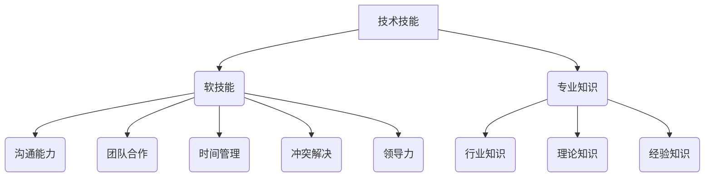

# 技术技能：圆满完成工作需要的实践技能，即“硬技能”，深度的专业领域知识仍然是你的看家本领

> 关键词：技术技能，硬技能，软技能，专业知识，实践能力，职业发展，代码质量，团队协作，持续学习

## 1. 背景介绍

在信息技术快速发展的今天，技术技能（Hard Skills）已经成为职场人士的核心竞争力。硬技能指的是可以量化的、具体的技术能力和知识，如编程语言、数据库管理、数据分析等。它们是完成特定工作任务的必备条件，也是职业发展的基石。然而，仅仅拥有硬技能是远远不够的，软技能（Soft Skills）和专业知识同样重要。本文将探讨如何培养和实践这些技能，以实现职业发展的长远目标。

### 1.1 技术技能的重要性

技术技能是职业发展的敲门砖。在IT行业，掌握一门或几门编程语言、熟悉数据库、网络、云计算等技术，是进入该行业的基本要求。随着技术的不断进步，新技术、新工具层出不穷，对技术技能的要求也在不断提高。

### 1.2 软技能与专业知识的重要性

软技能是指在人际交往、团队协作、沟通表达等方面的能力，如时间管理、团队合作、冲突解决等。专业知识则是对特定领域的深入理解和研究，它有助于提升问题解决能力和创新思维。

### 1.3 技术技能、软技能与专业知识的关系

技术技能、软技能和专业知识是相辅相成的。技术技能是基础，软技能是关键，专业知识是深度。只有三者兼备，才能在职场中游刃有余，实现个人价值。

## 2. 核心概念与联系

### 2.1 技术技能

技术技能可以分为以下几类：

- 编程语言：如Python、Java、C++等。
- 数据库：如MySQL、Oracle、MongoDB等。
- 网络：如TCP/IP、HTTP、DNS等。
- 云计算：如AWS、Azure、Google Cloud等。
- 人工智能：如机器学习、深度学习、自然语言处理等。

### 2.2 软技能

软技能可以分为以下几类：

- 沟通能力：清晰、准确地表达自己的观点，倾听他人的意见。
- 团队合作：与他人协同工作，共同完成任务。
- 时间管理：合理安排时间，提高工作效率。
- 冲突解决：面对冲突时，能够冷静应对，找到解决问题的方法。
- 领导力：带领团队完成任务，激发团队成员的潜力。

### 2.3 专业知识

专业知识包括：

- 行业知识：对所在行业的了解，包括行业趋势、竞争格局等。
- 理论知识：对专业领域的理论框架和概念的理解。
- 经验知识：通过实践积累的经验，对问题的解决方法。

### 2.4 Mermaid 流程图



从流程图中可以看出，技术技能是软技能和专业知识的基础，而软技能和专业知识又相互促进，共同构成一个完整的技能体系。

## 3. 核心算法原理 & 具体操作步骤

### 3.1 算法原理概述

本文将重点介绍如何培养和实践技术技能、软技能和专业知识。

### 3.2 算法步骤详解

#### 3.2.1 培养技术技能

1. 学习基础知识：掌握一门或多门编程语言，熟悉相关技术框架和工具。
2. 实践项目：通过实际项目锻炼编程能力，解决实际问题。
3. 持续学习：关注新技术、新工具的发展，不断更新自己的知识体系。

#### 3.2.2 培养软技能

1. 培养沟通能力：多与他人交流，提高表达和倾听能力。
2. 增强团队合作：参与团队项目，学会与他人协作。
3. 提高时间管理：合理安排时间，提高工作效率。
4. 学习冲突解决：面对冲突时，保持冷静，寻找解决问题的方法。
5. 锻炼领导力：带领团队完成任务，激发团队成员的潜力。

#### 3.2.3 深化专业知识

1. 学习行业知识：关注行业动态，了解行业趋势。
2. 研究理论知识：深入学习专业领域的理论框架和概念。
3. 积累经验知识：通过实践积累经验，提高问题解决能力。

### 3.3 算法优缺点

#### 3.3.1 优点

- 提升个人竞争力：拥有全面的技能体系，有助于在职场中脱颖而出。
- 提高工作效率：掌握多种技能，能够快速应对各种问题。
- 促进职业发展：为职业晋升和转型提供更多机会。

#### 3.3.2 缺点

- 需要持续学习：技术更新迅速，需要不断学习新知识和技能。
- 培养周期长：软技能和专业知识需要长时间的积累和实践。
- 培养成本高：参加培训、学习资料等都需要一定的成本投入。

### 3.4 算法应用领域

技术技能、软技能和专业知识在各个行业都有广泛的应用。以下是一些典型的应用领域：

- IT行业：软件开发、数据分析、网络安全、云计算等。
- 金融行业：风险管理、量化投资、金融科技等。
- 制造业：工业自动化、智能制造、供应链管理等。
- 医疗行业：医疗信息化、远程医疗、基因测序等。

## 4. 数学模型和公式 & 详细讲解 & 举例说明

### 4.1 数学模型构建

本文将使用一个简单的模型来描述技术技能、软技能和专业知识之间的关系。

设 $H$ 表示个人技能体系，$H = (T, S, K)$，其中 $T$ 表示技术技能，$S$ 表示软技能，$K$ 表示专业知识。则技能体系 $H$ 的价值 $V(H)$ 可以表示为：

$$
V(H) = f(T, S, K)
$$

其中 $f$ 表示一种函数关系，可以根据具体情况进行调整。

### 4.2 公式推导过程

公式 $V(H) = f(T, S, K)$ 的推导过程如下：

- 技术技能 $T$ 可以提高工作效率，降低成本，因此对价值 $V(H)$ 有正向影响。
- 软技能 $S$ 可以提高团队协作能力，降低冲突，因此对价值 $V(H)$ 有正向影响。
- 专业知识 $K$ 可以提高问题解决能力，促进创新，因此对价值 $V(H)$ 有正向影响。

### 4.3 案例分析与讲解

假设有两位工程师A和B，他们的技能体系分别为 $H_A = (T_A, S_A, K_A)$ 和 $H_B = (T_B, S_B, K_B)$。其中，$T_A > T_B$，$S_A < S_B$，$K_A = K_B$。

根据公式 $V(H) = f(T, S, K)$，我们可以得出 $V(H_A) < V(H_B)$。这说明，虽然A在技术技能上优于B，但B在软技能上具有优势，因此其整体技能体系价值更高。

## 5. 项目实践：代码实例和详细解释说明

### 5.1 开发环境搭建

以Python编程语言为例，介绍如何搭建开发环境。

1. 安装Python：从Python官网下载安装包并安装Python。
2. 安装PyCharm：安装PyCharm IDE，用于代码编写和调试。
3. 安装相关库：使用pip命令安装必要的Python库，如NumPy、Pandas等。

### 5.2 源代码详细实现

以下是一个简单的Python程序，用于计算两个数的和：

```python
def add_numbers(a, b):
    return a + b

result = add_numbers(3, 4)
print(result)
```

### 5.3 代码解读与分析

- `def add_numbers(a, b):` 定义了一个名为 `add_numbers` 的函数，接受两个参数 `a` 和 `b`。
- `return a + b` 返回两个参数的和。
- `result = add_numbers(3, 4)` 调用 `add_numbers` 函数，计算3和4的和，并将结果赋值给变量 `result`。
- `print(result)` 打印变量 `result` 的值，即 7。

### 5.4 运行结果展示

运行上述代码，控制台输出结果为：

```
7
```

## 6. 实际应用场景

### 6.1 IT行业

在IT行业，技术技能、软技能和专业知识是完成软件开发、系统维护、网络安全等任务的必备条件。以下是一些具体的应用场景：

- 软件开发：编写代码、调试程序、测试软件等。
- 系统维护：监控系统运行状态、修复系统故障、优化系统性能等。
- 网络安全：分析网络安全威胁、防范网络攻击、修复安全漏洞等。

### 6.2 金融行业

在金融行业，技术技能、软技能和专业知识是完成风险管理、量化投资、金融科技等任务的必备条件。以下是一些具体的应用场景：

- 风险管理：分析市场风险、信用风险、操作风险等。
- 量化投资：使用数学模型进行投资决策、设计投资策略等。
- 金融科技：开发金融产品、创新金融服务等。

## 7. 工具和资源推荐

### 7.1 学习资源推荐

- Coursera、edX等在线教育平台
- GitHub、Stack Overflow等开发者社区
- TechCrunch、CSDN等科技媒体

### 7.2 开发工具推荐

- PyCharm、Visual Studio Code等集成开发环境
- Git、SVN等版本控制系统
- Docker、Kubernetes等容器化工具

### 7.3 相关论文推荐

- 《深度学习》
- 《机器学习》
- 《人工智能：一种现代的方法》

## 8. 总结：未来发展趋势与挑战

### 8.1 研究成果总结

本文介绍了技术技能、软技能和专业知识的重要性，分析了它们之间的关系，并探讨了如何培养和实践这些技能。通过实际案例和代码示例，展示了如何将理论应用于实践。

### 8.2 未来发展趋势

随着人工智能、大数据等技术的不断发展，未来技术技能、软技能和专业知识将更加重要。以下是一些发展趋势：

- 技术技能：人工智能、大数据、云计算等领域的技术将持续快速发展，对相关技术技能的需求将不断增长。
- 软技能：团队合作、沟通表达、领导力等软技能在职场中的重要性将进一步提升。
- 专业知识：行业知识、理论知识、经验知识等专业知识将成为职场人士的核心竞争力。

### 8.3 面临的挑战

在培养和实践技术技能、软技能和专业知识的过程中，我们也将面临以下挑战：

- 技术更新迅速，需要不断学习新知识和技能。
- 软技能和专业知识需要长时间的积累和实践。
- 培养成本高，需要投入时间和精力。

### 8.4 研究展望

为了应对未来挑战，我们需要：

- 加强终身学习意识，不断提升自己的技术能力和知识水平。
- 注重实践，将理论知识应用于实际工作中。
- 培养良好的学习习惯，善于总结和反思。

通过不断努力，我们一定能够成为具备全面技能的职场精英。

## 9. 附录：常见问题与解答

**Q1：技术技能和软技能哪个更重要？**

A：技术技能和软技能同等重要，它们是相辅相成的。技术技能是完成工作的基础，软技能是提高工作效率、提升团队合作能力的关键。

**Q2：如何平衡工作和学习时间？**

A：合理安排时间，将工作时间和学习时间进行合理分配。利用碎片化时间进行学习，提高学习效率。

**Q3：如何提高沟通能力？**

A：多与他人交流，提高自己的表达能力。学习倾听他人意见，培养同理心。

**Q4：如何积累经验知识？**

A：通过实际工作经验积累，参加培训课程，阅读相关书籍和资料。

**Q5：如何选择适合自己的学习资源？**

A：根据个人兴趣和职业发展需求，选择合适的学习资源。可以通过网络、书籍、课程等多种途径进行学习。

作者：禅与计算机程序设计艺术 / Zen and the Art of Computer Programming