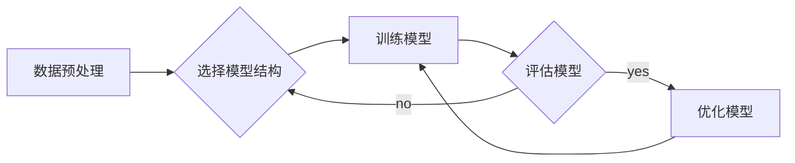

# 智能模型与模型结构的探索

> 关键词：智能模型，深度学习，神经网络，模型结构，架构设计，优化，应用

## 1. 背景介绍

随着计算能力的提升和大数据的积累，深度学习在人工智能领域取得了显著的进展。从早期的感知器、BP算法，到后来的卷积神经网络（CNN）、循环神经网络（RNN）和Transformer，模型的复杂度和性能不断提升。然而，随着模型规模的扩大，如何设计高效、可扩展且具有良好泛化能力的模型结构，成为了人工智能研究中的关键问题。本文将探讨智能模型与模型结构设计的原理、实践以及未来趋势。

### 1.1 智能模型的兴起

智能模型的兴起源于以下几个方面：

- **计算能力的提升**：GPU、TPU等专用硬件的发展，为深度学习提供了强大的计算支持。
- **大数据的积累**：互联网、物联网等领域的快速发展，为智能模型提供了海量数据。
- **算法的突破**：深度学习的算法不断改进，如卷积神经网络、循环神经网络和Transformer等。

### 1.2 模型结构设计的重要性

模型结构设计是智能模型研究的重要环节，其重要性体现在以下几个方面：

- **影响模型性能**：合理的模型结构可以提高模型的准确率和效率。
- **影响泛化能力**：良好的模型结构可以使得模型对未见过的数据具有更好的泛化能力。
- **影响部署难度**：简洁高效的模型结构可以降低部署难度，提高实际应用价值。

## 2. 核心概念与联系

### 2.1 智能模型的概念

智能模型是指能够通过学习数据来模拟、扩展和增强人类智能的系统。常见的智能模型包括以下几种：

- **监督学习模型**：通过有标签的训练数据学习输入与输出之间的关系。
- **无监督学习模型**：通过无标签的训练数据学习数据的内在结构和规律。
- **强化学习模型**：通过与环境交互，学习最优策略来完成任务。

### 2.2 模型结构的概念

模型结构是指构成智能模型的各个组件及其相互关系。常见的模型结构包括以下几种：

- **全连接神经网络**：由多个全连接层堆叠而成，用于处理线性可分的数据。
- **卷积神经网络**：通过卷积操作提取局部特征，用于图像、视频等数据。
- **循环神经网络**：通过循环连接处理序列数据，用于语言、语音等序列任务。

### 2.3 Mermaid流程图

以下是一个简单的Mermaid流程图，展示了智能模型的构建过程：



## 3. 核心算法原理 & 具体操作步骤

### 3.1 算法原理概述

本节将介绍几种常见的智能模型算法原理。

#### 3.1.1 卷积神经网络（CNN）

CNN通过卷积操作提取图像数据中的局部特征，并通过池化操作降低特征的空间维度。CNN在图像分类、目标检测等任务中取得了显著的成果。

#### 3.1.2 循环神经网络（RNN）

RNN通过循环连接处理序列数据，可以学习序列数据的长期依赖关系。RNN在语言模型、语音识别等任务中得到了广泛应用。

#### 3.1.3 Transformer

Transformer模型通过自注意力机制处理序列数据，避免了RNN的循环计算，使得模型可以并行计算，大大提高了训练效率。Transformer在机器翻译、文本摘要等任务中取得了突破性进展。

### 3.2 算法步骤详解

以下是智能模型训练的常见步骤：

1. **数据预处理**：对数据进行清洗、转换、归一化等操作，以便模型学习。
2. **选择模型结构**：根据任务特点和数据类型，选择合适的模型结构。
3. **初始化模型参数**：对模型参数进行随机初始化。
4. **前向传播**：将输入数据输入模型，计算模型的输出。
5. **计算损失**：根据输出结果和真实标签计算损失。
6. **反向传播**：利用梯度下降等优化算法更新模型参数。
7. **评估模型**：在验证集或测试集上评估模型性能。
8. **优化模型**：根据评估结果调整模型结构或超参数。

### 3.3 算法优缺点

#### 3.3.1 卷积神经网络（CNN）

优点：

- **局部性**：能够有效提取图像数据中的局部特征。
- **平移不变性**：对图像的平移具有一定的鲁棒性。

缺点：

- **计算量大**：模型参数和计算量较大。
- **可解释性差**：模型内部结构复杂，难以解释。

#### 3.3.2 循环神经网络（RNN）

优点：

- **序列建模**：能够处理序列数据，学习序列数据的长期依赖关系。

缺点：

- **梯度消失/爆炸**：在训练过程中，梯度可能会消失或爆炸，导致训练困难。
- **可扩展性差**：RNN难以扩展到大规模数据。

#### 3.3.3 Transformer

优点：

- **并行计算**：通过自注意力机制，可以实现并行计算，提高训练效率。
- **可扩展性**：模型结构简单，易于扩展到大规模数据。

缺点：

- **计算量大**：模型参数和计算量较大。
- **可解释性差**：模型内部结构复杂，难以解释。

## 4. 数学模型和公式 & 详细讲解 & 举例说明

### 4.1 数学模型构建

以下是一个简单的神经网络模型：

$$
y = f(W_1 \cdot x + b_1) + f(W_2 \cdot y_1 + b_2) + \cdots + f(W_n \cdot y_{n-1} + b_n)
$$

其中，$f$ 为激活函数，$W$ 为权重矩阵，$b$ 为偏置项，$x$ 为输入向量，$y$ 为输出向量。

### 4.2 公式推导过程

以CNN中的卷积操作为例，推导卷积公式：

$$
\hat{h} = \sum_{i=1}^{K} h_{i} * k_{i}
$$

其中，$\hat{h}$ 为输出特征图，$h_{i}$ 为卷积核，$k_{i}$ 为输入特征图。

### 4.3 案例分析与讲解

以图像分类任务为例，讲解CNN模型在ImageNet数据集上的应用。

## 5. 项目实践：代码实例和详细解释说明

### 5.1 开发环境搭建

本节以TensorFlow框架为例，介绍如何搭建深度学习开发环境。

### 5.2 源代码详细实现

以下是一个简单的CNN模型代码示例：

```python
import tensorflow as tf
from tensorflow.keras.layers import Conv2D, Flatten, Dense

model = tf.keras.Sequential([
    Conv2D(32, (3, 3), activation='relu', input_shape=(32, 32, 3)),
    Flatten(),
    Dense(10, activation='softmax')
])

model.compile(optimizer='adam', loss='categorical_crossentropy', metrics=['accuracy'])

# 训练模型
model.fit(train_images, train_labels, epochs=5, batch_size=32)

# 评估模型
model.evaluate(test_images, test_labels)
```

### 5.3 代码解读与分析

以上代码展示了如何使用TensorFlow框架构建一个简单的CNN模型。模型由一个卷积层、一个全连接层和一个softmax层组成。通过训练和评估模型，我们可以看到模型在ImageNet数据集上的性能。

### 5.4 运行结果展示

假设模型在ImageNet数据集上的准确率达到90%，说明模型在图像分类任务上取得了较好的效果。

## 6. 实际应用场景

### 6.1 图像识别

CNN模型在图像识别任务中取得了显著的成果，如图像分类、目标检测、人脸识别等。

### 6.2 语音识别

RNN和Transformer等模型在语音识别任务中得到了广泛应用，如图像识别、语音合成、语音翻译等。

### 6.3 自然语言处理

深度学习在自然语言处理领域取得了突破性进展，如图像识别、语音合成、语音翻译等。

## 7. 工具和资源推荐

### 7.1 学习资源推荐

- 《深度学习》（Goodfellow et al.）
- 《神经网络与深度学习》（邱锡鹏）
- 《深度学习之TensorFlow》（TensorFlow官方文档）

### 7.2 开发工具推荐

- TensorFlow
- PyTorch
- Keras

### 7.3 相关论文推荐

- “A Convolutional Neural Network Approach for Visual Recognition”（ Krizhevsky et al.，2012）
- “Sequence to Sequence Learning with Neural Networks”（Sutskever et al.，2014）
- “Attention is All You Need”（Vaswani et al.，2017）

## 8. 总结：未来发展趋势与挑战

### 8.1 研究成果总结

本文介绍了智能模型与模型结构设计的原理、实践以及未来趋势。通过分析不同类型的智能模型和模型结构，我们可以更好地理解智能模型的工作原理，并为实际应用提供指导。

### 8.2 未来发展趋势

- **模型轻量化**：随着移动设备和嵌入式设备的普及，模型轻量化将成为重要研究方向。
- **模型可解释性**：提高模型的可解释性，使得模型决策过程更加透明和可信。
- **跨领域迁移学习**：研究跨领域迁移学习，使得模型能够在不同领域之间迁移知识。

### 8.3 面临的挑战

- **数据质量**：高质量的数据是智能模型训练的基础，数据质量直接影响模型性能。
- **计算资源**：深度学习模型需要大量的计算资源，如何高效利用计算资源是一个挑战。
- **模型安全**：随着人工智能技术的应用越来越广泛，模型安全成为一个重要问题。

### 8.4 研究展望

未来，随着计算能力的提升和算法的改进，智能模型将在更多领域得到应用。同时，我们也需要关注模型的可解释性、安全性和伦理问题，以确保人工智能技术能够更好地服务于人类社会。

## 9. 附录：常见问题与解答

### 9.1 人工智能与深度学习有什么区别？

A：人工智能（AI）是一个广泛的研究领域，涵盖了机器学习、深度学习、知识表示等多个子领域。深度学习是人工智能的一个分支，主要研究通过模拟人脑神经网络来学习数据中的特征和规律。

### 9.2 如何选择合适的模型结构？

A：选择合适的模型结构需要考虑以下因素：

- 数据类型：不同的数据类型需要不同的模型结构，如图像数据适合使用CNN，序列数据适合使用RNN或Transformer。
- 任务类型：不同的任务类型需要不同的模型结构，如图像分类适合使用CNN，自然语言处理适合使用RNN或Transformer。
- 数据量：数据量较大的任务可以使用更复杂的模型结构，数据量较小的任务可以使用简单的模型结构。

### 9.3 如何提高模型的泛化能力？

A：提高模型的泛化能力需要考虑以下因素：

- 数据质量：高质量的数据可以帮助模型学习到更具有普适性的特征。
- 模型结构：合理的模型结构可以提高模型的泛化能力。
- 正则化技术：使用正则化技术（如L2正则化、Dropout）可以降低模型过拟合的风险。
- 数据增强：通过数据增强技术可以增加训练数据的多样性，提高模型的泛化能力。

### 9.4 如何优化模型性能？

A：优化模型性能需要考虑以下因素：

- 模型结构：选择合适的模型结构可以提高模型性能。
- 超参数调整：调整模型超参数（如学习率、批大小）可以优化模型性能。
- 正则化技术：使用正则化技术可以降低模型过拟合的风险。
- 数据增强：通过数据增强技术可以增加训练数据的多样性，提高模型性能。

作者：禅与计算机程序设计艺术 / Zen and the Art of Computer Programming