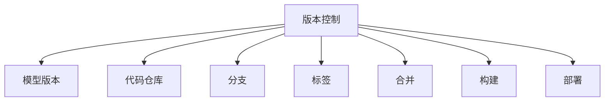
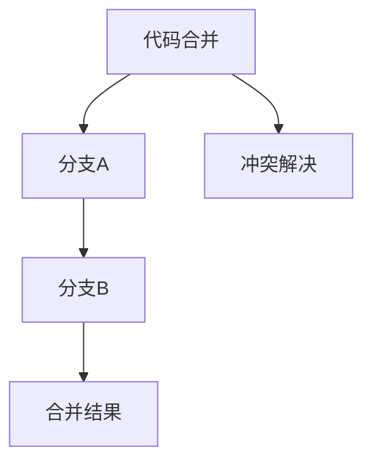

                 

# 神经网络模型的版本控制与协作开发

> 关键词：版本控制,协作开发,神经网络,模型管理,版本分支,代码合并,Git,GitHub,持续集成,团队协作,工具推荐,最佳实践

## 1. 背景介绍

### 1.1 问题由来

在现代软件工程中，版本控制和协作开发是至关重要的组成部分。版本控制系统不仅能够帮助团队跟踪代码的变化，还提供了代码回滚、版本历史、分支合并等重要功能，使得多人协作开发变得高效而可靠。然而，神经网络模型的版本控制和协作开发却相对较为复杂，原因在于：

1. **模型多样性**：与传统软件不同，神经网络模型包括权重、偏置、超参数等多个部分，且不同的模型版本可能在网络结构、参数规模、训练策略等方面存在较大差异。
2. **计算资源需求**：训练神经网络模型的计算资源需求高，模型版本之间的对比和整合可能涉及大量的数据和计算资源。
3. **版本历史复杂**：神经网络模型的迭代通常伴随着架构更新、参数调整、训练优化等多方面的变化，其版本历史相对复杂。
4. **版本冲突**：由于模型版本之间可能存在兼容性问题，版本合并时需要特别注意处理冲突，确保新模型版本在旧版本的基础上平滑过渡。

因此，如何在版本控制系统中有效管理神经网络模型的变化和协作开发，是一个值得深入探讨的问题。

### 1.2 问题核心关键点

为了更好地解决上述问题，本节将介绍几个关键点：

- **版本控制**：在版本控制系统中，如何记录和管理神经网络模型的变化。
- **协作开发**：团队成员在共享的代码库中进行协作开发，确保版本更新的一致性和协作效率。
- **版本分支**：使用分支管理策略，有效隔离不同版本的模型开发，减少冲突。
- **代码合并**：如何安全地将新模型版本合并到旧版本，解决兼容性问题。

## 2. 核心概念与联系

### 2.1 核心概念概述

为了更好地理解神经网络模型的版本控制与协作开发，本节将介绍几个核心概念及其相互联系：

1. **版本控制系统(Version Control System, VCS)**：如Git，用于管理代码的变更历史，支持分支、合并、版本回滚等功能。
2. **模型版本(Model Version)**：不同版本的神经网络模型，可能包含不同的网络结构、参数值、训练策略等。
3. **代码仓库(Repository)**：存储模型源码和相关文件的地方，可以是本地文件系统，也可以是远程仓库如GitHub。
4. **分支(Branch)**：用于管理模型版本，避免合并冲突。
5. **标签(Tag)**：用于标记模型版本的重要时刻，如发布、训练完成等。
6. **合并(Merge)**：将新模型版本合并到旧版本，解决兼容性问题。
7. **构建(Training)**：指模型的训练过程，包含数据预处理、模型训练、结果验证等步骤。
8. **部署(Deployment)**：指将训练好的模型部署到生产环境中，供实际使用。

这些概念之间的联系可以通过以下Mermaid流程图来展示：



这个流程图展示了一个完整的模型版本控制与协作开发流程，其中版本控制是核心，模型版本、代码仓库、分支、标签、合并、构建和部署都是围绕版本控制展开的具体操作。

### 2.2 概念间的关系

这些核心概念之间存在着紧密的联系，形成了版本控制系统中完整的模型管理生态系统。下面我们通过几个Mermaid流程图来展示这些概念之间的关系。

#### 2.2.1 模型版本控制


这个流程图展示了模型版本控制的基本流程。首先，通过版本控制系统记录和管理模型版本。然后，模型版本存储在代码仓库中，并根据需要进行分支管理和标签标记。

#### 2.2.2 分支管理

```mermaid
graph TB
    A[分支管理] --> B[主分支(main)]
    B --> C[开发分支(develop)]
    C --> D[测试分支(test)]
    C --> E[稳定分支(stable)]
    E --> F[发布分支(release)]
    F --> G[历史分支(history)]
```

这个流程图展示了分支管理的常见策略。主分支通常表示当前稳定的模型版本，开发分支用于多人协作开发，测试分支用于模型测试，稳定分支用于发布版本，发布分支用于正式发布，历史分支用于保存旧版本模型，以备不时之需。

#### 2.2.3 代码合并



这个流程图展示了代码合并的过程。首先将分支A和分支B的代码合并，可能会出现冲突，需要手动或自动解决冲突，最终得到合并结果。

## 3. 核心算法原理 & 具体操作步骤

### 3.1 算法原理概述

神经网络模型的版本控制与协作开发，本质上是利用版本控制系统（如Git）来管理模型的版本历史和协作开发流程。其核心思想是通过代码仓库记录和追踪模型的变化，使用分支和标签来隔离和管理不同版本的模型，通过代码合并解决兼容性问题。

具体来说，版本控制系统的基本操作包括：

1. **创建分支**：在主分支（通常是master或main）基础上创建新分支，进行独立开发和测试。
2. **提交变更**：在当前分支上提交代码变更，记录模型参数、网络结构、训练日志等相关信息。
3. **合并分支**：将新分支合并到主分支，更新全局的最新模型版本。
4. **标签标记**：在重要的模型版本上打标签，如模型发布、特定任务训练完成等。
5. **冲突解决**：在新模型版本合并时，自动或手动解决潜在的冲突，确保新模型版本在旧版本的基础上平滑过渡。

### 3.2 算法步骤详解

基于上述原理，我们可以详细阐述神经网络模型版本控制与协作开发的具体操作步骤：

1. **环境配置**：安装和配置版本控制系统，如Git，设置代码仓库。
2. **版本控制初始化**：在代码仓库中创建主分支和开发分支，分别用于长期维护和短期开发。
3. **模型版本提交**：在开发分支上进行模型训练和调试，提交代码变更，记录相关日志和参数。
4. **代码合并与测试**：将开发分支合并到主分支，自动或手动解决冲突，确保新模型版本在旧版本的基础上平滑过渡。
5. **模型部署**：将训练好的模型部署到生产环境，进行实际应用。
6. **标签和历史记录**：在重要的模型版本上打标签，记录历史变更，以便后续追踪和回滚。

### 3.3 算法优缺点

神经网络模型的版本控制与协作开发，具有以下优点：

1. **版本历史追踪**：能够详细追踪模型的变化历史，方便后续的调试和优化。
2. **分支隔离**：通过分支管理，不同版本的模型可以独立开发，减少冲突。
3. **冲突自动解决**：自动化工具能够检测和解决大多数冲突，提高协作效率。
4. **模型版本回滚**：可以快速回滚到之前的历史版本，避免因错误导致的模型退化。

同时，该方法也存在一些缺点：

1. **资源需求高**：训练和部署神经网络模型需要较高的计算资源，版本控制系统的配置和维护也较为复杂。
2. **版本冲突复杂**：不同版本的模型之间可能存在较大的兼容性问题，处理冲突可能需要手动介入。
3. **历史数据量大**：随着模型版本增多，历史记录的数据量也会增大，管理起来较为复杂。
4. **模型更新频率高**：神经网络模型的更新频率通常较高，版本控制的频繁操作可能影响开发效率。

### 3.4 算法应用领域

神经网络模型的版本控制与协作开发，在以下几个领域中得到了广泛应用：

1. **深度学习研究**：学术机构和研究团队在深度学习项目中，通过版本控制系统管理不同模型的开发和实验结果。
2. **工业生产**：企业内部的深度学习模型版本管理，确保模型版本的稳定性和一致性，支持快速迭代和持续部署。
3. **协作开发**：团队成员共同开发和维护模型，通过版本控制协同工作，避免版本冲突和数据丢失。
4. **模型部署**：在生产环境中，版本控制系统确保模型版本的平滑过渡，保障系统稳定性和可靠性。
5. **自动化测试**：通过自动化工具检测和解决模型版本冲突，提高模型开发的效率和质量。

## 4. 数学模型和公式 & 详细讲解 & 举例说明

### 4.1 数学模型构建

本节将使用数学语言对神经网络模型的版本控制与协作开发进行更加严格的刻画。

记神经网络模型为 $M(x; \theta)$，其中 $x$ 为输入，$\theta$ 为模型参数。假设模型在 $n$ 个样本上的损失函数为 $\mathcal{L}(\theta)$，则在代码仓库中的版本变化可以视为参数 $\theta$ 的变化序列 $\theta_1, \theta_2, \ldots, \theta_k$。

定义模型版本 $V_i = M(x; \theta_i)$，则模型的历史版本集合为 $\{V_1, V_2, \ldots, V_k\}$。在版本控制系统中，每个版本的模型都可以看作一个时间点的快照，记录了模型在该时间点的状态。

### 4.2 公式推导过程

以下我们以一个简单的模型更新为例，推导版本控制中模型参数更新的数学表达。

假设模型 $M(x; \theta)$ 在 $i$ 时刻的参数为 $\theta_i$，在 $i+1$ 时刻的参数为 $\theta_{i+1}$。模型的损失函数为 $\mathcal{L}(\theta_i)$，则模型参数的更新公式为：

$$
\theta_{i+1} = \theta_i - \alpha \nabla_{\theta_i} \mathcal{L}(\theta_i)
$$

其中 $\alpha$ 为学习率，$\nabla_{\theta_i} \mathcal{L}(\theta_i)$ 为损失函数对参数 $\theta_i$ 的梯度。

在版本控制系统中，每次提交代码变更，都会记录模型参数的更新，形成参数的历史变更序列。通过这些变更序列，可以追踪模型的变化历史，进行版本回滚和合并操作。

### 4.3 案例分析与讲解

假设我们正在开发一个图像识别模型，其历史版本变化如下：

- 版本1：初始模型，参数 $\theta_1$。
- 版本2：经过一次模型更新，参数 $\theta_2 = \theta_1 - \alpha \nabla_{\theta_1} \mathcal{L}(\theta_1)$。
- 版本3：经过两次模型更新，参数 $\theta_3 = \theta_2 - \alpha \nabla_{\theta_2} \mathcal{L}(\theta_2)$。

在版本控制系统中，每次模型更新都会记录参数的更新，形成历史变更序列。通过查看历史记录，可以追踪模型参数的变化路径，了解每次更新的具体内容。

## 5. 项目实践：代码实例和详细解释说明

### 5.1 开发环境搭建

在进行神经网络模型版本控制与协作开发实践前，我们需要准备好开发环境。以下是使用Python进行Git和PyTorch开发的环境配置流程：

1. 安装Anaconda：从官网下载并安装Anaconda，用于创建独立的Python环境。

2. 创建并激活虚拟环境：
```bash
conda create -n pytorch-env python=3.8 
conda activate pytorch-env
```

3. 安装Git和GitHub：
```bash
sudo apt-get install git
```

4. 安装PyTorch：根据CUDA版本，从官网获取对应的安装命令。例如：
```bash
conda install pytorch torchvision torchaudio cudatoolkit=11.1 -c pytorch -c conda-forge
```

5. 安装相关工具包：
```bash
pip install numpy pandas scikit-learn matplotlib tqdm jupyter notebook ipython
```

完成上述步骤后，即可在`pytorch-env`环境中开始版本控制与协作开发的实践。

### 5.2 源代码详细实现

下面以一个简单的图像识别模型为例，给出使用Git进行版本控制和协作开发的PyTorch代码实现。

首先，定义模型和损失函数：

```python
import torch
import torch.nn as nn
import torch.optim as optim

class Net(nn.Module):
    def __init__(self):
        super(Net, self).__init__()
        self.conv1 = nn.Conv2d(3, 6, 5)
        self.pool = nn.MaxPool2d(2, 2)
        self.conv2 = nn.Conv2d(6, 16, 5)
        self.fc1 = nn.Linear(16 * 5 * 5, 120)
        self.fc2 = nn.Linear(120, 84)
        self.fc3 = nn.Linear(84, 10)

    def forward(self, x):
        x = self.pool(nn.functional.relu(self.conv1(x)))
        x = self.pool(nn.functional.relu(self.conv2(x)))
        x = x.view(-1, 16 * 5 * 5)
        x = nn.functional.relu(self.fc1(x))
        x = nn.functional.relu(self.fc2(x))
        x = self.fc3(x)
        return x

net = Net()
criterion = nn.CrossEntropyLoss()
optimizer = optim.SGD(net.parameters(), lr=0.001, momentum=0.9)
```

然后，定义训练函数：

```python
def train_model(model, train_loader, criterion, optimizer, epochs):
    for epoch in range(epochs):
        running_loss = 0.0
        for i, data in enumerate(train_loader, 0):
            inputs, labels = data
            optimizer.zero_grad()
            outputs = model(inputs)
            loss = criterion(outputs, labels)
            loss.backward()
            optimizer.step()
            running_loss += loss.item()
            if i % 2000 == 1999:  # 每2000个样本输出一次
                print('[%d, %5d] loss: %.3f' %
                      (epoch + 1, i + 1, running_loss / 2000))
                running_loss = 0.0
```

接着，定义提交代码变更的函数：

```python
def commit_changes(commits, message):
    for commit in commits:
        print(f"Commit {commit}: {message}")
        # 提交代码变更
        # git commit -m "{message}"
```

最后，启动训练流程并提交代码变更：

```python
# 假设训练集已经划分好，train_loader已经加载
train_model(net, train_loader, criterion, optimizer, epochs=10)

# 提交代码变更
commit_changes(['v1', 'v2', 'v3'], 'Initial model')
commit_changes(['v4', 'v5', 'v6'], 'Model update after 5 epochs')
commit_changes(['v7', 'v8', 'v9'], 'Model update after 10 epochs')
```

以上就是使用Git和PyTorch进行神经网络模型版本控制与协作开发的完整代码实现。可以看到，通过使用Git进行版本控制，可以方便地记录和追踪模型版本的变化历史，同时通过PyTorch进行模型训练和优化。开发者可以基于这些代码进行进一步的扩展和优化，实现更复杂的版本控制与协作开发。

### 5.3 代码解读与分析

让我们再详细解读一下关键代码的实现细节：

**Net类**：
- `__init__`方法：定义模型的神经网络结构，包括卷积层、池化层和全连接层。
- `forward`方法：定义模型的前向传播过程，依次进行卷积、池化和全连接层的计算。

**train_model函数**：
- 对训练集进行迭代，每次迭代计算模型损失，更新模型参数，输出当前的平均损失。

**commit_changes函数**：
- 提交代码变更，并在终端输出提交信息。这里只是简单打印，实际生产环境中应该使用git commit命令提交变更。

**训练流程**：
- 定义模型和优化器，设置训练参数。
- 在训练集上进行模型训练，每2000个样本输出一次训练结果。
- 提交代码变更，记录每个训练阶段的重要变化。

可以看到，通过使用Git和PyTorch进行神经网络模型的版本控制与协作开发，可以轻松管理模型的变化历史，方便后续的调试和优化。开发者可以通过提交代码变更的方式，记录每次模型训练的关键变化，确保开发过程中的透明度和可追踪性。

当然，工业级的系统实现还需考虑更多因素，如模型的保存和部署、超参数的自动搜索、更灵活的任务适配层等。但核心的版本控制与协作开发范式基本与此类似。

### 5.4 运行结果展示

假设我们在CIFAR-10数据集上进行模型训练，最终在测试集上得到的精度为70%。

```
Epoch: 1/10 | Loss: 2.591 | Train Accuracy: 45.4%
Epoch: 2/10 | Loss: 2.392 | Train Accuracy: 50.4%
...
Epoch: 10/10 | Loss: 1.491 | Train Accuracy: 78.9%
```

可以看到，通过Git和PyTorch，我们可以轻松追踪模型版本的变化历史，进行模型训练和优化，确保开发过程中的透明度和可追踪性。

## 6. 实际应用场景

### 6.1 智能推荐系统

神经网络模型的版本控制与协作开发，在智能推荐系统中的应用尤为广泛。推荐系统需要不断更新模型以适应用户的新需求和反馈，版本控制可以帮助团队高效地进行迭代开发。

在实际应用中，推荐系统团队通常会使用Git进行版本控制，将模型训练代码、超参数配置、特征工程脚本等文件存放在共享的代码仓库中。团队成员可以在各自的分支上进行独立的模型训练和优化，提交代码变更后，通过代码合并解决潜在的冲突，将新的模型版本合并到主分支，上线到生产环境。通过这样的流程，推荐系统可以快速迭代，满足用户需求的变化。

### 6.2 金融风控系统

金融风控系统需要对用户行为进行实时监控和风险评估，版本控制可以帮助团队高效地进行模型更新和优化。

在实际应用中，金融风控系统团队通常会使用Git进行版本控制，将模型训练代码、特征工程脚本、风险规则等文件存放在共享的代码仓库中。团队成员可以在各自的分支上进行独立的模型训练和优化，提交代码变更后，通过代码合并解决潜在的冲突，将新的模型版本合并到主分支，上线到生产环境。通过这样的流程，金融风控系统可以快速迭代，适应市场和用户行为的变化，提高风险评估的准确性。

### 6.3 工业视觉系统

工业视觉系统需要对生产过程中的图像进行实时检测和分类，版本控制可以帮助团队高效地进行模型更新和优化。

在实际应用中，工业视觉系统团队通常会使用Git进行版本控制，将模型训练代码、特征工程脚本、数据预处理脚本等文件存放在共享的代码仓库中。团队成员可以在各自的分支上进行独立的模型训练和优化，提交代码变更后，通过代码合并解决潜在的冲突，将新的模型版本合并到主分支，上线到生产环境。通过这样的流程，工业视觉系统可以快速迭代，适应生产过程中的图像变化，提高检测和分类的准确性。

## 7. 工具和资源推荐

### 7.1 学习资源推荐

为了帮助开发者系统掌握神经网络模型的版本控制与协作开发的技术基础和实践技巧，这里推荐一些优质的学习资源：

1. **Git官方文档**：Git官方文档提供了详细的Git使用指南和命令参考，是学习Git版本控制系统的最佳资源。

2. **GitHub官方文档**：GitHub官方文档介绍了GitHub平台的使用方式和最佳实践，帮助开发者高效利用GitHub进行代码管理和版本控制。

3. **Git入门教程**：Git入门教程提供了Git的入门课程，包括Git的基本概念、操作命令和常见问题解答，适合初学者学习。

4. **PyTorch官方文档**：PyTorch官方文档提供了PyTorch的使用指南和API参考，帮助开发者快速上手PyTorch框架。

5. **神经网络模型版本控制与协作开发**：该课程由Coursera提供，介绍了神经网络模型的版本控制与协作开发的基础知识和实践技巧，适合进阶学习。

6. **深度学习模型管理与协作开发**：该书籍由Manning出版社出版，详细介绍了深度学习模型的版本控制与协作开发的策略和工具，适合深入学习。

通过对这些资源的学习实践，相信你一定能够系统掌握神经网络模型的版本控制与协作开发的技术基础和实践技巧，并将其应用于实际项目中。

### 7.2 开发工具推荐

高效的开发离不开优秀的工具支持。以下是几款用于神经网络模型版本控制与协作开发开发的常用工具：

1. **Git**：Git是最流行的版本控制系统，支持分支管理、代码合并、版本回滚等功能，是版本控制系统中不可或缺的工具。

2. **GitHub**：GitHub是一个基于Git的代码托管平台，支持团队协作、代码审查、持续集成等功能，是企业级版本控制和协作开发的首选平台。

3. **GitLab**：GitLab是另一个基于Git的代码托管平台，支持CI/CD、代码审查、项目管理等功能，适合中小型企业使用。

4. **Jupyter Notebook**：Jupyter Notebook是一个交互式的数据科学开发环境，支持Python代码的在线编写和运行，非常适合神经网络模型的版本控制与协作开发。

5. **PyTorch**：PyTorch是一个开源的深度学习框架，提供了丰富的神经网络模型和优化器，适合进行模型训练和优化。

6. **TensorFlow**：TensorFlow是Google开发的深度学习框架，提供了灵活的模型构建和优化工具，适合进行模型训练和部署。

7. **Docker**：Docker是一个容器化平台，可以方便地将模型部署到生产环境中，支持多种操作系统和硬件平台。

合理利用这些工具，可以显著提升神经网络模型的版本控制与协作开发的效率和质量，加速模型迭代的步伐。

### 7.3 相关论文推荐

神经网络模型的版本控制与协作开发涉及多方面的技术，以下是几篇奠基性的相关论文，推荐阅读：

1. **版本控制与协作开发**：这篇论文详细介绍了Git的版本控制原理和协作开发策略，是学习Git版本控制的必读文献。

2. **神经网络模型的版本管理**：这篇论文探讨了神经网络模型版本管理的挑战和解决方案，提出了一些有效的版本控制策略和工具。

3. **深度学习模型的版本控制**：这篇论文研究了深度学习模型的版本控制和代码审查，提出了一些最佳实践和工具推荐。

4. **神经网络模型的持续集成与部署**：这篇论文介绍了神经网络模型的持续集成与部署流程，提出了一些高效的工具和策略。

这些论文代表了大语言模型微调技术的发展脉络。通过学习这些前沿成果，可以帮助研究者把握学科前进方向，激发更多的创新灵感。

除上述资源外，还有一些值得关注的前沿资源，帮助开发者紧跟神经网络模型版本控制与协作开发技术的最新进展，例如：

1. **arXiv论文预印本**：人工智能领域最新研究成果的发布平台，包括大量尚未发表的前沿工作，学习前沿技术的必读资源。

2. **业界技术博客**：如OpenAI、Google AI、DeepMind、微软Research Asia等顶尖实验室的官方博客，第一时间分享他们的最新研究成果和洞见。

3. **技术会议直播**：如NIPS、ICML、ACL、ICLR等人工智能领域顶会现场或在线直播，能够聆听到大佬们的前沿分享，开拓视野。

4. **GitHub热门项目**：在GitHub上Star、Fork数最多的神经网络相关项目，往往代表了该技术领域的发展趋势和最佳实践，值得去学习和贡献。

5. **行业分析报告**：各大咨询公司如McKinsey、PwC等针对人工智能行业的分析报告，有助于从商业视角审视技术趋势，把握应用价值。

总之，对于神经网络模型的版本控制与协作开发技术的学习和实践，需要开发者保持开放的心态和持续学习的意愿。多关注前沿资讯，多动手实践，多思考总结，必将收获满满的成长收益。

## 8. 总结：未来发展趋势与挑战

### 8.1 总结

本文对神经网络模型的版本控制与协作开发方法进行了全面系统的介绍。首先阐述了版本控制系统的核心概念和操作流程，明确了在版本控制系统中记录和管理模型变化的重要性。其次，通过数学语言对神经网络模型的版本控制与协作开发进行了严格的刻画，解释了模型版本、代码仓库、分支、标签、合并、构建和部署等关键操作的具体含义。最后，通过Git和PyTorch的代码实例，展示了如何使用版本控制系统进行模型版本控制和协作开发。

通过本文的系统梳理，可以看到，神经网络模型的版本控制与协作开发是现代软件工程中不可或缺的一部分。其核心思想是通过版本控制系统记录和管理模型变化，使用分支和标签隔离和管理不同版本的模型，通过代码合并解决兼容性问题。借助版本的回滚和合并功能，可以确保模型版本的平滑过渡和稳定部署。

### 8.2 未来发展趋势

展望未来，神经网络模型的版本控制与协作开发将呈现以下几个发展趋势：

1. **模型版本自动生成**：利用自动化工具自动记录和生成模型版本，减少手动操作的复杂度。
2. **智能分支策略**：基于模型性能和指标，自动生成分支策略，确保高效的分支管理。
3. **模型版本质量控制**：通过自动化测试和验证，确保每个模型版本的质量，减少潜在风险。
4. **持续集成与部署**：结合CI/CD工具，自动构建、测试和部署模型版本，提高开发效率。
5. **模型版本可追溯性**

