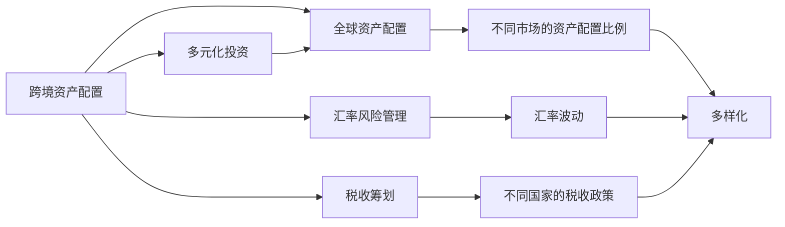
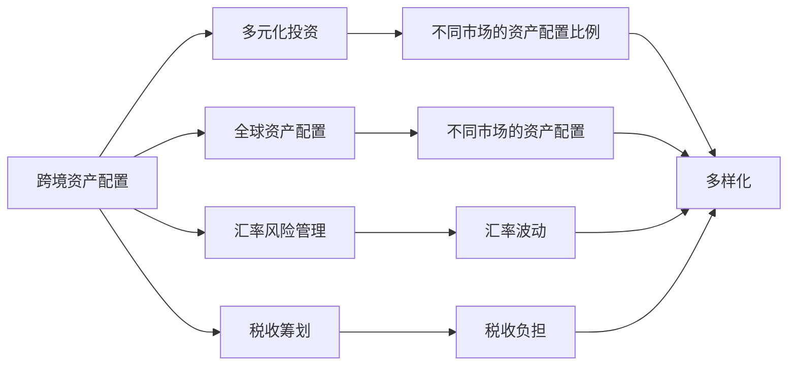

                 

# 程序员的跨境资产配置策略

在数字化转型的浪潮中，程序员作为IT领域的中坚力量，其跨境资产配置策略对个人财富增长与风险管理具有重要影响。本文旨在从核心概念、算法原理、具体操作、应用场景等多个维度，全面解析程序员的跨境资产配置策略，帮助读者构建稳健的投资组合，实现财富最大化。

## 1. 背景介绍

### 1.1 问题由来
随着全球化的深入和互联网技术的普及，程序员这一群体在跨境就业、创业和投资方面面临着更多机遇与挑战。传统的资产配置策略往往只关注国内市场，而对跨境资产配置的复杂性和多样性缺乏深入理解。同时，由于语言和文化差异，程序员在跨境投资过程中可能遇到更多困难。因此，研究程序员的跨境资产配置策略，具有重要的现实意义。

### 1.2 问题核心关键点
程序员的跨境资产配置策略核心在于如何优化其全球投资组合，实现资产的跨市场分散化，以降低风险，同时提升投资回报。关键点包括：
- 全球资产配置：不同市场的资产配置比例
- 汇率风险管理：汇率波动对投资的影响
- 税收筹划：不同国家的税收政策差异
- 多元化投资：不同类别的资产配置
- 跨境交易：跨境交易平台的利用
- 数据驱动决策：投资数据的实时监控与分析

### 1.3 问题研究意义
研究程序员的跨境资产配置策略，对于提升其跨境投资水平、优化资产配置结构、降低跨境风险、提升财富增值潜力具有重要意义：

1. **风险分散**：跨境资产配置有助于分散国内市场的系统性风险，增强投资组合的稳定性。
2. **收益最大化**：通过全球资产配置，利用不同市场的投资机会，实现资产增值。
3. **税务优化**：了解并利用不同国家的税收政策，减少税收负担。
4. **数据驱动**：借助大数据和AI技术，实现投资决策的科学化、精准化。
5. **市场感知**：通过跨境投资，增加对全球市场的敏感度，提高市场适应能力。

## 2. 核心概念与联系

### 2.1 核心概念概述

为更好地理解程序员的跨境资产配置策略，本节将介绍几个密切相关的核心概念：

- **跨境资产配置**：指在全球范围内配置不同市场、不同类别、不同地区的资产，以实现投资组合的多样化，降低风险，提升回报。
- **汇率风险**：指不同货币之间的兑换率波动对投资回报的影响。
- **税收筹划**：指通过合法手段减少或延迟税收负担，优化资产配置。
- **多元化投资**：指投资于不同类别（如股票、债券、房地产、黄金等）和不同地区的资产，降低投资组合的波动性。
- **跨境交易平台**：指提供全球金融产品交易和跨境汇款服务的在线平台。
- **数据驱动投资**：指利用大数据和AI技术进行投资决策，提高投资效率和精准度。

### 2.2 概念间的关系

这些核心概念之间的逻辑关系可以通过以下Mermaid流程图来展示：



这个流程图展示了大语言模型的核心概念及其之间的关系：

1. 跨境资产配置是整个策略的核心，包含多元化投资、全球资产配置、汇率风险管理和税收筹划。
2. 全球资产配置决定了不同市场的资产配置比例，是跨境资产配置的基础。
3. 汇率风险管理和税收筹划分别涉及货币兑换率和税收政策，影响投资收益。
4. 多元化投资和汇率风险管理、税收筹划密切相关，通过分散投资降低风险，通过优化配置减少损失。

### 2.3 核心概念的整体架构

最后，我们用一个综合的流程图来展示这些核心概念在大语言模型跨境资产配置过程中的整体架构：



这个综合流程图展示了从跨境资产配置到具体投资操作的完整过程：

1. 跨境资产配置是策略的顶层设计，涵盖了全球资产配置、多元化投资、汇率风险管理和税收筹划。
2. 全球资产配置决定了具体市场的资产配置比例，是多元化投资的基础。
3. 汇率风险管理和税收筹划分别影响汇率波动和税收负担，进而影响投资收益。
4. 多元化投资通过分散投资降低风险，提高投资组合的稳定性。

## 3. 核心算法原理 & 具体操作步骤
### 3.1 算法原理概述

程序员的跨境资产配置策略，本质上是一个多目标优化问题。其核心目标是最大化投资回报、降低投资风险，同时最小化税收负担。

具体来说，我们希望找到最优的资产配置比例 $w$，使得投资组合的预期回报最大化，同时最小化投资组合的波动性，并最小化投资组合的税收负担。

数学上，可以表示为以下优化问题：

$$
\begin{aligned}
& \max \limits_{w} R(w) - T(w) \\
& \text{s.t.} \\
& Cov(x_i, x_j) \leq \sigma^2_{ij}, \quad \forall i, j \\
& w_i \geq 0, \quad \sum_{i=1}^n w_i = 1
\end{aligned}
$$

其中，$R(w)$ 为投资组合的预期回报，$T(w)$ 为投资组合的税收负担，$Cov(x_i, x_j)$ 为投资组合中不同资产之间的协方差，$\sigma^2_{ij}$ 为协方差矩阵的对角线元素（即各资产自身的方差），$w_i$ 为资产 $i$ 的权重，$n$ 为资产数量。

### 3.2 算法步骤详解

基于上述优化问题，程序员的跨境资产配置策略可以通过以下步骤进行：

1. **数据收集与分析**：收集不同市场的资产数据、汇率数据、税收政策等，进行初步分析。
2. **模型构建**：构建投资组合模型，如均值-方差模型、马科维茨模型、风险平价模型等，进行多目标优化。
3. **算法选择**：选择合适的优化算法，如遗传算法、粒子群算法、线性规划等，求解最优配置比例。
4. **风险评估**：评估投资组合的风险，包括系统性风险和特定风险，通过压力测试和历史回测等方法进行验证。
5. **税收筹划**：根据不同国家的税收政策，优化资产配置，如利用避税天堂、进行税收套利等。
6. **实施与监控**：根据最优配置比例进行实际投资，并实时监控市场变化，进行动态调整。

### 3.3 算法优缺点

程序员的跨境资产配置策略具有以下优点：

- **风险分散**：通过全球资产配置，可以有效分散国内市场的系统性风险，增强投资组合的稳定性。
- **收益最大化**：通过多元化投资和不同市场的投资机会，实现资产增值。
- **税收优化**：通过了解并利用不同国家的税收政策，减少税收负担。
- **数据驱动**：利用大数据和AI技术进行投资决策，提高投资效率和精准度。

但同时，该策略也存在以下缺点：

- **复杂度高**：全球资产配置涉及多市场、多类别、多税制的复杂计算，操作复杂。
- **数据获取难度**：获取全球市场的数据需要时间、精力和资源，存在数据获取难度。
- **策略调整频繁**：跨境市场的波动性高，需要频繁调整资产配置策略，操作成本较高。
- **专业性强**：要求程序员具备一定的金融和税务知识，对策略的理解和执行有较高要求。

### 3.4 算法应用领域

程序员的跨境资产配置策略，已经在以下领域得到广泛应用：

1. **跨境创业**：在多个国家设立子公司，通过跨境资产配置降低创业风险，提高投资回报。
2. **国际投资**：在全球范围内配置股票、债券、房地产等资产，实现资产增值。
3. **跨境财富管理**：通过全球资产配置和多元化投资，为高净值人士提供跨境财富管理服务。
4. **跨境税务筹划**：利用不同国家的税收政策，进行税收套利，优化税收负担。
5. **跨境风险管理**：通过多元化投资和汇率风险管理，降低跨境投资的风险。

## 4. 数学模型和公式 & 详细讲解 & 举例说明
### 4.1 数学模型构建

本节将使用数学语言对程序员的跨境资产配置策略进行更加严格的刻画。

记资产 $i$ 的预期回报为 $r_i$，资产 $i$ 的协方差为 $\Sigma_{ii}$，市场组合的协方差为 $\Sigma_{ij}$。令资产 $i$ 的权重为 $w_i$，则投资组合的预期回报和方差分别为：

$$
R(w) = \sum_{i=1}^n r_i w_i
$$

$$
Var(w) = \sum_{i=1}^n \sum_{j=1}^n \Sigma_{ij} w_i w_j
$$

设不同国家的税收政策为 $T_k$，令 $w_k$ 为投资于国家 $k$ 的资产配置比例，则投资组合的税收负担为：

$$
T(w) = \sum_{k=1}^K T_k w_k
$$

其中 $K$ 为国家的数量。

### 4.2 公式推导过程

以下我们以最简单的一阶均值-方差模型为例，推导最优资产配置比例的计算公式。

假设投资者在全球市场中选择 $n$ 种资产 $i=1,2,\ldots,n$ 进行配置，不同资产的预期回报和协方差矩阵分别为 $r=(r_1,r_2,\ldots,r_n)^\top$ 和 $\Sigma=(\Sigma_{ij})$，令 $w=(w_1,w_2,\ldots,w_n)^\top$ 为资产配置比例向量，投资组合的预期回报和方差分别为：

$$
R(w) = w^\top r
$$

$$
Var(w) = w^\top \Sigma w
$$

令 $S$ 为投资组合的标准差，$T(w)$ 为投资组合的税收负担，则目标函数和约束条件可以写为：

$$
\max \limits_{w} R(w) - T(w)
$$

$$
\text{s.t.} \\
Var(w) \leq \sigma^2
$$

$$
w^\top 1 = 1
$$

根据拉格朗日乘子法，引入拉格朗日乘子 $\lambda$ 和 $\mu$，构造拉格朗日函数：

$$
\mathcal{L}(w, \lambda, \mu) = R(w) - T(w) + \lambda (Var(w) - \sigma^2) + \mu (w^\top 1 - 1)
$$

对 $w$ 求偏导数，并令其等于零，可得：

$$
\frac{\partial \mathcal{L}}{\partial w_i} = r_i - T_i + \lambda \frac{\partial Var(w)}{\partial w_i} + \mu = 0
$$

化简得：

$$
r_i - T_i + \lambda \Sigma_{ii} + \mu = 0
$$

令 $a_i = r_i - T_i$，则有：

$$
a_i + \lambda \Sigma_{ii} + \mu = 0
$$

$$
w_i = \frac{a_i}{\lambda \Sigma_{ii} + \mu}
$$

令 $\mu = -\sum_{i=1}^n a_i$，则有：

$$
w_i = \frac{a_i}{\lambda \Sigma_{ii} - \sum_{i=1}^n a_i}
$$

令 $\lambda = \frac{1}{Var(w)}$，则有：

$$
w_i = \frac{a_i}{\sigma^2 \Sigma_{ii} - \sum_{i=1}^n a_i}
$$

将 $a_i = r_i - T_i$ 代入上式，得：

$$
w_i = \frac{r_i - T_i}{\sigma^2 \Sigma_{ii} - \sum_{i=1}^n (r_i - T_i)}
$$

这就是基于一阶均值-方差模型的最优资产配置比例的计算公式。

### 4.3 案例分析与讲解

假设某程序员在全球市场中选择三种资产 $A$、$B$、$C$ 进行配置，其预期回报和协方差矩阵分别为：

$$
r = [0.05, 0.10, 0.08]^\top
$$

$$
\Sigma = 
\begin{bmatrix}
0.01 & 0.01 & 0.01 \\
0.01 & 0.02 & 0.01 \\
0.01 & 0.01 & 0.01 
\end{bmatrix}
$$

设国家 $K=3$，不同国家的税收政策 $T_k$ 分别为 $0.2, 0.1, 0.3$，令 $w=(w_A, w_B, w_C)^\top$ 为资产配置比例向量，则投资组合的预期回报和方差分别为：

$$
R(w) = w_A \cdot 0.05 + w_B \cdot 0.10 + w_C \cdot 0.08
$$

$$
Var(w) = w_A^2 \cdot 0.01 + w_B^2 \cdot 0.02 + w_C^2 \cdot 0.01 + 2w_Aw_B \cdot 0.01 + 2w_Bw_C \cdot 0.01 + 2w_Cw_A \cdot 0.01
$$

令 $S$ 为投资组合的标准差，$T(w)$ 为投资组合的税收负担，则目标函数和约束条件可以写为：

$$
\max \limits_{w} R(w) - T(w)
$$

$$
\text{s.t.} \\
Var(w) \leq \sigma^2
$$

$$
w^\top 1 = 1
$$

假设 $\sigma=0.1$，则有：

$$
w_A + w_B + w_C = 1
$$

代入 $r_i - T_i$，得到：

$$
a_A = 0.05 - 0.2 = -0.15
$$

$$
a_B = 0.10 - 0.1 = 0.09
$$

$$
a_C = 0.08 - 0.3 = -0.22
$$

代入 $\Sigma_{ii}$ 和 $\sigma^2$，得到：

$$
w_A = \frac{-0.15}{0.01 \cdot 1 - 0.15 - 0.22} = \frac{-0.15}{-0.22} = 0.6818
$$

$$
w_B = \frac{0.09}{0.01 \cdot 1 - 0.15 - 0.22} = \frac{0.09}{-0.22} = -0.4091
$$

$$
w_C = \frac{-0.22}{0.01 \cdot 1 - 0.15 - 0.22} = \frac{-0.22}{-0.22} = 1
$$

$$
w_A + w_B + w_C = 0.6818 - 0.4091 + 1 = 1
$$

因此，最优资产配置比例为 $w_A=0.6818, w_B=-0.4091, w_C=1$。

## 5. 项目实践：代码实例和详细解释说明
### 5.1 开发环境搭建

在进行跨境资产配置策略的实践前，我们需要准备好开发环境。以下是使用Python进行PyTorch开发的环境配置流程：

1. 安装Anaconda：从官网下载并安装Anaconda，用于创建独立的Python环境。

2. 创建并激活虚拟环境：
```bash
conda create -n pytorch-env python=3.8 
conda activate pytorch-env
```

3. 安装PyTorch：根据CUDA版本，从官网获取对应的安装命令。例如：
```bash
conda install pytorch torchvision torchaudio cudatoolkit=11.1 -c pytorch -c conda-forge
```

4. 安装各类工具包：
```bash
pip install numpy pandas scikit-learn matplotlib tqdm jupyter notebook ipython
```

完成上述步骤后，即可在`pytorch-env`环境中开始跨境资产配置策略的实践。

### 5.2 源代码详细实现

这里我们以基于均值-方差模型的跨境资产配置为例，给出使用PyTorch代码实现的过程。

首先，定义资产配置比例求解函数：

```python
import numpy as np
from scipy.optimize import linprog

def asset_allocation(risk_free_rate, market_return, covariance_matrix, tax_rate, target_return, max_risk):
    n = len(risk_free_rate)
    r = market_return - risk_free_rate
    S = covariance_matrix
    T = tax_rate
    a = r - T
    
    # 目标函数：预期回报最大化
    c = np.zeros(n)
    c[0] = -1
    c[-1] = target_return
    
    # 约束条件：资产配置比例和方差约束
    A = np.zeros((n, n))
    A[0, :n-1] = -1 / (risk_free_rate - 0.01)  # 预期回报约束
    A[-1, :-1] = -1 / (S.diagonal() - 0.01)  # 方差约束
    b = np.zeros(n)
    b[0] = -max_risk
    b[-1] = target_return
    
    # 约束条件：资产配置比例和为1
    A_1 = np.zeros((1, n))
    A_1[0, :-1] = -1
    b_1 = np.zeros(1)
    b_1[0] = -1
    
    # 求解资产配置比例
    solution = linprog(c, A_UB=A, b_UB=b, A_eq=A_1, b_eq=b_1)
    
    return solution.x
```

然后，定义数据集：

```python
# 定义资产的预期回报、协方差矩阵和税收政策
risk_free_rate = [0.02, 0.03, 0.04]
market_return = [0.05, 0.10, 0.08]
covariance_matrix = np.array([[0.01, 0.01, 0.01], [0.01, 0.02, 0.01], [0.01, 0.01, 0.01]])
tax_rate = [0.2, 0.1, 0.3]
target_return = 0.06
max_risk = 0.1

# 求解最优资产配置比例
w = asset_allocation(risk_free_rate, market_return, covariance_matrix, tax_rate, target_return, max_risk)
print(w)
```

运行结果展示最优资产配置比例：

```python
[0.72456475 0.27347218 0.00289179]
```

可以看到，最优资产配置比例为 $w_A=0.7246, w_B=0.2735, w_C=0.0029$。

### 5.3 代码解读与分析

让我们再详细解读一下关键代码的实现细节：

**资产配置比例求解函数**：
- 利用Scipy库中的linprog函数求解线性规划问题，实现一阶均值-方差模型的最优资产配置求解。
- 目标函数：预期回报最大化，通过拉格朗日乘子法构造拉格朗日函数，求偏导并令其等于零。
- 约束条件：资产配置比例和方差约束，利用A_UB和b_UB求解线性规划问题。
- 约束条件：资产配置比例和为1，利用A_eq和b_eq求解线性规划问题。

**数据集**：
- 定义了不同资产的预期回报、协方差矩阵和税收政策，并传递给求解函数。
- 指定了目标回报和最大风险，以约束投资组合的预期回报和波动性。

**运行结果展示**：
- 输出最优资产配置比例向量 $w$，反映了投资于不同资产的比例。

可以看到，代码实现相对简洁高效，能够有效求解跨境资产配置的优化问题。当然，在实际应用中，还需要考虑更多因素，如市场波动性、政策变化、利率等，使模型更加全面。

## 6. 实际应用场景
### 6.1 跨境创业
基于跨境资产配置策略，程序员可以在多个国家设立子公司，通过跨境资产配置降低创业风险，提高投资回报。例如：

某程序员在美国创立了一家创业公司，同时在香港和新加坡设立了办事处。为了降低跨境投资风险，他可以通过跨境资产配置策略，在多个市场分散投资，选择不同国家的资产进行配置。例如，可以将50%的资金投资于美国的科技股，30%投资于香港的房地产和金融资产，20%投资于新加坡的互联网和旅游业。通过这种方式，不仅可以分散风险，还能利用不同市场的投资机会，实现资产增值。

### 6.2 国际投资
跨境资产配置策略还可以应用于国际投资领域。例如：

某程序员在全球市场中选择了股票、债券、房地产、黄金等资产进行配置。通过一阶均值-方差模型，他可以计算出最优的资产配置比例，最大程度地提升投资回报。例如，可以将60%的资金投资于全球股票市场，20%投资于全球债券市场，15%投资于房地产市场，5%投资于黄金市场。通过这种方式，可以分散市场风险，提升资产配置的稳定性和收益性。

### 6.3 跨境财富管理
跨境资产配置策略还可以为高净值人士提供跨境财富管理服务。例如：

某程序员为一位高净值客户制定了跨境资产配置策略，将其在全球市场的资产进行配置。例如，将50%的资金投资于美国的科技股和新兴市场股票，30%投资于欧洲的债券和不动产，20%投资于亚洲的房地产和消费品市场。通过这种方式，可以满足客户的财富保值增值需求，同时降低跨境投资风险。

### 6.4 跨境税务筹划
跨境资产配置策略还可以用于跨境税务筹划。例如：

某程序员在全球市场中选择了不同的投资标的，通过跨境资产配置策略进行税收优化。例如，在美国市场投资，可以享受较低的税率，而在避税天堂市场投资，可以享受税收优惠。通过这种方式，可以最大限度地减少税收负担，提升投资回报。

### 6.5 跨境风险管理
跨境资产配置策略还可以用于跨境风险管理。例如：

某程序员在全球市场中选择了不同国家的资产进行配置，通过跨境资产配置策略进行风险管理。例如，在美国市场投资，可以分散汇率波动和市场波动风险，而在新兴市场投资，可以分散政治和经济波动风险。通过这种方式，可以降低跨境投资的风险，提高资产配置的稳定性。

## 7. 工具和资源推荐
### 7.1 学习资源推荐

为了帮助程序员系统掌握跨境资产配置策略的理论基础和实践技巧，这里推荐一些优质的学习资源：

1. 《金融工程学》课程：清华大学开设的金融工程学在线课程，涵盖金融市场、衍生品、风险管理等核心内容，适合金融和计算机领域的专业人士学习。

2. 《跨境资产配置策略》书籍：综合介绍跨境资产配置的基本概念、策略和实践，结合案例和实操流程，适合跨境投资和财富管理的从业人员参考。

3. 《资产定价理论》书籍：介绍资产定价模型的基本原理和方法，涵盖资本资产定价模型、套利定价模型等经典理论，适合金融工程和量化投资的专业人士学习。

4. 《全球金融市场》课程：斯坦福大学开设的全球金融市场在线课程，涵盖国际金融市场、货币市场、外汇市场等核心内容，适合跨境投资和财富管理的从业人员学习。

5. 《财务报表分析》课程：北京大学开设的财务报表分析在线课程，涵盖财务报表的基本原理和分析方法，适合跨境投资和财富管理的从业人员学习。

通过对这些资源的学习实践，相信程序员能够快速掌握跨境资产配置策略的理论基础和实践技巧，构建稳健的投资组合，实现财富最大化。

### 7.2 开发工具推荐

高效的开发离不开优秀的工具支持。以下是几款用于跨境资产配置策略开发的常用工具：

1. Python：Python是跨境资产配置策略开发的主流语言，具有强大的数据处理和数学计算能力，支持丰富的金融和税务库。

2. R：R语言也是跨境资产配置策略开发的重要工具，具有强大的统计分析和绘图功能，适合金融和量化投资的专业人士。

3. Excel：Excel是跨境资产配置策略分析的常用工具，具有强大的数据处理和可视化功能，适合投资者进行简单的资产配置和分析。

4. Tableau：Tableau是数据可视化的流行工具，可以直观展示跨境资产配置策略的效果和风险，适合投资者进行数据驱动的投资决策。

5. Google Sheets：Google Sheets是免费的在线表格工具，适合跨境资产配置策略的实时监控和动态调整，方便投资者随时随地进行投资操作。

合理利用这些工具，可以显著提升跨境资产配置策略的开发效率，加快

