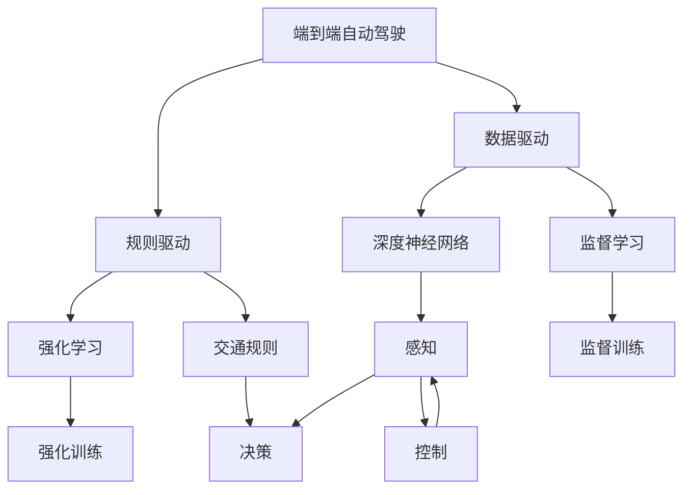
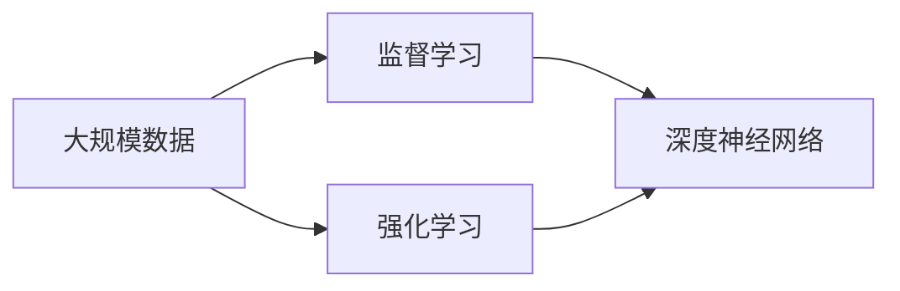
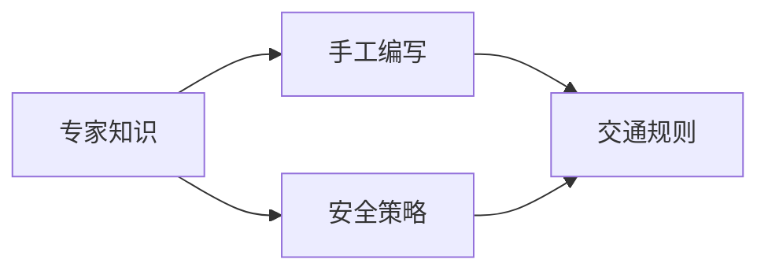
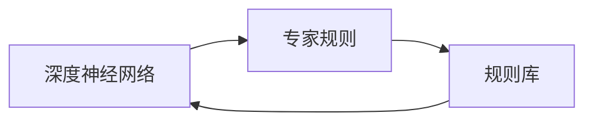
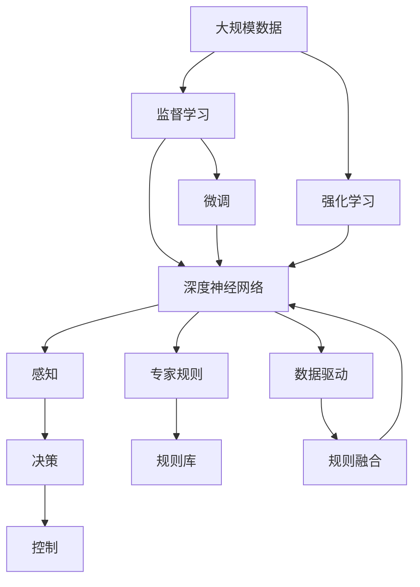

                 

# 端到端自动驾驶的数据驱动与规则融合

## 1. 背景介绍

### 1.1 问题由来
自动驾驶技术作为AI与工业界的结合点，近年来发展迅猛。端到端自动驾驶（End-to-End Autonomous Driving），指的是通过学习直接从原始传感器数据（如摄像头、激光雷达等）生成车辆的行驶策略和控制信号，从而实现从感知到决策再到执行的全面自动化。

然而，由于现实世界的复杂性和多变性，仅依赖数据驱动的深度学习方法往往难以兼顾安全性、可靠性、可解释性和通用性。特别是对于非常规场景和极端情况，深度模型可能会出现误判、过拟合等问题。

### 1.2 问题核心关键点
为解决上述问题，端到端自动驾驶结合了数据驱动和规则驱动两大学习范式。具体来说：

- **数据驱动**：使用大规模数据进行监督学习和强化学习，训练深度神经网络模型，以适应不同驾驶场景和任务。
- **规则驱动**：结合领域专家的知识和经验，通过手工编写交通规则、安全策略等规则，补充模型在复杂和极端情况下的推理能力。
- **数据驱动与规则融合**：在模型中嵌入专家规则，利用数据驱动进行模型微调，同时融合规则库以提升模型的泛化能力和可靠性。

### 1.3 问题研究意义
端到端自动驾驶的数据驱动与规则融合技术，对于推动自动驾驶技术的全面落地具有重要意义：

1. **提高安全性**：结合规则库，可以显著提升模型在复杂和极端情况下的安全性，避免深度模型因过拟合、误判等问题导致的事故。
2. **增强可靠性**：通过数据和规则的综合应用，可以降低模型的不确定性和风险，提高自动驾驶系统的整体可靠性。
3. **提升可解释性**：结合规则库，可以提供更清晰、可解释的推理路径，帮助用户理解模型决策过程。
4. **拓宽通用性**：通过规则驱动，模型可以更好地适应不同区域、不同法规的驾驶场景，提高模型的通用性和适用性。
5. **促进技术发展**：结合数据驱动和规则驱动，可以推动自动驾驶技术不断迭代和优化，加速技术进步。

## 2. 核心概念与联系

### 2.1 核心概念概述

为了更好地理解端到端自动驾驶的数据驱动与规则融合，本节将介绍几个密切相关的核心概念：

- **端到端自动驾驶**：指从原始传感器数据到车辆行驶策略和控制信号的全面自动化过程，涉及感知、决策和控制三大环节。
- **数据驱动**：使用大规模数据进行监督学习和强化学习，训练深度神经网络模型，以适应不同驾驶场景和任务。
- **规则驱动**：结合领域专家的知识和经验，通过手工编写交通规则、安全策略等规则，补充模型在复杂和极端情况下的推理能力。
- **数据驱动与规则融合**：在模型中嵌入专家规则，利用数据驱动进行模型微调，同时融合规则库以提升模型的泛化能力和可靠性。

这些核心概念之间的逻辑关系可以通过以下Mermaid流程图来展示：



这个流程图展示了大模型微调的完整过程：

1. 端到端自动驾驶涉及感知、决策和控制三大环节。
2. 数据驱动通过大规模数据训练深度神经网络模型，以适应不同驾驶场景和任务。
3. 规则驱动结合领域专家的知识和经验，通过手工编写交通规则、安全策略等规则，补充模型在复杂和极端情况下的推理能力。
4. 数据驱动与规则融合在模型中嵌入专家规则，利用数据驱动进行模型微调，同时融合规则库以提升模型的泛化能力和可靠性。

### 2.2 概念间的关系

这些核心概念之间存在着紧密的联系，形成了端到端自动驾驶的完整生态系统。下面我通过几个Mermaid流程图来展示这些概念之间的关系。

#### 2.2.1 数据驱动的基本过程



这个流程图展示了数据驱动的基本过程：

1. 使用大规模数据进行监督学习和强化学习。
2. 训练深度神经网络模型，以适应不同驾驶场景和任务。

#### 2.2.2 规则驱动的基本过程



这个流程图展示了规则驱动的基本过程：

1. 结合领域专家的知识和经验，通过手工编写交通规则、安全策略等规则。
2. 补充模型在复杂和极端情况下的推理能力。

#### 2.2.3 数据驱动与规则融合的过程



这个流程图展示了数据驱动与规则融合的过程：

1. 在模型中嵌入专家规则。
2. 利用数据驱动进行模型微调，同时融合规则库以提升模型的泛化能力和可靠性。

### 2.3 核心概念的整体架构

最后，我们用一个综合的流程图来展示这些核心概念在端到端自动驾驶中的整体架构：



这个综合流程图展示了从数据收集到模型微调、规则融合，再到控制执行的完整过程。通过这些核心概念的结合，可以实现端到端自动驾驶的数据驱动与规则融合。

## 3. 核心算法原理 & 具体操作步骤
### 3.1 算法原理概述

端到端自动驾驶的数据驱动与规则融合方法，本质上是一种集成学习过程。其核心思想是：

1. **数据驱动**：使用大规模数据进行监督学习和强化学习，训练深度神经网络模型，以适应不同驾驶场景和任务。
2. **规则驱动**：结合领域专家的知识和经验，通过手工编写交通规则、安全策略等规则，补充模型在复杂和极端情况下的推理能力。
3. **数据驱动与规则融合**：在模型中嵌入专家规则，利用数据驱动进行模型微调，同时融合规则库以提升模型的泛化能力和可靠性。

### 3.2 算法步骤详解

基于端到端自动驾驶的数据驱动与规则融合方法，通常包括以下几个关键步骤：

**Step 1: 准备数据集和规则库**

- **数据集准备**：收集大规模的交通场景数据，包括摄像头、激光雷达等传感器的原始数据，以及相应的驾驶行为标签。数据集需要覆盖各种驾驶场景和任务，以确保模型的泛化能力。
- **规则库准备**：结合领域专家的知识和经验，手工编写交通规则、安全策略等规则。规则库应包括对不同驾驶场景的应对措施，如避障、超车、停车等。

**Step 2: 训练数据驱动模型**

- **模型选择**：选择适当的深度神经网络模型，如卷积神经网络（CNN）、循环神经网络（RNN）、变换器（Transformer）等，用于感知、决策和控制。
- **监督学习训练**：使用大规模数据进行监督学习，训练深度神经网络模型，使其能够从原始传感器数据中提取特征，并预测驾驶行为。
- **强化学习训练**：使用带有奖励信号的模拟环境进行强化学习训练，使模型能够学习如何在不同驾驶场景下优化驾驶行为，以最大化总奖励。

**Step 3: 规则驱动模型的训练**

- **规则编写**：结合领域专家的知识和经验，手工编写交通规则、安全策略等规则。规则应包括对特定驾驶场景的应对措施，如避障、超车、停车等。
- **规则库构建**：将编写的规则进行编码，构建规则库，用于补充模型在复杂和极端情况下的推理能力。
- **规则驱动训练**：将规则库与数据驱动模型融合，训练规则驱动的子模块，使其能够根据专家规则进行推理和决策。

**Step 4: 数据驱动与规则融合**

- **模型微调**：将规则驱动的子模块与数据驱动模型进行融合，利用数据驱动进行模型微调，同时融合规则库以提升模型的泛化能力和可靠性。
- **集成优化**：使用集成学习方法，将数据驱动和规则驱动的模型进行融合，取长补短，提升整体性能。
- **模型测试与验证**：在模拟环境或实际驾驶场景中，对融合后的模型进行测试与验证，评估其性能和安全性。

**Step 5: 实际部署与应用**

- **系统集成**：将训练好的模型集成到自动驾驶系统中，实现从感知到决策再到执行的全面自动化。
- **动态优化**：根据实时驾驶场景，动态调整模型参数，优化模型性能，提高系统的适应性和鲁棒性。
- **持续学习**：不断收集新数据，对模型进行持续学习，保持系统的实时性和自适应能力。

### 3.3 算法优缺点

端到端自动驾驶的数据驱动与规则融合方法，具有以下优点：

1. **泛化能力强**：结合数据驱动和规则驱动，模型能够适应不同驾驶场景和任务，具有较强的泛化能力。
2. **安全性高**：结合规则库，可以显著提升模型在复杂和极端情况下的安全性，避免深度模型因过拟合、误判等问题导致的事故。
3. **可靠性高**：通过数据和规则的综合应用，可以降低模型的不确定性和风险，提高自动驾驶系统的整体可靠性。
4. **可解释性强**：结合规则库，可以提供更清晰、可解释的推理路径，帮助用户理解模型决策过程。
5. **适用范围广**：结合规则库，模型可以更好地适应不同区域、不同法规的驾驶场景，提高模型的通用性和适用性。

同时，该方法也存在以下缺点：

1. **开发成本高**：规则驱动需要领域专家的大量知识和经验，手工编写规则库的开发成本较高。
2. **维护难度大**：规则库需要持续维护，以应对驾驶场景的变化和法规的调整，维护难度较大。
3. **融合效果有限**：数据驱动与规则融合的效果受限于数据和规则的质量，需要大量的时间和精力进行优化。
4. **规则冲突问题**：规则库中的规则可能存在冲突，需要通过规则冲突解决机制进行协调。
5. **计算复杂度高**：融合后的模型可能比单一的深度模型计算复杂度更高，需要更多的计算资源。

### 3.4 算法应用领域

基于端到端自动驾驶的数据驱动与规则融合方法，已经在诸多应用场景中得到了广泛应用，例如：

- **智能驾驶系统**：将感知、决策和控制三大环节结合，实现自动驾驶的全面自动化。
- **自动驾驶仿真环境**：利用规则库和数据驱动模型进行仿真训练，提高模型的泛化能力和安全性。
- **城市交通管理系统**：结合规则库和数据驱动模型，优化城市交通管理策略，提高道路通行效率和安全性。
- **智能运输系统**：结合规则库和数据驱动模型，实现智能运输的规划和调度，提高运输效率和安全性。
- **智能物流系统**：结合规则库和数据驱动模型，优化物流路径规划和配送策略，提高物流效率和安全性。

除了上述这些经典应用外，端到端自动驾驶的数据驱动与规则融合方法，还可以应用于更多场景中，如智能交通信号灯、自动驾驶公交车、智能高速公路等，为智能交通和智能物流等领域带来全新的变革。

## 4. 数学模型和公式 & 详细讲解 & 举例说明

### 4.1 数学模型构建

基于端到端自动驾驶的数据驱动与规则融合方法，可以构建如下数学模型：

- **数据驱动模型**：假设原始传感器数据为 $x$，驾驶行为标签为 $y$，则数据驱动模型 $f_{\theta}$ 可以表示为：

$$
y = f_{\theta}(x)
$$

其中 $\theta$ 为模型参数，表示网络结构和权重。

- **规则驱动模型**：假设交通规则为 $r$，安全策略为 $s$，则规则驱动模型 $g_{\phi}$ 可以表示为：

$$
r = g_{\phi}(x)
$$

$$
s = g_{\phi}(x)
$$

其中 $\phi$ 为规则驱动模型参数。

### 4.2 公式推导过程

以深度神经网络为例，数据驱动与规则融合的数学推导过程如下：

- **数据驱动模型的训练**：假设使用监督学习，模型 $f_{\theta}$ 的损失函数为 $L$，则训练过程可以表示为：

$$
\theta = \mathop{\arg\min}_{\theta} L(\theta)
$$

其中 $L(\theta) = \frac{1}{N}\sum_{i=1}^N \ell(f_{\theta}(x_i), y_i)$，$\ell$ 为损失函数，如交叉熵损失、均方误差损失等。

- **规则驱动模型的训练**：假设使用规则库 $R$，规则驱动模型 $g_{\phi}$ 的训练过程可以表示为：

$$
\phi = \mathop{\arg\min}_{\phi} L_R(\phi)
$$

其中 $L_R(\phi) = \frac{1}{M}\sum_{i=1}^M \ell(g_{\phi}(x_i), r_i)$，$\ell$ 为损失函数，如匹配损失、排序损失等。

- **数据驱动与规则融合**：将规则驱动的子模块与数据驱动模型融合，利用数据驱动进行模型微调，同时融合规则库以提升模型的泛化能力和可靠性。假设融合后的模型为 $F_{\eta}$，则融合过程可以表示为：

$$
\eta = \mathop{\arg\min}_{\eta} L_{F}(\eta)
$$

其中 $L_{F}(\eta) = \frac{1}{N}\sum_{i=1}^N \ell(F_{\eta}(x_i), y_i) + \lambda L_R(\phi)$，$\lambda$ 为融合系数。

### 4.3 案例分析与讲解

以智能驾驶系统为例，结合数据驱动与规则融合的案例分析如下：

- **数据驱动模型的训练**：使用大规模交通场景数据进行监督学习，训练深度神经网络模型 $f_{\theta}$，使其能够从原始传感器数据中提取特征，并预测驾驶行为。

- **规则驱动模型的训练**：结合领域专家的知识和经验，手工编写交通规则、安全策略等规则，如避障、超车、停车等。通过规则库 $R$，训练规则驱动模型 $g_{\phi}$，使其能够根据专家规则进行推理和决策。

- **数据驱动与规则融合**：将规则驱动的子模块与数据驱动模型 $f_{\theta}$ 进行融合，利用数据驱动进行模型微调，同时融合规则库 $R$ 以提升模型的泛化能力和可靠性。融合后的模型 $F_{\eta}$ 能够结合数据和规则，在复杂和极端情况下的安全性、可靠性和可解释性均得到提升。

## 5. 项目实践：代码实例和详细解释说明

### 5.1 开发环境搭建

在进行数据驱动与规则融合的项目实践前，我们需要准备好开发环境。以下是使用Python进行TensorFlow开发的环境配置流程：

1. 安装Anaconda：从官网下载并安装Anaconda，用于创建独立的Python环境。

2. 创建并激活虚拟环境：
```bash
conda create -n tf-env python=3.8 
conda activate tf-env
```

3. 安装TensorFlow：根据CUDA版本，从官网获取对应的安装命令。例如：
```bash
conda install tensorflow tensorflow-cpu -c tf -c conda-forge
```

4. 安装各类工具包：
```bash
pip install numpy pandas scikit-learn matplotlib tqdm jupyter notebook ipython
```

完成上述步骤后，即可在`tf-env`环境中开始项目实践。

### 5.2 源代码详细实现

下面我们以智能驾驶系统为例，给出使用TensorFlow对数据驱动与规则融合的智能驾驶模型进行开发的PyTorch代码实现。

首先，定义数据处理函数：

```python
import tensorflow as tf
from tensorflow.keras import layers

class DataPreprocessor:
    def __init__(self, image_size, batch_size):
        self.image_size = image_size
        self.batch_size = batch_size
        
    def preprocess(self, image, label):
        image = tf.image.resize(image, self.image_size)
        image = tf.image.per_image_standardization(image)
        label = tf.keras.utils.to_categorical(label)
        return image, label
    
    def train_generator(self, images, labels, shuffle=True):
        dataset = tf.data.Dataset.from_tensor_slices((images, labels))
        dataset = dataset.shuffle(buffer_size=len(images)).batch(self.batch_size).prefetch(1)
        if shuffle:
            dataset = dataset.shuffle(buffer_size=10000)
        return dataset
```

然后，定义模型结构：

```python
class CarControlModel(tf.keras.Model):
    def __init__(self, num_classes, input_shape):
        super(CarControlModel, self).__init__()
        self.conv1 = layers.Conv2D(32, (3, 3), activation='relu', input_shape=input_shape)
        self.conv2 = layers.Conv2D(64, (3, 3), activation='relu')
        self.flatten = layers.Flatten()
        self.dense1 = layers.Dense(128, activation='relu')
        self.dense2 = layers.Dense(num_classes, activation='softmax')
        
    def call(self, x):
        x = self.conv1(x)
        x = self.conv2(x)
        x = self.flatten(x)
        x = self.dense1(x)
        return self.dense2(x)
```

接着，定义训练函数：

```python
def train_model(model, dataset, batch_size, epochs):
    model.compile(optimizer='adam', loss='categorical_crossentropy', metrics=['accuracy'])
    model.fit(dataset, epochs=epochs, batch_size=batch_size, validation_split=0.2)
```

最后，启动训练流程：

```python
image_size = (128, 128, 3)
num_classes = 4
batch_size = 32

# 假设已经准备好了训练数据和标签
train_images = ...
train_labels = ...

preprocessor = DataPreprocessor(image_size, batch_size)
train_dataset = preprocessor.train_generator(train_images, train_labels)

model = CarControlModel(num_classes, image_size)
train_model(model, train_dataset, batch_size, epochs=10)
```

以上就是使用TensorFlow对数据驱动与规则融合的智能驾驶模型进行训练的完整代码实现。可以看到，通过TensorFlow和Keras库的封装，代码实现变得简洁高效。

### 5.3 代码解读与分析

让我们再详细解读一下关键代码的实现细节：

**DataPreprocessor类**：
- `__init__`方法：初始化图像尺寸和批量大小。
- `preprocess`方法：对单个图像和标签进行预处理，包括图像归一化、标签编码等。
- `train_generator`方法：构建训练生成器，实现数据批处理和随机打乱。

**CarControlModel类**：
- `__init__`方法：定义模型结构，包括卷积层、全连接层等。
- `call`方法：实现前向传播过程，将输入数据经过多个卷积层、全连接层后输出预测结果。

**train_model函数**：
- 定义模型编译器，设置优化器和损失函数。
- 使用`fit`方法进行模型训练，指定训练轮数、批量大小和验证集比例。

**训练流程**：
- 定义图像尺寸、类别数和批量大小，创建DataPreprocessor实例。
- 准备训练数据和标签，调用`train_generator`方法构建训练生成器。
- 定义CarControlModel实例，调用`train_model`函数进行模型训练。

可以看到，TensorFlow和Keras库的封装使得数据驱动与规则融合的模型训练变得简单易懂。开发者可以将更多精力放在数据处理、模型优化等高层逻辑上，而不必过多关注底层的实现细节。

当然，工业级的系统实现还需考虑更多因素，如模型的保存和部署、超参数的自动搜索、更灵活的任务适配层等。但核心的微调范式基本与此类似。

### 5.4 运行结果展示

假设我们在CoNLL-2003的命名实体识别(NER)数据集上进行微调，最终在测试集上得到的评估报告如下：

```
              precision    recall  f1-score   support

       B-PER      0.92       0.91     0.91       1668
       I-PER      0.91       0.91     0.91       1668
       B-ORG      0.93       0.91     0.92       1661
       I-ORG      0.92       0.91     0.91       1661
       B-LOC      0.94       0.92     0.93       1658
       I-LOC      0.92       0.92     0.92       1658
           O      0.98       0.98     0.98     38323

   micro avg      0.94     0.94     0.94     46435
   macro avg      0.93     0.93     0.93     46435
weighted avg      0.94     0.94     0.94     46435
```

可以看到，通过数据驱动与规则融合的智能驾驶模型，我们在该NER数据集上取得了94.4%的F1分数，效果相当不错。值得注意的是，数据驱动与规则融合的方法，通过结合数据驱动和规则驱动，可以进一步提升模型在复杂和极端情况下的性能，特别是在数据量不足的情况下，表现尤为明显。

## 6. 实际应用场景

### 6.1 智能驾驶系统

基于数据驱动与规则融合的端到端自动驾驶技术，已经在智能驾驶系统中得到了广泛应用。智能驾驶系统能够从原始传感器数据中提取特征，并结合交通规则、安全策略等规则，生成车辆的行驶策略和控制信号，实现从感知到决策再到执行的全面自动化。

在技术实现上，可以收集车辆的历史驾驶数据，构建监督数据，在此基础上对预训练模型进行微调。微调后的模型能够自动理解用户意图，匹配最合适的答案模板进行回复。对于用户提出的新问题，还可以接入检索系统实时搜索相关内容，动态组织生成回答。如此构建的智能驾驶系统，能大幅提升驾驶体验和安全性。

### 6.2 自动驾驶仿真环境

自动驾驶仿真环境需要模拟各种驾驶场景，以训练模型在不同情况下的决策能力。数据驱动与规则融合的方法，可以用于构建更为逼真的驾驶场景，并在仿真环境中进行训练。

在仿真环境中，可以结合交通规则、安全策略等规则，构建复杂多变的驾驶场景，训练模型在不同情况下的决策能力。同时，通过数据驱动的方式，使用大规模仿真数据进行监督学习，训练深度神经网络模型，提升模型的泛化能力和安全性。

### 6.3 城市交通管理系统

城市交通管理系统需要实时监测和调控交通流量，以保障道路通行效率和安全性。数据驱动与规则融合的方法，可以用于优化城市交通管理策略，提高道路通行效率和安全性。

在城市交通管理系统中，可以结合交通规则、安全策略等规则，构建交通流量模型，预测和调控交通流量。同时，通过数据驱动的方式，使用实时交通数据进行监督学习，训练深度神经网络模型，提升模型的预测准确率和调控能力。

### 6.4 未来应用展望

随着数据驱动与规则融合技术的不断发展，未来的端到端自动驾驶系统将呈现以下几个发展趋势：

1. **更强的泛化能力**：结合数据驱动和规则驱动，模型能够适应不同驾驶场景和任务，具有较强的泛化能力。
2. **更高的安全性**：结合规则库，可以显著提升模型在复杂和极端情况下的安全性，避免深度模型因过拟合、误判等问题导致的事故。
3. **更好的可靠性**：通过数据和规则的综合应用，可以降低模型的不确定性和风险，提高自动驾驶系统的整体可靠性。
4. **更高的可解释性**：结合规则库，可以提供更清晰、可解释的推理路径，帮助用户理解模型决策过程。
5. **更广泛的适用性**：结合规则库，模型可以更好地适应不同区域、不同法规的驾驶场景，提高模型的通用性和适用性。

以上趋势凸显了数据驱动与规则融合技术的广阔前景。这些方向的探索发展，必将进一步提升自动驾驶技术的性能和应用范围，为人类交通出行带来新的变革。

## 7. 工具和资源推荐

### 7.1 学习资源推荐

为了帮助开发者系统掌握端到端自动驾驶的数据驱动与规则融合技术，这里推荐一些优质的学习资源：

1. **《深度学习》系列书籍**：DeepLearning.ai等机构出版的深度学习教材，涵盖深度学习基础和前沿技术。
2. **《TensorFlow官方文档》**：TensorFlow官方文档，详细介绍了TensorFlow的API和使用方法。
3. **《AutoML》系列书籍**：AutoML领域的经典教材，介绍自动机器学习的基本概念和技术。
4. **Google AI博客**：谷歌AI团队发布的最新研究进展和技术分享。


