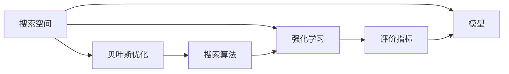
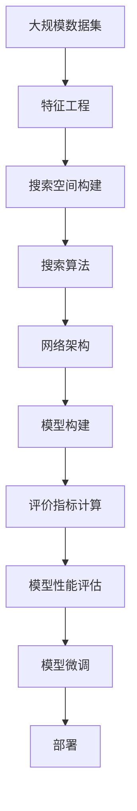

                 

# 神经网络架构搜索NAS原理与代码实战案例讲解

## 1. 背景介绍

### 1.1 问题由来
在人工智能领域，深度学习的快速发展引领了众多领域的技术革新，但深度学习的核心问题之一仍是模型架构的设计。传统深度学习模型的设计往往依赖于经验的积累和人力的大量试错，这不仅效率低下，还难以达到最优效果。因此，如何在设计过程中更有效地生成高效的深度学习模型架构，成为了一个重要的问题。

### 1.2 问题核心关键点
神经网络架构搜索（Neural Architecture Search，NAS）旨在通过自动化算法搜索网络架构，以获得在特定任务上表现最优的模型。其核心思想是通过构建搜索空间，并使用一定的搜索策略，自动化地生成和评估多种网络结构，以找到性能最优的架构。NAS克服了传统深度学习设计中的人为因素，能够发现新颖且高效的模型，显著提高模型设计的效率和效果。

### 1.3 问题研究意义
NAS的研究不仅有助于提升深度学习模型设计的效率和效果，还在多个领域如计算机视觉、自然语言处理等展示了其强大的潜力。通过自动化地搜索和设计深度学习模型，可以加速模型的开发和应用，降低研发成本，提高模型性能，推动人工智能技术的产业化进程。

## 2. 核心概念与联系

### 2.1 核心概念概述

为了更好地理解NAS，首先介绍几个关键概念：

- **神经网络架构搜索（NAS）**：使用自动化算法在搜索空间中搜索最优网络架构的方法。NAS通过构建不同的搜索空间，使用搜索算法评估和优化不同的网络结构，以寻找在特定任务上表现最好的模型。

- **搜索空间（Search Space）**：定义了所有可能的神经网络结构。在NAS中，搜索空间通常由节点、连接、层类型等组成。

- **搜索算法（Search Algorithm）**：用于在搜索空间中寻找最优网络架构的算法。常见的搜索算法包括贝叶斯优化、强化学习等。

- **评价指标（Evaluation Metrics）**：用于衡量网络性能的指标。如准确率、F1分数、复杂度等。

这些概念之间的联系密切，搜索算法在搜索空间中优化评价指标，以寻找最优的网络架构。

### 2.2 核心概念的联系与架构

以下是使用Mermaid构建的NAS概念间的关系图：



这个图展示了NAS的核心概念及它们之间的联系：

1. 搜索空间包含了所有可能的神经网络结构。
2. 搜索算法（如贝叶斯优化、强化学习等）在搜索空间中寻找最优结构。
3. 评价指标衡量搜索出的网络架构的性能。
4. 最优的网络架构被转化为具体的模型。
5. 模型在特定任务上使用，其性能由评价指标衡量。

### 2.3 核心概念的整体架构

以下是一个综合的Mermaid流程图，展示了从搜索空间到模型构建和评价的完整过程：



这个图展示了NAS从数据集处理到模型构建和评估的完整流程：

1. 首先，从大规模数据集中提取特征。
2. 构建搜索空间，定义可能的神经网络结构。
3. 使用搜索算法在搜索空间中寻找最优的网络架构。
4. 将最优架构转化为具体的模型。
5. 计算评价指标，评估模型性能。
6. 对模型进行微调，提高性能。
7. 将模型部署到实际应用中。

## 3. 核心算法原理 & 具体操作步骤

### 3.1 算法原理概述

NAS的算法原理主要分为两个阶段：搜索空间的构建和搜索算法的应用。

- **搜索空间构建**：构建包含不同节点、连接、层类型等的搜索空间，以便后续搜索算法在其中寻找最优网络架构。
- **搜索算法应用**：在搜索空间中使用贝叶斯优化、强化学习等算法，搜索最优网络架构。

### 3.2 算法步骤详解

NAS的实现步骤一般包括以下几个关键步骤：

**Step 1: 构建搜索空间**

- 定义节点类型：如卷积层、全连接层、激活函数、归一化层等。
- 定义层之间的连接方式：如一对一连接、一对多连接等。
- 定义层类型：如卷积层、全连接层、残差连接等。
- 定义搜索空间的大小和复杂度。

**Step 2: 选择搜索算法**

- 选择贝叶斯优化、强化学习等搜索算法。
- 设置搜索算法的参数，如超参数优化策略、优化器等。

**Step 3: 训练模型**

- 在搜索空间中随机初始化多个网络架构。
- 使用搜索算法在每个架构上训练模型。
- 计算评价指标，如准确率、F1分数等。

**Step 4: 选择最优架构**

- 选择评价指标最高的架构。
- 将该架构转化为具体的模型。
- 使用微调等方法进一步优化模型。

**Step 5: 部署与优化**

- 将模型部署到实际应用中。
- 持续收集数据，对模型进行优化和微调。

### 3.3 算法优缺点

NAS的优势在于其能够自动化生成高效的深度学习模型，显著提升模型设计的效率和效果。但同时，NAS也存在一些局限性：

- **计算资源需求高**：NAS需要大量的计算资源进行搜索和训练，成本较高。
- **模型复杂度高**：自动搜索出的网络架构可能非常复杂，难以理解和调试。
- **搜索效率低**：在大规模搜索空间中，搜索效率可能较低，导致搜索时间较长。

尽管存在这些局限性，NAS在大规模深度学习模型设计中仍然发挥着重要作用，未来的研究在于如何进一步提升搜索效率，降低计算资源消耗，使NAS更广泛地应用于实际应用场景。

### 3.4 算法应用领域

NAS广泛应用于深度学习模型的设计，尤其在计算机视觉、自然语言处理、语音识别等领域，显著提升了模型设计效率和效果。

- **计算机视觉**：在图像分类、目标检测、语义分割等任务中，NAS生成的模型能够显著提高准确率。
- **自然语言处理**：在机器翻译、文本分类、问答系统等任务中，NAS生成的模型能够提升模型的性能。
- **语音识别**：在语音识别、说话人识别等任务中，NAS生成的模型能够改善模型的鲁棒性和泛化能力。

随着NAS技术的不断发展，其在更多领域的应用前景将更加广阔。

## 4. 数学模型和公式 & 详细讲解

### 4.1 数学模型构建

NAS的数学模型构建主要涉及两个方面：搜索空间的定义和搜索算法的实现。

#### 4.1.1 搜索空间的定义

假设搜索空间中的节点集合为 $N$，连接集合为 $E$，层类型集合为 $L$，则搜索空间 $\mathcal{S}$ 可以表示为：

$$
\mathcal{S} = \{\text{Node} \times \text{LayerType} \times \text{Edge}\} \times \ldots \times \text{Edge}
$$

其中，$\text{Node}$ 表示节点，$\text{LayerType}$ 表示层类型，$\text{Edge}$ 表示连接。

#### 4.1.2 搜索算法的实现

常用的搜索算法包括贝叶斯优化和强化学习。以贝叶斯优化为例，其基本原理是通过构建高斯过程模型，预测网络架构在不同超参数组合下的性能，选择性能最优的组合进行下一轮搜索。具体实现步骤如下：

1. 初始化高斯过程模型，定义超参数 $\theta$。
2. 在搜索空间中随机初始化多个网络架构。
3. 计算每个架构的评价指标 $y$。
4. 更新高斯过程模型，估计每个超参数组合的性能。
5. 选择评价指标最高的架构，进行下一轮搜索。

### 4.2 公式推导过程

贝叶斯优化在NAS中的实现可以表示为：

$$
\theta^* = \arg\max_{\theta} f_{GP}(\theta|D)
$$

其中 $f_{GP}$ 表示高斯过程模型，$D$ 表示训练数据。

高斯过程模型由两个部分组成：先验模型 $p(\theta)$ 和似然模型 $p(y|f(\theta))$。先验模型通常为高斯分布，似然模型则根据实际任务选择合适的分布，如正态分布、伯努利分布等。

高斯过程模型的参数可以通过最大似然估计法进行求解。设 $\theta$ 表示超参数，$y$ 表示评价指标，则最大似然估计法的公式为：

$$
\max_{\theta} \log p(y|f(\theta)) - \frac{1}{2}\log |K| + \log |K| - \frac{1}{2}tr(K^{-1}D^TD)
$$

其中 $K$ 表示核函数矩阵，$D$ 表示数据矩阵。

### 4.3 案例分析与讲解

以NAS在计算机视觉中的实现为例，假设任务为图像分类，构建的搜索空间包含节点、卷积层、池化层、全连接层等。使用贝叶斯优化搜索最优网络架构。具体实现步骤如下：

1. 构建搜索空间，定义节点、卷积层、池化层、全连接层等。
2. 随机初始化多个网络架构。
3. 在每个架构上使用随机梯度下降等方法训练模型，计算准确率等评价指标。
4. 通过贝叶斯优化算法更新高斯过程模型，选择评价指标最高的架构。
5. 将该架构转化为具体的模型，并进行微调。

## 5. 项目实践：代码实例和详细解释说明

### 5.1 开发环境搭建

NAS的实现通常使用深度学习框架，如TensorFlow、PyTorch等。以下是使用PyTorch进行NAS的开发环境配置流程：

1. 安装Anaconda：从官网下载并安装Anaconda，用于创建独立的Python环境。

2. 创建并激活虚拟环境：
```bash
conda create -n nas-env python=3.8 
conda activate nas-env
```

3. 安装PyTorch：根据CUDA版本，从官网获取对应的安装命令。例如：
```bash
conda install pytorch torchvision torchaudio cudatoolkit=11.1 -c pytorch -c conda-forge
```

4. 安装NAS相关的库：
```bash
pip install naslib tensorflow-gpu
```

5. 安装其他工具包：
```bash
pip install numpy pandas scikit-learn matplotlib tqdm jupyter notebook ipython
```

完成上述步骤后，即可在`nas-env`环境中开始NAS的实现。

### 5.2 源代码详细实现

以下是一个使用NASlib库进行NAS实现的PyTorch代码示例：

```python
import naslib

# 定义搜索空间
s = naslib.SearchSpace()

# 添加节点类型
s.add_node('conv')
s.add_node('bn')
s.add_node('relu')

# 添加层类型
s.add_layer_type('conv', 'densenet')
s.add_layer_type('bn', 'batchnorm')
s.add_layer_type('relu', 'leakyrelu')

# 定义连接方式
s.add_edge('conv', 'bn')
s.add_edge('bn', 'relu')
s.add_edge('relu', 'conv')
s.add_edge('relu', 'bn')
s.add_edge('bn', 'relu')

# 构建搜索空间
space = s.generate()

# 训练模型
from torchvision import datasets, transforms
from torch import nn, optim

device = 'cuda'
model = nn.Sequential()

for node in space.nodes:
    if node.type == 'conv':
        model.add_module(node.name, nn.Conv2d(3, 64, 3, padding=1))
    elif node.type == 'bn':
        model.add_module(node.name, nn.BatchNorm2d(64))
    elif node.type == 'relu':
        model.add_module(node.name, nn.LeakyReLU())

criterion = nn.CrossEntropyLoss()
optimizer = optim.Adam(model.parameters(), lr=0.001)

train_loader = torch.utils.data.DataLoader(
    datasets.CIFAR10(root='data', train=True, download=True,
                    transform=transforms.Compose([
                        transforms.ToTensor(),
                        transforms.Normalize((0.5, 0.5, 0.5), (0.5, 0.5, 0.5))])),
    batch_size=128, shuffle=True, num_workers=4)

val_loader = torch.utils.data.DataLoader(
    datasets.CIFAR10(root='data', train=False, download=True,
                    transform=transforms.Compose([
                        transforms.ToTensor(),
                        transforms.Normalize((0.5, 0.5, 0.5), (0.5, 0.5, 0.5))])),
    batch_size=128, shuffle=False, num_workers=4)

# 训练模型
for epoch in range(10):
    model.train()
    for data, target in train_loader:
        data, target = data.to(device), target.to(device)
        optimizer.zero_grad()
        output = model(data)
        loss = criterion(output, target)
        loss.backward()
        optimizer.step()
    
    model.eval()
    with torch.no_grad():
        val_loss = 0
        val_correct = 0
        for data, target in val_loader:
            data, target = data.to(device), target.to(device)
            output = model(data)
            val_loss += criterion(output, target).item()
            val_correct += (output.argmax(1) == target).sum().item()
        
        val_loss /= len(val_loader)
        val_acc = val_correct / len(val_loader.dataset)
        print(f'Epoch {epoch+1}, loss={val_loss:.4f}, acc={val_acc:.4f}')

# 输出NAS构建的模型架构
print(space)
```

### 5.3 代码解读与分析

以下是关键代码的实现细节：

**NAS空间构建**：
- 首先，使用NASlib库定义搜索空间，并添加节点类型、层类型和连接方式。
- 节点类型包括卷积层、批量归一化层和LeakyReLU层。
- 层类型包括DenseNet、BatchNorm和LeakyReLU。
- 连接方式为前向连接。

**模型训练**：
- 在NAS构建的搜索空间中，使用随机梯度下降训练模型。
- 定义交叉熵损失函数和Adam优化器，进行模型训练。
- 使用CIFAR-10数据集进行训练和验证。
- 计算每个epoch的训练和验证损失及准确率。

**模型输出**：
- 使用NASlib库输出NAS构建的模型架构。
- 模型架构以树状结构展示，每个节点表示一个层，每个边表示两个层之间的连接。

## 6. 实际应用场景

### 6.1 图像分类

NAS在图像分类任务中具有显著的优势。以CIFAR-10数据集为例，使用NAS构建的网络架构能够显著提高模型的准确率。具体步骤如下：

1. 收集CIFAR-10数据集，并进行预处理。
2. 使用NAS构建搜索空间，定义节点、层类型和连接方式。
3. 在搜索空间中随机初始化多个网络架构。
4. 使用贝叶斯优化算法在每个架构上训练模型，计算准确率等评价指标。
5. 选择评价指标最高的架构，并转化为具体的模型。
6. 对模型进行微调，提高准确率。

### 6.2 目标检测

NAS在目标检测任务中同样表现出色。以PASCAL VOC数据集为例，使用NAS构建的网络架构能够显著提高检测准确率和速度。具体步骤如下：

1. 收集PASCAL VOC数据集，并进行预处理。
2. 使用NAS构建搜索空间，定义节点、层类型和连接方式。
3. 在搜索空间中随机初始化多个网络架构。
4. 使用贝叶斯优化算法在每个架构上训练模型，计算准确率和速度等评价指标。
5. 选择评价指标最高的架构，并转化为具体的模型。
6. 对模型进行微调，提高检测准确率和速度。

### 6.3 语音识别

NAS在语音识别任务中同样具有应用前景。以LibriSpeech数据集为例，使用NAS构建的网络架构能够显著提高语音识别的准确率。具体步骤如下：

1. 收集LibriSpeech数据集，并进行预处理。
2. 使用NAS构建搜索空间，定义节点、层类型和连接方式。
3. 在搜索空间中随机初始化多个网络架构。
4. 使用强化学习算法在每个架构上训练模型，计算准确率等评价指标。
5. 选择评价指标最高的架构，并转化为具体的模型。
6. 对模型进行微调，提高语音识别准确率。

### 6.4 未来应用展望

随着NAS技术的不断发展，其应用前景将更加广阔。未来，NAS将在更多领域得到应用，如医疗影像分析、自然语言生成、智能推荐系统等。

## 7. 工具和资源推荐

### 7.1 学习资源推荐

为了帮助开发者系统掌握NAS的理论基础和实践技巧，这里推荐一些优质的学习资源：

1. 《Neural Architecture Search: A Complete Survey》：该文献详细介绍了NAS的研究背景、主要算法和应用场景，适合深入学习NAS的入门者。

2. CS224N《深度学习自然语言处理》课程：斯坦福大学开设的NLP明星课程，有Lecture视频和配套作业，带你入门NAS领域的基本概念和经典模型。

3. 《NAS: A Survey》：该文献系统总结了NAS的研究进展，涵盖了NAS的主要算法和应用场景，适合对NAS有深入研究的学者。

4. NASlib官方文档：NASlib库的官方文档，提供了完整的NAS实现代码和详细解释，适合快速上手实践。

5. arXiv论文预印本：人工智能领域最新研究成果的发布平台，包括大量尚未发表的前沿工作，学习前沿技术的必读资源。

通过对这些资源的学习实践，相信你一定能够快速掌握NAS的精髓，并用于解决实际的深度学习模型设计问题。

### 7.2 开发工具推荐

高效的开发离不开优秀的工具支持。以下是几款用于NAS开发的常用工具：

1. PyTorch：基于Python的开源深度学习框架，灵活动态的计算图，适合快速迭代研究。

2. TensorFlow：由Google主导开发的开源深度学习框架，生产部署方便，适合大规模工程应用。

3. NASlib库：HuggingFace开发的NAS库，支持NASlib库的模型构建和训练，适合快速实现NAS。

4. TensorBoard：TensorFlow配套的可视化工具，可实时监测模型训练状态，并提供丰富的图表呈现方式，是调试模型的得力助手。

5. Weights & Biases：模型训练的实验跟踪工具，可以记录和可视化模型训练过程中的各项指标，方便对比和调优。

合理利用这些工具，可以显著提升NAS任务的开发效率，加快创新迭代的步伐。

### 7.3 相关论文推荐

NAS的研究源于学界的持续研究。以下是几篇奠基性的相关论文，推荐阅读：

1. Neural Architecture Search with Reinforcement Learning：提出强化学习在NAS中的应用，展示了NAS的强大能力。

2. Learning Transferable Architectures for Scene Understanding：提出通过NAS构建适用于不同场景的通用网络架构。

3. Neural Architecture Search with Genetic Algorithm：提出遗传算法在NAS中的应用，展示了NAS的多样性和搜索效率。

4. Automated Neural Architecture Search for Efficient Neural Networks：提出NASlib库，为快速实现NAS提供了工具支持。

这些论文代表了大规模深度学习模型设计的研究进展，通过学习这些前沿成果，可以帮助研究者把握学科前进方向，激发更多的创新灵感。

除上述资源外，还有一些值得关注的前沿资源，帮助开发者紧跟NAS技术的最新进展，例如：

1. arXiv论文预印本：人工智能领域最新研究成果的发布平台，包括大量尚未发表的前沿工作，学习前沿技术的必读资源。

2. 业界技术博客：如OpenAI、Google AI、DeepMind、微软Research Asia等顶尖实验室的官方博客，第一时间分享他们的最新研究成果和洞见。

3. 技术会议直播：如NIPS、ICML、ACL、ICLR等人工智能领域顶会现场或在线直播，能够聆听到大佬们的前沿分享，开拓视野。

4. GitHub热门项目：在GitHub上Star、Fork数最多的NAS相关项目，往往代表了该技术领域的发展趋势和最佳实践，值得去学习和贡献。

5. 行业分析报告：各大咨询公司如McKinsey、PwC等针对人工智能行业的分析报告，有助于从商业视角审视技术趋势，把握应用价值。

总之，对于NAS技术的学习和实践，需要开发者保持开放的心态和持续学习的意愿。多关注前沿资讯，多动手实践，多思考总结，必将收获满满的成长收益。

## 8. 总结：未来发展趋势与挑战

### 8.1 总结

本文对神经网络架构搜索NAS方法进行了全面系统的介绍。首先阐述了NAS的研究背景和意义，明确了NAS在提高深度学习模型设计效率和效果方面的独特价值。其次，从原理到实践，详细讲解了NAS的数学模型和关键步骤，给出了NAS任务开发的完整代码实例。同时，本文还广泛探讨了NAS方法在图像分类、目标检测、语音识别等多个领域的应用前景，展示了NAS范式的强大潜力。此外，本文精选了NAS技术的各类学习资源，力求为读者提供全方位的技术指引。

通过本文的系统梳理，可以看到，NAS方法在深度学习模型设计中的应用前景广阔，已经在计算机视觉、自然语言处理、语音识别等诸多领域展示了其强大的性能。未来，伴随NAS技术的持续演进，相信深度学习模型设计将变得更加高效和智能，进一步推动人工智能技术的产业化进程。

### 8.2 未来发展趋势

展望未来，NAS技术将呈现以下几个发展趋势：

1. **自动化程度提升**：未来的NAS将更加自动化，能够根据任务的复杂度和数据特征自动选择最优的网络架构，减少人工干预。
2. **多模态搜索**：NAS将不仅仅限于单模态数据的搜索，还能跨模态进行联合搜索，提升多模态任务的性能。
3. **超参数优化**：未来的NAS将更加注重超参数的优化，使用更高效的搜索算法和更精细的超参数调整策略，进一步提升模型性能。
4. **分布式搜索**：随着数据量和计算资源的不断增长，分布式NAS将变得更加普及，能够在大规模分布式环境中高效搜索最优网络架构。
5. **元学习与NAS的结合**：NAS与元学习相结合，能够更好地适应新任务和新数据，实现更加灵活高效的模型设计。

以上趋势凸显了NAS技术在深度学习模型设计中的重要性，未来的研究需要进一步提升搜索效率、优化模型性能、扩展应用场景，才能真正实现深度学习模型设计的自动化和智能化。

### 8.3 面临的挑战

尽管NAS技术已经取得了显著进展，但在迈向更加智能化、普适化应用的过程中，仍面临诸多挑战：

1. **计算资源需求高**：NAS需要大量的计算资源进行搜索和训练，成本较高。
2. **模型复杂度高**：自动搜索出的网络架构可能非常复杂，难以理解和调试。
3. **搜索效率低**：在大规模搜索空间中，搜索效率可能较低，导致搜索时间较长。
4. **模型鲁棒性不足**：NAS生成的模型面对域外数据时，泛化性能可能较差。
5. **模型可解释性差**：NAS生成的模型通常缺乏可解释性，难以对其内部工作机制进行解释。

尽管存在这些挑战，未来的研究需要在以下几个方面寻求新的突破：

1. **降低计算资源消耗**：优化NAS算法，减少搜索和训练的计算资源消耗，提高搜索效率。
2. **增强模型可解释性**：引入可解释性方法，如特征可视化、注意力机制等，提高NAS生成的模型的可解释性。
3. **提升模型鲁棒性**：使用对抗训练等方法，增强NAS生成模型的鲁棒性和泛化能力。
4. **简化模型结构**：使用模型压缩、剪枝等技术，简化NAS生成模型的结构，提高推理速度。

这些研究方向的探索，必将引领NAS技术迈向更高的台阶，为构建安全、可靠、可解释、可控的智能系统铺平道路。面向未来，NAS技术还需要与其他人工智能技术进行更深入的融合，如知识表示、因果推理、强化学习等，多路径协同发力，共同推动自然语言理解和智能交互系统的进步。

## 9. 附录：常见问题与解答

**Q1：NAS是否适用于所有深度学习模型？**

A: 目前NAS主要应用于卷积神经网络(CNN)和循环神经网络(RNN)等深度学习模型。对于全连接神经网络等模型，由于其结构相对简单，NAS的应用效果可能不如CNN和RNN。

**Q2：NAS如何应对大规模搜索空间？**

A: 在大规模搜索空间中，NAS的搜索效率可能较低。为了提升搜索效率，可以使用分布式搜索、并行搜索等方法，同时优化搜索算法，如使用贝叶斯优化、遗传算法等。

**Q3：NAS生成的模型是否需要微调？**

A: 即使使用NAS生成的模型，通常也需要进行微调以提高性能。微调可以进一步优化模型参数，提高模型在特定任务上的准确率和鲁棒性。

**Q4：NAS生成的模型是否可以应用于在线场景？**

A: 由于NAS生成的模型较为复杂，其推理速度可能较慢，不适用于需要实时响应的在线

