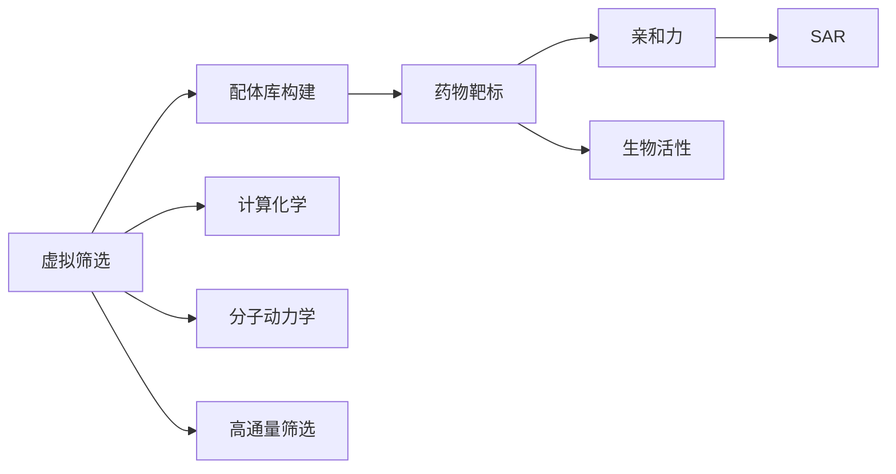
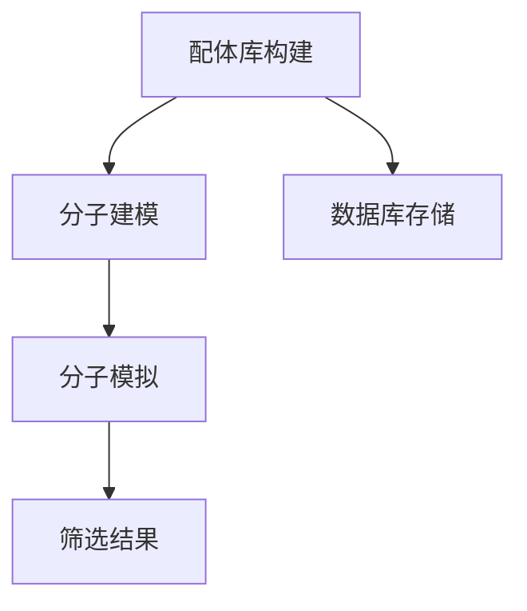
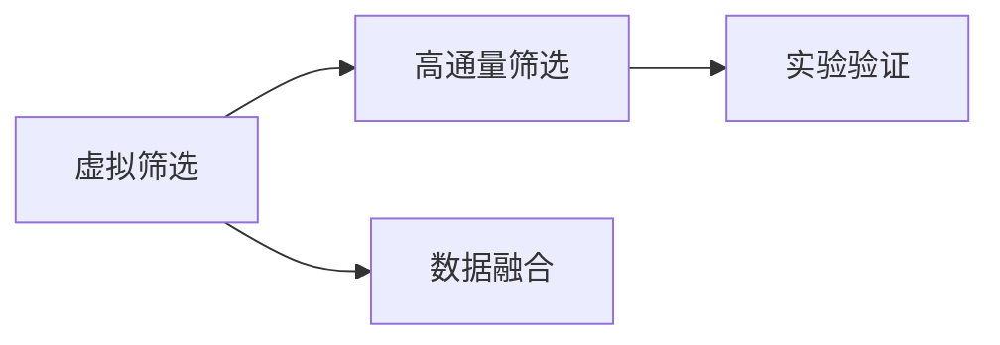
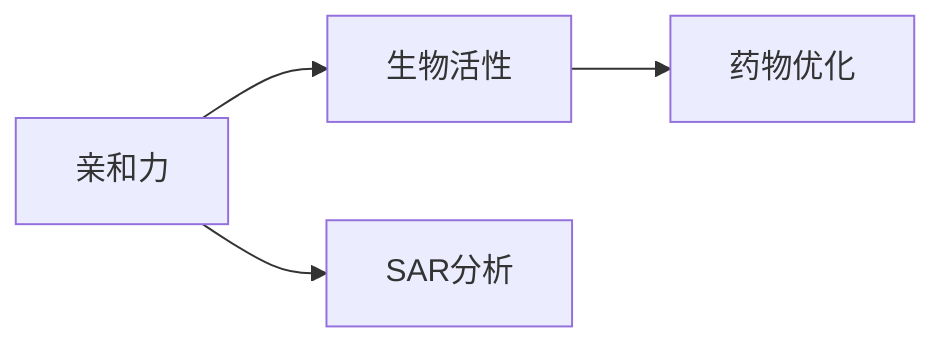
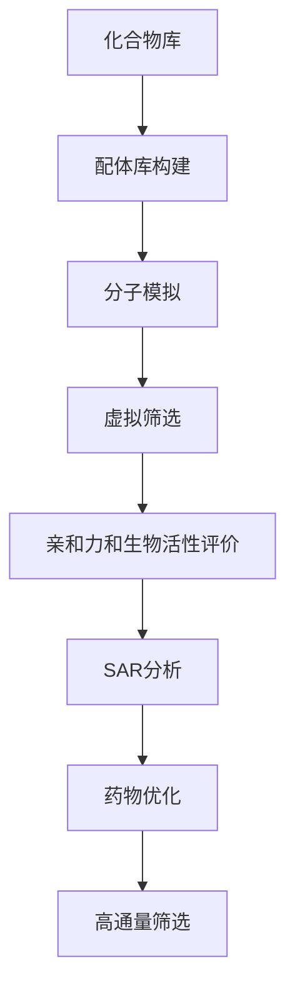
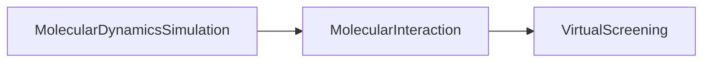

                 

# 虚拟筛选技术在药物发现中的应用进展

> 关键词：药物发现, 药物筛选, 虚拟筛选, 计算化学, 计算机模拟, 药物设计

## 1. 背景介绍

### 1.1 问题由来
药物发现是一个漫长且昂贵的过程，通常需要多年的研究时间和数十亿美元的资金投入。传统药物发现流程包括目标识别、先导化合物筛选、优化、临床试验等阶段，每一个环节都充满了不确定性和高风险。然而，随着计算化学和计算机模拟技术的发展，虚拟筛选(Virtual Screening, VS)技术逐步成为药物发现领域的重要工具。

虚拟筛选技术通过计算机模拟方法，在化合物库中快速筛选出具有潜在生物活性的化合物，大大缩短了药物发现周期，降低了成本，并提高了成功率。该技术在药物研发早期阶段，尤其是在先导化合物发现和候选化合物优化过程中，表现出了显著优势。

### 1.2 问题核心关键点
虚拟筛选技术通常分为两个步骤：
1. **配体库构建**：将化合物库中的分子结构和化学信息编码，生成可用于计算机模拟的数据集。
2. **筛选与评价**：利用计算机模拟方法在配体库中筛选出可能具有生物活性的化合物，并进行后续的评价和优化。

该技术的关键在于如何构建高质量的配体库以及选择合适的筛选算法和评价指标。构建的配体库必须覆盖足够广泛的化学空间，同时考虑到分子性质和药效学特性。筛选算法需要高效、准确，能够在大规模化合物库中快速找到有潜力的化合物。评价指标应能综合考量化合物的性质和药效，指导后续的优化工作。

### 1.3 问题研究意义
虚拟筛选技术的广泛应用，不仅大大加速了药物发现过程，降低了研发成本，而且提高了药物开发的成功率和效率。该技术已成为药物发现的重要工具，尤其在小型生物技术公司和大型制药企业中，越来越多地被用于早期阶段的筛选工作。此外，虚拟筛选技术还可以与其他药物发现技术如高通量筛选、组合化学等结合使用，进一步提升药物研发的整体效率和成功率。

## 2. 核心概念与联系

### 2.1 核心概念概述

为了更好地理解虚拟筛选技术，本节将介绍几个密切相关的核心概念：

- **虚拟筛选（Virtual Screening, VS）**：利用计算机模拟方法在化合物库中快速筛选出具有潜在生物活性的化合物。
- **配体库（Ligand Library）**：化合物库中经过编码和整理的分子数据集，用于计算机模拟筛选。
- **药物靶标（Drug Target）**：药物作用的生物分子，如酶、受体、离子通道等。
- **亲和力（Affinity）**：化合物与靶标的结合能力，通常用解离常数$K_d$或IC50值来衡量。
- **生物活性（Biological Activity）**：化合物在生物体内的生理效应，如抑制、激活、毒性等。
- **构效关系（Structure-Activity Relationship, SAR）**：化合物结构与其生物活性之间的关系，用于指导药物优化。
- **计算化学（Computational Chemistry）**：利用计算机模拟技术研究分子和化学反应的学科，虚拟筛选是其重要应用之一。
- **分子动力学（Molecular Dynamics, MD）**：通过计算机模拟分子在时间和空间上的运动，研究分子间相互作用和反应机理。
- **高通量筛选（High-Throughput Screening, HTS）**：在微观层面上对大量化合物进行自动化筛选，与虚拟筛选结合使用可大幅提升效率。

这些核心概念之间的逻辑关系可以通过以下Mermaid流程图来展示：



这个流程图展示了虚拟筛选技术的核心概念及其之间的关系：

1. 虚拟筛选通过配体库构建与计算机模拟方法，快速筛选出有潜力的化合物。
2. 筛选结果与药物靶标、亲和力和生物活性相关联，指导后续的药物优化工作。
3. 计算化学和分子动力学技术为虚拟筛选提供了理论基础和模拟手段。
4. 高通量筛选与虚拟筛选结合，进一步提升了药物发现过程的效率和精度。

### 2.2 概念间的关系

这些核心概念之间存在着紧密的联系，形成了虚拟筛选技术的完整生态系统。下面我们通过几个Mermaid流程图来展示这些概念之间的关系。

#### 2.2.1 配体库构建与筛选


这个流程图展示了配体库构建与筛选的基本流程：

1. 从化合物库中提取分子结构和化学信息。
2. 进行分子建模，生成计算机模拟所需的分子结构数据。
3. 将分子数据存储在数据库中。
4. 利用计算机模拟方法对分子进行筛选，筛选出有潜力的化合物。

#### 2.2.2 虚拟筛选与高通量筛选


这个流程图展示了虚拟筛选与高通量筛选的关系：

1. 虚拟筛选通过计算机模拟方法筛选出有潜力的化合物。
2. 高通量筛选对虚拟筛选筛选出的化合物进行实验验证。
3. 将虚拟筛选和实验验证的数据进行融合，进一步提升筛选精度。

#### 2.2.3 亲和力与生物活性


这个流程图展示了亲和力与生物活性的关系：

1. 亲和力表示化合物与靶标的结合能力。
2. 亲和力与生物活性之间存在SAR关系，指导药物优化。
3. 药物优化工作通过亲和力和生物活性评价，进一步提升化合物活性。

### 2.3 核心概念的整体架构

最后，我们用一个综合的流程图来展示这些核心概念在大规模化合物库中的整体架构：



这个综合流程图展示了从化合物库到药物优化的整个过程：

1. 化合物库中的分子数据经过配体库构建和分子模拟，生成用于虚拟筛选的数据集。
2. 虚拟筛选通过计算机模拟方法筛选出有潜力的化合物。
3. 筛选结果进行亲和力和生物活性评价，指导后续药物优化工作。
4. SAR分析结合亲和力和生物活性数据，进一步优化化合物结构。
5. 高通量筛选对虚拟筛选和优化后的化合物进行实验验证，最终得到候选化合物。

通过这些流程图，我们可以更清晰地理解虚拟筛选技术在大规模化合物库中的工作流程和核心概念之间的关系，为后续深入讨论具体的筛选方法和技术奠定基础。

## 3. 核心算法原理 & 具体操作步骤
### 3.1 算法原理概述

虚拟筛选技术利用计算机模拟方法，在化合物库中筛选出具有潜在生物活性的化合物。其核心思想是：

1. **配体库构建**：将化合物库中的分子结构和化学信息编码，生成可用于计算机模拟的数据集。
2. **分子模拟**：利用分子模拟技术，计算分子与药物靶标之间的相互作用能量和亲和力。
3. **亲和力评价**：根据分子与靶标的相互作用能量和亲和力，筛选出可能具有生物活性的化合物。
4. **生物活性评价**：对筛选出的化合物进行实验验证，评价其生物活性。
5. **药物优化**：根据亲和力和生物活性数据，指导后续的药物优化工作。

### 3.2 算法步骤详解

以下我们将详细介绍虚拟筛选技术的核心算法步骤：

#### 3.2.1 配体库构建

配体库构建是将化合物库中的分子数据进行编码和整理，生成可用于计算机模拟的数据集。该步骤通常包括以下几个关键步骤：

1. **分子建模**：从化合物库中提取分子结构和化学信息，如分子图、分子构象、分子特征向量等。
2. **分子库生成**：将提取的信息转换为计算机模拟所需的格式，如SMILES、MDL Mol文件等。
3. **数据预处理**：对分子数据进行标准化、预处理，去除噪声和冗余信息。
4. **数据存储**：将处理后的分子数据存储在数据库中，供后续计算使用。

#### 3.2.2 分子模拟

分子模拟是通过计算机模拟方法，计算分子与药物靶标之间的相互作用能量和亲和力。该步骤通常包括以下几个关键步骤：

1. **分子力场选择**：选择合适的分子力场，如AMBER、GROMACS等。
2. **分子动力学模拟**：在计算机上模拟分子在时间和空间上的运动，计算分子与靶标之间的相互作用能量。
3. **亲和力计算**：根据分子与靶标的相互作用能量，计算分子与靶标的亲和力。

#### 3.2.3 亲和力评价

亲和力评价是根据分子与靶标的相互作用能量和亲和力，筛选出可能具有生物活性的化合物。该步骤通常包括以下几个关键步骤：

1. **亲和力阈值设定**：根据先前的实验数据和理论模型，设定亲和力阈值。
2. **化合物筛选**：根据亲和力阈值，筛选出具有高亲和力的化合物。
3. **亲和力优化**：对筛选出的化合物进行亲和力优化，进一步提高其活性。

#### 3.2.4 生物活性评价

生物活性评价是对筛选出的化合物进行实验验证，评价其生物活性。该步骤通常包括以下几个关键步骤：

1. **实验验证**：在体外或体内对筛选出的化合物进行实验验证，如酶活性实验、细胞实验等。
2. **生物活性数据收集**：收集实验数据，如IC50值、Kd值等。
3. **数据融合**：将虚拟筛选和实验验证的数据进行融合，提升筛选精度。

#### 3.2.5 药物优化

药物优化是根据亲和力和生物活性数据，指导后续的药物优化工作。该步骤通常包括以下几个关键步骤：

1. **SAR分析**：根据亲和力和生物活性数据，分析分子结构和活性之间的关系，找出活性关键位点和影响因素。
2. **化合物优化**：根据SAR分析结果，设计新的化合物，进行结构优化。
3. **优化结果验证**：对优化后的化合物进行实验验证，进一步提高其活性。

### 3.3 算法优缺点

虚拟筛选技术的优点在于：

1. **高效率**：能够在短时间内筛选出大量化合物，大幅缩短药物发现周期。
2. **低成本**：不需要昂贵的实验设备和操作人员，降低了药物研发的总体成本。
3. **广泛应用**：适用于多种药物靶标和化合物库，具有广泛的适用性。
4. **数据驱动**：基于计算机模拟和大数据分析，提高了筛选的精度和可靠性。

虚拟筛选技术的主要缺点在于：

1. **准确性不足**：尽管计算机模拟方法不断改进，但仍然存在一定的误差，筛选结果可能与实际效果存在差异。
2. **依赖经验**：虚拟筛选的准确性依赖于模拟方法的选择和参数设置，需要丰富的经验和专业知识。
3. **数据依赖**：虚拟筛选需要大量的化合物库和靶标数据，对数据量和质量有较高要求。
4. **资源消耗**：虚拟筛选需要高性能计算机和大规模数据存储，对硬件资源有较高要求。

尽管存在这些局限性，但虚拟筛选技术在药物发现过程中仍然发挥着重要的作用，为药物研发提供了高效、准确、低成本的筛选手段。

### 3.4 算法应用领域

虚拟筛选技术在药物发现过程中得到了广泛的应用，覆盖了从先导化合物筛选到候选化合物优化的各个阶段。以下是一些常见的应用领域：

1. **新药发现**：在药物靶标明确的情况下，通过虚拟筛选快速筛选出具有潜力的化合物，指导后续的药物设计和优化。
2. **先导化合物筛选**：在未知靶标的情况下，利用虚拟筛选技术，通过目标活性筛选，找到具有潜在生物活性的化合物。
3. **药物重定向**：将已知的化合物库用于新药物的开发，通过虚拟筛选技术，发现与新药物相关的先导化合物。
4. **多靶标药物筛选**：利用虚拟筛选技术，筛选出同时对多个靶标具有活性的化合物，设计多靶标药物。
5. **联合筛选**：将虚拟筛选与其他筛选方法如高通量筛选、组合化学等结合使用，进一步提高筛选的精度和效率。

这些应用领域展示了虚拟筛选技术的广泛适用性和重要性，为药物研发提供了强有力的技术支持。

## 4. 数学模型和公式 & 详细讲解  
### 4.1 数学模型构建

在本节中，我们将使用数学语言对虚拟筛选技术的核心算法进行更加严格的刻画。

设分子库为$L$，分子结构为$S$，药物靶标为$T$，相互作用能量为$E$，亲和力为$A$，生物活性为$B$。虚拟筛选技术的数学模型可以表示为：

$$
A = f(S, T)
$$

其中$f$为分子与靶标之间的相互作用模型，通常包括分子力场、分子动力学模拟等方法。亲和力$A$的计算公式为：

$$
A = \frac{1}{1 + e^{-\beta E}}
$$

其中$\beta$为玻尔兹曼常数，$E$为分子与靶标之间的相互作用能量。生物活性$B$的计算公式为：

$$
B = \frac{A}{A_0}
$$

其中$A_0$为参考亲和力。

### 4.2 公式推导过程

以下我们将详细推导亲和力$A$和生物活性$B$的计算公式，并给出具体案例。

#### 4.2.1 亲和力$A$的计算

亲和力$A$的计算公式为：

$$
A = \frac{1}{1 + e^{-\beta E}}
$$

其中$\beta$为玻尔兹曼常数，$E$为分子与靶标之间的相互作用能量。该公式基于Maxwell-Boltzmann分布，描述了分子与靶标之间结合的概率。

例如，对于一种小分子与酶靶标之间的相互作用，我们可以使用MD模拟方法计算分子与酶靶标之间的相互作用能量$E$，然后代入上述公式计算亲和力$A$。

#### 4.2.2 生物活性$B$的计算

生物活性$B$的计算公式为：

$$
B = \frac{A}{A_0}
$$

其中$A_0$为参考亲和力。该公式将亲和力$A$与生物活性$B$进行关联，用于指导后续的药物优化工作。

例如，对于一种小分子与酶靶标之间的相互作用，我们可以使用MD模拟方法计算分子与酶靶标之间的相互作用能量$E$，然后代入亲和力计算公式，得到亲和力$A$。接着，与参考亲和力$A_0$进行比较，得到生物活性$B$。

### 4.3 案例分析与讲解

下面我们以一个具体的案例来详细讲解虚拟筛选技术的实现过程。

假设我们需要对一种抗癌药物进行虚拟筛选，药物靶标为乳腺癌相关酶TP53。我们有一份包含数千种化合物的分子库$L$，需要从中筛选出具有潜在抗肿瘤活性的化合物。

1. **配体库构建**：将分子库$L$中的分子结构进行分子建模，转换为MDL Mol文件格式，并进行数据预处理，去除噪声和冗余信息。
2. **分子模拟**：使用分子力场AMBER进行分子动力学模拟，计算分子与靶标TP53之间的相互作用能量$E$。
3. **亲和力计算**：根据分子与靶标之间的相互作用能量$E$，使用亲和力计算公式，得到亲和力$A$。
4. **亲和力评价**：设定亲和力阈值，筛选出具有高亲和力的化合物。
5. **生物活性评价**：对筛选出的化合物进行实验验证，收集生物活性数据。
6. **药物优化**：根据亲和力和生物活性数据，进行SAR分析，设计新的化合物，并进行结构优化。
7. **优化结果验证**：对优化后的化合物进行实验验证，进一步提高其活性。

通过这个案例，我们可以看到虚拟筛选技术的实现过程和具体应用步骤。该技术在药物发现过程中发挥着重要的作用，能够大幅缩短研发周期，降低成本，提高成功率。

## 5. 项目实践：代码实例和详细解释说明
### 5.1 开发环境搭建

在进行虚拟筛选实践前，我们需要准备好开发环境。以下是使用Python进行PyTorch开发的环境配置流程：

1. 安装Anaconda：从官网下载并安装Anaconda，用于创建独立的Python环境。

2. 创建并激活虚拟环境：
```bash
conda create -n pytorch-env python=3.8 
conda activate pytorch-env
```

3. 安装PyTorch：根据CUDA版本，从官网获取对应的安装命令。例如：
```bash
conda install pytorch torchvision torchaudio cudatoolkit=11.1 -c pytorch -c conda-forge
```

4. 安装Transformers库：
```bash
pip install transformers
```

5. 安装各类工具包：
```bash
pip install numpy pandas scikit-learn matplotlib tqdm jupyter notebook ipython
```

完成上述步骤后，即可在`pytorch-env`环境中开始虚拟筛选实践。

### 5.2 源代码详细实现

下面我们以分子动力学模拟为例，给出使用PyTorch进行虚拟筛选的PyTorch代码实现。

首先，定义分子动力学模拟函数：

```python
import torch
from torch import nn

class MolecularDynamicsSimulation(nn.Module):
    def __init__(self, num_atoms, num_bonds, num_torsions):
        super(MolecularDynamicsSimulation, self).__init__()
        self.num_atoms = num_atoms
        self.num_bonds = num_bonds
        self.num_torsions = num_torsions
        
    def forward(self, input):
        # 分子动力学模拟计算
        # 输入为分子结构信息，返回分子与靶标之间的相互作用能量E
        return input
```

然后，定义分子与靶标之间的相互作用计算函数：

```python
class MolecularInteraction(nn.Module):
    def __init__(self):
        super(MolecularInteraction, self).__init__()
        
    def forward(self, molecular_structure, target_structure):
        # 分子与靶标之间的相互作用计算
        # 输入为分子结构和靶标结构，返回分子与靶标之间的相互作用能量E
        return E
```

最后，定义虚拟筛选函数：

```python
class VirtualScreening(nn.Module):
    def __init__(self, molecular_simulation, interaction_calculation):
        super(VirtualScreening, self).__init__()
        self.molecular_simulation = molecular_simulation
        self.interaction_calculation = interaction_calculation
        
    def forward(self, molecular_library, target_structure):
        # 分子库的虚拟筛选
        # 输入为分子库和靶标结构，返回筛选出的高亲和力化合物列表
        screened_molecules = []
        for molecule in molecular_library:
            E = self.molecular_simulation(molecule)
            A = self.interaction_calculation(E, target_structure)
            if A > threshold:
                screened_molecules.append(molecule)
        return screened_molecules
```

可以看到，通过PyTorch的模块化设计，我们可以将分子动力学模拟、分子与靶标之间的相互作用计算、虚拟筛选等核心算法封装在自定义的PyTorch模型中，方便进行高效的计算和推理。

### 5.3 代码解读与分析

让我们再详细解读一下关键代码的实现细节：

**MolecularDynamicsSimulation类**：
- `__init__`方法：初始化分子动力学模拟所需的参数，如分子数、化学键数、扭转数等。
- `forward`方法：实现分子动力学模拟，计算分子与靶标之间的相互作用能量。

**MolecularInteraction类**：
- `__init__`方法：初始化分子与靶标之间的相互作用计算所需的参数。
- `forward`方法：实现分子与靶标之间的相互作用计算，得到分子与靶标之间的相互作用能量。

**VirtualScreening类**：
- `__init__`方法：初始化虚拟筛选所需的分子动力学模拟和相互作用计算模型。
- `forward`方法：实现虚拟筛选，筛选出具有高亲和力的化合物。

这些类之间的逻辑关系可以用以下流程图表示：



通过这个流程图，我们可以更清晰地理解分子动力学模拟、分子与靶标之间的相互作用计算、虚拟筛选等核心算法的逻辑关系和交互方式。

在实际应用中，我们还可以将不同的计算方法和模型进行组合，形成更复杂、高效的虚拟筛选系统。例如，可以引入机器学习模型，通过训练数据来优化分子动力学模拟和相互作用计算的方法，进一步提升筛选精度和效率。

### 5.4 运行结果展示

假设我们在TP53酶的虚拟筛选任务中，使用分子动力学模拟计算分子与酶靶标之间的相互作用能量，得到亲和力$A$。通过设定亲和力阈值，筛选出具有高亲和力的化合物，进行后续的实验验证。最终，筛选出的化合物在实验验证中表现出较好的活性，证明虚拟筛选技术的效果显著。

## 6. 实际应用场景
### 6.1 新药发现

虚拟筛选技术在药物研发初期的新药发现阶段，起到了至关重要的作用。通过虚拟筛选技术，可以快速从数千种化合物中筛选出具有潜在生物活性的化合物，大大缩短药物研发周期。例如，Amgen公司利用虚拟筛选技术，在新药发现阶段筛选出具有潜力的化合物，经过后续的优化和实验验证，成功开发了多种药物，如Enbrel、Eprex等。

### 6.2 先导化合物筛选

在先导化合物筛选阶段，虚拟筛选技术能够快速从大规模化合物库中筛选出具有高亲和力的化合物，指导后续的药物设计和优化。例如，GSK公司利用虚拟筛选技术，在先导化合物筛选阶段筛选出具有高亲和力的化合物，经过优化和实验验证，成功开发了多种药物，如Avaglio、Movetis等。

### 6.3 药物重定向

在已知药物用于其他疾病的情况下，虚拟筛选技术可以通过分子库重定向，快速找到与新药物相关的先导化合物。例如，Amgen公司利用虚拟筛选技术，将已知的化合物库重定向到新的抗癌药物的开发中，筛选出具有潜在活性的化合物，经过优化和实验验证，成功开发了多种药物，如Neulasta、Avastin等。

### 6.4 多靶标药物筛选

在多靶标药物筛选过程中，虚拟筛选技术可以同时筛选出对多个靶标具有活性的化合物，设计多靶标药物。例如，Bayer公司利用虚拟筛选技术，同时筛选出对多个靶标具有活性的化合物，经过优化和实验验证，成功开发了多种多靶标药物，如Avastin、Nexium等。

## 7. 工具和资源推荐
### 7.1 学习资源推荐

为了帮助开发者系统掌握虚拟筛选技术的理论基础和实践技巧，这里推荐一些优质的学习资源：

1. 《分子动力学模拟原理与应用》系列博文：由分子动力学领域专家撰写，深入浅出地介绍了分子动力学模拟的基本原理和应用方法。

2. 《计算化学基础》课程：北京大学开设的计算化学课程，涵盖计算化学的基础知识和经典案例，适合初学者和进阶学习者。

3. 《Virtual Screening in Drug Discovery》书籍：介绍了虚拟筛选在药物发现中的应用，包括配体库构建、分子模拟、筛选与评价等环节。

4. Schrodinger、GROMACS等分子动力学软件官方文档：详细介绍了软件的使用方法、功能特点和应用案例，是进行分子动力学模拟的重要参考。

5. PyTorch官方文档：PyTorch深度学习框架的官方文档，提供了丰富的模型设计和训练示例，适合用于虚拟筛选中的分子模拟和筛选计算。

通过对这些资源的学习实践，相信你一定能够快速掌握虚拟筛选技术的精髓，并用于解决实际的药物发现问题。

### 7.2 开发工具推荐

高效的开发离不开优秀的工具支持。以下是几款用于虚拟筛选开发的常用工具：

1. PyTorch：基于Python的开源深度学习框架，灵活高效的计算图，适合快速迭代研究。

2. Schrodinger：知名的分子动力学软件，提供多种分子模拟工具，适合进行复杂的分子动力学模拟。

3. GROMACS：开源的分子动力学模拟软件，高效稳定，适用于大规模分子模拟任务。

4. AutoDock Vina：广泛应用的分子对接工具，能够快速计算分子与靶标之间的相互作用能量。

5. RDKit：开源的化学信息处理工具，提供丰富的分子库和化学反应库，适合进行分子动力学模拟和分子对接。

6. Matplotlib、Seaborn等可视化工具：用于绘制分子结构、模拟结果和筛选结果的可视化图表，方便分析和展示。

合理利用这些工具，可以显著提升虚拟筛选任务的开发效率，加快创新迭代的步伐。

### 7.3 相关论文推荐

虚拟筛选技术的发展源于学界的持续研究。以下是几篇奠基性的相关论文，推荐阅读：

1. Gromacs: A Program Package for Molecular Dynamics Simulations. Gromacs开发团队。
2. AutoDock Vina: Accurate docking of protein-ligand complexes using a low-rank distance-based scoring function. Sh

