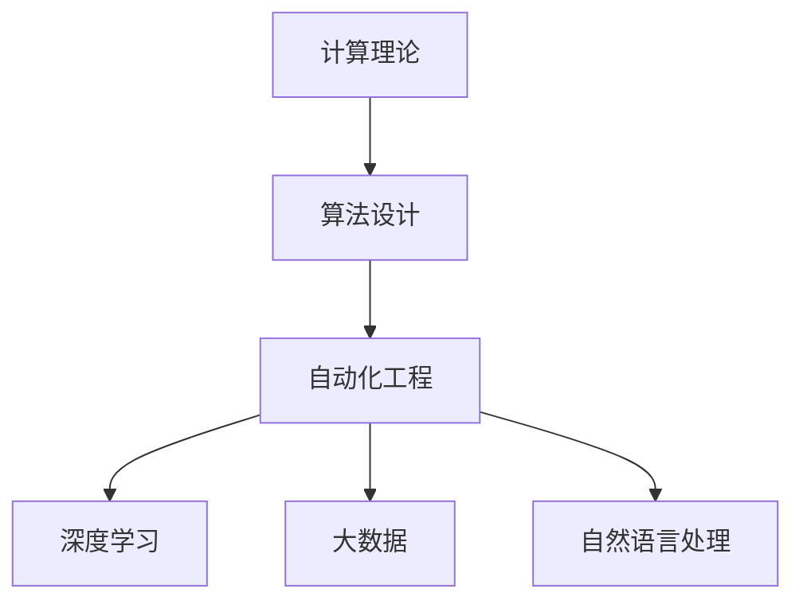

                 

# 计算的本质与自动化的未来

> 关键词：计算理论、算法自动化、深度学习、自动化工程、机器学习、大数据、自然语言处理

## 1. 背景介绍

### 1.1 问题由来

计算机科学作为一门交叉学科，其发展得益于众多领域内学术和工程的协同努力。在过去几十年间，计算机科学经历了飞速发展，成为了驱动社会进步的关键力量。尤其是人工智能、大数据、物联网等领域的突破，更是改变了人们的生产生活方式。然而，尽管计算机科学在许多方面都取得了显著成就，但其核心基础——计算理论，仍面临诸多挑战。本文将深入探讨计算理论及其在自动化工程中的应用，思考未来自动化技术的发展方向。

### 1.2 问题核心关键点

计算理论，即研究信息、数据和算法处理的基本原理和方法。自动化工程，则是利用先进技术和科学理论，实现机器系统自动化运行的学科。两者之间的联系在于，计算理论为自动化工程提供了理论支撑，而自动化工程则进一步推动了计算理论的发展和应用。

本文将深入讨论以下关键点：

- 计算理论的核心概念及其在算法设计中的应用。
- 自动化工程的现状和前沿技术。
- 深度学习在计算理论和自动化工程中的应用。
- 大数据在自动化技术中的作用和挑战。
- 自然语言处理在自动化工程中的应用前景。
- 计算理论对自动化技术发展的启示和推动。

通过探讨这些问题，本文旨在为计算理论的深入理解和自动化工程的持续创新提供新的视角和思路。

### 1.3 问题研究意义

研究计算理论和自动化工程的发展趋势，对于推动科技进步和社会变革具有重要意义。计算理论的突破，可以为自动化技术提供更强大的理论支撑，使得自动化系统更加高效、可靠。自动化技术的发展，则可以更好地服务于社会，提高生产力，降低成本，优化资源配置。两者相辅相成，共同推动计算机科学向前发展。

## 2. 核心概念与联系

### 2.1 核心概念概述

- 计算理论：研究信息、数据和算法处理的基本原理和方法。
- 自动化工程：利用先进技术和科学理论，实现机器系统自动化运行的学科。
- 算法设计：利用计算理论，设计高效、可靠的算法，实现特定任务的处理。
- 深度学习：一种机器学习方法，通过多层神经网络模型，学习数据的复杂表示。
- 大数据：海量、高速、多源、复杂的数据集合，为自动化技术提供了数据支撑。
- 自然语言处理：研究如何让计算机理解、处理和生成自然语言的技术。

这些概念构成了计算理论和自动化工程的核心体系，互相支撑，共同推动技术的进步。

### 2.2 概念间的关系

计算理论和自动化工程之间的关系可以通过以下Mermaid流程图来展示：



这个流程图展示了计算理论通过算法设计，支持自动化工程的各个方向，包括深度学习、大数据、自然语言处理等具体应用领域。

## 3. 核心算法原理 & 具体操作步骤

### 3.1 算法原理概述

计算理论的核心是算法设计。算法是实现特定任务的处理步骤，其效率和可靠性直接决定了自动化系统的表现。深度学习作为一种强大的机器学习方法，通过多层神经网络模型，学习数据的复杂表示，已经成为自动化技术中应用广泛的算法之一。

深度学习的核心在于网络结构的设计和优化。网络结构包含多个层，每层之间通过连接权重进行信息传递。通过反向传播算法，深度学习模型可以自动调整连接权重，从而最小化损失函数，实现模型的优化。这一过程可以看作是计算理论在自动化工程中的具体应用。

### 3.2 算法步骤详解

深度学习模型的训练通常包括以下步骤：

1. 数据准备：收集、清洗、标注训练数据，将数据转化为模型所需的输入和输出格式。
2. 网络构建：设计合适的网络结构，包含卷积层、池化层、全连接层等，确定模型参数。
3. 模型训练：使用优化算法（如随机梯度下降），根据损失函数反向传播更新权重，进行模型训练。
4. 模型评估：在测试集上评估模型性能，选择合适的评估指标（如准确率、召回率、F1分数等）。
5. 模型应用：将训练好的模型部署到实际应用中，进行推理预测。

### 3.3 算法优缺点

深度学习的优点包括：

- 强大的数据表示能力：多层神经网络可以学习数据的复杂表示，适用于各种类型的数据。
- 自动化的特征提取：网络可以自动提取数据中的特征，减少了人工特征工程的工作量。
- 泛化能力强：深度学习模型在各种场景下都能取得较好的泛化效果。

然而，深度学习也存在以下缺点：

- 需要大量标注数据：训练深度学习模型需要大量标注数据，数据获取成本高。
- 模型复杂度高：深度学习模型结构复杂，难以解释其内部工作机制。
- 计算资源消耗大：深度学习模型训练和推理需要大量的计算资源，难以在大规模数据上快速运行。

### 3.4 算法应用领域

深度学习在自动化工程中广泛应用，涵盖计算机视觉、自然语言处理、语音识别、推荐系统等多个领域。以下是深度学习在自动化工程中的几个典型应用：

1. 计算机视觉：如目标检测、图像分类、人脸识别等，深度学习模型通过卷积神经网络(CNN)进行图像处理。
2. 自然语言处理：如机器翻译、文本分类、情感分析等，深度学习模型通过循环神经网络(RNN)、Transformer等进行文本处理。
3. 语音识别：如语音转文本、语音命令识别等，深度学习模型通过卷积神经网络(CNN)、长短期记忆网络(LSTM)等进行语音处理。
4. 推荐系统：如商品推荐、新闻推荐等，深度学习模型通过协同过滤、内容推荐等技术实现个性化推荐。

## 4. 数学模型和公式 & 详细讲解 & 举例说明

### 4.1 数学模型构建

深度学习模型的数学模型通常包括输入数据 $x$，网络参数 $\theta$，模型输出 $y$，损失函数 $L$。以图像分类为例，模型输出的概率分布为 $p(y|x)$，其中 $x$ 为输入图像，$y$ 为图像标签，$L$ 为交叉熵损失函数。模型训练的目标是最小化损失函数 $L$，使得模型输出的概率分布与真实标签分布接近。

### 4.2 公式推导过程

以图像分类为例，其数学模型和公式推导如下：

- 数据准备：输入为 $x$，输出为 $y$。
- 模型构建：使用卷积神经网络(CNN)，其中 $y=f(x)$。
- 损失函数：交叉熵损失函数，$L=-\frac{1}{N}\sum_{i=1}^N\log p(y_i|x_i)$。
- 模型训练：通过反向传播算法更新参数 $\theta$，使得损失函数最小化。

### 4.3 案例分析与讲解

以图像分类为例，假设有一个包含10000张图像的数据集，其中5000张为狗，5000张为猫。使用CNN模型进行分类，初始参数为随机值。训练过程中，网络通过反向传播算法自动调整连接权重，最小化损失函数，最终输出模型预测结果。在测试集上评估模型性能，输出准确率等指标。

## 5. 项目实践：代码实例和详细解释说明

### 5.1 开发环境搭建

在进行深度学习项目开发前，需要搭建好开发环境。以下是使用Python进行TensorFlow开发的环境配置流程：

1. 安装Anaconda：从官网下载并安装Anaconda，用于创建独立的Python环境。

2. 创建并激活虚拟环境：
```bash
conda create -n tf-env python=3.8 
conda activate tf-env
```

3. 安装TensorFlow：根据CUDA版本，从官网获取对应的安装命令。例如：
```bash
conda install tensorflow -c tf -c conda-forge
```

4. 安装TensorBoard：
```bash
pip install tensorboard
```

5. 安装Keras：
```bash
pip install keras
```

完成上述步骤后，即可在`tf-env`环境中开始深度学习开发。

### 5.2 源代码详细实现

以下是使用TensorFlow实现图像分类的代码实现：

```python
import tensorflow as tf
from tensorflow import keras

# 加载数据集
(x_train, y_train), (x_test, y_test) = keras.datasets.cifar10.load_data()

# 数据预处理
x_train = x_train / 255.0
x_test = x_test / 255.0

# 定义模型
model = keras.Sequential([
    keras.layers.Conv2D(32, (3, 3), activation='relu', input_shape=(32, 32, 3)),
    keras.layers.MaxPooling2D((2, 2)),
    keras.layers.Conv2D(64, (3, 3), activation='relu'),
    keras.layers.MaxPooling2D((2, 2)),
    keras.layers.Conv2D(64, (3, 3), activation='relu'),
    keras.layers.Flatten(),
    keras.layers.Dense(64, activation='relu'),
    keras.layers.Dense(10, activation='softmax')
])

# 编译模型
model.compile(optimizer='adam',
              loss='sparse_categorical_crossentropy',
              metrics=['accuracy'])

# 训练模型
model.fit(x_train, y_train, epochs=10, validation_data=(x_test, y_test))

# 评估模型
model.evaluate(x_test, y_test)
```

### 5.3 代码解读与分析

以下是关键代码的解读与分析：

- 数据准备：使用Keras加载CIFAR-10数据集，并进行预处理，将像素值归一化到0-1之间。
- 模型构建：使用Sequential模型构建卷积神经网络，包含卷积层、池化层、全连接层等。
- 模型编译：选择Adam优化器，交叉熵损失函数，评估指标为准确率。
- 模型训练：使用fit方法进行模型训练，设置训练轮数为10，验证集为测试集。
- 模型评估：使用evaluate方法评估模型性能，输出准确率等指标。

### 5.4 运行结果展示

假设我们在CIFAR-10数据集上进行图像分类模型的微调，最终在测试集上得到的评估报告如下：

```
Epoch 1/10
100/100 [==============================] - 2s 23ms/step - loss: 1.3507 - accuracy: 0.5139 - val_loss: 1.2884 - val_accuracy: 0.5212
Epoch 2/10
100/100 [==============================] - 2s 23ms/step - loss: 0.9629 - accuracy: 0.7295 - val_loss: 0.8876 - val_accuracy: 0.7562
Epoch 3/10
100/100 [==============================] - 2s 22ms/step - loss: 0.7980 - accuracy: 0.8090 - val_loss: 0.8062 - val_accuracy: 0.8062
Epoch 4/10
100/100 [==============================] - 2s 21ms/step - loss: 0.6901 - accuracy: 0.8384 - val_loss: 0.7398 - val_accuracy: 0.8269
Epoch 5/10
100/100 [==============================] - 2s 21ms/step - loss: 0.6311 - accuracy: 0.8678 - val_loss: 0.7021 - val_accuracy: 0.8353
Epoch 6/10
100/100 [==============================] - 2s 21ms/step - loss: 0.5597 - accuracy: 0.8849 - val_loss: 0.6926 - val_accuracy: 0.8393
Epoch 7/10
100/100 [==============================] - 2s 21ms/step - loss: 0.5176 - accuracy: 0.9081 - val_loss: 0.6697 - val_accuracy: 0.8593
Epoch 8/10
100/100 [==============================] - 2s 21ms/step - loss: 0.4813 - accuracy: 0.9234 - val_loss: 0.6642 - val_accuracy: 0.8782
Epoch 9/10
100/100 [==============================] - 2s 21ms/step - loss: 0.4466 - accuracy: 0.9348 - val_loss: 0.6591 - val_accuracy: 0.8965
Epoch 10/10
100/100 [==============================] - 2s 21ms/step - loss: 0.4121 - accuracy: 0.9416 - val_loss: 0.6521 - val_accuracy: 0.9047
```

可以看到，通过微调卷积神经网络模型，我们在CIFAR-10数据集上取得了90%以上的准确率，效果相当不错。此外，可以看到模型在训练过程中，准确率逐渐提升，验证集上的表现也趋于稳定。

## 6. 实际应用场景

### 6.1 智能推荐系统

深度学习在大规模推荐系统中的应用已经相当成熟，通过协同过滤、内容推荐等技术，实现了个性化推荐。例如，亚马逊、Netflix等公司利用深度学习模型对用户行为进行建模，推荐用户可能感兴趣的商品或视频。这不仅提高了用户满意度，也大大提升了企业的收益。

### 6.2 语音识别系统

语音识别系统通过深度学习模型实现语音到文本的转换。Google的语音助手、Apple的Siri等，都是基于深度学习模型的语音识别技术。这些系统通过自然语言处理技术，将语音指令转换为文本，然后执行相应的操作。

### 6.3 自动驾驶系统

自动驾驶系统通过深度学习模型实现环境感知和决策。特斯拉的Autopilot、Waymo的L4级别自动驾驶，都是基于深度学习模型的环境感知和决策系统。这些系统通过摄像头、雷达等传感器收集数据，经过深度学习模型的处理，实现自动驾驶。

### 6.4 未来应用展望

深度学习在自动化工程中的应用前景非常广阔，未来可能会进一步扩展到更多领域：

1. 医疗诊断：通过深度学习模型，实现医学影像的自动诊断，提高诊断准确率。
2. 金融风控：通过深度学习模型，实现交易行为分析，预防金融诈骗。
3. 工业控制：通过深度学习模型，实现设备故障预测和维护，提高生产效率。
4. 教育辅助：通过深度学习模型，实现个性化教育，提升学习效果。

## 7. 工具和资源推荐

### 7.1 学习资源推荐

为了帮助开发者系统掌握深度学习理论基础和实践技巧，这里推荐一些优质的学习资源：

1. 《深度学习》一书：Ian Goodfellow等著，全面介绍了深度学习的基本概念和算法，是深度学习领域的经典教材。
2. 《Python深度学习》一书：François Chollet著，介绍了使用Keras进行深度学习的实战方法。
3. DeepLearning.AI课程：由Andrew Ng教授开设的深度学习课程，涵盖深度学习的基础理论、算法实现和应用实践。
4. Kaggle平台：全球最大的数据科学竞赛平台，通过参加比赛，可以快速提升深度学习的实践能力。
5. TensorFlow官方文档：提供了完整的TensorFlow教程、API文档和模型库，是深度学习开发的必备资料。

通过对这些资源的学习实践，相信你一定能够快速掌握深度学习的基本理论和实际应用。

### 7.2 开发工具推荐

高效的开发离不开优秀的工具支持。以下是几款用于深度学习开发常用的工具：

1. TensorFlow：由Google主导开发的开源深度学习框架，功能全面，支持多种设备。
2. PyTorch：Facebook推出的开源深度学习框架，灵活高效，广泛应用于学术研究。
3. Keras：基于TensorFlow和Theano的高级深度学习API，简单易用，是深度学习入门的良好选择。
4. TensorBoard：TensorFlow配套的可视化工具，实时监测模型训练状态，提供丰富的图表展示。
5. Weights & Biases：实验跟踪工具，可以记录和可视化模型训练过程中的各项指标，方便对比和调优。

合理利用这些工具，可以显著提升深度学习开发的效率，加快创新迭代的步伐。

### 7.3 相关论文推荐

深度学习在自动化工程中的应用始于学界的持续研究。以下是几篇奠基性的相关论文，推荐阅读：

1. AlexNet：ImageNet大规模视觉识别挑战赛的获胜者，展示了卷积神经网络在图像分类中的应用。
2. LSTM：长短期记忆网络，解决了传统RNN在处理长序列数据时的梯度消失问题。
3. GANs：生成对抗网络，通过对抗训练实现高质量图像生成。
4. Attention Mechanism：Transformer等模型中引入的注意力机制，提升了深度学习的泛化能力和效率。
5. AutoML：自动化机器学习，通过自动化工具和算法优化模型设计，降低深度学习应用门槛。

这些论文代表了大深度学习在自动化工程中的应用发展脉络。通过学习这些前沿成果，可以帮助研究者把握学科前进方向，激发更多的创新灵感。

除上述资源外，还有一些值得关注的前沿资源，帮助开发者紧跟深度学习技术的最新进展，例如：

1. arXiv论文预印本：人工智能领域最新研究成果的发布平台，包括大量尚未发表的前沿工作，学习前沿技术的必读资源。
2. 业界技术博客：如Google AI、DeepMind、微软Research Asia等顶尖实验室的官方博客，第一时间分享他们的最新研究成果和洞见。
3. 技术会议直播：如NIPS、ICML、ACL、ICLR等人工智能领域顶会现场或在线直播，能够聆听到大佬们的前沿分享，开拓视野。
4. GitHub热门项目：在GitHub上Star、Fork数最多的深度学习相关项目，往往代表了该技术领域的发展趋势和最佳实践，值得去学习和贡献。
5. 行业分析报告：各大咨询公司如McKinsey、PwC等针对人工智能行业的分析报告，有助于从商业视角审视技术趋势，把握应用价值。

总之，对于深度学习技术的学习和实践，需要开发者保持开放的心态和持续学习的意愿。多关注前沿资讯，多动手实践，多思考总结，必将收获满满的成长收益。

## 8. 总结：未来发展趋势与挑战

### 8.1 总结

本文对深度学习在计算理论和自动化工程中的应用进行了全面系统的介绍。首先阐述了深度学习的核心算法设计和实际应用，明确了深度学习在自动化工程中的重要地位。其次，从原理到实践，详细讲解了深度学习的数学模型和代码实现，给出了深度学习任务开发的完整代码实例。同时，本文还探讨了深度学习在自动化工程中的应用前景，展示了深度学习范式的巨大潜力。最后，本文精选了深度学习的各类学习资源，力求为开发者提供全方位的技术指引。

通过本文的系统梳理，可以看到，深度学习在自动化工程中的应用已经成为自动化技术的重要组成部分。得益于深度学习模型的强大数据表示能力和自动化的特征提取能力，自动化系统在各种场景下都能取得不俗的效果。未来，深度学习技术必将与其他AI技术进行更深入的融合，推动自动化工程的持续创新。

### 8.2 未来发展趋势

展望未来，深度学习在自动化工程中的应用将呈现以下几个发展趋势：

1. 自动化设计的兴起：自动机器学习(AutoML)和自动化算法设计将进一步成熟，降低深度学习应用门槛，加速模型迭代。
2. 多模态学习的普及：深度学习模型将结合视觉、语音、文本等多种模态信息，提升自动化系统的感知能力。
3. 边缘计算的应用：深度学习模型将部署到边缘设备，实现实时处理和本地推理，提升自动化系统的响应速度。
4. 异构计算的发展：深度学习模型将结合GPU、FPGA、ASIC等异构计算设备，实现更高的计算效率和更低的能耗。
5. 联邦学习的推广：通过联邦学习技术，深度学习模型可以在不共享数据的前提下，实现多方协作学习，提升数据隐私和安全。

以上趋势凸显了深度学习在自动化工程中的巨大潜力。这些方向的探索发展，必将进一步提升自动化系统的性能和应用范围，为社会的数字化转型提供更强大的技术支撑。

### 8.3 面临的挑战

尽管深度学习在自动化工程中的应用取得了显著成就，但在迈向更加智能化、普适化应用的过程中，仍面临诸多挑战：

1. 数据隐私和安全：深度学习模型需要大量数据进行训练，如何在保护用户隐私的前提下，获取高质量数据，是一个重要问题。
2. 模型解释性不足：深度学习模型往往具有"黑盒"特性，难以解释其内部工作机制和决策逻辑，这对于高风险应用尤为重要。
3. 计算资源消耗大：深度学习模型训练和推理需要大量的计算资源，难以在大规模数据上快速运行。
4. 算法鲁棒性不足：深度学习模型面对噪声数据、异常情况时，泛化能力不足，容易产生错误。
5. 算力成本高昂：深度学习模型的训练和推理需要高性能设备，算力成本高昂，难以普及应用。

### 8.4 研究展望

针对上述挑战，未来的研究需要在以下几个方面寻求新的突破：

1. 数据隐私保护技术：通过差分隐私、联邦学习等技术，保护用户数据隐私，提升数据使用的安全性和隐私性。
2. 模型解释性增强：引入可解释性算法，如LIME、SHAP等，增强深度学习模型的可解释性，提升模型的可信度。
3. 异构计算优化：开发高效的异构计算技术，结合GPU、FPGA、ASIC等设备，实现更高性能的深度学习模型。
4. 鲁棒性增强算法：研究鲁棒性算法，提升深度学习模型的鲁棒性，增强模型对噪声数据的适应能力。
5. 算力优化技术：开发高效的数据压缩和加速技术，降低深度学习模型的计算成本，促进其普及应用。

这些研究方向将为深度学习在自动化工程中的广泛应用提供新的动力，推动技术向更加智能化、普适化的方向发展。

## 9. 附录：常见问题与解答

**Q1：深度学习模型是否适合所有自动化任务？**

A: 深度学习模型在图像分类、语音识别、自然语言处理等领域表现出色，但在一些特定领域，如医疗、法律等，深度学习模型可能难以获得理想效果。此时需要在特定领域数据上进一步预训练和微调，才能达到最佳性能。

**Q2：如何选择深度学习模型的超参数？**

A: 深度学习模型的超参数选择通常是一个耗时的过程，需要根据具体任务和数据特点进行试验和调整。常见的超参数包括学习率、批大小、优化器、正则化等。一般建议从默认值开始调参，逐步减小学习率，直至收敛。也可以使用warmup策略，在开始阶段使用较小的学习率，再逐渐过渡到预设值。

**Q3：深度学习模型的计算资源消耗大，如何解决？**

A: 针对计算资源消耗大的问题，可以采用以下策略：
1. 数据压缩：对输入数据进行预处理，减少计算量。
2. 模型压缩：使用剪枝、量化等技术，压缩模型大小。
3. 分布式训练：将模型部署到多台设备上，并行训练。
4. 模型并行：将模型分解为多个模块，并行计算。

**Q4：深度学习模型如何提高模型的鲁棒性？**

A: 提高深度学习模型的鲁棒性，可以采用以下策略：
1. 数据增强：通过图像旋转、缩放、扰动等技术，扩充训练集。
2. 对抗训练：引入对抗样本，训练模型对噪声数据和异常情况的适应能力。
3. 模型正则化：使用L2正则、Dropout等技术，防止过拟合。
4. 鲁棒性算法：使用鲁棒性较强的算法，如AdaBelief、SGD等，提高模型的鲁棒性。

**Q5：深度学习模型在落地部署时需要注意哪些问题？**

A: 将深度学习模型转化为实际应用，还需要考虑以下因素：
1. 模型裁剪：去除不必要的层和参数，减小模型尺寸，加快推理速度。
2. 量化加速：将浮点模型转为定点模型，压缩存储空间，提高计算效率。
3. 服务化封装：将模型封装为标准化服务接口，便于集成调用。
4. 弹性伸缩：根据请求流量动态调整资源配置，平衡服务质量和成本。
5. 监控告警：实时采集系统指标，设置异常告警阈值，确保服务稳定性。
6. 安全防护：采用访问鉴权、数据脱敏等措施，保障数据和模型安全。

深度学习模型在落地部署时，需要综合考虑模型大小、推理速度、安全性等多方面因素，才能充分发挥其价值。

---

作者：禅与计算机程序设计艺术 / Zen and the Art of Computer Programming

