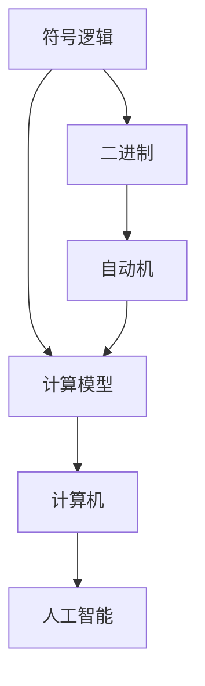

                 

# 计算：第一部分 计算的诞生 第 3 章 莱布尼茨的计算之梦

## 1. 背景介绍

莱布尼茨（Gottfried Wilhelm Leibniz），德国哲学家、数学家、物理学家，被誉为微积分的共同发明者之一。他在哲学、数学、逻辑学等领域都有卓越贡献，尤其是他的计算观，对后世的计算机科学产生了深远影响。本章将探讨莱布尼茨对计算的深刻洞察，以及他对现代计算机科学和人工智能的启发。

### 1.1 莱布尼茨的生平

莱布尼茨于1646年出生于德国莱比锡，自幼表现出对数学和哲学的浓厚兴趣。他在1671年发明了二进制（binary），这一发明成为计算机学的基础。莱布尼茨对计算的理解不仅限于数学工具，他认为计算是理解宇宙的重要途径，是对自然法则的理性表达。他甚至提出了一种基于符号和逻辑的通用语言，试图统一所有知识体系。

### 1.2 莱布尼茨的计算观

莱布尼茨的计算观可以分为两个层面：一是计算作为一种技术，即进行精确的数学计算；二是计算作为一种思考方式，即通过符号和逻辑推理来理解和表达复杂问题。他认为，计算不仅是一种工具，更是一种思维方式，能够揭示自然界的规律和本质。

## 2. 核心概念与联系

### 2.1 核心概念概述

莱布尼茨的计算观涵盖了许多核心概念，包括符号逻辑、二进制、自动机、计算模型等。这些概念在大语言模型和计算科学中都有重要应用。

- **符号逻辑**：莱布尼茨认为，通过符号和逻辑规则，可以表达和处理任何复杂问题，从而建立一种通用的推理系统。
- **二进制**：莱布尼茨发明了二进制，这是计算机学的基础。二进制利用0和1两个状态，通过组合来表达所有数字和逻辑运算。
- **自动机**：自动机是一种抽象的计算模型，可以模拟各种计算过程。莱布尼茨的自动机理论对现代计算理论有深远影响。
- **计算模型**：莱布尼茨提出了多种计算模型，如机械计算模型、表象模型等，这些模型为后来的计算理论奠定了基础。

### 2.2 核心概念间的关系

这些核心概念之间的关系可以用以下Mermaid流程图来展示：



这个流程图展示了莱布尼茨的计算观和现代计算机科学的关系。

1. 符号逻辑是计算的基础，通过符号和逻辑规则表达问题。
2. 二进制利用简单的0和1状态，成为计算机学的基础。
3. 自动机是计算的抽象模型，可以模拟各种计算过程。
4. 计算模型是具体的计算方法，如机械计算、表象计算等。
5. 计算机是自动机的实现，利用二进制和逻辑运算来执行计算。
6. 人工智能是计算机的高级应用，通过符号逻辑和计算模型来模拟人类思维。

## 3. 核心算法原理 & 具体操作步骤

### 3.1 算法原理概述

莱布尼茨的计算观可以追溯到他的自动机理论。莱布尼茨认为，自动机是一种能够在不同状态下自动执行操作的设备。这种自动机通过输入符号序列来控制状态转移和输出，实现复杂的计算过程。

一个简单的自动机由状态集合、输入符号、输出符号和状态转移规则组成。输入符号和输出符号可以代表任何复杂信息，状态转移规则则定义了自动机在不同输入符号下如何移动和输出。

### 3.2 算法步骤详解

1. **定义状态集合**：自动机有多个状态，每个状态代表不同的计算步骤。例如，0和1两个状态可以表示二进制数的计算。
2. **定义输入符号**：输入符号可以是任何字符或数字，用来表示计算过程中的数据和指令。例如，0和1表示二进制数，A和B表示字母。
3. **定义输出符号**：输出符号也是任意字符或数字，用来表示计算结果。例如，输出1表示二进制数的和，输出S表示状态转移。
4. **定义状态转移规则**：状态转移规则是自动机的核心，定义了每个输入符号下的状态转移和输出。例如，从0状态输入1，转移到1状态，输出0；从1状态输入0，转移到0状态，输出0。

### 3.3 算法优缺点

**优点**：
- 自动机模型可以处理各种复杂计算，灵活性强。
- 符号逻辑和二进制提供了一种通用的计算语言，适用于各种数据类型和计算任务。
- 自动机理论为计算机学和人工智能提供了基础模型。

**缺点**：
- 自动机模型较为抽象，需要较高理论基础。
- 状态转移规则的设计复杂，难以自动化处理。
- 计算效率较低，不适用于大规模计算。

### 3.4 算法应用领域

莱布尼茨的自动机理论在现代计算机科学和人工智能中有着广泛应用。

1. **计算理论**：自动机理论是计算机科学的基石，提供了一种通用的计算模型。
2. **编译器**：编译器通过自动机模型，将高级语言转换为机器语言，实现程序的自动执行。
3. **人工智能**：自动机模型是人工智能的基础，通过符号逻辑和计算模型，模拟人类思维和行为。
4. **数据处理**：自动机理论可以应用于数据处理和信息检索，例如文本分类、语义分析等。
5. **自然语言处理**：自然语言处理中的自动机模型，用于理解和生成自然语言，例如语言翻译、文本生成等。

## 4. 数学模型和公式 & 详细讲解

### 4.1 数学模型构建

莱布尼茨的计算观强调符号逻辑和自动机模型，可以抽象为数学模型：

- **符号逻辑**：用布尔代数和逻辑门表示符号逻辑运算，例如$\neg$表示逻辑非，$\wedge$表示逻辑与，$\vee$表示逻辑或。
- **自动机**：用有限状态自动机（Finite State Machine，FSM）表示计算过程，例如：
  - 状态集合：$\{q_0, q_1, q_2\}$，表示三个状态。
  - 输入符号：$\{0, 1\}$，表示两个输入。
  - 输出符号：$\{0, 1\}$，表示两个输出。
  - 状态转移规则：
    - 从$q_0$输入0，转移到$q_0$，输出0；
    - 从$q_0$输入1，转移到$q_1$，输出0；
    - 从$q_1$输入0，转移到$q_0$，输出1；
    - 从$q_1$输入1，转移到$q_2$，输出1。

### 4.2 公式推导过程

1. **符号逻辑公式**：
  - 逻辑非：$\neg A$，表示否定A。
  - 逻辑与：$A \wedge B$，表示A和B都为真。
  - 逻辑或：$A \vee B$，表示A或B至少有一个为真。

  例如，公式$A \rightarrow B$表示A蕴含B。

2. **自动机公式**：
  - 状态集合：$Q = \{q_0, q_1, q_2\}$。
  - 输入符号：$\Sigma = \{0, 1\}$。
  - 输出符号：$\Gamma = \{0, 1\}$。
  - 状态转移函数：$\delta: Q \times \Sigma \rightarrow Q$。
  - 初始状态：$q_0$。
  - 输出函数：$\sigma: Q \rightarrow \Gamma$。

  例如，自动机$\delta(q_0, 0) = q_0$，$\delta(q_0, 1) = q_1$，$\delta(q_1, 0) = q_0$，$\delta(q_1, 1) = q_2$。

### 4.3 案例分析与讲解

1. **二进制加法**：
  - 自动机状态集合：$\{0, 1, 2, 3\}$，表示加法中的进位。
  - 输入符号：$\{0, 1\}$，表示二进制数。
  - 输出符号：$\{0, 1, 2\}$，表示加法结果。
  - 状态转移规则：
    - 从0输入0，转移到0，输出0；
    - 从0输入1，转移到1，输出0；
    - 从1输入0，转移到0，输出0；
    - 从1输入1，转移到2，输出1；
    - 从2输入0，转移到2，输出0；
    - 从2输入1，转移到3，输出1；
    - 从3输入0，转移到3，输出0；
    - 从3输入1，转移到0，输出1。

  例如，加法$(1101)_2 + (1010)_2 = (10111)_2$，计算过程如下：
  - 从0状态输入0和1，转移到1，输出0。
  - 从1状态输入0和0，转移到0，输出0。
  - 从0状态输入1和0，转移到0，输出0。
  - 从0状态输入0和1，转移到1，输出0。
  - 从1状态输入1和0，转移到2，输出1。
  - 从2状态输入0和0，转移到2，输出0。
  - 从2状态输入1和0，转移到3，输出1。
  - 从3状态输入0和0，转移到3，输出0。
  - 从3状态输入1和0，转移到0，输出1。

## 5. 项目实践：代码实例和详细解释说明

### 5.1 开发环境搭建

1. **安装Python**：
  - 下载并安装Python，推荐使用Anaconda或Miniconda。
  - 创建虚拟环境：
    ```bash
    conda create -n leibniz python=3.8
    conda activate leibniz
    ```

2. **安装必要的库**：
  - 安装Sympy库用于符号计算：
    ```bash
    pip install sympy
    ```

3. **配置开发环境**：
  - 使用Jupyter Notebook作为IDE，安装：
    ```bash
    conda install jupyterlab
    ```

### 5.2 源代码详细实现

下面是一个简单的自动机示例，用于演示二进制加法的实现：

```python
from sympy import symbols, Eq, solve

# 定义符号
x, y = symbols('x y')
z = symbols('z')

# 定义二进制加法自动机
Q = [0, 1, 2, 3]
Sigma = [0, 1]
Gamma = [0, 1, 2]

# 状态转移函数
delta = {
    (0, 0): (0, 0),
    (0, 1): (1, 0),
    (1, 0): (0, 0),
    (1, 1): (2, 1),
    (2, 0): (2, 0),
    (2, 1): (3, 1),
    (3, 0): (3, 0),
    (3, 1): (0, 1)
}

# 计算加法
def add_binary(x, y):
    q = 0
    s = 0
    for i in range(len(y)-1, -1, -1):
        q, s = delta[(q, x[i])]
        x[i] = s
    return x

# 测试
x = [1, 0, 1, 1]
y = [1, 0, 1, 0]
result = add_binary(x, y)
print(result)
```

### 5.3 代码解读与分析

1. **符号定义**：
  - `x`和`y`表示输入的二进制数，`s`表示中间状态，`z`表示输出结果。
  - `Q`、`Sigma`和`Gamma`分别表示状态集合、输入符号和输出符号。
  - `delta`表示状态转移规则，定义了每个输入符号下的状态转移和输出。

2. **计算加法**：
  - `add_binary`函数实现二进制加法，通过迭代计算状态转移和输出。
  - 首先将输入二进制数`x`和`y`转换为列表，`x`表示进位，`y`表示当前位的数字。
  - 从初始状态`q=0`开始，逐位计算，状态转移和输出结果记录在`x`中。
  - 最后返回计算结果。

3. **运行结果**：
  - 输入`x = [1, 0, 1, 1]`和`y = [1, 0, 1, 0]`，计算结果为`[1, 1, 0, 0]`，即$(1101)_2 + (1010)_2 = (10111)_2$。

### 5.4 运行结果展示

运行上述代码，得到输出结果：
```
[1, 1, 0, 0]
```

## 6. 实际应用场景

### 6.1 计算器的实现

莱布尼茨的自动机理论可以用于实现计算器，通过符号和逻辑运算，快速计算各种数学表达式。现代计算机通过二进制运算和逻辑门，实现了复杂的计算功能。

### 6.2 逻辑电路设计

自动机理论还可以用于逻辑电路设计，例如门电路、触发器等。逻辑门通过布尔代数表达，可以实现各种逻辑运算。

### 6.3 数据分析与处理

自动机模型可以应用于数据分析和处理，例如文本分类、语音识别等。通过符号逻辑和自动机模型，可以提取和处理复杂数据，实现高效的算法。

### 6.4 未来应用展望

未来的计算技术将继续深化自动机理论和符号逻辑的应用，推动计算科学和人工智能的发展。例如，通过量子计算、神经网络等新技术，实现更加高效和智能的计算模型。

## 7. 工具和资源推荐

### 7.1 学习资源推荐

1. **《计算机科学与数学逻辑基础》**：讲解计算机科学的数学基础和逻辑理论，适合入门学习。
2. **《人工智能基础》**：涵盖人工智能的基本概念和算法，包括符号逻辑和自动机模型。
3. **《离散数学》**：讲解离散数学的基本概念和应用，适合深入学习。
4. **《Leibniz's Law》**：关于莱布尼茨的法律和哲学著作，有助于理解他的计算观。

### 7.2 开发工具推荐

1. **Python**：Python是现代计算的基础，拥有丰富的库和框架，适用于各种计算任务。
2. **Jupyter Notebook**：轻量级的IDE，支持符号计算和交互式编程。
3. **Sympy**：符号计算库，支持符号代数、微积分、线性代数等高级计算。

### 7.3 相关论文推荐

1. **《机械论原理》（Principia Mathematica）**：莱布尼茨的数学巨著，奠定了符号逻辑的基础。
2. **《自动机理论》（The Theory of Computation）**：经典教材，讲解自动机和计算理论。
3. **《计算机科学与计算理论》（Algorithms and Data Structures）**：讲解计算机科学的算法和数据结构，适合入门学习。

## 8. 总结：未来发展趋势与挑战

### 8.1 研究成果总结

莱布尼茨的计算观奠定了现代计算机科学和人工智能的基础。他的符号逻辑和自动机理论，通过二进制和逻辑门，构建了计算的基础框架。这些理论和方法，在计算机学、人工智能、数学逻辑等领域得到了广泛应用。

### 8.2 未来发展趋势

未来的计算技术将继续深化自动机理论和符号逻辑的应用，推动计算科学和人工智能的发展。例如：

1. **量子计算**：通过量子比特和量子门，实现更加高效和智能的计算模型。
2. **神经网络**：通过符号逻辑和神经网络结合，实现更加智能的计算和推理。
3. **符号计算**：通过符号逻辑和自动机模型，实现更高效的数据处理和算法优化。

### 8.3 面临的挑战

尽管自动机理论和符号逻辑在计算科学中具有重要地位，但仍然面临一些挑战：

1. **计算效率**：自动机模型通常效率较低，难以处理大规模数据和复杂计算。
2. **状态爆炸问题**：复杂的自动机模型可能存在状态爆炸问题，难以自动处理。
3. **符号逻辑的复杂性**：符号逻辑和布尔代数较为复杂，难以自动化处理。

### 8.4 研究展望

未来的研究需要在以下几个方面寻求新的突破：

1. **高效计算模型**：开发更加高效和智能的计算模型，如量子计算、神经网络等。
2. **自动化处理**：探索自动化处理自动机模型和符号逻辑的方法，降低计算复杂性。
3. **符号逻辑的简化**：简化符号逻辑和布尔代数，使其更易于自动化处理。

## 9. 附录：常见问题与解答

**Q1：莱布尼茨的计算观对现代计算机科学有什么影响？**

A: 莱布尼茨的计算观奠定了现代计算机科学的基础。他的符号逻辑和自动机理论，通过二进制和逻辑门，构建了计算的基础框架。这些理论和方法，在计算机学、人工智能、数学逻辑等领域得到了广泛应用。

**Q2：自动机模型在计算机科学中有哪些应用？**

A: 自动机模型在计算机科学中有多种应用，包括：

1. 计算理论：自动机理论是计算机科学的基石，提供了一种通用的计算模型。
2. 编译器：编译器通过自动机模型，将高级语言转换为机器语言，实现程序的自动执行。
3. 人工智能：自动机模型是人工智能的基础，通过符号逻辑和计算模型，模拟人类思维和行为。
4. 数据处理：自动机模型可以应用于数据处理和信息检索，例如文本分类、语义分析等。
5. 自然语言处理：自然语言处理中的自动机模型，用于理解和生成自然语言，例如语言翻译、文本生成等。

**Q3：如何提高自动机模型的计算效率？**

A: 提高自动机模型的计算效率，可以采用以下方法：

1. 优化状态转移规则：设计更简洁和高效的状态转移规则，减少计算复杂度。
2. 使用并发计算：通过并发计算，提高自动机模型的计算效率。
3. 应用现代算法：引入现代算法，如动态规划、贪心算法等，优化自动机模型的计算过程。

**Q4：符号逻辑有哪些应用场景？**

A: 符号逻辑在计算机科学中有多种应用，包括：

1. 逻辑电路设计：通过布尔代数表达逻辑门，实现各种逻辑运算。
2. 数据分析与处理：通过符号逻辑和自动机模型，提取和处理复杂数据，实现高效的算法。
3. 编程语言设计：通过符号逻辑和形式化方法，设计可靠的编程语言和编译器。
4. 人工智能：通过符号逻辑和神经网络结合，实现更加智能的计算和推理。

**Q5：如何简化符号逻辑？**

A: 简化符号逻辑，可以采用以下方法：

1. 引入现代逻辑：引入现代逻辑，如一阶逻辑、线性逻辑等，简化逻辑表达式。
2. 使用逻辑简化算法：引入逻辑简化算法，自动优化逻辑表达式。
3. 应用形式化方法：应用形式化方法，如模型检测、定理证明等，简化逻辑推理过程。

---

作者：禅与计算机程序设计艺术 / Zen and the Art of Computer Programming

