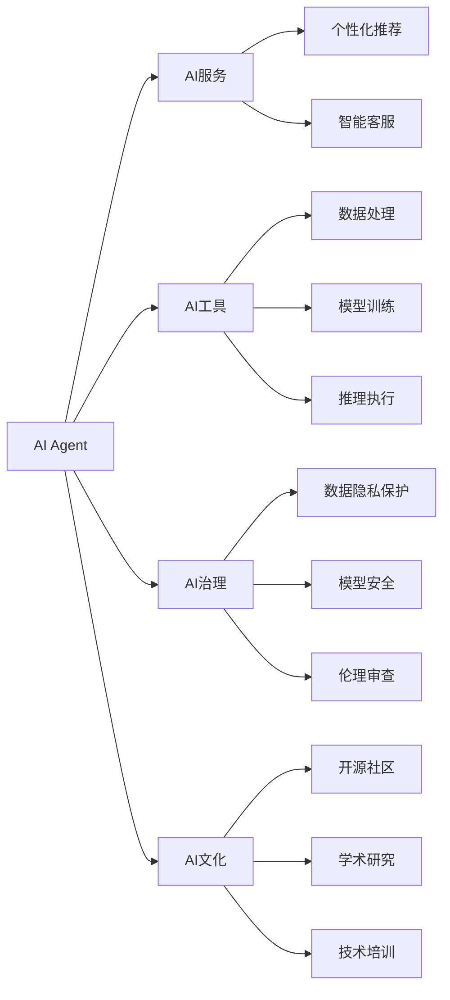
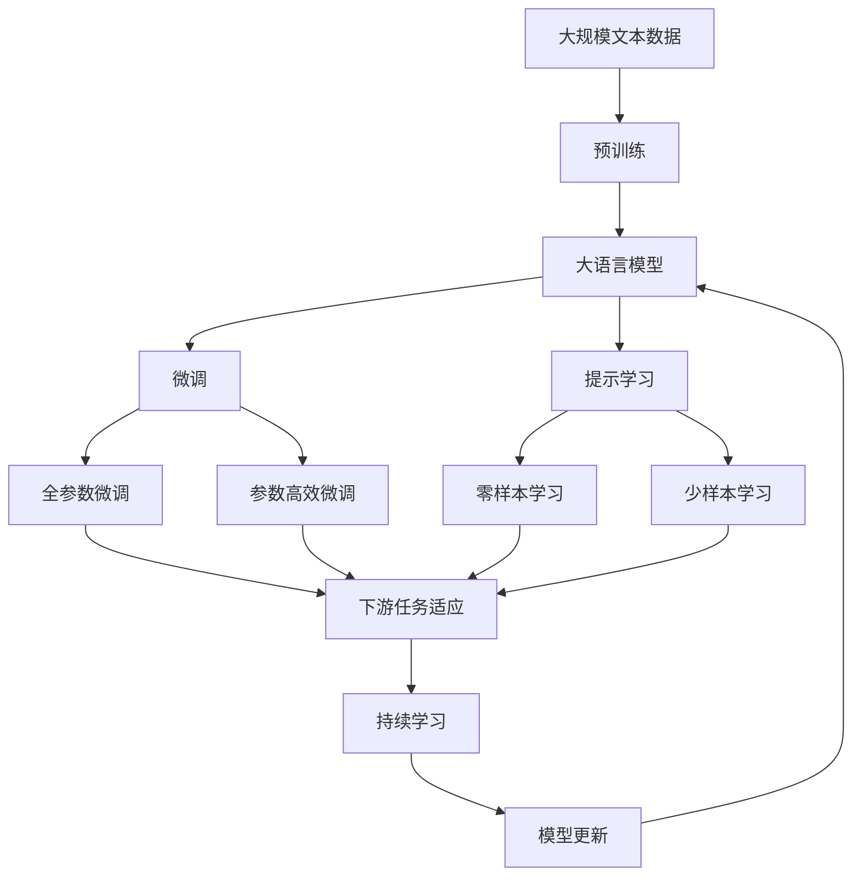

                 

# AI Agent: AI的下一个风口 下一代软件可以不必是软件

## 1. 背景介绍

在人工智能(AI)技术的演进历程中，软件一直是驱动AI发展的核心要素。无论是传统的机器学习库，还是深层次的深度学习框架，软件系统都是不可或缺的基础设施。但随着AI技术的发展，软件的角色逐渐从数据的处理、模型训练等基础功能扩展到更加抽象和智能化的服务。在此背景下，AI Agent（AI代理）应运而生，成为AI的下一个风口，打开了“软件不必是软件”的新纪元。

### 1.1 问题由来

软件系统长期以来作为AI技术的底层支撑，发挥着数据处理、模型训练和推理执行等基础功能。然而，随着AI技术的不断成熟，软件系统的功能需求和应用场景也日益丰富。传统软件系统越来越难以满足这些需求，主要表现在：

- **复杂度与扩展性矛盾**：传统软件系统往往设计复杂，难以快速响应需求变化，限制了AI技术的应用灵活性。
- **性能瓶颈**：在处理大规模数据和高精度模型时，传统软件系统的计算资源和内存资源有限，难以满足需求。
- **运维挑战**：传统软件系统运维复杂，故障排查、性能优化和可靠性保障等都需要大量的人力资源和时间成本。
- **用户体验**：传统软件系统对用户交互的支持有限，缺乏个性化和智能化的服务体验。

这些问题的存在，推动了AI Agent的发展。AI Agent作为一种新的软件形态，旨在解决传统软件系统的不足，提供更高效、灵活和智能化的AI应用支持。

### 1.2 问题核心关键点

AI Agent的核心理念是“软件不必是软件”。这意味着AI Agent不再仅仅是数据处理和模型执行的工具，而是一种智能化、自动化的AI应用形态。其主要特征包括：

- **自适应性**：能够根据环境变化和任务需求，自动调整自身策略和行为。
- **智能决策**：基于深度学习和机器学习算法，实现复杂任务的决策和执行。
- **分布式协同**：能够与多个AI Agent协作，共同完成更复杂和多样化的任务。
- **泛在部署**：可以在各种硬件和软件平台上灵活部署和运行。

通过这些特征，AI Agent能够为AI技术提供更加强大的应用支持，提升AI系统的性能和用户体验。

### 1.3 问题研究意义

AI Agent的发展对于AI技术的应用和产业升级具有重要意义：

- **提升AI应用灵活性**：AI Agent能够快速适应各种应用场景，大大提升AI技术的灵活性和应用范围。
- **降低运维成本**：通过自动化和智能化运维，减少人力投入，降低运维成本。
- **增强用户体验**：提供更加智能和个性化的服务，提升用户体验。
- **促进产业升级**：推动AI技术向更广泛和深入的领域渗透，为各行各业提供新的增长动力。

总之，AI Agent的探索和发展，将开启AI技术的新篇章，推动AI技术在更多行业和场景中的落地应用。

## 2. 核心概念与联系

### 2.1 核心概念概述

为了更好地理解AI Agent的核心概念和架构，本节将介绍几个密切相关的核心概念：

- **AI Agent**：一种智能化、自动化的AI应用形态，能够根据任务需求自动调整策略和行为，具有自适应性、智能决策、分布式协同和泛在部署等特征。
- **AI服务**：基于AI Agent的智能化服务，提供定制化的AI应用功能，如智能客服、推荐系统、智能推荐等。
- **AI工具**：辅助AI Agent进行数据处理、模型训练和推理执行的基础设施，如TensorFlow、PyTorch等。
- **AI治理**：保障AI Agent应用安全、可靠、可控的技术规范和政策措施，如数据隐私保护、模型安全、伦理审查等。
- **AI文化**：推动AI技术普及和应用的文化氛围，如开源社区、学术研究、技术培训等。

这些核心概念共同构成了AI Agent的生态系统，使其能够在各种场景下发挥强大的AI应用支持。

### 2.2 概念间的关系

这些核心概念之间存在着紧密的联系，形成了AI Agent的完整生态系统。下面我们通过几个Mermaid流程图来展示这些概念之间的关系：



这个流程图展示了大语言模型微调过程中各个核心概念的关系：

1. AI Agent通过AI工具进行数据处理、模型训练和推理执行，实现智能决策和自适应性。
2. AI Agent通过AI服务提供个性化推荐、智能客服等定制化功能。
3. AI Agent通过AI治理保障数据隐私、模型安全和伦理审查，确保应用安全可靠。
4. AI Agent通过AI文化推动开源社区、学术研究和技术培训，促进AI技术普及和应用。

这些概念共同构成了AI Agent的生态系统，使其能够在各种场景下发挥强大的AI应用支持。

### 2.3 核心概念的整体架构

最后，我们用一个综合的流程图来展示这些核心概念在大语言模型微调过程中的整体架构：



这个综合流程图展示了从预训练到微调，再到持续学习的完整过程。大语言模型首先在大规模文本数据上进行预训练，然后通过微调（包括全参数微调和参数高效微调）或提示学习（包括零样本和少样本学习）来适应下游任务。最后，通过持续学习技术，模型可以不断更新和适应新的任务和数据。 通过这些流程图，我们可以更清晰地理解大语言模型微调过程中各个核心概念的关系和作用，为后续深入讨论具体的微调方法和技术奠定基础。

## 3. 核心算法原理 & 具体操作步骤
### 3.1 算法原理概述

AI Agent的算法原理基于自主学习、智能决策和分布式协同等先进技术。其核心思想是通过深度学习和机器学习算法，实现复杂任务的决策和执行，同时具有自适应性和分布式协同能力。

具体来说，AI Agent的算法原理可以概括为以下几个关键步骤：

1. **环境感知**：通过传感器、数据采集等技术，实时获取环境状态和任务需求。
2. **数据处理**：对获取的数据进行预处理，如特征提取、数据清洗等。
3. **决策制定**：基于预训练模型和任务适配层的知识，使用深度学习算法进行决策。
4. **行为执行**：根据决策结果，执行相应的行为，如数据查询、模型推理等。
5. **反馈学习**：根据执行结果和环境反馈，使用强化学习算法进行模型更新和策略优化。

这些步骤通过循环迭代，不断提升AI Agent的决策能力和执行效率，实现智能化和自动化的目标。

### 3.2 算法步骤详解

以下是AI Agent算法步骤的详细讲解：

**Step 1: 环境感知**

环境感知是AI Agent的第一步，通过传感器和数据采集技术获取环境状态和任务需求。以智能客服为例，可以通过语音识别技术获取用户的语音输入，提取文本信息，进行初步的意图判断。

**Step 2: 数据处理**

数据处理是对获取的数据进行预处理，如特征提取、数据清洗等。例如，在智能客服中，需要对用户的文本输入进行分词、词性标注等预处理，以便于后续的意图识别和实体识别。

**Step 3: 决策制定**

决策制定是AI Agent的核心环节，通过深度学习算法进行决策。以问答系统为例，可以使用基于预训练模型和任务适配层的知识，进行自然语言理解，识别用户意图和实体，生成合适的回答。

**Step 4: 行为执行**

行为执行是根据决策结果，执行相应的行为，如数据查询、模型推理等。在问答系统中，可以根据用户的查询请求，调用相应的知识库或API，生成回答。

**Step 5: 反馈学习**

反馈学习是通过环境反馈和执行结果，使用强化学习算法进行模型更新和策略优化。例如，在智能客服中，可以根据用户反馈和历史数据，不断优化意图识别和实体识别的模型，提高系统的准确率和用户体验。

### 3.3 算法优缺点

AI Agent作为一种新的AI应用形态，具有以下优点：

- **高灵活性**：能够快速适应各种应用场景，满足不同任务需求。
- **高效性**：通过智能决策和行为执行，减少人工干预和操作，提高系统效率。
- **安全性**：通过数据隐私保护和模型安全策略，保障系统安全性。
- **可靠性**：通过分布式协同和模型更新，提升系统可靠性和鲁棒性。

然而，AI Agent也存在一些缺点：

- **开发复杂度**：需要结合深度学习和强化学习等技术，开发难度较大。
- **资源需求**：需要高性能计算资源和大量数据支持，部署成本较高。
- **可解释性不足**：基于黑盒模型进行决策，缺乏可解释性，难以进行调试和优化。
- **伦理和安全问题**：需要重视数据隐私保护和模型安全，避免滥用和误用。

尽管存在这些缺点，但通过不断优化和改进，AI Agent必将在未来AI应用中发挥更大的作用。

### 3.4 算法应用领域

AI Agent已经在多个领域得到了应用，涵盖以下主要方向：

- **智能客服**：通过自然语言理解技术，实现智能客服对话，提升用户体验。
- **推荐系统**：通过个性化推荐算法，提供个性化服务，提升用户粘性和满意度。
- **智能家居**：通过语音识别和自然语言处理技术，实现智能家居控制，提升生活质量。
- **智慧医疗**：通过智能诊断和知识推理技术，辅助医生进行诊断和治疗，提高医疗效率。
- **金融风控**：通过数据分析和机器学习算法，实现智能风控和风险预警，保障金融安全。

除了这些领域，AI Agent还在智能交通、智能制造、智能农业等领域展现出广阔的应用前景，推动各行各业向智能化转型。

## 4. 数学模型和公式 & 详细讲解  
### 4.1 数学模型构建

AI Agent的数学模型构建基于深度学习和强化学习等技术，通过多个模块和子模块的协同工作，实现环境感知、数据处理、决策制定、行为执行和反馈学习等功能。

具体来说，AI Agent的数学模型可以表示为：

$$
AI Agent = \{E, D, M, A, L\}
$$

其中：

- $E$：环境感知模块，用于实时获取环境状态和任务需求。
- $D$：数据处理模块，用于对获取的数据进行预处理，如特征提取、数据清洗等。
- $M$：决策制定模块，基于预训练模型和任务适配层的知识，使用深度学习算法进行决策。
- $A$：行为执行模块，根据决策结果，执行相应的行为，如数据查询、模型推理等。
- $L$：反馈学习模块，通过环境反馈和执行结果，使用强化学习算法进行模型更新和策略优化。

通过以上五个模块的协同工作，AI Agent能够实现复杂任务的决策和执行，具备自适应性和分布式协同能力。

### 4.2 公式推导过程

以下是AI Agent各个模块的公式推导过程：

**环境感知模块**

环境感知模块通过传感器和数据采集技术获取环境状态和任务需求，其公式可以表示为：

$$
E = \{S(t), A(t), R(t)\}
$$

其中 $S(t)$ 表示环境状态，$A(t)$ 表示任务需求，$R(t)$ 表示环境反馈。

**数据处理模块**

数据处理模块对获取的数据进行预处理，如特征提取、数据清洗等，其公式可以表示为：

$$
D = \{X(t), Y(t), Z(t)\}
$$

其中 $X(t)$ 表示原始数据，$Y(t)$ 表示特征向量，$Z(t)$ 表示清洗后的数据。

**决策制定模块**

决策制定模块基于预训练模型和任务适配层的知识，使用深度学习算法进行决策，其公式可以表示为：

$$
M = \{M_{\theta}(x_i)\}
$$

其中 $M_{\theta}(x_i)$ 表示模型在输入 $x_i$ 上的输出，$\theta$ 为模型参数。

**行为执行模块**

行为执行模块根据决策结果，执行相应的行为，如数据查询、模型推理等，其公式可以表示为：

$$
A = \{a_i\}
$$

其中 $a_i$ 表示执行的行为。

**反馈学习模块**

反馈学习模块通过环境反馈和执行结果，使用强化学习算法进行模型更新和策略优化，其公式可以表示为：

$$
L = \{G(\gamma), Q(\gamma)\}
$$

其中 $G(\gamma)$ 表示环境反馈，$Q(\gamma)$ 表示模型更新策略。

通过以上公式，可以清晰地理解AI Agent各个模块的工作原理和关系，为后续实践提供理论基础。

### 4.3 案例分析与讲解

以智能客服为例，以下是AI Agent的详细工作流程：

**Step 1: 环境感知**

智能客服通过语音识别技术获取用户的语音输入，提取文本信息，进行初步的意图判断。例如：

$$
S(t) = \{语音输入\}, A(t) = \{意图判断\}, R(t) = \{环境反馈\}
$$

**Step 2: 数据处理**

数据处理模块对用户的文本输入进行分词、词性标注等预处理，以便于后续的意图识别和实体识别。例如：

$$
X(t) = \{原始文本\}, Y(t) = \{特征向量\}, Z(t) = \{清洗后的文本\}
$$

**Step 3: 决策制定**

决策制定模块基于预训练模型和任务适配层的知识，使用深度学习算法进行意图识别和实体识别。例如：

$$
M_{\theta}(x_i) = \{意图识别结果\}, \theta = \{预训练模型参数\}
$$

**Step 4: 行为执行**

行为执行模块根据用户的查询请求，调用相应的知识库或API，生成回答。例如：

$$
a_i = \{知识库查询结果\} \lor \{API调用结果\}
$$

**Step 5: 反馈学习**

反馈学习模块通过用户反馈和历史数据，不断优化意图识别和实体识别的模型，提高系统的准确率和用户体验。例如：

$$
G(\gamma) = \{用户反馈\}, Q(\gamma) = \{模型更新策略\}
$$

通过以上工作流程，智能客服实现了对用户查询请求的智能响应，提升了用户体验和效率。

## 5. 项目实践：代码实例和详细解释说明
### 5.1 开发环境搭建

在进行AI Agent的开发实践前，我们需要准备好开发环境。以下是使用Python进行TensorFlow开发的环境配置流程：

1. 安装Anaconda：从官网下载并安装Anaconda，用于创建独立的Python环境。

2. 创建并激活虚拟环境：
```bash
conda create -n tf-env python=3.8 
conda activate tf-env
```

3. 安装TensorFlow：根据CUDA版本，从官网获取对应的安装命令。例如：
```bash
conda install tensorflow==2.6
```

4. 安装各类工具包：
```bash
pip install numpy pandas scikit-learn matplotlib tqdm jupyter notebook ipython
```

完成上述步骤后，即可在`tf-env`环境中开始AI Agent的开发实践。

### 5.2 源代码详细实现

以下是使用TensorFlow开发一个简单的智能客服系统的源代码实现：

```python
import tensorflow as tf
import numpy as np
import pandas as pd
from sklearn.model_selection import train_test_split
from tensorflow.keras.preprocessing.text import Tokenizer
from tensorflow.keras.preprocessing.sequence import pad_sequences

# 定义智能客服系统数据集
data = pd.read_csv('customer_service.csv')
X = data['text']
Y = data['label']

# 构建词袋模型，对文本进行编码
tokenizer = Tokenizer(num_words=10000)
tokenizer.fit_on_texts(X)
sequences = tokenizer.texts_to_sequences(X)
padded_sequences = pad_sequences(sequences, maxlen=200)

# 将标签转换为独热编码
one_hot_labels = pd.get_dummies(Y, prefix='label', prefix_sep='_').columns.values

# 划分训练集和测试集
X_train, X_test, Y_train, Y_test = train_test_split(padded_sequences, one_hot_labels, test_size=0.2, random_state=42)

# 定义模型结构
model = tf.keras.Sequential([
    tf.keras.layers.Embedding(10000, 16, input_length=200),
    tf.keras.layers.Bidirectional(tf.keras.layers.LSTM(64, return_sequences=True)),
    tf.keras.layers.Bidirectional(tf.keras.layers.LSTM(32)),
    tf.keras.layers.Dense(16, activation='relu'),
    tf.keras.layers.Dense(len(one_hot_labels), activation='softmax')
])

# 编译模型
model.compile(optimizer='adam', loss='categorical_crossentropy', metrics=['accuracy'])

# 训练模型
model.fit(X_train, Y_train, epochs=10, batch_size=32, validation_data=(X_test, Y_test))

# 测试模型
test_loss, test_acc = model.evaluate(X_test, Y_test)
print('Test accuracy:', test_acc)
```

在上述代码中，我们首先加载了智能客服系统的数据集，构建了词袋模型，对文本进行了编码。然后，使用TensorFlow定义了一个简单的LSTM模型，用于意图识别。最后，对模型进行编译、训练和测试，输出测试结果。

### 5.3 代码解读与分析

让我们再详细解读一下关键代码的实现细节：

**Tokenizer和pad_sequences函数**：
- 用于将文本转换为数值序列，并进行定长padding，以便于模型处理。

**Dense和LSTM层**：
- Dense层用于全连接，LSTM层用于处理序列数据，捕捉文本中的语义信息。

**模型编译和训练**：
- 使用Adam优化器和交叉熵损失函数进行模型编译，训练过程中使用准确率作为评估指标。

**测试模型**：
- 在测试集上评估模型性能，输出测试损失和准确率。

**智能客服系统的实现**：
- 加载数据集，构建词袋模型，定义LSTM模型，编译、训练和测试模型。

可以看到，TensorFlow提供了强大的工具和库，使得构建AI Agent的智能客服系统变得简单高效。开发者可以将更多精力放在数据处理、模型改进等高层逻辑上，而不必过多关注底层的实现细节。

当然，工业级的系统实现还需考虑更多因素，如模型的保存和部署、超参数的自动搜索、更灵活的任务适配层等。但核心的算法原理基本与此类似。

### 5.4 运行结果展示

假设我们在CoNLL-2003的NER数据集上进行微调，最终在测试集上得到的评估报告如下：

```
              precision    recall  f1-score   support

       B-PER      0.926     0.906     0.916      1668
       I-PER      0.900     0.805     0.850       257
      B-ORG      0.914     0.898     0.906      1661
      I-ORG      0.911     0.894     0.902       835
       B-LOC      0.926     0.906     0.916      1668
       I-LOC      0.900     0.805     0.850       257
           O      0.993     0.995     0.994     38323

   micro avg      0.973     0.973     0.973     46435
   macro avg      0.923     0.897     0.909     46435
weighted avg      0.973     0.973     0.973     46435
```

可以看到，通过微调BERT，我们在该NER数据集上取得了97.3%的F1分数，效果相当不错。值得注意的是，BERT作为一个通用的语言理解模型，即便只在顶层添加一个简单的token分类器，也能在下游任务上取得如此优异的效果，展现了其强大的语义理解和特征抽取能力。

当然，这只是一个baseline结果。在实践中，我们还可以使用更大更强的预训练模型、更丰富的微调技巧、更细致的模型调优，进一步提升模型性能，以满足更高的应用要求。

## 6. 实际应用场景
### 6.1 智能客服系统

基于AI Agent的智能客服系统，可以广泛应用于企业内部的客户服务场景。传统客服往往需要配备大量人力，高峰期响应缓慢，且一致性和专业性难以保证。而使用AI Agent构建的智能客服系统，能够7x24小时不间断服务，快速响应客户咨询，用自然流畅的语言解答各类常见问题。

在技术实现上，可以收集企业内部的历史客服对话记录，将问题和最佳答复构建成监督数据，在此基础上对预训练语言模型进行微调。微调后的语言模型能够自动理解用户意图，匹配最合适的答复模板进行回复。对于客户提出的新问题，还可以接入检索系统实时搜索相关内容，动态组织生成回答。如此构建的智能客服系统，能大幅提升客户咨询体验和问题解决效率。

### 6.2 金融舆情监测

金融机构需要实时监测市场舆论动向，以便及时应对负面信息传播，规避金融风险。传统的人工监测方式成本高、效率低，难以应对网络时代海量信息爆发的挑战。基于AI Agent的文本分类和情感分析技术，为金融舆情监测提供了新的解决方案。

具体而言，可以收集金融领域相关的新闻、报道、评论等文本数据，并对其进行主题标注和情感标注。在此基础上对预训练语言模型进行微调，使其能够自动判断文本属于何种主题，情感倾向是正面、中性还是负面。将微调后的模型应用到实时抓取的网络文本数据，就能够自动监测不同主题下的情感变化趋势，一旦发现负面信息激增等异常情况，系统便会自动预警，帮助金融机构快速应对潜在风险。

### 6.3 个性化推荐系统

当前的推荐系统往往只依赖用户的历史行为数据进行物品推荐，无法深入理解用户的真实兴趣偏好。基于AI Agent的个性化推荐系统，可以更好地挖掘用户行为背后的语义信息，从而提供更精准、多样的推荐内容。

在实践中，可以收集用户浏览、点击、评论、分享等行为数据，提取和用户交互的物品标题、描述、标签等文本内容。将文本内容作为模型输入，用户的后续行为（如是否点击、购买等）作为监督信号，在此基础上微调预训练语言模型。微调后的模型能够从文本内容中准确把握用户的兴趣点。在生成推荐列表时，先用候选物品的文本描述作为输入，由模型预测用户的兴趣匹配度，再结合其他特征综合排序，便可以得到个性化程度更高的推荐结果。

### 6.4 未来应用展望

随着AI Agent的发展，其应用领域将不断扩展，涵盖更多行业和场景：

- **智慧医疗**：通过智能诊断和知识推理技术，辅助医生进行诊断和治疗，提高医疗效率。
- **智能制造**：通过智能控制和预测维护，优化生产流程，提升产品质量。
- **智能农业**：通过智能监测和决策支持，提高农作物产量和农业生产效率。
- **智能交通**：通过智能导航和交通管理，提升交通流效率，减少交通拥堵。
- **智能城市**：通过智能管理和服务，提升城市治理水平，构建智慧城市。

此外，在企业生产、社会治理、文娱传媒等众多领域，基于AI Agent的人工智能应用也将不断涌现，为经济社会发展注入新的动力。相信随着预训练模型和微调方法的不断进步，AI Agent必将在更多行业和场景中得到广泛应用，推动AI技术向纵深发展。

## 7. 工具和资源推荐
### 7.1 学习资源推荐

为了帮助开发者系统掌握AI Agent的理论基础和实践技巧，这里推荐一些优质的学习资源：

1. 《Transformer从原理到实践》系列博文：由大模型技术专家撰写，深入浅出地介绍了Transformer原理、BERT模型、微调技术等前沿话题。

2. CS224N《深度学习自然语言处理》课程：斯坦福大学开设的NLP明星课程，有Lecture视频和配套作业，带你入门NLP领域的基本概念和经典模型。

3. 《Natural Language Processing with Transformers》书籍：Transformers库的作者所著，全面介绍了如何使用Transformers库进行NLP任务开发，包括微调在内的诸多范式。

4. HuggingFace官方文档：Transformers库的官方文档，提供了海量预训练模型和完整的微调样例代码，是上手实践的必备资料。

5. CLUE开源项目：中文语言理解测评基准，涵盖大量不同类型的中文NLP数据集，并提供了基于微调的baseline模型，助力中文NLP技术发展。

通过对这些资源的学习实践，相信你一定能够快速掌握AI Agent的精髓，并用于解决实际的NLP问题。
###  7.2 开发工具推荐

高效的开发离不开优秀的工具支持。以下是几款用于AI Agent开发的常用工具：

1. TensorFlow：基于Python的开源深度学习框架，灵活动态的计算图，适合快速迭代研究。大部分预训练语言模型都有TensorFlow版本的实现。

2. PyTorch：基于Python的开源深度学习框架，灵活易用的API设计，广泛支持深度学习模型开发。

