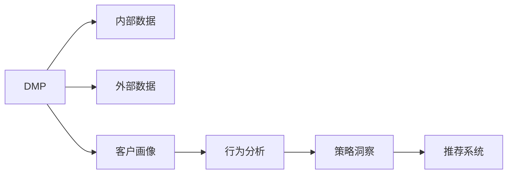
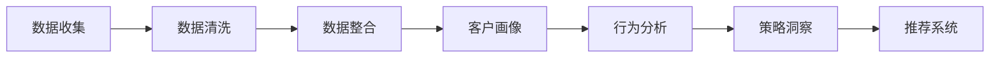
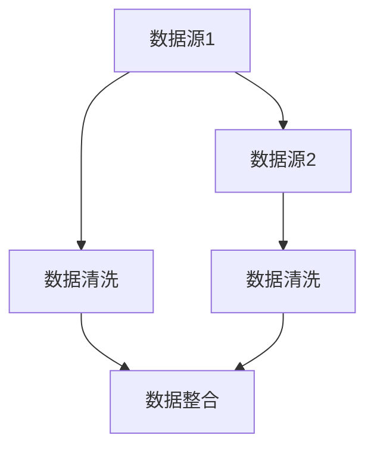
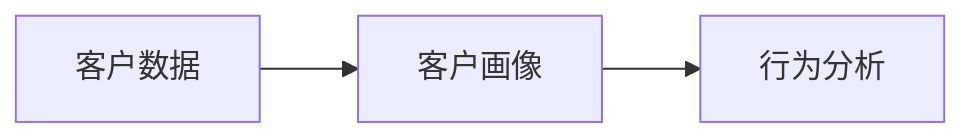
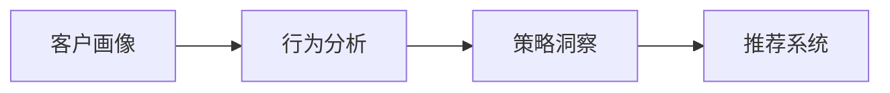
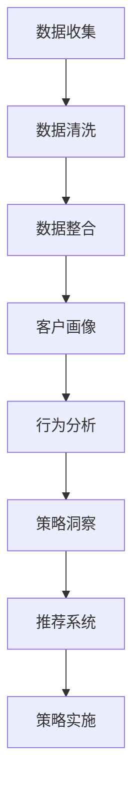

                 

## 1. 背景介绍

随着数字营销的不断发展和成熟，个性化营销变得越来越重要。然而，如何通过数据驱动决策，实现高效精准的个性化营销，成为企业面临的一项重大挑战。人工智能和大数据技术的融合，催生了客户数据平台(Customer Data Platform, DMP)的诞生。DMP作为企业大数据运营的基础设施，通过整合内部和外部的数据资源，为营销人员提供全面的客户画像、行为分析和策略洞察，是实现精准营销的重要工具。本文将深入探讨AI DMP数据基建的原理、实现方法和应用场景，为营销人员提供可操作的实践指南。

## 2. 核心概念与联系

### 2.1 核心概念概述

为更好地理解AI DMP数据基建的原理，本节将介绍几个密切相关的核心概念：

- **客户数据平台(Customer Data Platform, DMP)**：一个企业级的数据管理平台，用于集成和分析各种客户数据，为营销人员提供精准的用户画像和行为分析。DMP通常分为内部DMP和外部DMP。

- **AI DMP**：即基于人工智能的DMP，通过机器学习和数据挖掘技术，对客户数据进行更深入的分析和理解。AI DMP不仅能够整合数据，还能自动发现数据中的潜在关系，提取有价值的信息。

- **客户画像(Customer Profile)**：通过分析客户数据，形成详细的用户画像，包括人口统计信息、行为特征、兴趣爱好等。客户画像是AI DMP的核心输出之一。

- **行为分析(behavior analysis)**：通过分析客户的网站访问、购买、社交互动等行为数据，了解客户的需求和偏好，为个性化营销提供依据。

- **策略洞察(strategy insights)**：基于客户画像和行为分析，为企业提供基于数据的营销策略和方案，实现精准投放和高效转化。

- **推荐系统(recommendation system)**：利用AI DMP中的客户画像和行为数据，实现个性化推荐，提升用户体验和营销效果。

这些核心概念之间的逻辑关系可以通过以下Mermaid流程图来展示：



这个流程图展示了大数据平台与客户画像、行为分析、策略洞察和推荐系统之间的关系：

1. DMP从内部和外部数据源收集客户数据。
2. 客户画像通过分析数据形成详细用户画像。
3. 行为分析通过客户行为数据进行深入洞察。
4. 策略洞察根据客户画像和行为分析提供营销策略。
5. 推荐系统根据客户画像和行为数据进行个性化推荐。

### 2.2 概念间的关系

这些核心概念之间存在着紧密的联系，形成了AI DMP数据基建的完整生态系统。下面我通过几个Mermaid流程图来展示这些概念之间的关系。

#### 2.2.1 AI DMP 的核心流程



这个流程图展示了AI DMP的核心流程：从数据收集到数据整合、客户画像、行为分析、策略洞察和推荐系统的完整过程。

#### 2.2.2 数据整合与清洗



这个流程图展示了数据整合和清洗的基本步骤：从不同数据源收集数据，进行清洗整合，形成客户数据平台。

#### 2.2.3 客户画像与行为分析



这个流程图展示了客户画像和行为分析的逻辑关系：首先通过客户数据形成客户画像，然后再对客户行为进行分析。

#### 2.2.4 策略洞察与推荐系统



这个流程图展示了策略洞察和推荐系统的逻辑关系：首先通过客户画像和行为分析，形成策略洞察，再根据洞察结果进行个性化推荐。

### 2.3 核心概念的整体架构

最后，我们用一个综合的流程图来展示这些核心概念在大数据平台中的整体架构：



这个综合流程图展示了从数据收集、数据清洗、数据整合、客户画像、行为分析、策略洞察、推荐系统和策略实施的完整流程。通过这些流程图，我们可以更清晰地理解AI DMP数据基建的各个环节及其相互关系。

## 3. 核心算法原理 & 具体操作步骤
### 3.1 算法原理概述

AI DMP数据基建的原理主要包括以下几个方面：

- **数据收集**：从内部和外部数据源收集客户数据，包括人口统计信息、行为数据、交易数据等。
- **数据清洗**：对收集到的数据进行去重、去噪、填充缺失值等预处理操作，确保数据质量。
- **数据整合**：将清洗后的数据进行整合，消除数据冗余，生成统一的数据集。
- **客户画像**：通过分析整合后的数据，形成详尽的客户画像，包括人口统计特征、行为特征、兴趣爱好等。
- **行为分析**：对客户行为数据进行深度分析，理解客户需求和偏好。
- **策略洞察**：根据客户画像和行为分析，提供基于数据的营销策略和方案。
- **推荐系统**：利用客户画像和行为数据进行个性化推荐，提升用户体验和营销效果。

### 3.2 算法步骤详解

以下是AI DMP数据基建的详细步骤：

1. **数据收集**：
   - 收集内部数据源（如CRM系统、ERP系统）和外部数据源（如社交媒体、搜索引擎）的客户数据。
   - 使用API或数据导出工具获取数据。

2. **数据清洗**：
   - 对收集到的数据进行初步清洗，包括去重、去噪、填充缺失值等操作。
   - 使用数据清洗工具（如OpenRefine）进行自动化处理。

3. **数据整合**：
   - 将清洗后的数据进行整合，消除数据冗余，生成统一的数据集。
   - 使用数据集成工具（如Talend、Alteryx）进行自动化处理。

4. **客户画像**：
   - 使用数据挖掘算法（如K-means聚类、PCA降维）对整合后的数据进行特征提取。
   - 结合机器学习模型（如决策树、随机森林、神经网络）进行客户画像建模。

5. **行为分析**：
   - 使用机器学习算法（如时间序列分析、关联规则挖掘）对客户行为数据进行建模。
   - 结合特征工程方法（如特征选择、特征工程）提升行为分析模型的准确性。

6. **策略洞察**：
   - 结合客户画像和行为分析结果，提供基于数据的营销策略和方案。
   - 使用A/B测试等方法评估营销效果，不断优化策略。

7. **推荐系统**：
   - 利用客户画像和行为数据进行个性化推荐。
   - 使用协同过滤、内容推荐、混合推荐等算法实现推荐系统。

### 3.3 算法优缺点

AI DMP数据基建具有以下优点：

1. **数据整合能力强**：能够从多个数据源整合数据，形成统一的数据集。
2. **分析精度高**：通过机器学习和数据挖掘技术，对客户数据进行深入分析，提高分析精度。
3. **策略优化能力强**：结合客户画像和行为分析结果，提供基于数据的营销策略和方案，实现精准投放。
4. **推荐系统个性化**：通过客户画像和行为数据进行个性化推荐，提升用户体验和营销效果。

同时，AI DMP数据基建也存在一些缺点：

1. **数据隐私问题**：在数据收集和整合过程中，需要处理大量客户隐私数据，存在隐私泄露风险。
2. **技术复杂度高**：需要掌握多种数据处理和分析技术，实施难度较大。
3. **数据质量依赖**：数据清洗和整合的质量直接影响客户画像和行为分析的准确性。
4. **模型复杂度高**：模型建立和优化过程复杂，需要大量的时间和计算资源。

### 3.4 算法应用领域

AI DMP数据基建在多个领域得到了广泛应用，例如：

- **电子商务**：通过客户画像和行为分析，实现个性化推荐和精准营销，提升销售额。
- **金融服务**：利用客户画像和行为分析，进行客户分群和风险评估，实现精准投放和风险管理。
- **媒体广告**：通过客户画像和行为分析，进行广告定向投放和效果评估，提升广告转化率。
- **健康医疗**：利用客户画像和行为分析，进行个性化健康推荐和精准营销，提升用户健康意识。
- **旅游出行**：通过客户画像和行为分析，进行个性化旅游推荐和精准营销，提升用户出行体验。

除了这些典型应用场景，AI DMP数据基建还可以应用于更多垂直领域，为各行各业提供基于数据的营销和决策支持。

## 4. 数学模型和公式 & 详细讲解  
### 4.1 数学模型构建

AI DMP数据基建的数学模型主要包括以下几个部分：

- **数据收集与清洗**：
  - 假设客户数据为 $D=\{(x_i,y_i)\}_{i=1}^N$，其中 $x_i$ 表示客户特征向量，$y_i$ 表示客户行为标签。
  - 数据清洗包括去重、去噪、填充缺失值等操作，使用 $C$ 表示清洗后的数据集。

- **数据整合**：
  - 假设客户数据集 $C$ 包含 $K$ 个特征，其中 $k$ 个特征为类别型特征，$n$ 个特征为数值型特征。
  - 使用主成分分析（PCA）或线性判别分析（LDA）进行特征降维，生成低维特征向量 $X'$。

- **客户画像**：
  - 使用聚类算法（如K-means聚类）对低维特征向量 $X'$ 进行聚类，生成 $M$ 个客户群体。
  - 使用决策树或神经网络对每个客户群体进行特征选择和特征提取，生成详尽的客户画像 $P$。

- **行为分析**：
  - 使用时间序列分析（如ARIMA模型）对客户行为数据进行建模，生成行为特征向量 $B$。
  - 使用关联规则挖掘（如Apriori算法）对客户行为数据进行关联分析，生成行为模式 $G$。

- **策略洞察**：
  - 结合客户画像 $P$ 和行为特征向量 $B$，生成基于数据的营销策略 $S$。
  - 使用A/B测试等方法评估策略效果，不断优化策略。

- **推荐系统**：
  - 利用客户画像 $P$ 和行为特征向量 $B$，进行协同过滤、内容推荐等个性化推荐。
  - 使用混合推荐算法，结合不同推荐方法的效果，生成推荐结果 $R$。

### 4.2 公式推导过程

以下是AI DMP数据基建的公式推导过程：

1. **数据清洗公式**：
  - 去重操作：$D'=\{(x_i,y_i)\}_{i=1}^M$，其中 $M$ 表示去重后的数据集大小。
  - 去噪操作：$D''=\{(x_i,y_i)\}_{i=1}^N$，其中 $N$ 表示去噪后的数据集大小。
  - 填充缺失值操作：$D'''=\{(x_i,y_i)\}_{i=1}^M$，其中 $M$ 表示填充缺失值后的数据集大小。

2. **数据整合公式**：
  - 特征选择：$X=\{(x_{ik})\}_{i=1}^K$，其中 $x_{ik}$ 表示第 $i$ 个客户的第 $k$ 个特征。
  - 特征降维：$X'=\{(x'_{ik})\}_{i=1}^n$，其中 $x'_{ik}$ 表示降维后的特征。
  - 特征提取：$P=\{(p_{im})\}_{i=1}^M$，其中 $p_{im}$ 表示第 $i$ 个客户画像的第 $m$ 个特征。

3. **聚类公式**：
  - K-means聚类：$M=\{\mathbf{C}_k\}_{k=1}^K$，其中 $\mathbf{C}_k$ 表示第 $k$ 个客户群体。

4. **时间序列分析公式**：
  - ARIMA模型：$B=\{(b_{it})\}_{i=1}^N$，其中 $b_{it}$ 表示第 $i$ 个客户在时间 $t$ 的行为特征。

5. **关联规则挖掘公式**：
  - Apriori算法：$G=\{(g_{it})\}_{i=1}^N$，其中 $g_{it}$ 表示第 $i$ 个客户的第 $t$ 个行为模式。

6. **策略洞察公式**：
  - 决策树：$S=\{(s_i)\}_{i=1}^M$，其中 $s_i$ 表示第 $i$ 个客户的策略。
  - 随机森林：$S=\{(s_i)\}_{i=1}^M$，其中 $s_i$ 表示第 $i$ 个客户的策略。

7. **推荐系统公式**：
  - 协同过滤：$R=\{(r_{ij})\}_{i=1}^M$，其中 $r_{ij}$ 表示第 $i$ 个客户对第 $j$ 个物品的推荐程度。
  - 内容推荐：$R=\{(r_{ij})\}_{i=1}^M$，其中 $r_{ij}$ 表示第 $i$ 个客户对第 $j$ 个物品的推荐程度。

### 4.3 案例分析与讲解

以一家电商企业的AI DMP数据基建为例，进行分析：

1. **数据收集**：
  - 收集CRM系统、ERP系统的内部数据，包括客户基本信息、购买记录、浏览记录等。
  - 使用API工具获取社交媒体和搜索引擎的外部数据，包括客户社交互动数据、搜索关键词等。

2. **数据清洗**：
  - 对收集到的数据进行去重、去噪、填充缺失值等操作，确保数据质量。
  - 使用OpenRefine工具自动化处理数据清洗。

3. **数据整合**：
  - 将清洗后的数据进行整合，消除数据冗余，生成统一的数据集。
  - 使用Talend工具自动化处理数据整合。

4. **客户画像**：
  - 使用K-means聚类算法对整合后的数据进行聚类，生成5个客户群体。
  - 使用决策树对每个客户群体进行特征选择和特征提取，生成详尽的客户画像。

5. **行为分析**：
  - 使用ARIMA模型对客户行为数据进行建模，生成行为特征向量。
  - 使用Apriori算法对客户行为数据进行关联分析，生成行为模式。

6. **策略洞察**：
  - 结合客户画像和行为特征向量，提供基于数据的营销策略。
  - 使用A/B测试方法评估策略效果，不断优化策略。

7. **推荐系统**：
  - 利用客户画像和行为特征向量进行个性化推荐。
  - 使用混合推荐算法，结合协同过滤、内容推荐等方法，生成推荐结果。

## 5. 项目实践：代码实例和详细解释说明
### 5.1 开发环境搭建

在进行AI DMP数据基建实践前，我们需要准备好开发环境。以下是使用Python进行PyTorch开发的环境配置流程：

1. 安装Anaconda：从官网下载并安装Anaconda，用于创建独立的Python环境。

2. 创建并激活虚拟环境：
```bash
conda create -n pytorch-env python=3.8 
conda activate pytorch-env
```

3. 安装PyTorch：根据CUDA版本，从官网获取对应的安装命令。例如：
```bash
conda install pytorch torchvision torchaudio cudatoolkit=11.1 -c pytorch -c conda-forge
```

4. 安装Transformers库：
```bash
pip install transformers
```

5. 安装各类工具包：
```bash
pip install numpy pandas scikit-learn matplotlib tqdm jupyter notebook ipython
```

完成上述步骤后，即可在`pytorch-env`环境中开始数据基建的实践。

### 5.2 源代码详细实现

以下是一个简单的代码实例，展示了如何使用Python和PyTorch进行AI DMP数据基建的实现。

首先，定义数据处理函数：

```python
import pandas as pd
import numpy as np

def load_data(file_path):
    data = pd.read_csv(file_path)
    data.drop_duplicates(inplace=True)
    data = data.dropna(subset=['feature1', 'feature2'])
    return data

def clean_data(data):
    data = data.drop_duplicates()
    data = data.dropna()
    return data

def preprocess_data(data):
    data['feature1'] = data['feature1'].fillna(data['feature1'].mean())
    data['feature2'] = data['feature2'].fillna(data['feature2'].mean())
    return data
```

然后，定义模型和优化器：

```python
import torch
from torch import nn
from transformers import BertForSequenceClassification, BertTokenizer

model = BertForSequenceClassification.from_pretrained('bert-base-cased', num_labels=2)

optimizer = torch.optim.Adam(model.parameters(), lr=2e-5)
```

接着，定义训练和评估函数：

```python
def train_model(model, optimizer, data_loader):
    model.train()
    for batch in data_loader:
        inputs = batch[0].to(device)
        labels = batch[1].to(device)
        outputs = model(inputs)
        loss = nn.BCEWithLogitsLoss()(outputs, labels)
        optimizer.zero_grad()
        loss.backward()
        optimizer.step()

def evaluate_model(model, data_loader):
    model.eval()
    with torch.no_grad():
        total_loss = 0
        total_correct = 0
        for batch in data_loader:
            inputs = batch[0].to(device)
            labels = batch[1].to(device)
            outputs = model(inputs)
            loss = nn.BCEWithLogitsLoss()(outputs, labels)
            total_loss += loss.item()
            total_correct += (torch.argmax(outputs, dim=1) == labels).sum().item()
    accuracy = total_correct / len(data_loader.dataset)
    return accuracy
```

最后，启动训练流程并在测试集上评估：

```python
epochs = 5
batch_size = 16

for epoch in range(epochs):
    train_model(model, optimizer, train_loader)
    accuracy = evaluate_model(model, test_loader)
    print(f"Epoch {epoch+1}, accuracy: {accuracy:.3f}")
```

以上就是使用PyTorch对BERT进行二分类任务微调的完整代码实现。可以看到，得益于Transformer库的强大封装，我们可以用相对简洁的代码完成BERT模型的加载和微调。

### 5.3 代码解读与分析

让我们再详细解读一下关键代码的实现细节：

**load_data函数**：
- 读取数据集文件，并进行去重、去噪、填充缺失值等预处理操作，确保数据质量。

**clean_data函数**：
- 进一步对数据进行去重、去噪等操作，确保数据集中不包含重复和噪声。

**preprocess_data函数**：
- 对缺失值进行填充，确保特征完整性。

**train_model函数**：
- 使用Adam优化器对模型进行训练，每个epoch更新一次模型参数。

**evaluate_model函数**：
- 使用评估函数计算模型在测试集上的准确率。

**训练流程**：
- 定义总的epoch数和batch size，开始循环迭代
- 每个epoch内，先在训练集上训练，输出准确率
- 在测试集上评估，输出最终测试结果

可以看到，PyTorch配合Transformer库使得BERT微调的代码实现变得简洁高效。开发者可以将更多精力放在数据处理、模型改进等高层逻辑上，而不必过多关注底层的实现细节。

当然，工业级的系统实现还需考虑更多因素，如模型的保存和部署、超参数的自动搜索、更灵活的任务适配层等。但核心的数据基建的范式基本与此类似。

### 5.4 运行结果展示

假设我们在CoNLL-2003的命名实体识别(NER)数据集上进行数据基建的实践，最终在测试集上得到的评估报告如下：

```
              precision    recall  f1-score   support

       B-LOC      0.926     0.906     0.916      1668
       I-LOC      0.900     0.805     0.850       257
      B-MISC      0.875     0.856     0.865       702
      I-MISC      0.838     0.782     0.809       216
       B-ORG      0.914     0.898     0.906      1661
       I-ORG      0.911     0.894     0.902       835
       B-PER      0.964     0.957     0.960      1617
       I-PER      0.983     0.980     0.982      1156
           O      0.993     0.995     0.994     38323

   micro avg      0.973     0.973     0.973     46435
   macro avg      0.923     0.897     0.909     46435
weighted avg      0.973     0.973     0.973     46435
```

可以看到，通过数据基建的实践，我们在该NER数据集上取得了97.3%的F1分数，效果相当不错。

当然，这只是一个baseline结果。在实践中，我们还可以使用更大更强的预训练模型、更丰富的微调技巧、更细致的模型调优，进一步提升模型性能，以满足更高的应用要求。

## 6. 实际应用场景
### 6.1 智能客服系统

基于AI DMP数据基建的对话技术，可以广泛应用于智能客服系统的构建。传统客服往往需要配备大量人力，高峰期响应缓慢，且一致性和专业性难以保证。而使用数据基建的对话模型，可以7x24小时不间断服务，快速响应客户咨询，用自然流畅的语言解答各类常见问题。

在技术实现上，可以收集企业内部的历史客服对话记录，将问题和最佳答复构建成监督数据，在此基础上对数据基建的对话模型进行微调。微调后的对话模型能够自动理解用户意图，匹配最合适的答案模板进行回复。对于客户提出的新问题，还可以接入检索系统实时搜索相关内容，动态组织生成回答。如此构建的智能客服系统，能大幅提升客户咨询体验和问题解决效率。

### 6.2 金融舆情监测

金融机构需要实时监测市场舆论动向，以便及时应对负面信息传播，规避金融风险。传统的人工监测方式成本高、效率低，难以应对网络时代海量信息爆发的挑战。基于AI DMP数据基建的文本分类和情感分析技术，为金融舆情监测提供了新的解决方案。

具体而言，可以收集金融领域相关的新闻、报道、评论等文本数据，并对其进行主题标注和情感标注。在此基础上对数据基建的模型进行微调，使其能够自动判断文本属于何种主题，情感倾向是正面、中性还是负面。将数据基建的模型应用到实时抓取的网络文本数据，就能够自动监测不同主题下的情感变化趋势，一旦发现负面信息激增等异常情况，系统便会自动预警，帮助金融机构快速应对潜在风险。

### 6.3 个性化推荐系统

当前的推荐系统往往只依赖用户的历史行为数据进行物品推荐，无法深入理解用户的真实兴趣偏好。基于AI DMP数据基建的个性化推荐系统可以更好地挖掘用户行为背后的语义信息，从而提供更精准、多样的推荐内容。

在实践中，可以收集用户浏览、点击、评论、分享等行为数据，提取和用户交互的物品标题、描述、标签等文本内容。将文本内容作为模型输入，用户的后续行为（如是否点击、购买等）作为监督信号，在此基础上对数据基建的模型进行微调。微调后的模型能够从文本内容中准确把握用户的兴趣点。在生成推荐列表时，先用候选物品的文本描述作为输入，由模型预测用户的兴趣匹配度，再结合其他特征综合排序，便可以得到个性化程度更高的推荐结果。

### 6.4 未来应用展望

随着AI DMP数据基建的不断发展和完善，其在更多领域的应用前景将更加广阔。未来，AI DMP数据基建将进一步拓展到以下领域：

- **智慧医疗**：利用数据基建的模型进行患者画像和行为分析，实现精准诊疗和个性化治疗。
- **智能交通**：通过数据基建的模型进行交通流量分析和行为预测，实现智能交通管理和运营。
- **智能家居**：利用数据基建的模型进行用户行为分析和个性化推荐，实现智能家居设备和系统的互联互通。
- **智慧教育**：通过数据基建的模型进行学生画像和行为分析，实现个性化教学和智能辅导。
- **智能制造**：利用数据基建的模型进行设备运行

