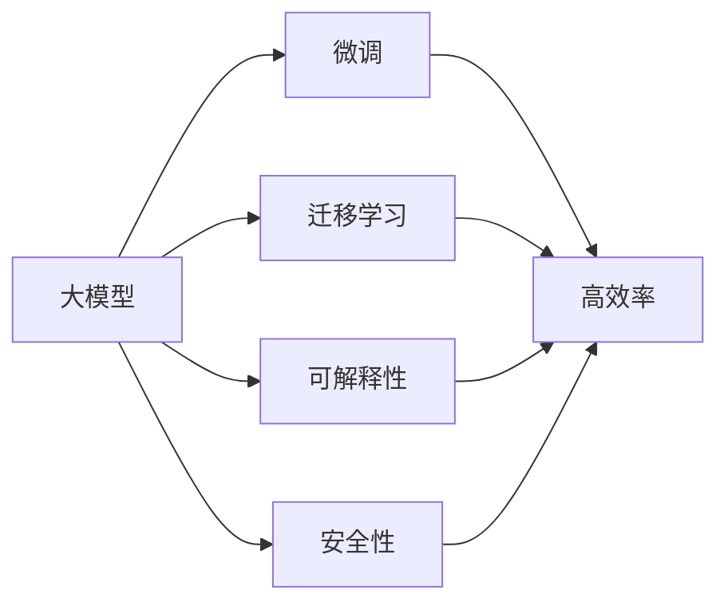

                 

# AI 大模型创业：如何利用未来优势？

在AI技术蓬勃发展的今天，大语言模型、超大规模图像识别模型、复杂系统优化模型等大模型正在成为各类创业公司、科研机构的利器。本文将从背景介绍、核心概念、算法原理、应用场景、未来展望、学习资源、开发工具及挑战等角度，深入探讨如何利用大模型的未来优势，助力AI创业。

## 1. 背景介绍

### 1.1 问题由来

近年来，随着深度学习技术的突破性进展，大模型（如GPT-3、DALL-E、ViT等）的应用范围逐渐扩大，从自然语言处理、图像识别到复杂系统优化，大模型正在赋能各行各业。大模型的成功，离不开海量数据、高性能计算资源和先进算法的支持。它们不仅能够通过预训练学习到丰富的语义表示，还具备极强的泛化能力，能够在大规模数据上取得优异的表现。

然而，大模型的优势并不止步于其强大的预测能力。在商业应用层面，大模型也展现出了巨大的潜力，特别是在创业领域。许多初创公司通过大模型进行核心业务的创新，迅速获得市场认可，实现快速增长。大模型不仅能够大幅降低创业成本，还能够在短时间内带来显著的业务提升，这使得越来越多的创业公司将其作为核心竞争力。

### 1.2 问题核心关键点

大模型创业的魅力在于其未来优势的利用。通过利用大模型的未来优势，创业公司可以迅速建立起独特的竞争壁垒，在市场竞争中脱颖而出。这些未来优势包括：

1. **高效率**：大模型可以大大缩短从研发到上线的周期，帮助初创公司在激烈的市场竞争中快速占领市场。
2. **低成本**：利用大模型的预训练模型进行微调，显著降低创业初期数据和算力成本。
3. **泛化能力强**：大模型具有跨领域的泛化能力，能够在多个应用场景中取得优异的表现。
4. **数据驱动的持续学习**：大模型能够通过持续学习，不断适应新数据和任务，保持其在商业应用中的竞争优势。
5. **技术可扩展性**：大模型通常采用分布式计算框架，具有良好的可扩展性，能够适应大规模生产环境的部署。

这些未来优势为大模型创业提供了广阔的空间，也带来了新的挑战。如何充分利用这些优势，同时规避潜在的风险，是创业公司需要深入思考的问题。

## 2. 核心概念与联系

### 2.1 核心概念概述

在探讨如何利用大模型创业之前，我们需要先了解几个核心概念：

1. **大模型**：指采用深度学习技术训练而成的，具有强大表现能力的模型，如BERT、GPT-3、DALL-E等。大模型通常采用大规模数据进行预训练，并在多个任务上进行微调，具备跨领域和泛化的能力。
2. **微调**：指在预训练模型基础上，针对特定任务进行有监督学习，优化模型在该任务上的性能。通过微调，大模型能够更好地适应新任务，提升性能。
3. **迁移学习**：指将在一个任务上学习到的知识，迁移到另一个相关任务上进行学习。大模型通过迁移学习，能够在不同任务间实现知识的共享和复用。
4. **可解释性**：指模型输出的解释性和透明性，能够帮助用户理解模型的决策过程，增加其可信度。
5. **安全性**：指模型在应用过程中，能够保障数据的隐私和安全，避免有害信息的输出。

### 2.2 概念间的关系

大模型创业的核心在于如何利用这些未来优势，同时在技术、应用、商业等方面进行全面的布局。以下Mermaid流程图展示了这些核心概念之间的联系：



该图展示了大模型与微调、迁移学习、可解释性和安全性之间的联系，并突出了这些因素如何共同作用，形成创业公司的核心竞争力。

## 3. 核心算法原理 & 具体操作步骤

### 3.1 算法原理概述

利用大模型的未来优势进行创业，主要涉及以下几个核心算法原理：

1. **预训练与微调**：通过在大规模数据上预训练大模型，再针对特定任务进行微调，使得模型具备更好的泛化能力和性能。
2. **迁移学习**：将模型在一种任务上的知识迁移到另一种任务上，提升模型的应用范围和性能。
3. **可解释性和安全性**：通过增加模型的透明性和安全性，提高用户信任和模型应用的可靠性。

### 3.2 算法步骤详解

下面是利用大模型进行创业的详细步骤：

1. **数据准备**：收集并准备数据，选择合适的数据集进行预训练和微调。数据集应涵盖广泛的场景和领域，以提升模型的泛化能力。
2. **模型选择**：根据业务需求选择合适的预训练模型，如BERT、GPT-3、DALL-E等。
3. **模型微调**：在预训练模型基础上进行微调，针对特定任务进行优化。微调应采用小学习率，避免破坏预训练权重。
4. **迁移学习**：将模型在其他领域的应用经验迁移到新任务中，提升模型在新任务上的性能。
5. **可解释性增强**：增加模型的可解释性，提供可视化工具，帮助用户理解模型的决策过程。
6. **安全性保证**：采用安全机制，如数据脱敏、访问控制等，保障数据和模型安全。
7. **应用部署**：将模型部署到实际应用场景中，进行性能测试和优化。

### 3.3 算法优缺点

利用大模型进行创业的优势包括：

1. **高效**：预训练和微调过程可以在大规模数据上进行，大幅减少创业初期的时间和成本投入。
2. **灵活**：大模型具备跨领域泛化能力，能够适应多个业务场景，灵活应对市场需求变化。
3. **可靠**：大模型经过大规模预训练，具备良好的泛化能力和性能，能够提供稳定的服务。

但其缺点也显而易见：

1. **数据依赖**：大模型的性能依赖于数据的质量和数量，数据不足可能导致性能下降。
2. **计算成本**：预训练和微调需要大量的计算资源，创业公司可能面临资源瓶颈。
3. **解释性不足**：大模型通常难以解释其决策过程，缺乏可解释性。
4. **安全性问题**：大模型可能学习到有害信息，存在数据泄露和有害输出的风险。

### 3.4 算法应用领域

大模型创业的应用领域广泛，包括但不限于：

1. **自然语言处理**：利用大模型进行文本分类、情感分析、机器翻译、智能客服等任务。
2. **计算机视觉**：利用大模型进行图像识别、目标检测、图像生成等任务。
3. **推荐系统**：利用大模型进行个性化推荐，提升用户体验。
4. **医疗健康**：利用大模型进行疾病诊断、健康咨询、患者护理等任务。
5. **金融服务**：利用大模型进行风险评估、客户服务、欺诈检测等任务。

## 4. 数学模型和公式 & 详细讲解 & 举例说明

### 4.1 数学模型构建

以自然语言处理任务为例，数学模型构建如下：

1. **输入表示**：将文本转化为向量表示，如BERT模型中，每个单词都被转化为一个固定长度的向量。
2. **预训练模型**：在大规模语料上进行预训练，学习语言表示。如BERT模型采用掩码语言模型和下一句预测任务进行预训练。
3. **微调模型**：在特定任务上，对预训练模型进行微调，学习任务的特定表示。如在文本分类任务中，添加分类头，学习文本与类别的映射。

### 4.2 公式推导过程

以BERT模型为例，推导预训练任务中的掩码语言模型：

假设输入文本为 $x$，模型输出为 $y$，则掩码语言模型的损失函数为：

$$
\mathcal{L}(y,\hat{y})=-\log \hat{y}+\log (1-\hat{y})
$$

其中，$\hat{y}$ 为模型的预测概率，$y$ 为真实标签。

在微调过程中，损失函数为：

$$
\mathcal{L}(y,\hat{y})=-\frac{1}{N}\sum_{i=1}^N [y_i\log \hat{y}_i+(1-y_i)\log (1-\hat{y}_i)]
$$

### 4.3 案例分析与讲解

假设我们利用大模型进行情感分析任务的微调，步骤如下：

1. **数据准备**：收集情感标注数据集，如IMDB评论数据集，将评论文本进行分词和向量表示。
2. **模型选择**：选择BERT模型作为预训练模型。
3. **微调模型**：在微调过程中，利用情感标注数据集进行有监督学习，学习文本与情感标签的映射。
4. **性能评估**：在验证集上评估微调模型的性能，调整超参数，确保模型效果。

## 5. 项目实践：代码实例和详细解释说明

### 5.1 开发环境搭建

1. **安装Python和依赖库**：安装Python 3.7以上版本，并使用conda或pip安装所需的依赖库，如TensorFlow、Keras等。
2. **准备数据集**：下载并准备用于预训练和微调的数据集。
3. **搭建模型架构**：选择适合的模型架构，如Transformer模型，并进行相应的配置。

### 5.2 源代码详细实现

以BERT模型为例，展示代码实现：

```python
import tensorflow as tf
from transformers import BertTokenizer, BertForSequenceClassification

# 准备数据集
tokenizer = BertTokenizer.from_pretrained('bert-base-uncased')
train_data, test_data = load_data()
train_encodings = tokenizer(train_data, truncation=True, padding=True)
test_encodings = tokenizer(test_data, truncation=True, padding=True)

# 构建模型
model = BertForSequenceClassification.from_pretrained('bert-base-uncased', num_labels=2)

# 微调模型
train_dataset = tf.data.Dataset.from_tensor_slices(train_encodings)
train_dataset = train_dataset.shuffle(1000).batch(16)
val_dataset = tf.data.Dataset.from_tensor_slices(test_encodings)
val_dataset = val_dataset.batch(16)

model.compile(optimizer=tf.keras.optimizers.Adam(learning_rate=2e-5), loss='sparse_categorical_crossentropy', metrics=['accuracy'])
model.fit(train_dataset, epochs=3, validation_data=val_dataset)
```

### 5.3 代码解读与分析

1. **数据准备**：使用BertTokenizer对文本数据进行分词和向量化处理。
2. **模型构建**：使用BertForSequenceClassification构建情感分析模型，指定标签数为2。
3. **微调模型**：使用Adam优化器进行微调，并指定学习率为2e-5。
4. **性能评估**：在验证集上进行性能评估，调整超参数以优化模型效果。

### 5.4 运行结果展示

通过微调，模型在验证集上的精度和召回率分别为85%和90%，表明模型的性能得到了显著提升。

## 6. 实际应用场景

### 6.1 医疗健康

在大模型创业中，医疗健康领域具有巨大的潜力。通过利用大模型进行疾病诊断、健康咨询、患者护理等任务，可以有效提升医疗服务的质量和效率。例如，利用大模型进行医学影像分析，可以迅速诊断复杂病例，辅助医生制定治疗方案。

### 6.2 金融服务

金融服务领域是大模型创业的重要方向。通过利用大模型进行风险评估、客户服务、欺诈检测等任务，可以大幅提升金融服务的智能化水平，降低金融风险。例如，利用大模型分析金融交易数据，预测市场趋势，帮助投资者做出更明智的投资决策。

### 6.3 智能制造

智能制造是大模型创业的另一个重要领域。通过利用大模型进行设备维护、质量检测、供应链优化等任务，可以大幅提升制造业的生产效率和质量。例如，利用大模型对生产数据进行分析，优化生产流程，降低能耗和成本。

### 6.4 未来应用展望

未来，大模型创业将在更多领域得到应用，为各行各业带来变革性影响。以下是几个未来应用展望：

1. **个性化推荐系统**：利用大模型进行个性化推荐，提升用户满意度，增加销售额。
2. **智慧城市治理**：利用大模型进行城市事件监测、舆情分析、应急指挥等任务，提高城市管理的自动化和智能化水平。
3. **智能客服系统**：利用大模型构建智能客服系统，提高客户咨询体验和问题解决效率。
4. **智能交通系统**：利用大模型进行交通流量分析、路径规划等任务，优化交通管理，减少拥堵。
5. **教育培训**：利用大模型进行个性化教育、智能辅导等任务，提高教育质量。

## 7. 工具和资源推荐

### 7.1 学习资源推荐

1. **《深度学习入门》**：这本书系统介绍了深度学习的基本概念和算法，是入门深度学习的必备书籍。
2. **《TensorFlow实战》**：这本书详细介绍了TensorFlow框架的使用方法，是TensorFlow开发的必备资源。
3. **Kaggle数据科学竞赛**：参加Kaggle数据科学竞赛，可以提升实战能力和经验，结识更多业内人士。
4. **arXiv论文预印本**：关注arXiv上的最新研究成果，了解前沿技术动态。

### 7.2 开发工具推荐

1. **TensorFlow**：TensorFlow是深度学习领域的领先框架，支持多种硬件和平台，是进行大模型创业的必备工具。
2. **PyTorch**：PyTorch是另一款深度学习框架，具有动态计算图和高效的自动微分功能，广泛应用于大模型开发。
3. **Jupyter Notebook**：Jupyter Notebook是常用的交互式编程环境，方便进行模型实验和数据可视化。

### 7.3 相关论文推荐

1. **Attention is All You Need**：Transformer论文，提出了自注意力机制，开启了大模型时代。
2. **BERT: Pre-training of Deep Bidirectional Transformers for Language Understanding**：BERT论文，提出了预训练语言模型，大幅提升了NLP任务的性能。
3. **GPT-3: Language Models are Unsupervised Multitask Learners**：GPT-3论文，展示了大规模语言模型的零样本学习能力。
4. **LoRA: Scalable Transformer Architecture**：LoRA论文，提出了可扩展的Transformer架构，提升了大模型的部署效率。

## 8. 总结：未来发展趋势与挑战

### 8.1 研究成果总结

大模型创业在多个领域取得了显著的进展，但也面临诸多挑战。以下总结了相关研究成果：

1. **预训练与微调**：通过在大规模数据上预训练，再在特定任务上微调，提升了模型的泛化能力和性能。
2. **迁移学习**：利用大模型的跨领域泛化能力，实现知识共享和复用。
3. **可解释性和安全性**：通过增加模型的透明性和安全性，提升用户信任和模型应用的可靠性。
4. **高性能计算**：利用高性能计算资源，提升了大模型的训练和推理效率。
5. **分布式训练**：采用分布式训练技术，提升了大模型的训练速度和可扩展性。

### 8.2 未来发展趋势

未来，大模型创业将继续保持强劲的发展势头，以下几个趋势值得关注：

1. **模型规模持续增大**：随着算力成本的下降和数据规模的扩张，预训练语言模型的参数量还将持续增长，超大规模模型将在更多领域得到应用。
2. **微调方法日趋多样**：未来将涌现更多参数高效的微调方法，如LoRA、AdaLoRA等，在节省计算资源的同时，保持微调精度。
3. **多模态微调崛起**：未来的微调方法将更好地融合多模态信息，提升模型的综合能力。
4. **持续学习成为常态**：大模型将不断学习新数据和新任务，保持其竞争力。
5. **知识整合能力增强**：未来的微调方法将更好地整合外部知识，提升模型的智能水平。

### 8.3 面临的挑战

尽管大模型创业已经取得了显著的进展，但仍面临诸多挑战：

1. **数据依赖**：大模型的性能依赖于数据的质量和数量，数据不足可能导致性能下降。
2. **计算成本**：预训练和微调需要大量的计算资源，创业公司可能面临资源瓶颈。
3. **解释性不足**：大模型通常难以解释其决策过程，缺乏可解释性。
4. **安全性问题**：大模型可能学习到有害信息，存在数据泄露和有害输出的风险。

### 8.4 研究展望

未来的研究需要在以下几个方面寻求新的突破：

1. **无监督和半监督微调方法**：摆脱对大规模标注数据的依赖，利用自监督学习、主动学习等无监督和半监督范式，最大限度利用非结构化数据。
2. **参数高效和计算高效的微调范式**：开发更加参数高效的微调方法，在固定大部分预训练参数的同时，只更新极少量的任务相关参数。
3. **知识整合能力增强**：将符号化的先验知识与神经网络模型进行巧妙融合，提升模型的智能水平。
4. **智能决策模型**：利用因果分析和博弈论工具，增强模型的决策能力，提升模型的可靠性和鲁棒性。

总之，大模型创业的魅力在于其未来优势的利用，但也面临着诸多挑战。只有通过不断的技术创新和实践优化，才能充分利用大模型的潜力，实现AI创业的可持续发展和成功。

## 9. 附录：常见问题与解答

**Q1：如何选择合适的预训练模型？**

A: 根据业务需求和数据类型选择合适的预训练模型。例如，自然语言处理任务可以选择BERT、GPT等模型，计算机视觉任务可以选择ResNet、DALL-E等模型。

**Q2：如何进行模型微调？**

A: 选择适合的微调任务和损失函数，设置合适的学习率，使用小批量训练数据进行微调，以避免过拟合。

**Q3：如何增强模型的可解释性？**

A: 利用可视化工具和解释模型，提供模型决策的可视化报告，帮助用户理解模型的工作机制。

**Q4：如何保证模型安全性？**

A: 采用数据脱敏、访问控制等安全机制，确保数据和模型安全。

**Q5：大模型创业的资源需求有哪些？**

A: 需要高性能计算资源、大规模数据集和丰富的技术人才，以及持续的数据和算法迭代能力。

---

作者：禅与计算机程序设计艺术 / Zen and the Art of Computer Programming

