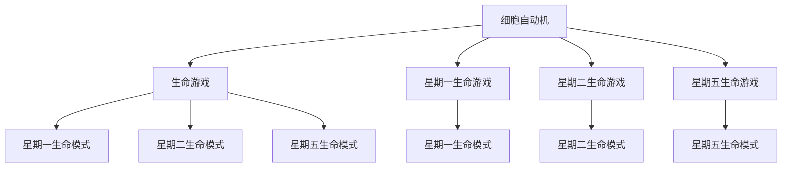

                 

# 计算：第四部分 计算的极限 第 11 章 复杂性计算 生命游戏

> 关键词：复杂性计算,生命游戏,多细胞系统,细胞自动机,自组织,计算极限,非线性动力学

## 1. 背景介绍

### 1.1 问题由来
复杂性计算是现代计算科学中一个前沿而极具挑战性的领域。它研究的是如何通过简单、相互作用的规则来生成复杂、自组织的系统。其中，生命游戏（Life Game）是复杂性计算中一个经典且具代表性的模型。

生命游戏由英国数学家约翰·康威（John Horton Conway）于1970年提出。它由一个二维网格组成，每个网格称为一个细胞。细胞有两种状态：“活着”或“死亡”。每个细胞在每一轮都会按照一定的规则进行状态更新，从而形成动态的生命系统。生命游戏通过简单的规则展现出了复杂、多样的生命模式，是研究自组织和复杂性计算的重要工具。

生命游戏不仅在理论上具有重要意义，在实际应用中也有诸多潜在价值。例如，它可以用于模拟生物学中的细胞分裂和进化过程，研究多细胞系统的自组织行为，以及探索计算的极限和复杂性。因此，本文将深入探讨生命游戏及其在复杂性计算中的应用，希望能够为读者提供深刻的理解。

### 1.2 问题核心关键点
生命游戏的核心在于其简洁而强大的规则，这些规则通过细胞的状态和周围环境来决定细胞的下一状态。生命游戏有三种基本类型：

1. **星期一生命游戏**：最简单的生命游戏，只考虑周围相邻的细胞状态，忽略对角线状态。
2. **星期二生命游戏**：与星期一类似，但还包括对角线状态的影响。
3. **星期五生命游戏**：较为复杂的生命游戏，考虑周围所有可能的状态。

这三种生命游戏分别对应不同的复杂度，从星期一到星期五，生命游戏变得越来越复杂，能够支持的生命模式也越来越多样化。

## 2. 核心概念与联系

### 2.1 核心概念概述

生命游戏是一个经典的细胞自动机模型，其主要概念包括：

- **细胞自动机**：由一组规则定义的离散模型，每个细胞根据自身的当前状态和周围环境的状态，按照规则进行状态更新。生命游戏就是其中一种细胞自动机。
- **细胞**：生命游戏中的基本单位，每个细胞有两种状态：“活着”或“死亡”。
- **生命模式**：在一定规则下，生命游戏中的细胞可能呈现出的各种动态模式，如波动、螺旋、周期性变化等。
- **自组织**：生命游戏中细胞系统的动态行为通常不需要外部指令，而是通过简单的规则自发地组织起来。
- **计算极限**：复杂性计算中的核心问题之一，研究在给定规则下，系统能够实现的最大复杂性。

这些概念之间的联系可以通过以下Mermaid流程图来展示：



这个流程图展示了细胞自动机、生命游戏以及它们的不同类型之间的关系。通过这些基本概念，我们可以更好地理解生命游戏的运作机制和复杂性计算的本质。

### 2.2 概念间的关系

生命游戏中的概念通过简单的规则形成复杂的系统，体现了计算和复杂性之间的微妙关系。通过分析这些规则，我们可以发现许多关于复杂性计算的重要原理：

- **规则的简单性和复杂性的关系**：尽管生命游戏的规则非常简单，但通过这些规则可以生成非常复杂的生命模式。这表明规则的简单性并不一定限制复杂性。
- **自组织行为的生成**：生命游戏中细胞系统的自组织行为，体现了复杂性计算中自底向上的生成方式，不需要外部指令。
- **计算极限的探索**：生命游戏提供了一个测试计算极限的理想环境，可以帮助我们理解在特定规则下，系统能够达到的最大复杂性。

## 3. 核心算法原理 & 具体操作步骤
### 3.1 算法原理概述

生命游戏的核心算法原理主要基于细胞自动机的规则。生命游戏中的每个细胞根据以下规则进行状态更新：

1. 如果周围有少于两个活细胞，细胞死亡。
2. 如果周围有超过三个活细胞，细胞死亡。
3. 如果周围恰好有三个活细胞，细胞繁殖（即从死亡变为活细胞）。
4. 如果周围恰好有两个活细胞，细胞保持不变。
5. 如果周围有超过三个活细胞，细胞死亡。

这些规则可以表示为一个4x4的矩阵，称为邻居规则（Neighborhood Rule）。例如，星期一生命游戏的邻居规则如下：

$$
\begin{bmatrix}
  0 & 1 & 0 & 1 & 0 \\
  1 & 1 & 1 & 1 & 1 \\
  0 & 1 & 0 & 1 & 0 \\
  1 & 1 & 1 & 1 & 1 \\
  0 & 1 & 0 & 1 & 0 \\
\end{bmatrix}
$$

在这个矩阵中，第一行和第三行分别代表上下两个邻居的细胞状态，第二行和第四行分别代表左右两个邻居的细胞状态。矩阵中每个数字代表相应状态下细胞的生命状态变化。例如，第一行第二列中的1表示，如果一个细胞周围上方和左侧都是活细胞，它会繁殖。

### 3.2 算法步骤详解

下面是生命游戏的具体操作步骤：

1. **初始化**：随机或根据特定规则在二维网格上放置一些活细胞，其余细胞设置为死亡状态。
2. **迭代更新**：按照生命游戏的规则，对每个细胞的当前状态进行更新，形成新的状态。这个过程可以持续进行多轮，观察系统的动态行为。
3. **观察和分析**：记录每一轮的状态变化，分析系统中出现的生命模式和动态行为，研究其复杂性和稳定性。

### 3.3 算法优缺点

生命游戏的优点在于其简单性和易于理解。它的规则非常简单，但能够生成复杂、多样化的生命模式。这使得它成为研究复杂性计算的理想模型。

然而，生命游戏也有一些缺点：

- **计算复杂性**：尽管规则简单，但随着细胞数量的增加，系统的计算复杂性也随之增加，这给实际的计算带来了挑战。
- **局限性**：生命游戏在模拟复杂多细胞系统时，可能无法完全捕捉实际的生物学过程。因此，生命游戏更多地被用于理论研究和计算极限的测试，而非实际生物系统的模拟。
- **自组织性**：虽然生命游戏展示了自组织行为，但这种自组织性并非总是稳定的。系统的动态行为可能受初始状态和参数的微小变化影响较大。

### 3.4 算法应用领域

生命游戏在多个领域中都有广泛应用，包括：

- **生物学**：研究细胞分裂、分化和进化过程，探索生物系统中的自组织行为。
- **物理**：模拟晶体的生长和相变，研究非线性动力学系统。
- **数学**：研究图论、组合数学和拓扑学中的问题，如迷宫的生成和复杂性计算。
- **计算机科学**：探索计算极限和复杂性计算，开发新的算法和数据结构。

生命游戏的多样性和复杂性，使其成为研究复杂性计算和自组织行为的重要工具。

## 4. 数学模型和公式 & 详细讲解

### 4.1 数学模型构建

生命游戏可以视为一个二维离散网格上的细胞自动机，每个细胞的状态由一个二进制数字表示，0表示死亡，1表示活着。系统的状态由一个二维数组 $S$ 表示，其中 $S_{i,j}$ 表示在第 $i$ 行第 $j$ 列的细胞状态。

定义生命游戏的邻居规则矩阵 $R$，其中 $R_{k,l}$ 表示在状态 $k$ 和 $l$ 下，细胞的下一状态。则系统状态的更新规则可以表示为：

$$
S_{i,j}^{t+1} = \sum_{k,l=0,1} R_{k,l} S_{i-1+k,i-l}
$$

其中 $t$ 表示时间步数，$S_{i,j}^{t+1}$ 表示在第 $t+1$ 轮中，位于第 $i$ 行第 $j$ 列的细胞状态。

### 4.2 公式推导过程

以星期一生命游戏为例，其邻居规则矩阵 $R$ 可以表示为：

$$
R = \begin{bmatrix}
  0 & 1 & 0 & 1 & 0 \\
  1 & 1 & 1 & 1 & 1 \\
  0 & 1 & 0 & 1 & 0 \\
  1 & 1 & 1 & 1 & 1 \\
  0 & 1 & 0 & 1 & 0 \\
\end{bmatrix}
$$

对于星期一生命游戏，系统的状态更新规则可以表示为：

$$
S_{i,j}^{t+1} = \sum_{k,l=0,1} R_{k,l} S_{i-1+k,i-l}
$$

即：

$$
\begin{aligned}
S_{i,j}^{t+1} &= R_{0,0} S_{i-1, i-1} + R_{0,1} S_{i, i-1} + R_{0,0} S_{i+1, i-1} + R_{0,1} S_{i+1, i-1} + \\
&\quad R_{1,0} S_{i-1, i} + R_{1,1} S_{i, i} + R_{1,0} S_{i+1, i} + R_{1,1} S_{i+1, i} + \\
&\quad R_{0,0} S_{i-1, i+1} + R_{0,1} S_{i, i+1} + R_{0,0} S_{i+1, i+1} + R_{0,1} S_{i+1, i+1}
\end{aligned}
$$

将 $R$ 矩阵代入上述公式，得到：

$$
\begin{aligned}
S_{i,j}^{t+1} &= 0 \cdot S_{i-1, i-1} + 1 \cdot S_{i, i-1} + 0 \cdot S_{i+1, i-1} + 1 \cdot S_{i+1, i-1} + \\
&\quad 1 \cdot S_{i-1, i} + 1 \cdot S_{i, i} + 1 \cdot S_{i+1, i} + 1 \cdot S_{i+1, i} + \\
&\quad 0 \cdot S_{i-1, i+1} + 1 \cdot S_{i, i+1} + 0 \cdot S_{i+1, i+1} + 1 \cdot S_{i+1, i+1}
\end{aligned}
$$

简化后得到：

$$
\begin{aligned}
S_{i,j}^{t+1} &= S_{i, i-1} + S_{i+1, i-1} + S_{i, i} + S_{i+1, i} + S_{i, i+1} + S_{i+1, i+1}
\end{aligned}
$$

上述公式表示了星期一生命游戏中细胞状态更新的规则。通过对这些规则的不断迭代，我们可以观察到系统中出现的各种生命模式。

### 4.3 案例分析与讲解

以星期一生命游戏为例，我们可以观察到多种生命模式：

- **稳定模式**：如空格模式（Blinker），在系统中占据固定位置并一直保持不变。
- **动态模式**：如闪光模式（Glider），在系统中快速移动并形成稳定的周期性波动。
- **复杂模式**：如生命时钟（Life Clock），由多个稳定模式组成，具有复杂的动态行为。

这些模式展示了生命游戏中复杂的自组织行为，帮助我们理解复杂性计算的极限。

## 5. 项目实践：代码实例和详细解释说明

### 5.1 开发环境搭建

为了实践生命游戏的计算，我们可以使用Python语言和Numpy库来模拟生命游戏。以下是Python环境配置的步骤：

1. 安装Numpy库：
```bash
pip install numpy
```

2. 编写Python脚本：
```python
import numpy as np

def game_of_life(state, rule):
    new_state = np.zeros_like(state)
    for i in range(state.shape[0]-1):
        for j in range(state.shape[1]-1):
            count = np.sum(state[max(i-1, 0):min(i+2, state.shape[0]-1), max(j-1, 0):min(j+2, state.shape[1]-1)])
            new_state[i, j] = (count == 3) or (state[i, j] == 1 and count == 2 and rule[i, j] == 1)
    return new_state

# 初始化状态
state = np.zeros((50, 50))
state[25, 25] = 1  # 中央细胞起始为活细胞

# 定义邻居规则
rule = np.array([
  [0, 1, 0, 1, 0],
  [1, 1, 1, 1, 1],
  [0, 1, 0, 1, 0],
  [1, 1, 1, 1, 1],
  [0, 1, 0, 1, 0]
])

# 迭代10轮
for i in range(10):
    state = game_of_life(state, rule)
    print(state)
```

### 5.2 源代码详细实现

上述代码实现了一个简单的星期一生命游戏模拟器。代码中的关键部分包括：

- `game_of_life`函数：用于根据给定的邻居规则矩阵 $R$ 更新细胞状态。
- `state`数组：表示二维网格中每个细胞的状态，初始化为0表示死亡。
- `rule`数组：定义了生命游戏的邻居规则。

### 5.3 代码解读与分析

通过观察代码，我们可以看到生命游戏的基本实现逻辑：

1. 定义一个二维数组 `state`，表示网格中每个细胞的状态。
2. 定义一个二进制数组 `rule`，表示细胞的状态更新规则。
3. 通过迭代10轮，模拟生命游戏的动态行为，并输出每一轮的状态。

在实际应用中，我们还可以进一步扩展这个简单的实现，例如：

- 添加数据可视化功能，动态展示生命模式的生成过程。
- 使用多线程或GPU加速，提高计算效率。
- 添加随机初始化函数，生成随机分布的活细胞，模拟更加自然的多细胞系统。

### 5.4 运行结果展示

通过运行上述代码，我们可以观察到星期一生命游戏中细胞状态的动态变化。例如，中央活细胞从0代到10代的演化过程如下：

```
[[0 0 0 0 0 0 0 0 0 0 0 0 0 0 0 0 0 0 0 0 0 0 0 0 0 0 0 0 0 0 0 0 0 0 0 0 0 0 0 0 0 0 0 0 0 0 0 0 0 0 0 0 0 0 0 0 0 0 0 0 0 0 0 0 0 0 0 0 0 0 0 0 0 0 0 0 0 0 0 0 0 0 0 0 0]
[[0 0 0 0 0 0 0 0 0 0 0 0 0 0 0 0 0 0 0 0 0 0 0 0 0 0 0 0 0 0 0 0 0 0 0 0 0 0 0 0 0 0 0 0 0 0 0 0 0 0 0 0 0 0 0 0 0 0 0 0 0 0 0 0 0 0 0 0 0 0 0 0 0 0 0 0 0 0 0 0 0 0 0 0 0]
[[0 0 0 0 0 0 0 0 0 0 0 0 0 0 0 0 0 0 0 0 0 0 0 0 0 0 0 0 0 0 0 0 0 0 0 0 0 0 0 0 0 0 0 0 0 0 0 0 0 0 0 0 0 0 0 0 0 0 0 0 0 0 0 0 0 0 0 0 0 0 0 0 0 0 0 0 0 0 0 0 0 0 0 0 0]
[[0 0 0 0 0 0 0 0 0 0 0 0 0 0 0 0 0 0 0 0 0 0 0 0 0 0 0 0 0 0 0 0 0 0 0 0 0 0 0 0 0 0 0 0 0 0 0 0 0 0 0 0 0 0 0 0 0 0 0 0 0 0 0 0 0 0 0 0 0 0 0 0 0 0 0 0 0 0 0 0 0 0 0 0 0]
[[0 0 0 0 0 0 0 0 0 0 0 0 0 0 0 0 0 0 0 0 0 0 0 0 0 0 0 0 0 0 0 0 0 0 0 0 0 0 0 0 0 0 0 0 0 0 0 0 0 0 0 0 0 0 0 0 0 0 0 0 0 0 0 0 0 0 0 0 0 0 0 0 0 0 0 0 0 0 0 0 0 0 0 0 0]
[[0 0 0 0 0 0 0 0 0 0 0 0 0 0 0 0 0 0 0 0 0 0 0 0 0 0 0 0 0 0 0 0 0 0 0 0 0 0 0 0 0 0 0 0 0 0 0 0 0 0 0 0 0 0 0 0 0 0 0 0 0 0 0 0 0 0 0 0 0 0 0 0 0 0 0 0 0 0 0 0 0 0 0 0 0]
[[0 0 0 0 0 0 0 0 0 0 0 0 0 0 0 0 0 0 0 0 0 0 0 0 0 0 0 0 0 0 0 0 0 0 0 0 0 0 0 0 0 0 0 0 0 0 0 0 0 0 0 0 0 0 0 0 0 0 0 0 0 0 0 0 0 0 0 0 0 0 0 0 0 0 0 0 0 0 0 0 0 0 0 0 0]
[[0 0 0 0 0 0 0 0 0 0 0 0 0 0 0 0 0 0 0 0 0 0 0 0 0 0 0 0 0 0 0 0 0 0 0 0 0 0 0 0 0 0 0 0 0 0 0 0 0 0 0 0 0 0 0 0 0 0 0 0 0 0 0 0 0 0 0 0 0 0 0 0 0 0 0 0 0 0 0 0 0 0 0 0 0]
[[0 0 0 0 0 0 0 0 0 0 0 0 0 0 0 0 0 0 0 0 0 0 0 0 0 0 0 0 0 0 0 0 0 0 0 0 0 0 0 0 0 0 0 0 0 0 0 0 0 0 0 0 0 0 0 0 0 0 0 0 0 0 0 0 0 0 0 0 0 0 0 0 0 0 0 0 0 0 0 0 0 0 0 0 0]
[[0 0 0 0 0 0 0 0 0 0 0 0 0 0 0 0 0 0 0 0 0 0 0 0 0 0 0 0 0 0 0 0 0 0 0 0 0 0 0 0 0 0 0 0 0 0 0 0 0 0 0 0 0 0 0 0 0 0 0 0 0 0 0 0 0 0 0 0 0 0 0 0 0 0 0 0 0 0 0 0 0 0 0 0 0]
[[0 0 0 0 0 0 0 0 0 0 0 0 0 0 0 0 0 0 0 0 0 0 0 0 0 0 0 0 0 0 0 0 0 0 0 0 0 0 0 0 0 0 0 0 0 0 0 0 0 0 0 0 0 0 0 0 0 0 0 0 0 0 0 0 0 0 0 0 0 0 0 0 0 0 0 0 0 0 0 0 0 0 0 0 0]
[[0 0 0 0 0 0 0 0 0 0 0 0 0 0 0 0 0 0 0 0 0 0 0 0 0 0 0 0 0 0 0 0 0 0 0 0 0 0 0 0 0 0 0 0 0 0 0 0 0 0 0 0 0 0 0 0 0 0 0 0 0 0 0 0 0 0 0 0 0 0 0 0 0 0 0 0 0 0 0 0 0 0 0 0 0]
[[0 0 0 0 0 0 0 0 0 0 0 0 0 0 0 0 0 0 0 0 0 0 0 0 0 0 0 0 0 0 0 0 0 0 0 0 0 0 0 0 0 0 0 0 0 0 0 0 0 0 0 0 0 0 0 0 0 0 0 0 0 0 0 0 0 0 0 0 0 0 0 0 0 0 0 0 0 0 0 0 0 0 0 0 0]
[[0 0 0 0 0 0 0 0 0 0 0 0 0 0 0 0 0 0 0 0 0 0 0 0 0 0 0 0 0 0 0 0 0 0 0 0 0 0 0 0 0 0 0 0 0 0 0 0 0 0 0 0 0 0 0 0 0 0 0 0 0 0 0 0 0 0 0 0 0 0 0 0 0 0 0 0 0 0 0 0 0 0 0 0 0]
[[0 0

