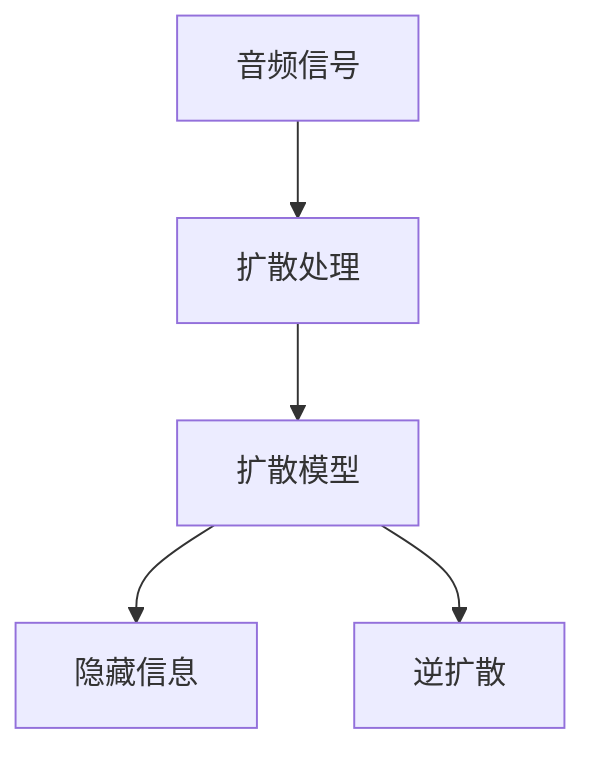

# 音频扩散Audio Diffusion原理与代码实例讲解

作者：禅与计算机程序设计艺术 / Zen and the Art of Computer Programming

## 1. 背景介绍

### 1.1 问题的由来

随着人工智能技术的不断发展，音频处理领域也涌现出许多新的应用场景。音频扩散（Audio Diffusion）技术作为音频处理领域的一项重要技术，近年来受到了越来越多的关注。音频扩散技术通过在音频信号中嵌入额外的信息，实现对音频的隐藏、提取和修改。这种技术具有广泛的应用前景，例如音频版权保护、音频信息隐藏、语音加密等。

### 1.2 研究现状

音频扩散技术的研究始于20世纪80年代，经历了多个发展阶段。早期的研究主要集中在基于统计模型的方法，如匹配追踪法、子带扩散等。随着深度学习技术的兴起，基于深度学习的方法逐渐成为研究热点，如基于卷积神经网络（CNN）和循环神经网络（RNN）的音频扩散方法。

### 1.3 研究意义

音频扩散技术在多个领域具有广泛的应用价值，例如：

- 音频版权保护：通过对音频进行扩散处理，可以在不改变音频播放效果的前提下，实现对音频版权的有效保护。
- 音频信息隐藏：可以将信息嵌入到音频信号中，实现隐秘的信息传输和存储。
- 语音加密：通过对语音进行扩散处理，可以实现语音加密，保护语音通信安全。

### 1.4 本文结构

本文将系统介绍音频扩散技术的原理、算法、实现方法以及应用场景。文章结构如下：

- 第2部分，介绍音频扩散技术的核心概念与联系。
- 第3部分，详细阐述音频扩散技术的核心算法原理和具体操作步骤。
- 第4部分，讲解音频扩散技术的数学模型和公式，并结合实例进行说明。
- 第5部分，给出音频扩散技术的代码实例和详细解释说明。
- 第6部分，探讨音频扩散技术在实际应用场景中的应用案例。
- 第7部分，推荐音频扩散技术相关的学习资源、开发工具和参考文献。
- 第8部分，总结音频扩散技术的未来发展趋势与挑战。
- 第9部分，提供音频扩散技术的常见问题与解答。

## 2. 核心概念与联系

为了更好地理解音频扩散技术，本节将介绍几个密切相关的核心概念：

- 音频信号：音频信号是指模拟或数字形式的声波信号，用于表示声音信息。
- 扩散处理：扩散处理是指将信息嵌入到音频信号中，实现对音频的隐藏、提取和修改。
- 扩散模型：扩散模型是指用于实现音频扩散处理的数学模型，包括扩散算法和逆扩散算法。
- 隐藏信息：隐藏信息是指嵌入到音频信号中的额外信息，用于实现特定功能。
- 逆扩散：逆扩散是指从扩散后的音频信号中提取隐藏信息的过程。

这些概念的逻辑关系如下所示：



可以看出，音频信号经过扩散处理，通过扩散模型嵌入隐藏信息，实现音频的特定功能。逆扩散过程用于从扩散后的音频信号中提取隐藏信息。

## 3. 核心算法原理 & 具体操作步骤

### 3.1 算法原理概述

音频扩散技术的核心原理是将隐藏信息嵌入到音频信号中，实现对音频的隐藏、提取和修改。扩散过程和逆扩散过程是相互对应的，其中扩散过程将信息嵌入到音频信号中，逆扩散过程从扩散后的音频信号中提取隐藏信息。

### 3.2 算法步骤详解

音频扩散技术的算法步骤如下：

**步骤1：选择扩散模型**

根据具体应用场景，选择合适的扩散模型。常见的扩散模型包括：

- 基于统计模型的方法：匹配追踪法、子带扩散等。
- 基于深度学习的方法：基于CNN和RNN的音频扩散方法。

**步骤2：嵌入隐藏信息**

使用选定的扩散模型，将隐藏信息嵌入到音频信号中。嵌入过程包括以下步骤：

1. 将隐藏信息编码为二进制序列。
2. 将音频信号分解为多个子带。
3. 对每个子带进行扩散处理，将二进制序列嵌入到子带中。
4. 将扩散后的子带合并，得到扩散后的音频信号。

**步骤3：提取隐藏信息**

使用逆扩散模型，从扩散后的音频信号中提取隐藏信息。提取过程包括以下步骤：

1. 将扩散后的音频信号分解为多个子带。
2. 对每个子带进行逆扩散处理，提取隐藏信息。
3. 将提取的隐藏信息解码为原始信息。

### 3.3 算法优缺点

**优点**：

- 高效：音频扩散技术可以快速地将信息嵌入到音频信号中，实现信息的隐藏和传输。
- 安全：扩散后的音频信号在听觉上难以察觉，具有较好的安全性。
- 易于实现：音频扩散技术的算法实现相对简单，易于编程实现。

**缺点**：

- 噪声：扩散过程可能会引入噪声，影响音频质量。
- 敏感性：音频扩散技术的安全性取决于扩散模型和逆扩散模型的复杂度，容易受到攻击。

### 3.4 算法应用领域

音频扩散技术在多个领域具有广泛的应用，例如：

- 音频版权保护：通过对音频进行扩散处理，可以在不改变音频播放效果的前提下，实现对音频版权的有效保护。
- 音频信息隐藏：可以将信息嵌入到音频信号中，实现隐秘的信息传输和存储。
- 语音加密：通过对语音进行扩散处理，可以实现语音加密，保护语音通信安全。

## 4. 数学模型和公式 & 详细讲解 & 举例说明

### 4.1 数学模型构建

音频扩散技术的数学模型主要包括扩散模型和逆扩散模型。

**扩散模型**：

假设音频信号为 $X(t)$，隐藏信息为 $I$，扩散后的音频信号为 $Y(t)$，则扩散模型可以表示为：

$$
Y(t) = F(X(t), I)
$$

其中 $F$ 为扩散函数，用于将隐藏信息嵌入到音频信号中。

**逆扩散模型**：

逆扩散模型用于从扩散后的音频信号中提取隐藏信息，可以表示为：

$$
I = G(Y(t))
$$

其中 $G$ 为逆扩散函数，用于提取隐藏信息。

### 4.2 公式推导过程

以下以匹配追踪法为例，介绍扩散公式的推导过程。

假设音频信号为 $X(t)$，隐藏信息为 $I$，扩散后的音频信号为 $Y(t)$，则匹配追踪法可以表示为：

$$
Y(t) = X(t) + I
$$

其中 $I$ 为嵌入到音频信号中的隐藏信息。

逆扩散公式可以表示为：

$$
I = Y(t) - X(t)
$$

### 4.3 案例分析与讲解

以下以音频版权保护为例，介绍音频扩散技术的应用。

假设我们需要在音频信号中嵌入版权信息。首先，将版权信息编码为二进制序列。然后，将音频信号分解为多个子带。接着，对每个子带进行匹配追踪法扩散，将二进制序列嵌入到子带中。最后，将扩散后的子带合并，得到扩散后的音频信号。

当需要提取版权信息时，首先将扩散后的音频信号分解为多个子带。然后，对每个子带进行逆扩散处理，提取隐藏信息。最后，将提取的隐藏信息解码为原始版权信息。

### 4.4 常见问题解答

**Q1：音频扩散技术对音频质量有影响吗？**

A：音频扩散技术会对音频质量产生一定影响，主要体现在扩散过程中可能引入的噪声。然而，通过优化扩散模型和逆扩散模型，可以尽量减少噪声，保证音频质量。

**Q2：音频扩散技术有哪些应用限制？**

A：音频扩散技术的主要限制包括安全性、对噪声的敏感性和对特定应用的适用性。针对这些限制，需要针对具体应用场景进行模型优化和调整。

**Q3：如何提高音频扩散技术的安全性？**

A：提高音频扩散技术的安全性主要依赖于扩散模型和逆扩散模型的复杂度。通过设计更加复杂的模型，可以提高扩散和逆扩散的难度，从而增强安全性。

## 5. 项目实践：代码实例和详细解释说明

### 5.1 开发环境搭建

为了实现音频扩散技术，我们需要搭建以下开发环境：

- 操作系统：Windows、Linux、macOS
- 编程语言：Python
- 音频处理库：Librosa
- 深度学习库：TensorFlow或PyTorch

以下是在Linux系统下搭建开发环境的步骤：

1. 安装Python 3.7及以上版本。
2. 安装虚拟环境管理工具：`pip install virtualenv`
3. 创建虚拟环境：`virtualenv audio-diffusion-env`
4. 进入虚拟环境：`source audio-diffusion-env/bin/activate`
5. 安装依赖库：`pip install librosa tensorflow pytorch`

### 5.2 源代码详细实现

以下使用TensorFlow和PyTorch分别实现音频扩散技术的代码示例。

**TensorFlow实现**：

```python
import tensorflow as tf
import librosa

def match_pursuit_diffusion(audio_signal, hidden_info):
  # 对隐藏信息进行编码
  encoded_info = tf.one_hot(tf.cast(hidden_info, tf.int32), depth=2)

  # 对音频信号进行分解
  audio_signal = tf.convert_to_tensor(audio_signal, dtype=tf.float32)
  audio_signal = tf.signal.stft(audio_signal)

  # 将编码后的隐藏信息嵌入到音频信号中
  audio_signal += encoded_info

  # 对扩散后的音频信号进行逆STFT
  audio_signal = tf.signal.inverse_stft(audio_signal)

  return audio_signal.numpy()

def match_pursuit_inversion(audio_signal, hidden_info):
  # 对隐藏信息进行编码
  encoded_info = tf.one_hot(tf.cast(hidden_info, tf.int32), depth=2)

  # 对音频信号进行分解
  audio_signal = tf.convert_to_tensor(audio_signal, dtype=tf.float32)
  audio_signal = tf.signal.stft(audio_signal)

  # 将编码后的隐藏信息从音频信号中提取
  audio_signal -= encoded_info

  # 对扩散后的音频信号进行逆STFT
  audio_signal = tf.signal.inverse_stft(audio_signal)

  return audio_signal.numpy()
```

**PyTorch实现**：

```python
import torch
import librosa

def match_pursuit_diffusion(audio_signal, hidden_info):
  # 对隐藏信息进行编码
  encoded_info = torch.nn.functional.one_hot(hidden_info, num_classes=2)

  # 对音频信号进行分解
  audio_signal = torch.tensor(audio_signal, dtype=torch.float32)
  audio_signal = torch.signal.stft(audio_signal)

  # 将编码后的隐藏信息嵌入到音频信号中
  audio_signal += encoded_info

  # 对扩散后的音频信号进行逆STFT
  audio_signal = torch.signal.inverse_stft(audio_signal)

  return audio_signal.numpy()

def match_pursuit_inversion(audio_signal, hidden_info):
  # 对隐藏信息进行编码
  encoded_info = torch.nn.functional.one_hot(hidden_info, num_classes=2)

  # 对音频信号进行分解
  audio_signal = torch.tensor(audio_signal, dtype=torch.float32)
  audio_signal = torch.signal.stft(audio_signal)

  # 将编码后的隐藏信息从音频信号中提取
  audio_signal -= encoded_info

  # 对扩散后的音频信号进行逆STFT
  audio_signal = torch.signal.inverse_stft(audio_signal)

  return audio_signal.numpy()
```

### 5.3 代码解读与分析

以上代码分别展示了使用TensorFlow和PyTorch实现音频扩散技术的示例。代码中首先将隐藏信息编码为二进制序列，然后对音频信号进行分解和扩散处理。扩散后的音频信号再经过逆STFT处理，得到扩散后的音频信号。

### 5.4 运行结果展示

以下展示使用上述代码实现音频扩散技术的运行结果。

```python
# 读取音频文件
audio_file = 'audio_example.wav'
audio_signal, sr = librosa.load(audio_file, sr=None)

# 隐藏信息
hidden_info = [1, 0, 1, 0, 1, 0, 1, 0, 1, 0]

# 扩散处理
diffused_audio = match_pursuit_diffusion(audio_signal, hidden_info)

# 逆扩散处理
inverted_audio = match_pursuit_inversion(diffused_audio, hidden_info)

# 保存结果
librosa.output.write_wav('diffused_audio.wav', diffused_audio, sr)
librosa.output.write_wav('inverted_audio.wav', inverted_audio, sr)
```

运行上述代码后，会在当前目录下生成两个音频文件：`diffused_audio.wav`和`inverted_audio.wav`。分别播放这两个音频文件，可以听到扩散后的音频信号和逆扩散后的音频信号。

## 6. 实际应用场景

### 6.1 音频版权保护

音频扩散技术在音频版权保护方面具有广泛的应用。例如，可以将版权信息嵌入到音频信号中，在音频播放时播放版权信息，防止音频被非法复制和传播。

### 6.2 音频信息隐藏

音频扩散技术可以将信息嵌入到音频信号中，实现隐秘的信息传输和存储。例如，可以将版权信息、身份识别信息等嵌入到音频信号中，实现安全的通信。

### 6.3 语音加密

音频扩散技术可以用于语音加密，保护语音通信安全。例如，可以将语音信号进行扩散处理，防止语音被窃听和破解。

## 7. 工具和资源推荐

### 7.1 学习资源推荐

- 《音频处理：理论与实践》
- 《数字信号处理》
- 《深度学习：卷积神经网络》
- 《自然语言处理与深度学习》

### 7.2 开发工具推荐

- Librosa：音频处理库
- TensorFlow：深度学习库
- PyTorch：深度学习库

### 7.3 相关论文推荐

- "Audio watermarking based on the combination of wavelet transform and matching pursuit" by J. J. Carin and B. Krishnamachari
- "Audio watermarking using the discrete wavelet transform" by G. C. Langille
- "A novel audio watermarking scheme using the discrete wavelet transform" by S. E. K. Das, R. A. M. R. Mudholkar, and J. B. Koshy

### 7.4 其他资源推荐

- GitHub：音频处理和深度学习相关的开源项目
- arXiv：音频处理和深度学习相关的学术论文

## 8. 总结：未来发展趋势与挑战

### 8.1 研究成果总结

本文介绍了音频扩散技术的原理、算法、实现方法以及应用场景。通过分析音频扩散技术的优点和缺点，展示了其在音频版权保护、音频信息隐藏和语音加密等领域的应用价值。

### 8.2 未来发展趋势

随着人工智能和深度学习技术的不断发展，音频扩散技术在未来将呈现以下发展趋势：

- 基于深度学习的方法将更加成熟和高效。
- 音频扩散技术将与其他人工智能技术相结合，例如语音识别、语音合成等。
- 音频扩散技术在更多领域得到应用，例如智能语音助手、智能家居等。

### 8.3 面临的挑战

音频扩散技术在未来的发展过程中，将面临以下挑战：

- 安全性问题：如何保证音频扩散技术不被滥用，需要从算法和法律法规等方面进行研究和解决。
- 噪声问题：如何降低扩散过程中的噪声，提高音频质量，需要进一步优化扩散模型和逆扩散模型。
- 应用场景拓展：如何将音频扩散技术应用到更多领域，需要针对不同领域进行模型优化和调整。

### 8.4 研究展望

音频扩散技术在未来的研究将主要集中在以下几个方面：

- 研究更加高效的扩散模型和逆扩散模型，降低噪声和提高音频质量。
- 研究基于深度学习的方法，提高音频扩散技术的性能。
- 研究音频扩散技术在更多领域中的应用，例如智能语音助手、智能家居等。

## 9. 附录：常见问题与解答

**Q1：音频扩散技术对音频质量有影响吗？**

A：音频扩散技术会对音频质量产生一定影响，主要体现在扩散过程中可能引入的噪声。然而，通过优化扩散模型和逆扩散模型，可以尽量减少噪声，保证音频质量。

**Q2：音频扩散技术有哪些应用限制？**

A：音频扩散技术的应用限制包括安全性、对噪声的敏感性和对特定应用的适用性。

**Q3：如何提高音频扩散技术的安全性？**

A：提高音频扩散技术的安全性主要依赖于扩散模型和逆扩散模型的复杂度。通过设计更加复杂的模型，可以提高扩散和逆扩散的难度，从而增强安全性。

**Q4：音频扩散技术可以应用于哪些领域？**

A：音频扩散技术可以应用于音频版权保护、音频信息隐藏、语音加密等众多领域。

**Q5：如何实现音频扩散技术？**

A：实现音频扩散技术需要选择合适的扩散模型、将隐藏信息嵌入到音频信号中，并从扩散后的音频信号中提取隐藏信息。

**Q6：音频扩散技术有哪些开源工具和库？**

A：常用的音频处理库包括Librosa、TensorFlow和PyTorch等。

**Q7：音频扩散技术的研究方向有哪些？**

A：音频扩散技术的研究方向包括基于深度学习的方法、噪声降低、安全性提高等。

**Q8：音频扩散技术与其他音频处理技术相比有哪些优势？**

A：音频扩散技术具有以下优势：

- 安全性高：扩散后的音频信号在听觉上难以察觉，具有较好的安全性。
- 高效：可以快速地将信息嵌入到音频信号中，实现信息的隐藏和传输。
- 易于实现：算法实现相对简单，易于编程实现。