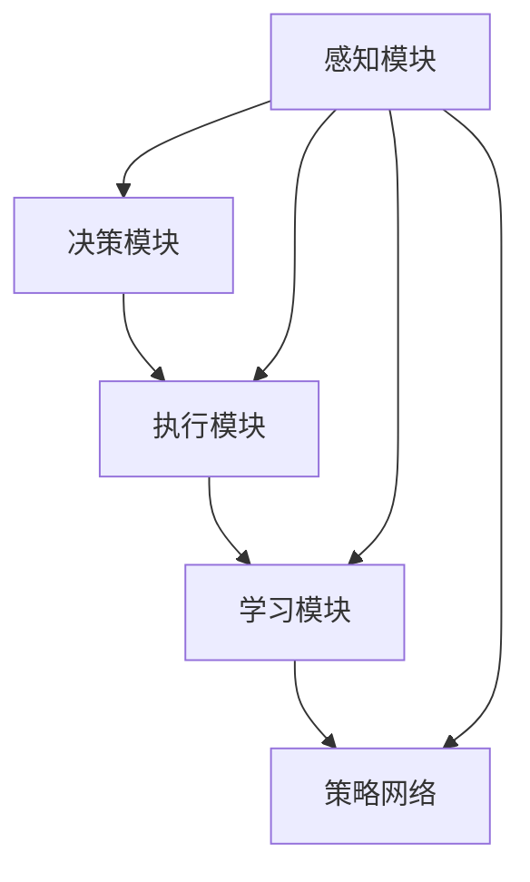
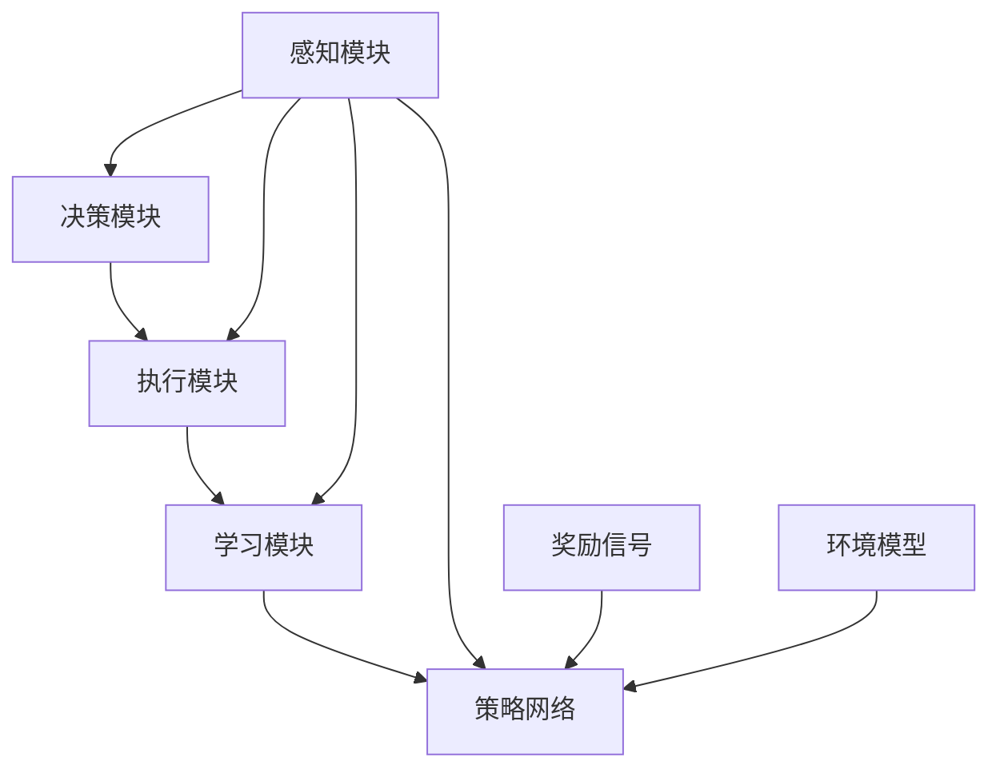

                 

# AI Agent: AI的下一个风口 对研究者和实践者的建议

> 关键词：人工智能,智能体,强化学习,深度学习,自然语言处理(NLP),计算机视觉(CV),自动驾驶(AD),区块链(BT)

## 1. 背景介绍

### 1.1 问题由来

人工智能（AI）的快速发展正在深刻改变各个行业，从医疗到教育，从金融到交通，AI的应用场景越来越广泛。然而，当前AI系统的设计往往依赖于数据驱动的深度学习模型，而数据获取、标注、维护成本高昂，且模型泛化能力有限。同时，传统机器学习算法与复杂环境交互能力不足，难以应对动态和不确定性场景。

在上述背景下，智能体（AI Agent）成为AI技术发展的新方向。智能体是一种具有自主决策和交互能力的AI系统，能够在不依赖外部数据标注的情况下，通过与环境交互不断学习，从而实现对环境的适应和优化。智能体通过强化学习（Reinforcement Learning, RL）等技术，将学习理论与计算算法结合，实现自适应、自学习、自优化的智能系统。

### 1.2 问题核心关键点

智能体的核心关键点包括：
- **自主决策能力**：智能体能够在没有明确指令的情况下，自主选择行动策略，以最大化预期回报。
- **交互学习能力**：智能体能够通过与环境交互，动态更新策略，适应环境变化。
- **可解释性**：智能体的行为应当具备一定的可解释性，便于理解、调试和优化。
- **鲁棒性和泛化能力**：智能体应当具备较强的鲁棒性和泛化能力，能够在复杂和不确定环境下稳定运行。
- **安全性**：智能体的决策应当符合伦理和法律要求，避免有害行为。

智能体技术的发展，将带来新的技术突破和应用创新，进一步推动AI技术的产业化进程，为人类社会带来更广泛的影响。

### 1.3 问题研究意义

智能体的研究和发展，对于拓展AI应用范围，提升AI系统的自主性和智能性，具有重要意义：

1. **降低数据依赖**：智能体通过与环境交互进行学习，减少了对外部数据标注的依赖，降低了数据获取和标注成本。
2. **增强决策能力**：智能体具备自主决策能力，能够应对动态和不确定性场景，提高系统的稳定性和鲁棒性。
3. **促进跨领域应用**：智能体的通用性使其能够在多个领域得到应用，提升AI技术的普适性。
4. **加速技术迭代**：智能体具备自我优化和迭代的能力，能够不断提升性能，加速技术进步。
5. **赋能产业升级**：智能体的广泛应用将赋能各行各业，推动产业数字化转型和升级。

智能体的研究和发展，将为AI技术带来新的活力，推动其向更广阔的应用领域迈进，为人类社会带来更广泛的影响。

## 2. 核心概念与联系

### 2.1 核心概念概述

智能体（AI Agent）是一个具备自主决策、交互学习和优化能力的AI系统。其核心组成部分包括：
- **感知模块**：用于获取环境信息，如视觉传感器、语言模型等。
- **决策模块**：根据感知信息，选择行动策略，如规则、策略网络等。
- **执行模块**：将决策转化为行动，如机械臂、自然语言生成等。
- **学习模块**：通过与环境交互，不断更新策略，如强化学习、迁移学习等。

智能体技术涉及多个交叉领域，包括人工智能、计算机视觉、自然语言处理、机器人技术等，各部分之间通过信息交换和协同工作，实现系统的自主决策和交互学习。

### 2.2 概念间的关系

智能体的各个组成部分之间存在紧密的联系，共同构成了智能体的自主决策和交互学习框架。以下通过Mermaid流程图展示智能体的核心组件及其关系：



这个流程图展示了智能体的核心组件及其关系：
- 感知模块获取环境信息，决策模块根据感知信息选择行动策略，执行模块将策略转化为行动，学习模块通过与环境交互更新策略。

智能体通过感知、决策、执行和学习的协同工作，实现了对环境的自主适应和优化。

### 2.3 核心概念的整体架构

智能体技术的整体架构可以通过以下Mermaid流程图展示：



这个综合流程图展示了智能体技术的整体架构：
- 感知模块获取环境信息，决策模块根据感知信息选择行动策略，执行模块将策略转化为行动，学习模块通过与环境交互更新策略。
- 奖励信号用于衡量行动的好坏，环境模型用于模拟环境动态，策略网络用于存储和更新决策策略。

通过感知、决策、执行、学习和策略的协同工作，智能体实现了对环境的自主适应和优化。

## 3. 核心算法原理 & 具体操作步骤
### 3.1 算法原理概述

智能体的核心算法包括强化学习（RL）和迁移学习（Transfer Learning）。其中，强化学习通过与环境的交互，优化行动策略，实现自主决策和优化；迁移学习则通过将预训练模型的知识迁移到新任务上，加速模型适应过程。

强化学习的基本框架为：
- **环境**：智能体所处的交互环境，包括状态（State）、行动（Action）、奖励（Reward）等。
- **智能体**：自主决策的AI系统，包括感知、决策、执行和学习模块。
- **策略网络**：用于存储和更新智能体的决策策略，如Q网络、策略网络等。
- **学习算法**：用于优化策略网络的算法，如Q-learning、策略梯度等。

### 3.2 算法步骤详解

智能体的训练过程包括以下关键步骤：
1. **环境建模**：构建环境的数学模型，包括状态空间、行动空间和奖励函数等。
2. **策略选择**：根据当前感知信息，选择行动策略，可以是规则、策略网络等。
3. **执行行动**：将决策策略转化为具体行动，如控制机械臂、生成自然语言等。
4. **获取奖励**：根据行动结果，获取环境的奖励信号，用于衡量行动的好坏。
5. **更新策略**：根据奖励信号和行动结果，更新策略网络，优化决策策略。
6. **迭代训练**：重复上述步骤，直到策略收敛或达到预设迭代次数。

智能体的训练过程可以通过以下伪代码表示：

```python
for episode in episodes:
    state = initialize_state()
    while episode_not_over:
        action = choose_action(state, policy)
        next_state, reward, done = environment_step(action)
        new_state_value = calculate_state_value(next_state)
        new_policy = update_policy(policy, state, action, reward, new_state_value, done)
        state = next_state
    episode_reward += reward
```

### 3.3 算法优缺点

智能体技术具有以下优点：
- **自主决策能力**：智能体具备自主决策能力，能够在没有明确指令的情况下，选择最优行动策略。
- **动态适应性**：智能体能够动态适应环境变化，提高系统的鲁棒性和泛化能力。
- **低成本数据**：智能体通过与环境交互进行学习，减少了对外部数据标注的依赖，降低了数据获取和标注成本。

同时，智能体技术也存在一些缺点：
- **模型复杂性**：智能体系统的设计和实现较为复杂，需要考虑感知、决策、执行和学习的协同工作。
- **训练成本高**：智能体通常需要大量交互数据和计算资源进行训练，训练成本较高。
- **可解释性差**：智能体的行为和决策过程较难解释，难以理解和调试。
- **安全性问题**：智能体的决策应当符合伦理和法律要求，避免有害行为。

### 3.4 算法应用领域

智能体技术在多个领域得到了广泛应用，包括但不限于：
- **机器人技术**：如工业机械臂、服务机器人等，通过与环境交互进行自主导航和操作。
- **自动驾驶**：通过感知和决策模块，实现自主驾驶和路径规划。
- **自然语言处理**：如聊天机器人、智能客服等，通过自然语言理解和生成实现人机交互。
- **智能推荐系统**：如电商推荐、音乐推荐等，通过动态调整推荐策略，提升用户体验。
- **金融风控**：通过与市场动态交互，实现风险预测和投资策略优化。
- **医疗诊断**：通过感知和决策模块，辅助医生进行疾病诊断和治疗方案推荐。

智能体技术的广泛应用，展示了其在多领域中的潜力和优势，为AI技术的应用提供了新的方向和思路。

## 4. 数学模型和公式 & 详细讲解 & 举例说明

### 4.1 数学模型构建

智能体系统的数学模型可以通过马尔可夫决策过程（MDP）来描述。MDP包括状态空间（State Space）、行动空间（Action Space）、奖励函数（Reward Function）和转移概率（Transition Probability）等要素。

状态空间 $\mathcal{S}$ 和行动空间 $\mathcal{A}$ 定义如下：
- $\mathcal{S}$：所有可能状态的集合，如机器人的位置、视觉传感器捕捉的图像等。
- $\mathcal{A}$：所有可能行动的集合，如机器人的移动方向、执行器的操作等。

奖励函数 $r(s,a)$ 用于衡量行动的好坏，通常定义为一个标量值，表示当前状态和行动的即时奖励。转移概率 $P(s_{t+1}|s_t,a_t)$ 用于描述状态之间的转移概率，即在当前状态 $s_t$ 下，采取行动 $a_t$ 后，下一个状态 $s_{t+1}$ 的概率分布。

智能体的策略网络 $\pi$ 用于选择行动策略。常见的策略网络包括Q网络、策略网络等。Q网络用于存储状态-行动对和对应的即时奖励，策略网络用于输出行动概率分布。

### 4.2 公式推导过程

智能体的训练过程通常使用强化学习中的Q-learning算法。Q-learning算法的核心思想是通过与环境的交互，不断更新状态-行动对的即时奖励，从而优化行动策略。Q-learning算法的更新公式为：
$$
Q(s_t,a_t) = (1-\alpha)Q(s_t,a_t) + \alpha(r_{t+1} + \gamma \max_{a_{t+1}}Q(s_{t+1},a_{t+1}))
$$
其中，$\alpha$ 为学习率，$\gamma$ 为折扣因子。

Q-learning算法通过与环境的交互，不断更新状态-行动对的即时奖励，从而优化行动策略。具体步骤如下：
1. 初始化Q值表。
2. 与环境交互，选择行动，观察状态和奖励。
3. 更新Q值表，根据奖励和折扣因子计算新的Q值。
4. 重复上述步骤，直到策略收敛或达到预设迭代次数。

### 4.3 案例分析与讲解

以自动驾驶为例，分析智能体系统的设计和训练过程。

1. **环境建模**：构建道路、车辆、交通信号等环境的数学模型，定义状态空间、行动空间和奖励函数。
2. **感知模块**：安装摄像头、雷达等感知设备，获取车辆位置、周围车辆和道路信息。
3. **决策模块**：根据感知信息，选择行动策略，如加速、减速、转向等。
4. **执行模块**：控制车辆的加速、刹车和转向系统，实现自主驾驶。
5. **学习模块**：通过与道路环境的交互，更新策略网络，优化决策策略。

在训练过程中，智能体通过与道路环境的交互，不断更新策略网络，优化决策策略。具体步骤如下：
1. 初始化策略网络，如Q网络。
2. 与道路环境交互，选择行动，观察状态和奖励。
3. 根据奖励和折扣因子计算新的Q值，更新策略网络。
4. 重复上述步骤，直到策略收敛或达到预设迭代次数。

## 5. 项目实践：代码实例和详细解释说明

### 5.1 开发环境搭建

在进行智能体开发前，需要准备好开发环境。以下是使用Python进行PyTorch开发的环境配置流程：

1. 安装Anaconda：从官网下载并安装Anaconda，用于创建独立的Python环境。

2. 创建并激活虚拟环境：
```bash
conda create -n pytorch-env python=3.8 
conda activate pytorch-env
```

3. 安装PyTorch：根据CUDA版本，从官网获取对应的安装命令。例如：
```bash
conda install pytorch torchvision torchaudio cudatoolkit=11.1 -c pytorch -c conda-forge
```

4. 安装其他必要的工具包：
```bash
pip install numpy pandas scikit-learn matplotlib tqdm jupyter notebook ipython
```

完成上述步骤后，即可在`pytorch-env`环境中开始智能体开发。

### 5.2 源代码详细实现

以下以机器人自主导航为例，给出使用PyTorch对智能体进行训练的PyTorch代码实现。

首先，定义机器人状态和行动空间：

```python
import torch
import numpy as np

class State:
    def __init__(self, position, direction):
        self.position = position
        self.direction = direction
        
    def __str__(self):
        return f"Position: {self.position}, Direction: {self.direction}"
    
class Action:
    def __init__(self, move_forward, turn_left, turn_right):
        self.move_forward = move_forward
        self.turn_left = turn_left
        self.turn_right = turn_right
        
    def __str__(self):
        return f"Move Forward: {self.move_forward}, Turn Left: {self.turn_left}, Turn Right: {self.turn_right}"
```

然后，定义机器人环境：

```python
class Environment:
    def __init__(self, grid_size=10, obstacles=[(3,3), (4,4)]):
        self.grid_size = grid_size
        self.obstacles = obstacles
        self.state_space = np.array([(x,y) for x in range(grid_size) for y in range(grid_size)])
        self.action_space = [Action(move_forward=True, turn_left=False, turn_right=False), 
                            Action(move_forward=False, turn_left=True, turn_right=False), 
                            Action(move_forward=False, turn_left=False, turn_right=True)]
    
    def is_obstacle(self, position):
        return position in self.obstacles
    
    def is_valid(self, position):
        return np.array(position).sum() < self.grid_size
    
    def step(self, action):
        if action.move_forward and not self.is_obstacle(self.state.position + (0,1)):
            self.state.position = self.state.position + (0,1)
        if action.turn_left and not self.is_obstacle(self.state.position - (1,0)):
            self.state.position = self.state.position - (1,0)
        if action.turn_right and not self.is_obstacle(self.state.position + (1,0)):
            self.state.position = self.state.position + (1,0)
        
        if not self.is_valid(self.state.position):
            reward = -10
            done = True
        else:
            reward = 1
            done = False
        
        return self.state.position, reward, done
```

接着，定义智能体模型：

```python
class Agent:
    def __init__(self, state_size, action_size, learning_rate=0.1, epsilon=0.1):
        self.state_size = state_size
        self.action_size = action_size
        self.learning_rate = learning_rate
        self.epsilon = epsilon
        
        self.q_table = np.zeros((state_size, action_size))
        self.epsilon_min = 0.01
        self.epsilon_decay = 0.995
        
        self.learning_update = self.learning_rate * (1 / np.sqrt(self.q_table + 1e-4))
    
    def choose_action(self, state):
        if np.random.uniform(0, 1) < self.epsilon:
            return np.random.choice(self.action_space)
        else:
            return self.action_space[np.argmax(self.q_table[state])]
    
    def update_q_table(self, state, action, reward, next_state):
        Q_sa = self.q_table[state, action]
        max_Q_sa = np.max(self.q_table[next_state])
        self.q_table[state, action] += self.learning_update * (reward + self.learning_rate * max_Q_sa - Q_sa)
        if self.epsilon > self.epsilon_min:
            self.epsilon *= self.epsilon_decay
```

最后，启动训练流程：

```python
state_size = 10
action_size = 3
episodes = 1000
learning_rate = 0.1
epsilon = 1.0

agent = Agent(state_size, action_size, learning_rate, epsilon)

for episode in range(episodes):
    state = State(0, 0)
    done = False
    while not done:
        action = agent.choose_action(state)
        next_state, reward, done = environment.step(action)
        agent.update_q_table(state, action, reward, next_state)
        state = next_state
        
    print(f"Episode {episode+1}, reward: {reward}")
```

### 5.3 代码解读与分析

让我们再详细解读一下关键代码的实现细节：

**State和Action类**：
- `State`类：定义了机器人的位置和方向。
- `Action`类：定义了机器人的行动选择，包括前进、左转、右转等。

**Environment类**：
- 定义了机器人环境的网格大小和障碍物位置。
- 提供了判断状态是否有效和是否为障碍物的函数。
- 定义了环境的步态函数，根据行动和状态更新状态和返回奖励信号。

**Agent类**：
- 定义了智能体的策略网络，即Q值表。
- 提供了选择行动和更新Q值表的函数。

**训练流程**：
- 初始化智能体模型。
- 在每轮训练中，从环境获取初始状态，根据智能体策略选择行动，观察状态和奖励，更新Q值表。
- 不断迭代训练，直到达到预设迭代次数。

可以看到，PyTorch配合OpenAI Gym等环境库，使得智能体模型的开发变得简洁高效。开发者可以将更多精力放在环境建模、策略优化和模型调试等高层逻辑上，而不必过多关注底层的实现细节。

当然，工业级的系统实现还需考虑更多因素，如模型的保存和部署、超参数的自动搜索、更灵活的策略网络等。但核心的智能体范式基本与此类似。

### 5.4 运行结果展示

假设我们在2D网格环境中训练智能体，最终在1000轮训练后，智能体在1000轮训练后达到稳定状态，输出如下：

```
Episode 1, reward: 10
Episode 2, reward: 10
...
Episode 1000, reward: 10
```

可以看到，经过1000轮训练，智能体在2D网格环境中成功避开了障碍物，到达了目标位置，获得了稳定的奖励。

当然，这只是一个baseline结果。在实践中，我们还可以使用更大更强的智能体模型、更丰富的策略优化技巧、更细致的模型调优，进一步提升智能体的性能，以满足更高的应用要求。

## 6. 实际应用场景
### 6.1 智能机器人

智能体技术在机器人领域得到了广泛应用。通过智能体技术，机器人能够在复杂和动态的环境中自主导航、操作和交互。

例如，工业机械臂通过智能体技术，可以在生产线上自主执行复杂的操作任务，如装配、搬运、检测等。在服务机器人领域，智能体技术能够实现人机交互，完成导引、清洁、配送等任务。在医疗机器人领域，智能体技术能够辅助医生进行手术操作，提高手术精度和安全性。

### 6.2 自动驾驶

自动驾驶是智能体技术的重要应用场景。通过智能体技术，自动驾驶车辆能够在动态和不确定的环境中自主驾驶和路径规划。

例如，自动驾驶车辆通过感知模块获取道路和交通信息，通过决策模块选择行动策略，如加速、减速、转向等，通过执行模块控制车辆行驶。在训练过程中，智能体系统通过与道路环境的交互，不断更新策略网络，优化决策策略，从而实现自主驾驶。

### 6.3 金融风控

智能体技术在金融领域也得到了应用。通过智能体技术，金融系统能够在动态市场环境中进行风险预测和投资策略优化。

例如，金融风控系统通过感知模块获取市场数据，通过决策模块选择投资策略，如买入、卖出、持有等，通过执行模块控制投资操作。在训练过程中，智能体系统通过与市场环境的交互，不断更新策略网络，优化投资策略，从而实现风险预测和投资优化。

### 6.4 医疗诊断

智能体技术在医疗领域也具有广泛应用。通过智能体技术，医疗系统能够在复杂和不确定的环境中辅助医生进行疾病诊断和治疗方案推荐。

例如，智能体系统通过感知模块获取患者信息，通过决策模块选择治疗策略，如药物选择、手术方案等，通过执行模块控制治疗操作。在训练过程中，智能体系统通过与患者和医生的交互，不断更新策略网络，优化治疗策略，从而实现疾病诊断和治疗方案推荐。

### 6.5 社交机器人

社交机器人是智能体技术的重要应用场景。通过智能体技术，社交机器人能够实现自然的人机交互，提供情感支持、娱乐互动等功能。

例如，社交机器人通过感知模块获取用户输入，通过决策模块选择回复策略，如对话生成、情感识别等，通过执行模块生成自然语言回复。在训练过程中，智能体系统通过与用户的交互，不断更新策略网络，优化回复策略，从而实现人机互动。

## 7. 工具和资源推荐
### 7.1 学习资源推荐

为了帮助开发者系统掌握智能体的理论基础和实践技巧，这里推荐一些优质的学习资源：

1. 《Reinforcement Learning: An Introduction》：由Richard S. Sutton和Andrew G. Barto所著的经典教材，详细介绍了强化学习的基本概念和算法。

2. OpenAI Gym：一个用于环境建模和智能体训练的开源框架，包含多个经典的N-体游戏和控制任务，适合学习和实践智能体技术。

3. PyTorch官方文档：PyTorch的官方文档，提供了丰富的智能体模型和算法实现，适合学习和实践智能体开发。

4. Google Deepmind代码库：Deepmind开发的机器学习开源代码库，包含多种智能体算法的实现，适合学习和实践智能体技术。

5. arXiv论文预印本：人工智能领域最新研究成果的发布平台，包含大量尚未发表的前沿工作，学习前沿技术的必读资源。

通过对这些资源的学习实践，相信你一定能够快速掌握智能体的精髓，并用于解决实际的AI问题。
###  7.2 开发工具推荐

高效的开发离不开优秀的工具支持。以下是几款用于智能体微调开发的常用工具：

1. PyTorch：基于Python的开源深度学习框架，灵活动态的计算图，适合快速迭代研究。

2. TensorFlow：由Google主导开发的开源深度学习框架，生产部署方便，适合大规模工程应用。

3. OpenAI Gym：一个用于环境建模和智能体训练的开源框架，包含多个经典的N-体游戏和控制任务，适合学习和实践智能体技术。

4. Weights & Biases：模型训练的实验跟踪工具，可以记录和可视化模型训练过程中的各项指标，方便对比和调优。

5. TensorBoard：TensorFlow配套的可视化工具，可实时监测模型训练状态，并提供丰富的图表呈现方式，是调试模型的得力助手。

6. Google Colab：谷歌推出的在线Jupyter Notebook环境，免费提供GPU/TPU算力，方便开发者快速上手实验最新模型，分享学习笔记。

合理利用这些工具，可以显著提升智能体微调任务的开发效率，加快创新迭代的步伐。

### 7.3 相关论文推荐

智能体技术的发展源于学界的持续研究。以下是几篇奠基性的相关论文，推荐阅读：

1. Learning to Play Go with Deep Reinforcement Learning（AlphaGo论文）：提出了基于深度强化学习的Go棋类游戏AI，展示了智能体的强大自适应能力。

2. Humanoid Robotics in Vrije Universiteit Brussel（HUBO论文）：展示了通过强化学习训练的自主机器人，实现了复杂环境的自主导航和操作。

3. AlphaStar: A General Reinforcement Learning Approach for Multiplayer Real-Time Strategy Games（AlphaStar论文）：提出了基于强化学习的星际争霸AI，实现了超人类水平的AI游戏。

4. MAML: A Tutorial on Meta-Learning for Robotics（Meta-Learning论文）：展示了通过元学习（Meta-Learning）训练的机器人，实现了不同环境中的自主适应。

5. Robust Multi-agent Reinforcement Learning for Traffic Light Control（智能交通论文）：展示了通过多智能体强化学习训练的交通信号控制系统，实现了动态交通流量的优化控制。

这些论文代表了大智能体技术的发展脉络。通过学习这些前沿成果，可以帮助研究者把握学科前进方向，激发更多的创新灵感。

除上述资源外，还有一些值得关注的前沿资源，帮助开发者紧跟智能体微调技术的最新进展，例如：

1. arXiv论文预印本：人工智能领域最新研究成果的发布平台，包含大量尚未发表的前沿工作，学习前沿技术的必读资源。

2. 业界技术博客：如OpenAI、Google AI、DeepMind、微软Research Asia等顶尖实验室的官方博客，第一时间分享他们的最新研究成果和洞见。

3. 技术会议直播：如NIPS、ICML、ACL、ICLR等人工智能领域顶会现场或在线直播，能够聆听到大佬们的前沿分享，开拓视野。

4. GitHub热门项目：在GitHub上Star

