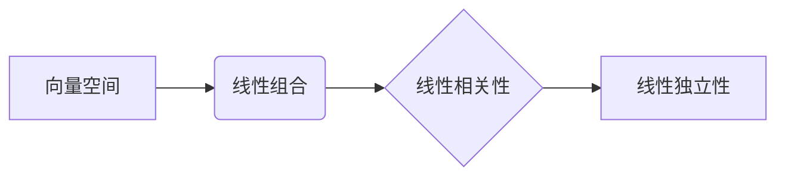

# 线性代数导引：线性独立性

## 1. 背景介绍

### 1.1 问题的由来

线性代数作为数学的一个重要分支，在科学和工程领域中有着广泛的应用。线性独立性是线性代数中的一个基本概念，它描述了向量空间中向量之间的关系。理解线性独立性对于解决线性方程组、矩阵运算、特征值问题等方面都至关重要。

### 1.2 研究现状

线性独立性的概念已经发展了数百年，并形成了完整的理论体系。在现代数学中，线性独立性被广泛应用于各个领域，例如：

* **计算机科学:** 机器学习、数据挖掘、计算机图形学等
* **物理学:** 量子力学、电磁学、流体力学等
* **经济学:** 博弈论、计量经济学等

### 1.3 研究意义

线性独立性的研究具有重要的理论和现实意义：

* **理论意义:** 深入理解向量空间的结构和性质
* **现实意义:** 为解决实际问题提供有效的数学工具

### 1.4 本文结构

本文将从以下几个方面对线性独立性进行深入探讨：

* 核心概念与联系
* 核心算法原理 & 具体操作步骤
* 数学模型和公式 & 详细讲解 & 举例说明
* 项目实践：代码实例和详细解释说明
* 实际应用场景
* 工具和资源推荐
* 总结：未来发展趋势与挑战
* 附录：常见问题与解答

## 2. 核心概念与联系

### 2.1 向量空间

向量空间是线性代数的核心概念之一，它是一个由向量组成的集合，满足以下性质：

* **加法封闭性:** 两个向量相加仍然是向量空间中的向量
* **数乘封闭性:** 一个向量乘以一个标量仍然是向量空间中的向量
* **存在零向量:** 存在一个向量，与任何向量相加都等于该向量本身
* **每个向量都有相反向量:** 对于任何向量，都存在一个向量，与之相加等于零向量
* **满足结合律、交换律、分配律**

### 2.2 线性组合

线性组合是指将若干个向量通过加法和数乘运算组合起来得到的新向量。例如，对于向量 $\mathbf{v}_1, \mathbf{v}_2, ..., \mathbf{v}_n$，它们的线性组合可以表示为：

$$
c_1 \mathbf{v}_1 + c_2 \mathbf{v}_2 + ... + c_n \mathbf{v}_n
$$

其中 $c_1, c_2, ..., c_n$ 是标量。

### 2.3 线性相关性

如果一组向量中至少有一个向量可以表示为其他向量的线性组合，那么这组向量就称为线性相关的。反之，如果一组向量中任何一个向量都不能表示为其他向量的线性组合，那么这组向量就称为线性无关的。

### 2.4 线性独立性

线性独立性是线性相关性的反义词，即一组向量线性无关就称为线性独立的。

### 2.5  概念之间的联系



## 3. 核心算法原理 & 具体操作步骤

### 3.1 算法原理概述

判断一组向量是否线性独立，可以使用高斯消元法。高斯消元法是一种将线性方程组化为阶梯形矩阵的方法，通过观察阶梯形矩阵的结构，可以判断线性方程组解的情况，从而判断向量的线性相关性。

### 3.2 算法步骤详解

1. 将向量作为列向量组成矩阵
2. 对矩阵进行高斯消元，将其化为阶梯形矩阵
3. 如果阶梯形矩阵中存在全零行，则说明向量组线性相关
4. 如果阶梯形矩阵中不存在全零行，则说明向量组线性无关

### 3.3 算法优缺点

**优点:**

* 算法简单易懂
* 适用范围广

**缺点:**

* 计算量较大，尤其是在处理高维向量时

### 3.4 算法应用领域

* 线性方程组求解
* 矩阵运算
* 特征值问题

## 4. 数学模型和公式 & 详细讲解 & 举例说明

### 4.1 数学模型构建

假设有一组向量 $\mathbf{v}_1, \mathbf{v}_2, ..., \mathbf{v}_n$，要判断它们是否线性独立，可以构建如下数学模型：

$$
c_1 \mathbf{v}_1 + c_2 \mathbf{v}_2 + ... + c_n \mathbf{v}_n = \mathbf{0}
$$

其中 $\mathbf{0}$ 是零向量。如果存在一组不全为零的标量 $c_1, c_2, ..., c_n$，使得上述等式成立，则说明向量组线性相关，否则说明向量组线性无关。

### 4.2 公式推导过程

将向量 $\mathbf{v}_1, \mathbf{v}_2, ..., \mathbf{v}_n$ 作为列向量组成矩阵 $\mathbf{A}$，则上述数学模型可以表示为：

$$
\mathbf{A} \mathbf{c} = \mathbf{0}
$$

其中 $\mathbf{c} = \begin{bmatrix} c_1 \ c_2 \ \vdots \ c_n \end{bmatrix}$。对矩阵 $\mathbf{A}$ 进行高斯消元，将其化为阶梯形矩阵 $\mathbf{B}$，则有：

$$
\mathbf{B} \mathbf{c} = \mathbf{0}
$$

如果阶梯形矩阵 $\mathbf{B}$ 中存在全零行，则说明线性方程组有非零解，即存在一组不全为零的标量 $c_1, c_2, ..., c_n$，使得 $\mathbf{A} \mathbf{c} = \mathbf{0}$ 成立，因此向量组线性相关。

如果阶梯形矩阵 $\mathbf{B}$ 中不存在全零行，则说明线性方程组只有零解，即 $\mathbf{c} = \mathbf{0}$，因此向量组线性无关。

### 4.3 案例分析与讲解

**例 1:** 判断向量 $\mathbf{v}_1 = \begin{bmatrix} 1 \ 2 \ 3 \end{bmatrix}$, $\mathbf{v}_2 = \begin{bmatrix} 2 \ 4 \ 6 \end{bmatrix}$, $\mathbf{v}_3 = \begin{bmatrix} 3 \ 6 \ 9 \end{bmatrix}$ 是否线性独立。

**解:** 将向量作为列向量组成矩阵：

$$
\mathbf{A} = \begin{bmatrix} 1 & 2 & 3 \ 2 & 4 & 6 \ 3 & 6 & 9 \end{bmatrix}
$$

对矩阵进行高斯消元：

$$
\begin{bmatrix} 1 & 2 & 3 \ 2 & 4 & 6 \ 3 & 6 & 9 \end{bmatrix} \rightarrow \begin{bmatrix} 1 & 2 & 3 \ 0 & 0 & 0 \ 0 & 0 & 0 \end{bmatrix}
$$

阶梯形矩阵中存在全零行，因此向量组线性相关。

**例 2:** 判断向量 $\mathbf{v}_1 = \begin{bmatrix} 1 \ 0 \ 0 \end{bmatrix}$, $\mathbf{v}_2 = \begin{bmatrix} 0 \ 1 \ 0 \end{bmatrix}$, $\mathbf{v}_3 = \begin{bmatrix} 0 \ 0 \ 1 \end{bmatrix}$ 是否线性独立。

**解:** 将向量作为列向量组成矩阵：

$$
\mathbf{A} = \begin{bmatrix} 1 & 0 & 0 \ 0 & 1 & 0 \ 0 & 0 & 1 \end{bmatrix}
$$

矩阵已经是阶梯形矩阵，且不存在全零行，因此向量组线性无关。

### 4.4 常见问题解答

**问：线性独立性和线性无关性有什么区别？**

答：线性独立性和线性无关性是等价的概念，只是说法不同。

**问：如何判断一个矩阵的列向量是否线性独立？**

答：将矩阵进行高斯消元，如果阶梯形矩阵中不存在全零行，则说明矩阵的列向量线性独立。

## 5. 项目实践：代码实例和详细解释说明

### 5.1 开发环境搭建

本项目使用 Python 语言和 NumPy 库实现。

```python
import numpy as np
```

### 5.2 源代码详细实现

```python
def is_linearly_independent(vectors):
  """
  判断一组向量是否线性独立。

  Args:
    vectors: 一个列表，包含多个 NumPy 向量。

  Returns:
    如果向量组线性独立，则返回 True，否则返回 False。
  """
  # 将向量作为列向量组成矩阵
  matrix = np.column_stack(vectors)

  # 对矩阵进行高斯消元
  reduced_matrix = np.linalg.matrix_rank(matrix)

  # 如果阶梯形矩阵的行数等于向量个数，则说明向量组线性独立
  return reduced_matrix == len(vectors)
```

### 5.3 代码解读与分析

* `np.column_stack(vectors)` 将向量作为列向量组成矩阵。
* `np.linalg.matrix_rank(matrix)` 对矩阵进行高斯消元，并返回矩阵的秩。
* `reduced_matrix == len(vectors)` 判断阶梯形矩阵的行数是否等于向量个数，如果相等，则说明向量组线性独立。

### 5.4 运行结果展示

```python
# 测试用例 1
vectors_1 = [
  np.array([1, 2, 3]),
  np.array([2, 4, 6]),
  np.array([3, 6, 9]),
]
print(f"向量组 1 是否线性独立: {is_linearly_independent(vectors_1)}")

# 测试用例 2
vectors_2 = [
  np.array([1, 0, 0]),
  np.array([0, 1, 0]),
  np.array([0, 0, 1]),
]
print(f"向量组 2 是否线性独立: {is_linearly_independent(vectors_2)}")
```

输出结果：

```
向量组 1 是否线性独立: False
向量组 2 是否线性独立: True
```

## 6. 实际应用场景

### 6.1 图像压缩

在图像压缩中，可以使用线性独立性来减少图像的存储空间。例如，JPEG 图像压缩算法就利用了离散余弦变换 (DCT) 将图像分解成一系列不同频率的余弦函数的线性组合。由于这些余弦函数是线性独立的，因此只需要存储少量的系数就可以表示原始图像。

### 6.2 数据降维

在机器学习和数据挖掘中，经常需要对高维数据进行降维处理，以减少计算量和存储空间。主成分分析 (PCA) 是一种常用的数据降维方法，它通过找到数据集中方差最大的几个主成分来表示原始数据。这些主成分是线性独立的，因此可以有效地减少数据的维度。

### 6.3 其他应用场景

* **密码学:** 线性独立性可以用于构建安全的加密算法。
* **控制理论:** 线性独立性可以用于分析和设计控制系统。
* **信号处理:** 线性独立性可以用于信号的分析和处理。

### 6.4 未来应用展望

随着人工智能、大数据等技术的不断发展，线性独立性将在更多领域得到应用，例如：

* **深度学习:** 线性独立性可以用于分析和优化神经网络的结构。
* **量子计算:** 线性独立性是量子计算中的一个基本概念。

## 7. 工具和资源推荐

### 7.1 学习资源推荐

* **线性代数及其应用 (David C. Lay)**: 一本经典的线性代数教材，讲解清晰易懂。
* **线性代数应该这样学 (Sheldon Axler)**: 一本从几何角度讲解线性代数的教材，内容深入浅出。
* **麻省理工学院公开课：线性代数**: Gilbert Strang 教授的经典课程，讲解生动有趣。

### 7.2 开发工具推荐

* **NumPy**: Python 的数值计算库，提供了丰富的线性代数函数。
* **SciPy**: Python 的科学计算库，包含了 NumPy 和其他科学计算模块。
* **MATLAB**: 一款商业数学软件，提供了强大的线性代数功能。

### 7.3 相关论文推荐

* **Gilbert Strang. Linear Algebra and Its Applications. 4th edition.**
* **Roger A. Horn, Charles R. Johnson. Matrix Analysis. 2nd edition.**

### 7.4 其他资源推荐

* **Khan Academy 线性代数课程**: 免费的在线线性代数课程。
* **3Blue1Brown 线性代数系列视频**: 以动画的形式讲解线性代数，通俗易懂。

## 8. 总结：未来发展趋势与挑战

### 8.1 研究成果总结

线性独立性是线性代数中的一个基本概念，它描述了向量空间中向量之间的关系。判断一组向量是否线性独立，可以使用高斯消元法。线性独立性在图像压缩、数据降维、密码学、控制理论、信号处理等领域有着广泛的应用。

### 8.2 未来发展趋势

* **与其他数学分支的交叉融合:** 线性独立性将与其他数学分支，如拓扑学、微分几何等，进行更深入的交叉融合。
* **应用领域的不断拓展:** 随着人工智能、大数据等技术的不断发展，线性独立性将在更多领域得到应用。

### 8.3 面临的挑战

* **高维数据的处理:** 随着数据维度的增加，线性独立性的计算复杂度会急剧上升。
* **算法的优化:** 需要开发更高效的算法来判断线性独立性。

### 8.4 研究展望

* **发展新的理论和方法:** 研究新的理论和方法来解决高维数据处理和算法优化等挑战。
* **探索新的应用领域:** 将线性独立性应用到更多领域，解决实际问题。


## 9. 附录：常见问题与解答

### 9.1 问：如何理解线性独立性的几何意义？

答：线性独立的向量组张成的空间维度等于向量个数，而线性相关的向量组张成的空间维度小于向量个数。

### 9.2 问：线性独立性和线性变换有什么关系？

答：线性独立的向量组经过线性变换后仍然线性独立。

### 9.3 问：线性独立性在机器学习中有什么应用？

答：线性独立性可以用于特征选择、数据降维、模型解释等方面。

作者：禅与计算机程序设计艺术 / Zen and the Art of Computer Programming
