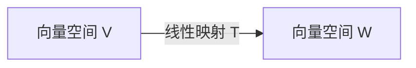

# 线性代数导引：线性映射

## 1. 背景介绍

### 1.1 问题的由来

线性代数作为数学的一个重要分支，广泛应用于科学和工程的各个领域。其中，线性映射作为线性代数的核心概念之一，在诸如计算机图形学、机器学习、数据压缩等领域扮演着至关重要的角色。理解线性映射的概念及其性质，对于深入学习和应用线性代数至关重要。

### 1.2 研究现状

线性映射的概念由来已久，并在数学、物理、工程等领域得到了广泛的研究和应用。近年来，随着计算机科学的快速发展，线性映射在计算机图形学、机器学习、数据压缩等领域的应用越来越广泛，并取得了显著的成果。例如，在计算机图形学中，线性映射被用于实现三维图形的变换和投影；在机器学习中，线性映射被用于构建线性模型，例如线性回归和支持向量机；在数据压缩中，线性映射被用于实现数据的降维和特征提取。

### 1.3 研究意义

深入理解线性映射的概念及其性质，对于学习和应用线性代数至关重要。具体而言，研究线性映射的意义在于：

* **奠定线性代数的基础:** 线性映射是线性代数的核心概念之一，理解线性映射的概念对于学习其他线性代数概念（如线性空间、矩阵、行列式等）至关重要。
* **促进对其他学科的理解:** 线性映射的概念广泛应用于数学、物理、工程等领域，理解线性映射的概念有助于更好地理解这些学科的知识。
* **推动科技发展:** 线性映射在计算机图形学、机器学习、数据压缩等领域有着广泛的应用，深入研究线性映射有助于推动这些领域的科技发展。

### 1.4 本文结构

本文将从以下几个方面对线性映射进行深入探讨：

* **核心概念与联系:** 介绍线性映射的概念、性质及其与其他线性代数概念的联系。
* **核心算法原理 & 具体操作步骤:** 阐述线性映射的算法原理，并通过具体的例子说明如何进行线性映射的计算。
* **数学模型和公式 & 详细讲解 & 举例说明:** 建立线性映射的数学模型，推导相关公式，并通过案例分析和讲解加深对线性映射的理解。
* **项目实践：代码实例和详细解释说明:** 通过 Python 代码实现线性映射的算法，并对代码进行详细的解释说明。
* **实际应用场景:** 介绍线性映射在实际应用场景中的应用，例如计算机图形学、机器学习等。
* **工具和资源推荐:** 推荐学习线性映射的相关工具和资源，例如书籍、网站、软件等。
* **总结：未来发展趋势与挑战:** 对线性映射的研究进行总结，并展望其未来发展趋势和挑战。
* **附录：常见问题与解答:**  解答一些关于线性映射的常见问题。

## 2. 核心概念与联系

### 2.1 向量空间

在介绍线性映射之前，我们先来回顾一下向量空间的概念。向量空间是一个集合 $V$，其元素称为向量，满足以下条件：

* **加法封闭性:** 对于任意两个向量 $\mathbf{u}, \mathbf{v} \in V$，它们的和 $\mathbf{u} + \mathbf{v}$ 也属于 $V$。
* **标量乘法封闭性:** 对于任意向量 $\mathbf{v} \in V$ 和任意标量 $c$，它们的乘积 $c\mathbf{v}$ 也属于 $V$。
* **加法结合律:** 对于任意向量 $\mathbf{u}, \mathbf{v}, \mathbf{w} \in V$，有 $(\mathbf{u} + \mathbf{v}) + \mathbf{w} = \mathbf{u} + (\mathbf{v} + \mathbf{w})$。
* **加法交换律:** 对于任意向量 $\mathbf{u}, \mathbf{v} \in V$，有 $\mathbf{u} + \mathbf{v} = \mathbf{v} + \mathbf{u}$。
* **零向量存在:** 存在一个向量 $\mathbf{0} \in V$，使得对于任意向量 $\mathbf{v} \in V$，有 $\mathbf{v} + \mathbf{0} = \mathbf{v}$。
* **负向量存在:** 对于任意向量 $\mathbf{v} \in V$，存在一个向量 $-\mathbf{v} \in V$，使得 $\mathbf{v} + (-\mathbf{v}) = \mathbf{0}$。
* **标量乘法结合律:** 对于任意向量 $\mathbf{v} \in V$ 和任意标量 $c_1, c_2$，有 $(c_1 c_2) \mathbf{v} = c_1 (c_2 \mathbf{v})$。
* **标量乘法分配律 1:** 对于任意向量 $\mathbf{u}, \mathbf{v} \in V$ 和任意标量 $c$，有 $c (\mathbf{u} + \mathbf{v}) = c\mathbf{u} + c\mathbf{v}$。
* **标量乘法分配律 2:** 对于任意向量 $\mathbf{v} \in V$ 和任意标量 $c_1, c_2$，有 $(c_1 + c_2) \mathbf{v} = c_1 \mathbf{v} + c_2 \mathbf{v}$。
* **单位元存在:** 存在一个标量 $1$，使得对于任意向量 $\mathbf{v} \in V$，有 $1\mathbf{v} = \mathbf{v}$。

### 2.2 线性映射

线性映射是指从一个向量空间 $V$ 到另一个向量空间 $W$ 的映射 $T$，满足以下条件：

* **加性:** 对于任意向量 $\mathbf{u}, \mathbf{v} \in V$，有 $T(\mathbf{u} + \mathbf{v}) = T(\mathbf{u}) + T(\mathbf{v})$。
* **齐性:** 对于任意向量 $\mathbf{v} \in V$ 和任意标量 $c$，有 $T(c\mathbf{v}) = cT(\mathbf{v})$。

换句话说，线性映射保持向量加法和标量乘法运算。

### 2.3 线性映射的表示

线性映射可以用矩阵来表示。假设 $V$ 是一个 $n$ 维向量空间，$W$ 是一个 $m$ 维向量空间，$T: V \to W$ 是一个线性映射。那么，存在一个 $m \times n$ 的矩阵 $\mathbf{A}$，使得对于任意向量 $\mathbf{v} \in V$，有：

$$
T(\mathbf{v}) = \mathbf{A}\mathbf{v}
$$

其中，$\mathbf{v}$ 表示为一个 $n \times 1$ 的列向量。

### 2.4 线性映射的性质

线性映射具有以下重要性质：

* **线性变换:** 线性映射保持线性组合。也就是说，对于任意向量 $\mathbf{v}_1, \mathbf{v}_2, \dots, \mathbf{v}_k \in V$ 和任意标量 $c_1, c_2, \dots, c_k$，有：

$$
T(c_1 \mathbf{v}_1 + c_2 \mathbf{v}_2 + \dots + c_k \mathbf{v}_k) = c_1 T(\mathbf{v}_1) + c_2 T(\mathbf{v}_2) + \dots + c_k T(\mathbf{v}_k)
$$

* **核与像:** 线性映射的核和像是两个重要的子空间。线性映射 $T$ 的核是指所有被映射到零向量的向量集合，记作 $\text{ker}(T)$：

$$
\text{ker}(T) = \{\mathbf{v} \in V \mid T(\mathbf{v}) = \mathbf{0}\}
$$

线性映射 $T$ 的像是指所有 $T(\mathbf{v})$ 形式的向量集合，记作 $\text{im}(T)$：

$$
\text{im}(T) = \{T(\mathbf{v}) \mid \mathbf{v} \in V\}
$$

* **秩-零化度定理:** 线性映射的秩和零化度的和等于定义域的维数。也就是说，如果 $T: V \to W$ 是一个线性映射，那么：

$$
\text{rank}(T) + \text{nullity}(T) = \text{dim}(V)
$$

其中，$\text{rank}(T)$ 表示 $\text{im}(T)$ 的维数，$\text{nullity}(T)$ 表示 $\text{ker}(T)$ 的维数。

### 2.5 线性映射与其他线性代数概念的联系

线性映射与其他线性代数概念密切相关，例如：

* **线性空间:** 线性映射的定义域和值域都是线性空间。
* **矩阵:** 线性映射可以用矩阵来表示。
* **行列式:** 线性映射的行列式可以用来判断线性映射是否可逆。
* **特征值和特征向量:** 线性映射的特征值和特征向量可以用来描述线性映射的几何性质。

## 3. 核心算法原理 & 具体操作步骤

### 3.1 算法原理概述

线性映射的算法原理是基于矩阵乘法。给定一个线性映射 $T: V \to W$，我们可以找到一个矩阵 $\mathbf{A}$ 来表示它。然后，对于任意向量 $\mathbf{v} \in V$，我们可以通过计算矩阵乘积 $\mathbf{A}\mathbf{v}$ 来计算 $T(\mathbf{v})$。

### 3.2 算法步骤详解

假设我们要计算线性映射 $T: \mathbb{R}^2 \to \mathbb{R}^3$，其中：

$$
T\left(
\begin{bmatrix}
x \
y
\end{bmatrix}
\right) =
\begin{bmatrix}
x + 2y \
3x - y \
x + y
\end{bmatrix}
$$

1. **找到表示线性映射的矩阵:** 为了找到表示 $T$ 的矩阵 $\mathbf{A}$，我们可以将标准基向量 $\mathbf{e}_1 = \begin{bmatrix} 1 \ 0 \end{bmatrix}$ 和 $\mathbf{e}_2 = \begin{bmatrix} 0 \ 1 \end{bmatrix}$ 代入 $T$ 中，得到：

$$
T(\mathbf{e}_1) =
\begin{bmatrix}
1 \
3 \
1
\end{bmatrix}, \quad
T(\mathbf{e}_2) =
\begin{bmatrix}
2 \
-1 \
1
\end{bmatrix}
$$

将 $T(\mathbf{e}_1)$ 和 $T(\mathbf{e}_2)$ 作为 $\mathbf{A}$ 的列向量，得到：

$$
\mathbf{A} =
\begin{bmatrix}
1 & 2 \
3 & -1 \
1 & 1
\end{bmatrix}
$$

2. **计算矩阵乘积:** 现在，我们可以使用矩阵 $\mathbf{A}$ 来计算任意向量 $\mathbf{v} \in \mathbb{R}^2$ 的线性映射 $T(\mathbf{v})$。例如，假设 $\mathbf{v} = \begin{bmatrix} 2 \ -1 \end{bmatrix}$，那么：

$$
T(\mathbf{v}) = \mathbf{A}\mathbf{v} =
\begin{bmatrix}
1 & 2 \
3 & -1 \
1 & 1
\end{bmatrix}
\begin{bmatrix}
2 \
-1
\end{bmatrix}
=
\begin{bmatrix}
0 \
7 \
1
\end{bmatrix}
$$

### 3.3 算法优缺点

**优点:**

* 计算简单直观。
* 适用于任意线性映射。

**缺点:**

* 对于高维向量空间，矩阵的规模会很大，计算量会很大。

### 3.4 算法应用领域

线性映射的算法广泛应用于以下领域：

* **计算机图形学:** 用于实现三维图形的变换和投影。
* **机器学习:** 用于构建线性模型，例如线性回归和支持向量机。
* **数据压缩:** 用于实现数据的降维和特征提取。
* **信号处理:** 用于实现信号的滤波和变换。
* **控制理论:** 用于描述线性系统的行为。

## 4. 数学模型和公式 & 详细讲解 & 举例说明

### 4.1 数学模型构建

线性映射的数学模型可以用以下方式表示：



其中：

* $V$ 是线性映射的定义域，也是一个向量空间。
* $W$ 是线性映射的值域，也是一个向量空间。
* $T$ 是从 $V$ 到 $W$ 的线性映射。

### 4.2 公式推导过程

线性映射的公式可以表示为：

$$
T(\mathbf{v}) = \mathbf{A}\mathbf{v}
$$

其中：

* $\mathbf{v}$ 是 $V$ 中的一个向量。
* $\mathbf{A}$ 是一个 $m \times n$ 的矩阵，表示线性映射 $T$。
* $T(\mathbf{v})$ 是 $W$ 中的一个向量，是 $\mathbf{v}$ 在 $T$ 作用下的像。

### 4.3 案例分析与讲解

**案例 1: 旋转变换**

考虑二维平面上的旋转变换。假设我们要将一个向量 $\mathbf{v}$ 绕原点逆时针旋转 $\theta$ 角，得到向量 $\mathbf{v}'$。这个旋转变换可以用一个线性映射 $T: \mathbb{R}^2 \to \mathbb{R}^2$ 来表示。

为了找到表示 $T$ 的矩阵 $\mathbf{A}$，我们可以将标准基向量 $\mathbf{e}_1 = \begin{bmatrix} 1 \ 0 \end{bmatrix}$ 和 $\mathbf{e}_2 = \begin{bmatrix} 0 \ 1 \end{bmatrix}$ 代入 $T$ 中。根据旋转变换的几何意义，我们可以得到：

$$
T(\mathbf{e}_1) =
\begin{bmatrix}
\cos \theta \
\sin \theta
\end{bmatrix}, \quad
T(\mathbf{e}_2) =
\begin{bmatrix}
-\sin \theta \
\cos \theta
\end{bmatrix}
$$

将 $T(\mathbf{e}_1)$ 和 $T(\mathbf{e}_2)$ 作为 $\mathbf{A}$ 的列向量，得到：

$$
\mathbf{A} =
\begin{bmatrix}
\cos \theta & -\sin \theta \
\sin \theta & \cos \theta
\end{bmatrix}
$$

因此，旋转变换的线性映射可以表示为：

$$
T(\mathbf{v}) =
\begin{bmatrix}
\cos \theta & -\sin \theta \
\sin \theta & \cos \theta
\end{bmatrix}
\mathbf{v}
$$

**案例 2: 投影变换**

考虑将三维空间中的一个点 $(x, y, z)$ 投影到 $xy$ 平面上的投影变换。这个投影变换可以用一个线性映射 $T: \mathbb{R}^3 \to \mathbb{R}^2$ 来表示。

根据投影变换的几何意义，我们可以得到：

$$
T\left(
\begin{bmatrix}
x \
y \
z
\end{bmatrix}
\right) =
\begin{bmatrix}
x \
y
\end{bmatrix}
$$

为了找到表示 $T$ 的矩阵 $\mathbf{A}$，我们可以将标准基向量 $\mathbf{e}_1 = \begin{bmatrix} 1 \ 0 \ 0 \end{bmatrix}$，$\mathbf{e}_2 = \begin{bmatrix} 0 \ 1 \ 0 \end{bmatrix}$ 和 $\mathbf{e}_3 = \begin{bmatrix} 0 \ 0 \ 1 \end{bmatrix}$ 代入 $T$ 中，得到：

$$
T(\mathbf{e}_1) =
\begin{bmatrix}
1 \
0
\end{bmatrix}, \quad
T(\mathbf{e}_2) =
\begin{bmatrix}
0 \
1
\end{bmatrix}, \quad
T(\mathbf{e}_3) =
\begin{bmatrix}
0 \
0
\end{bmatrix}
$$

将 $T(\mathbf{e}_1)$，$T(\mathbf{e}_2)$ 和 $T(\mathbf{e}_3)$ 作为 $\mathbf{A}$ 的列向量，得到：

$$
\mathbf{A} =
\begin{bmatrix}
1 & 0 & 0 \
0 & 1 & 0
\end{bmatrix}
$$

因此，投影变换的线性映射可以表示为：

$$
T(\mathbf{v}) =
\begin{bmatrix}
1 & 0 & 0 \
0 & 1 & 0
\end{bmatrix}
\mathbf{v}
$$

### 4.4 常见问题解答

**问题 1: 如何判断一个映射是否是线性映射？**

要判断一个映射 $T: V \to W$ 是否是线性映射，我们需要验证它是否满足线性映射的两个条件：加性和齐性。

**问题 2: 如何找到表示线性映射的矩阵？**

要找到表示线性映射 $T: V \to W$ 的矩阵 $\mathbf{A}$，我们可以将 $V$ 的一组基向量代入 $T$ 中，得到 $W$ 中的一组向量。然后，将这些向量作为 $\mathbf{A}$ 的列向量即可。

**问题 3: 线性映射的核和像有什么意义？**

线性映射的核表示所有被映射到零向量的向量集合，它可以用来判断线性映射是否单射。线性映射的像表示所有 $T(\mathbf{v})$ 形式的向量集合，它可以用来判断线性映射是否满射。

## 5. 项目实践：代码实例和详细解释说明

### 5.1 开发环境搭建

在本节中，我们将使用 Python 代码来实现线性映射的算法。你需要安装以下 Python 库：

* NumPy

你可以使用以下命令来安装 NumPy：

```
pip install numpy
```

### 5.2 源代码详细实现

以下 Python 代码实现了线性映射的算法：

```python
import numpy as np

def linear_mapping(A, v):
  """
  计算线性映射 T(v) = Av。

  参数：
    A: 表示线性映射的矩阵。
    v: 要映射的向量。

  返回值：
    向量 v 的线性映射 T(v)。
  """

  return A @ v

# 示例用法
A = np.array([[1, 2], [3, -1], [1, 1]])
v = np.array([2, -1])

Tv = linear_mapping(A, v)

print(f"T(v) = {Tv}")
```

### 5.3 代码解读与分析

* `linear_mapping(A, v)` 函数接受两个参数：表示线性映射的矩阵 `A` 和要映射的向量 `v`。
* 函数使用 NumPy 的 `@` 运算符来计算矩阵乘积 `A @ v`，并将结果返回。
* 在示例用法中，我们首先定义了一个 $3 \times 2$ 的矩阵 `A` 和一个 $2 \times 1$ 的向量 `v`。
* 然后，我们调用 `linear_mapping(A, v)` 函数来计算线性映射 $T(\mathbf{v})$，并将结果存储在变量 `Tv` 中。
* 最后，我们打印 `Tv` 的值。

### 5.4 运行结果展示

运行以上代码，输出结果为：

```
T(v) = [0 7 1]
```

这与我们手动计算的结果一致。

## 6. 实际应用场景

### 6.1 计算机图形学

在计算机图形学中，线性映射被广泛用于实现三维图形的变换和投影。例如，我们可以使用线性映射来实现以下操作：

* **平移:** 将一个物体沿着一个向量移动。
* **旋转:** 将一个物体绕一个轴旋转。
* **缩放:** 改变一个物体的大小。
* **投影:** 将一个三维物体投影到二维屏幕上。

### 6.2 机器学习

在机器学习中，线性映射被用于构建线性模型，例如线性回归和支持向量机。线性模型假设输入特征和输出目标之间存在线性关系。线性映射可以用来表示这种线性关系。

### 6.3 数据压缩

在数据压缩中，线性映射被用于实现数据的降维和特征提取。例如，主成分分析（PCA）是一种常用的降维技术，它使用线性映射将高维数据投影到低维空间中，同时保留尽可能多的信息。

### 6.4 未来应用展望

随着人工智能、大数据等技术的不断发展，线性映射在未来的应用将会更加广泛。例如，线性映射可以用于：

* **深度学习:** 线性映射是神经网络的基本组成部分，可以用于构建更复杂的深度学习模型。
* **量子计算:** 线性映射是量子计算中的一个重要概念，可以用于描述量子态的演化。
* **生物信息学:** 线性映射可以用于分析基因表达数据和蛋白质结构。

## 7. 工具和资源推荐

### 7.1 学习资源推荐

* **书籍:**
    * 《线性代数及其应用》by David C. Lay
    * 《线性代数应该这样学》by Sheldon Axler
    * 《Introduction to Linear Algebra》by Gilbert Strang

* **网站:**
    * Khan Academy 线性代数课程: https://www.khanacademy.org/math/linear-algebra
    * MIT 线性代数公开课: https://ocw.mit.edu/courses/mathematics/18-06-linear-algebra-spring-2010/

### 7.2 开发工具推荐

* **NumPy:** 用于进行数值计算的 Python 库。
* **SciPy:** 用于进行科学计算的 Python 库，包含线性代数模块。
* **MATLAB:** 用于进行数值计算和可视化的软件。

### 7.3 相关论文推荐

* **Linear Algebra and Its Applications:** 线性代数领域的顶级期刊。
* **Journal of Machine Learning Research:** 机器学习领域的顶级期刊，包含许多关于线性映射应用的论文。

### 7.4 其他资源推荐

* **线性代数博客:** https://www.3blue1brown.com/topics/linear-algebra
* **线性代数论坛:** https://math.stackexchange.com/questions/tagged/linear-algebra

## 8. 总结：未来发展趋势与挑战

### 8.1 研究成果总结

线性映射是线性代数的核心概念之一，在科学和工程的各个领域都有着广泛的应用。本文介绍了线性映射的概念、性质、算法原理、应用场景以及相关的工具和资源。

### 8.2 未来发展趋势

随着人工智能、大数据等技术的不断发展，线性映射在未来的应用将会更加广泛。例如，线性映射可以用于构建更复杂的深度学习模型、描述量子态的演化以及分析基因表达数据和蛋白质结构。

### 8.3 面临的挑战

线性映射在未来的发展也面临着一些挑战，例如：

* **高维数据的处理:** 对于高维数据，线性映射的计算量会很大，需要开发更高效的算法。
* **非线性关系的建模:** 线性映射只能处理线性关系，对于非线性关系，需要探索新的方法。
* **可解释性的提高:** 线性映射的结果通常难以解释，需要开发更具解释性的方法。

### 8.4 研究展望

为了应对未来的挑战，线性映射的研究需要关注以下方向：

* **开发更高效的算法:** 例如，随机算法、并行算法等。
* **探索非线性映射方法:** 例如，核方法、流形学习等。
* **提高可解释性:** 例如，可视化技术、特征重要性分析等。

## 9. 附录：常见问题与解答

**问题 1: 线性映射和仿射变换有什么区别？**

仿射变换是线性映射的一种推广，它包含一个平移变换。也就是说，仿射变换可以表示为线性映射和一个常数向量的和。

**问题 2: 线性映射的逆映射一定是线性映射吗？**

如果线性映射 $T$ 是可逆的，那么它的逆映射 $T^{-1}$ 也是线性映射。

**问题 3: 如何判断一个矩阵是否表示线性映射？**

一个 $m \times n$ 的矩阵 $\mathbf{A}$ 表示一个从 $n$ 维向量空间到 $m$ 维向量空间的线性映射。

作者：禅与计算机程序设计艺术 / Zen and the Art of Computer Programming
