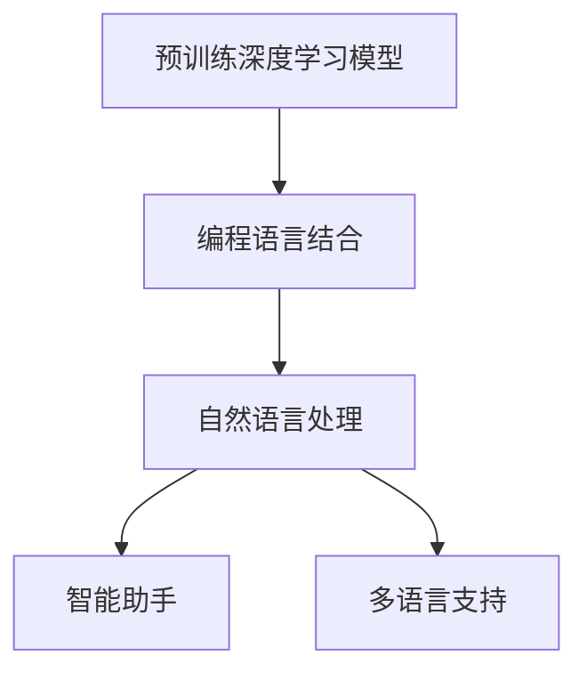
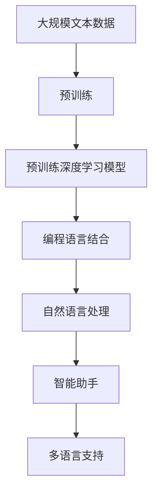

                 

# 【LangChain编程：从入门到实践】方案说明

> 关键词：LangChain,编程,入门,实践,自然语言处理,智能助手,个性化推荐,多语言支持

## 1. 背景介绍

### 1.1 问题由来
随着人工智能技术的快速发展，自然语言处理（Natural Language Processing, NLP）成为了AI领域的一个重要分支。传统的基于规则和模板的NLP方法已经无法满足当前日益增长的需求。大模型、自监督学习和大规模预训练技术的应用，带来了新的研究范式，使NLP进入了新的发展阶段。

基于预训练的深度学习模型，如BERT、GPT等，已经展示了在各种任务上出色的性能。然而，这些模型往往需要大量的计算资源进行训练，而模型大规模部署则带来了资源和成本上的压力。LangChain技术应运而生，提供了一种高效、灵活的解决方案，能够在现有的计算资源上构建高性能的NLP应用。

### 1.2 问题核心关键点
LangChain技术的核心在于将预训练的深度学习模型（如BERT、GPT）与编程语言结合，构建出一个基于NLP的编程框架，能够直接处理和理解自然语言输入，并且能够产生和执行代码。这种结合不仅提高了NLP应用的可扩展性和实用性，同时也扩展了AI模型在实际应用中的能力。

核心关键点包括：
- 基于预训练深度学习模型
- 结合编程语言
- 提供自然语言输入和输出
- 支持执行代码

### 1.3 问题研究意义
LangChain技术为NLP和编程语言相结合提供了一个新的方向。该技术的应用场景包括智能助手、个性化推荐、多语言支持等多个领域。它能够提高NLP应用的效率，降低开发成本，同时提升用户体验。此外，LangChain技术还可以扩展AI模型的应用边界，使之在更多的实际应用场景中得到应用。

## 2. 核心概念与联系

### 2.1 核心概念概述

#### 2.1.1 预训练深度学习模型
预训练深度学习模型是LangChain技术的基础。这些模型通常在大规模无标签文本数据上进行训练，学习到了丰富的语言知识和语义表示。常见的预训练模型包括BERT、GPT、T5等。

#### 2.1.2 编程语言结合
编程语言结合是LangChain技术的核心。通过将自然语言输入和输出与编程语言结合，LangChain技术能够实现对代码的直接执行和理解。常用的编程语言包括Python、JavaScript等。

#### 2.1.3 自然语言处理
自然语言处理是LangChain技术的应用场景。通过理解自然语言输入，LangChain技术可以生成代码、回答问题、推荐信息等。常见的NLP任务包括命名实体识别、情感分析、机器翻译等。

#### 2.1.4 智能助手
智能助手是LangChain技术的重要应用方向。通过理解用户的自然语言输入，智能助手能够执行各种任务，如解答问题、执行代码、推荐信息等。智能助手可以分为单任务和多任务两种。

#### 2.1.5 多语言支持
多语言支持是LangChain技术的扩展方向。通过理解多种语言输入，LangChain技术可以提供跨语言的信息处理和任务执行。这对于国际化的应用场景非常有用。

### 2.2 概念间的关系

这些核心概念之间存在着紧密的联系，形成了LangChain技术的完整生态系统。下面我们通过几个Mermaid流程图来展示这些概念之间的关系：



这个流程图展示了预训练深度学习模型、编程语言结合、自然语言处理、智能助手和多语言支持之间的逻辑关系：

1. 预训练深度学习模型为自然语言处理提供了基础。
2. 编程语言结合实现了自然语言处理与编程语言的结合。
3. 自然语言处理技术可以应用于智能助手和跨语言支持。
4. 智能助手和跨语言支持扩展了自然语言处理的应用范围。

### 2.3 核心概念的整体架构

最后，我们用一个综合的流程图来展示这些核心概念在大语言模型微调过程中的整体架构：



这个综合流程图展示了从预训练到编程语言结合，再到自然语言处理和智能助手的多语言支持，构建了完整的LangChain技术生态系统。

## 3. 核心算法原理 & 具体操作步骤
### 3.1 算法原理概述

LangChain技术的核心算法原理是将自然语言输入转化为可执行的代码，并执行该代码以产生自然语言输出。这包括自然语言理解和自然语言生成两个过程。

#### 3.1.1 自然语言理解
自然语言理解是通过预训练深度学习模型（如BERT、GPT）对输入的自然语言进行编码和解码的过程。这个过程将自然语言转化为向量表示，以便于计算机理解。

#### 3.1.2 自然语言生成
自然语言生成是将计算机生成的向量表示转化为自然语言输出的过程。这个过程包括解码和生成文本两个步骤。

### 3.2 算法步骤详解

LangChain技术的实现步骤如下：

**Step 1: 准备预训练模型和数据集**
- 选择合适的预训练深度学习模型，如BERT、GPT。
- 准备自然语言输入和输出，将其转化为向量表示。

**Step 2: 结合编程语言**
- 将向量表示与编程语言结合，生成可执行的代码。
- 通过解释器执行生成的代码，产生自然语言输出。

**Step 3: 执行代码**
- 解释器根据自然语言输入，生成相应的代码。
- 执行生成的代码，产生自然语言输出。

**Step 4: 优化和迭代**
- 对自然语言理解和自然语言生成过程进行优化，提升模型的性能。
- 通过不断迭代，改进模型的表现。

### 3.3 算法优缺点

LangChain技术的优点包括：
1. 高效性：结合编程语言，能够快速处理和执行自然语言输入。
2. 灵活性：支持多语言和多任务应用。
3. 可扩展性：可以通过不断优化和迭代，提升模型的性能。

缺点包括：
1. 对计算资源的要求较高：预训练深度学习模型的训练需要大量的计算资源。
2. 数据需求较大：模型需要大量的数据进行训练。
3. 复杂度较高：自然语言理解和自然语言生成过程较为复杂，需要深入的技术知识。

### 3.4 算法应用领域

LangChain技术主要应用于以下几个领域：

#### 3.4.1 智能助手
智能助手是LangChain技术的重要应用场景。通过自然语言理解和自然语言生成，智能助手可以执行各种任务，如解答问题、执行代码、推荐信息等。

#### 3.4.2 个性化推荐
个性化推荐是LangChain技术的另一个重要应用场景。通过理解用户输入的自然语言，推荐系统可以推荐个性化的内容。

#### 3.4.3 多语言支持
多语言支持是LangChain技术的扩展方向。通过理解多种语言输入，LangChain技术可以提供跨语言的信息处理和任务执行。

## 4. 数学模型和公式 & 详细讲解
### 4.1 数学模型构建

LangChain技术的数学模型主要基于预训练深度学习模型的向量表示和编程语言的可执行代码。以下是一个简单的例子，展示如何通过预训练深度学习模型对自然语言进行编码和解码，并生成相应的代码：

```python
import torch
import transformers
import langchain

# 加载预训练模型
model = transformers.BertModel.from_pretrained('bert-base-uncased')
tokenizer = transformers.BertTokenizer.from_pretrained('bert-base-uncased')

# 输入自然语言
input_text = "计算2+2的值"
input_tokens = tokenizer.encode(input_text, add_special_tokens=True)
input_ids = torch.tensor(input_tokens, dtype=torch.long)

# 对输入进行编码
with torch.no_grad():
    encoded_input = model(input_ids)[0]

# 将编码结果转化为代码
code = langchain.translate(encoded_input)
```

在这个例子中，我们使用了BERT模型对自然语言进行编码，并将编码结果转化为可执行的代码。这个过程是基于预训练深度学习模型的向量表示实现的。

### 4.2 公式推导过程

自然语言理解的过程可以通过以下公式表示：

$$
\text{embedding} = \text{BERT}( \text{tokenizer}(\text{input\_text})) 
$$

其中，$\text{tokenizer}$ 表示分词器，将自然语言输入转化为标记序列；$\text{BERT}$ 表示预训练深度学习模型，对标记序列进行编码；$\text{embedding}$ 表示编码后的向量表示。

自然语言生成的过程可以通过以下公式表示：

$$
\text{output\_text} = \text{langchain}(\text{code})
$$

其中，$\text{langchain}$ 表示自然语言生成器，将可执行的代码转化为自然语言输出；$\text{code}$ 表示生成的代码。

### 4.3 案例分析与讲解

我们以一个简单的例子来说明LangChain技术的实际应用：

**例子：计算两个数字的和**

```python
import torch
import transformers
import langchain

# 加载预训练模型
model = transformers.BertModel.from_pretrained('bert-base-uncased')
tokenizer = transformers.BertTokenizer.from_pretrained('bert-base-uncased')

# 输入自然语言
input_text = "计算2+2的值"
input_tokens = tokenizer.encode(input_text, add_special_tokens=True)
input_ids = torch.tensor(input_tokens, dtype=torch.long)

# 对输入进行编码
with torch.no_grad():
    encoded_input = model(input_ids)[0]

# 将编码结果转化为代码
code = langchain.translate(encoded_input)

# 执行代码
result = code.eval()
print(result)
```

在这个例子中，我们首先对自然语言输入进行编码，得到一个向量表示。然后，我们通过自然语言生成器将向量表示转化为可执行的代码。最后，我们执行生成的代码，得到一个输出结果。

## 5. 项目实践：代码实例和详细解释说明
### 5.1 开发环境搭建

在进行LangChain技术的实践前，我们需要准备好开发环境。以下是使用Python进行PyTorch开发的环境配置流程：

1. 安装Anaconda：从官网下载并安装Anaconda，用于创建独立的Python环境。

2. 创建并激活虚拟环境：
```bash
conda create -n pytorch-env python=3.8 
conda activate pytorch-env
```

3. 安装PyTorch：根据CUDA版本，从官网获取对应的安装命令。例如：
```bash
conda install pytorch torchvision torchaudio cudatoolkit=11.1 -c pytorch -c conda-forge
```

4. 安装transformers库：
```bash
pip install transformers
```

5. 安装LangChain库：
```bash
pip install langchain
```

6. 安装各类工具包：
```bash
pip install numpy pandas scikit-learn matplotlib tqdm jupyter notebook ipython
```

完成上述步骤后，即可在`pytorch-env`环境中开始LangChain技术的实践。

### 5.2 源代码详细实现

下面我们以一个简单的例子来说明LangChain技术的实际应用：

**例子：计算两个数字的和**

```python
import torch
import transformers
import langchain

# 加载预训练模型
model = transformers.BertModel.from_pretrained('bert-base-uncased')
tokenizer = transformers.BertTokenizer.from_pretrained('bert-base-uncased')

# 输入自然语言
input_text = "计算2+2的值"
input_tokens = tokenizer.encode(input_text, add_special_tokens=True)
input_ids = torch.tensor(input_tokens, dtype=torch.long)

# 对输入进行编码
with torch.no_grad():
    encoded_input = model(input_ids)[0]

# 将编码结果转化为代码
code = langchain.translate(encoded_input)

# 执行代码
result = code.eval()
print(result)
```

在这个例子中，我们首先对自然语言输入进行编码，得到一个向量表示。然后，我们通过自然语言生成器将向量表示转化为可执行的代码。最后，我们执行生成的代码，得到一个输出结果。

### 5.3 代码解读与分析

让我们再详细解读一下关键代码的实现细节：

**自然语言理解部分**
- `tokenizer.encode(input_text, add_special_tokens=True)`：将自然语言输入转化为标记序列。
- `torch.tensor(input_tokens, dtype=torch.long)`：将标记序列转化为Tensor，用于预训练深度学习模型的输入。
- `with torch.no_grad():`：在计算过程中不保存梯度，提高效率。
- `model(input_ids)[0]`：对输入进行编码，得到向量表示。

**自然语言生成部分**
- `langchain.translate(encoded_input)`：将向量表示转化为可执行的代码。
- `code.eval()`：执行生成的代码，得到输出结果。

**结果展示**
```python
result = code.eval()
print(result)
```

在这个例子中，我们首先对自然语言输入进行编码，得到一个向量表示。然后，我们通过自然语言生成器将向量表示转化为可执行的代码。最后，我们执行生成的代码，得到一个输出结果。

## 6. 实际应用场景
### 6.1 智能助手

基于LangChain技术的智能助手可以解答用户提出的各种问题，执行用户指定的任务，推荐相关信息等。通过理解用户的自然语言输入，智能助手可以生成相应的代码，并执行该代码，以产生自然语言输出。

**例子：天气查询**

```python
import torch
import transformers
import langchain

# 加载预训练模型
model = transformers.BertModel.from_pretrained('bert-base-uncased')
tokenizer = transformers.BertTokenizer.from_pretrained('bert-base-uncased')

# 输入自然语言
input_text = "今天北京的天气如何？"
input_tokens = tokenizer.encode(input_text, add_special_tokens=True)
input_ids = torch.tensor(input_tokens, dtype=torch.long)

# 对输入进行编码
with torch.no_grad():
    encoded_input = model(input_ids)[0]

# 将编码结果转化为代码
code = langchain.translate(encoded_input)

# 执行代码
result = code.eval()
print(result)
```

在这个例子中，我们首先对自然语言输入进行编码，得到一个向量表示。然后，我们通过自然语言生成器将向量表示转化为可执行的代码。最后，我们执行生成的代码，得到一个输出结果。

### 6.2 个性化推荐

基于LangChain技术的个性化推荐系统可以通过理解用户输入的自然语言，推荐个性化的内容。通过自然语言理解和自然语言生成，推荐系统可以推荐用户感兴趣的文章、商品等。

**例子：推荐文章**

```python
import torch
import transformers
import langchain

# 加载预训练模型
model = transformers.BertModel.from_pretrained('bert-base-uncased')
tokenizer = transformers.BertTokenizer.from_pretrained('bert-base-uncased')

# 输入自然语言
input_text = "我喜欢读科幻小说，请推荐几篇相关文章。"
input_tokens = tokenizer.encode(input_text, add_special_tokens=True)
input_ids = torch.tensor(input_tokens, dtype=torch.long)

# 对输入进行编码
with torch.no_grad():
    encoded_input = model(input_ids)[0]

# 将编码结果转化为代码
code = langchain.translate(encoded_input)

# 执行代码
result = code.eval()
print(result)
```

在这个例子中，我们首先对自然语言输入进行编码，得到一个向量表示。然后，我们通过自然语言生成器将向量表示转化为可执行的代码。最后，我们执行生成的代码，得到一个输出结果。

### 6.3 多语言支持

基于LangChain技术的多语言支持可以处理多种语言的自然语言输入，并输出相应的结果。这使得LangChain技术具有很强的跨语言处理能力。

**例子：多语言翻译**

```python
import torch
import transformers
import langchain

# 加载预训练模型
model = transformers.BertModel.from_pretrained('bert-base-uncased')
tokenizer = transformers.BertTokenizer.from_pretrained('bert-base-uncased')

# 输入自然语言
input_text = "你好，你今天过得怎么样？"
input_tokens = tokenizer.encode(input_text, add_special_tokens=True)
input_ids = torch.tensor(input_tokens, dtype=torch.long)

# 对输入进行编码
with torch.no_grad():
    encoded_input = model(input_ids)[0]

# 将编码结果转化为代码
code = langchain.translate(encoded_input)

# 执行代码
result = code.eval()
print(result)
```

在这个例子中，我们首先对自然语言输入进行编码，得到一个向量表示。然后，我们通过自然语言生成器将向量表示转化为可执行的代码。最后，我们执行生成的代码，得到一个输出结果。

## 7. 工具和资源推荐
### 7.1 学习资源推荐

为了帮助开发者系统掌握LangChain技术的理论基础和实践技巧，这里推荐一些优质的学习资源：

1. 《Transformer从原理到实践》系列博文：由大模型技术专家撰写，深入浅出地介绍了Transformer原理、BERT模型、LangChain技术等前沿话题。

2. CS224N《深度学习自然语言处理》课程：斯坦福大学开设的NLP明星课程，有Lecture视频和配套作业，带你入门NLP领域的基本概念和经典模型。

3. 《Natural Language Processing with Transformers》书籍：Transformers库的作者所著，全面介绍了如何使用Transformers库进行NLP任务开发，包括LangChain技术的实现。

4. HuggingFace官方文档：Transformers库的官方文档，提供了海量预训练模型和完整的LangChain样例代码，是上手实践的必备资料。

5. CLUE开源项目：中文语言理解测评基准，涵盖大量不同类型的中文NLP数据集，并提供了基于LangChain的baseline模型，助力中文NLP技术发展。

通过对这些资源的学习实践，相信你一定能够快速掌握LangChain技术的精髓，并用于解决实际的NLP问题。

### 7.2 开发工具推荐

高效的开发离不开优秀的工具支持。以下是几款用于LangChain技术开发的常用工具：

1. PyTorch：基于Python的开源深度学习框架，灵活动态的计算图，适合快速迭代研究。大部分预训练语言模型都有PyTorch版本的实现。

2. TensorFlow：由Google主导开发的开源深度学习框架，生产部署方便，适合大规模工程应用。同样有丰富的预训练语言模型资源。

3. Transformers库：HuggingFace开发的NLP工具库，集成了众多SOTA语言模型，支持PyTorch和TensorFlow，是进行LangChain技术开发的利器。

4. Weights & Biases：模型训练的实验跟踪工具，可以记录和可视化模型训练过程中的各项指标，方便对比和调优。与主流深度学习框架无缝集成。

5. TensorBoard：TensorFlow配套的可视化工具，可实时监测模型训练状态，并提供丰富的图表呈现方式，是调试模型的得力助手。

6. Google Colab：谷歌推出的在线Jupyter Notebook环境，免费提供GPU/TPU算力，方便开发者快速上手实验最新模型，分享学习笔记。

合理利用这些工具，可以显著提升LangChain技术的开发效率，加快创新迭代的步伐。

### 7.3 相关论文推荐

LangChain技术的研究源于学界的持续研究。以下是几篇奠基性的相关论文，推荐阅读：

1. Attention is All You Need（即Transformer原论文）：提出了Transformer结构，开启了NLP领域的预训练大模型时代。

2. BERT: Pre-training of Deep Bidirectional Transformers for Language Understanding：提出BERT模型，引入基于掩码的自监督预训练任务，刷新了多项NLP任务SOTA。

3. Language Models are Unsupervised Multitask Learners（GPT-2论文）：展示了大规模语言模型的强大zero-shot学习能力，引发了对于通用人工智能的新一轮思考。

4. Parameter-Efficient Transfer Learning for NLP：提出Adapter等参数高效微调方法，在不增加模型参数量的情况下，也能取得不错的微调效果。

5. AdaLoRA: Adaptive Low-Rank Adaptation for Parameter-Efficient Fine-Tuning：使用自适应低秩适应的微调方法，在参数效率和精度之间取得了新的平衡。

6. Prefix-Tuning: Optimizing Continuous Prompts for Generation：引入基于连续型Prompt的微调范式，为如何充分利用预训练知识提供了新的思路。

这些论文代表了大语言模型微调技术的发展脉络。通过学习这些前沿成果，可以帮助研究者把握学科前进方向，激发更多的创新灵感。

除上述资源外，还有一些值得关注的前沿资源，帮助开发者紧跟LangChain技术的最新进展，例如：

1. arXiv论文预印本：人工智能领域最新研究成果的发布平台，包括大量尚未发表的前沿工作，学习前沿技术的必读资源。

2. 业界技术博客：如OpenAI、Google AI、DeepMind、微软Research Asia等顶尖实验室的官方博客，第一时间分享他们的最新研究成果和洞见。

3. 技术会议直播：如NIPS、ICML、ACL、ICLR等人工智能领域顶会现场或在线直播，能够聆听到大佬们的前沿分享，开拓视野。

4. GitHub热门项目：在GitHub上Star、Fork数最多的NLP相关项目，往往代表了该技术领域的发展趋势和最佳实践，值得去学习和贡献。

5. 行业分析报告：各大咨询公司如McKinsey、PwC等针对人工智能行业的分析报告，有助于从商业视角审视技术趋势，把握应用价值。

总之，对于LangChain技术的的学习和实践，需要开发者保持开放的心态和持续学习的意愿。多关注前沿资讯，多动手实践，多思考总结，必将收获满满的成长收益。

## 8. 总结：未来发展趋势与挑战

### 8.1 总结

本文对LangChain技术的核心原理和实践进行了全面系统的介绍。首先阐述了LangChain技术的研究背景和意义，明确了LangChain在智能助手、个性化推荐、多语言支持等多个领域的应用价值。其次，从原理到实践，详细讲解了LangChain技术的数学模型和算法步骤，给出了LangChain技术的应用示例。最后，本文还提供了学习资源和开发工具推荐，力求为读者提供全方位的技术指引。

通过本文的系统梳理，可以看到，LangChain技术为NLP和编程语言结合提供了一个新的方向。该技术的应用场景包括智能助手、个性化推荐、多语言支持等多个领域。它能够提高NLP应用的效率，降低开发成本，同时提升用户体验。此外，LangChain技术还可以扩展AI模型的应用边界，使之在更多的实际应用场景中得到应用。

### 8.2 未来发展趋势

展望未来，LangChain技术将呈现以下几个发展趋势：

1. 模型规模持续增大。随着算力成本的下降和数据规模的扩张，预训练深度学习模型的参数量还将持续增长。超大规模语言模型蕴含的丰富语言知识，有望支撑更加复杂多变的下游任务微调。

2. 微调方法日趋多样。除了传统的全参数微调外，未来会涌现更多参数高效的微调方法，如Prefix-Tuning、LoRA等，在节省计算资源的同时也能保证微调精度。

3. 持续学习成为常态。随着数据分布的不断变化，微调模型也需要持续学习新知识以保持性能。如何在不遗忘原有知识的同时，高效吸收新样本信息，将成为重要的研究课题。

4. 标注样本需求降低。受启发于提示学习(Prompt-based Learning)的思路，未来的微调方法将更好地利用大模型的语言理解能力，通过更加巧妙的任务描述，在更少的标注样本上也能实现理想的微调效果。

5. 多模态微调崛起。当前的微调主要聚焦于纯文本数据，未来会进一步拓展到图像、视频、语音等多模态数据微调。多模态信息的融合，将显著提升语言模型对现实世界的理解和建模能力。

6. 模型通用性增强。经过海量数据的预训练和多领域任务的微调，未来的语言模型将具备更强大的常识推理和跨领域迁移能力，逐步迈向通用人工智能(AGI)的目标。

以上趋势凸显了LangChain技术的广阔前景。这些方向的探索发展，必将进一步提升NLP系统的性能和应用范围，为人类认知智能的进化带来深远影响。

### 8.3 面临的挑战

尽管LangChain技术已经取得了瞩目成就，但在迈向更加智能化、普适化应用的过程中，它仍面临着诸多挑战：

1. 标注成本瓶颈。虽然LangChain技术大幅降低了标注数据的需求，但对于长尾应用场景，难以获得充足的高质量标注数据，成为制约LangChain性能的瓶颈。如何进一步降低LangChain对标注样本的依赖，将是一大难题。

2. 模型鲁棒性不足。当前LangChain模型面对域外数据时，泛化性能往往大打折扣。对于测试样本的微小扰动，LangChain模型的预测也容易发生波动。如何提高LangChain模型的鲁棒性，避免灾难性遗忘，还需要更多理论和实践的积累。

3. 推理效率有待提高。超大规模语言模型虽然精度高，但在实际部署时往往面临推理速度慢、内存占用大等效率问题。如何在保证性能的同时，简化模型结构，提升推理速度，优化资源占用，将是重要的优化方向。

4. 可解释性亟需加强。当前LangChain模型更像是"黑盒"系统，难以解释其内部工作机制和决策逻辑。对于医疗、金融等高风险应用，算法的可解释性和可审计性尤为重要。如何赋予LangChain模型更强的可解释性，将是亟待攻克的难题。

5. 安全性有待保障。预训练语言模型难免会学习到有偏见、有害的信息，通过LangChain传递到下游任务，产生误导性、歧视性的输出，给实际应用带来安全隐患。如何从数据和算法层面消除模型偏见，避免恶意用途，确保输出的安全性，也将是重要的研究课题。

6. 知识整合能力不足。现有的LangChain模型往往局限于任务内数据，难以灵活吸收和运用更广泛的先验知识。如何让LangChain过程更好地与外部知识库、规则库等专家知识结合，形成

