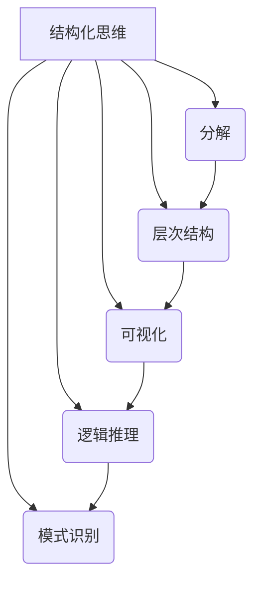
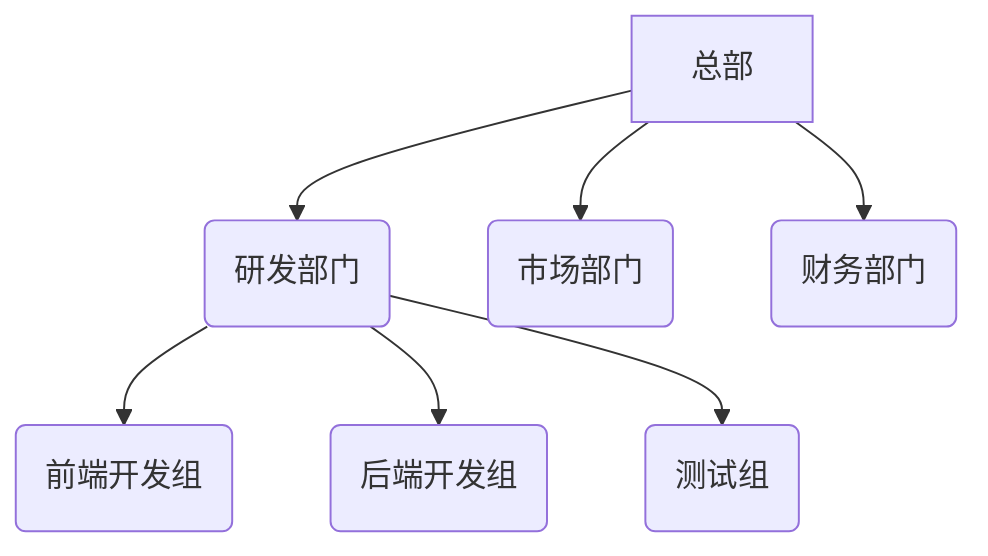

# 结构化思维：理解世界的钥匙

## 1. 背景介绍

### 1.1 问题的由来

在这个信息爆炸的时代，我们每天都会接收大量的信息和数据。然而,如何高效地处理和理解这些信息,并将其转化为有价值的知识和见解,成为了一个巨大的挑战。传统的思维方式往往是线性的、片段化的,难以很好地把握信息之间的联系和结构,从而导致了认知上的困难。

### 1.2 研究现状

为了应对这一挑战,结构化思维(Structured Thinking)作为一种系统化的思考方法应运而生。结构化思维强调将复杂的问题或信息分解为清晰的组成部分,并探索它们之间的关系和层次结构。这种方法有助于我们更好地理解和组织信息,从而提高思考和决策的效率。

目前,结构化思维已经被广泛应用于各个领域,包括管理、教育、科学研究等。许多著名的思想家和学者,如爱德华·德博诺(Edward de Bono)、巴伯拉·明托(Barbara Minto)等,都对结构化思维理论做出了重要贡献。

### 1.3 研究意义

掌握结构化思维技能对于个人和组织都有着重要意义:

- 对个人而言,结构化思维有助于提高学习效率、增强理解能力、培养创新思维,从而更好地应对复杂的挑战。
- 对组织而言,结构化思维有助于提高团队协作效率、优化决策过程、促进有效沟通,从而增强组织的竞争力。

因此,研究和掌握结构化思维方法,对于提高个人和组织的综合能力都具有重要意义。

### 1.4 本文结构

本文将全面介绍结构化思维的核心概念、原理和方法,并探讨其在实际应用中的价值。文章将分为以下几个部分:

1. 背景介绍
2. 核心概念与联系
3. 核心算法原理与具体操作步骤
4. 数学模型和公式详细讲解与举例说明
5. 项目实践:代码实例和详细解释说明
6. 实际应用场景
7. 工具和资源推荐
8. 总结:未来发展趋势与挑战
9. 附录:常见问题与解答

## 2. 核心概念与联系

结构化思维包含了以下几个核心概念:

1. **分解(Decomposition)**: 将复杂的问题或信息拆分为更小、更易管理的组成部分。
2. **层次结构(Hierarchy)**: 根据组成部分之间的关系,建立清晰的层次结构。
3. **可视化(Visualization)**: 使用图表、流程图等可视化工具,直观地展现信息的结构和关系。
4. **逻辑推理(Logical Reasoning)**: 基于已知信息,运用逻辑推理的方法得出新的结论或见解。
5. **模式识别(Pattern Recognition)**: 发现信息中的规律性和模式,从而更好地理解和记忆信息。

这些概念相互关联、相互作用,共同构成了结构化思维的核心框架。例如,分解和层次结构有助于将复杂问题简化,可视化则有助于更直观地展现信息结构,而逻辑推理和模式识别则有助于从信息中获取新的见解和规律。

## 3. 核心算法原理与具体操作步骤

### 3.1 算法原理概述

结构化思维的核心算法原理可以概括为以下几个步骤:

1. **问题识别**: 明确需要解决的问题或需要理解的信息。
2. **信息收集**: 收集与问题相关的所有信息和数据。
3. **分解与组织**: 将收集到的信息分解为更小的组成部分,并根据它们之间的关系组织成层次结构。
4. **可视化表达**: 使用图表、流程图等可视化工具,直观地展现信息的结构和关系。
5. **逻辑推理**: 基于已有的信息和结构,运用逻辑推理的方法得出新的结论或见解。
6. **模式识别**: 发现信息中的规律性和模式,从而更好地理解和记忆信息。
7. **决策与行动**: 根据得出的结论或见解,制定相应的决策和行动计划。

这些步骤相互关联、循环迭代,形成了一个完整的结构化思维过程。

### 3.2 算法步骤详解

1. **问题识别**

明确需要解决的问题或需要理解的信息是结构化思维的起点。在这一步骤中,我们需要准确地定义问题的范围和目标,避免问题陈述过于笼统或模糊。

2. **信息收集**

收集与问题相关的所有信息和数据是下一步骤的基础。在这一步骤中,我们需要广泛搜集各种来源的信息,包括书籍、文献、数据库、专家意见等,确保信息的全面性和准确性。

3. **分解与组织**

将收集到的信息分解为更小的组成部分,并根据它们之间的关系组织成层次结构,是结构化思维的核心步骤。在这一步骤中,我们需要运用分析和抽象的能力,将复杂的信息简化为易于理解的结构。

4. **可视化表达**

使用图表、流程图等可视化工具,直观地展现信息的结构和关系,有助于我们更好地理解和交流信息。在这一步骤中,我们需要选择合适的可视化工具,并熟练运用它们。

5. **逻辑推理**

基于已有的信息和结构,运用逻辑推理的方法得出新的结论或见解,是结构化思维的关键环节。在这一步骤中,我们需要运用批判性思维和创新思维,发现信息之间的联系和规律,从而获取新的知识和见解。

6. **模式识别**

发现信息中的规律性和模式,从而更好地理解和记忆信息,是结构化思维的重要补充。在这一步骤中,我们需要运用观察力和抽象能力,发现信息中隐藏的模式和规律。

7. **决策与行动**

根据得出的结论或见解,制定相应的决策和行动计划,是结构化思维的最终目标。在这一步骤中,我们需要运用决策能力和执行力,将思维转化为实际的行动。

### 3.3 算法优缺点

结构化思维算法的优点包括:

- 有助于简化复杂问题,提高思考效率。
- 通过可视化工具,更直观地展现信息结构和关系。
- 促进逻辑推理和创新思维,获取新的见解和知识。
- 有利于团队协作和信息共享,提高沟通效率。

然而,结构化思维算法也存在一些缺点和局限性:

- 过度强调结构和逻辑,可能会忽视信息的细节和情境。
- 对于一些难以量化或结构化的问题,效果可能不佳。
- 需要一定的训练和实践,才能熟练掌握和运用。
- 过于依赖可视化工具,可能会限制思维的灵活性。

因此,在实际应用中,我们需要权衡结构化思维的优缺点,并根据具体情况选择合适的思维方式。

### 3.4 算法应用领域

结构化思维算法可以广泛应用于各个领域,包括但不限于:

- **管理决策**: 帮助管理者更好地理解复杂的组织运营情况,制定科学的决策。
- **产品设计**: 通过结构化思维,可以更好地捕捉用户需求,优化产品设计。
- **教育培训**: 结构化思维有助于提高学习效率,培养学生的逻辑思维能力。
- **科学研究**: 在科学研究中,结构化思维可以帮助研究人员发现新的规律和理论。
- **信息管理**: 结构化思维有助于组织和管理大量的信息和数据。
- **问题解决**: 面对复杂的问题时,结构化思维可以提供有效的解决方案。

总的来说,结构化思维算法可以应用于任何需要处理和理解复杂信息的领域,帮助我们更高效地思考和决策。

## 4. 数学模型和公式详细讲解与举例说明

### 4.1 数学模型构建

在结构化思维中,我们可以使用数学模型来描述和分析信息的结构和关系。一种常用的数学模型是图论(Graph Theory)。

在图论中,我们可以将信息的组成部分表示为节点(Node),而组成部分之间的关系表示为边(Edge)。通过构建这样的图形结构,我们可以更清晰地展现信息的层次和联系。

例如,我们可以将一个组织的部门结构用树形图(Tree)来表示,其中每个节点代表一个部门,边代表部门之间的从属关系。

在上图中,我们可以清晰地看到组织的层次结构,以及各个部门之间的关系。这种可视化表达有助于我们更好地理解和管理组织结构。

### 4.2 公式推导过程

在结构化思维中,我们还可以使用数学公式来描述和分析信息的特性和规律。例如,在信息论(Information Theory)中,我们可以使用香农熵(Shannon Entropy)来衡量信息的不确定性。

香农熵的公式如下:

$$H(X) = -\sum_{i=1}^{n}p(x_i)\log_2p(x_i)$$

其中:
- $X$ 是一个离散随机变量
- $n$ 是随机变量 $X$ 的可能取值个数
- $p(x_i)$ 是随机变量 $X$ 取值 $x_i$ 的概率

香农熵的值越大,表示信息的不确定性越高,反之则不确定性越低。

我们可以利用香农熵来分析和优化信息的编码和传输,从而提高信息处理的效率。例如,在数据压缩领域,我们可以使用熵编码(Entropy Coding)算法,根据数据的概率分布,为出现概率较高的数据分配更短的编码,从而实现更高的压缩率。

### 4.3 案例分析与讲解

让我们通过一个具体的案例来进一步理解数学模型在结构化思维中的应用。

假设我们需要设计一个社交网络应用程序,其中用户可以发布状态更新,并与其他用户互动。我们可以使用图论来建模这个系统。

在这个模型中,每个用户都可以表示为一个节点,而用户之间的关系(如好友关系)可以表示为边。当一个用户发布状态更新时,该信息将沿着边传播到与该用户相连的其他节点(即该用户的好友)。

我们可以使用一些图论算法来分析和优化这个系统,例如:

- **最短路径算法(Shortest Path Algorithm)**: 用于确定两个用户之间的最短关系路径,从而优化信息传播效率。
- **中心性算法(Centrality Algorithm)**: 用于识别网络中的重要节点(如影响力用户),从而更好地传播信息。
- **社区发现算法(Community Detection Algorithm)**: 用于发现网络中的用户社区,从而提供更精准的内容推荐和广告投放。

通过将图论模型与结构化思维相结合,我们可以更好地理解和优化社交网络应用程序的设计和运行。

### 4.4 常见问题解答

1. **为什么要使用数学模型?**

使用数学模型可以帮助我们更准确、更精确地描述和分析信息的结构和规律。数学模型提供了一种形式化的语言,使我们能够更好地理解和操作复杂的信息系统。

2. **如何选择合适的数学模型?**

选择合适的数学模型需要根据具体的问题和信息特征。一般来说,