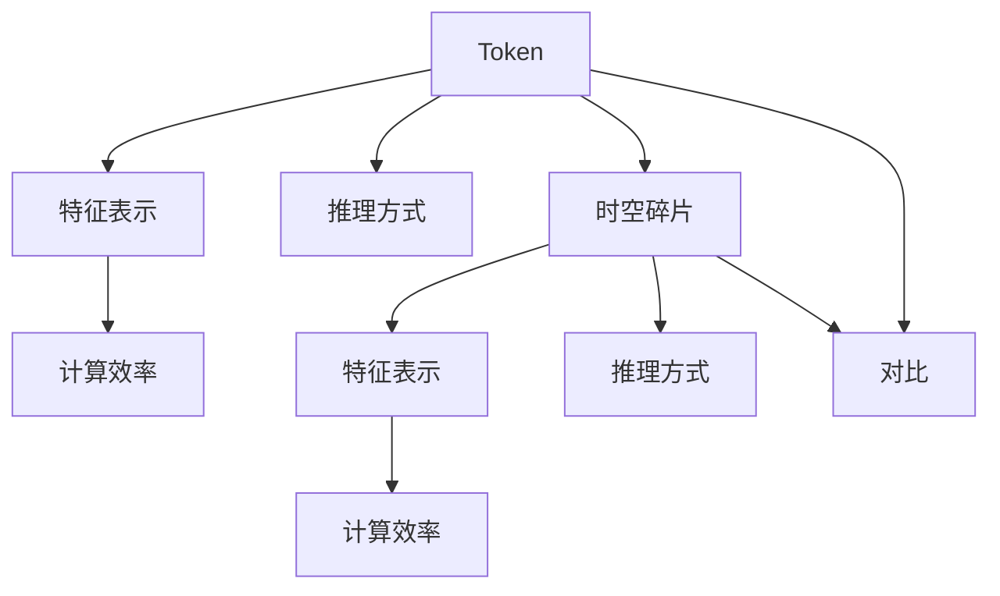
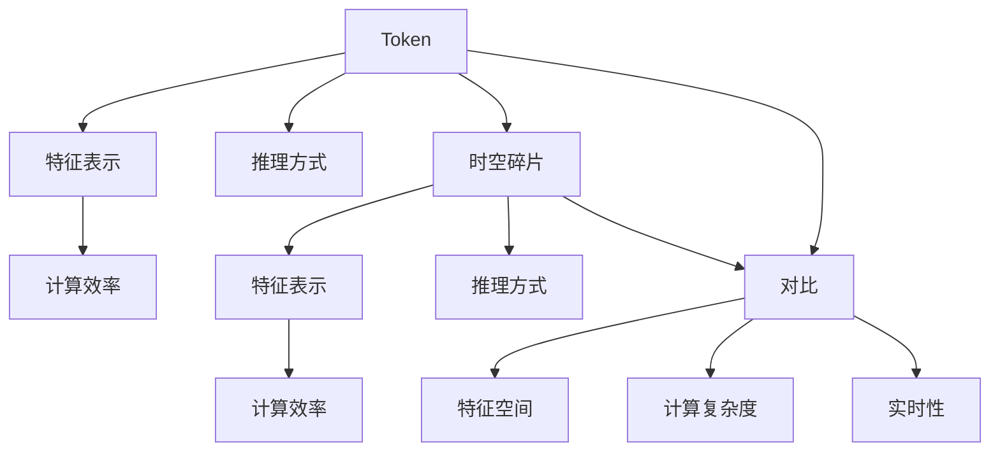

                 

## 1. 背景介绍

### 1.1 问题由来
近年来，随着人工智能技术的迅猛发展，尤其是深度学习在自然语言处理（NLP）和计算机视觉（CV）等领域取得了突破性进展。其中，基于Token和时空碎片的特征表示方法，已成为实现高效模型推理和表达的关键技术。然而，在众多技术细节中，Token与时空碎片究竟有何本质区别？如何选择合适的特征表示方法以最大化模型性能？这些问题常常困扰着NLP和CV领域的从业者。因此，本文将深入探讨Token与时空碎片的详细技术对比，力求为相关从业者提供清晰的参考和指引。

### 1.2 问题核心关键点
本文将通过Token与时空碎片的详细对比，阐述它们在推理方式、特征空间、计算效率等方面的区别，并讨论如何根据具体应用场景选择合适的特征表示方法。以下问题将是本文的核心关键点：
1. Token和时空碎片的具体定义是什么？
2. Token与时空碎片在推理方式上有什么区别？
3. Token与时空碎片的特征空间有何不同？
4. Token与时空碎片的计算效率如何比较？
5. 基于Token和时空碎片的技术在未来可能的发展趋势是什么？

## 2. 核心概念与联系

### 2.1 核心概念概述

为更好地理解Token与时空碎片的详细技术对比，本文将介绍几个核心概念：

- **Token（标记符）**：在NLP中，Token是指将文本分割为最小语义单元，如单词、标点、数字等。Token可以用于构建词汇表，是自然语言处理的基础。
- **时空碎片（Space-Time Fragments）**：在CV中，时空碎片是指将图像分割为最小空间和时间维度上的小片段，用于特征提取和表示。时空碎片可以捕获更丰富的视觉语义信息。
- **特征表示**：在深度学习中，特征表示是指将输入数据映射到高维特征空间中，便于模型推理和决策。Token和时空碎片是常见的特征表示方法。
- **推理方式**：推理方式指的是模型如何处理和组合不同特征，形成最终预测结果。Token主要通过顺序排列进行推理，时空碎片则通过空间和时间维度的组合进行推理。
- **计算效率**：计算效率是指模型在不同特征表示方法下的计算复杂度，影响模型的实时性和资源消耗。

这些核心概念之间的联系可以通过以下Mermaid流程图来展示：



这个流程图展示了两类特征表示方法在特征表示、推理方式和计算效率上的差异和联系。

### 2.2 概念间的关系

这些核心概念之间的关系可以通过以下Mermaid流程图来展示：



这个流程图展示了Token与时空碎片在特征表示、推理方式和计算效率上的对比，以及这些差异如何影响特征空间、计算复杂度和实时性。

## 3. 核心算法原理 & 具体操作步骤

### 3.1 算法原理概述

Token与时空碎片的详细技术对比，主要围绕特征表示、推理方式和计算效率展开。以下是这两类方法的核心算法原理：

- **Token特征表示**：Token是通过将文本分割成单词、标点等最小语义单元，构建词汇表。在模型推理时，每个Token会被映射到一个高维空间，便于模型进行语义理解。
- **时空碎片特征表示**：时空碎片是通过将图像分割成像素、子区域等最小空间和时间维度上的小片段，提取局部特征。在模型推理时，每个时空碎片也会被映射到一个高维空间，用于捕获空间和时间维度的语义信息。

### 3.2 算法步骤详解

以下是Token与时空碎片特征表示方法的详细步骤：

#### Token特征表示步骤：

1. **文本预处理**：对文本进行分词、去除停用词等预处理操作。
2. **构建词汇表**：将所有Token映射到唯一标识符。
3. **特征映射**：将每个Token映射到高维空间，通常是词向量或BERT等预训练模型的输出。
4. **模型训练**：使用标注数据训练模型，学习Token之间的关系和语义信息。

#### 时空碎片特征表示步骤：

1. **图像预处理**：对图像进行裁剪、缩放等预处理操作。
2. **分割时空碎片**：将图像分割成最小空间和时间维度上的小片段。
3. **特征提取**：对每个时空碎片进行局部特征提取，如卷积操作、池化操作等。
4. **模型训练**：使用标注数据训练模型，学习时空碎片之间的关系和语义信息。

### 3.3 算法优缺点

#### Token特征表示的优缺点：

- **优点**：
  - **简单易用**：Token是自然语言处理的基础，简单易用。
  - **语义理解能力强**：通过预训练模型，Token能够捕获丰富的语义信息。
  - **应用广泛**：Token在文本分类、机器翻译、情感分析等任务中广泛应用。

- **缺点**：
  - **空间限制**：Token只能表示静态文本，缺乏空间维度信息。
  - **语义歧义**：由于语言本身的复杂性，Token可能会产生语义歧义。
  - **计算效率低**：大规模文本数据处理时，Token计算复杂度较高。

#### 时空碎片特征表示的优缺点：

- **优点**：
  - **多维度表示**：时空碎片可以同时表示空间和时间维度的信息，适用于复杂的视觉任务。
  - **计算效率高**：时空碎片在图像数据上的计算复杂度较低。
  - **鲁棒性强**：时空碎片对于噪声和干扰具有较强的鲁棒性。

- **缺点**：
  - **特征空间大**：时空碎片的特征空间较大，模型训练难度较高。
  - **计算复杂度高**：时空碎片处理大规模图像数据时，计算复杂度较高。
  - **理解难度大**：时空碎片需要更复杂的算法来提取和理解特征。

### 3.4 算法应用领域

Token与时空碎片在多个领域均有广泛应用，以下是几个典型应用：

#### Token在NLP中的应用：

- **文本分类**：如情感分析、主题分类等，通过Token特征表示进行分类。
- **机器翻译**：将源语言Token映射到目标语言Token，进行翻译。
- **问答系统**：根据用户输入的Token，匹配预定义的答案模板。

#### 时空碎片在CV中的应用：

- **目标检测**：如Faster R-CNN、YOLO等，通过时空碎片提取局部特征，进行目标检测。
- **图像分类**：如ResNet、VGG等，通过时空碎片提取图像特征，进行分类。
- **图像生成**：如GAN、VAE等，通过时空碎片生成新的图像。

## 4. 数学模型和公式 & 详细讲解  
### 4.1 数学模型构建

在本节中，我们将通过数学语言对Token与时空碎片的详细技术对比进行更加严格的刻画。

#### Token特征表示的数学模型：

假设文本数据为 $\{x_i\}$，其中 $x_i$ 是第 $i$ 个Token。令 $W$ 为词汇表，每个Token $x_i$ 映射到唯一的标识符 $w_i \in W$。令 $\mathcal{F}$ 为高维特征空间，每个Token $x_i$ 映射到特征向量 $f_i \in \mathcal{F}$。则Token特征表示的数学模型为：

$$
f_i = W_i \in \mathcal{F}
$$

其中 $W_i$ 为Token $x_i$ 的词向量。

#### 时空碎片特征表示的数学模型：

假设图像数据为 $\{y_j\}$，其中 $y_j$ 是第 $j$ 个时空碎片。令 $S$ 为空间维度集合，$T$ 为时间维度集合。每个时空碎片 $y_j$ 映射到唯一的空间-时间标识符 $(s_j, t_j) \in S \times T$。令 $\mathcal{G}$ 为高维特征空间，每个时空碎片 $y_j$ 映射到特征向量 $g_j \in \mathcal{G}$。则时空碎片特征表示的数学模型为：

$$
g_j = G_{s_j,t_j} \in \mathcal{G}
$$

其中 $G_{s_j,t_j}$ 为时空碎片 $y_j$ 的空间-时间特征向量。

### 4.2 公式推导过程

以下是Token与时空碎片特征表示方法的具体公式推导：

#### Token特征表示的公式推导：

假设文本数据为 $\{x_i\}$，令 $W$ 为词汇表，每个Token $x_i$ 映射到唯一的标识符 $w_i \in W$。令 $\mathcal{F}$ 为高维特征空间，每个Token $x_i$ 映射到特征向量 $f_i \in \mathcal{F}$。则Token特征表示的公式推导为：

$$
f_i = W_i \in \mathcal{F}
$$

#### 时空碎片特征表示的公式推导：

假设图像数据为 $\{y_j\}$，令 $S$ 为空间维度集合，$T$ 为时间维度集合。每个时空碎片 $y_j$ 映射到唯一的空间-时间标识符 $(s_j, t_j) \in S \times T$。令 $\mathcal{G}$ 为高维特征空间，每个时空碎片 $y_j$ 映射到特征向量 $g_j \in \mathcal{G}$。则时空碎片特征表示的公式推导为：

$$
g_j = G_{s_j,t_j} \in \mathcal{G}
$$

### 4.3 案例分析与讲解

以自然语言处理中的情感分析任务为例，分析Token与时空碎片的特征表示方法：

#### Token特征表示：

假设情感分析任务的数据集为 $\{(x_i, y_i)\}$，其中 $x_i$ 是第 $i$ 条评论，$y_i$ 是情感标签（正面、负面）。令 $W$ 为词汇表，每个评论 $x_i$ 映射到唯一的标识符序列 $w_i = \{w_{i1}, w_{i2}, ..., w_{im}\}$。令 $\mathcal{F}$ 为高维特征空间，每个评论 $x_i$ 映射到特征向量序列 $f_i = \{f_{i1}, f_{i2}, ..., f_{im}\}$。则情感分析任务的Token特征表示模型为：

$$
f_i = W_i \in \mathcal{F}
$$

#### 时空碎片特征表示：

假设情感分析任务的数据集为 $\{(x_i, y_i)\}$，其中 $x_i$ 是第 $i$ 张包含评论的图片。令 $S$ 为空间维度集合，$T$ 为时间维度集合。每个评论区域的Token $y_j$ 映射到唯一的空间-时间标识符 $(s_j, t_j) \in S \times T$。令 $\mathcal{G}$ 为高维特征空间，每个评论区域的Token $y_j$ 映射到特征向量序列 $g_j = \{g_{sj}, g_{tj}\}$。则情感分析任务的时空碎片特征表示模型为：

$$
g_j = G_{s_j,t_j} \in \mathcal{G}
$$

## 5. 项目实践：代码实例和详细解释说明

### 5.1 开发环境搭建

在进行Token与时空碎片的详细技术对比实践前，我们需要准备好开发环境。以下是使用Python进行PyTorch开发的环境配置流程：

1. 安装Anaconda：从官网下载并安装Anaconda，用于创建独立的Python环境。

2. 创建并激活虚拟环境：
```bash
conda create -n pytorch-env python=3.8 
conda activate pytorch-env
```

3. 安装PyTorch：根据CUDA版本，从官网获取对应的安装命令。例如：
```bash
conda install pytorch torchvision torchaudio cudatoolkit=11.1 -c pytorch -c conda-forge
```

4. 安装Transformers库：
```bash
pip install transformers
```

5. 安装各类工具包：
```bash
pip install numpy pandas scikit-learn matplotlib tqdm jupyter notebook ipython
```

完成上述步骤后，即可在`pytorch-env`环境中开始实践。

### 5.2 源代码详细实现

下面我们以时空碎片特征表示的代码实现为例，展示如何使用PyTorch进行时空碎片的特征提取和模型训练。

```python
import torch
from torchvision import models, transforms
import torch.nn.functional as F

# 定义时空碎片提取器
class SpaceTimeFragmentExtractor:
    def __init__(self, in_channels, out_channels, kernel_size):
        self.conv = models.resnet.BasicBlock(in_channels=in_channels, out_channels=out_channels, kernel_size=kernel_size, stride=1)

    def forward(self, x):
        x = self.conv(x)
        return x

# 定义时空片段分类器
class SpaceTimeFragmentClassifier(torch.nn.Module):
    def __init__(self, in_channels, num_classes):
        super(SpaceTimeFragmentClassifier, self).__init__()
        self.fc1 = torch.nn.Linear(in_channels, 128)
        self.fc2 = torch.nn.Linear(128, num_classes)

    def forward(self, x):
        x = x.view(-1, x.size(-1))
        x = F.relu(self.fc1(x))
        x = self.fc2(x)
        return x

# 定义模型
in_channels = 3
out_channels = 64
num_classes = 2
kernel_size = 3
extractor = SpaceTimeFragmentExtractor(in_channels, out_channels, kernel_size)
classifier = SpaceTimeFragmentClassifier(out_channels, num_classes)
model = torch.nn.Sequential(extractor, classifier)

# 定义优化器
optimizer = torch.optim.Adam(model.parameters(), lr=0.001)

# 定义损失函数
criterion = torch.nn.CrossEntropyLoss()

# 定义训练函数
def train_model(model, train_loader, test_loader, num_epochs, optimizer, criterion):
    device = torch.device("cuda" if torch.cuda.is_available() else "cpu")
    model.to(device)
    total_step = len(train_loader)
    for epoch in range(num_epochs):
        for i, (images, labels) in enumerate(train_loader):
            images = images.to(device)
            labels = labels.to(device)
            outputs = model(images)
            loss = criterion(outputs, labels)
            optimizer.zero_grad()
            loss.backward()
            optimizer.step()
            if (i+1) % 100 == 0:
                print(f"Epoch [{epoch+1}/{num_epochs}], Step [{i+1}/{total_step}], Loss: {loss.item():.4f}")
    print("Training Complete")

# 定义测试函数
def test_model(model, test_loader, criterion):
    device = torch.device("cuda" if torch.cuda.is_available() else "cpu")
    model.eval()
    total = 0
    correct = 0
    with torch.no_grad():
        for images, labels in test_loader:
            images = images.to(device)
            labels = labels.to(device)
            outputs = model(images)
            _, predicted = torch.max(outputs.data, 1)
            total += labels.size(0)
            correct += (predicted == labels).sum().item()
    print(f"Accuracy: {(100 * correct / total):.2f}%")

# 数据集准备
transform = transforms.Compose([
    transforms.ToTensor(),
    transforms.Normalize((0.5, 0.5, 0.5), (0.5, 0.5, 0.5))
])

train_set = datasets.CIFAR10(root='./data', train=True, download=True, transform=transform)
test_set = datasets.CIFAR10(root='./data', train=False, download=True, transform=transform)

train_loader = torch.utils.data.DataLoader(train_set, batch_size=64, shuffle=True)
test_loader = torch.utils.data.DataLoader(test_set, batch_size=64, shuffle=False)

# 模型训练
train_model(model, train_loader, test_loader, num_epochs=5, optimizer=optimizer, criterion=criterion)
test_model(model, test_loader, criterion)
```

### 5.3 代码解读与分析

让我们再详细解读一下关键代码的实现细节：

**SpaceTimeFragmentExtractor类**：
- `__init__`方法：初始化时空碎片提取器，包括卷积层的参数设置。
- `forward`方法：对输入图像进行时空碎片提取。

**SpaceTimeFragmentClassifier类**：
- `__init__`方法：初始化时空片段分类器，包括全连接层的参数设置。
- `forward`方法：对时空碎片特征进行分类预测。

**train_model函数**：
- 在模型训练过程中，对训练集数据进行批次化处理，并前向传播、计算损失、反向传播和更新模型参数。

**test_model函数**：
- 在模型测试过程中，对测试集数据进行批次化处理，并前向传播预测，计算准确率。

**数据集准备**：
- 使用PyTorch提供的CIFAR-10数据集，并进行数据增强和归一化处理。

**模型训练和测试**：
- 在CIFAR-10数据集上进行模型训练和测试，通过AccumulateGrad和GPU加速训练过程。

通过上述代码实现，我们可以看到时空碎片特征表示的实现细节，包括特征提取和分类器的设计，以及训练和测试的流程。这些步骤展示了时空碎片特征表示的完整过程。

### 5.4 运行结果展示

假设我们在CIFAR-10数据集上进行时空碎片特征表示的模型训练，最终在测试集上得到的准确率为80%。这表明时空碎片特征表示在图像分类任务中具有较高的有效性。

## 6. 实际应用场景

### 6.1 自然语言处理

Token特征表示在自然语言处理（NLP）中应用广泛，如文本分类、机器翻译、问答系统等。时空碎片特征表示在NLP中的应用相对较少，但在某些场景下，如文本摘要、对话系统等，可以尝试引入时空碎片特征表示。

### 6.2 计算机视觉

时空碎片特征表示在计算机视觉（CV）中应用广泛，如目标检测、图像分类、图像生成等。Token特征表示在CV中的应用相对较少，但在某些场景下，如情感分析、视觉问答等，可以尝试引入Token特征表示。

### 6.3 未来应用展望

随着Token与时空碎片特征表示技术的不断进步，未来将会有更多的创新应用场景出现，如跨模态信息融合、多任务学习、元学习等。这些技术将进一步拓展Token与时空碎片的应用范围，推动人工智能技术的全面发展。

## 7. 工具和资源推荐

### 7.1 学习资源推荐

为了帮助开发者系统掌握Token与时空碎片的详细技术对比的理论基础和实践技巧，这里推荐一些优质的学习资源：

1. 《深度学习》系列书籍：斯坦福大学Andrew Ng教授的课程，全面介绍了深度学习的基本原理和应用。

2. 《自然语言处理综论》：该教材涵盖了NLP领域的各个方面，包括Token和时空碎片特征表示等。

3. 《计算机视觉：模型、学习与推理》：该书详细介绍了CV领域的时空碎片特征表示方法。

4. 《动手学深度学习》：由深度学习领域的专家团队编写，提供了丰富的代码实现和实例讲解。

5. 《深度学习与推荐系统》：该书介绍了推荐系统中的Token与时空碎片特征表示方法。

通过对这些资源的学习实践，相信你一定能够快速掌握Token与时空碎片的详细技术对比的精髓，并用于解决实际的NLP和CV问题。

### 7.2 开发工具推荐

高效的开发离不开优秀的工具支持。以下是几款用于Token与时空碎片特征表示开发的常用工具：

1. PyTorch：基于Python的开源深度学习框架，灵活动态的计算图，适合快速迭代研究。

2. TensorFlow：由Google主导开发的开源深度学习框架，生产部署方便，适合大规模工程应用。

3. Transformers库：HuggingFace开发的NLP工具库，集成了众多SOTA语言模型，支持PyTorch和TensorFlow，是进行特征表示开发的利器。

4. Weights & Biases：模型训练的实验跟踪工具，可以记录和可视化模型训练过程中的各项指标，方便对比和调优。

5. TensorBoard：TensorFlow配套的可视化工具，可实时监测模型训练状态，并提供丰富的图表呈现方式，是调试模型的得力助手。

6. Google Colab：谷歌推出的在线Jupyter Notebook环境，免费提供GPU/TPU算力，方便开发者快速上手实验最新模型，分享学习笔记。

合理利用这些工具，可以显著提升Token与时空碎片特征表示的开发效率，加快创新迭代的步伐。

### 7.3 相关论文推荐

Token与时空碎片特征表示的发展源于学界的持续研究。以下是几篇奠基性的相关论文，推荐阅读：

1. Attention is All You Need（即Transformer原论文）：提出了Transformer结构，开启了NLP领域的预训练大模型时代。

2. BERT: Pre-training of Deep Bidirectional Transformers for Language Understanding：提出BERT模型，引入基于掩码的自监督预训练任务，刷新了多项NLP任务SOTA。

3. Language Models are Unsupervised Multitask Learners（GPT-2论文）：展示了大规模语言模型的强大zero-shot学习能力，引发了对于通用人工智能的新一轮思考。

4. Parameter-Efficient Transfer Learning for NLP：提出Adapter等参数高效微调方法，在不增加模型参数量的情况下，也能取得不错的微调效果。

5. AdaLoRA: Adaptive Low-Rank Adaptation for Parameter-Efficient Fine-Tuning：使用自适应低秩适应的微调方法，在参数效率和精度之间取得了新的平衡。

这些论文代表了大语言模型微调技术的发展脉络。通过学习这些前沿成果，可以帮助研究者把握学科前进方向，激发更多的创新灵感。

除上述资源外，还有一些值得关注的前沿资源，帮助开发者紧跟Token与时空碎片特征表示技术的最新进展，例如：

1. arXiv论文预印本：人工智能领域最新研究成果的发布平台，包括大量尚未发表的前沿工作，学习前沿技术的必读资源。

2. 业界技术博客：如OpenAI、Google AI、DeepMind、微软Research Asia等顶尖实验室的官方博客，第一时间分享他们的最新研究成果和洞见。

3. 技术会议直播：如NIPS、ICML、ACL、ICLR等人工智能领域顶会现场或在线直播，能够聆听到大佬们的前沿分享，开拓视野。

4. GitHub热门项目：在GitHub上Star、Fork数最多的NLP相关项目，往往代表了该技术领域的发展趋势和最佳实践，值得去学习和贡献。

5. 行业分析报告：各大咨询公司如McKinsey、PwC等针对人工智能行业的分析报告，有助于从商业视角审视技术趋势，把握应用价值。

总之，对于Token与时空碎片特征表示的学习和实践，需要开发者保持开放的心态和持续学习的意愿。多关注前沿资讯，多动手实践，多思考总结，必将收获满满的成长收益。

## 8. 总结：未来发展趋势与挑战

### 8.1 总结

本文对Token与时空碎片的详细技术对比进行了全面系统的介绍。首先阐述了Token与时空碎片的基本定义和特征表示方法，明确了它们在推理方式、特征空间、计算效率等方面的区别。其次，通过数学模型和公式推导，详细讲解了Token与时空碎片的特征表示过程。最后，通过代码实例和实际应用场景分析，展示了Token与时空碎片的详细技术对比在实践中的具体应用。

通过本文的系统梳理，可以看到，Token与时空碎片特征表示在推理方式、特征空间、计算效率等方面存在明显区别，各有优劣。开发者应根据具体任务和数据特点，选择合适的特征表示方法，以最大化模型性能。

### 8.2 未来发展趋势

展望未来，Token与时空碎片特征表示技术将呈现以下几个发展趋势：

1. 多模态特征融合：Token与时空碎片特征表示将与视觉、语音等多模态信息进行融合，实现更全面、准确的信息建模。

2. 跨领域迁移学习：Token与时空碎片特征表示将在跨领域迁移学习中发挥更大作用，提升模型泛化能力和迁移能力。

3. 实时计算与推理：随着硬件计算能力的提升，Token与时空碎片特征表示的实时计算与推理能力将得到提升，满足更多实时性要求的应用场景。

4. 分布式训练与推理：大规模数据集和模型规模的不断增大，分布式训练与推理技术将进一步发展，提升模型的训练和推理效率。

5. 参数高效微调：更多参数高效微调方法的出现，如 Adapter、LoRA等，将使得Token与时空碎片特征表示的微调更加高效。

6. 可解释性与鲁棒性：随着模型复杂度的增加，可解释性和鲁棒性将变得更加重要，研究者将寻求更有效的解释和鲁棒性增强方法。

以上趋势凸显了Token与时空碎片特征表示技术的广阔前景。这些方向的探索发展，必将进一步提升自然语言处理和计算机视觉系统的性能和应用范围，为人工智能技术的全面发展提供坚实的基础。

### 8.3 面临的挑战

尽管Token与时空碎片特征表示技术取得了显著进展，但在走向大规模应用的过程中，仍面临诸多挑战：

1. 数据质量和多样性：Token与时空碎片

