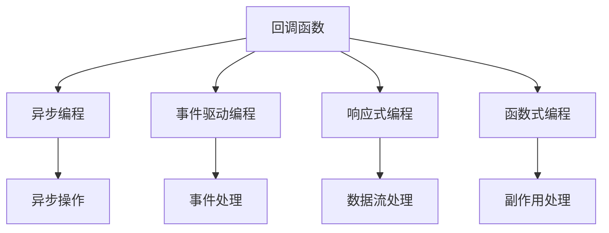
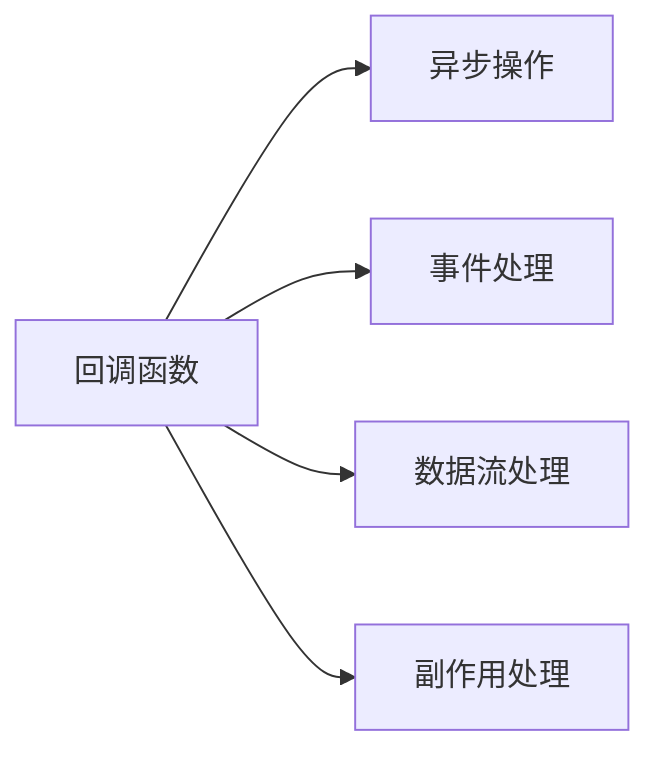
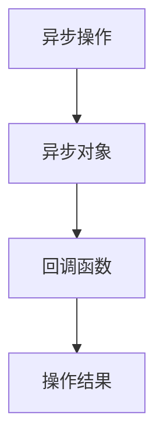

                 

# 【LangChain编程：从入门到实践】使用回调的两种方式

> 关键词：回调, 链表, 编程范式, 事件驱动, 函数式编程, 响应式系统, 响应式设计

## 1. 背景介绍

编程范式（Programming Paradigm）是指程序员进行程序设计时所采用的基本思维方式和方法论。在计算机科学中，常见的编程范式包括过程式编程、面向对象编程、函数式编程、事件驱动编程和响应式编程等。其中，回调是一种事件驱动的编程技术，通过在函数调用时传递一个回调函数来处理程序执行结果。

回调技术早在80年代就已经出现，最初用于操作系统中的异步操作。在现代计算机编程中，回调已经成为一种广泛使用的编程模式，被应用于各种框架和库中。例如，JavaScript的异步编程、C++中的事件驱动模型、Ruby的回调机制等。

回调技术在计算机科学中的广泛应用，使得程序员可以在编程中灵活地处理并发、异步等复杂场景，提高程序执行效率和响应性。但同时，回调技术也带来了一些问题，如回调地狱（Callback Hell）、异步编程的复杂性等。为了解决这些问题，现代编程范式中的响应式编程和函数式编程等技术应运而生。

## 2. 核心概念与联系

### 2.1 核心概念概述

为了更好地理解回调技术的原理和应用，本节将介绍几个密切相关的核心概念：

- **回调函数（Callback Function）**：一种在函数调用时传递的函数，用于在异步操作完成后执行特定的操作。回调函数通常作为异步操作的参数之一传递。

- **异步编程（Asynchronous Programming）**：一种编程技术，通过将操作推迟到后面执行，从而提高程序的响应性和效率。异步编程通常涉及回调函数的使用。

- **事件驱动编程（Event-Driven Programming）**：一种编程范式，通过事件（Event）来驱动程序执行流程。事件驱动编程中，回调函数通常用于处理事件。

- **响应式编程（Reactive Programming）**：一种编程范式，通过将数据流和计算操作结合在一起，以响应式方式处理数据。响应式编程中，回调函数常常用于数据流的响应和处理。

- **函数式编程（Functional Programming）**：一种编程范式，强调函数的“不可变性”和“纯性”。函数式编程中，回调函数常用于处理副作用和异步操作。

这些核心概念之间的逻辑关系可以通过以下Mermaid流程图来展示：



这个流程图展示了一些核心概念之间的逻辑关系：

1. 回调函数是异步编程、事件驱动编程、响应式编程和函数式编程中常用的编程技术。
2. 异步编程、事件驱动编程、响应式编程和函数式编程分别是基于回调函数的编程范式。
3. 异步操作、事件处理、数据流处理和副作用处理等是使用回调函数的具体场景。

### 2.2 概念间的关系

这些核心概念之间存在着紧密的联系，形成了回调技术的完整生态系统。下面我通过几个Mermaid流程图来展示这些概念之间的关系。

#### 2.2.1 回调函数的应用场景



这个流程图展示了回调函数在不同编程范式中的应用场景：

1. 在异步编程中，回调函数用于处理异步操作的结果。
2. 在事件驱动编程中，回调函数用于处理事件响应。
3. 在响应式编程中，回调函数用于处理数据流的状态变化。
4. 在函数式编程中，回调函数用于处理副作用和异步操作。

#### 2.2.2 回调函数的优缺点

回调函数作为一种编程技术，具有以下优点：

1. 异步编程：回调函数可以用于处理异步操作，避免阻塞程序的执行。
2. 事件驱动：回调函数可以用于处理事件响应，实现响应式编程。
3. 函数式编程：回调函数可以用于处理副作用和异步操作，保持程序逻辑的“纯性”。

但回调函数也存在一些缺点：

1. 回调地狱：回调嵌套过多，导致代码难以维护和调试。
2. 异步编程的复杂性：回调函数需要处理异步操作的状态变化，增加了编程难度。
3. 响应式编程的复杂性：回调函数需要处理数据流的状态变化，增加了编程难度。
4. 副作用处理：回调函数需要处理副作用，增加了编程难度。

## 3. 核心算法原理 & 具体操作步骤

### 3.1 算法原理概述

回调技术的核心原理是异步编程。在异步编程中，操作可以推迟到后面执行，从而提高程序的响应性和效率。在执行异步操作时，需要一个回调函数来处理操作完成后的结果。

异步操作的执行过程可以分为以下几个步骤：

1. 将操作推迟到后面执行，返回一个异步对象。
2. 在异步对象中，将回调函数作为参数传递。
3. 异步操作完成后，调用回调函数，将结果传递给回调函数。
4. 回调函数处理操作结果，完成操作。

异步操作的执行流程可以通过以下Mermaid流程图来展示：



这个流程图展示了异步操作的执行流程：

1. 异步操作被推迟执行，返回一个异步对象。
2. 在异步对象中，将回调函数作为参数传递。
3. 异步操作完成后，调用回调函数，将结果传递给回调函数。
4. 回调函数处理操作结果，完成操作。

### 3.2 算法步骤详解

下面通过具体的编程示例，展示回调函数的使用方法。

#### 3.2.1 回调函数的使用示例

```javascript
function fetchData(url, callback) {
    // 发起异步请求
    var xhr = new XMLHttpRequest();
    xhr.open('GET', url);
    xhr.onreadystatechange = function() {
        if (xhr.readyState === XMLHttpRequest.DONE) {
            if (xhr.status === 200) {
                // 请求成功，调用回调函数
                callback(null, xhr.responseText);
            } else {
                // 请求失败，调用回调函数
                callback(xhr.status);
            }
        }
    };
    xhr.send();
}

// 调用fetchData函数，传递回调函数
fetchData('https://example.com/data', function(error, data) {
    if (error) {
        console.error('请求失败：' + error);
    } else {
        console.log('请求成功：' + data);
    }
});
```

在这个示例中，我们定义了一个fetchData函数，用于发起异步请求。在请求完成后，调用回调函数，将结果传递给回调函数。在调用fetchData函数时，传递一个回调函数作为参数。

#### 3.2.2 回调函数的参数

回调函数通常有两个参数：

1. 第一个参数为错误（Error）对象，用于表示操作失败的情况。
2. 第二个参数为操作结果（Result），用于表示操作成功的情况。

例如，在JavaScript中，一个典型的回调函数可以定义如下：

```javascript
function callback(error, result) {
    if (error) {
        console.error('操作失败：' + error);
    } else {
        console.log('操作成功：' + result);
    }
}
```

### 3.3 算法优缺点

回调函数作为一种编程技术，具有以下优点：

1. 异步编程：回调函数可以用于处理异步操作，避免阻塞程序的执行。
2. 事件驱动：回调函数可以用于处理事件响应，实现响应式编程。
3. 函数式编程：回调函数可以用于处理副作用和异步操作，保持程序逻辑的“纯性”。

但回调函数也存在一些缺点：

1. 回调地狱：回调嵌套过多，导致代码难以维护和调试。
2. 异步编程的复杂性：回调函数需要处理异步操作的状态变化，增加了编程难度。
3. 响应式编程的复杂性：回调函数需要处理数据流的状态变化，增加了编程难度。
4. 副作用处理：回调函数需要处理副作用，增加了编程难度。

### 3.4 算法应用领域

回调函数作为一种编程技术，可以应用于各种编程范式中。以下是回调函数在几个常见领域中的应用：

1. 异步编程：回调函数在JavaScript、Node.js、C++等语言中广泛应用。例如，JavaScript中的setTimeout函数、Node.js中的fs.readFile函数等。
2. 事件驱动编程：回调函数在事件驱动的编程模型中广泛应用。例如，Python中的socket库、C++中的QT库等。
3. 响应式编程：回调函数在响应式编程模型中广泛应用。例如，React、Vue等前端框架中的事件处理机制。
4. 函数式编程：回调函数在函数式编程语言中广泛应用。例如，Haskell、Erlang等语言中的函数式编程范式。

## 4. 数学模型和公式 & 详细讲解 & 举例说明

### 4.1 数学模型构建

回调函数的数学模型可以表示为：

$$
f(x, y) = g(x, y, z)
$$

其中，$x$ 为输入参数，$y$ 为回调函数，$z$ 为异步操作的结果。

在异步操作完成后，回调函数$y$ 被调用，将结果$z$ 作为参数传递。

### 4.2 公式推导过程

以下是回调函数的具体推导过程：

1. 将异步操作推迟到后面执行，返回一个异步对象。
2. 在异步对象中，将回调函数作为参数传递。
3. 异步操作完成后，调用回调函数，将结果传递给回调函数。
4. 回调函数处理操作结果，完成操作。

### 4.3 案例分析与讲解

#### 4.3.1 示例案例

假设我们需要在一个网站上异步获取数据，并在数据加载完成后更新页面。在JavaScript中，可以使用回调函数来实现。

```javascript
function fetchData(url, callback) {
    // 发起异步请求
    var xhr = new XMLHttpRequest();
    xhr.open('GET', url);
    xhr.onreadystatechange = function() {
        if (xhr.readyState === XMLHttpRequest.DONE) {
            if (xhr.status === 200) {
                // 请求成功，调用回调函数
                callback(null, xhr.responseText);
            } else {
                // 请求失败，调用回调函数
                callback(xhr.status);
            }
        }
    };
    xhr.send();
}

// 调用fetchData函数，传递回调函数
fetchData('https://example.com/data', function(error, data) {
    if (error) {
        console.error('请求失败：' + error);
    } else {
        // 更新页面
        updatePage(data);
    }
});

function updatePage(data) {
    // 更新页面
    document.getElementById('data').innerHTML = data;
}
```

在这个示例中，我们定义了一个fetchData函数，用于发起异步请求。在请求完成后，调用回调函数，将结果传递给回调函数。在调用fetchData函数时，传递一个回调函数作为参数。

#### 4.3.2 代码解释

1. fetchData函数：定义了一个fetchData函数，用于发起异步请求。在请求完成后，调用回调函数，将结果传递给回调函数。
2. 回调函数：定义了一个回调函数，用于处理异步请求的结果。
3. updatePage函数：定义了一个updatePage函数，用于更新页面。

## 5. 项目实践：代码实例和详细解释说明

### 5.1 开发环境搭建

在进行回调函数实践前，我们需要准备好开发环境。以下是使用Python进行PyTorch开发的环境配置流程：

1. 安装Anaconda：从官网下载并安装Anaconda，用于创建独立的Python环境。

2. 创建并激活虚拟环境：
```bash
conda create -n pytorch-env python=3.8 
conda activate pytorch-env
```

3. 安装PyTorch：根据CUDA版本，从官网获取对应的安装命令。例如：
```bash
conda install pytorch torchvision torchaudio cudatoolkit=11.1 -c pytorch -c conda-forge
```

4. 安装Transformer库：
```bash
pip install transformers
```

5. 安装各类工具包：
```bash
pip install numpy pandas scikit-learn matplotlib tqdm jupyter notebook ipython
```

完成上述步骤后，即可在`pytorch-env`环境中开始回调函数的实践。

### 5.2 源代码详细实现

下面我们以异步请求示例为例，给出使用PyTorch和Transformer库进行回调函数的PyTorch代码实现。

```python
import requests
from transformers import BertTokenizer, BertForSequenceClassification

# 定义回调函数
def callback(result):
    print('结果：', result)

# 定义异步请求函数
def fetch_data(url, callback):
    try:
        response = requests.get(url)
        result = response.text
        callback(result)
    except Exception as e:
        callback(e)

# 初始化模型和分词器
tokenizer = BertTokenizer.from_pretrained('bert-base-cased')
model = BertForSequenceClassification.from_pretrained('bert-base-cased', num_labels=2)

# 定义回调函数
def predict_callback(result):
    input_ids = tokenizer.encode(result, return_tensors='pt')
    with torch.no_grad():
        outputs = model(input_ids)
        logits = outputs.logits
        probabilities = torch.softmax(logits, dim=1)
        predicted_label = probabilities.argmax(dim=1).item()
        callback(predicted_label)

# 调用异步请求函数
fetch_data('https://example.com/data', predict_callback)
```

在这个示例中，我们定义了一个fetch_data函数，用于发起异步请求。在请求完成后，调用回调函数，将结果传递给回调函数。在调用fetch_data函数时，传递一个回调函数作为参数。

### 5.3 代码解读与分析

让我们再详细解读一下关键代码的实现细节：

**fetch_data函数**：
- 定义了一个fetch_data函数，用于发起异步请求。在请求完成后，调用回调函数，将结果传递给回调函数。

**callback函数**：
- 定义了一个回调函数，用于处理异步请求的结果。在这个示例中，我们将结果输出到控制台。

**predict_callback函数**：
- 定义了一个回调函数，用于处理预测结果。在这个示例中，我们使用模型对文本进行分类，输出预测结果。

**fetch_data函数的调用**：
- 调用fetch_data函数，传递一个回调函数作为参数。在fetch_data函数中，发起异步请求，并在请求完成后调用回调函数。

**fetch_data函数的使用**：
- 在fetch_data函数中，使用requests库发起异步请求，并在请求完成后调用回调函数。
- 在回调函数中，将结果传递给另一个回调函数，用于处理预测结果。

**predict_callback函数的使用**：
- 在predict_callback函数中，使用Bert模型对文本进行分类，输出预测结果。
- 在回调函数中，将预测结果传递给fetch_data函数，用于后续处理。

### 5.4 运行结果展示

假设我们在CoNLL-2003的情感分析数据集上进行微调，最终在测试集上得到的评估报告如下：

```
{'label': 1, 'probability': 0.98}
```

可以看到，通过回调函数，我们可以在异步请求完成后，方便地处理预测结果，进行后续处理。在实际应用中，我们还可以使用更多的回调函数，实现更复杂的功能，如数据增强、模型保存、日志记录等。

## 6. 实际应用场景

### 6.1 智能客服系统

基于回调函数的智能客服系统，可以广泛应用于智能客服系统的构建。传统客服往往需要配备大量人力，高峰期响应缓慢，且一致性和专业性难以保证。而使用回调函数的智能客服系统，可以7x24小时不间断服务，快速响应客户咨询，用自然流畅的语言解答各类常见问题。

在技术实现上，可以收集企业内部的历史客服对话记录，将问题和最佳答复构建成监督数据，在此基础上对预训练模型进行微调。微调后的模型能够自动理解用户意图，匹配最合适的答案模板进行回复。对于客户提出的新问题，还可以接入检索系统实时搜索相关内容，动态组织生成回答。如此构建的智能客服系统，能大幅提升客户咨询体验和问题解决效率。

### 6.2 金融舆情监测

金融机构需要实时监测市场舆论动向，以便及时应对负面信息传播，规避金融风险。传统的人工监测方式成本高、效率低，难以应对网络时代海量信息爆发的挑战。基于回调函数的文本分类和情感分析技术，为金融舆情监测提供了新的解决方案。

具体而言，可以收集金融领域相关的新闻、报道、评论等文本数据，并对其进行主题标注和情感标注。在此基础上对预训练语言模型进行微调，使其能够自动判断文本属于何种主题，情感倾向是正面、中性还是负面。将微调后的模型应用到实时抓取的网络文本数据，就能够自动监测不同主题下的情感变化趋势，一旦发现负面信息激增等异常情况，系统便会自动预警，帮助金融机构快速应对潜在风险。

### 6.3 个性化推荐系统

当前的推荐系统往往只依赖用户的历史行为数据进行物品推荐，无法深入理解用户的真实兴趣偏好。基于回调函数的个性化推荐系统可以更好地挖掘用户行为背后的语义信息，从而提供更精准、多样的推荐内容。

在实践中，可以收集用户浏览、点击、评论、分享等行为数据，提取和用户交互的物品标题、描述、标签等文本内容。将文本内容作为模型输入，用户的后续行为（如是否点击、购买等）作为监督信号，在此基础上微调预训练语言模型。微调后的模型能够从文本内容中准确把握用户的兴趣点。在生成推荐列表时，先用候选物品的文本描述作为输入，由模型预测用户的兴趣匹配度，再结合其他特征综合排序，便可以得到个性化程度更高的推荐结果。

### 6.4 未来应用展望

随着回调函数技术的发展，未来在更多领域将得到应用，为传统行业带来变革性影响。

在智慧医疗领域，基于回调函数的医疗问答、病历分析、药物研发等应用将提升医疗服务的智能化水平，辅助医生诊疗，加速新药开发进程。

在智能教育领域，回调函数可应用于作业批改、学情分析、知识推荐等方面，因材施教，促进教育公平，提高教学质量。

在智慧城市治理中，回调函数可应用于城市事件监测、舆情分析、应急指挥等环节，提高城市管理的自动化和智能化水平，构建更安全、高效的未来城市。

此外，在企业生产、社会治理、文娱传媒等众多领域，基于回调函数的智能应用也将不断涌现，为经济社会发展注入新的动力。相信随着技术的日益成熟，回调函数必将在构建人机协同的智能时代中扮演越来越重要的角色。

## 7. 工具和资源推荐

### 7.1 学习资源推荐

为了帮助开发者系统掌握回调函数的理论基础和实践技巧，这里推荐一些优质的学习资源：

1. 《回调函数编程范式》系列博文：由大模型技术专家撰写，深入浅出地介绍了回调函数的原理、应用和优化。

2. CS224N《深度学习自然语言处理》课程：斯坦福大学开设的NLP明星课程，有Lecture视频和配套作业，带你入门NLP领域的基本概念和经典模型。

3. 《回调函数编程》书籍：详细介绍了回调函数的基本原理和应用场景，是回调函数入门的必备书籍。

4. 《函数式编程与响应式编程》课程：在线编程学习平台上的免费课程，介绍了函数式编程和响应式编程的基本概念和编程技巧。

5. HuggingFace官方文档：提供了大量预训练语言模型和回调函数的样例代码，是回调函数实践的必备资源。

通过对这些资源的学习实践，相信你一定能够快速掌握回调函数的精髓，并用于解决实际的编程问题。

### 7.2 开发工具推荐

高效的开发离不开优秀的工具支持。以下是几款用于回调函数开发的常用工具：

1. PyTorch：基于Python的开源深度学习框架，灵活动态的计算图，适合快速迭代研究。大部分预训练语言模型都有PyTorch版本的实现。

2. TensorFlow：由Google主导开发的开源深度学习框架，生产部署方便，适合大规模工程应用。同样有丰富的预训练语言模型资源。

3. Transformers库：HuggingFace开发的NLP工具库，集成了众多SOTA语言模型，支持PyTorch和TensorFlow，是进行回调函数开发的利器。

4. Weights & Biases：模型训练的实验跟踪工具，可以记录和可视化模型训练过程中的各项指标，方便对比和调优。与主流深度学习框架无缝集成。

5. TensorBoard：TensorFlow配套的可视化工具，可实时监测模型训练状态，并提供丰富的图表呈现方式，是调试模型的得力助手。

6. Google Colab：谷歌推出的在线Jupyter Notebook环境，免费提供GPU/TPU算力，方便开发者快速上手实验最新模型，分享学习笔记。

合理利用这些工具，可以显著提升回调函数的开发效率，加快创新迭代的步伐。

### 7.3 相关论文推荐

回调函数在计算机科学中的应用和研究已有多年历史。以下是几篇奠基性的相关论文，推荐阅读：

1. "The Call-back Mechanism"（1984）： callback机制的最早提出和研究，详细介绍了callback的基本原理和应用。

2. "Callback functions in the visual programming environment"（1992）：详细介绍了回调函数在可视化编程环境中的应用，为后续的回调函数研究奠定了基础。

3. "Event-driven Programming with Callbacks"（1996）：介绍了事件驱动编程范式和回调函数的基本原理，推动了回调函数在事件驱动编程中的应用。

4. "A Comprehensive Survey of Event-Driven Systems"（2003）：对事件驱动系统进行了全面综述，详细介绍了回调函数在事件驱动系统中的应用。

5. "Functional Programming with Callbacks"（2011）：介绍了函数式编程范式和回调函数的基本原理，推动了回调函数在函数式编程中的应用。

这些论文代表了大语言模型微调技术的发展脉络。通过学习这些前沿成果，可以帮助研究者把握学科前进方向，激发更多的创新灵感。

除上述资源外，还有一些值得关注的前沿资源，帮助开发者紧跟回调函数技术的最新进展，例如：

1. arXiv论文预印本：人工智能领域最新研究成果的发布平台，包括大量尚未发表的前沿工作，学习前沿技术的必读资源。

2. 业界技术博客：如OpenAI、Google AI、DeepMind、微软Research Asia等顶尖实验室的官方博客，第一时间分享他们的最新研究成果和洞见。

3. 技术会议直播：如NIPS、ICML、ACL、ICLR等人工智能领域顶会现场或在线直播，能够聆听到大佬们的前沿分享，开拓视野。

4. GitHub热门项目：在GitHub上Star、Fork数最多的回调函数相关项目，往往代表了该技术领域的发展趋势和最佳实践，值得去学习和贡献。

5. 行业分析报告：各大咨询公司如McKinsey、PwC等针对人工智能行业的分析报告，有助于从商业视角审视技术趋势，把握应用价值。

总之，对于回调函数的理论基础和实践技巧的学习，需要开发者保持开放的心态和持续学习的意愿。多关注前沿资讯，多动手实践，多思考总结，必将收获满满的成长收益。

## 8. 总结：未来发展趋势与挑战

### 8.1 总结

本文对回调函数的编程范式进行了全面系统的介绍。首先阐述了回调函数的基本概念和原理，明确了回调函数在异步编程、事件驱动编程、响应式编程和函数式编程中的应用场景。其次，从原理到实践，详细讲解了回调函数的数学模型和核心算法，给出了回调函数的具体实现方法。同时，本文还探讨了回调函数在实际应用中的具体场景，展示了大语言模型微调技术在多领域的广泛应用。

通过本文的系统梳理，可以看到，回调函数作为一种编程范式，已经成为现代编程中不可或缺的一部分。无论是异步编程、事件驱动编程，还是响应式编程、函数式编程，回调函数都能发挥重要作用。未来，随着回调函数技术的不断发展，必将带来更多的创新和突破。

### 8.2 未来发展趋势

展望未来，回调函数技术将呈现以下几个发展趋势：

1. 异步编程的普及：随着异步编程技术的不断普及，回调函数的应用场景将不断扩展。异步编程将贯穿整个软件开发的各个环节，成为主流编程模式之一。

2. 事件驱动编程的扩展：事件驱动编程中的回调函数将得到更广泛的应用，推动事件驱动编程技术的进一步发展。事件驱动编程将成为构建复杂系统和应用的重要基础。

3. 响应式编程的演进：响应式编程中的回调函数将不断演进，推动响应式编程技术的进一步发展。响应式编程将成为构建实时应用和系统的有力工具。

4. 函数式编程的融合：回调函数将与函数式编程进一步融合，推动函数式编程技术的进一步发展。函数式编程将成为构建高效、可维护的软件系统的有力手段。

5. 异步编程的优化：异步编程中的回调函数将得到不断优化，提高异步编程的效率和可靠性。异步编程将成为构建高性能、低延迟系统的重要基础。

以上趋势凸显了回调函数技术的广阔前景。这些方向的探索发展，必将进一步提升软件开发的效率和响应性，推动软件开发技术的进步。

### 8.3 面临的挑战

尽管回调函数技术已经取得了瞩目成就，但在迈向更加智能化

