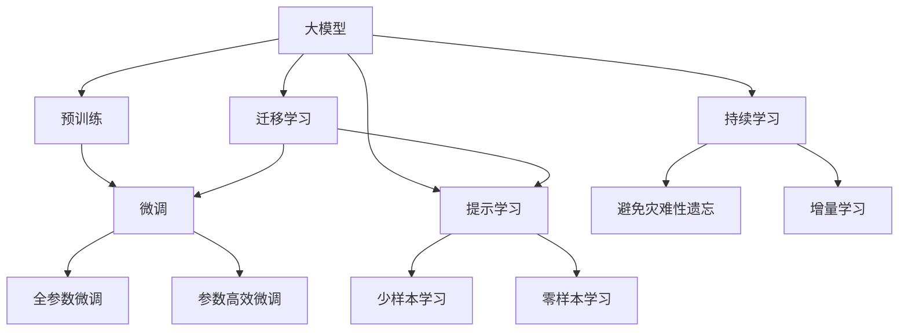
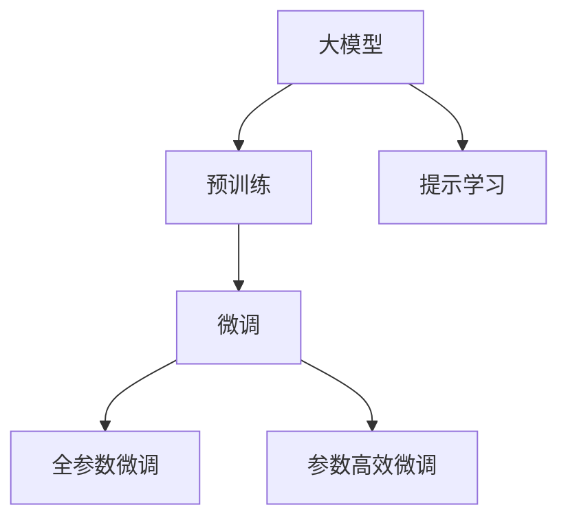
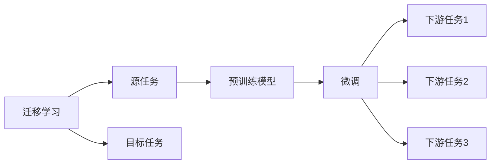
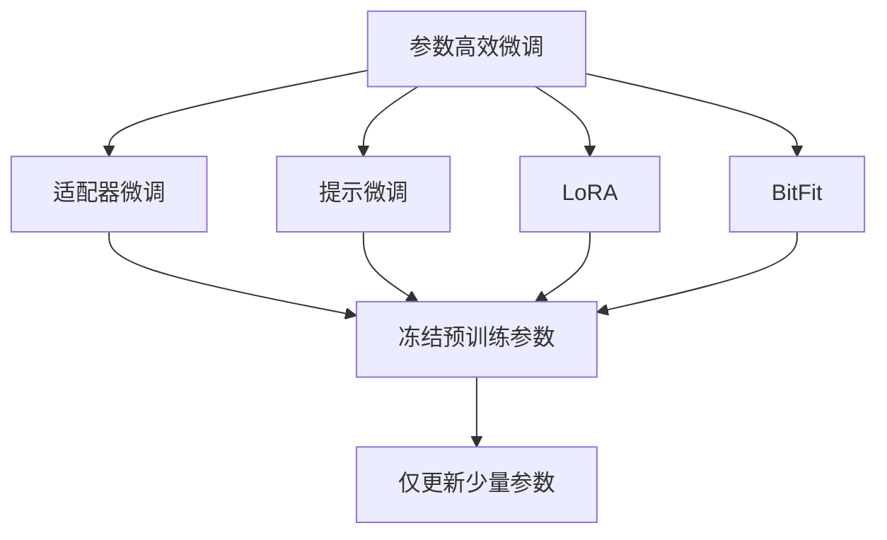
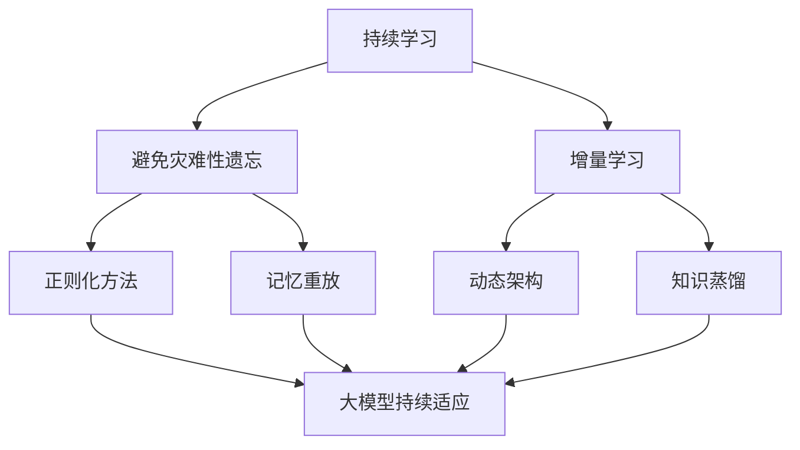
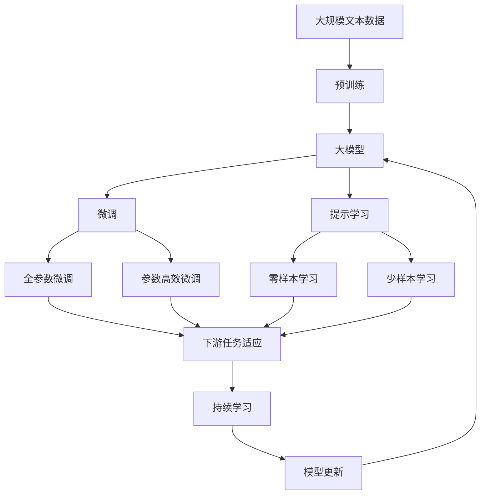

                 

# 大模型在to B市场的应用

> 关键词：大模型,to B,迁移学习,微调,Fine-Tuning,企业应用,企业级解决方案,自然语言处理(NLP),人工智能(AI),商业智能(BI),工业互联网

## 1. 背景介绍

### 1.1 问题由来
近年来，随着人工智能技术的不断发展，大模型（Large Model）在各个行业中得到了广泛的应用。尤其是在to B（Business-to-Business）市场，企业级大模型正在成为驱动业务增长、提升竞争力的关键引擎。

企业级大模型指的是针对特定行业和企业需求，在大规模预训练模型的基础上，通过微调（Fine-Tuning）等方式进行优化，以适配特定任务的模型。相较于通用的预训练模型，企业级大模型能够更好地理解行业领域的语言特点和业务场景，从而提供更加精准、高效的应用解决方案。

### 1.2 问题核心关键点
企业级大模型在to B市场的应用，关键在于以下几个方面：

1. **数据与业务结合**：企业级大模型需要基于特定领域的数据进行预训练，并在微调过程中融入业务逻辑，以适应企业的具体需求。
2. **参数高效微调**：由于企业级大模型通常规模庞大，参数更新成本较高，因此需要采用参数高效微调技术，以减少计算资源和时间的消耗。
3. **跨领域迁移能力**：企业级大模型需要具备跨领域的迁移能力，以在多个相关领域之间进行知识共享和复用。
4. **可解释性**：企业级大模型应具备较高的可解释性，以便企业对其决策过程进行理解和调试。
5. **鲁棒性和安全性**：企业级大模型需要在面对噪声数据和恶意攻击时具备鲁棒性和安全性，以确保在实际应用中的稳定性和可靠性。

### 1.3 问题研究意义
企业级大模型在to B市场的应用，具有以下重要意义：

1. **提升业务效率**：通过企业级大模型，企业可以自动化处理大量数据，提升业务决策和运营效率。
2. **降低人力成本**：大模型可以代替部分人工工作，减少企业对人力的依赖，降低运营成本。
3. **增强决策支持**：企业级大模型能够提供基于数据驱动的决策支持，帮助企业更好地制定战略和规划。
4. **创新应用场景**：大模型可以应用于企业内部的各种创新场景，如智能客服、销售预测、供应链优化等，带来新的商业机会。
5. **促进产业升级**：企业级大模型的应用，将推动各行业实现数字化转型，提升整体产业竞争力。

## 2. 核心概念与联系

### 2.1 核心概念概述

为更好地理解企业级大模型在to B市场的应用，本节将介绍几个关键概念：

1. **大模型**：指通过在大规模无标签文本数据上进行预训练，学习通用的语言知识和语义表示的模型，如BERT、GPT等。大模型通常具备强大的语言理解能力和生成能力。

2. **迁移学习**：指将在一个领域学习到的知识迁移到另一个领域，以解决新任务的学习方法。企业级大模型通常基于通用大模型进行迁移学习，以适配特定的行业需求。

3. **微调（Fine-Tuning）**：指在预训练模型的基础上，使用下游任务的少量标注数据，通过有监督地训练来优化模型在该任务上的性能。微调是企业级大模型应用中最常用的技术手段。

4. **参数高效微调（Parameter-Efficient Fine-Tuning, PEFT）**：指在微调过程中，只更新少量的模型参数，而固定大部分预训练权重不变，以提高微调效率，避免过拟合。

5. **提示学习（Prompt Learning）**：通过在输入文本中添加提示模板，引导大语言模型进行特定任务的推理和生成。可以在不更新模型参数的情况下，实现零样本或少样本学习。

6. **少样本学习（Few-shot Learning）**：指在只有少量标注样本的情况下，模型能够快速适应新任务的学习方法。在大模型中，通常通过在输入中提供少量示例来实现，无需更新模型参数。

7. **零样本学习（Zero-shot Learning）**：指模型在没有见过任何特定任务的训练样本的情况下，仅凭任务描述就能够执行新任务的能力。大模型通过预训练获得的广泛知识，使其能够理解任务指令并生成相应输出。

8. **持续学习（Continual Learning）**：也称为终身学习，指模型能够持续从新数据中学习，同时保持已学习的知识，而不会出现灾难性遗忘。这对于保持企业级大模型的时效性和适应性至关重要。

这些核心概念之间的逻辑关系可以通过以下Mermaid流程图来展示：



这个流程图展示了大模型在企业级应用中的核心概念及其之间的关系：

1. 大模型通过预训练获得基础能力。
2. 微调是对预训练模型进行任务特定的优化，可以分为全参数微调和参数高效微调（PEFT）。
3. 提示学习是一种不更新模型参数的方法，可以实现零样本和少样本学习。
4. 迁移学习是连接预训练模型与下游任务的桥梁，可以通过微调或提示学习来实现。
5. 持续学习旨在使模型能够不断学习新知识，同时避免遗忘旧知识。

这些概念共同构成了企业级大模型在to B市场的应用框架，使其能够在各种场景下发挥强大的语言理解和生成能力。通过理解这些核心概念，我们可以更好地把握企业级大模型的工作原理和优化方向。

### 2.2 概念间的关系

这些核心概念之间存在着紧密的联系，形成了企业级大模型在to B市场的应用生态系统。下面我们通过几个Mermaid流程图来展示这些概念之间的关系。

#### 2.2.1 大模型的学习范式



这个流程图展示了大模型的学习范式。预训练主要采用自监督学习任务，而微调则是有监督学习的过程。提示学习可以实现零样本和少样本学习，无需更新模型参数。微调可以分为全参数微调和参数高效微调两种方式。

#### 2.2.2 迁移学习与微调的关系



这个流程图展示了迁移学习的基本原理，以及它与微调的关系。迁移学习涉及源任务和目标任务，预训练模型在源任务上学习，然后通过微调适应各种下游任务（目标任务）。

#### 2.2.3 参数高效微调方法



这个流程图展示了几种常见的参数高效微调方法，包括适配器微调、提示微调、LoRA和BitFit。这些方法的共同特点是冻结大部分预训练参数，只更新少量参数，从而提高微调效率。

#### 2.2.4 持续学习在大模型中的应用



这个流程图展示了持续学习在大模型中的应用。持续学习的主要目标是避免灾难性遗忘和实现增量学习。通过正则化方法、记忆重放、动态架构和知识蒸馏等技术，可以使大模型持续适应新的任务和数据。

### 2.3 核心概念的整体架构

最后，我们用一个综合的流程图来展示这些核心概念在大模型微调过程中的整体架构：



这个综合流程图展示了从预训练到微调，再到持续学习的完整过程。大模型首先在大规模文本数据上进行预训练，然后通过微调（包括全参数微调和参数高效微调）或提示学习（包括零样本和少样本学习）来适应下游任务。最后，通过持续学习技术，模型可以不断更新和适应新的任务和数据。 通过这些流程图，我们可以更清晰地理解大模型在企业级应用中的核心概念及其之间的关系。

## 3. 核心算法原理 & 具体操作步骤
### 3.1 算法原理概述

企业级大模型在to B市场的应用，本质上是一个有监督的细粒度迁移学习过程。其核心思想是：将预训练的大模型视作一个强大的"特征提取器"，通过在企业级下游任务的标注数据上进行有监督地训练，使得模型输出能够匹配任务标签，从而获得针对特定任务优化的模型。

形式化地，假设预训练模型为 $M_{\theta}$，其中 $\theta$ 为预训练得到的模型参数。给定企业级下游任务 $T$ 的标注数据集 $D=\{(x_i, y_i)\}_{i=1}^N$, $x_i \in \mathcal{X}$, $y_i \in \mathcal{Y}$，微调的目标是找到新的模型参数 $\hat{\theta}$，使得：

$$
\hat{\theta}=\mathop{\arg\min}_{\theta} \mathcal{L}(M_{\theta},D)
$$

其中 $\mathcal{L}$ 为针对任务 $T$ 设计的损失函数，用于衡量模型预测输出与真实标签之间的差异。常见的损失函数包括交叉熵损失、均方误差损失等。

通过梯度下降等优化算法，微调过程不断更新模型参数 $\theta$，最小化损失函数 $\mathcal{L}$，使得模型输出逼近真实标签。由于 $\theta$ 已经通过预训练获得了较好的初始化，因此即便在企业级小规模数据集 $D$ 上进行微调，也能较快收敛到理想的模型参数 $\hat{\theta}$。

### 3.2 算法步骤详解

企业级大模型在to B市场的应用，一般包括以下几个关键步骤：

**Step 1: 准备预训练模型和数据集**
- 选择合适的预训练语言模型 $M_{\theta}$ 作为初始化参数，如 BERT、GPT等。
- 准备企业级下游任务的标注数据集 $D$，划分为训练集、验证集和测试集。一般要求标注数据与预训练数据的分布不要差异过大。

**Step 2: 添加任务适配层**
- 根据任务类型，在预训练模型顶层设计合适的输出层和损失函数。
- 对于分类任务，通常在顶层添加线性分类器和交叉熵损失函数。
- 对于生成任务，通常使用语言模型的解码器输出概率分布，并以负对数似然为损失函数。

**Step 3: 设置微调超参数**
- 选择合适的优化算法及其参数，如 AdamW、SGD 等，设置学习率、批大小、迭代轮数等。
- 设置正则化技术及强度，包括权重衰减、Dropout、Early Stopping等。
- 确定冻结预训练参数的策略，如仅微调顶层，或全部参数都参与微调。

**Step 4: 执行梯度训练**
- 将训练集数据分批次输入模型，前向传播计算损失函数。
- 反向传播计算参数梯度，根据设定的优化算法和学习率更新模型参数。
- 周期性在验证集上评估模型性能，根据性能指标决定是否触发 Early Stopping。
- 重复上述步骤直到满足预设的迭代轮数或 Early Stopping 条件。

**Step 5: 测试和部署**
- 在测试集上评估微调后模型 $M_{\hat{\theta}}$ 的性能，对比微调前后的精度提升。
- 使用微调后的模型对新样本进行推理预测，集成到实际的应用系统中。
- 持续收集新的数据，定期重新微调模型，以适应数据分布的变化。

以上是企业级大模型在to B市场应用的常见流程。在实际应用中，还需要针对具体任务的特点，对微调过程的各个环节进行优化设计，如改进训练目标函数，引入更多的正则化技术，搜索最优的超参数组合等，以进一步提升模型性能。

### 3.3 算法优缺点

企业级大模型在to B市场的应用，具有以下优点：

1. **快速部署**：预训练模型已经在大规模数据上进行过训练，具有较好的泛化能力，企业级下游任务的微调往往能够快速见效。
2. **业务适配**：通过微调，企业级大模型能够针对具体业务需求进行定制化适配，提供符合企业需求的解决方案。
3. **成本效益**：相比从头训练模型，微调方法可以显著减少数据标注、模型训练和计算资源的投入，提高企业的ROI（投资回报率）。
4. **性能提升**：企业级大模型通过微调，能够更好地理解企业级数据的特点和模式，提升模型的精度和鲁棒性。

同时，该方法也存在一定的局限性：

1. **数据依赖**：微调的效果很大程度上取决于标注数据的质量和数量，获取高质量标注数据的成本较高。
2. **迁移能力有限**：当目标任务与预训练数据的分布差异较大时，微调的性能提升有限。
3. **负传递风险**：预训练模型的固有偏见、有害信息等，可能通过微调传递到下游任务，造成负面影响。
4. **可解释性不足**：微调模型的决策过程通常缺乏可解释性，难以对其推理逻辑进行分析和调试。

尽管存在这些局限性，但就目前而言，企业级大模型在to B市场的应用仍是最主流范式。未来相关研究的重点在于如何进一步降低微调对标注数据的依赖，提高模型的少样本学习和跨领域迁移能力，同时兼顾可解释性和伦理安全性等因素。

### 3.4 算法应用领域

企业级大模型在to B市场的应用已经广泛应用于多个领域，例如：

- **智能客服**：通过微调，企业级大模型可以构建智能客服系统，自动化处理客户咨询，提升客户满意度和服务效率。
- **销售预测**：使用微调后的模型进行销售数据分析，预测市场需求和趋势，帮助企业制定合理的销售策略。
- **客户细分**：根据客户行为数据，使用微调模型进行客户细分，提供个性化的营销和服务。
- **舆情分析**：使用微调模型分析社交媒体、新闻等数据，进行舆情监测和情感分析，帮助企业及时掌握市场动态。
- **风险评估**：在金融、保险等领域，使用微调模型评估信贷、理赔等风险，提升风险管理能力。
- **知识图谱**：使用微调模型构建企业级知识图谱，辅助企业进行决策支持和业务创新。

除了上述这些经典应用外，企业级大模型在to B市场的应用还在不断扩展，如智能运营、供应链管理、健康医疗等，为企业提供了更加智能、高效、安全的服务。

## 4. 数学模型和公式 & 详细讲解 & 举例说明

### 4.1 数学模型构建

本节将使用数学语言对企业级大模型在to B市场的应用进行更加严格的刻画。

记预训练语言模型为 $M_{\theta}$，其中 $\theta$ 为预训练得到的模型参数。假设企业级下游任务 $T$ 的训练集为 $D=\{(x_i,y_i)\}_{i=1}^N$, $x_i \in \mathcal{X}$, $y_i \in \mathcal{Y}$。

定义模型 $M_{\theta}$ 在数据样本 $(x,y)$ 上的损失函数为 $\ell(M_{\theta}(x),y)$，则在数据集 $D$ 上的经验风险为：

$$
\mathcal{L}(\theta) = \frac{1}{N} \sum_{i=1}^N \ell(M_{\theta}(x_i),y_i)
$$

微调的优化目标是最小化经验风险，即找到最优参数：

$$
\theta^* = \mathop{\arg\min}_{\theta} \mathcal{L}(\theta)
$$

在实践中，我们通常使用基于梯度的优化算法（如SGD、Adam等）来近似求解上述最优化问题。设 $\eta$ 为学习率，$\lambda$ 为正则化系数，则参数的更新公式为：

$$
\theta \leftarrow \theta - \eta \nabla_{\theta}\mathcal{L}(\theta) - \eta\lambda\theta
$$

其中 $\nabla_{\theta}\mathcal{L}(\theta)$ 为损失函数对参数 $\theta$ 的梯度，可通过反向传播算法高效计算。

### 4.2 公式推导过程

以下我们以企业级客户细分任务为例，推导微调模型的损失函数及其梯度的计算公式。

假设模型 $M_{\theta}$ 在输入 $x$ 上的输出为 $\hat{y}=M_{\theta}(x) \in [0,1]$，表示样本属于某个分群的概率。真实标签 $y \in \{1,0\}$，其中 $1$ 表示属于某一分群，$0$ 表示不属于。则二分类交叉熵损失函数定义为：

$$
\ell(M_{\theta}(x),y) = -[y\log \hat{y} + (1-y)\log (1-\hat{y})]
$$

将其代入经验风险公式，得：

$$
\mathcal{L}(\theta) = -\frac{1}{N}\sum_{i=1}^N [y_i\log M_{\theta}(x_i)+(1-y_i)\log(1-M_{\theta}(x_i))]
$$

根据链式法则，损失函数对参数 $\theta_k$ 的梯度为：

$$
\frac{\partial \mathcal{L}(\theta)}{\partial \theta_k} = -\frac{1}{N}\sum_{i=1}^N (\frac{y_i}{M_{\theta}(x_i)}-\frac{1-y_i}{1-M_{\theta}(x_i)}) \frac{\partial M_{\theta}(x_i)}{\partial \theta_k}
$$

其中 $\frac{\partial M_{\theta}(x_i)}{\partial \theta_k}$ 可进一步递归展开，利用自动微分技术完成计算。

在得到损失函数的梯度后，即可带入参数更新公式，完成模型的迭代优化。重复上述过程直至收敛，最终得到适应企业级下游任务的最优模型参数 $\theta^*$。

### 4.3 案例分析与讲解

下面以企业级智能客服系统为例，进行详细的案例分析。

智能客服系统是企业级大模型在to B市场的重要应用之一。传统的客服方式往往需要配备大量人力，高峰期响应缓慢，且一致性和专业性难以保证。使用微调后的智能客服系统，可以7x24小时不间断服务，快速响应客户咨询，用自然流畅的语言解答各类常见问题。

假设某电商平台希望构建智能客服系统，以提高客户满意度。首先，收集平台的客户咨询记录，将其中的问答对构建成监督数据。使用预训练模型BERT作为初始化参数，在此基础上对模型进行微调。

具体而言，构建一个包含客户问题和预期回复的标注数据集 $D$。在预训练模型顶部添加一个线性分类器，并使用交叉熵损失函数进行微调。微调过程中，选择AdamW优化器，设置学习率为2e-5，使用early stopping避免过拟合。

最终得到的智能客服系统，可以根据客户输入的问题，自动匹配最佳回复。对于没有见过的新问题，系统还能够利用语义理解能力，生成合适的回复。由于系统是根据真实数据进行微调的，因此在实际应用中表现出了较好的准确性和鲁棒性。

通过上述案例，我们可以看到，企业级大模型在to B市场的应用，可以显著提升业务效率，降低运营成本，并为客户提供更加智能、高效的服务。

## 5. 项目实践：代码实例和详细解释说明

### 5.1 开发环境搭建

在进行企业级大模型微调实践前，我们需要准备好开发环境。以下是使用Python进行PyTorch开发的环境配置流程：

1. 安装Anaconda：从官网下载并安装Anaconda，用于创建独立的Python环境。

2. 创建并激活虚拟环境：
```bash
conda create -n pytorch-env python=3.8 
conda activate pytorch-env
```

3. 安装PyTorch：根据CUDA版本，从官网获取对应的安装命令。例如：
```bash
conda install pytorch torchvision torchaudio cudatoolkit=11.1 -c pytorch -c conda-forge
```

4. 安装Transformers库：
```bash
pip install transformers
```

5. 安装各类工具包：
```bash
pip install numpy pandas scikit-learn matplotlib tqdm jupyter notebook ipython
```

完成上述步骤后，即可在`pytorch-env`环境中开始企业级大模型的微调实践。

### 5.2 源代码详细实现

下面我们以企业级客户细分任务为例，给出使用Transformers库对BERT模型进行微调的PyTorch代码实现。

首先，定义数据处理函数：

```python
from transformers import BertTokenizer
from torch.utils.data import Dataset
import torch

class CustomerSegmentationDataset(Dataset):
    def __init__(self, texts, labels, tokenizer, max_len=128):
        self.texts = texts
        self.labels = labels
        self.tokenizer = tokenizer
        self.max_len = max_len
        
    def __len__(self):
        return len(self.texts)
    
    def __getitem__(self, item):
        text = self.texts[item]
        label = self.labels[item]
        
        encoding = self.tokenizer(text, return_tensors='pt', max_length=self.max_len, padding='max_length', truncation=True)
        input_ids = encoding['input_ids'][0]
        attention_mask = encoding['attention_mask'][0]
        
        # 对token-wise的标签进行编码
        encoded_labels = [1 if l == 'A' else 0 for l in label] 
        encoded_labels.extend([0] * (self.max_len - len(encoded_labels)))
        labels = torch.tensor(encoded_labels, dtype=torch.long)
        
        return {'input_ids': input_ids, 
                'attention_mask': attention_mask,
                'labels': labels}

# 标签与id的映射
label2id = {'A': 1, 'B': 0}
id2label = {v: k for k, v in label2id.items()}

# 创建dataset
tokenizer = BertTokenizer.from_pretrained('bert-base-cased')

train_dataset = CustomerSegmentationDataset(train_texts, train_labels, tokenizer)
dev_dataset = CustomerSegmentationDataset(dev_texts, dev_labels, tokenizer)
test_dataset = CustomerSegmentationDataset(test_texts, test_labels, tokenizer)
```

然后，定义模型和优化器：

```python
from transformers import BertForTokenClassification, AdamW

model = BertForTokenClassification.from_pretrained('bert-base-cased', num_labels=len(label2id))

optimizer = AdamW(model.parameters(), lr=2e-5)
```

接着，定义训练和评估函数：

```python
from torch.utils.data import DataLoader
from tqdm import tqdm
from sklearn.metrics import classification_report

device = torch.device('cuda') if torch.cuda.is_available() else torch.device('cpu')
model.to(device)

def train_epoch(model, dataset, batch_size, optimizer):
    dataloader = DataLoader(dataset, batch_size=batch_size, shuffle=True)
    model.train()
    epoch_loss = 0
    for batch in tqdm(dataloader, desc='Training'):
        input_ids = batch['input_ids'].to(device)
        attention_mask = batch['attention_mask'].to(device)
        labels = batch['labels'].to(device)
        model.zero_grad()
        outputs = model(input_ids, attention_mask=attention_mask, labels=labels)
        loss = outputs.loss
        epoch_loss += loss.item()
        loss.backward()
        optimizer.step()
    return epoch_loss / len(dataloader)

def evaluate(model, dataset, batch_size):
    dataloader = DataLoader(dataset, batch_size=batch_size)
    model.eval()
    preds, labels = [], []
    with torch.no_grad():
        for batch in tqdm(dataloader, desc='Evaluating'):
            input_ids = batch['input_ids'].to(device)
            attention_mask = batch['attention_mask'].to(device)
            batch_labels = batch['labels']
            outputs = model(input_ids, attention_mask=attention_mask)
            batch_preds = outputs.logits.argmax(dim=2).to('cpu').tolist()
            batch_labels = batch_labels.to('cpu').tolist()
            for pred_tokens, label_tokens in zip

