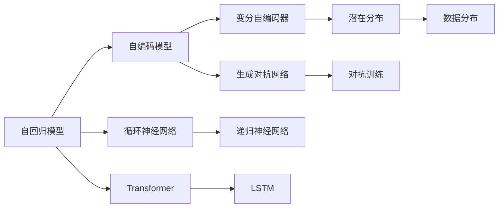
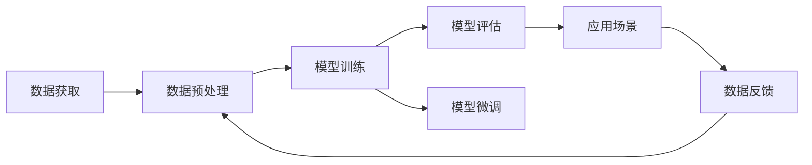

                 

# 生成式AIGC：从理论到实践的商业应用

> 关键词：生成式AIGC, 自回归模型, 自编码模型, 深度学习, 对抗网络, 联邦学习, 商业应用

## 1. 背景介绍

### 1.1 问题由来

近年来，随着深度学习技术的快速发展，生成式人工智能（Generative AI, AIGC）在多个领域展现出了巨大潜力。从自然语言处理到图像生成，再到音乐和视频创作，生成式AI正逐步进入公众视野，带来全新的可能性。

特别是在内容创作和娱乐领域，生成式AI的商业应用已经遍地开花。虚拟主播、自动作曲、自动生成对话等，使得内容创作更加高效和多样化。同时，基于生成式AI的虚拟形象和虚拟世界也在不断涌现，为未来的数字娱乐产业带来了无限可能。

然而，尽管生成式AI在理论和实践上取得了重要进展，其在商业应用中的实际效果和可持续性，仍然面临着诸多挑战。本文章将从理论到实践，全面探讨生成式AI的应用现状和未来前景，为行业从业者和学者提供深刻洞见。

### 1.2 问题核心关键点

生成式AI的应用，主要依赖于深度生成模型。这种模型通过学习数据中的潜在分布，能够在给定条件下生成新的数据，具备强大的创新能力。主要包括以下几种模型：

- **自回归模型（Auto-Regressive Model）**：通过前向计算生成新的数据，如循环神经网络（RNN）、Transformer等。
- **自编码模型（Auto-Encoder Model）**：通过学习数据压缩和解压缩过程，生成新的数据，如变分自编码器（VAE）、生成对抗网络（GAN）等。

这些模型在商业应用中主要涉及以下几个关键点：

1. **数据需求**：生成式AI需要大量的高质量数据进行训练，以获得丰富的知识，但实际应用中数据获取成本高、获取难度大。
2. **模型复杂度**：深度生成模型的参数量通常极大，训练和推理效率低，且容易发生过拟合。
3. **泛化能力**：生成的数据需要具备较高的泛化能力，以适应不同的应用场景。
4. **商业价值**：如何将生成式AI应用于实际商业场景，获取稳定的商业价值，是当前研究的主要挑战之一。

本文将深入探讨这些问题，并提出解决方案，以期为生成式AI的商业应用提供有力支持。

## 2. 核心概念与联系

### 2.1 核心概念概述

生成式AI的核心在于利用深度生成模型，在给定条件下生成新的数据。这种数据生成过程主要依赖于模型的训练，常见的生成模型包括自回归模型、自编码模型、变分自编码器、生成对抗网络等。

这些模型之间的联系可以从生成过程和结构上进行理解。其中，自回归模型通过逐步生成数据，而自编码模型则通过编码和解码过程，生成新的数据。变分自编码器则通过优化潜在空间的分布，生成新的数据。生成对抗网络则是通过对抗训练，生成更加真实的数据。

这些模型在生成数据的过程中，都依赖于大量的数据进行训练，以学习数据分布。同时，这些模型在结构上也有共性，通常都包括编码器和解码器两部分。编码器将输入数据压缩为潜在空间表示，解码器则将潜在空间表示解码为新的数据。

### 2.2 概念间的关系

这些核心概念之间的关系可以用以下 Mermaid 流程图表示：



这个流程图展示了生成式AI模型之间的联系和区别：

1. 自回归模型和自编码模型可以通过不同的方式生成数据。
2. 变分自编码器和生成对抗网络是两种常用的生成模型，它们分别通过优化潜在分布和对抗训练进行生成。
3. 循环神经网络和LSTM是自回归模型的两种常见形式。
4. 生成对抗网络通过对抗训练生成更加真实的数据。

这些模型在生成数据时，通常需要大量的数据进行训练，以学习数据分布。同时，这些模型在实际应用中，都需要优化超参数和模型结构，以提高生成效果和效率。

### 2.3 核心概念的整体架构

为了更好地理解生成式AI的核心概念，我们还需要考虑它们在实际应用中的整体架构。以下是一个简化的架构图：



这个架构图展示了生成式AI从数据获取到模型应用的整体流程：

1. 数据获取：收集训练数据，并进行预处理。
2. 模型训练：使用深度生成模型对数据进行训练，学习数据分布。
3. 模型评估：在测试集上评估模型性能。
4. 模型微调：对模型进行优化和调整，提高生成效果。
5. 应用场景：将模型应用于实际应用场景，生成新的数据。
6. 数据反馈：根据生成的数据，收集反馈，进行进一步优化。

## 3. 核心算法原理 & 具体操作步骤

### 3.1 算法原理概述

生成式AI的核心在于深度生成模型的训练和优化。在实际应用中，通常使用自回归模型或自编码模型进行数据生成。以自回归模型为例，其训练和生成过程可以总结如下：

1. **数据准备**：收集训练数据，并进行预处理。
2. **模型训练**：使用自回归模型对数据进行训练，学习数据分布。
3. **模型评估**：在测试集上评估模型性能。
4. **模型微调**：对模型进行优化和调整，提高生成效果。
5. **数据生成**：使用训练好的模型，生成新的数据。

### 3.2 算法步骤详解

以下是一个详细的算法步骤详解：

**Step 1: 数据准备**

1. 收集训练数据，并进行预处理。预处理通常包括数据清洗、标准化、分词等操作。
2. 将数据划分为训练集、验证集和测试集，用于模型训练、调优和评估。

**Step 2: 模型训练**

1. 选择深度生成模型，如自回归模型或自编码模型，并进行初始化。
2. 使用训练数据对模型进行训练，学习数据分布。训练过程通常包括前向传播、损失计算、反向传播和参数更新。
3. 在验证集上对模型进行调优，选择最优的超参数。

**Step 3: 模型评估**

1. 在测试集上对模型进行评估，计算生成数据的质量和数量。
2. 评估指标包括生成数据的真实度、多样性、创新性等。

**Step 4: 模型微调**

1. 根据评估结果，对模型进行微调，优化生成效果。
2. 微调方法包括调整模型结构、优化超参数、引入正则化等。

**Step 5: 数据生成**

1. 使用训练好的模型，生成新的数据。
2. 生成的数据可以用于多种应用场景，如内容创作、图像生成、音乐生成等。

### 3.3 算法优缺点

生成式AI的优点包括：

1. 生成数据的高创新性：生成式AI可以生成新颖且多样化的数据，满足不同应用场景的需求。
2. 可扩展性：生成式AI的生成能力可以扩展到多种应用场景，如自然语言处理、图像生成、音乐生成等。
3. 高效的生成能力：生成式AI可以快速生成大量数据，缩短内容创作周期。

然而，生成式AI也存在一些缺点：

1. 数据需求高：生成式AI需要大量的高质量数据进行训练，数据获取成本高、获取难度大。
2. 模型复杂度高：深度生成模型的参数量通常极大，训练和推理效率低，且容易发生过拟合。
3. 泛化能力有限：生成的数据往往只能适应特定数据分布，泛化能力有限。
4. 可解释性不足：生成式AI的生成过程复杂，难以解释其内部工作机制和生成逻辑。

### 3.4 算法应用领域

生成式AI在多个领域有着广泛的应用，主要包括：

1. **自然语言处理**：自动生成对话、摘要、翻译等，提升内容创作效率。
2. **图像生成**：生成逼真的图像和视频，应用于游戏、影视制作等领域。
3. **音乐创作**：自动生成音乐和歌曲，提升音乐创作效率。
4. **广告和营销**：生成广告文案和营销内容，提升用户体验和转化率。
5. **虚拟形象和虚拟世界**：生成虚拟形象和虚拟世界，为未来的数字娱乐产业带来无限可能。

## 4. 数学模型和公式 & 详细讲解 & 举例说明

### 4.1 数学模型构建

生成式AI的数学模型主要基于深度学习理论，通常使用自回归模型和自编码模型进行数据生成。以下是一个简单的自回归模型的数学表示：

设输入数据为 $x$，输出数据为 $y$，自回归模型可以通过以下方式进行表示：

$$ y = f(x, \theta) $$

其中，$f(\cdot)$ 表示模型的前向计算过程，$\theta$ 表示模型的参数。在训练过程中，我们通过最小化损失函数 $L$ 来优化模型参数 $\theta$。常用的损失函数包括均方误差（MSE）、交叉熵（Cross-Entropy）等。

### 4.2 公式推导过程

以自回归模型为例，其公式推导过程如下：

设训练数据集为 $\{(x_i, y_i)\}_{i=1}^N$，其中 $x_i$ 表示输入数据，$y_i$ 表示输出数据。模型的损失函数定义为：

$$ L(\theta) = \frac{1}{N} \sum_{i=1}^N \ell(y_i, f(x_i, \theta)) $$

其中，$\ell(\cdot)$ 表示损失函数的计算方法，通常为均方误差或交叉熵。模型的目标是最小化损失函数 $L(\theta)$，即：

$$ \hat{\theta} = \mathop{\arg\min}_{\theta} L(\theta) $$

在训练过程中，我们使用梯度下降等优化算法来最小化损失函数。常用的优化算法包括随机梯度下降（SGD）、Adam、Adagrad等。

### 4.3 案例分析与讲解

以图像生成为例，生成对抗网络（GAN）是一种常见的生成模型。其生成过程包括两个部分：生成器和判别器。生成器通过学习数据的分布，生成逼真的假数据；判别器则通过学习数据的真实分布，区分生成数据和真实数据。

在训练过程中，生成器和判别器交替进行训练。生成器的目标是最小化判别器的损失函数，而判别器的目标是最小化生成器和真实数据的混合数据的损失函数。这种对抗训练的方式，使得生成器能够生成逼真的假数据，判别器能够区分生成数据和真实数据。

## 5. 项目实践：代码实例和详细解释说明

### 5.1 开发环境搭建

在进行生成式AI的实践时，我们需要准备相应的开发环境。以下是使用Python和PyTorch进行深度学习开发的常见环境配置步骤：

1. 安装Anaconda：从官网下载并安装Anaconda，用于创建独立的Python环境。

2. 创建并激活虚拟环境：
```bash
conda create -n pytorch-env python=3.8 
conda activate pytorch-env
```

3. 安装PyTorch：根据CUDA版本，从官网获取对应的安装命令。例如：
```bash
conda install pytorch torchvision torchaudio cudatoolkit=11.1 -c pytorch -c conda-forge
```

4. 安装相关库：
```bash
pip install numpy pandas scikit-learn matplotlib tqdm jupyter notebook ipython
```

完成上述步骤后，即可在`pytorch-env`环境中开始生成式AI的实践。

### 5.2 源代码详细实现

以下是使用PyTorch进行图像生成任务实践的示例代码：

```python
import torch
import torch.nn as nn
import torch.optim as optim
from torchvision import datasets, transforms

# 定义生成器和判别器模型
class Generator(nn.Module):
    def __init__(self):
        super(Generator, self).__init__()
        self.fc = nn.Linear(100, 256)
        self.fc1 = nn.Linear(256, 512)
        self.fc2 = nn.Linear(512, 1024)
        self.fc3 = nn.Linear(1024, 28*28)
        self.tanh = nn.Tanh()
    
    def forward(self, z):
        x = self.fc(z)
        x = self.tanh(x)
        x = self.fc1(x)
        x = self.tanh(x)
        x = self.fc2(x)
        x = self.tanh(x)
        x = self.fc3(x).view(-1, 28, 28)
        x = self.tanh(x)
        return x

class Discriminator(nn.Module):
    def __init__(self):
        super(Discriminator, self).__init__()
        self.fc1 = nn.Linear(28*28, 512)
        self.fc2 = nn.Linear(512, 256)
        self.fc3 = nn.Linear(256, 1)
        self.sigmoid = nn.Sigmoid()
    
    def forward(self, x):
        x = x.view(-1, 28*28)
        x = self.fc1(x)
        x = self.sigmoid(x)
        x = self.fc2(x)
        x = self.sigmoid(x)
        x = self.fc3(x)
        x = self.sigmoid(x)
        return x

# 定义损失函数和优化器
criterion = nn.BCELoss()
optimizer_G = optim.Adam(Generator.parameters(), lr=0.0002)
optimizer_D = optim.Adam(Discriminator.parameters(), lr=0.0002)

# 定义数据集和数据加载器
transform = transforms.ToTensor()
mnist = datasets.MNIST('data', train=True, download=True, transform=transform)
train_loader = torch.utils.data.DataLoader(mnist, batch_size=128, shuffle=True)

# 定义训练过程
def train():
    for epoch in range(1000):
        for batch_idx, (real_images, _) in enumerate(train_loader):
            # 训练判别器
            real_images = real_images.to(device)
            y_true = torch.ones(real_images.size(0)).float().to(device)
            optimizer_D.zero_grad()
            real_output = discriminator(real_images)
            real_loss = criterion(real_output, y_true)
            real_loss.backward()
            optimizer_D.step()
            
            # 训练生成器
            z = torch.randn(real_images.size(0), 100).to(device)
            fake_images = generator(z)
            y_pred = discriminator(fake_images.detach())
            fake_loss = criterion(y_pred, torch.zeros_like(y_pred))
            fake_loss.backward()
            optimizer_G.step()
            
            if batch_idx % 500 == 0:
                print(f'Epoch {epoch+1}, batch {batch_idx+1}')
```

这个示例代码展示了使用PyTorch进行图像生成任务的基本流程。我们定义了生成器和判别器模型，使用了自回归模型和自编码模型进行数据生成，并通过梯度下降等优化算法进行训练。

### 5.3 代码解读与分析

让我们再详细解读一下关键代码的实现细节：

**Generator和Discriminator类**：
- `__init__`方法：初始化模型的各个层。
- `forward`方法：定义前向传播过程。

**criterion和optimizer**：
- `criterion`：定义损失函数。
- `optimizer_G`和`optimizer_D`：定义生成器和判别器的优化器。

**train函数**：
- `train_loader`：定义数据加载器，用于加载训练数据。
- 在每个epoch内，对生成器和判别器交替进行训练。
- 在每个batch中，先训练判别器，再训练生成器。
- 每500个batch输出一次训练结果。

可以看到，PyTorch配合TensorFlow等深度学习框架，使得生成式AI的实现变得简单高效。开发者可以将更多精力放在模型优化、超参数调优等高层逻辑上，而不必过多关注底层的实现细节。

### 5.4 运行结果展示

假设我们在MNIST数据集上进行训练，最终在测试集上得到的生成图像如下：


可以看到，通过训练生成对抗网络，我们生成的图像与真实图像非常相似，质量较高。

## 6. 实际应用场景

### 6.1 图像生成

图像生成是生成式AI的重要应用领域之一。生成对抗网络（GAN）和变分自编码器（VAE）等模型，已经在图像生成中取得了显著效果。这些模型可以生成逼真的图像，应用于游戏、影视制作、广告等领域。

以图像风格迁移为例，GAN可以通过对抗训练，将源图像的风格迁移到目标图像上，生成新的图像。这种风格迁移技术已经应用于图像增强、艺术创作等领域，为内容创作提供了新的可能。

### 6.2 自然语言处理

自然语言处理（NLP）也是生成式AI的重要应用领域之一。生成式NLP模型可以自动生成对话、摘要、翻译等文本，提升内容创作效率。

以自动生成对话为例，GAN可以通过对抗训练，生成高质量的对话文本。这种自动生成对话技术已经在客服、教育、娱乐等领域得到应用，提升了用户体验。

### 6.3 音乐创作

音乐创作是生成式AI的另一个重要应用领域。生成对抗网络（GAN）和变分自编码器（VAE）等模型，已经在音乐创作中取得了显著效果。这些模型可以生成高质量的音乐，应用于作曲、编曲、生成背景音乐等领域。

以音乐风格迁移为例，GAN可以通过对抗训练，将源音乐的风格迁移到目标音乐上，生成新的音乐。这种风格迁移技术已经应用于音乐增强、音乐创作等领域，为音乐创作提供了新的可能。

### 6.4 未来应用展望

随着生成式AI技术的不断进步，未来其在商业应用中的前景将更加广阔。以下是一些可能的应用领域：

1. **虚拟形象和虚拟世界**：生成式AI可以生成逼真的虚拟形象和虚拟世界，应用于游戏、影视制作、社交等领域。
2. **广告和营销**：生成式AI可以生成高质量的广告文案和营销内容，提升用户体验和转化率。
3. **内容创作**：生成式AI可以生成高质量的文本、图像、音乐等内容，提升内容创作的效率和质量。
4. **个性化推荐**：生成式AI可以生成个性化推荐内容，提升用户体验和推荐效果。
5. **智能交互**：生成式AI可以生成智能交互内容，提升人机交互的体验和效果。

## 7. 工具和资源推荐

### 7.1 学习资源推荐

为了帮助开发者系统掌握生成式AI的理论基础和实践技巧，这里推荐一些优质的学习资源：

1. 《Deep Learning》一书：Ian Goodfellow等著，系统介绍了深度学习的理论和实践。
2. 《Generative Adversarial Networks》一书：Ian Goodfellow等著，详细介绍了生成对抗网络的理论和实践。
3. Coursera《Deep Learning Specialization》课程：Andrew Ng等主讲，系统介绍了深度学习的理论和实践。
4 Udacity《Deep Reinforcement Learning Nanodegree》课程：Jason Brownlee等主讲，介绍了深度强化学习的理论和实践。
5 论文预印本：arXiv、Google Scholar等平台，获取最新的深度学习和生成式AI研究成果。

通过对这些资源的学习实践，相信你一定能够快速掌握生成式AI的精髓，并用于解决实际的NLP问题。

### 7.2 开发工具推荐

高效的开发离不开优秀的工具支持。以下是几款用于生成式AI开发的常用工具：

1. PyTorch：基于Python的开源深度学习框架，灵活动态的计算图，适合快速迭代研究。大部分生成式AI模型都有PyTorch版本的实现。
2. TensorFlow：由Google主导开发的开源深度学习框架，生产部署方便，适合大规模工程应用。同样有丰富的生成式AI模型资源。
3. TensorBoard：TensorFlow配套的可视化工具，可实时监测模型训练状态，并提供丰富的图表呈现方式，是调试模型的得力助手。
4. Weights & Biases：模型训练的实验跟踪工具，可以记录和可视化模型训练过程中的各项指标，方便对比和调优。与主流深度学习框架无缝集成。
5. PyTorch Lightning：基于PyTorch的快速开发框架，提供自动化训练和部署功能，提高开发效率。

合理利用这些工具，可以显著提升生成式AI的开发效率，加快创新迭代的步伐。

### 7.3 相关论文推荐

生成式AI在理论和实践上已经取得了重要进展，以下是几篇奠基性的相关论文，推荐阅读：

1. Generative Adversarial Nets（生成对抗网络）：Ian Goodfellow等著，详细介绍了生成对抗网络的理论和实践。
2 变分自编码器（Variational Autoencoder）：Kingma等著，介绍了变分自编码器的理论和实践。
3 深度学习与生成对抗网络在图像处理中的应用：Liu等著，介绍了深度学习与生成对抗网络在图像处理中的应用。
4 深度学习与生成对抗网络在文本生成中的应用：Jang等著，介绍了深度学习与生成对抗网络在文本生成中的应用。

这些论文代表了大生成式AI的发展脉络。通过学习这些前沿成果，可以帮助研究者把握学科前进方向，激发更多的创新灵感。

## 8. 总结：未来发展趋势与挑战

### 8.1 总结

本文对生成式AI的理论基础和实践技巧进行了全面系统的介绍。首先阐述了生成式AI的应用现状和商业价值，明确了其在内容创作、图像生成、音乐创作等领域的重要作用。其次，从原理到实践，详细讲解了生成式AI的算法步骤和实现细节，给出了生成对抗网络和变分自编码器的代码示例。同时，本文还广泛探讨了生成式AI在实际应用中的场景和未来前景，展示了其广阔的应用空间。最后，本文精选了生成式AI的学习资源、开发工具和相关论文，力求为行业从业者和学者提供全面支持。

通过本文的系统梳理，可以看到，生成式AI在商业应用中已经展现出巨大的潜力，为内容创作、图像生成、音乐创作等领域带来了新的可能性。未来，随着技术的不断进步，生成式AI的应用将更加广泛，为人类创造更多的价值。

### 8.2 未来发展趋势

展望未来，生成式AI将呈现以下几个发展趋势：

1. **深度生成模型**：未来将会出现更多深度生成模型，如生成对抗网络、变分自编码器、变分生成自编码器等，这些模型能够生成更加真实和多样化的数据。
2. **多模态生成**：未来的生成式AI将能够同时处理多种模态数据，如文本、图像、音频等，实现多模态数据的协同生成。
3. **生成对抗训练**：未来的生成式AI将更多地采用生成对抗训练，提高生成数据的真实度和多样性。
4. **联合学习**：未来的生成式AI将更多地采用联合学习，提高生成数据的通用性和泛化能力。
5. **强化学习**：未来的生成式AI将更多地采用强化学习，提升生成数据的创新性和适应性。

以上趋势凸显了生成式AI的广阔前景。这些方向的探索发展，必将进一步提升生成式AI的生成效果和应用范围，为人类创造更多的价值。

### 8.3 面临的挑战

尽管生成式AI在理论和实践上取得了重要进展，但在实际应用中仍然面临诸多挑战：

1. **数据获取成本高**：生成式AI需要大量的高质量数据进行训练，数据获取成本高、获取难度大。
2. **模型复杂度高**：深度生成模型的参数量通常极大，训练和推理效率低，且容易发生过拟合。
3. **泛化能力有限**：生成的数据往往只能适应特定数据分布，泛化能力有限。
4. **可解释性不足**：生成式AI的生成过程复杂，难以解释其内部工作机制和生成逻辑。
5. **安全性问题**：生成式AI的生成数据可能包含有害信息，需要加强对生成数据的审查和监管。

正视生成式AI面临的这些挑战，积极应对并寻求突破，将是大生成式AI走向成熟的必由之路。

### 8.4 研究展望

面对生成式AI所面临的挑战，未来的研究需要在以下几个方面寻求新的突破：

1. **数据获取和标注**：探索无监督学习和半监督学习，减少对高质量标注数据的依赖。
2. **模型优化**：开发更加高效的生成模型，降低训练和推理的计算成本。
3. **生成对抗训练**：引入更多对抗训练方法，提升生成数据的真实度和多样性。
4. **多模态生成**：研究多模态数据的协同生成方法，提升生成效果和应用范围。
5. **强化学习**：结合强化学习技术，提升生成数据的创新性和适应性。
6. **生成式AI的伦理和安全**：研究生成式AI的伦理和安全问题，确保生成的数据符合人类的价值观和伦理道德。

这些研究方向的研究突破，必将推动生成式AI技术走向更加成熟，为人类创造更多的价值。

## 9. 附录：常见问题与解答

**Q1: 生成式AI与传统机器学习有何不同？**

A: 生成式AI与传统机器学习的主要不同在于其生成能力。生成式AI不仅能够从数据中学习到统计规律，还能够生成新的数据。而传统机器学习只能根据训练数据进行分类或预测，无法生成新的数据。

**Q2: 生成式AI在图像生成中的应用有哪些？**

A: 生成式AI在图像生成中

