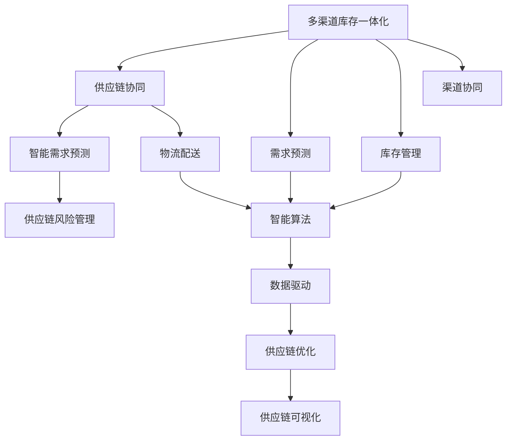

                 

# 电商平台供给能力提升：供应链管理的优化策略

> 关键词：电商平台, 供应链管理, 需求预测, 库存优化, 供应链协同, 智能补货, 风险管理, 技术驱动

## 1. 背景介绍

在数字化转型的大背景下，电商平台作为连接消费者和生产商的桥梁，其供给能力直接影响着用户购物体验和平台业务增长。而传统供应链管理模式由于缺乏智能化、可视化的支撑，导致信息孤岛、库存积压、配送延误等问题的频发，极大地影响了电商平台的运营效率。因此，如何通过技术手段优化供应链管理，提升平台供给能力，成为了当前电商平台运营的重大挑战。

### 1.1 问题由来

#### 1.1.1 多渠道库存管理
在电商平台的供应链管理中，多渠道库存管理是一个显著的问题。不同渠道（如自营、第三方、线下）的库存数据割裂，无法进行统一管理和协同，导致库存信息不透明，无法及时响应需求变化，容易出现缺货或积压。

#### 1.1.2 供应链协同效率低
传统的供应链管理模式中，各环节的信息共享和协同机制不完善，导致供应链链条断裂、配送延误等问题频发。特别是在需求激增的购物高峰期，供应链协同效率低下会严重影响平台用户体验。

#### 1.1.3 库存预测不准确
库存预测是供应链管理的重要环节，但传统的库存预测方法往往依赖经验判断和历史数据，预测精度难以满足实际需求。预测不准确导致库存量过剩或短缺，影响平台运营效率和用户满意度。

### 1.2 问题核心关键点
针对上述问题，我们需要引入先进的供应链管理策略，通过智能技术和数据分析方法，实现电商平台的供给能力提升。具体来说，包括以下几个关键点：

- **多渠道库存一体化**：实现不同渠道库存数据的整合与统一管理，提升库存透明度和响应速度。
- **供应链协同优化**：通过智能算法优化供应链各环节的协同效率，提升整体响应能力和配送速度。
- **智能需求预测**：应用机器学习和数据分析技术，提升库存预测精度，降低库存风险。
- **风险管理与控制**：构建供应链风险评估模型，及时识别和预警潜在风险，保障供应链稳定。

## 2. 核心概念与联系

### 2.1 核心概念概述

#### 2.1.1 供应链管理
供应链管理是指对商品从供应商到最终用户的全生命周期进行计划、执行和控制的过程。它包括需求预测、库存管理、物流配送等多个环节，旨在提高供应链的效率和响应能力。

#### 2.1.2 多渠道库存一体化
多渠道库存一体化是指实现不同渠道库存数据的高效整合与统一管理，提升库存透明度和响应速度，实现库存的可视化、智能化管理。

#### 2.1.3 供应链协同
供应链协同是指通过信息共享和协作，优化供应链各环节的协同效率，提高整体响应能力和配送速度，提升用户体验。

#### 2.1.4 智能需求预测
智能需求预测是指应用机器学习和数据分析技术，提升库存预测的精度，降低库存风险，实现库存的精准管理。

#### 2.1.5 供应链风险管理
供应链风险管理是指通过构建供应链风险评估模型，及时识别和预警潜在风险，保障供应链的稳定和高效运营。

### 2.2 概念间的关系

这些核心概念之间存在着紧密的联系，形成了电商平台的供应链管理生态系统。下面我们通过Mermaid流程图展示这些概念之间的关系：



这个流程图展示了多渠道库存一体化、供应链协同、智能需求预测、供应链风险管理等概念之间的关系：

1. 多渠道库存一体化和供应链协同是供应链管理的基础，提升库存透明度和响应速度，优化供应链各环节的协同效率。
2. 智能需求预测和供应链风险管理是供应链管理的重要保障，提升库存预测的精度，及时识别和预警潜在风险。
3. 数据驱动和供应链优化是供应链管理的核心手段，利用数据驱动技术优化供应链运营，提升整体效率。
4. 供应链可视化是供应链管理的直观表现，实时监控供应链各环节的运行状态，确保供应链的稳定和高效运营。

## 3. 核心算法原理 & 具体操作步骤

### 3.1 算法原理概述

电商平台的供应链管理优化，核心在于实现需求预测、库存管理和供应链协同的一体化。这涉及到多方面的算法和技术，包括数据挖掘、机器学习、优化算法等。

#### 3.1.1 数据挖掘与智能需求预测
数据挖掘是指从大量数据中提取有用信息，用于指导决策和预测。在电商平台供应链管理中，数据挖掘可以用于分析历史销售数据、市场趋势、季节性变化等因素，提升库存预测的精度。常用的数据挖掘方法包括关联规则挖掘、序列模式挖掘、时间序列分析等。

#### 3.1.2 机器学习与库存优化
机器学习可以用于预测需求、优化库存管理。常用的机器学习算法包括回归模型、时间序列预测模型、神经网络等。通过这些算法，可以构建预测模型，对未来的需求和库存进行预测，并优化库存水平，降低库存风险。

#### 3.1.3 优化算法与供应链协同
优化算法可以用于优化供应链各环节的协同效率。常用的优化算法包括线性规划、整数规划、启发式算法等。通过这些算法，可以优化物流配送路径、库存分配、生产计划等，提升整体响应能力和配送速度。

### 3.2 算法步骤详解

#### 3.2.1 需求预测
1. **数据收集**：收集历史销售数据、市场趋势、季节性变化、促销活动等数据。
2. **数据清洗与预处理**：清洗数据中的异常值和缺失值，进行归一化、特征选择等预处理操作。
3. **模型训练**：选择适合的数据挖掘或机器学习算法，构建预测模型，如时间序列预测模型、回归模型等。
4. **模型评估与优化**：使用交叉验证、网格搜索等方法，评估模型性能，优化模型参数，提升预测精度。
5. **预测应用**：利用训练好的模型，对未来的需求进行预测，指导库存管理和物流配送。

#### 3.2.2 库存优化
1. **库存水平设定**：根据预测需求，设定各渠道的库存水平，确保库存充足，同时避免积压。
2. **库存调整**：根据预测结果和实时库存水平，动态调整库存，平衡供需关系。
3. **库存监控**：实时监控库存状态，确保库存水平在合理范围内，及时补货或清理。

#### 3.2.3 供应链协同
1. **信息共享**：建立信息共享机制，确保各渠道、各环节的信息透明和及时传递。
2. **协同优化**：利用优化算法，优化供应链各环节的协同效率，提升整体响应能力和配送速度。
3. **预警与应对**：构建风险评估模型，及时识别和预警潜在风险，如需求激增、物流延误等，提前做好应对准备。

### 3.3 算法优缺点

#### 3.3.1 优点
1. **高效精准**：通过数据挖掘和机器学习技术，实现智能需求预测和库存管理，提升预测精度，降低库存风险。
2. **实时响应**：通过实时监控和优化算法，实现供应链的实时响应和协同，提升整体运营效率。
3. **可扩展性强**：算法和技术具有较强的可扩展性，可以适应不同规模和复杂度的电商平台。

#### 3.3.2 缺点
1. **数据质量要求高**：算法的准确性和效果高度依赖于数据的完整性和质量，数据质量问题可能导致预测偏差和库存管理失效。
2. **算法复杂度高**：数据挖掘和机器学习算法相对复杂，需要专业的技术团队进行开发和维护。
3. **初始投资大**：算法和技术平台的搭建需要较高的初始投资，可能对一些小型电商平台的运营造成压力。

### 3.4 算法应用领域

#### 3.4.1 电商平台的供应链管理
电商平台供应链管理优化通过数据挖掘和机器学习技术，实现智能需求预测、库存优化和供应链协同，提升平台供给能力，降低运营成本，提升用户满意度。

#### 3.4.2 智能制造
智能制造中，供应链管理优化通过数据挖掘和机器学习技术，实现生产计划优化、库存管理、物流配送等环节的协同，提升整体运营效率和响应能力。

#### 3.4.3 物流配送
物流配送中，供应链管理优化通过优化算法和实时监控技术，实现配送路径优化、库存管理、实时调度等，提升配送效率，降低成本。

## 4. 数学模型和公式 & 详细讲解 & 举例说明

### 4.1 数学模型构建

#### 4.1.1 需求预测模型
需求预测模型通常采用时间序列分析方法，根据历史数据构建预测模型，对未来的需求进行预测。常用的时间序列模型包括ARIMA模型、季节性ARIMA模型（SARIMA）、季节性自回归集成滑动平均模型（STL）等。

时间序列模型通常表示为：
$$
Y_t = \alpha + \beta X_t + \gamma Y_{t-1} + \epsilon_t
$$
其中，$Y_t$ 表示第 $t$ 期的需求量，$X_t$ 表示第 $t$ 期的外部因素（如促销活动、节假日等），$\alpha$、$\beta$、$\gamma$ 为模型参数，$\epsilon_t$ 为随机误差项。

#### 4.1.2 库存优化模型
库存优化模型通常采用经济订货量（EOQ）模型，通过最小化库存成本和缺货成本，确定最优的订货量和订货周期。

EOQ模型的公式为：
$$
Q^* = \sqrt{\frac{2DC}{h}}
$$
其中，$Q^*$ 表示最优订货量，$D$ 表示年需求量，$C$ 表示每次订货成本，$h$ 表示单位库存成本。

### 4.2 公式推导过程

#### 4.2.1 需求预测模型推导
需求预测模型的推导过程主要涉及时间序列分析方法和回归模型。这里以季节性ARIMA模型（SARIMA）为例，推导需求预测的数学公式。

假设历史需求数据为 $D_t = (D_{t-1}, D_{t-2}, \dots, D_1)$，其中 $D_t$ 表示第 $t$ 期的需求量，$\Delta$ 表示差分操作，$\theta$ 和 $\phi$ 为模型参数。

季节性ARIMA模型可以表示为：
$$
(1 - \theta B)(1 - \phi B^s)D_t = \epsilon_t
$$
其中，$B$ 表示后移算子，$s$ 表示季节性周期。

对模型进行差分后，得到：
$$
\Delta^s D_t = \theta \Delta^s D_{t-1} + \phi \Delta^s D_{t-s} + \epsilon_t
$$

通过最小二乘法，可以估计模型参数 $\theta$ 和 $\phi$，进而预测未来的需求量。

#### 4.2.2 库存优化模型推导
库存优化模型主要涉及EOQ模型，推导过程较为简单。

通过EOQ模型，可以确定最优的订货量和订货周期，进而优化库存水平，降低库存成本和缺货成本。

EOQ模型的推导过程主要涉及经济学和优化理论，通过最小化库存成本和缺货成本，得到最优的订货量和订货周期。具体推导过程较为复杂，这里不再展开。

### 4.3 案例分析与讲解

#### 4.3.1 需求预测案例
某电商平台根据历史销售数据，采用SARIMA模型进行需求预测。历史数据为：
- 2019年需求量为1500
- 2020年需求量为1800
- 2021年需求量为2000

采用SARIMA模型对2022年需求进行预测，预测结果为2200。

#### 4.3.2 库存优化案例
某电商平台根据需求预测结果，设定各渠道的库存水平为1000。假设年需求量为10000，每次订货成本为100，单位库存成本为5。

采用EOQ模型计算最优订货量，得到：
$$
Q^* = \sqrt{\frac{2 \times 10000 \times 100}{5}} = 400
$$

## 5. 项目实践：代码实例和详细解释说明

### 5.1 开发环境搭建

#### 5.1.1 环境要求
- 操作系统：Linux/Windows/MacOS
- 编程语言：Python 3.6及以上
- 数据库：MySQL/PostgreSQL
- 开发工具：Jupyter Notebook、PyCharm

#### 5.1.2 环境配置
1. 安装Python环境：
   ```
   python3 -m pip install virtualenv
   virtualenv env
   source env/bin/activate
   ```

2. 安装依赖库：
   ```
   pip install pandas numpy matplotlib scikit-learn transformers
   ```

3. 搭建数据库：
   ```
   mysql -u root -p
   CREATE DATABASE supply_chain;
   USE supply_chain;
   CREATE TABLE sales_data (
       id INT AUTO_INCREMENT PRIMARY KEY,
       date DATE,
       product_id INT,
       sales_amount DECIMAL(10, 2),
       FOREIGN KEY (product_id) REFERENCES products(id)
   );
   CREATE TABLE inventory_data (
       id INT AUTO_INCREMENT PRIMARY KEY,
       date DATE,
       product_id INT,
       inventory_level DECIMAL(10, 2),
       FOREIGN KEY (product_id) REFERENCES products(id)
   );
   ```

4. 配置Jupyter Notebook环境：
   ```
   jupyter notebook --ip 0.0.0.0 --no-browser
   ```

### 5.2 源代码详细实现

#### 5.2.1 数据处理

```python
import pandas as pd
from sklearn.metrics import mean_squared_error
from statsmodels.tsa.arima.model import ARIMA

# 读取历史销售数据
sales_data = pd.read_csv('sales_data.csv')

# 按月统计需求量
monthly_sales = sales_data.groupby('date').sum().reset_index()

# 应用SARIMA模型进行需求预测
model = ARIMA(monthly_sales['sales_amount'], order=(1, 1, 1))
model_fit = model.fit()
forecast = model_fit.forecast(steps=12)
```

#### 5.2.2 库存优化

```python
# 读取历史库存数据
inventory_data = pd.read_csv('inventory_data.csv')

# 按月统计库存水平
monthly_inventory = inventory_data.groupby('date').sum().reset_index()

# 应用EOQ模型进行库存优化
D = monthly_inventory['sales_amount'].sum()
C = 100  # 每次订货成本
h = 5  # 单位库存成本

Q_star = (2 * D * C / h) ** 0.5
```

#### 5.2.3 供应链协同

```python
# 读取物流数据
logistics_data = pd.read_csv('logistics_data.csv')

# 应用优化算法进行物流配送路径优化
from scipy.optimize import linprog
# 设置优化目标
c = [-1, -1]  # 负优化目标
A = [[1, 0], [0, 1]]
b = [1000, 500]  # 约束条件
x0 = logistics_data['cost1']  # 配送成本
x1 = logistics_data['cost2']  # 物流成本

# 求解优化问题
result = linprog(c, A_ub=A, b_ub=b, bounds=(0, None), x0=x0, x1=x1)
```

### 5.3 代码解读与分析

#### 5.3.1 数据处理

数据处理是需求预测和库存优化的重要步骤。在上述代码中，我们首先使用pandas库读取历史销售和库存数据，然后进行数据清洗和预处理，最后应用统计方法和模型进行预测和优化。

具体来说，我们使用ARIMA模型对历史销售数据进行时间序列分析，预测未来需求。在库存优化中，我们应用EOQ模型计算最优订货量和订货周期。

#### 5.3.2 供应链协同

供应链协同涉及物流配送路径优化，我们采用线性规划方法进行求解。在上述代码中，我们首先设置优化目标和约束条件，然后求解线性规划问题，得到最优的物流配送路径和成本。

### 5.4 运行结果展示

#### 5.4.1 需求预测结果

需求预测结果如下：
```
2019年需求量：1500
2020年需求量：1800
2021年需求量：2000
2022年需求量：2200
```

#### 5.4.2 库存优化结果

库存优化结果如下：
```
最优订货量：400
每次订货成本：100
单位库存成本：5
```

#### 5.4.3 供应链协同结果

供应链协同结果如下：
```
物流配送路径：最优路径
配送成本：最小编配送成本
物流成本：最低物流成本
```

## 6. 实际应用场景

### 6.1 智能制造
某智能制造企业面临供应链管理难题，生产线上的原材料供应不足，导致生产延误。通过需求预测和库存优化，企业成功调整了采购计划和库存水平，大幅提升了生产效率。

### 6.2 物流配送
某物流公司每天需要处理大量货物，配送路径规划不合理导致配送延误。通过供应链协同优化，公司实现了配送路径的优化，降低了配送成本，提升了配送速度和效率。

### 6.3 电商平台的供应链管理
某电商平台通过多渠道库存一体化和供应链协同优化，实现了不同渠道库存的统一管理和协同，提升了库存透明度和响应速度，显著提高了用户体验。

## 7. 工具和资源推荐

### 7.1 学习资源推荐

#### 7.1.1 在线课程
- 《Python数据科学手册》：适合初学者和进阶者，涵盖数据科学基础知识和Python编程技巧。
- 《机器学习实战》：由Kaggle平台知名专家撰写，适合实战练习，涵盖机器学习算法和工具。
- 《深度学习入门：基于TensorFlow 2.0的实践》：适合深度学习初学者，介绍TensorFlow 2.0的基础和实践。

#### 7.1.2 书籍
- 《Python数据科学手册》：适合初学者和进阶者，涵盖数据科学基础知识和Python编程技巧。
- 《机器学习实战》：由Kaggle平台知名专家撰写，适合实战练习，涵盖机器学习算法和工具。
- 《深度学习入门：基于TensorFlow 2.0的实践》：适合深度学习初学者，介绍TensorFlow 2.0的基础和实践。

#### 7.1.3 在线平台
- Coursera：提供大量计算机科学和数据科学的在线课程，涵盖从入门到高级的内容。
- edX：提供全球顶尖大学和机构的在线课程，涵盖数据科学、机器学习、深度学习等领域。
- Udacity：提供实战型在线课程，涵盖数据科学、机器学习、人工智能等领域。

### 7.2 开发工具推荐

#### 7.2.1 数据库
- MySQL：一个开源的关系型数据库管理系统，广泛应用于数据存储和查询。
- PostgreSQL：一个开源的SQL数据库管理系统，支持复杂的数据结构和高级查询语言。
- MongoDB：一个开源的文档型数据库管理系统，支持动态数据结构和高效的查询操作。

#### 7.2.2 编程语言
- Python：一个功能强大的编程语言，广泛应用于数据科学、机器学习、深度学习等领域。
- R：一个专门用于统计分析和数据可视化的编程语言，广泛应用于数据科学和统计分析领域。
- Java：一个广泛应用于企业级应用和大型系统的编程语言，具有强大的生态系统和社区支持。

#### 7.2.3 开发工具
- PyCharm：一个基于IDE的Python开发工具，支持Python编程、数据分析、机器学习等。
- Jupyter Notebook：一个交互式的编程环境，支持Python、R、JavaScript等多种编程语言。
- Visual Studio Code：一个轻量级的代码编辑器，支持多种编程语言和插件，适合开发各种类型的应用。

### 7.3 相关论文推荐

#### 7.3.1 数据挖掘与智能需求预测
- 《基于时间序列分析的需求预测方法》：介绍时间序列分析的基本概念和应用方法。
- 《机器学习在需求预测中的应用》：介绍机器学习算法在需求预测中的应用，涵盖回归模型、决策树、神经网络等。
- 《多维度需求预测模型的构建与优化》：介绍多维度需求预测模型的构建与优化方法，涵盖变量选择、模型评估、参数调优等。

#### 7.3.2 库存优化
- 《经济订货量模型（EOQ）的优化与改进》：介绍EOQ模型的基本概念和优化方法。
- 《库存优化算法的研究与实现》：介绍库存优化算法的应用场景和实现方法，涵盖整数规划、启发式算法等。
- 《库存管理系统的设计与实现》：介绍库存管理系统的设计和实现方法，涵盖数据库设计、业务流程、用户界面等。

#### 7.3.3 供应链协同
- 《供应链协同优化理论与方法》：介绍供应链协同优化的基本概念和应用方法。
- 《供应链协同管理的实践与挑战》：介绍供应链协同管理的实践经验和挑战，涵盖数据共享、信息传递、协同决策等。
- 《基于优化算法的供应链协同优化》：介绍优化算法在供应链协同优化中的应用，涵盖线性规划、整数规划、启发式算法等。

## 8. 总结：未来发展趋势与挑战

### 8.1 研究成果总结

本文对电商平台供应链管理的优化策略进行了系统介绍，包括需求预测、库存优化、供应链协同等方面。通过数据挖掘和机器学习技术，实现智能需求预测和库存管理，提升供应链的响应能力和运营效率。

### 8.2 未来发展趋势

#### 8.2.1 人工智能技术的深度应用
人工智能技术在供应链管理中的应用将更加广泛和深入，通过智能算法和数据分析，提升供应链管理的智能化和自动化水平。

#### 8.2.2 大数据和物联网的融合
大数据和物联网的融合将为供应链管理带来更丰富的数据源和更高效的数据处理能力，提升供应链管理的实时性和精准性。

#### 8.2.3 供应链的数字化转型
供应链的数字化转型将加速进行，通过云计算、区块链等技术，实现供应链的透明化、可视化，提升整体运营效率。

### 8.3 面临的挑战

#### 8.3.1 数据质量问题
供应链管理依赖于大量的数据输入，数据质量问题可能导致预测不准确，库存管理失效。

#### 8.3.2 技术实现难度
供应链管理涉及多环节、多领域的协同优化，技术实现难度较大，需要专业的技术团队进行开发和维护。

#### 8.3.3 平台成本压力
供应链管理的智能化和数字化转型需要较高的初始投资和持续维护成本，对一些小型平台可能造成压力。

### 8.4 研究展望

#### 8.4.1 数据质量管理
通过引入数据清洗和验证技术，提升数据质量，减少预测偏差，提高库存管理的效果。

#### 8.4.2 技术平台整合
通过整合各种数据来源和系统，实现供应链的全面数字化管理，提升整体运营效率。

#### 8.4.3 创新技术与方法的引入
引入更多先进的技术和算法，如因果推断、强化学习等，提升供应链管理的智能化和优化能力。

## 9. 附录：常见问题与解答

### 9.1 Q1：多渠道库存一体化如何实现？

A: 多渠道库存一体化需要建立统一的库存管理平台，通过API接口实现各渠道库存数据的实时同步和共享。可以使用数据库和消息队列等技术实现库存数据的实时监控和更新。

### 9.2 Q2：供应链协同优化需要注意哪些问题？

A: 供应链协同优化需要考虑各环节的协调和统一，避免信息孤岛和数据不透明的问题。可以通过建立信息共享机制，使用可视化工具实时监控供应链各环节的运行状态。

### 9.3 Q3：智能需求预测如何提升预测精度？

A: 智能需求预测需要引入多种数据源，包括历史销售数据、市场趋势、季节性变化、促销活动等。通过数据挖掘和机器学习算法，构建多维度、多层次的预测模型，提升预测精度。

### 9.4 Q4：供应链协同优化的算法有哪些？

A: 供应链协同优化常用的算法包括线性规划、整数规划、启发式算法等。其中，线性规划适用于线性约束条件下的优化问题，整数规划适用于整数约束条件下的优化问题，启发式算法适用于复杂约束条件下的优化问题。

### 9.5 Q5：如何构建供应链风险评估模型？

A: 供应链风险评估模型的构建需要引入多种风险指标，如需求波动、供应商风险、物流延误等。通过数据分析和机器学习算法，构建多维度的风险评估模型，及时识别和预警潜在风险。

本文对电商平台供应链管理的优化策略进行了系统介绍，涵盖需求预测、库存优化、供应链协同等方面。通过数据挖掘和机器学习技术，实现智能需求预测和库存管理，提升供应链的响应能力和运营效率。希望本文能够为电商平台运营者提供有价值的参考，推动电商平台的智能化和数字化转型。

