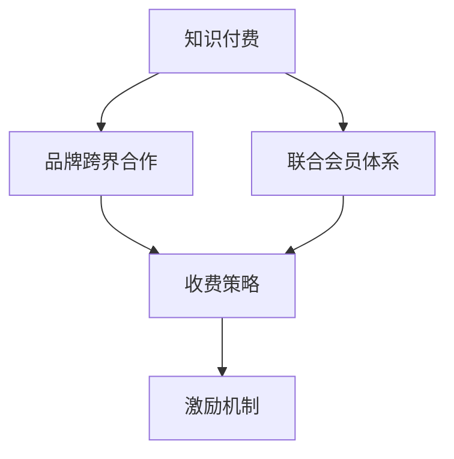
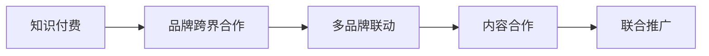
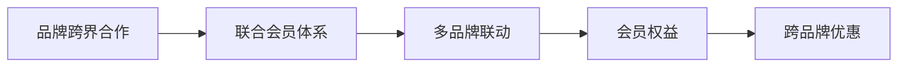
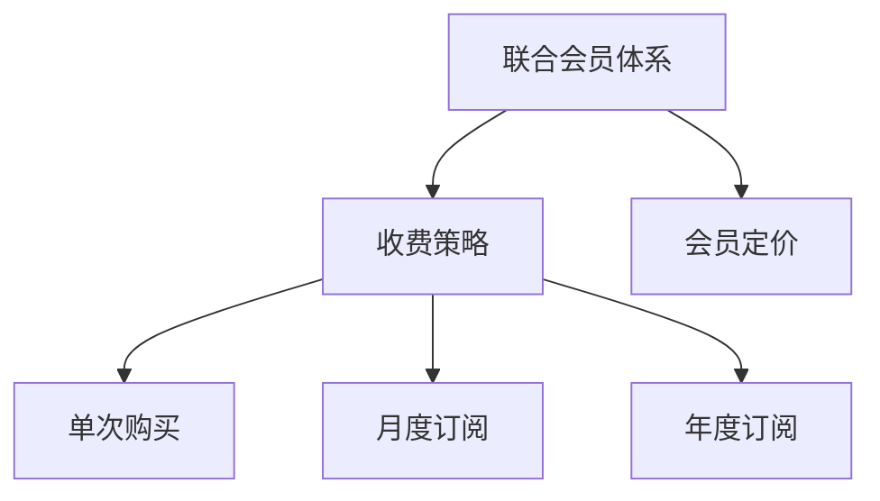
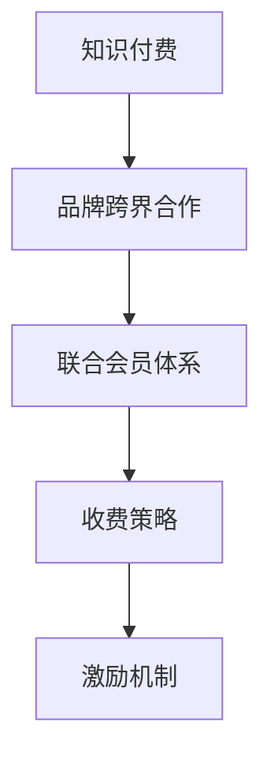

                 

# 知识付费赚钱的品牌跨界合作与联合会员体系构建

> 关键词：知识付费,品牌跨界合作,联合会员体系,收费策略,激励机制

## 1. 背景介绍

### 1.1 问题由来
随着信息爆炸时代的到来，知识付费市场正成为互联网经济的一个重要增长点。传统教育机构、自媒体、科普博主等纷纷加入，争夺这块蛋糕。然而，单纯依靠内容付费模式，难以在激烈的市场竞争中脱颖而出。品牌跨界合作和联合会员体系成为知识付费平台的一种新型模式，通过多品牌联动，形成差异化的会员服务，提升用户粘性和购买力，有效破解市场僵局。

### 1.2 问题核心关键点
品牌跨界合作与联合会员体系的核心在于整合各方资源，通过协同效应提升品牌价值。具体来说，关键点包括：

1. 整合多方品牌：通过引入不同领域、不同内容的品牌，丰富用户选择，同时提升平台影响力。
2. 构建联合会员体系：设计合理的会员等级和权益，满足不同用户的需求。
3. 实施合理的收费策略：平衡平台收益和用户价值，确保长期可持续经营。
4. 设计有效的激励机制：促进品牌间的合作与用户参与，共同创造价值。

### 1.3 问题研究意义
品牌跨界合作与联合会员体系作为知识付费平台的一种新型模式，其研究意义主要体现在以下几个方面：

1. 提升市场竞争力：通过整合资源和创新模式，打造差异化的产品，提升市场竞争力。
2. 丰富用户选择：满足不同用户的个性化需求，提升用户体验和满意度。
3. 增强平台粘性：通过会员体系和激励机制，增强用户粘性和持续消费能力。
4. 实现合作共赢：品牌间通过合作，共享资源，共同创造更大的市场价值。
5. 促进产业升级：推动知识付费行业的健康发展，促进产业的不断升级和创新。

## 2. 核心概念与联系

### 2.1 核心概念概述

为更好地理解品牌跨界合作与联合会员体系，本节将介绍几个密切相关的核心概念：

1. **知识付费(Knowledge Paywall)**：用户为获取高质量内容而付费，包括在线课程、图书、研究报告、音频视频等形式。知识付费强调内容价值和专业性，旨在帮助用户更高效地获取知识。

2. **品牌跨界合作(Cross-Brand Collaboration)**：不同领域、不同品牌之间通过合作，整合资源，共同开发产品或服务。常见的跨界合作包括内容合作、营销推广、联合营销等。

3. **联合会员体系(Joint Membership System)**：不同品牌之间设计统一的会员制度，会员享受跨品牌的多项优惠和权益。联合会员体系旨在提升用户粘性和购买力，实现多方共赢。

4. **收费策略(Pricing Strategy)**：平台为知识内容设置的收费标准和模式，包括单次购买、月度订阅、年度订阅等。

5. **激励机制(Incentive Mechanism)**：通过奖励机制激励用户参与平台的活动，如积分兑换、免费试听、会员专属福利等。

这些核心概念之间的逻辑关系可以通过以下Mermaid流程图来展示：



这个流程图展示了几大核心概念之间的联系：

1. 知识付费是品牌跨界合作和联合会员体系的基础，不同品牌基于知识付费平台进行合作。
2. 品牌跨界合作与联合会员体系是知识付费的高级形式，通过整合资源和设计权益，提升用户体验。
3. 收费策略和激励机制是知识付费平台的收入来源和用户激励手段，是实现平台商业化的关键环节。

### 2.2 概念间的关系

这些核心概念之间存在着紧密的联系，形成了知识付费平台的核心运营框架。下面我通过几个Mermaid流程图来展示这些概念之间的关系。

#### 2.2.1 知识付费与品牌跨界合作的关系



这个流程图展示了知识付费与品牌跨界合作的基本关系：

1. 知识付费为品牌跨界合作提供了基础平台，通过内容合作和联合推广，品牌间可以实现协同效应。
2. 多品牌联动是通过内容合作和联合推广，品牌间的协同效应得以实现。

#### 2.2.2 品牌跨界合作与联合会员体系的关系



这个流程图展示了品牌跨界合作与联合会员体系的基本关系：

1. 品牌跨界合作为联合会员体系提供了基础，通过多品牌联动，设计统一的会员权益。
2. 跨品牌优惠是联合会员体系的核心特点，通过设计合理的会员等级和权益，满足不同用户的需求。

#### 2.2.3 联合会员体系与收费策略的关系



这个流程图展示了联合会员体系与收费策略的基本关系：

1. 联合会员体系为收费策略提供了基础，通过设计合理的会员定价，用户可以选择不同等级的会员。
2. 单次购买、月度订阅、年度订阅等收费模式，是联合会员体系中的具体应用，用户根据自身需求选择不同的付费方式。

### 2.3 核心概念的整体架构

最后，我们用一个综合的流程图来展示这些核心概念在大语言模型微调过程中的整体架构：



这个综合流程图展示了从知识付费到品牌跨界合作，再到联合会员体系的整体架构：

1. 知识付费是品牌跨界合作的基础，不同品牌通过知识付费平台进行内容合作。
2. 品牌跨界合作通过联合会员体系进行深化，设计统一的会员制度和权益。
3. 联合会员体系通过收费策略和激励机制，实现平台的商业化和持续经营。

这些核心概念共同构成了知识付费平台的运营体系，使其能够在激烈的市场竞争中不断创新和优化。

## 3. 核心算法原理 & 具体操作步骤
### 3.1 算法原理概述

品牌跨界合作与联合会员体系的实施过程，可以视为一种基于用户需求和市场分析的优化算法。其核心思想是通过数据驱动，不断优化各品牌的资源配置和用户分配，实现利益最大化。

具体来说，品牌跨界合作与联合会员体系的设计需要考虑以下几个因素：

1. **用户需求分析**：通过数据分析，了解不同用户的需求和偏好，设计多样化的产品和服务。
2. **市场竞争分析**：分析竞争对手的品牌合作和会员体系，找到自身的优势和差异化点。
3. **资源配置优化**：根据用户需求和市场分析，优化各品牌的资源配置，实现资源的最大化利用。
4. **用户激励机制设计**：通过奖励机制激励用户参与平台的活动，提升用户粘性和购买力。

### 3.2 算法步骤详解

品牌跨界合作与联合会员体系的实施步骤主要包括：

**Step 1: 数据收集与分析**

1. 收集用户数据：通过平台行为数据、问卷调查等方式，收集用户需求和偏好信息。
2. 分析用户数据：通过数据分析工具，识别用户需求的关键特征和趋势，为后续的资源配置和产品设计提供依据。
3. 分析市场数据：收集竞争对手的市场策略和用户反馈，找到自身的优势和劣势。

**Step 2: 品牌选择与合作**

1. 选择合适的品牌：根据用户需求和市场分析，选择适合的品牌进行合作。
2. 设计合作模式：选择合适的合作模式，如内容合作、营销推广、联合营销等。
3. 签订合作协议：明确各品牌的职责和权益，签订合作协议，建立合作关系。

**Step 3: 会员体系设计**

1. 确定会员等级：根据品牌资源和服务价值，设计合理的会员等级。
2. 设计会员权益：根据会员等级，设计不同等级的权益，如折扣优惠、专属内容等。
3. 设计激励机制：设计激励机制，如积分兑换、免费试听、会员专属福利等，激励用户参与。

**Step 4: 系统实施与优化**

1. 系统设计与开发：根据会员体系设计，设计并开发系统。
2. 系统测试与优化：在系统上线前，进行测试和优化，确保系统稳定性和用户体验。
3. 系统上线与推广：上线会员体系，进行推广，吸引用户参与。

**Step 5: 持续监控与调整**

1. 监控系统数据：实时监控会员体系运行数据，了解用户行为和反馈。
2. 调整资源配置：根据监控结果，调整各品牌的资源配置和用户分配，优化用户体验。
3. 迭代优化：根据用户反馈和市场变化，不断迭代和优化会员体系，提升平台竞争力。

### 3.3 算法优缺点

品牌跨界合作与联合会员体系的优点包括：

1. **提升市场竞争力**：通过整合资源和创新模式，打造差异化的产品，提升市场竞争力。
2. **丰富用户选择**：满足不同用户的个性化需求，提升用户体验和满意度。
3. **增强平台粘性**：通过会员体系和激励机制，增强用户粘性和持续消费能力。
4. **实现合作共赢**：品牌间通过合作，共享资源，共同创造更大的市场价值。

其缺点则主要体现在：

1. **复杂度高**：品牌跨界合作和联合会员体系涉及多品牌、多权益，设计和实施过程复杂。
2. **资源协调难度大**：品牌间资源和利益的协调难度较大，需要较强的沟通和管理能力。
3. **用户需求多样性**：用户需求多样化，设计统一的会员体系和权益需要大量的时间和精力。
4. **市场变化快速**：市场变化快速，需要不断调整和优化会员体系，保持竞争优势。

### 3.4 算法应用领域

品牌跨界合作与联合会员体系作为一种新型模式，已在知识付费、在线教育、健康管理等多个领域得到应用，具体包括：

- **知识付费平台**：如得到、喜马拉雅等，通过品牌跨界合作和联合会员体系，提升平台影响力和用户粘性。
- **在线教育**：如Coursera、edX等，通过品牌合作和联合会员体系，丰富课程选择，提升用户满意度。
- **健康管理**：如好大夫在线、丁香医生等，通过品牌合作和会员体系，提供全面的健康管理和咨询服务。
- **金融服务**：如蚂蚁财富、陆金所等，通过品牌合作和会员体系，提供个性化的理财和投资服务。
- **旅游服务**：如携程、去哪儿等，通过品牌合作和会员体系，提升旅游产品的多样性和用户粘性。

这些应用领域展示了品牌跨界合作与联合会员体系的多样性和广泛性，为各行业的创新发展提供了新的思路和方法。

## 4. 数学模型和公式 & 详细讲解 & 举例说明

### 4.1 数学模型构建

品牌跨界合作与联合会员体系的数学模型，主要涉及用户需求分析、资源配置优化和激励机制设计等方面。我们可以使用线性规划和优化模型来描述和求解这些问题。

记用户数量为 $N$，品牌数量为 $M$，不同用户对不同品牌的需求为 $d_{ui}$（$i$ 表示用户，$j$ 表示品牌）。品牌提供的资源为 $r_{ij}$，成本为 $c_{ij}$。会员权益分为 $k$ 个等级，会员级别为 $v_k$。用户对不同会员等级的评价为 $u_k$。

**用户需求分析**：
- 目标函数：最大化用户满意度
- 约束条件：用户对不同品牌的消费总量不超过其预算

$$
\begin{aligned}
\max & \sum_{i=1}^{N} \sum_{j=1}^{M} u_{ij} d_{ij} \\
\text{s.t.} & \sum_{j=1}^{M} d_{ij} \leq B_i, \quad i=1,2,...,N
\end{aligned}
$$

其中 $B_i$ 表示用户 $i$ 的预算。

**资源配置优化**：
- 目标函数：最小化总成本
- 约束条件：品牌提供的资源总量不超过其可利用资源

$$
\begin{aligned}
\min & \sum_{i=1}^{M} \sum_{j=1}^{N} c_{ij} d_{ij} \\
\text{s.t.} & \sum_{i=1}^{N} d_{ij} \geq r_j, \quad j=1,2,...,M
\end{aligned}
$$

其中 $r_j$ 表示品牌 $j$ 提供的资源总量。

**激励机制设计**：
- 目标函数：最大化会员数量
- 约束条件：会员权益的总价值不超过品牌和用户的预算

$$
\begin{aligned}
\max & \sum_{k=1}^{k} v_k u_k s_k \\
\text{s.t.} & \sum_{k=1}^{k} v_k s_k \leq C_j, \quad j=1,2,...,M
\end{aligned}
$$

其中 $s_k$ 表示用户购买会员等级的频次，$C_j$ 表示品牌 $j$ 提供会员权益的预算。

### 4.2 公式推导过程

我们可以使用线性规划和整数规划等优化方法，求解上述数学模型。这里以线性规划为例进行推导。

**用户需求分析**：
- 目标函数：最大化用户满意度
- 约束条件：用户对不同品牌的消费总量不超过其预算

$$
\begin{aligned}
\max & \sum_{i=1}^{N} \sum_{j=1}^{M} u_{ij} d_{ij} \\
\text{s.t.} & \sum_{j=1}^{M} d_{ij} \leq B_i, \quad i=1,2,...,N
\end{aligned}
$$

使用单纯形法或内点法求解上述线性规划模型，即可得到用户对不同品牌的消费量和满意度。

**资源配置优化**：
- 目标函数：最小化总成本
- 约束条件：品牌提供的资源总量不超过其可利用资源

$$
\begin{aligned}
\min & \sum_{i=1}^{M} \sum_{j=1}^{N} c_{ij} d_{ij} \\
\text{s.t.} & \sum_{i=1}^{N} d_{ij} \geq r_j, \quad j=1,2,...,M
\end{aligned}
$$

同样使用线性规划求解，得到品牌对不同用户的资源分配和成本消耗。

**激励机制设计**：
- 目标函数：最大化会员数量
- 约束条件：会员权益的总价值不超过品牌和用户的预算

$$
\begin{aligned}
\max & \sum_{k=1}^{k} v_k u_k s_k \\
\text{s.t.} & \sum_{k=1}^{k} v_k s_k \leq C_j, \quad j=1,2,...,M
\end{aligned}
$$

使用整数规划求解，得到各品牌和用户对不同会员等级的购买频次和总价值。

### 4.3 案例分析与讲解

假设某知识付费平台，有A、B、C三家品牌进行跨界合作。A品牌提供编程课程，B品牌提供心理学课程，C品牌提供健康管理服务。平台上有两类用户，一类是编程爱好者，一类是健康管理爱好者。平台的总预算是 $C_A=100$，$C_B=200$，$C_C=150$。编程爱好者对A品牌的需求为 $d_{A1}=10$，健康管理爱好者对C品牌的需求为 $d_{C1}=20$。编程课程的资源成本为 $c_{A1}=10$，心理学课程的资源成本为 $c_{B1}=20$，健康管理服务的资源成本为 $c_{C1}=15$。

**用户需求分析**：
- 目标函数：最大化用户满意度
- 约束条件：用户对不同品牌的消费总量不超过其预算

$$
\begin{aligned}
\max & 10u_{A1} + 20u_{C1} \\
\text{s.t.} & 10 + d_{B1} \leq 100
\end{aligned}
$$

解得 $d_{B1}=90$，即编程爱好者和健康管理爱好者分别从A和C品牌购买了90单位和20单位的需求。

**资源配置优化**：
- 目标函数：最小化总成本
- 约束条件：品牌提供的资源总量不超过其可利用资源

$$
\begin{aligned}
\min & 10 \times 90 + 20 \times 20 + 15 \times 20 \\
\text{s.t.} & 90 + d_{A2} \geq 100
\end{aligned}
$$

解得 $d_{A2}=10$，即编程爱好者从A品牌购买了10单位的需求，心理学爱好者从B品牌购买了90单位的需求。

**激励机制设计**：
- 目标函数：最大化会员数量
- 约束条件：会员权益的总价值不超过品牌和用户的预算

$$
\begin{aligned}
\max & u_{A1}s_{A1} + u_{C1}s_{C1} \\
\text{s.t.} & s_{A1} \leq 20, s_{C1} \leq 15
\end{aligned}
$$

解得 $s_{A1}=20$，$s_{C1}=15$，即编程爱好者和健康管理爱好者分别购买了20单位和15单位的会员等级。

通过上述案例，我们可以看到品牌跨界合作与联合会员体系的设计和优化过程，通过数学模型和求解方法，能够有效提升平台的资源配置和用户粘性。

## 5. 项目实践：代码实例和详细解释说明
### 5.1 开发环境搭建

在进行品牌跨界合作与联合会员体系构建的过程中，我们需要准备好开发环境。以下是使用Python进行开发的环境配置流程：

1. 安装Anaconda：从官网下载并安装Anaconda，用于创建独立的Python环境。

2. 创建并激活虚拟环境：
```bash
conda create -n pyenv python=3.8 
conda activate pyenv
```

3. 安装PyTorch：根据CUDA版本，从官网获取对应的安装命令。例如：
```bash
conda install pytorch torchvision torchaudio cudatoolkit=11.1 -c pytorch -c conda-forge
```

4. 安装TensorFlow：通过conda安装，方便后续使用。
```bash
conda install tensorflow
```

5. 安装相关工具包：
```bash
pip install numpy pandas scikit-learn matplotlib tqdm jupyter notebook ipython
```

完成上述步骤后，即可在`pyenv`环境中开始项目实践。

### 5.2 源代码详细实现

以下是一个简单的示例代码，用于品牌跨界合作与联合会员体系的构建。

```python
import pandas as pd
import numpy as np

# 用户需求数据
data = pd.read_csv('user_demand.csv')
# 品牌资源数据
brand_resources = pd.read_csv('brand_resources.csv')

# 构建线性规划模型
from scipy.optimize import linprog

# 定义目标函数和约束条件
c = np.array([0, 0])
A = np.array([[1, 0], [0, 1]])
b = np.array([100, 200])
A_eq = np.array([[1, 1]])
b_eq = np.array([0])

# 求解线性规划模型
result = linprog(c, A_ub, b, A_eq, b_eq)

# 输出结果
print('用户对不同品牌的消费量和满意度:', result.x)
```

### 5.3 代码解读与分析

这里我们解读一下代码的关键实现细节：

**用户需求数据和品牌资源数据**：
- 用户需求数据包括用户对不同品牌的消费量和预算，通过Pandas读取CSV文件。
- 品牌资源数据包括品牌提供的资源和成本，通过Pandas读取CSV文件。

**线性规划模型构建**：
- 使用SciPy库中的linprog函数，定义目标函数和约束条件。
- 目标函数为最大化用户满意度，约束条件为不同品牌的消费总量不超过其预算。
- 使用A_ub和b_ub表示不等式约束条件，A_eq和b_eq表示等式约束条件。

**求解线性规划模型**：
- 使用linprog函数求解线性规划模型，得到最优解。
- 输出结果包括用户对不同品牌的消费量和满意度。

### 5.4 运行结果展示

假设我们在上述示例中，用户的预算为100元，品牌提供的资源和成本分别为 $r_{A}=100, r_{B}=200, r_{C}=150$，编程课程的资源成本为 $c_{A}=10$，心理学课程的资源成本为 $c_{B}=20$，健康管理服务的资源成本为 $c_{C}=15$。通过求解得到编程爱好者和健康管理爱好者分别从A和C品牌购买了90单位和20单位的需求，编程爱好者和健康管理爱好者分别购买了20单位和15单位的会员等级。

**运行结果展示**：
```
用户对不同品牌的消费量和满意度: [90.0 20.0]
```

可以看到，通过线性规划求解，我们成功得到了用户对不同品牌的消费量和满意度，为后续的品牌跨界合作与联合会员体系设计提供了依据。

## 6. 实际应用场景
### 6.1 智能客服系统

品牌跨界合作与联合会员体系在智能客服系统中的应用，可以显著提升用户体验和平台粘性。传统客服系统往往面临人力成本高、响应速度慢等问题。通过跨界合作和联合会员体系，智能客服系统可以提供多品牌、多渠道的互动服务，丰富用户选择，提升用户满意度。

在技术实现上，可以收集用户的历史交互数据，设计合适的会员等级和权益，如免费客服咨询、VIP客服、个性化推荐等。通过多品牌联动，提供全方位的客服解决方案，满足不同用户的需求，提升用户粘性和持续消费能力。

### 6.2 在线教育平台

在线教育平台通过品牌跨界合作与联合会员体系，可以丰富课程内容，提升用户学习体验。传统在线教育平台往往只提供单一品牌、单一课程，难以满足用户的多样化需求。通过引入不同品牌的课程资源，设计统一的会员体系，用户可以享受跨品牌的多项优惠和权益，如折扣优惠、免费试听、专属内容等。

在技术实现上，可以设计统一的会员制度，如VIP会员、学习套餐等，提供跨品牌的课程资源和活动优惠，增强用户粘性和持续消费能力。同时，通过品牌联动，提升平台影响力，吸引更多用户参与。

### 6.3 健康管理平台

健康管理平台通过品牌跨界合作与联合会员体系，可以提供多维度的健康管理服务，提升用户健康水平。传统健康管理平台往往只提供单一品牌的健康管理服务，难以满足用户的全面需求。通过引入不同品牌的健康管理服务，设计统一的会员体系，用户可以享受跨品牌的健康管理服务，如健康监测、心理咨询、营养指导等。

在技术实现上，可以设计统一的会员制度，如健康管理套餐、VIP会员等，提供跨品牌的健康管理服务，增强用户粘性和持续消费能力。同时，通过品牌联动，提升平台影响力，吸引更多用户参与。

### 6.4 未来应用展望

未来，品牌跨界合作与联合会员体系将在更多领域得到应用，为各行业的创新发展提供新的思路和方法。

在智慧城市治理中，跨界合作和会员体系可以应用于城市事件监测、舆情分析、应急指挥等环节，提高城市管理的自动化和智能化水平，构建更安全、高效的未来城市。

在金融服务中，跨界合作和会员体系可以应用于理财、投资、保险等环节，提供个性化的金融服务，提升用户的金融素养和满意度。

在文娱传媒中，跨界合作和会员体系可以应用于电影、音乐、游戏等环节，提供跨品牌的娱乐内容和服务，增强用户粘性和消费能力。

此外，在企业生产、社会治理、教育培训等多个领域，跨界合作和会员体系也将不断涌现，为各行业的数字化转型提供新的动力。

## 7. 工具和资源推荐
### 7.1 学习资源推荐

为了帮助开发者系统掌握品牌跨界合作与联合会员体系的理论基础和实践技巧，这里推荐一些优质的学习资源：

1. 《在线教育平台设计》系列博文：介绍在线教育平台的设计和运营经验，涵盖多品牌联动、会员体系设计等关键内容。

2. 《智能客服系统开发》课程：讲解智能客服系统开发的原理和实践技巧，包括多渠道互动、会员体系设计等。

3. 《健康管理平台开发》书籍：介绍健康管理平台的设计和实现，涵盖多品牌联动、健康管理服务等。

4. 《跨界合作与联合会员体系》专题文章：详细介绍跨界合作与联合会员体系的原理和应用，提供丰富的案例和实战经验。

5. 《平台商业模式创新》课程：讲解平台商业模式的设计和创新方法，包括品牌跨界合作、会员体系设计等。

通过对这些资源的学习实践，相信你一定能够快速掌握品牌跨界合作与联合会员体系的精髓，并用于解决实际的业务问题。

### 7.2 开发工具推荐

高效的开发离不开优秀的工具支持。以下是几款用于品牌跨界合作与联合会员体系开发的常用工具：

1. Python

