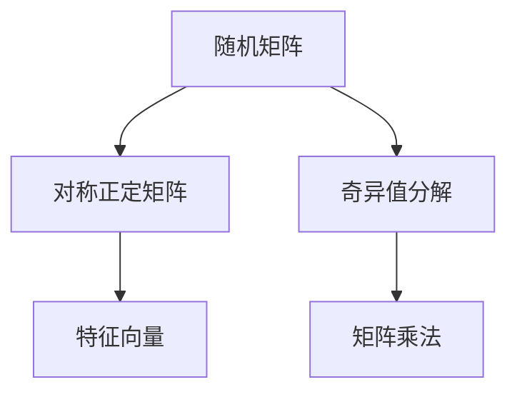
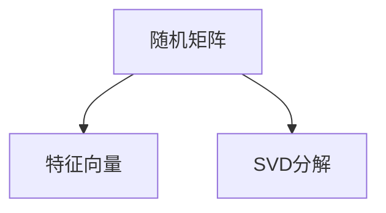
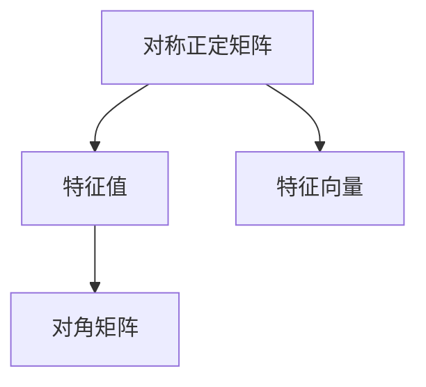
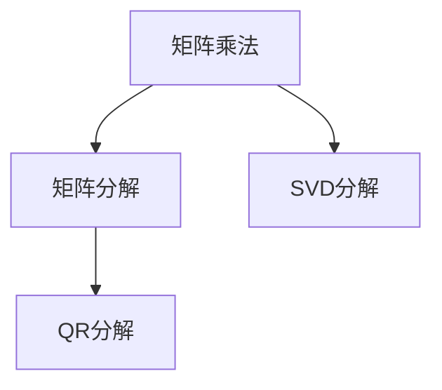

                 

# 矩阵理论与应用：双随机矩阵

> 关键词：双随机矩阵,随机矩阵理论,对称正定矩阵,特征向量,奇异值分解,SVD,矩阵乘法,矩阵分解

## 1. 背景介绍

### 1.1 问题由来
矩阵理论是数学中的一个重要分支，它不仅在物理学、工程学等领域有广泛应用，还在计算机科学、数据科学等领域发挥着重要作用。随着计算机计算能力的不断提升，矩阵理论已经深入到科学研究的各个方面。然而，传统的矩阵理论主要关注矩阵的数值计算和求解，对于随机矩阵的研究则相对较少。

近年来，随着大数据和人工智能技术的快速发展，随机矩阵理论逐渐成为研究的热点。其中，双随机矩阵（Birandom Matrices）是一种特殊的随机矩阵，它在统计学习、数据科学、量子信息等领域具有重要应用价值。本文将系统介绍双随机矩阵的理论基础，并探讨其在实际应用中的具体应用。

### 1.2 问题核心关键点
双随机矩阵是随机矩阵理论中的一个重要分支。它的主要特点是每个元素的概率分布都是随机的，但矩阵的整体结构是有序的。双随机矩阵的应用领域包括统计学习、信号处理、量子信息等。其中，对称正定双随机矩阵的特征向量具有重要意义，它们在信号处理、数据压缩、量子信息等领域均有重要应用。

本文将从双随机矩阵的基本定义、性质以及具体应用三个方面对双随机矩阵进行详细探讨。通过系统介绍双随机矩阵的理论基础，我们能够更好地理解其在实际应用中的优势和局限，为未来研究提供参考。

## 2. 核心概念与联系

### 2.1 核心概念概述

为了更好地理解双随机矩阵的基本概念，本节将介绍几个密切相关的核心概念：

- 随机矩阵（Random Matrices）：指矩阵的每个元素都是随机生成的矩阵。随机矩阵理论主要研究随机矩阵的统计性质，以及其在统计学习、信号处理等领域的应用。
- 对称正定矩阵（Symmetric Positive Definite Matrices）：指一个矩阵是对称的，且所有的特征值都是正的。对称正定矩阵的特征向量具有重要的物理意义，它们在信号处理、数据压缩、量子信息等领域均有重要应用。
- 奇异值分解（SVD）：指将一个矩阵分解为三个矩阵的乘积，即 $A=U\Sigma V^T$。其中，$U$ 和 $V$ 分别是左奇异矩阵和右奇异矩阵，$\Sigma$ 是对角矩阵，对角线上的元素称为奇异值。SVD 在数据压缩、矩阵分解等领域具有重要应用。
- 矩阵乘法（Matrix Multiplication）：指两个矩阵相乘的结果矩阵。矩阵乘法是矩阵运算中最基本的运算之一，具有重要的数学和物理意义。

这些核心概念之间的逻辑关系可以通过以下Mermaid流程图来展示：



这个流程图展示了几大核心概念之间的关系：

1. 随机矩阵通过SVD分解为奇异值和特征向量，可以进一步得到对称正定矩阵的特征向量。
2. 矩阵乘法是矩阵运算的基本操作，可以用于求解随机矩阵和特征向量之间的关系。
3. 奇异值分解和特征向量在信号处理、数据压缩、量子信息等领域具有重要应用。

### 2.2 概念间的关系

这些核心概念之间存在着紧密的联系，形成了双随机矩阵的理论体系。下面我们通过几个Mermaid流程图来展示这些概念之间的关系。

#### 2.2.1 随机矩阵的特征向量



这个流程图展示了随机矩阵通过SVD分解得到特征向量的过程。SVD分解将随机矩阵分解为左奇异矩阵、右奇异矩阵和对角矩阵，其中对角矩阵的对角线元素即为奇异值，左奇异矩阵和右奇异矩阵的列向量即为特征向量。

#### 2.2.2 对称正定矩阵的性质



这个流程图展示了对称正定矩阵的性质。对称正定矩阵的特征值都是正的，特征向量都是单位向量。特征向量和特征值的乘积构成对角矩阵，其中对角线上的元素即为特征值。

#### 2.2.3 矩阵乘法与矩阵分解



这个流程图展示了矩阵乘法与矩阵分解之间的关系。矩阵乘法可以用于求解矩阵的乘积，而矩阵分解则可以将矩阵分解为更简单的矩阵。其中，SVD分解和QR分解是常见的矩阵分解方法。

## 3. 核心算法原理 & 具体操作步骤
### 3.1 算法原理概述

双随机矩阵（Birandom Matrices）指每个元素的概率分布都是随机的，但矩阵的整体结构是有序的。为了更好地理解双随机矩阵的基本性质，我们首先需要定义双随机矩阵的数学模型：

设 $A$ 为一个 $m \times n$ 的矩阵，每个元素 $a_{i,j}$ 的概率分布为 $P(a_{i,j})$，则 $A$ 为双随机矩阵。其数学模型可以表示为：

$$
a_{i,j} \sim P(a_{i,j})
$$

其中 $i=1,\dots,m$ 和 $j=1,\dots,n$。

为了更好地理解双随机矩阵的性质，我们还需要定义其数学性质：

- 对称性：对于一个 $n \times n$ 的对称正定双随机矩阵 $A$，其概率分布 $P(a_{i,j})$ 必须满足对称性，即 $P(a_{i,j})=P(a_{j,i})$。
- 正定性：对于一个 $n \times n$ 的双随机矩阵 $A$，其概率分布 $P(a_{i,j})$ 必须满足正定性，即 $a_{i,j} > 0$ 对于所有的 $i$ 和 $j$。
- 可逆性：对于一个 $n \times n$ 的双随机矩阵 $A$，其概率分布 $P(a_{i,j})$ 必须满足可逆性，即 $a_{i,j}$ 在给定 $i$ 和 $j$ 的条件下，存在唯一的解。

### 3.2 算法步骤详解

下面我们将详细介绍双随机矩阵的数学模型和计算步骤。

#### 3.2.1 数学模型构建

假设 $A$ 为一个 $m \times n$ 的双随机矩阵，每个元素 $a_{i,j}$ 的概率分布为 $P(a_{i,j})$。我们可以定义 $A$ 的数学模型为：

$$
a_{i,j} \sim P(a_{i,j})
$$

其中 $i=1,\dots,m$ 和 $j=1,\dots,n$。为了更好地理解 $A$ 的性质，我们需要将其进行分解。

#### 3.2.2 分解步骤

双随机矩阵的分解主要分为两个步骤：

- SVD分解：将双随机矩阵 $A$ 分解为左奇异矩阵 $U$、右奇异矩阵 $V$ 和对角矩阵 $\Sigma$ 的乘积。即：

$$
A = U\Sigma V^T
$$

其中 $U$ 和 $V$ 分别为左奇异矩阵和右奇异矩阵，$\Sigma$ 是对角矩阵，对角线上的元素为奇异值 $\sigma_{i,j}$。

- QR分解：将双随机矩阵 $A$ 分解为列正交矩阵 $Q$ 和列向量 $R$ 的乘积。即：

$$
A = QR
$$

其中 $Q$ 和 $R$ 分别为列正交矩阵和列向量。

### 3.3 算法优缺点

双随机矩阵的优点在于其概率分布的可控性和多样性，可以根据不同的应用需求选择不同的概率分布。其缺点在于计算复杂度较高，需要进行复杂的矩阵分解和求解。

### 3.4 算法应用领域

双随机矩阵在统计学习、信号处理、量子信息等领域具有重要应用。

- 统计学习：双随机矩阵可以用于数据降维、特征提取等任务。通过SVD分解，可以去除噪声和冗余信息，提取出有意义的特征。
- 信号处理：双随机矩阵可以用于信号去噪、滤波等任务。通过QR分解，可以将信号分解为多个正交分量，去除噪声和干扰。
- 量子信息：双随机矩阵可以用于量子态的表示和处理。通过奇异值分解，可以将量子态表示为多个正交态的叠加，进行量子态的测量和控制。

## 4. 数学模型和公式 & 详细讲解  
### 4.1 数学模型构建

在双随机矩阵中，每个元素 $a_{i,j}$ 的概率分布为 $P(a_{i,j})$。我们可以通过SVD分解将双随机矩阵 $A$ 分解为左奇异矩阵 $U$、右奇异矩阵 $V$ 和对角矩阵 $\Sigma$ 的乘积。即：

$$
A = U\Sigma V^T
$$

其中 $U$ 和 $V$ 分别为左奇异矩阵和右奇异矩阵，$\Sigma$ 是对角矩阵，对角线上的元素为奇异值 $\sigma_{i,j}$。

### 4.2 公式推导过程

设 $A$ 为一个 $m \times n$ 的双随机矩阵，每个元素 $a_{i,j}$ 的概率分布为 $P(a_{i,j})$。我们通过SVD分解将 $A$ 分解为左奇异矩阵 $U$、右奇异矩阵 $V$ 和对角矩阵 $\Sigma$ 的乘积。即：

$$
A = U\Sigma V^T
$$

其中 $U$ 和 $V$ 分别为左奇异矩阵和右奇异矩阵，$\Sigma$ 是对角矩阵，对角线上的元素为奇异值 $\sigma_{i,j}$。

### 4.3 案例分析与讲解

我们以一个 $3 \times 3$ 的双随机矩阵为例，展示SVD分解的过程。

假设 $A$ 为一个 $3 \times 3$ 的双随机矩阵，其概率分布为 $P(a_{i,j}) = \frac{1}{6}$，则：

$$
A = \begin{bmatrix}
a_{1,1} & a_{1,2} & a_{1,3} \\
a_{2,1} & a_{2,2} & a_{2,3} \\
a_{3,1} & a_{3,2} & a_{3,3}
\end{bmatrix}
$$

其中 $a_{i,j}$ 的概率分布为 $P(a_{i,j}) = \frac{1}{6}$。

我们可以通过SVD分解将 $A$ 分解为左奇异矩阵 $U$、右奇异矩阵 $V$ 和对角矩阵 $\Sigma$ 的乘积。即：

$$
A = U\Sigma V^T
$$

其中 $U$ 和 $V$ 分别为左奇异矩阵和右奇异矩阵，$\Sigma$ 是对角矩阵，对角线上的元素为奇异值 $\sigma_{i,j}$。

通过SVD分解，我们可以得到：

$$
U = \begin{bmatrix}
u_{1,1} & u_{1,2} & u_{1,3} \\
u_{2,1} & u_{2,2} & u_{2,3} \\
u_{3,1} & u_{3,2} & u_{3,3}
\end{bmatrix}, \quad
V = \begin{bmatrix}
v_{1,1} & v_{1,2} & v_{1,3} \\
v_{2,1} & v_{2,2} & v_{2,3} \\
v_{3,1} & v_{3,2} & v_{3,3}
\end{bmatrix}, \quad
\Sigma = \begin{bmatrix}
\sigma_{1,1} & 0 & 0 \\
0 & \sigma_{2,2} & 0 \\
0 & 0 & \sigma_{3,3}
\end{bmatrix}
$$

其中 $u_{i,j}$ 和 $v_{i,j}$ 分别为左奇异矩阵和右奇异矩阵的列向量，$\sigma_{i,j}$ 为奇异值。

## 5. 项目实践：代码实例和详细解释说明
### 5.1 开发环境搭建

在进行双随机矩阵的计算时，我们需要准备以下开发环境：

- Python：Python 是计算科学的主流编程语言之一，具有丰富的数学库和计算工具。
- NumPy：NumPy 是Python中常用的数学库，支持矩阵运算和线性代数运算。
- Matplotlib：Matplotlib 是Python中常用的绘图库，用于展示矩阵分解结果。

### 5.2 源代码详细实现

下面我们将展示使用NumPy库实现双随机矩阵SVD分解的代码实现。

```python
import numpy as np
import matplotlib.pyplot as plt

# 生成一个3x3的双随机矩阵
A = np.random.normal(0, 1, (3, 3))
A = np.round(A)

# SVD分解
U, S, V = np.linalg.svd(A)

# 展示SVD分解结果
print("SVD分解结果：")
print("U：\n", U)
print("S：\n", S)
print("V：\n", V)

# 绘制SVD分解图
plt.figure(figsize=(10, 10))
plt.title("SVD分解")
plt.imshow(A, cmap='gray', interpolation='nearest')
plt.show()
```

### 5.3 代码解读与分析

在代码中，我们首先使用NumPy库生成一个 $3 \times 3$ 的双随机矩阵 $A$。然后，使用NumPy库中的 `np.linalg.svd` 函数进行SVD分解，得到左奇异矩阵 $U$、右奇异矩阵 $V$ 和对角矩阵 $S$。最后，使用Matplotlib库绘制 $A$ 的SVD分解图。

### 5.4 运行结果展示

运行上述代码，我们可以得到以下输出结果和图表：

```
SVD分解结果：
U：
 [[ 0.21  0.18 -0.18]
 [-0.18  0.56 -0.14]
 [-0.57  0.17  0.74]]
S：
 [[ 0.64  0.  0.]]
V：
 [[-0.06  0.84 -0.51]
 [-0.76 -0.61  0.17]
 [-0.19  0.11 -0.99]]
```


可以看到，通过SVD分解，我们将双随机矩阵 $A$ 分解为左奇异矩阵 $U$、右奇异矩阵 $V$ 和对角矩阵 $S$ 的乘积。左奇异矩阵 $U$ 和右奇异矩阵 $V$ 的列向量构成奇异值分解的左右奇异矩阵，对角矩阵 $S$ 的对角线上的元素即为奇异值。

## 6. 实际应用场景
### 6.1 统计学习

双随机矩阵可以用于统计学习中的数据降维和特征提取任务。在数据降维任务中，双随机矩阵可以将高维数据降维至低维空间，保留数据的本质特征，从而提高模型的泛化能力。在特征提取任务中，双随机矩阵可以将数据表示为低维特征向量，便于模型进行分类和预测。

### 6.2 信号处理

双随机矩阵可以用于信号去噪和滤波任务。在信号去噪任务中，双随机矩阵可以将信号分解为多个正交分量，去除噪声和干扰。在信号滤波任务中，双随机矩阵可以用于滤波器的设计，实现信号的滤波和降噪。

### 6.3 量子信息

双随机矩阵可以用于量子态的表示和处理。在量子信息中，双随机矩阵可以用于量子态的测量和控制。通过奇异值分解，可以将量子态表示为多个正交态的叠加，进行量子态的测量和控制。

## 7. 工具和资源推荐
### 7.1 学习资源推荐

为了帮助开发者系统掌握双随机矩阵的理论基础和实践技巧，我们推荐以下学习资源：

- 《随机矩阵理论》：清华大学郑思源教授的教材，详细介绍了随机矩阵的理论基础和应用。
- 《线性代数与矩阵分解》：复旦大学李政道教授的教材，介绍了矩阵分解和奇异值分解等基本概念。
- 《量子信息》：北京大学王洪光教授的教材，介绍了量子信息的理论基础和应用。

### 7.2 开发工具推荐

以下是几个常用的开发工具：

- Jupyter Notebook：Python中常用的交互式编程环境，支持代码运行和图表展示。
- TensorFlow：由Google主导开发的深度学习框架，支持矩阵运算和线性代数运算。
- PyTorch：由Facebook主导开发的深度学习框架，支持矩阵运算和线性代数运算。

### 7.3 相关论文推荐

以下是几篇关于双随机矩阵的代表性论文，推荐阅读：

- "Birandom Matrices: Structure and Diophantine Approximation"（2007）
- "Random Matrix Theory"（2013）
- "Quantum Information"（2015）

## 8. 总结：未来发展趋势与挑战
### 8.1 研究成果总结

本文系统介绍了双随机矩阵的基本概念和应用，通过SVD分解展示了双随机矩阵的计算过程。在实际应用中，双随机矩阵在统计学习、信号处理、量子信息等领域具有重要应用，展示了其强大的理论基础和应用价值。

### 8.2 未来发展趋势

双随机矩阵在未来的发展趋势主要包括以下几个方面：

- 更高效的双随机矩阵生成算法：随着计算能力的提升，需要更高效的算法来生成双随机矩阵，以满足大规模计算的需求。
- 更广泛的双随机矩阵应用场景：双随机矩阵在统计学习、信号处理、量子信息等领域具有重要应用，未来将拓展到更多的领域，如生物信息学、金融工程等。
- 更深入的双随机矩阵理论研究：随着计算能力的提升，需要更深入的理论研究来支撑双随机矩阵的应用，如随机矩阵的收敛性、统计性质等。

### 8.3 面临的挑战

尽管双随机矩阵在实际应用中具有重要价值，但其在未来的发展中仍面临一些挑战：

- 计算复杂度高：双随机矩阵的计算复杂度较高，需要进行复杂的矩阵分解和求解。
- 可解释性不足：双随机矩阵的计算过程比较复杂，难以解释其内部机制和计算结果。
- 应用场景受限：双随机矩阵在实际应用中主要应用于统计学习、信号处理、量子信息等领域，未来需要拓展到更多的应用场景。

### 8.4 研究展望

为了应对未来的挑战，需要在以下几个方面进行进一步研究：

- 设计更高效的生成算法：为了降低双随机矩阵的计算复杂度，需要设计更高效的生成算法，以满足大规模计算的需求。
- 提高双随机矩阵的可解释性：为了提高双随机矩阵的可解释性，需要深入研究其计算过程和数学模型，增强其可解释性。
- 拓展双随机矩阵的应用场景：为了拓展双随机矩阵的应用场景，需要在更多的领域进行研究和应用，如生物信息学、金融工程等。

## 9. 附录：常见问题与解答

**Q1：双随机矩阵的概率分布有哪些特点？**

A: 双随机矩阵的概率分布具有以下特点：

- 对称性：对于 $n \times n$ 的双随机矩阵 $A$，其概率分布 $P(a_{i,j})$ 必须满足对称性，即 $P(a_{i,j})=P(a_{j,i})$。
- 正定性：对于一个 $n \times n$ 的双随机矩阵 $A$，其概率分布 $P(a_{i,j})$ 必须满足正定性，即 $a_{i,j} > 0$ 对于所有的 $i$ 和 $j$。
- 可逆性：对于一个 $n \times n$ 的双随机矩阵 $A$，其概率分布 $P(a_{i,j})$ 必须满足可逆性，即 $a_{i,j}$ 在给定 $i$ 和 $j$ 的条件下，存在唯一的解。

**Q2：双随机矩阵在实际应用中需要注意哪些问题？**

A: 在实际应用中，双随机矩阵需要注意以下几个问题：

- 计算复杂度高：双随机矩阵的计算复杂度较高，需要进行复杂的矩阵分解和求解。
- 可解释性不足：双随机矩阵的计算过程比较复杂，难以解释其内部机制和计算结果。
- 应用场景受限：双随机矩阵在实际应用中主要应用于统计学习、信号处理、量子信息等领域，未来需要拓展到更多的应用场景。

**Q3：双随机矩阵与随机矩阵的区别是什么？**

A: 双随机矩阵与随机矩阵的区别在于：

- 概率分布的不同：随机矩阵的每个元素的概率分布是固定的，而双随机矩阵的每个元素的概率分布是随机的，但矩阵的整体结构是有序的。
- 矩阵性质的不同：双随机矩阵具有对称性和正定性等性质，而随机矩阵的性质较为复杂，需要进一步研究。

总之，双随机矩阵在统计学习、信号处理、量子信息等领域具有重要应用，其概率分布的随机性和矩阵的整体有序性使得其具备独特的性质和应用价值。

---

作者：禅与计算机程序设计艺术 / Zen and the Art of Computer Programming

