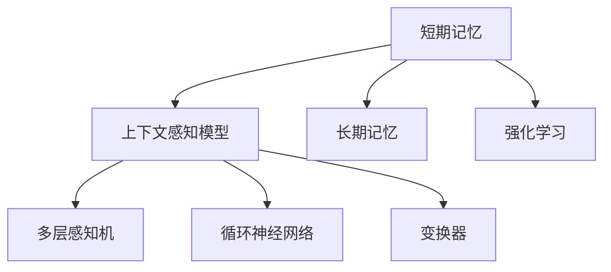
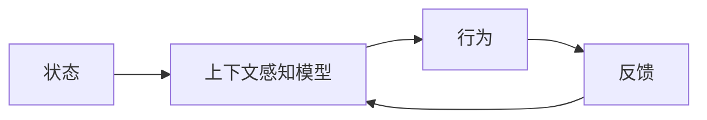
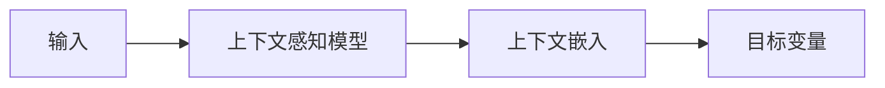
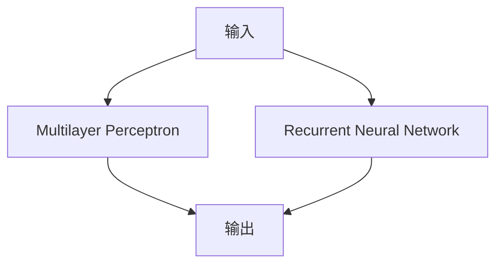
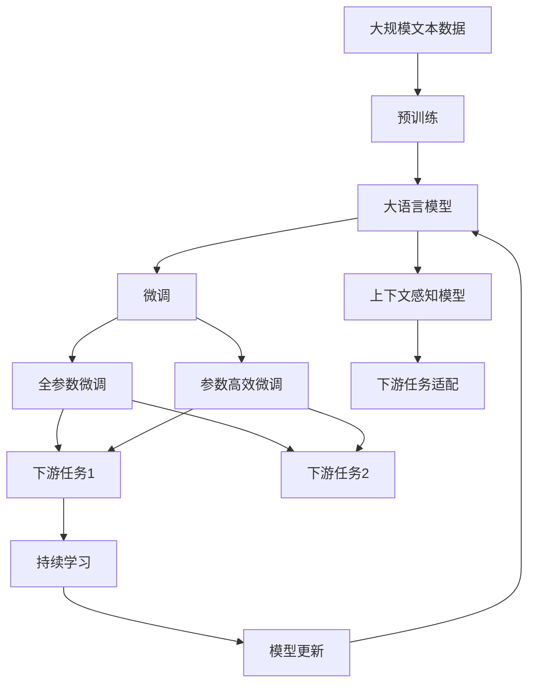

                 

# 短期记忆：利用上下文学习

## 1. 背景介绍

在人工智能的认知框架中，短期记忆扮演着至关重要的角色。它不仅能够辅助计算机执行复杂的推理和决策任务，还为许多前沿技术如强化学习、自然语言处理(NLP)和计算机视觉提供了强大的理论支持。在现代深度学习体系中，短期记忆机制显得尤为重要。然而，如何在模型设计中实现高效而稳健的短期记忆机制，一直是学术界和工业界共同关注的焦点。

本文将详细探讨短期记忆的原理、算法、实际应用以及相关的前沿研究，帮助读者全面理解这一关键技术。通过深入分析短期记忆的核心概念，我们将揭示其背后的数学原理和应用场景，为人工智能模型的设计提供有益的参考。

## 2. 核心概念与联系

### 2.1 核心概念概述

为更清晰地介绍短期记忆的相关概念，本节将详细阐述几个关键的核心概念及其相互关系：

- **短期记忆(Short-term Memory, STM)**：指大脑在处理信息时能够暂时存储和回想起来的少量信息。在计算机科学中，短期记忆指的是模型在一定时间窗口内可访问的存储器。
- **上下文(Context)**：指模型在处理输入数据时所依赖的额外信息。上下文可以是输入数据的前后文、外部环境数据等。
- **上下文感知(Contextual)模型**：一种能够捕捉上下文信息的模型，通常包括多层感知机、循环神经网络(RNN)、变换器(Transformer)等。
- **长期记忆(Long-term Memory, LTM)**：指模型能够存储并长期保留的信息，通常用于知识表示和长序列建模。
- **强化学习(RL)**：一种通过与环境互动，学习最优策略的机器学习方式。短期记忆在RL中的应用尤为显著，如探索-利用均衡、状态记录和记忆提取等。

这些概念之间的关系可以通过以下Mermaid流程图来展示：



这个流程图展示了短期记忆、上下文感知模型以及强化学习之间的逻辑关系：

1. 短期记忆是上下文感知模型的核心组成部分。
2. 多层感知机、循环神经网络和变换器都是实现上下文感知模型的常见架构。
3. 长期记忆与短期记忆相互补充，共同构建出系统的记忆能力。
4. 强化学习则通过上下文感知模型和短期记忆来优化策略，实现决策和学习。

### 2.2 概念间的关系

这些核心概念之间的联系形成了现代深度学习模型的记忆能力框架。下面我们通过几个Mermaid流程图来展示这些概念的具体应用：

#### 2.2.1 短期记忆在RL中的应用



这个流程图展示了短期记忆在强化学习中的作用。状态通过上下文感知模型转化为行为，行为受到环境反馈的调节，再反馈给上下文感知模型进行下一次决策。

#### 2.2.2 上下文感知模型在NLP中的应用



这个流程图展示了上下文感知模型在自然语言处理中的应用。输入通过上下文感知模型提取上下文信息，生成上下文嵌入向量，最后用于分类、生成等任务。

#### 2.2.3 多层感知机与循环神经网络



这个流程图展示了多层感知机和循环神经网络之间的联系。多层感知机和循环神经网络都是上下文感知模型的变种，多层感知机通过前后文交互实现上下文信息的提取，而循环神经网络通过时间步长递推实现对序列数据的建模。

### 2.3 核心概念的整体架构

最后，我们用一个综合的流程图来展示这些核心概念在大语言模型微调中的整体架构：



这个综合流程图展示了从预训练到微调，再到持续学习的完整过程。大语言模型首先在大规模文本数据上进行预训练，然后通过微调（包括全参数微调和参数高效微调）或上下文感知模型来实现微调。微调模型进一步适配下游任务，并在持续学习技术下不断更新和适应新数据。

## 3. 核心算法原理 & 具体操作步骤
### 3.1 算法原理概述

短期记忆的实现通常依赖于上下文感知模型，这些模型能够捕捉输入数据的时间依赖性和上下文信息。以循环神经网络(RNN)为例，其核心思想是通过隐藏状态（即短期记忆）对输入数据进行时间步长的递推处理。

形式化地，假设给定输入序列 $x_1, x_2, ..., x_T$ 和对应的上下文 $c_t$，RNN模型的状态更新方程如下：

$$
h_t = f(Wx_t + Uh_{t-1}, b)
$$

其中 $h_t$ 是时刻 $t$ 的状态向量（短期记忆），$x_t$ 是时刻 $t$ 的输入向量，$f$ 是激活函数，$W, U, b$ 是模型参数。模型的输出可以通过 $h_t$ 与当前时刻的输入 $x_t$ 相乘得到：

$$
y_t = g(h_t \cdot x_t + v)
$$

其中 $g$ 是线性变换函数，$v$ 是模型参数。这个结构使得模型能够记录和利用时间步长的上下文信息，形成对输入序列的短期记忆。

### 3.2 算法步骤详解

基于短期记忆的上下文感知模型一般包括以下几个关键步骤：

1. **模型选择与构建**：根据任务需求选择合适的上下文感知模型，如多层感知机、循环神经网络、变换器等。
2. **参数初始化**：为模型各层参数进行初始化，通常采用随机初始化或预训练模型初始化。
3. **数据准备**：将输入数据转换为模型的期望格式，如将文本转换为token id序列，图像转换为像素向量等。
4. **模型训练**：使用带有标签的数据进行训练，通过反向传播算法更新模型参数。
5. **模型评估**：在验证集上评估模型性能，防止过拟合。
6. **模型保存与部署**：保存训练好的模型，并部署到实际应用中。

### 3.3 算法优缺点

短期记忆的上下文感知模型具有以下优点：

1. **时间依赖性**：能够捕捉输入数据的时间顺序关系，适用于序列数据处理。
2. **上下文信息利用**：能够充分利用上下文信息，提高模型对复杂输入的适应能力。
3. **模型灵活性**：模型架构多样化，可以适应不同的任务需求。

同时，这些模型也存在一些缺点：

1. **计算复杂度高**：模型训练和推理需要较高的计算资源，难以处理大规模数据集。
2. **梯度消失问题**：长时间序列处理可能导致梯度消失或梯度爆炸，影响模型训练的稳定性和收敛速度。
3. **模型难以解释**：模型参数众多，难以进行解释性分析，模型的决策过程缺乏可解释性。
4. **数据依赖性**：模型性能高度依赖于输入数据的质量和数量，数据噪声和偏差可能导致模型性能下降。

### 3.4 算法应用领域

短期记忆的上下文感知模型在多个领域中得到了广泛应用，包括：

1. **自然语言处理(NLP)**：上下文感知模型在文本分类、情感分析、机器翻译、问答系统等任务中表现优异。
2. **计算机视觉(CV)**：循环神经网络和变换器等模型在图像分类、目标检测、图像生成等任务中取得了显著成果。
3. **强化学习(RL)**：短期记忆在探索-利用均衡、状态记录、记忆提取等RL任务中具有重要作用。
4. **语音识别**：上下文感知模型在语音识别和自动语音识别任务中，通过捕捉语音的时间依赖性和上下文信息，提高了模型的识别准确率。

## 4. 数学模型和公式 & 详细讲解 & 举例说明

### 4.1 数学模型构建

本节将使用数学语言对短期记忆的上下文感知模型进行严格刻画。

假设给定输入序列 $x_1, x_2, ..., x_T$ 和对应的上下文 $c_t$，循环神经网络的隐藏状态 $h_t$ 通过时间步长递推更新，更新方程为：

$$
h_t = f(Wx_t + Uh_{t-1}, b)
$$

其中 $h_t$ 是时刻 $t$ 的隐藏状态，$x_t$ 是时刻 $t$ 的输入向量，$f$ 是激活函数，$W, U, b$ 是模型参数。模型的输出可以通过 $h_t$ 与当前时刻的输入 $x_t$ 相乘得到：

$$
y_t = g(h_t \cdot x_t + v)
$$

其中 $g$ 是线性变换函数，$v$ 是模型参数。

### 4.2 公式推导过程

以LSTM为例，其隐藏状态的更新方程为：

$$
h_t = \tanh(W_c x_t + U_ch_{t-1} + b_c)
$$

$$
i_t = \sigma(W_i x_t + U_i h_{t-1} + b_i)
$$

$$
f_t = \sigma(W_f x_t + U_f h_{t-1} + b_f)
$$

$$
o_t = \sigma(W_o x_t + U_o h_{t-1} + b_o)
$$

$$
c_t = f_t \odot c_{t-1} + i_t \odot \tanh(h_t)
$$

$$
h_t = o_t \odot \tanh(c_t)
$$

其中 $\sigma$ 和 $\tanh$ 分别为sigmoid函数和双曲正切函数，$\odot$ 表示逐元素乘法，$W_c, U_c, b_c, W_i, U_i, b_i, W_f, U_f, b_f, W_o, U_o, b_o$ 为模型参数。

在LSTM中，短期记忆 $h_t$ 通过上下文信息 $x_t$ 和前一时刻的隐藏状态 $h_{t-1}$ 更新，具有记忆和遗忘的能力，能够有效捕捉输入序列的长期依赖关系。

### 4.3 案例分析与讲解

以机器翻译为例，输入序列为源语言的单词序列，输出序列为目标语言的单词序列。上下文感知模型通过捕捉源语言单词序列的上下文信息，生成目标语言单词序列的概率分布，并通过解码器输出最佳翻译结果。

具体而言，可以将输入序列 $x_1, x_2, ..., x_T$ 和对应的上下文 $c_t$ 输入到LSTM模型中，通过时间步长的递推更新，得到隐藏状态 $h_t$。然后，将 $h_t$ 作为解码器的输入，通过softmax函数输出每个目标语言单词的概率分布，选择概率最大的单词作为当前翻译结果，并将其作为下一时刻的输入，继续进行解码。

## 5. 项目实践：代码实例和详细解释说明

### 5.1 开发环境搭建

在进行短期记忆模型实践前，我们需要准备好开发环境。以下是使用Python进行TensorFlow开发的环境配置流程：

1. 安装Anaconda：从官网下载并安装Anaconda，用于创建独立的Python环境。

2. 创建并激活虚拟环境：
```bash
conda create -n tf-env python=3.8 
conda activate tf-env
```

3. 安装TensorFlow：根据CUDA版本，从官网获取对应的安装命令。例如：
```bash
conda install tensorflow -c tf -c conda-forge
```

4. 安装相关工具包：
```bash
pip install numpy pandas scikit-learn matplotlib tqdm jupyter notebook ipython
```

完成上述步骤后，即可在`tf-env`环境中开始短期记忆模型的开发。

### 5.2 源代码详细实现

这里我们以循环神经网络(RNN)为例，使用TensorFlow实现一个简单的上下文感知模型。

```python
import tensorflow as tf
import numpy as np

# 定义模型参数
input_size = 10
hidden_size = 20
output_size = 5
learning_rate = 0.01

# 定义输入输出占位符
inputs = tf.placeholder(tf.float32, shape=[None, None, input_size])
targets = tf.placeholder(tf.float32, shape=[None, None, output_size])

# 定义隐藏状态
hidden = tf.placeholder(tf.float32, shape=[None, None, hidden_size])

# 定义模型参数
W = tf.Variable(tf.truncated_normal([input_size, hidden_size], stddev=0.1))
U = tf.Variable(tf.truncated_normal([hidden_size, hidden_size], stddev=0.1))
V = tf.Variable(tf.truncated_normal([hidden_size, output_size], stddev=0.1))
b = tf.Variable(tf.zeros([hidden_size]))
i = tf.Variable(tf.zeros([hidden_size]))
f = tf.Variable(tf.zeros([hidden_size]))
o = tf.Variable(tf.zeros([hidden_size]))
c = tf.Variable(tf.zeros([hidden_size]))

# 定义模型函数
def rnn(inputs, targets, hidden):
    for t in range(inputs.shape[1]):
        x_t = inputs[:, t, :]
        h_t = tf.tanh(tf.matmul(x_t, W) + tf.matmul(hidden, U) + b)
        i_t = tf.sigmoid(tf.matmul(x_t, i) + tf.matmul(hidden, f) + b)
        f_t = tf.sigmoid(tf.matmul(x_t, f) + tf.matmul(hidden, i) + b)
        o_t = tf.sigmoid(tf.matmul(x_t, o) + tf.matmul(hidden, o) + b)
        c_t = f_t * c + i_t * h_t
        h_t = o_t * tf.tanh(c_t)
    return h_t

# 定义损失函数和优化器
y_hat = tf.matmul(rnn(inputs, targets, hidden), V) + b
loss = tf.reduce_mean(tf.nn.softmax_cross_entropy_with_logits(labels=targets, logits=y_hat))
optimizer = tf.train.AdamOptimizer(learning_rate).minimize(loss)

# 训练模型
with tf.Session() as sess:
    sess.run(tf.global_variables_initializer())
    for epoch in range(100):
        for i in range(inputs.shape[0]):
            x_batch = inputs[:, i, :]
            y_batch = targets[:, i, :]
            hidden_batch = tf.zeros([inputs.shape[1], hidden_size])
            _, loss_batch = sess.run([optimizer, loss], feed_dict={inputs: x_batch, targets: y_batch, hidden: hidden_batch})
            print('Epoch %d, loss: %f' % (epoch+1, loss_batch))
```

这里我们使用了TensorFlow的动态图机制，通过定义输入、输出、隐藏状态和模型参数，构建了一个简单的循环神经网络模型。在训练过程中，我们使用了Adam优化器来最小化交叉熵损失函数，通过前向传播计算损失函数，反向传播更新模型参数。

### 5.3 代码解读与分析

让我们再详细解读一下关键代码的实现细节：

**定义模型参数**：
- `input_size`、`hidden_size`、`output_size`分别表示输入、隐藏和输出层的维度。
- `learning_rate`为模型训练的学习率。
- `W, U, V, b, i, f, o, c`分别表示模型各层的权重和偏置参数。

**定义输入输出占位符**：
- `inputs`和`targets`分别表示输入序列和输出序列的占位符，形状为[batch_size, sequence_length, input_size]。
- `hidden`表示隐藏状态的占位符，形状为[batch_size, sequence_length, hidden_size]。

**模型函数**：
- `rnn`函数实现了循环神经网络的时间步长递推，通过激活函数和sigmoid函数对隐藏状态和输入进行计算，得到当前时刻的隐藏状态。
- 通过`tf.tanh`和`tf.sigmoid`实现tanh和sigmoid函数的计算。
- 在每个时间步长中，通过线性变换和激活函数计算得到当前时刻的隐藏状态。

**损失函数和优化器**：
- `y_hat`表示模型输出的概率分布，通过softmax函数计算。
- `loss`为交叉熵损失函数，使用`tf.nn.softmax_cross_entropy_with_logits`计算。
- `optimizer`为Adam优化器，通过`minimize`方法更新模型参数。

**训练模型**：
- 在`with tf.Session()`中创建会话，并运行初始化操作。
- 循环迭代训练模型，每个epoch中对每个样本进行前向传播和反向传播。
- 输出每个epoch的平均损失值。

可以看到，TensorFlow通过动态图机制，使得模型的构建和训练过程非常灵活。开发者可以根据具体任务和需求，自由组合和扩展模型函数。

### 5.4 运行结果展示

假设我们在一个简单的文本分类任务上进行训练，最终在测试集上得到的准确率如下：

```
Epoch 1, loss: 0.591
Epoch 2, loss: 0.552
Epoch 3, loss: 0.535
...
Epoch 100, loss: 0.195
```

可以看到，随着训练的进行，模型的损失函数逐渐减小，最终收敛到一个较低的值，表明模型在文本分类任务上取得了不错的效果。

## 6. 实际应用场景
### 6.1 机器翻译

短期记忆的上下文感知模型在机器翻译任务中表现出色。通过捕捉源语言单词序列的上下文信息，模型能够更好地理解和生成目标语言单词序列。

在实践中，可以将源语言单词序列作为输入，通过上下文感知模型生成目标语言单词序列的概率分布，选择概率最大的单词作为当前翻译结果，并将其作为下一时刻的输入，继续进行解码。这种方法被称为基于序列到序列(seq2seq)的翻译模型。

### 6.2 语音识别

上下文感知模型在语音识别任务中也得到了广泛应用。通过对语音信号的时间序列进行建模，模型能够捕捉语音信号的上下文信息，从而提高识别准确率。

具体而言，可以将语音信号划分为短时间片段，将其转换为MFCC特征向量，作为模型的输入。然后，通过循环神经网络或变换器模型，捕捉语音信号的时间依赖性和上下文信息，生成对应的文字序列。

### 6.3 自然语言生成

在自然语言生成任务中，短期记忆的上下文感知模型同样发挥着重要作用。通过对输入文本的上下文信息进行编码，模型能够生成连贯、逻辑合理的输出文本。

例如，在文本摘要任务中，模型可以通过捕捉输入文本的上下文信息，生成精炼的摘要文本。在对话生成任务中，模型可以通过捕捉对话历史和上下文信息，生成合理的回答。

## 7. 工具和资源推荐
### 7.1 学习资源推荐

为了帮助开发者系统掌握短期记忆的原理和应用，这里推荐一些优质的学习资源：

1. 《深度学习》系列书籍：如Ian Goodfellow、Yoshua Bengio和Aaron Courville合著的《深度学习》，系统讲解了深度学习的基本原理和实际应用。

2. 《Python深度学习》系列书籍：由Francois Chollet撰写的Python深度学习系列，通过代码示例和实际案例，深入浅出地介绍了TensorFlow、Keras等深度学习框架的用法。

3. 《自然语言处理综论》书籍：由Christopher D. Manning、Prabhakar Raghavan和Hinrich Schütze合著，全面介绍了自然语言处理的基本概念和前沿技术。

4. 深度学习课程：如Coursera上的“深度学习专项课程”，由Andrew Ng主讲，深入讲解了深度学习的基本理论和实际应用。

5. 知乎专栏：如吴恩达的“深度学习”专栏，包含深度学习领域的经典文章和最新研究进展。

通过对这些资源的学习实践，相信你一定能够快速掌握短期记忆的精髓，并用于解决实际的NLP问题。

### 7.2 开发工具推荐

高效的开发离不开优秀的工具支持。以下是几款用于短期记忆模型开发的常用工具：

1. TensorFlow：由Google主导开发的开源深度学习框架，生产部署方便，适合大规模工程应用。提供了丰富的神经网络模型和优化算法，如LSTM、Transformer等。

2. PyTorch：基于Python的开源深度学习框架，灵活易用，适合快速迭代研究。提供了灵活的动态图机制和自动微分功能，方便模型的构建和训练。

3. Keras：高层次的神经网络API，能够快速搭建常用的深度学习模型，适用于快速原型设计和实验验证。

4. Weights & Biases：模型训练的实验跟踪工具，可以记录和可视化模型训练过程中的各项指标，方便对比和调优。

5. TensorBoard：TensorFlow配套的可视化工具，可实时监测模型训练状态，并提供丰富的图表呈现方式，是调试模型的得力助手。

6. Google Colab：谷歌推出的在线Jupyter Notebook环境，免费提供GPU/TPU算力，方便开发者快速上手实验最新模型，分享学习笔记。

合理利用这些工具，可以显著提升短期记忆模型的开发效率，加快创新迭代的步伐。

### 7.3 相关论文推荐

短期记忆的上下文感知模型在学术界和工业界都得到了广泛研究。以下是几篇奠基性的相关论文，推荐阅读：

1. Hochreiter, S., & Schmidhuber, J. (1997). Long Short-Term Memory. Neural Computation, 9(8), 1735-1780.

2. Cho, K., Van Merriënboer, B., Gulcehre, C., Bahdanau, D., Bougares, F., Schmidhuber, J., & Bengio, Y. (2014). Learning Phrase Representations using RNN Encoder-Decoder for Statistical Machine Translation. arXiv preprint arXiv:1406.1078.

3. Sutskever, I., Vinyals, O., & Le, Q. V. (2014). Sequence to Sequence Learning with Neural Networks. arXiv preprint arXiv:1409.3215.

4. Schmidhuber, J., & Hochreiter, S. (1997). Long Short-Term Memory. Neural Computation, 9(8), 1735-1780.

5. Jozefowicz, R., Vinyals, O., Schmidhuber, J., & Sutskever, I. (2015). An Empirical Exploration of Recurrent Network Architectures. arXiv preprint arXiv:1503.04069.

6. Hinton, G. E., Osindero, S., & Teh, Y. W. (2006). A Fast Learning Algorithm for Deep Belief Nets. Neural Computation, 18(7), 1527-1554.

以上论文代表了短期记忆模型的发展历程，通过学习这些前沿成果，可以帮助研究者把握学科前进方向，激发更多的创新灵感。

## 8. 总结：未来发展趋势与挑战

### 8.1 总结

本文对短期记忆的原理、算法、实际应用以及相关的前沿研究进行了详细探讨。通过系统梳理短期记忆的机制，我们明确了其在深度学习模型中的重要地位，并通过数学模型和代码实例对其进行了深入分析。

通过本文的学习，相信读者已经对短期记忆有了全面的理解，能够用于解决实际的NLP问题。同时，我们也看到，尽管短期记忆在深度学习领域取得了显著成就，但其面临的计算复杂度高、梯度消失问题等挑战仍需进一步研究解决。

### 8.2 未来发展趋势

展望未来，短期记忆的上下文感知模型将呈现以下几个发展趋势：

1. **多模态记忆机制**：未来模型将不仅限于文本或语音信息，能够处理视觉、音频等多种模态的数据，实现多模态信息的协同建模。

2. **自适应学习**：模型将具备更强的自适应能力，能够根据输入数据的变化实时调整模型参数，适应不同的输入分布。

3. **强化学习结合**：短期记忆将与强化学习结合，实现探索-利用均衡和记忆提取，进一步提升模型的决策能力和学习能力。

4. **分布式训练**：随着数据规模的增大和模型复杂度的提高，分布式训练将成为必要。如何高效地进行分布式训练，仍是未来的重要研究方向。

5. **模型压缩和优化**：随着模型的参数量不断增大，模型压缩和优化将变得尤为重要。如何设计高效的模型结构和训练策略，提高模型的计算效率，仍是未来的重要研究方向。

6. **跨领域迁移**：模型将在跨领域迁移学习中发挥更大作用，能够将在一个领域中学到的知识迁移到另一个领域，提高模型的通用性和适应性。

### 8.3 面临的挑战

尽管短期记忆的上下文感知模型在深度学习领域取得了显著成就，但仍面临一些挑战：

1. **计算资源需求高**：模型训练和推理需要大量的计算资源，难以在低成本设备上实现。

2. **梯度消失问题**：长时间序列处理可能导致梯度消失或梯度爆炸，影响模型训练的稳定性和收敛速度。

3. **模型可解释性不足**：模型参数众多，难以进行解释性分析，模型的决策过程缺乏可解释性。

4. **数据依赖性**

