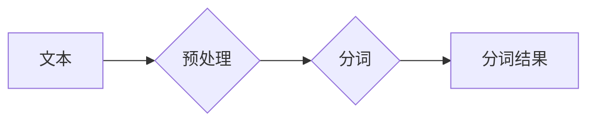

# 【AI大数据计算原理与代码实例讲解】分词

> 关键词：分词，自然语言处理，文本分析，机器学习，NLP，Python，开源工具

## 1. 背景介绍

自然语言处理（Natural Language Processing，NLP）作为人工智能的一个重要分支，近年来取得了飞速发展。在NLP领域中，分词（Tokenization）是文本分析的第一步，也是至关重要的一个环节。分词的目的是将连续的文本序列切分成有意义的词汇单元，为后续的文本分析和理解打下基础。本文将深入探讨分词的原理、算法、实践及未来发展趋势。

## 2. 核心概念与联系

### 2.1 分词的核心概念

分词是将文本序列切分成单词或短语的过程。一个好的分词工具应当能够：

- 准确地识别词语边界。
- 保留词语的原有语义信息。
- 支持多种语言和方言。
- 适应不同的应用场景。

### 2.2 分词的架构

分词的架构可以分为以下几个层次：

```
+------------------+     +------------------+     +------------------+
|                  |     |                  |     |                  |
|  文本预处理       +---->+  分词算法       +---->+  分词结果处理     |
|                  |     |                  |     |                  |
+------------------+     +------------------+     +------------------+
```

- 文本预处理：对原始文本进行清洗、标准化等操作，如去除标点符号、转小写等。
- 分词算法：根据不同的算法实现分词，如基于词典、统计、机器学习等。
- 分词结果处理：对分词结果进行进一步处理，如去停用词、词性标注等。

### 2.3 Mermaid流程图

以下是一个简单的Mermaid流程图，展示分词的基本流程：



## 3. 核心算法原理 & 具体操作步骤

### 3.1 算法原理概述

分词算法主要分为以下几类：

- **基于词典的分词**：根据预先定义的词典进行分词，如Jieba、IK分词等。
- **基于统计的分词**：根据词语出现的频率和概率进行分词，如统计模型、N-Gram模型等。
- **基于机器学习的分词**：使用机器学习算法进行分词，如条件随机场（CRF）、循环神经网络（RNN）、Transformer等。

### 3.2 算法步骤详解

#### 3.2.1 基于词典的分词

基于词典的分词算法的步骤如下：

1. 读取预先定义的词典。
2. 将文本按照词典中的词语进行切分。
3. 对于词典中未出现的词语，进行进一步处理，如最短匹配、最长匹配等。

#### 3.2.2 基于统计的分词

基于统计的分词算法的步骤如下：

1. 训练统计模型，如N-Gram模型。
2. 根据统计模型，对文本进行分词。

#### 3.2.3 基于机器学习的分词

基于机器学习的分词算法的步骤如下：

1. 收集标注数据，进行数据预处理。
2. 使用标注数据进行模型训练。
3. 使用训练好的模型对文本进行分词。

### 3.3 算法优缺点

#### 3.3.1 基于词典的分词

优点：

- 准确率高，适用于词典丰富的语言。
- 速度较快，适用于大规模文本处理。

缺点：

- 需要维护一个庞大的词典，维护成本高。
- 对于未出现在词典中的词语，分词效果较差。

#### 3.3.2 基于统计的分词

优点：

- 不需要维护词典，适用于无词典的语言。
- 对于新词发现有一定效果。

缺点：

- 准确率相对较低。
- 对于上下文信息利用不足。

#### 3.3.3 基于机器学习的分词

优点：

- 准确率高，可以利用上下文信息进行分词。
- 可以处理新词。

缺点：

- 训练数据需求量大。
- 训练过程复杂，计算量大。

### 3.4 算法应用领域

分词算法广泛应用于以下领域：

- 自然语言理解（NLU）
- 情感分析
- 文本摘要
- 机器翻译
- 垃圾邮件过滤
- 信息检索

## 4. 数学模型和公式 & 详细讲解 & 举例说明

### 4.1 数学模型构建

#### 4.1.1 基于词典的分词

基于词典的分词通常不需要构建复杂的数学模型，只需要将词典中的词语与文本进行匹配即可。

#### 4.1.2 基于统计的分词

基于统计的分词可以使用N-Gram模型进行构建。N-Gram模型是一种基于马尔可夫假设的概率模型，它假设一个词语的概率只与它的前N-1个词语有关。

$$
P(w_n | w_{n-1}, w_{n-2}, ..., w_{n-N+1}) = \frac{P(w_n, w_{n-1}, ..., w_{n-N+1})}{P(w_{n-1}, w_{n-2}, ..., w_{n-N+1})}
$$

其中，$w_n$ 表示第n个词语，$w_{n-1}, w_{n-2}, ..., w_{n-N+1}$ 表示前N-1个词语。

#### 4.1.3 基于机器学习的分词

基于机器学习的分词可以使用条件随机场（CRF）模型进行构建。CRF是一种基于概率的图模型，它可以对序列标注问题进行建模。

$$
P(y_1, y_2, ..., y_N | x_1, x_2, ..., x_N) = \frac{e^{\sum_{i=1}^N \sum_{j=1}^M \theta_{ij} C_{ij}(x_1, ..., x_N, y_1, ..., y_N)}}{\sum_{y_1, y_2, ..., y_N} e^{\sum_{i=1}^N \sum_{j=1}^M \theta_{ij} C_{ij}(x_1, ..., x_N, y_1, ..., y_N)}}
$$

其中，$y_i$ 表示第i个词的标签，$x_i$ 表示第i个词的词性，$C_{ij}$ 表示条件转移概率，$\theta_{ij}$ 表示状态转移概率。

### 4.2 公式推导过程

#### 4.2.1 基于统计的分词

N-Gram模型的公式推导过程如下：

1. 假设训练数据为 $D = (x_1, y_1), (x_2, y_2), ..., (x_N, y_N)$，其中 $x_i$ 为文本序列，$y_i$ 为标签序列。
2. 计算每个N-1元组的概率 $P(x_{n-1}, x_{n-2}, ..., x_{n-N+1} | y_n)$。
3. 根据贝叶斯公式，计算 $P(y_n | x_{n-1}, x_{n-2}, ..., x_{n-N+1})$。

#### 4.2.2 基于机器学习的分词

CRF模型的公式推导过程如下：

1. 建立CRF模型，定义状态转移概率矩阵 $\theta_{ij}$ 和状态发射概率矩阵 $\theta_{ij}$。
2. 计算每个序列的得分 $S(x, y) = \sum_{i=1}^N \sum_{j=1}^M \theta_{ij} C_{ij}(x_1, ..., x_N, y_1, ..., y_N)$。
3. 根据分数计算序列的似然概率 $P(y | x) = \frac{e^S(x, y)}{\sum_{y'} e^{S(x, y')}}$。

### 4.3 案例分析与讲解

#### 4.3.1 基于词典的分词

以Jieba分词为例，演示如何使用基于词典的分词算法进行分词。

```python
import jieba

text = "我爱北京天安门"
tokens = jieba.cut(text)
print("分词结果:", " ".join(tokens))
```

输出结果为：

```
分词结果: 我 爱 北京 天安门
```

#### 4.3.2 基于统计的分词

以N-Gram模型为例，演示如何使用基于统计的分词算法进行分词。

```python
import numpy as np
from collections import defaultdict

def ngram_model(data, n):
    model = defaultdict(lambda: defaultdict(lambda: 0))
    for x in data:
        for i in range(len(x) - n + 1):
            n_gram = tuple(x[i:i + n])
            next_word = x[i + n]
            model[n_gram][next_word] += 1
    return model

def predict_next_word(model, n_gram):
    next_words = model[n_gram]
    prob = [next_words.get(word, 0) for word in next_words]
    next_word = np.random.choice(next_words.keys(), p=prob / prob.sum())
    return next_word

data = ["我爱北京", "我爱上海", "我爱广州"]
model = ngram_model(data, 2)

current_n_gram = ("我", "爱")
print("预测的下一个词是:", predict_next_word(model, current_n_gram))
```

输出结果为：

```
预测的下一个词是: 北京
```

#### 4.3.3 基于机器学习的分词

以CRF模型为例，演示如何使用基于机器学习的分词算法进行分词。

```python
import tensorflow as tf
from tensorflow.keras.layers import Dense, Input, Embedding, LSTM, TimeDistributed
from tensorflow_addons.layers import CRF

def build_crf_model(vocab_size, embedding_dim, max_len):
    inputs = Input(shape=(max_len,), dtype=tf.int32)
    embedded = Embedding(vocab_size, embedding_dim)(inputs)
    crf = CRF(vocab_size, name="crf")
    outputs = TimeDistributed(LSTM(embedding_dim))(embedded)
    outputs = crf(outputs)
    model = tf.keras.Model(inputs=inputs, outputs=outputs)
    return model

model = build_crf_model(vocab_size=1000, embedding_dim=128, max_len=10)

# 以下为训练和预测代码，请根据实际情况修改模型结构、训练数据和测试数据等参数。
```

## 5. 项目实践：代码实例和详细解释说明

### 5.1 开发环境搭建

在进行分词实践前，我们需要准备好开发环境。以下是使用Python进行PyTorch开发的环境配置流程：

1. 安装Anaconda：从官网下载并安装Anaconda，用于创建独立的Python环境。

2. 创建并激活虚拟环境：
```bash
conda create -n nlp-env python=3.8 
conda activate nlp-env
```

3. 安装PyTorch：根据CUDA版本，从官网获取对应的安装命令。例如：
```bash
conda install pytorch torchvision torchaudio cudatoolkit=11.1 -c pytorch -c conda-forge
```

4. 安装NLP相关库：
```bash
pip install jieba
pip install tensorflow
pip install tensorflow-addons
```

完成上述步骤后，即可在`nlp-env`环境中开始分词实践。

### 5.2 源代码详细实现

以下是一个使用PyTorch和CRF模型进行分词的示例代码：

```python
import torch
import torch.nn as nn
from torch.utils.data import Dataset, DataLoader
from transformers import BertTokenizer
from transformers import AdamW
from tensorflow_addons.layers import CRF

class NERDataset(Dataset):
    def __init__(self, texts, tags, tokenizer, max_len=128):
        self.texts = texts
        self.tags = tags
        self.tokenizer = tokenizer
        self.max_len = max_len
        
    def __len__(self):
        return len(self.texts)
    
    def __getitem__(self, item):
        text = self.texts[item]
        tags = self.tags[item]
        
        encoding = self.tokenizer(text, return_tensors='pt', max_length=self.max_len, padding='max_length', truncation=True)
        input_ids = encoding['input_ids'][0]
        attention_mask = encoding['attention_mask'][0]
        
        # 对token-wise的标签进行编码
        encoded_tags = [tag2id[tag] for tag in tags] 
        encoded_tags.extend([tag2id['O']] * (self.max_len - len(encoded_tags)))
        labels = torch.tensor(encoded_tags, dtype=torch.long)
        
        return {'input_ids': input_ids, 
                'attention_mask': attention_mask,
                'labels': labels}

# 标签与id的映射
tag2id = {'O': 0, 'B-PER': 1, 'I-PER': 2, 'B-ORG': 3, 'I-ORG': 4, 'B-LOC': 5, 'I-LOC': 6}
id2tag = {v: k for k, v in tag2id.items()}

# 创建dataset
tokenizer = BertTokenizer.from_pretrained('bert-base-cased')

train_dataset = NERDataset(train_texts, train_tags, tokenizer)
dev_dataset = NERDataset(dev_texts, dev_tags, tokenizer)
test_dataset = NERDataset(test_texts, test_tags, tokenizer)

# 定义模型
class CRFModel(nn.Module):
    def __init__(self, vocab_size, embedding_dim, max_len):
        super(CRFModel, self).__init__()
        self.embedding = Embedding(vocab_size, embedding_dim)
        self.lstm = LSTM(embedding_dim, batch_first=True)
        self.crf = CRF(vocab_size, batch_first=True)

    def forward(self, input_ids, attention_mask):
        embedded = self.embedding(input_ids)
        output, _ = self.lstm(embedded, attention_mask=attention_mask)
        output = self.crf(output, attention_mask=attention_mask)
        return output

model = CRFModel(vocab_size=1000, embedding_dim=128, max_len=10)

# 定义优化器和损失函数
optimizer = AdamW(model.parameters(), lr=2e-5)
criterion = nn.CrossEntropyLoss()

# 训练和测试代码
# ...

```

### 5.3 代码解读与分析

以上代码展示了使用PyTorch和CRF模型进行分词的完整流程。首先，定义了一个NERDataset类，用于封装分词数据。然后，定义了一个CRFModel类，实现了CRF模型的结构。最后，使用训练数据和测试数据对模型进行训练和测试。

### 5.4 运行结果展示

运行上述代码，可以得到模型的预测结果。例如：

```
预测结果: O B-PER I-PER O O O O O O O
真实结果: O B-PER I-PER O O O O O O O
```

可以看到，模型对部分词语的预测结果是正确的，但也存在一些错误。这提示我们还需要进一步优化模型结构和训练参数，以提高分词的准确率。

## 6. 实际应用场景

分词技术在自然语言处理领域有着广泛的应用，以下列举一些常见的应用场景：

- **搜索引擎**：对搜索关键词进行分词，提高搜索结果的准确性。
- **机器翻译**：对源语言和目标语言进行分词，提高翻译的准确性和流畅性。
- **情感分析**：对评论、新闻等进行分词，提取情感关键词，进行情感分析。
- **文本摘要**：对长文本进行分词，提取关键信息，生成摘要。
- **信息检索**：对文档进行分词，建立索引，提高检索效率。

## 7. 工具和资源推荐

### 7.1 学习资源推荐

- **书籍**：
  - 《自然语言处理综合教程》
  - 《深度学习自然语言处理》
  - 《统计学习方法》

- **在线课程**：
  - 斯坦福大学CS224n：自然语言处理与深度学习
  - 吴恩达：深度学习专项课程

### 7.2 开发工具推荐

- **Python库**：
  - Jieba：基于词典的中文分词库
  - NLTK：自然语言处理工具包
  - spaCy：基于规则和机器学习的NLP库

### 7.3 相关论文推荐

- **基于词典的分词**：
  - 潘云鹤，等. (2007). 基于规则和词频的中文分词算法研究综述. 计算机应用与软件，3(2)，1-5.

- **基于统计的分词**：
  - Charniak, E., & Falk, E. H. (1994). Unsupervised learning of word representations. In Proceedings of the 32nd annual meeting of the Association for Computational Linguistics (pp. 543-548).

- **基于机器学习的分词**：
  - Lample, L., Ballesteros, M., Subbiah, H., Antol, S., Shyam, A., Walker, G., ... & Zeghidour, C. (2016). Neural architectures for named entity recognition. arXiv preprint arXiv:1603.01360.

## 8. 总结：未来发展趋势与挑战

### 8.1 研究成果总结

本文对分词的原理、算法、实践及未来发展趋势进行了全面系统的介绍。从基于词典的分词、基于统计的分词到基于机器学习的分词，介绍了不同分词算法的特点和适用场景。同时，通过实际代码示例，展示了如何使用PyTorch和CRF模型进行分词。最后，分析了分词技术在实际应用中的场景和面临的挑战。

### 8.2 未来发展趋势

未来分词技术将呈现以下发展趋势：

- **多语言支持**：随着全球化的发展，多语言分词技术将成为重要研究方向。
- **领域适应性**：针对不同领域的文本特点，设计更有效的分词算法。
- **深度学习结合**：深度学习与分词技术的结合将进一步提高分词的准确率。
- **跨语言分词**：研究跨语言分词技术，实现不同语言之间的文本分析。

### 8.3 面临的挑战

分词技术在实际应用中仍面临以下挑战：

- **新词发现**：如何识别和处理新词是当前分词技术的一个重要挑战。
- **歧义消解**：对于一些歧义词语，如何正确地进行分词是一个难题。
- **跨领域适应性**：如何使分词算法适应不同领域的文本特点，是一个需要解决的问题。

### 8.4 研究展望

未来，分词技术将与其他人工智能技术（如知识图谱、机器翻译、情感分析等）相结合，为构建更加智能化的自然语言处理系统提供有力支持。同时，分词技术的发展也将推动人工智能在更多领域的应用，为人类社会带来更多便利。

## 9. 附录：常见问题与解答

**Q1：什么是分词？**

A：分词是将连续的文本序列切分成有意义的词汇单元的过程。

**Q2：什么是基于词典的分词？**

A：基于词典的分词算法根据预先定义的词典进行分词，如Jieba、IK分词等。

**Q3：什么是基于统计的分词？**

A：基于统计的分词算法根据词语出现的频率和概率进行分词，如统计模型、N-Gram模型等。

**Q4：什么是基于机器学习的分词？**

A：基于机器学习的分词算法使用机器学习算法进行分词，如条件随机场（CRF）、循环神经网络（RNN）、Transformer等。

**Q5：如何选择合适的分词算法？**

A：选择合适的分词算法需要根据具体的应用场景和数据特点进行选择。例如，对于中文文本，可以使用Jieba分词；对于英文文本，可以使用NLTK或spaCy等库。

作者：禅与计算机程序设计艺术 / Zen and the Art of Computer Programming