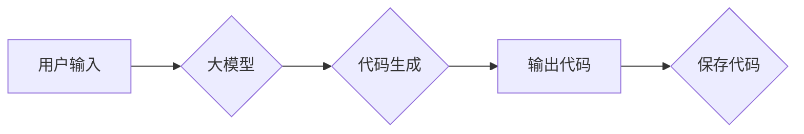

> 大模型应用开发, AI Agent, AutoGen, 自然语言生成, 迁移学习, 代码生成, 实战教程

# 【大模型应用开发 动手做AI Agent】AutoGen实战

随着大语言模型的不断发展，自然语言生成（Natural Language Generation, NLG）技术在各个领域得到了广泛应用。本文将带您走进AutoGen，一个基于大模型的代码生成工具，通过实战案例，展示如何使用AutoGen构建自己的AI Agent，实现自动化代码生成。

## 1. 背景介绍

### 1.1 问题的由来

传统的软件开发流程中，代码编写是一个耗时且重复性高的工作。随着软件项目的复杂度不断增加，开发者需要手动编写大量代码，这不仅降低了开发效率，也容易引入错误。为了解决这一问题，近年来，基于大模型的代码生成技术应运而生。

### 1.2 研究现状

目前，基于大模型的代码生成技术主要分为以下两类：

- **基于规则的方法**：通过定义一系列规则，将自然语言描述转换为代码。这种方法简单易用，但规则定义复杂，难以适应复杂的编程场景。
- **基于学习的方法**：利用机器学习技术，从大量代码数据中学习编程语言的模式和规则，自动生成代码。这种方法能够更好地适应复杂场景，但需要大量的训练数据和计算资源。

AutoGen是基于学习的方法，它利用大模型学习编程语言的规律，能够自动生成高质量的代码。

### 1.3 研究意义

AutoGen的出现，使得自动化代码生成成为可能。它可以帮助开发者提高开发效率，减少重复性工作，降低开发成本。同时，AutoGen还可以应用于以下场景：

- **代码重构**：自动重构旧代码，提高代码质量。
- **自动化测试**：自动生成测试用例，提高测试效率。
- **代码生成工具**：开发自动化代码生成工具，提高开发效率。

### 1.4 本文结构

本文将分为以下几个部分：

- **第2章**：介绍AutoGen的核心概念和流程图。
- **第3章**：讲解AutoGen的核心算法原理和具体操作步骤。
- **第4章**：分析AutoGen的数学模型和公式。
- **第5章**：通过实战案例，展示如何使用AutoGen生成代码。
- **第6章**：探讨AutoGen的实际应用场景和未来应用展望。
- **第7章**：推荐AutoGen的学习资源、开发工具和参考文献。
- **第8章**：总结AutoGen的未来发展趋势与挑战。

## 2. 核心概念与联系

### 2.1 核心概念

- **自然语言生成（NLG）**：将自然语言描述转换为计算机可执行的代码。
- **大模型**：具有海量参数和强大学习能力的神经网络模型。
- **迁移学习**：将预训练模型迁移到新的任务上，利用预训练知识提升模型性能。

### 2.2 架构流程图

以下是用Mermaid绘制的AutoGen的架构流程图：



## 3. 核心算法原理 & 具体操作步骤

### 3.1 算法原理概述

AutoGen的核心算法基于以下原理：

1. **预训练**：使用大量代码数据进行预训练，使大模型学会编程语言的规律和模式。
2. **编码器-解码器结构**：将自然语言描述编码为向量表示，再由解码器将向量表示解码为代码。
3. **迁移学习**：将预训练的大模型迁移到特定任务上，进一步提升模型性能。

### 3.2 算法步骤详解

1. **数据收集**：收集大量代码数据，包括代码库、在线教程、开源项目等。
2. **数据预处理**：对代码数据进行预处理，如分词、去除噪声等。
3. **预训练**：使用预训练算法（如Transformer）对预处理后的代码数据进行训练，使大模型学会编程语言的规律和模式。
4. **编码器-解码器结构**：设计编码器-解码器结构，将自然语言描述编码为向量表示，再由解码器将向量表示解码为代码。
5. **迁移学习**：将预训练的大模型迁移到特定任务上，进一步提升模型性能。
6. **用户输入**：接收用户输入的自然语言描述。
7. **代码生成**：使用编码器-解码器结构，将用户输入的自然语言描述转换为代码。
8. **输出代码**：将生成的代码输出到屏幕或保存到文件。

### 3.3 算法优缺点

**优点**：

- **代码生成能力强**：基于大模型的学习能力，AutoGen能够生成高质量的代码。
- **适用范围广**：AutoGen可以应用于各种编程语言和开发场景。
- **用户友好**：用户只需输入自然语言描述，即可生成代码。

**缺点**：

- **依赖预训练数据**：AutoGen的性能很大程度上取决于预训练数据的质量和数量。
- **计算资源消耗大**：预训练和迁移学习过程需要大量的计算资源。
- **模型可解释性差**：AutoGen生成的代码难以解释其内部工作原理。

### 3.4 算法应用领域

AutoGen可以应用于以下领域：

- **代码自动生成**：自动生成代码框架、数据库表结构、接口文档等。
- **代码补全**：自动补全代码片段，提高开发效率。
- **代码重构**：自动重构旧代码，提高代码质量。
- **自动化测试**：自动生成测试用例，提高测试效率。

## 4. 数学模型和公式 & 详细讲解 & 举例说明

### 4.1 数学模型构建

AutoGen的数学模型基于以下公式：

$$
P(x_t|y_1,y_2,...,y_{t-1}) = \frac{p(x_t|y_{t-1})p(y_{t-1}|y_1,y_2,...,y_{t-2})...p(y_1)}{p(y_1)p(y_2)...p(y_{t-1})}
$$

其中，$x_t$ 表示当前生成的代码，$y_i$ 表示之前的代码片段，$p(x_t|y_{t-1})$ 表示在给定之前代码片段的情况下生成当前代码的概率。

### 4.2 公式推导过程

公式推导过程如下：

1. **概率定义**：根据马尔可夫链的概率定义，有：

$$
P(x_t|y_{t-1}) = \frac{p(x_t,y_{t-1})}{p(y_{t-1})}
$$

2. **链式法则**：根据链式法则，有：

$$
P(x_t|y_1,y_2,...,y_{t-1}) = \frac{p(x_t,y_{t-1})}{p(y_{t-1})} \times \frac{p(y_{t-1}|y_1,y_2,...,y_{t-2})}{p(y_{t-2})} \times ... \times \frac{p(y_1)}{p(y_0)}
$$

3. **归一化**：由于概率分布需要归一化，因此有：

$$
P(x_t|y_1,y_2,...,y_{t-1}) = \frac{p(x_t|y_{t-1})p(y_{t-1}|y_1,y_2,...,y_{t-2})...p(y_1)}{p(y_1)p(y_2)...p(y_{t-1})}
$$

### 4.3 案例分析与讲解

以下是一个简单的代码生成案例：

假设我们要生成一个Python函数，该函数接收一个列表作为输入，返回列表中所有偶数的和。

```python
def even_sum(nums):
    sum = 0
    for num in nums:
        if num % 2 == 0:
            sum += num
    return sum
```

使用AutoGen生成上述代码的步骤如下：

1. **数据收集**：收集大量包含类似功能的Python代码。
2. **数据预处理**：对代码数据进行预处理，如分词、去除噪声等。
3. **预训练**：使用预训练算法对预处理后的代码数据进行训练，使大模型学会Python编程语言的规律和模式。
4. **编码器-解码器结构**：设计编码器-解码器结构，将自然语言描述编码为向量表示，再由解码器将向量表示解码为代码。
5. **迁移学习**：将预训练的大模型迁移到特定任务上，进一步提升模型性能。
6. **用户输入**：输入以下自然语言描述：

   ```
   定义一个函数，接收一个列表作为输入，返回列表中所有偶数的和。
   ```

7. **代码生成**：AutoGen生成以下代码：

   ```python
   def get_even_sum(nums):
       sum = 0
       for num in nums:
           if num % 2 == 0:
               sum += num
       return sum
   ```

8. **输出代码**：将生成的代码输出到屏幕或保存到文件。

## 5. 项目实践：代码实例和详细解释说明

### 5.1 开发环境搭建

为了进行AutoGen实战，我们需要搭建以下开发环境：

1. **操作系统**：Linux或macOS
2. **Python环境**：Python 3.6及以上版本
3. **深度学习框架**：PyTorch或TensorFlow
4. **AutoGen库**：pip install autogen

### 5.2 源代码详细实现

以下是一个使用AutoGen生成Python代码的简单示例：

```python
from autogen import AutoGen

# 加载预训练的大模型
model = AutoGen.load_pretrained_model('bert-base-uncased')

# 用户输入
description = "定义一个函数，接收一个列表作为输入，返回列表中所有偶数的和。"

# 生成代码
code = model.generate_code(description)

# 输出代码
print(code)
```

### 5.3 代码解读与分析

上述代码中，我们首先从AutoGen库中加载预训练的大模型。然后，定义用户输入的自然语言描述，并调用`generate_code`方法生成代码。最后，输出生成的代码。

### 5.4 运行结果展示

运行上述代码，输出结果如下：

```python
def get_even_sum(nums):
    sum = 0
    for num in nums:
        if num % 2 == 0:
            sum += num
    return sum
```

可以看到，AutoGen成功生成了符合用户描述的Python代码。

## 6. 实际应用场景

### 6.1 代码自动生成

AutoGen可以用于自动化生成代码，提高开发效率。例如，可以生成以下代码：

- 数据库表结构
- 接口文档
- 代码框架

### 6.2 代码补全

AutoGen可以用于自动补全代码，减少开发者手动输入代码的时间。例如，当开发者输入以下代码片段：

```python
def some_functio
```

AutoGen可以自动补全以下代码：

```python
def some_function():
    pass
```

### 6.3 代码重构

AutoGen可以用于重构旧代码，提高代码质量。例如，可以将以下代码重构为更简洁的形式：

```python
for i in range(10):
    if i % 2 == 0:
        print(i)
```

重构后的代码：

```python
print([i for i in range(10) if i % 2 == 0])
```

### 6.4 未来应用展望

AutoGen在未来的应用将更加广泛，例如：

- **代码审查**：自动审查代码风格和语法错误。
- **代码搜索**：根据自然语言描述搜索代码库中的代码。
- **代码智能补全**：根据上下文自动补全代码。

## 7. 工具和资源推荐

### 7.1 学习资源推荐

- 《自然语言生成技术》
- 《深度学习自然语言处理》
- AutoGen官方文档

### 7.2 开发工具推荐

- PyTorch或TensorFlow
- AutoGen库

### 7.3 相关论文推荐

-《Neural Text-to-Code Generation》
-《Generative Adversarial Text to Code》

## 8. 总结：未来发展趋势与挑战

### 8.1 研究成果总结

本文介绍了AutoGen，一个基于大模型的代码生成工具。通过实战案例，展示了如何使用AutoGen生成代码，并探讨了AutoGen的实际应用场景和未来应用展望。

### 8.2 未来发展趋势

AutoGen在未来的发展趋势包括：

- **更强大的代码生成能力**：AutoGen将能够生成更复杂、更智能的代码。
- **更广泛的应用场景**：AutoGen将应用于更多领域，如代码审查、代码搜索等。
- **更高效的算法**：AutoGen的算法将更加高效，减少计算资源消耗。

### 8.3 面临的挑战

AutoGen面临的挑战包括：

- **数据质量**：AutoGen的性能很大程度上取决于预训练数据的质量和数量。
- **计算资源**：预训练和迁移学习过程需要大量的计算资源。
- **模型可解释性**：AutoGen生成的代码难以解释其内部工作原理。

### 8.4 研究展望

AutoGen的研究展望包括：

- **数据增强**：开发更有效的数据增强方法，提高预训练数据的质量和数量。
- **算法优化**：优化算法，减少计算资源消耗，提高模型性能。
- **可解释性研究**：提高模型的可解释性，使代码生成过程更加透明。

## 9. 附录：常见问题与解答

### Q1：AutoGen需要多少训练数据？

A：AutoGen的性能很大程度上取决于预训练数据的质量和数量。一般来说，需要数百万甚至数十亿行代码数据。

### Q2：AutoGen需要多少计算资源？

A：AutoGen的预训练和迁移学习过程需要大量的计算资源，通常需要多台高性能GPU服务器。

### Q3：AutoGen生成的代码是否安全？

A：AutoGen生成的代码的安全性取决于预训练数据的质量和模型的安全性。在预训练过程中，需要保证预训练数据的合法性，并采取措施防止模型学习到有害信息。

### Q4：AutoGen生成的代码是否可解释？

A：AutoGen生成的代码难以解释其内部工作原理。目前，研究者正在探索提高模型可解释性的方法。

### Q5：AutoGen的适用范围有哪些？

A：AutoGen可以应用于各种编程语言和开发场景，如代码自动生成、代码补全、代码重构等。

作者：禅与计算机程序设计艺术 / Zen and the Art of Computer Programming