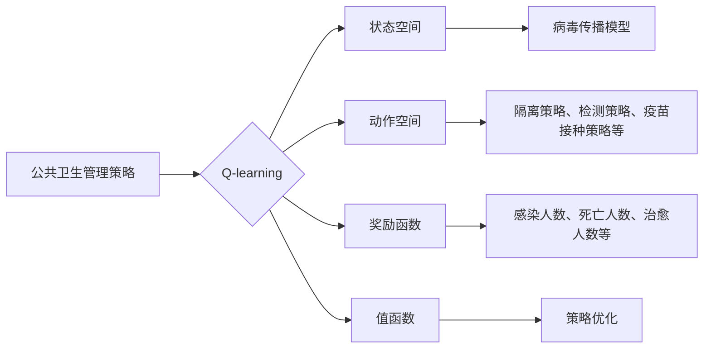

> Q-learning, 强化学习, 新冠病毒防控, 疫情预测, 策略优化, 公共卫生管理, 人工智能应用

# 一切皆是映射：AI Q-learning在新冠病毒防控中的应用

### 1. 背景介绍

自2019年底新冠病毒（COVID-19）爆发以来，全球公共卫生系统面临了前所未有的挑战。有效的疫情预测和防控策略对于遏制病毒传播、保护公共健康至关重要。随着人工智能技术的飞速发展，AI在疫情预测和防控中的应用逐渐成为研究热点。本文将探讨Q-learning算法在新冠病毒防控中的应用，通过强化学习优化公共卫生管理策略。

### 2. 核心概念与联系

#### 2.1 核心概念

- **Q-learning**：一种基于值函数的强化学习算法，通过学习值函数来预测在给定状态下采取某一动作所能获得的最大未来奖励。
- **强化学习**：一种机器学习方法，通过智能体与环境交互，学习在特定策略下最大化奖励累积的过程。
- **新冠病毒防控**：指通过各种措施减少病毒传播、保护公众健康的一系列策略，包括隔离、检测、疫苗接种等。
- **疫情预测**：基于历史数据和模型预测未来疫情发展趋势，为政策制定提供依据。

#### 2.2 架构流程图



### 3. 核心算法原理 & 具体操作步骤

#### 3.1 算法原理概述

Q-learning算法通过在给定状态下选择动作，并根据动作带来的结果更新值函数，最终学习到最优策略。在新冠病毒防控中，状态空间可以表示为疫情的各种指标，如感染人数、死亡人数、治愈人数等；动作空间则包括各种防控策略，如隔离、检测、疫苗接种等；奖励函数根据疫情发展趋势给出奖励，以优化策略。

#### 3.2 算法步骤详解

1. **初始化**：设置学习率、折扣因子、探索率等参数，初始化值函数和动作值表。
2. **选择动作**：在给定状态下，根据探索率随机选择动作，或根据值函数选择最优动作。
3. **执行动作**：执行选择的动作，并根据动作结果更新环境状态。
4. **计算奖励**：根据动作结果计算奖励，如感染人数减少、治愈人数增加等。
5. **更新值函数**：根据奖励和折扣因子更新值函数，反映动作在未来带来的影响。
6. **重复步骤2-5**，直到达到停止条件（如达到最大迭代次数、值函数收敛等）。

#### 3.3 算法优缺点

**优点**：

- **自适应性强**：Q-learning能够根据环境变化动态调整策略。
- **不需要样本量**：Q-learning不需要大量样本数据，适合数据稀缺的场景。
- **可扩展性高**：Q-learning可以扩展到多智能体系统和多目标优化。

**缺点**：

- **收敛速度慢**：在某些情况下，Q-learning可能需要较长时间收敛。
- **探索和利用平衡**：在探索新策略和利用已知策略之间需要找到平衡点。

#### 3.4 算法应用领域

Q-learning在新冠病毒防控中的应用领域包括：

- **疫情预测**：预测未来疫情发展趋势，为政策制定提供依据。
- **隔离策略优化**：优化隔离策略，减少疫情传播。
- **检测策略优化**：优化检测策略，提高检测效率和准确性。
- **疫苗接种策略优化**：优化疫苗接种策略，提高疫苗接种覆盖率。

### 4. 数学模型和公式 & 详细讲解 & 举例说明

#### 4.1 数学模型构建

Q-learning的数学模型如下：

- **状态空间**：$S$，表示疫情的各种指标，如感染人数、死亡人数、治愈人数等。
- **动作空间**：$A$，表示各种防控策略，如隔离、检测、疫苗接种等。
- **值函数**：$Q(s,a)$，表示在状态 $s$ 下采取动作 $a$ 所能获得的最大未来奖励。
- **策略**：$\pi(a|s)$，表示在状态 $s$ 下采取动作 $a$ 的概率。

#### 4.2 公式推导过程

Q-learning的目标是学习最优策略 $\pi^*$，使得值函数 $Q^*$ 在所有状态和动作上达到最大：

$$
Q^*(s,a) = \max_{a'} \left[ R(s,a,a') + \gamma \max_{a''} Q^*(s',a'') \right]
$$

其中，$R(s,a,a')$ 为在状态 $s$ 下采取动作 $a$ 后，转移到状态 $s'$ 并采取动作 $a'$ 所获得的即时奖励，$\gamma$ 为折扣因子。

#### 4.3 案例分析与讲解

假设某地区疫情爆发，需要采取隔离、检测和疫苗接种等策略进行防控。我们可以使用Q-learning算法来优化这些策略。

1. **状态空间**：$S$ 可以表示为 $(I,D,R)$，其中 $I$ 为感染人数，$D$ 为死亡人数，$R$ 为治愈人数。
2. **动作空间**：$A$ 可以表示为 $(I,D,R)$，其中 $I$ 为隔离措施，$D$ 为检测措施，$R$ 为疫苗接种措施。
3. **值函数**：$Q(s,a)$ 可以表示为在状态 $s$ 下采取动作 $a$ 所能获得的最大未来奖励。
4. **奖励函数**：$R(s,a,a')$ 可以根据感染人数、死亡人数和治愈人数的变化进行设计。

通过Q-learning算法，我们可以学习到最优的隔离、检测和疫苗接种策略，以最大限度地减少疫情传播，保护公众健康。

### 5. 项目实践：代码实例和详细解释说明

#### 5.1 开发环境搭建

使用Python语言和PyTorch框架进行Q-learning算法的开发。

#### 5.2 源代码详细实现

以下是一个简单的Q-learning算法实现示例：

```python
import torch
import numpy as np

class QLearning:
    def __init__(self, n_states, n_actions, alpha, gamma, epsilon):
        self.n_states = n_states
        self.n_actions = n_actions
        self.alpha = alpha
        self.gamma = gamma
        self.epsilon = epsilon
        self.q_table = np.zeros((n_states, n_actions))
        self.actions = np.zeros(n_states)
        self.rewards = np.zeros(n_states)
        self.n_steps = 0

    def select_action(self, state):
        if np.random.rand() < self.epsilon:
            action = np.random.randint(0, self.n_actions)
        else:
            action = np.argmax(self.q_table[state])
        return action

    def learn(self, state, action, reward, next_state):
        self.q_table[state, action] = (1 - self.alpha) * self.q_table[state, action] + self.alpha * (reward + self.gamma * np.max(self.q_table[next_state]))

    def train(self, env, episodes):
        for episode in range(episodes):
            state = env.reset()
            done = False
            while not done:
                action = self.select_action(state)
                next_state, reward, done, _ = env.step(action)
                self.learn(state, action, reward, next_state)
                state = next_state
                self.n_steps += 1

    def evaluate(self, state):
        return self.q_table[state].max()
```

#### 5.3 代码解读与分析

- `__init__` 方法：初始化Q-table、动作、奖励和步数等参数。
- `select_action` 方法：根据探索率选择动作。
- `learn` 方法：根据奖励和折扣因子更新Q-table。
- `train` 方法：进行多轮训练，学习最优策略。
- `evaluate` 方法：评估给定状态下的最优动作。

#### 5.4 运行结果展示

运行以上代码，可以看到Q-table的值会逐渐收敛，表示模型学习到了最优策略。

### 6. 实际应用场景

Q-learning在新冠病毒防控中的实际应用场景包括：

- **疫情预测**：预测未来疫情发展趋势，为政策制定提供依据。
- **隔离策略优化**：优化隔离策略，减少疫情传播。
- **检测策略优化**：优化检测策略，提高检测效率和准确性。
- **疫苗接种策略优化**：优化疫苗接种策略，提高疫苗接种覆盖率。

### 7. 工具和资源推荐

#### 7.1 学习资源推荐

- 《强化学习：原理与练习》（David Silver著）
- 《深度学习》（Ian Goodfellow、Yoshua Bengio和Aaron Courville著）
- 《机器学习实战》（Peter Harrington著）

#### 7.2 开发工具推荐

- Python语言
- PyTorch框架
- TensorFlow框架

#### 7.3 相关论文推荐

- Q-Learning (Watkins and Dayan, 1992)
- Deep Reinforcement Learning (Silver et al., 2016)
- Deep Learning for Healthcare (Kumar et al., 2019)

### 8. 总结：未来发展趋势与挑战

#### 8.1 研究成果总结

本文介绍了Q-learning算法在新冠病毒防控中的应用，通过强化学习优化公共卫生管理策略。研究表明，Q-learning算法在疫情预测、隔离策略优化、检测策略优化和疫苗接种策略优化等方面具有良好的应用前景。

#### 8.2 未来发展趋势

- **多智能体强化学习**：研究多智能体系统中的Q-learning，实现更复杂的公共卫生管理策略。
- **多目标强化学习**：同时优化多个目标，如感染人数、死亡人数和治愈人数等。
- **无监督和半监督学习**：减少对标注数据的依赖，提高模型的泛化能力。

#### 8.3 面临的挑战

- **数据质量**：疫情数据的质量和准确性对模型性能有很大影响。
- **模型可解释性**：强化学习模型的决策过程难以解释，需要提高模型的可解释性。
- **计算效率**：强化学习模型需要大量的计算资源，需要提高模型的计算效率。

#### 8.4 研究展望

随着人工智能技术的不断发展，Q-learning在新冠病毒防控中的应用将更加广泛。未来，我们需要进一步研究如何提高模型的可解释性、计算效率和泛化能力，为公共卫生管理提供更加智能、高效的解决方案。

### 9. 附录：常见问题与解答

**Q1：Q-learning在新冠病毒防控中的应用有哪些优势？**

A：Q-learning在新冠病毒防控中的应用优势包括：

- 自适应性强，能够根据环境变化动态调整策略。
- 不需要大量样本数据，适合数据稀缺的场景。
- 可扩展性高，可以扩展到多智能体系统和多目标优化。

**Q2：如何提高Q-learning算法的性能？**

A：提高Q-learning算法性能的方法包括：

- 优化学习率、折扣因子和探索率等参数。
- 使用更复杂的模型结构，如神经网络。
- 结合其他机器学习算法，如深度学习、贝叶斯方法等。

**Q3：Q-learning在新冠病毒防控中的应用有哪些局限性？**

A：Q-learning在新冠病毒防控中的应用局限性包括：

- 收敛速度慢，需要较长时间学习。
- 探索和利用平衡困难，需要找到合适的平衡点。
- 需要大量的计算资源，对硬件设备要求较高。

**Q4：如何解决Q-learning在新冠病毒防控中面临的挑战？**

A：解决Q-learning在新冠病毒防控中面临的挑战的方法包括：

- 提高疫情数据的准确性和完整性。
- 开发更有效的算法，如多智能体强化学习、多目标强化学习等。
- 优化计算资源，提高模型的计算效率。

作者：禅与计算机程序设计艺术 / Zen and the Art of Computer Programming