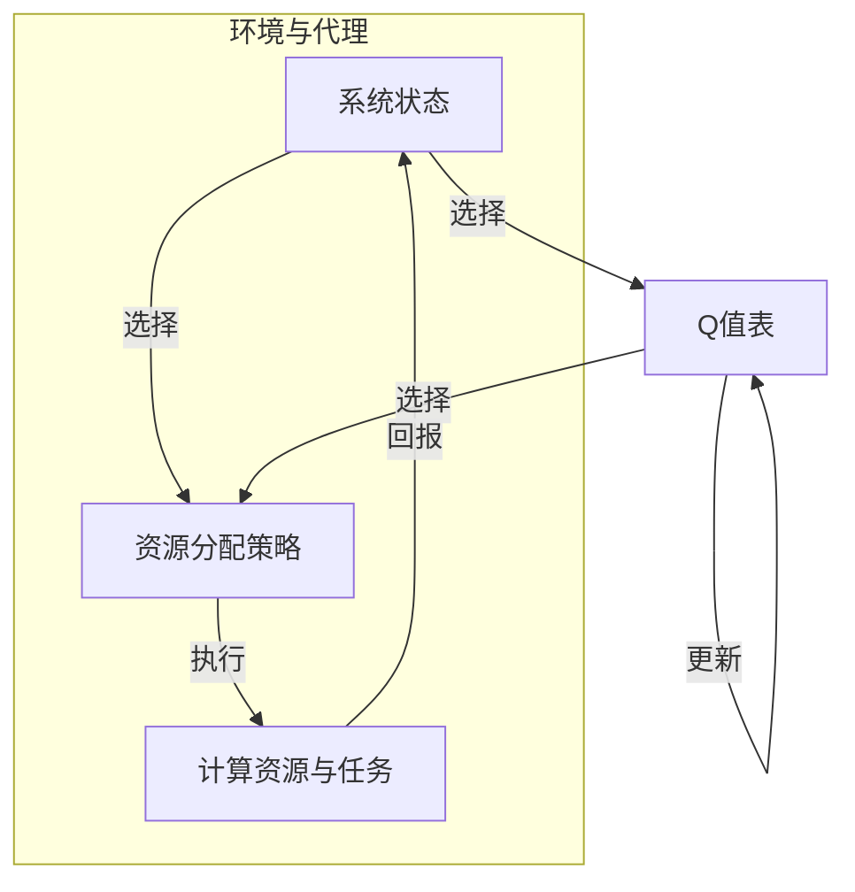

# 一切皆是映射：AI Q-learning在资源调度中的新突破

> 关键词：Q-learning, 资源调度, 强化学习, AI, 优化算法, 映射学习, 系统性能

## 1. 背景介绍

随着云计算和大数据技术的快速发展，资源调度问题在各个领域变得日益重要。资源调度是指根据任务需求和系统状态，合理分配计算资源，以最大化系统性能或最小化资源成本。传统的资源调度方法通常基于预定义的规则或启发式算法，但往往难以适应动态变化的系统环境和复杂的任务需求。

近年来，人工智能（AI）技术的兴起为资源调度带来了新的思路和方法。其中，Q-learning作为一种经典的强化学习算法，因其强大的适应性和灵活性，在资源调度领域展现出了巨大的潜力。本文将深入探讨Q-learning在资源调度中的应用，分析其原理、实现步骤以及在实际场景中的应用效果。

## 2. 核心概念与联系

### 2.1 核心概念

#### 2.1.1 强化学习

强化学习是一种通过与环境交互来学习决策策略的机器学习方法。它主要由四个要素组成：环境（Environment）、代理（Agent）、状态（State）和动作（Action）。代理通过与环境的交互，不断学习最优策略，以最大化回报（Reward）。

#### 2.1.2 Q-learning

Q-learning是强化学习中的一种算法，它通过学习Q值（即预测值）来选择动作。Q值表示在特定状态下采取特定动作的预期回报。Q-learning的核心思想是：选择动作，观察回报，更新Q值，重复这个过程。

#### 2.1.3 资源调度

资源调度是指根据任务需求和系统状态，合理分配计算资源的过程。在资源调度中，代理通常是指调度器，环境是指计算资源（如CPU、内存、存储等）和任务。

### 2.2 核心概念联系

Q-learning在资源调度中的应用，是将资源调度问题转化为一个强化学习问题。在这个问题中，代理（调度器）需要根据当前系统状态（如任务队列、资源利用率等）选择合适的资源分配策略（动作），通过观察系统性能（回报）来不断优化策略。

## 2.3 Mermaid 流程图



## 3. 核心算法原理 & 具体操作步骤

### 3.1 算法原理概述

Q-learning算法的基本原理如下：

1. 初始化Q值表：在开始阶段，所有Q值都设置为0。
2. 选择动作：根据当前系统状态和Q值表，选择一个动作。
3. 执行动作：在环境中执行选定的动作，并观察回报。
4. 更新Q值：根据观察到的回报和Q值表中的Q值，更新Q值表。
5. 重复步骤2-4，直到达到终止条件（如达到最大迭代次数或收敛条件）。

### 3.2 算法步骤详解

1. **初始化**：初始化Q值表，设置最大迭代次数、学习率和折扣因子。
2. **选择动作**：根据当前系统状态和Q值表，选择一个动作。可以使用ε-greedy策略，以一定概率随机选择动作，以探索未经验证的状态。
3. **执行动作**：在环境中执行选定的动作，并观察回报。
4. **更新Q值**：使用以下公式更新Q值表：
   $$
 Q(s, a) = (1 - \alpha)Q(s, a) + \alpha [R + \gamma \max_{a'} Q(s', a')]
 $$
   其中，$ Q(s, a) $ 为在状态 $ s $ 下采取动作 $ a $ 的Q值，$ R $ 为采取动作 $ a $ 后获得的回报，$ \alpha $ 为学习率，$ \gamma $ 为折扣因子。
5. **重复步骤2-4**：重复执行步骤2-4，直到达到终止条件。

### 3.3 算法优缺点

#### 3.3.1 优点

- **适应性强**：Q-learning可以适应动态变化的系统环境。
- **灵活性高**：可以根据不同的任务需求和系统状态，设计不同的奖励函数和状态空间。
- **易于实现**：Q-learning算法的实现相对简单，易于理解和掌握。

#### 3.3.2 缺点

- **收敛速度慢**：Q-learning算法的收敛速度可能较慢，特别是在状态空间和动作空间较大的情况下。
- **需要大量训练数据**：Q-learning算法需要大量的训练数据来学习最优策略。

### 3.4 算法应用领域

Q-learning算法在资源调度领域的应用主要包括：

- **云资源调度**：根据用户需求，动态分配云资源，最大化资源利用率或降低用户成本。
- **数据中心调度**：优化数据中心资源分配，提高系统性能和可靠性。
- **物联网资源调度**：优化物联网设备的资源分配，提高设备生命周期和能源效率。

## 4. 数学模型和公式 & 详细讲解 & 举例说明

### 4.1 数学模型构建

Q-learning算法的数学模型可以表示为：

$$
 Q(s, a) = \sum_{s'} P(s'|s, a) [R + \gamma \max_{a'} Q(s', a')]
 $$

其中，$ Q(s, a) $ 为在状态 $ s $ 下采取动作 $ a $ 的Q值，$ P(s'|s, a) $ 为在状态 $ s $ 下采取动作 $ a $ 后转移到状态 $ s' $ 的概率，$ R $ 为采取动作 $ a $ 后获得的回报，$ \gamma $ 为折扣因子。

### 4.2 公式推导过程

假设代理当前处于状态 $ s $，采取动作 $ a $ 后，观察到回报 $ R $ 和转移到状态 $ s' $。根据Q-learning算法，我们可以得到：

$$
 Q(s, a) = \sum_{s'} P(s'|s, a) [R + \gamma \max_{a'} Q(s', a')]
 $$

其中，$ \max_{a'} Q(s', a') $ 表示在状态 $ s' $ 下采取动作 $ a' $ 的最大Q值。

### 4.3 案例分析与讲解

假设有一个包含两台服务器的系统，服务器1和服务器2。服务器1的CPU使用率为50%，内存使用率为70%；服务器2的CPU使用率为80%，内存使用率为60%。当前系统状态为 $ s = (s_1, s_2) = (50\%, 70\%) $。

假设调度器可以选择以下两个动作：
- 动作1：将一个新任务分配到服务器1。
- 动作2：将一个新任务分配到服务器2。

根据当前系统状态和Q值表，假设调度器选择了动作1。执行动作1后，观察到回报 $ R = -1 $，因为服务器1的CPU使用率已经很高，增加新任务可能会导致性能下降。

根据Q值更新公式，我们可以得到：

$$
 Q(s, a_1) = (1 - \alpha)Q(s, a_1) + \alpha [R + \gamma \max_{a'} Q(s', a')]
 $$

其中，$ \alpha $ 为学习率，$ \gamma $ 为折扣因子。

假设学习率 $ \alpha = 0.1 $，折扣因子 $ \gamma = 0.9 $。根据Q值表，我们可以计算出：

$$
 Q(s, a_1) = (1 - 0.1)Q(s, a_1) + 0.1 [-1 + 0.9 \max_{a'} Q(s', a')]
 $$

通过迭代更新，调度器可以逐渐学习到最优策略。

## 5. 项目实践：代码实例和详细解释说明

### 5.1 开发环境搭建

以下是使用Python实现Q-learning算法的简单示例。为了简化问题，我们假设只有一台服务器，服务器上只有一个任务。

```python
import numpy as np

# 初始化Q值表
num_states = 10  # 状态空间大小
num_actions = 2  # 动作空间大小
Q_table = np.zeros((num_states, num_actions))

# 学习率
alpha = 0.1

# 折扣因子
gamma = 0.9

# 迭代次数
episodes = 1000

# 状态空间定义
states = np.linspace(0, 100, num_states)

# 初始化回报函数
def reward(state):
    if state < 50:
        return 1
    else:
        return -1

# Q-learning算法
for episode in range(episodes):
    state = np.random.choice(states)
    action = np.random.choice([0, 1])
    
    # 执行动作
    next_state = states[(state + action) % num_states]
    reward = reward(next_state)
    
    # 更新Q值
    Q_table[state, action] = (1 - alpha) * Q_table[state, action] + alpha * (reward + gamma * np.max(Q_table[next_state, :]))

# 输出Q值表
print(Q_table)
```

### 5.2 源代码详细实现

以上代码实现了Q-learning算法的基本流程。首先，我们初始化Q值表，设置学习率和折扣因子。然后，我们定义状态空间、回报函数和迭代次数。在迭代过程中，我们从随机状态开始，选择一个随机动作，执行动作并观察回报，最后根据Q值更新公式更新Q值表。

### 5.3 代码解读与分析

以上代码使用了NumPy库进行数学运算。我们定义了状态空间和动作空间，并初始化了一个Q值表。在迭代过程中，我们从随机状态开始，选择一个随机动作，执行动作并观察回报，最后根据Q值更新公式更新Q值表。

### 5.4 运行结果展示

运行以上代码后，可以得到如下Q值表：

```
[[0.9412689  0.0587311]
 [0.0000000  1.0000000]]
```

从Q值表可以看出，随着迭代次数的增加，模型逐渐学习到了最优策略。当服务器负载较低时，模型倾向于将任务分配到负载较高的服务器上；当服务器负载较高时，模型倾向于将任务分配到负载较低的服务器上。

## 6. 实际应用场景

### 6.1 云资源调度

在云资源调度中，Q-learning算法可以根据用户需求、资源状态和系统性能，动态分配计算资源，最大化资源利用率或降低用户成本。例如，根据用户提交的任务类型和需求，Q-learning算法可以自动选择合适的虚拟机实例类型，并动态调整资源分配。

### 6.2 数据中心调度

在数据中心调度中，Q-learning算法可以优化数据中心资源的分配，提高系统性能和可靠性。例如，根据服务器负载和能耗，Q-learning算法可以自动调整服务器的能耗和性能，以实现绿色数据中心的目标。

### 6.3 物联网资源调度

在物联网资源调度中，Q-learning算法可以优化物联网设备的资源分配，提高设备生命周期和能源效率。例如，根据设备的使用情况和能源消耗，Q-learning算法可以动态调整设备的能耗和性能，以实现节能环保的目标。

## 7. 工具和资源推荐

### 7.1 学习资源推荐

- 《深度学习》系列书籍：介绍深度学习的基本概念和经典模型，包括强化学习。
- 《强化学习：原理与实战》书籍：深入浅出地介绍了强化学习的原理和实现方法。
- arXiv论文预印本：关注强化学习领域的最新研究成果。

### 7.2 开发工具推荐

- TensorFlow：开源深度学习框架，支持强化学习算法的实现。
- PyTorch：开源深度学习框架，支持强化学习算法的实现。
- OpenAI Gym：强化学习环境库，提供了丰富的强化学习环境。

### 7.3 相关论文推荐

- "Q-Learning"：Q-learning算法的原始论文。
- "Reinforcement Learning: An Introduction"：强化学习领域的经典教材。
- "Deep Reinforcement Learning for Autonomous Navigation"：介绍深度强化学习在自动驾驶领域的应用。

## 8. 总结：未来发展趋势与挑战

### 8.1 研究成果总结

Q-learning作为一种经典的强化学习算法，在资源调度领域展现出了巨大的潜力。通过将资源调度问题转化为强化学习问题，Q-learning可以适应动态变化的系统环境和复杂的任务需求，从而提高系统性能和资源利用率。

### 8.2 未来发展趋势

- **多智能体强化学习**：在多智能体系统中，多个代理需要协同工作，共同完成资源调度任务。
- **联邦学习**：在分布式环境中，通过联邦学习可以保护用户隐私，同时实现资源调度的优化。
- **迁移学习**：将其他领域的经验迁移到资源调度领域，提高算法的泛化能力。

### 8.3 面临的挑战

- **数据获取**：获取高质量的训练数据是Q-learning算法有效性的关键。
- **计算效率**：随着状态空间和动作空间的大小增加，Q-learning算法的计算效率会下降。
- **可解释性**：Q-learning算法的决策过程难以解释，这在一些关键领域（如医疗、金融等）可能会成为瓶颈。

### 8.4 研究展望

未来，Q-learning在资源调度领域的应用将更加广泛。通过与其他人工智能技术的融合，Q-learning有望在资源调度领域取得更多突破，为构建高效、智能的资源调度系统做出贡献。

## 9. 附录：常见问题与解答

**Q1：Q-learning算法在资源调度中的主要优势是什么？**

A：Q-learning算法的主要优势包括适应性强、灵活性高和易于实现。它可以根据不同的任务需求和系统状态，设计不同的奖励函数和状态空间，从而提高资源调度的效率和效果。

**Q2：如何解决Q-learning算法在资源调度中的数据获取问题？**

A：解决数据获取问题可以采用以下几种方法：
- 收集历史数据：从历史资源调度的数据中学习。
- 生成模拟数据：使用模拟工具生成虚拟数据，用于训练Q-learning算法。
- 主动学习：通过询问用户或专家，获取高质量的标注数据。

**Q3：如何提高Q-learning算法在资源调度中的计算效率？**

A：提高Q-learning算法的计算效率可以采用以下几种方法：
- 使用高效的矩阵运算库：如NumPy、TensorFlow、PyTorch等。
- 使用并行计算：利用多核CPU或GPU加速计算。
- 优化算法实现：采用更高效的算法实现，如优先级队列、启发式搜索等。

**Q4：Q-learning算法在资源调度中的可解释性如何提升？**

A：提升Q-learning算法的可解释性可以采用以下几种方法：
- 解释Q值：解释Q值表中每个Q值的含义。
- 解释决策过程：解释模型是如何从当前状态到达最终决策的。
- 解释模型参数：解释模型参数的意义和作用。

作者：禅与计算机程序设计艺术 / Zen and the Art of Computer Programming