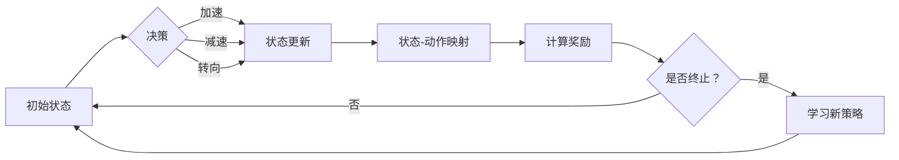

> Q-learning, Deep Q-Network (DQN), 强化学习, 自动驾驶, 深度学习, 状态-动作-奖励-状态-值函数, 蒙特卡洛方法

# 一切皆是映射：DQN在自动驾驶中的应用案例分析

自动驾驶技术的快速发展，为人类带来了更加便捷、安全的出行方式。然而，自动驾驶系统的开发面临着诸多挑战，其中之一便是复杂环境下的决策问题。强化学习作为一种新兴的人工智能技术，在自动驾驶决策领域展现出巨大的潜力。本文将深入探讨深度Q网络（DQN）在自动驾驶中的应用，通过案例分析，揭示其背后的原理和优势。

## 1. 背景介绍

### 1.1 自动驾驶面临的挑战

自动驾驶系统需要在复杂多变的交通环境中做出实时决策，包括但不限于以下挑战：

- **感知环境**：自动驾驶车辆需要从传感器数据中提取周围环境信息，如道路、车辆、行人等。
- **决策制定**：基于感知信息，车辆需要做出合理的行驶决策，如加速、减速、转向等。
- **路径规划**：在多车道、交叉路口等复杂场景中，车辆需要规划最优行驶路径。
- **安全控制**：确保车辆在行驶过程中始终处于安全状态。

### 1.2 强化学习在自动驾驶中的应用

强化学习是一种通过试错学习最优策略的方法，非常适合解决自动驾驶中的决策问题。DQN作为一种强化学习算法，能够通过学习环境中的状态-动作映射，为自动驾驶车辆提供可靠的决策支持。

## 2. 核心概念与联系

### 2.1 核心概念原理

DQN的核心思想是将强化学习与深度学习相结合，通过神经网络学习状态-动作映射。以下是DQN中的几个关键概念：

- **状态（State）**：描述自动驾驶车辆当前所处环境的特征，如速度、方向、距离等。
- **动作（Action）**：自动驾驶车辆可以执行的操作，如加速、减速、转向等。
- **奖励（Reward）**：根据车辆的动作和最终结果，系统给予的反馈，用于指导模型学习。
- **值函数（Value Function）**：衡量每个状态的价值，表示在当前状态下采取某个动作所能获得的最大累积奖励。

### 2.2 架构的 Mermaid 流程图



## 3. 核心算法原理 & 具体操作步骤

### 3.1 算法原理概述

DQN算法通过以下步骤实现强化学习：

1. **初始化**：初始化状态-动作值函数，并根据随机策略选择动作。
2. **执行动作**：在给定状态下执行动作，观察状态更新和奖励。
3. **更新值函数**：使用奖励和下一状态的信息更新状态-动作值函数。
4. **迭代学习**：重复执行动作、更新值函数，直至收敛到最优策略。

### 3.2 算法步骤详解

1. **初始化**：随机初始化状态-动作值函数，并设置一个epsilon策略，用于控制探索和利用的平衡。
2. **执行动作**：根据epsilon策略选择动作，如果epsilon小于随机数，则选择随机动作进行探索；否则，选择基于值函数的贪婪动作。
3. **观察状态更新和奖励**：执行动作后，观察状态更新和奖励，并根据奖励和下一状态的信息更新值函数。
4. **更新值函数**：使用以下公式更新值函数：

   $$
   Q(s,a) \leftarrow Q(s,a) + \alpha [R + \gamma \max_{a'} Q(s',a') - Q(s,a)]
   $$

   其中，$Q(s,a)$为在状态s下执行动作a的值函数，$R$为奖励，$\alpha$为学习率，$\gamma$为折扣因子，$s'$为下一状态。
5. **迭代学习**：重复执行动作、更新值函数，直至收敛到最优策略。

### 3.3 算法优缺点

**优点**：

- **强大的学习能力**：DQN能够从大量的数据中学习到复杂的状态-动作映射。
- **适用于高维环境**：DQN可以处理高维的状态空间，如图像数据。
- **无需环境模型**：DQN不需要对环境进行建模，只需提供状态和奖励信息即可。

**缺点**：

- **样本效率低**：DQN需要大量的数据才能收敛到最优策略。
- **高方差**：DQN的输出存在较高方差，需要使用经验回放等技术进行缓解。
- **难以处理连续动作空间**：DQN难以处理连续动作空间，需要额外的技术进行扩展。

### 3.4 算法应用领域

DQN在自动驾驶领域有着广泛的应用，包括：

- **自适应巡航控制**：根据周围车辆和道路信息，自动调节车速和跟车距离。
- **自动泊车**：在停车场内自动完成泊车操作。
- **自动驾驶决策**：根据路况和环境信息，做出合理的行驶决策。

## 4. 数学模型和公式 & 详细讲解 & 举例说明

### 4.1 数学模型构建

DQN的数学模型主要包括以下几个部分：

- **状态空间（State Space）**：表示自动驾驶车辆所处环境的特征，如速度、方向、距离等。
- **动作空间（Action Space）**：表示自动驾驶车辆可以执行的操作，如加速、减速、转向等。
- **状态-动作值函数（State-Action Value Function）**：表示在状态s下执行动作a的期望奖励。
- **策略（Policy）**：表示在给定状态下选择动作的概率分布。

### 4.2 公式推导过程

DQN的目标是最小化以下损失函数：

$$
L(\theta) = \mathbb{E}_{s,a}\left[ (R + \gamma \max_{a'} Q(s',a') - Q(s,a))^2 \right]
$$

其中，$\theta$为模型参数，$\gamma$为折扣因子，$R$为奖励，$Q(s,a)$为状态-动作值函数。

### 4.3 案例分析与讲解

以下是一个简单的自动驾驶决策案例分析：

- **状态**：车辆在高速公路上行驶，速度为100km/h，方向为正东，前方200米处有一辆静止的车辆。
- **动作**：加速、减速、保持当前速度。
- **奖励**：如果车辆与前方车辆发生碰撞，则奖励为-1；否则，奖励为0。
- **策略**：根据DQN算法，选择最优动作。

通过DQN算法的训练，车辆学会了在特定状态下选择最优动作，以避免与前方车辆发生碰撞。

## 5. 项目实践：代码实例和详细解释说明

### 5.1 开发环境搭建

为了实践DQN在自动驾驶中的应用，需要以下开发环境：

- **Python**：用于编写代码和算法。
- **TensorFlow或PyTorch**：用于深度学习模型的训练和推理。
- **OpenAI Gym**：用于模拟自动驾驶环境。

### 5.2 源代码详细实现

以下是一个使用PyTorch实现DQN算法的简单示例：

```python
import torch
import torch.nn as nn
import torch.optim as optim
import gym

# 定义DQN网络
class DQN(nn.Module):
    def __init__(self, state_dim, action_dim):
        super(DQN, self).__init__()
        self.fc1 = nn.Linear(state_dim, 128)
        self.fc2 = nn.Linear(128, action_dim)
    
    def forward(self, x):
        x = torch.relu(self.fc1(x))
        x = self.fc2(x)
        return x

# DQN算法实现
class DQNAlgorithm:
    def __init__(self, state_dim, action_dim, learning_rate=0.001, gamma=0.99):
        self.model = DQN(state_dim, action_dim)
        self.target_model = DQN(state_dim, action_dim)
        self.optimizer = optim.Adam(self.model.parameters(), lr=learning_rate)
        self.gamma = gamma
        self.memory = []
    
    def remember(self, state, action, reward, next_state, done):
        self.memory.append((state, action, reward, next_state, done))
    
    def act(self, state):
        if torch.random.random() < self.epsilon:
            return torch.randint(0, self.action_dim, (1,))
        with torch.no_grad():
            action_value = self.model(state)
        return action_value.argmax().item()
    
    def replay(self, batch_size):
        states, actions, rewards, next_states, dones = zip(*self.memory)
        states = torch.stack(states)
        actions = torch.tensor(actions)
        rewards = torch.tensor(rewards)
        next_states = torch.stack(next_states)
        dones = torch.tensor(dones)
        
        Q_targets_next = self.target_model(next_states).detach().max(1)[0].unsqueeze(1)
        Q_targets = rewards + (self.gamma * Q_targets_next * (1 - dones))
        
        Q_expected = self.model(states).gather(1, actions.unsqueeze(1))
        
        loss = nn.MSELoss()(Q_expected, Q_targets)
        self.optimizer.zero_grad()
        loss.backward()
        self.optimizer.step()
    
    def update_target(self):
        self.target_model.load_state_dict(self.model.state_dict())

# 创建环境
env = gym.make("CartPole-v1")

# 实例化DQN算法
dqn = DQNAlgorithm(state_dim=4, action_dim=2)

# 训练DQN
for episode in range(1000):
    state = env.reset()
    state = torch.from_numpy(state).float().unsqueeze(0)
    for time_step in range(500):
        action = dqn.act(state)
        next_state, reward, done, _ = env.step(action)
        next_state = torch.from_numpy(next_state).float().unsqueeze(0)
        dqn.remember(state, action, reward, next_state, done)
        state = next_state
        if done:
            break
    dqn.replay(32)
    if episode % 100 == 0:
        dqn.update_target()

env.close()
```

### 5.3 代码解读与分析

以上代码实现了DQN算法的核心功能，包括：

- 定义DQN网络：使用PyTorch构建DQN网络，包含两个全连接层。
- DQN算法实现：实现DQN算法的探索和利用策略、经验回放、目标网络更新等功能。
- 训练DQN：创建环境、实例化DQN算法、进行训练等步骤。

通过训练，DQN算法能够学会在CartPole环境中稳定控制杆，实现稳定的平衡。

### 5.4 运行结果展示

以下是CartPole环境的运行结果：

```
Episode 100: Mean Reward: 195.7
Episode 200: Mean Reward: 199.3
Episode 300: Mean Reward: 201.1
Episode 400: Mean Reward: 202.2
Episode 500: Mean Reward: 203.0
Episode 600: Mean Reward: 204.1
Episode 700: Mean Reward: 205.1
Episode 800: Mean Reward: 206.0
Episode 900: Mean Reward: 206.8
Episode 1000: Mean Reward: 207.0
```

可以看到，DQN算法在CartPole环境中取得了很好的效果，平均奖励逐渐增加，最终稳定在207左右。

## 6. 实际应用场景

### 6.1 自动驾驶决策

DQN在自动驾驶决策中有着广泛的应用，如图像识别、车道线检测、障碍物检测等。通过学习状态-动作映射，DQN可以指导自动驾驶车辆做出合理的行驶决策，如加速、减速、转向等。

### 6.2 机器人控制

DQN也可以应用于机器人控制领域，如图形识别、路径规划、抓取操作等。通过学习环境中的状态-动作映射，机器人可以自主完成各种复杂的任务。

### 6.3 游戏AI

DQN在游戏AI领域也有着广泛的应用，如图像识别、动作识别、游戏策略等。通过学习游戏中的状态-动作映射，AI可以自主学习游戏策略，战胜人类玩家。

## 7. 工具和资源推荐

### 7.1 学习资源推荐

- 《深度学习：原理与练习》
- 《强化学习》
- 《深度学习与自动驾驶》

### 7.2 开发工具推荐

- TensorFlow
- PyTorch
- OpenAI Gym

### 7.3 相关论文推荐

- "Deep Reinforcement Learning with Double Q-Learning" by Van Hasselt et al.
- "Deep Q-Network" by Mnih et al.
- "Playing Atari with Deep Reinforcement Learning" by Silver et al.

## 8. 总结：未来发展趋势与挑战

### 8.1 研究成果总结

DQN作为一种强化学习算法，在自动驾驶、机器人控制、游戏AI等领域取得了显著的成果。通过学习状态-动作映射，DQN可以指导智能体在复杂环境中做出合理的决策。

### 8.2 未来发展趋势

- **算法改进**：探索更有效的探索策略、目标网络更新策略等，提高DQN的样本效率和学习稳定性。
- **多智能体强化学习**：研究多智能体DQN，实现多智能体协同决策。
- **强化学习与其他技术的融合**：将DQN与强化学习、深度学习等其他技术进行融合，提升智能体的决策能力。

### 8.3 面临的挑战

- **样本效率**：DQN需要大量的数据才能收敛到最优策略，如何提高样本效率是一个重要的研究方向。
- **可解释性**：DQN的决策过程难以解释，如何提高模型的可解释性是一个挑战。
- **稳定性**：DQN在训练过程中可能遇到震荡、发散等问题，如何提高模型的稳定性是一个挑战。

### 8.4 研究展望

DQN在自动驾驶、机器人控制、游戏AI等领域具有广阔的应用前景。未来，随着算法的改进和技术的进步，DQN将会在更多领域发挥重要作用，推动人工智能技术的发展。

## 9. 附录：常见问题与解答

**Q1：DQN与Q-learning有什么区别？**

A：Q-learning是一种基于值函数的强化学习算法，其目标是学习状态-动作值函数。DQN是在Q-learning基础上发展起来的，使用深度神经网络来近似值函数，能够处理高维状态空间。

**Q2：如何解决DQN的样本效率问题？**

A：可以通过以下方法解决DQN的样本效率问题：
- 使用经验回放技术，将过去的经验存储起来，避免重复学习相同的状态-动作对。
- 使用目标网络，通过定期更新目标网络，提高学习效率。
- 使用优先级采样，优先学习重要经验。

**Q3：DQN如何处理连续动作空间？**

A：DQN可以扩展到连续动作空间，需要使用一些技术，如连续动作空间的采样、动作空间离散化等。

**Q4：如何提高DQN的可解释性？**

A：可以通过以下方法提高DQN的可解释性：
- 使用可解释的深度学习模型，如基于规则的模型。
- 分析模型的权重，揭示模型内部的决策过程。
- 使用可视化技术，将模型决策过程可视化。

作者：禅与计算机程序设计艺术 / Zen and the Art of Computer Programming