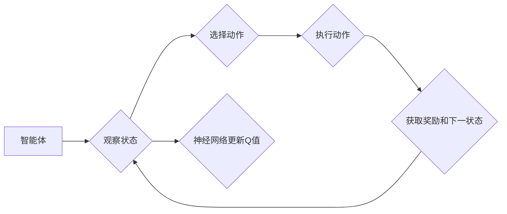

> Q-Learning, DQN, Deep Q-Network, 强化学习, 状态空间, 高维数据, 神经网络, 经验回放, 梯度下降, 探索-利用平衡

# 一切皆是映射：如何使用DQN处理高维的状态空间

## 1. 背景介绍

随着人工智能技术的飞速发展，强化学习（Reinforcement Learning, RL）已经成为机器学习领域的一个重要分支。在强化学习中，DQN（Deep Q-Network）因其优异的性能和强大的适应能力，成为了处理高维状态空间问题的一大利器。本文将深入探讨DQN的原理、实现方法和应用场景，帮助读者更好地理解如何利用DQN解决高维状态空间问题。

### 1.1 强化学习简介

强化学习是一种使机器能够通过与环境的交互来学习最优策略的机器学习方法。在强化学习中，智能体（Agent）通过与环境的交互，不断尝试不同的动作，并从环境中获得奖励信号，以此来学习如何最大化长期累积奖励。

### 1.2 DQN简介

DQN是一种基于深度学习的强化学习方法，由DeepMind在2015年提出。DQN通过使用深度神经网络来逼近Q函数，实现了在复杂环境中的高效学习。

## 2. 核心概念与联系

### 2.1 DQN流程图



### 2.2 关键概念

- **状态（State）**：指智能体在某一时刻所处的环境信息。
- **动作（Action）**：智能体可以采取的行为或决策。
- **奖励（Reward）**：智能体在执行动作后从环境中获得的即时反馈。
- **Q值（Q-Value）**：表示智能体在特定状态下采取特定动作的预期奖励值。
- **策略（Policy）**：智能体根据当前状态选择动作的规则或方法。
- **价值函数（Value Function）**：预测在特定状态下采取特定动作所能获得的长期累积奖励。

## 3. 核心算法原理 & 具体操作步骤

### 3.1 算法原理概述

DQN的核心思想是使用深度神经网络来逼近Q函数，并通过最大化Q值来指导智能体的动作选择。

### 3.2 算法步骤详解

1. 初始化神经网络和Q表。
2. 选择初始状态。
3. 使用ε-greedy策略选择动作。
4. 执行动作，获取奖励和下一状态。
5. 计算Q值更新目标。
6. 使用梯度下降算法更新神经网络参数。
7. 返回步骤2，重复上述过程。

### 3.3 算法优缺点

**优点**：
- 能够处理高维状态空间。
- 可以学习到复杂环境的策略。
- 适用于离线学习。

**缺点**：
- 训练过程可能需要很长时间。
- 算法容易陷入局部最优。
- 需要大量的训练数据。

### 3.4 算法应用领域

DQN在许多领域都有广泛的应用，包括但不限于：

- 游戏人工智能
- 机器人控制
- 货币市场交易
- 能源管理

## 4. 数学模型和公式 & 详细讲解 & 举例说明

### 4.1 数学模型构建

DQN使用神经网络来逼近Q函数，其数学模型可以表示为：

$$
Q(s, a; \theta) = f_{\theta}(\phi(s), \phi(a))
$$

其中，$s$表示状态，$a$表示动作，$\theta$表示神经网络的参数，$\phi(s)$和$\phi(a)$分别表示状态和动作的特征向量。

### 4.2 公式推导过程

DQN的Q值更新公式如下：

$$
Q(s, a; \theta) \leftarrow Q(s, a; \theta) + \alpha [R + \gamma \max_{a'} Q(s', a'; \theta) - Q(s, a; \theta)]
$$

其中，$\alpha$为学习率，$\gamma$为折扣因子。

### 4.3 案例分析与讲解

以下是一个简单的DQN案例：使用DQN控制一个智能体在环境中的移动。

```python
# 状态空间：二维坐标
# 动作空间：上下左右移动
# 奖励：移动到目标位置得到奖励，否则得到惩罚

# 定义状态空间和动作空间
state_space = [(x, y) for x in range(10) for y in range(10)]
action_space = ['up', 'down', 'left', 'right']

# 定义Q函数神经网络
class QNetwork(nn.Module):
    def __init__(self, input_size, output_size):
        super(QNetwork, self).__init__()
        self.fc1 = nn.Linear(input_size, 64)
        self.fc2 = nn.Linear(64, output_size)

    def forward(self, x):
        x = F.relu(self.fc1(x))
        x = self.fc2(x)
        return x

# 定义DQN算法
class DQN(nn.Module):
    def __init__(self, state_space, action_space):
        super(DQN, self).__init__()
        self.q_network = QNetwork(len(state_space), len(action_space))

    def choose_action(self, state, epsilon):
        if random.random() < epsilon:
            return random.choice(action_space)
        else:
            with torch.no_grad():
                q_values = self.q_network(torch.tensor(state, dtype=torch.float32))
                return action_space[q_values.argmax().item()]

    def update(self, memory):
        batch_size = len(memory)
        states, actions, rewards, next_states = zip(*memory)
        q_values = self.q_network(torch.tensor(states, dtype=torch.float32)).gather(1, torch.tensor(actions, dtype=torch.long))
        next_q_values = self.q_network(torch.tensor(next_states, dtype=torch.float32)).max(1)[0]
        targets = rewards + (1 - torch.tensor([done for _, _, done, _ in memory])) * gamma * next_q_values
        loss = F.mse_loss(q_values, targets)
        return loss

# 设置参数
state_space = [(x, y) for x in range(10) for y in range(10)]
action_space = ['up', 'down', 'left', 'right']
gamma = 0.99
epsilon = 0.1
epsilon_end = 0.01
epsilon_decay = 500
memory = []

# 初始化DQN
dqn = DQN(state_space, action_space)
optimizer = optim.Adam(dqn.parameters(), lr=0.001)

# 训练DQN
for episode in range(1000):
    state = random.choice(state_space)
    done = False
    while not done:
        action = dqn.choose_action(state, epsilon)
        next_state, reward, done = env.step(action)
        memory.append((state, action, reward, next_state))
        if len(memory) >= batch_size:
            loss = dqn.update(memory)
            optimizer.zero_grad()
            loss.backward()
            optimizer.step()
            memory = memory[-batch_size:]
        state = next_state
    epsilon = max(epsilon_end, epsilon_end + epsilon_decay * (1 - episode / 1000))
```

## 5. 项目实践：代码实例和详细解释说明

### 5.1 开发环境搭建

- Python 3.6+
- PyTorch 1.2+
- NumPy 1.15+
- gym 0.14+

### 5.2 源代码详细实现

以上代码演示了使用PyTorch实现DQN算法的简单案例。首先定义了状态空间和动作空间，然后定义了Q函数神经网络和DQN算法。最后，通过训练过程来更新神经网络参数。

### 5.3 代码解读与分析

- `QNetwork`类定义了Q函数神经网络，包括两个全连接层。
- `DQN`类定义了DQN算法，包括选择动作和更新Q函数。
- `choose_action`方法使用ε-greedy策略选择动作。
- `update`方法使用梯度下降算法更新神经网络参数。
- 训练过程中，智能体通过与环境交互来学习最优策略。

### 5.4 运行结果展示

通过训练，智能体可以学会在环境中找到目标位置，并避免惩罚。

## 6. 实际应用场景

DQN在许多实际应用场景中都取得了成功，以下是一些典型的应用案例：

- **游戏人工智能**：例如，使用DQN控制电子游戏中的角色，如《Space Invaders》、《Ms. Pac-Man》等。
- **机器人控制**：例如，使用DQN控制机器人在环境中进行导航和任务执行。
- **自动驾驶**：例如，使用DQN实现自动驾驶汽车在复杂道路环境中的驾驶策略。
- **金融交易**：例如，使用DQN进行股票交易，实现自动化的投资策略。

## 7. 工具和资源推荐

### 7.1 学习资源推荐

- 《Reinforcement Learning: An Introduction》
- 《Deep Reinforcement Learning with Python》
- 《Deep Reinforcement Learning》

### 7.2 开发工具推荐

- PyTorch
- OpenAI Gym
- Stable Baselines

### 7.3 相关论文推荐

- Deep Q-Network (DQN)
- Asynchronous Methods for Deep Reinforcement Learning
- Prioritized Experience Replay

## 8. 总结：未来发展趋势与挑战

### 8.1 研究成果总结

DQN是一种基于深度学习的强化学习方法，能够处理高维状态空间问题。它通过使用深度神经网络来逼近Q函数，并通过最大化Q值来指导智能体的动作选择。

### 8.2 未来发展趋势

- **强化学习与其他技术的融合**：例如，将强化学习与知识表示、迁移学习等技术相结合，以提高智能体的学习能力和适应性。
- **多智能体强化学习**：研究多智能体在复杂环境中的协作策略，实现更高级的智能行为。
- **可解释性强化学习**：研究如何解释强化学习模型的决策过程，提高模型的透明度和可信度。

### 8.3 面临的挑战

- **样本效率**：如何提高样本效率，减少训练数据量，是强化学习面临的一个主要挑战。
- **探索-利用平衡**：如何平衡探索和利用，使智能体在探索未知环境的同时，也能有效利用已知信息。
- **模型可解释性**：如何提高模型的可解释性，使人们能够理解模型的决策过程。

### 8.4 研究展望

未来，DQN和其他强化学习算法将在更多领域得到应用，推动人工智能技术的发展。随着技术的不断进步，强化学习将在构建更加智能、自适应的智能系统方面发挥越来越重要的作用。

## 9. 附录：常见问题与解答

**Q1：什么是ε-greedy策略？**

A1：ε-greedy策略是一种常用的探索-利用平衡策略，它以一定的概率ε随机选择动作，以探索未知的环境；以1-ε的概率选择Q值最大的动作，以利用已知信息。

**Q2：为什么使用经验回放（Experience Replay）？**

A2：经验回放可以帮助智能体在面对相似的环境时，避免重复相同的错误。通过将经验存储在经验池中，智能体可以随机选择经验进行学习，从而提高样本效率。

**Q3：如何处理高维状态空间？**

A3：使用深度神经网络可以将高维状态空间映射到低维特征空间，从而简化问题。

**Q4：DQN在实际应用中需要注意哪些问题？**

A4：在实际应用中，需要注意以下问题：
- 状态空间的表示
- 动作空间的表示
- 奖励函数的设计
- 经验回放的设计
- 训练过程的稳定性

**Q5：DQN与其他强化学习算法相比有哪些优缺点？**

A5：DQN的优点是能够处理高维状态空间，且不需要价值函数或策略函数。缺点是训练过程可能需要很长时间，且容易陷入局部最优。

作者：禅与计算机程序设计艺术 / Zen and the Art of Computer Programming