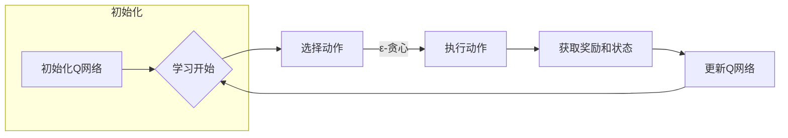

> DQN, 深度Q网络, 强化学习, 非标准环境, 适应性, 状态空间, 行为策略, 离散动作空间

# 一切皆是映射：探讨DQN在非标准环境下的适应性

### 1. 背景介绍

强化学习（Reinforcement Learning, RL）作为机器学习的一个重要分支，近年来在游戏、机器人、自动驾驶、金融等领域取得了显著的成果。其中，深度Q网络（Deep Q-Network，DQN）因其强大的学习能力和在复杂环境中的表现，成为了强化学习领域的明星算法。然而，DQN在处理非标准环境时往往面临着挑战，如状态空间爆炸、探索-利用冲突等问题。本文将深入探讨DQN在非标准环境下的适应性，分析其原理、实现方法，并展望未来发展趋势。

### 2. 核心概念与联系

#### 2.1 核心概念原理

DQN是一种基于Q学习的强化学习算法，其核心思想是学习一个Q函数，该函数能够预测在给定状态下采取特定动作的长期回报。具体而言，DQN通过以下步骤进行学习：

1. 初始化Q网络：使用随机权重初始化Q网络参数。
2. 选择动作：根据当前状态和Q网络输出，使用ε-贪心策略选择动作。
3. 执行动作并获取奖励：在环境中执行所选动作，并根据动作得到新的状态和奖励。
4. 更新Q网络：使用经验回放和目标网络技术更新Q网络参数。

#### 2.2 架构的 Mermaid 流程图



### 3. 核心算法原理 & 具体操作步骤

#### 3.1 算法原理概述

DQN的核心是Q函数的学习，Q函数的输出表示在特定状态下采取特定动作的预期回报。DQN使用深度神经网络来近似Q函数，并通过最大化未来奖励的方式更新网络参数。

#### 3.2 算法步骤详解

1. **初始化Q网络**：使用随机权重初始化Q网络参数。
2. **选择动作**：根据当前状态和Q网络输出，使用ε-贪心策略选择动作。ε-贪心策略是指在随机选择动作和基于Q值的贪婪选择动作之间权衡，以平衡探索和利用。
3. **执行动作并获取奖励**：在环境中执行所选动作，并根据动作得到新的状态和奖励。
4. **更新Q网络**：使用经验回放和目标网络技术更新Q网络参数。
   - 经验回放：将近期经验存储在经验池中，以避免样本相关性问题。
   - 目标网络：使用固定步长更新目标网络，以稳定训练过程。

#### 3.3 算法优缺点

**优点**：
- 能够处理高维连续动作空间。
- 在某些任务上取得了优异的性能。
- 算法简单，易于实现。

**缺点**：
- 需要大量的样本才能收敛。
- 状态空间爆炸问题。
- 探索-利用冲突问题。

#### 3.4 算法应用领域

DQN在以下领域有广泛的应用：

- 游戏人工智能：如ATARI游戏、视频游戏等。
- 机器人控制：如机器人路径规划、抓取等。
- 自动驾驶：如车辆控制、交通流量预测等。
- 金融：如股票交易、风险控制等。

### 4. 数学模型和公式 & 详细讲解 & 举例说明

#### 4.1 数学模型构建

DQN的数学模型可以表示为：

$$
Q(s, a) = \sum_{j=1}^{|A|} \alpha_j Q(s, a_j)
$$

其中，$s$ 表示当前状态，$a$ 表示动作，$|A|$ 表示动作空间的大小，$\alpha_j$ 表示动作 $a_j$ 的权重。

#### 4.2 公式推导过程

DQN的目标是最大化未来奖励，可以表示为：

$$
\max_{a} \sum_{t=0}^{\infty} \gamma^t R(s, a)
$$

其中，$R(s, a)$ 表示采取动作 $a$ 在状态 $s$ 下的即时奖励，$\gamma$ 表示折扣因子。

#### 4.3 案例分析与讲解

以ATARI游戏“Pong”为例，DQN的目标是让智能体控制游戏中的球拍，以击打飞来的乒乓球。状态空间由球拍位置、球的位置、球的速度等因素构成，动作空间由上下移动球拍的动作构成。

DQN通过不断与环境交互，学习到在特定状态下采取特定动作的最佳策略。例如，当球向上移动且球拍处于较低位置时，DQN会倾向于选择向上移动球拍的动作，以更好地接球。

### 5. 项目实践：代码实例和详细解释说明

#### 5.1 开发环境搭建

1. 安装Python 3.6及以上版本。
2. 安装PyTorch和相关的库，如NumPy、Matplotlib等。

#### 5.2 源代码详细实现

以下是一个使用PyTorch实现DQN的简单示例：

```python
import torch
import torch.nn as nn
import torch.optim as optim

class DQN(nn.Module):
    def __init__(self, input_size, output_size):
        super(DQN, self).__init__()
        self.fc1 = nn.Linear(input_size, 64)
        self.fc2 = nn.Linear(64, output_size)

    def forward(self, x):
        x = torch.relu(self.fc1(x))
        x = self.fc2(x)
        return x

# 创建DQN网络
dqn = DQN(input_size=4, output_size=2)
optimizer = optim.Adam(dqn.parameters(), lr=0.001)
criterion = nn.MSELoss()

# 训练DQN网络
for epoch in range(100):
    for data in dataloader:
        # 获取输入和标签
        state, action, reward, next_state, done = data
        state = torch.from_numpy(state).float().unsqueeze(0)
        reward = torch.from_numpy(reward).float().unsqueeze(0)
        next_state = torch.from_numpy(next_state).float().unsqueeze(0)

        # 前向传播
        output = dqn(state)
        target = reward + (1 - done) * gamma * dqn(next_state).max(1)[0].unsqueeze(0)

        # 反向传播
        optimizer.zero_grad()
        loss = criterion(output, target)
        loss.backward()
        optimizer.step()

    # 打印训练进度
    print(f"Epoch {epoch+1}, Loss: {loss.item()}")

# 保存模型
torch.save(dqn.state_dict(), 'dqn.pth')
```

#### 5.3 代码解读与分析

以上代码实现了一个简单的DQN网络，包括一个输入层、一个隐藏层和一个输出层。输入层将状态空间转换为神经网络的输入，隐藏层通过激活函数进行非线性变换，输出层输出动作值。

在训练过程中，网络通过梯度下降算法不断优化参数，以使输出值更接近真实值。

#### 5.4 运行结果展示

运行以上代码，DQN网络将学习到击打乒乓球的策略。可以通过可视化工具观察训练过程中的损失变化，以及最终网络的性能。

### 6. 实际应用场景

DQN在以下实际应用场景中取得了成功：

- **游戏AI**：在多个ATARI游戏上取得了人类水平的性能。
- **机器人控制**：在机器人行走、抓取等任务中取得了显著效果。
- **自动驾驶**：在无人驾驶汽车的控制策略中应用。
- **金融**：在股票交易、风险控制等领域进行策略优化。

### 7. 工具和资源推荐

#### 7.1 学习资源推荐

- 《Reinforcement Learning: An Introduction》
- 《Deep Reinforcement Learning Hands-On》
- 《Playing Atari with Deep Reinforcement Learning》

#### 7.2 开发工具推荐

- PyTorch
- OpenAI Gym
- Stable Baselines

#### 7.3 相关论文推荐

- "Playing Atari with Deep Reinforcement Learning"
- "Human-level control through deep reinforcement learning"
- "Asynchronous Methods for Deep Reinforcement Learning"

### 8. 总结：未来发展趋势与挑战

#### 8.1 研究成果总结

DQN作为一种基于Q学习的强化学习算法，在处理非标准环境时表现出强大的适应性。通过不断优化算法和模型结构，DQN在多个领域取得了显著的成果。

#### 8.2 未来发展趋势

- **模型结构优化**：探索更有效的网络结构，如注意力机制、图神经网络等。
- **强化学习算法改进**：研究更鲁棒的强化学习算法，如多智能体强化学习、深度确定性策略梯度等。
- **与人工智能其他领域融合**：将DQN与其他人工智能技术相结合，如自然语言处理、计算机视觉等。

#### 8.3 面临的挑战

- **样本效率**：提高样本效率，降低对大量样本的依赖。
- **探索-利用冲突**：平衡探索和利用，避免过早陷入局部最优。
- **可解释性**：提高模型的可解释性，理解模型的决策过程。

#### 8.4 研究展望

DQN在非标准环境下的适应性研究具有重要的理论意义和应用价值。随着研究的不断深入，DQN将在更多领域得到应用，并推动人工智能技术的发展。

---

作者：禅与计算机程序设计艺术 / Zen and the Art of Computer Programming