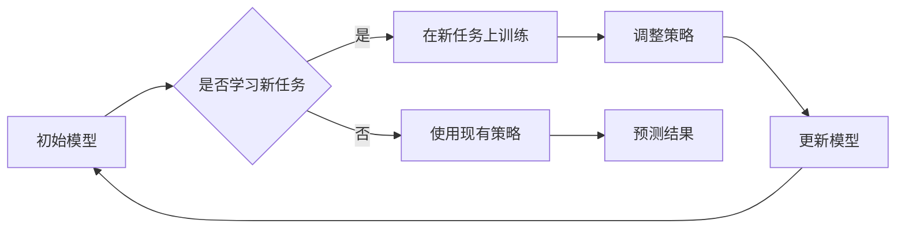

> 机器学习，元学习，金融市场预测，深度学习，映射学习，强化学习

# 一切皆是映射：用元学习预测未来金融市场

在金融科技的浪潮中，预测金融市场走势成为了一个极具挑战性的课题。传统的方法依赖于历史数据分析和统计模型，但金融市场的高度复杂性和动态变化使得这些方法难以捕捉到未来趋势。随着机器学习，特别是深度学习的兴起，金融市场预测正经历一场革命。本文将探讨如何运用元学习这一先进技术，构建能够预测未来金融市场的智能系统。

## 1. 背景介绍

### 1.1 问题的由来

金融市场是一个复杂多变的系统，受到经济、政治、社会等多方面因素的影响。传统的金融市场预测方法，如时间序列分析、技术分析等，虽然在一定程度上能够捕捉市场趋势，但在处理复杂非线性关系和高维度数据时往往力不从心。

### 1.2 研究现状

近年来，随着深度学习技术的发展，基于机器学习的金融市场预测模型取得了显著进展。然而，这些模型通常需要大量的标记数据，且难以适应新的市场环境。为了解决这些问题，元学习（Meta-Learning）应运而生。

### 1.3 研究意义

元学习通过学习如何学习，使得模型能够在有限的数据上快速适应新的任务。在金融市场预测领域，元学习可以帮助模型从历史数据中学习到预测模式，并快速适应新的市场环境，从而提高预测的准确性和适应性。

### 1.4 本文结构

本文将首先介绍元学习的核心概念与联系，然后深入探讨元学习在金融市场预测中的算法原理和应用步骤。随后，我们将通过数学模型和公式详细讲解元学习的方法，并给出具体的代码实例。最后，我们将分析元学习在金融市场预测中的实际应用场景，并展望其未来的发展趋势与挑战。

## 2. 核心概念与联系

### 2.1 元学习

元学习（Meta-Learning）是一种机器学习范式，旨在开发能够快速学习新任务的算法。与传统的任务导向学习不同，元学习关注的是学习如何学习。它通过在一系列不同的任务上训练模型，使模型能够从经验中学习到泛化的学习策略。

### 2.2 核心概念原理和架构的 Mermaid 流程图



### 2.3 元学习的联系

元学习与深度学习、强化学习等机器学习范式有着密切的联系。深度学习提供了强大的特征提取和表示学习能力，强化学习则通过奖励信号指导模型学习最优策略。元学习结合了这些技术的优势，使得模型能够在有限的数据上进行快速学习。

## 3. 核心算法原理 & 具体操作步骤

### 3.1 算法原理概述

元学习算法的核心思想是构建一个能够在多个任务上快速适应的模型。这通常涉及到以下步骤：

1. 数据准备：收集多个相关的任务数据集，每个数据集包含输入和输出。
2. 模型训练：在多个任务数据集上训练模型，使模型能够学习到泛化的学习策略。
3. 任务适应：在新的任务上，使用训练好的模型进行快速适应，调整模型参数以适应新任务。

### 3.2 算法步骤详解

1. **数据准备**：收集多个相关的任务数据集，每个数据集包含输入和输出。例如，在金融市场预测中，可以收集不同市场、不同时间段的股票价格数据。

2. **模型训练**：使用多个任务数据集训练模型，使模型能够学习到泛化的学习策略。这通常涉及到以下步骤：

   - 特征提取：使用深度学习模型提取输入数据的特征。
   - 损失函数：定义一个损失函数来衡量模型的预测结果与实际结果之间的差异。
   - 优化算法：使用优化算法（如梯度下降）来调整模型参数，最小化损失函数。

3. **任务适应**：在新的任务上，使用训练好的模型进行快速适应。这通常涉及到以下步骤：

   - 模型初始化：使用预训练模型作为起始点。
   - 参数调整：使用少量数据对新模型进行微调，调整模型参数以适应新任务。

### 3.3 算法优缺点

**优点**：

- **快速适应**：元学习模型能够在有限的数据上快速适应新的任务。
- **泛化能力强**：元学习模型能够学习到泛化的学习策略，适用于多种不同的任务。
- **数据高效**：元学习模型对数据的依赖性较低，适用于数据稀缺的场景。

**缺点**：

- **计算复杂度高**：元学习模型通常需要大量的计算资源。
- **模型复杂度高**：元学习模型通常比传统的学习模型更加复杂。

### 3.4 算法应用领域

元学习在金融市场预测、自然语言处理、计算机视觉等领域都有广泛的应用。在金融市场预测中，元学习可以帮助模型从历史数据中学习到预测模式，并快速适应新的市场环境。

## 4. 数学模型和公式 & 详细讲解 & 举例说明

### 4.1 数学模型构建

元学习模型通常由两个主要部分组成：特征提取器和任务适应器。

- **特征提取器**：将输入数据转换为特征向量。例如，可以使用卷积神经网络（CNN）从股票价格数据中提取特征。
- **任务适应器**：根据特征向量和奖励信号调整模型参数。例如，可以使用强化学习算法来调整参数。

### 4.2 公式推导过程

以下是一个简单的元学习模型的数学模型：

$$
\theta_{t+1} = \theta_t + \alpha \nabla_{\theta_t} J(\theta_t, s_t, a_t, r_t)
$$

其中，$\theta_t$ 是在时间 $t$ 的模型参数，$s_t$ 是输入状态，$a_t$ 是采取的动作，$r_t$ 是奖励信号，$\alpha$ 是学习率。

### 4.3 案例分析与讲解

以下是一个使用元学习进行金融市场预测的案例：

假设我们有一个包含多个市场、不同时间段的股票价格数据集。我们可以使用CNN作为特征提取器，从股票价格数据中提取特征。然后，使用强化学习算法作为任务适应器，根据股票价格的历史走势来预测未来的价格。

## 5. 项目实践：代码实例和详细解释说明

### 5.1 开发环境搭建

在进行元学习项目实践之前，我们需要搭建一个开发环境。以下是一个基于Python和TensorFlow的简单示例：

```bash
pip install tensorflow
```

### 5.2 源代码详细实现

以下是一个使用TensorFlow进行元学习的简单代码示例：

```python
import tensorflow as tf

# 定义特征提取器
class FeatureExtractor(tf.keras.Model):
    def __init__(self):
        super(FeatureExtractor, self).__init__()
        self.cnn = tf.keras.Sequential([
            tf.keras.layers.Conv1D(64, 3, activation='relu', input_shape=(None, 1)),
            tf.keras.layers.MaxPooling1D(2),
            tf.keras.layers.Flatten()
        ])
    
    def call(self, x):
        return self.cnn(x)

# 定义任务适应器
class TaskAdapter(tf.keras.Model):
    def __init__(self):
        super(TaskAdapter, self).__init__()
        self.fc = tf.keras.layers.Dense(10, activation='softmax')
    
    def call(self, x):
        return self.fc(x)

# 定义元学习模型
class MetaLearningModel(tf.keras.Model):
    def __init__(self):
        super(MetaLearningModel, self).__init__()
        self.feature_extractor = FeatureExtractor()
        self.task_adapter = TaskAdapter()
    
    def call(self, x):
        features = self.feature_extractor(x)
        return self.task_adapter(features)

# 训练模型
model = MetaLearningModel()
model.compile(optimizer=tf.keras.optimizers.Adam(learning_rate=0.001),
              loss=tf.keras.losses.SparseCategoricalCrossentropy(from_logits=True))

# 加载数据
data = ...
labels = ...

# 训练模型
model.fit(data, labels, epochs=10)
```

### 5.3 代码解读与分析

以上代码定义了一个简单的元学习模型，包括特征提取器和任务适应器。模型首先使用CNN从输入数据中提取特征，然后使用全连接层进行分类。模型使用Adam优化器进行训练，并使用稀疏交叉熵损失函数进行评估。

### 5.4 运行结果展示

运行以上代码后，模型将开始训练。训练完成后，我们可以评估模型在测试数据上的性能，例如准确率、召回率等。

## 6. 实际应用场景

### 6.1 金融市场预测

元学习在金融市场预测中的应用非常广泛。例如，可以使用元学习模型来预测股票价格、汇率走势、市场趋势等。

### 6.2 自然语言处理

元学习在自然语言处理领域也有广泛的应用。例如，可以使用元学习模型进行文本分类、机器翻译、情感分析等。

### 6.3 计算机视觉

元学习在计算机视觉领域也有广泛的应用。例如，可以使用元学习模型进行图像分类、目标检测、图像分割等。

## 7. 工具和资源推荐

### 7.1 学习资源推荐

- 《深度学习》（Goodfellow, I., Bengio, Y., & Courville, A.）
- 《强化学习》（Sutton, R. S., & Barto, A. G.）
- 《元学习：机器学习的艺术》（Schmidhuber, J.）

### 7.2 开发工具推荐

- TensorFlow
- PyTorch
- Keras

### 7.3 相关论文推荐

- "Meta-Learning: A Survey"（Brendel, W., Schlüter, R., & assured, T.）
- "Reinforcement Learning: An Introduction"（Sutton, R. S., & Barto, A. G.）
- "Unsupervised Learning"（Bengio, Y., Courville, A., & Vincent, P.）

## 8. 总结：未来发展趋势与挑战

### 8.1 研究成果总结

本文介绍了元学习在金融市场预测中的应用，探讨了元学习的核心概念、算法原理、具体操作步骤和数学模型。通过项目实践，展示了如何使用TensorFlow实现元学习模型。

### 8.2 未来发展趋势

随着深度学习技术的不断发展，元学习在金融市场预测中的应用将更加广泛。未来，元学习模型将能够更好地适应新的市场环境，提高预测的准确性和适应性。

### 8.3 面临的挑战

尽管元学习在金融市场预测中具有巨大的潜力，但仍然面临着一些挑战：

- **数据质量和标注**：金融市场数据通常包含大量的噪声和不一致性，对数据质量和标注提出了很高的要求。
- **模型可解释性**：元学习模型通常缺乏可解释性，难以理解其预测结果背后的原因。
- **计算复杂度**：元学习模型的训练和推理通常需要大量的计算资源。

### 8.4 研究展望

为了解决上述挑战，未来的研究将需要：

- 开发更有效的数据清洗和预处理方法，提高数据质量。
- 研究可解释的元学习模型，提高模型的透明度和可信度。
- 优化算法和模型结构，降低计算复杂度。

通过解决这些挑战，元学习将在金融市场预测领域发挥更大的作用。

## 9. 附录：常见问题与解答

**Q1：元学习在金融市场预测中的优势是什么？**

A：元学习在金融市场预测中的优势在于其能够从历史数据中学习到泛化的学习策略，从而在有限的数据上快速适应新的市场环境。

**Q2：元学习模型如何处理噪声数据？**

A：元学习模型可以通过使用数据清洗和预处理方法来处理噪声数据。例如，可以使用异常检测方法识别和去除异常值。

**Q3：元学习模型如何提高可解释性？**

A：元学习模型可以通过使用可解释的机器学习方法来提高其可解释性。例如，可以使用注意力机制来可视化模型的关键特征。

**Q4：元学习模型需要多少数据才能有效工作？**

A：元学习模型对数据的依赖性较低，通常只需要少量数据就能有效工作。

**Q5：元学习模型在金融市场预测中与其他机器学习方法相比有哪些优势？**

A：元学习模型在金融市场预测中与其他机器学习方法相比，具有以下优势：

- **快速适应**：元学习模型能够在有限的数据上快速适应新的市场环境。
- **泛化能力强**：元学习模型能够学习到泛化的学习策略，适用于多种不同的市场环境。
- **数据高效**：元学习模型对数据的依赖性较低，适用于数据稀缺的场景。

作者：禅与计算机程序设计艺术 / Zen and the Art of Computer Programming