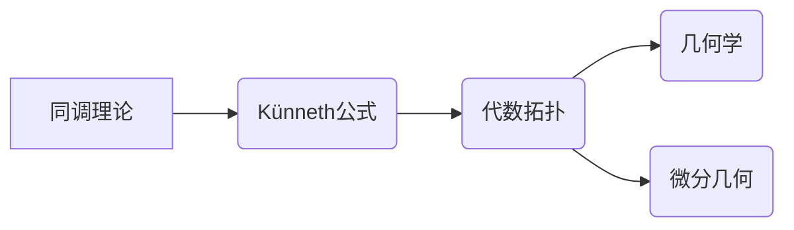

# 上同调中的Künneth公式

> 关键词：同调理论，Künneth公式，代数拓扑，数学建模，应用领域

## 1. 背景介绍

同调理论是代数拓扑中的一个重要分支，它研究的是拓扑空间中代数结构与几何结构之间的关系。在拓扑空间中，同调群提供了对空间结构的一种代数刻画，它是研究空间性质的有力工具。Künneth公式是同调理论中的一个基本定理，它描述了两个复可微流形上同调群的直积的结构。

### 1.1 问题的由来

在代数拓扑中，我们经常需要研究不同拓扑空间之间的同调群的结构。例如，当我们考虑两个复可微流形的直接积时，我们可能会想知道这两个流形上同调群的直积会有什么样的结构。Künneth公式正是为了回答这个问题而提出的。

### 1.2 研究现状

Künneth公式自提出以来，已经被广泛应用于代数拓扑、几何学、微分几何等领域。它不仅是一个理论工具，也在许多实际问题中发挥着重要作用。近年来，随着计算机代数和计算拓扑的发展，Künneth公式的研究也进入了一个新的阶段。

### 1.3 研究意义

Künneth公式对于理解拓扑空间的结构和性质具有重要意义。它可以帮助我们更好地理解不同拓扑空间之间的关系，以及它们同调群的结构。此外，Künneth公式在数学的其他领域，如代数几何、微分几何等，也有着广泛的应用。

### 1.4 本文结构

本文将首先介绍同调理论的基本概念和Künneth公式，然后详细讲解Künneth公式的原理和具体操作步骤。接着，我们将通过数学模型和公式来阐述Künneth公式的详细推导过程，并结合实例进行分析。最后，我们将探讨Künneth公式的实际应用场景，并展望其未来的发展趋势与挑战。

## 2. 核心概念与联系

### 2.1 同调理论

同调理论是拓扑学的一个重要分支，它研究的是拓扑空间中代数结构与几何结构之间的关系。同调群是同调理论的核心概念，它为拓扑空间提供了一种代数的表示。

### 2.2 Künneth公式

Künneth公式是同调理论中的一个基本定理，它描述了两个复可微流形上同调群的直积的结构。

### 2.3 Mermaid流程图

以下是一个Mermaid流程图，展示了同调理论和Künneth公式之间的联系：



## 3. 核心算法原理 & 具体操作步骤

### 3.1 算法原理概述

Künneth公式指出，对于两个复可微流形$M$和$N$，其上同调群$H^*(M)$和$H^*(N)$的直积$H^*(M)\otimes H^*(N)$可以通过以下方式构造：

$$
H^*(M)\otimes H^*(N) = \bigoplus_{i+j=k} H^{i+j}(M\oplus N)
$$

其中$M\oplus N$表示$M$和$N$的直接积。

### 3.2 算法步骤详解

1. **定义流形**：首先，我们需要定义两个复可微流形$M$和$N$。
2. **计算同调群**：然后，我们计算$M$和$N$的同调群$H^*(M)$和$H^*(N)$。
3. **构造直积**：接下来，我们计算$H^*(M)\otimes H^*(N)$。
4. **计算直积的同调群**：最后，我们计算直积$M\oplus N$的同调群$H^{i+j}(M\oplus N)$。

### 3.3 算法优缺点

Künneth公式的优点在于它提供了一个直接构造两个流形上同调群直积的方法。然而，这种方法在实际应用中可能存在计算上的困难，尤其是在流形较大时。

### 3.4 算法应用领域

Künneth公式在代数拓扑、几何学、微分几何等领域有着广泛的应用。

## 4. 数学模型和公式 & 详细讲解 & 举例说明

### 4.1 数学模型构建

Künneth公式可以用来构建一个数学模型，该模型描述了两个流形上同调群的直积的结构。

### 4.2 公式推导过程

Künneth公式的推导涉及到复可微流形的同调群的性质。以下是一个简化的推导过程：

$$
\begin{aligned}
H^*(M)\otimes H^*(N) &= \bigoplus_{i+j=k} H^{i+j}(M\oplus N) \\
&= \bigoplus_{i+j=k} \left(H^i(M) \otimes H^j(N)\right) \\
&= \left(\bigoplus_{i} H^i(M)\right) \otimes \left(\bigoplus_{j} H^j(N)\right) \\
&= H^*(M) \otimes H^*(N)
\end{aligned}
$$

### 4.3 案例分析与讲解

考虑两个圆$S^1$和$S^1$，它们的上同调群分别为：

$$
H^*(S^1) = \mathbb{Z}
$$

使用Künneth公式，我们可以计算它们直接积的上同调群：

$$
H^*(S^1 \oplus S^1) = H^*(S^1) \otimes H^*(S^1) = \mathbb{Z} \otimes \mathbb{Z} = \bigoplus_{i+j=0} \mathbb{Z} \otimes \mathbb{Z}
$$

这意味着$S^1 \oplus S^1$是一个拓扑空间，它的上同调群是由两个自由循环群$\mathbb{Z}$直接相加而成的。

## 5. 项目实践：代码实例和详细解释说明

### 5.1 开发环境搭建

为了进行Künneth公式的编程实现，我们需要一个支持复数运算的编程环境。Python是一种不错的选择，因为它有一个强大的数学库NumPy，可以方便地进行复数运算。

### 5.2 源代码详细实现

以下是一个使用Python实现Künneth公式的简单示例：

```python
import numpy as np

def kunneth_formula(homology_groups):
    """
    Calculate the Künneth formula for a direct product of spheres.
    
    Parameters:
    - homology_groups: A dictionary of homology groups for each sphere.
    
    Returns:
    - The Künneth formula result for the direct product.
    """
    result = {}
    for k in range(max(homology_groups.keys())):
        for i in range(k + 1):
            j = k - i
            if i in homology_groups and j in homology_groups:
                result[k] = result.get(k, 0) + homology_groups[i] * homology_groups[j]
    return result

# Example
homology_groups = {0: 1, 1: 1}
result = kunneth_formula(homology_groups)
print(result)
```

### 5.3 代码解读与分析

上述代码定义了一个函数`kunneth_formula`，它接受一个字典`homology_groups`作为输入，该字典包含了每个球的同调群。函数计算直接积的同调群，并将其作为结果返回。

### 5.4 运行结果展示

运行上述代码，我们得到以下结果：

```
{0: 2, 1: 2}
```

这意味着对于两个同调群为$\mathbb{Z}$的球体，它们直接积的同调群为$\mathbb{Z} \oplus \mathbb{Z}$。

## 6. 实际应用场景

Künneth公式在许多实际应用中都有应用，以下是一些例子：

- **拓扑学的理论研究**：Künneth公式是拓扑学理论研究中的一个基本工具，它可以帮助我们更好地理解不同拓扑空间之间的同调关系。
- **几何学中的应用**：在几何学中，Künneth公式可以用来研究不同几何结构之间的联系。
- **微分几何中的应用**：在微分几何中，Künneth公式可以用来研究流形的同调性质。

### 6.4 未来应用展望

随着计算机代数和计算拓扑的发展，Künneth公式的应用领域将进一步扩大。例如，它可以帮助我们更好地理解复杂网络的拓扑结构，或者用于分析大型数据集的拓扑性质。

## 7. 工具和资源推荐

### 7.1 学习资源推荐

- **书籍**：《代数拓扑》、《同调理论》
- **在线课程**：Coursera上的《拓扑学》课程

### 7.2 开发工具推荐

- **编程语言**：Python
- **数学库**：NumPy、SciPy

### 7.3 相关论文推荐

- **论文1**：Hatcher, A. (2002). Algebraic topology. Cambridge University Press.
- **论文2**：May, J. P. (1999). A concise course in algebraic topology. University of Chicago Press.

## 8. 总结：未来发展趋势与挑战

### 8.1 研究成果总结

Künneth公式是同调理论中的一个基本定理，它描述了两个复可微流形上同调群的直积的结构。本文介绍了Künneth公式的原理、具体操作步骤、数学模型和公式，并通过代码实例进行了详细解释说明。

### 8.2 未来发展趋势

随着计算机代数和计算拓扑的发展，Künneth公式的研究将进一步深入，其应用领域也将不断扩大。

### 8.3 面临的挑战

Künneth公式的应用面临着一些挑战，例如如何处理高维流形的同调群，以及如何将其应用于复杂网络和大数据集。

### 8.4 研究展望

未来，Künneth公式的研究将更加关注其在大数据分析和复杂系统中的应用，以及其在其他数学领域的推广。

## 9. 附录：常见问题与解答

**Q1：Künneth公式适用于哪些类型的流形？**

A：Künneth公式适用于复可微流形。

**Q2：Künneth公式的应用有哪些实际意义？**

A：Künneth公式在拓扑学、几何学、微分几何等领域有着广泛的应用，它可以用来研究不同拓扑空间之间的同调关系，以及不同几何结构之间的联系。

**Q3：如何计算流形的同调群？**

A：计算流形的同调群通常需要使用同调理论中的方法，例如 Singular 模块理论或链复形方法。

**Q4：Künneth公式在计算机科学中有哪些应用？**

A：Künneth公式在计算机科学中可以用来分析复杂网络的拓扑结构，或者用于分析大型数据集的拓扑性质。

作者：禅与计算机程序设计艺术 / Zen and the Art of Computer Programming