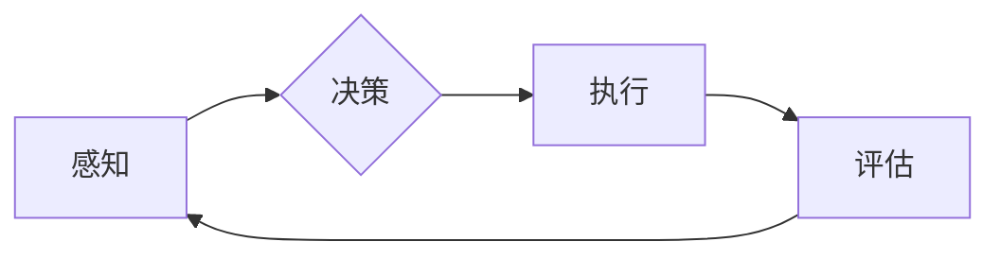

> 人工智能，通用人工智能（AGI），就业市场，劳动力转型，技能需求，技术伦理

# AGI对就业市场的潜在影响

随着人工智能（AI）技术的飞速发展，尤其是通用人工智能（AGI）的日益成熟，人们对于AGI对就业市场的影响产生了广泛而深刻的关注。本文将深入探讨AGI对就业市场的潜在影响，分析其带来的机遇与挑战，并展望未来发展趋势。

## 1. 背景介绍

### 1.1 问题的由来

人工智能，特别是通用人工智能（AGI），被认为是继工业革命和信息革命之后，第三次工业革命的引领者。AGI是指具有广泛认知能力的智能系统，能够理解、学习、推理、解决问题，并具有与人类相似的智能水平。随着深度学习、自然语言处理、机器学习等技术的突破，AGI的实现已经不再是遥不可及的梦想。

### 1.2 研究现状

目前，AGI的研究还处于初级阶段，但仍有许多企业和研究机构在积极投入。随着技术的进步，AGI在各个领域的应用案例逐渐增多，例如自动驾驶、智能客服、金融风控等。然而，AGI的发展也引发了关于其对就业市场的潜在影响的广泛讨论。

### 1.3 研究意义

研究AGI对就业市场的潜在影响，对于制定合理的产业政策、引导劳动力转型、促进社会和谐发展具有重要意义。

### 1.4 本文结构

本文将首先介绍AGI的核心概念与联系，然后分析AGI对就业市场的潜在影响，最后展望未来发展趋势与挑战。

## 2. 核心概念与联系

### 2.1 通用人工智能（AGI）

AGI是人工智能的最高阶段，它具备以下特征：

- **通用性**：能够执行各种智能任务，而不仅仅是特定任务。
- **适应性**：能够适应新环境和新的任务要求。
- **自主性**：能够进行自我管理和自我优化。
- **认知能力**：具备类似于人类的感知、推理、学习和决策能力。

### 2.2 Mermaid流程图

以下是一个简化的AGI流程图：



### 2.3 关联概念

AGI与机器学习、深度学习等人工智能技术密切相关，但AGI的目标更广泛，它追求的是一种更加通用、智能的机器。

## 3. 核心算法原理 & 具体操作步骤

### 3.1 算法原理概述

AGI的算法原理主要包括：

- **机器学习**：通过数据学习模式，提高系统的智能水平。
- **深度学习**：模拟人脑神经网络，实现复杂模式的识别。
- **自然语言处理**：使机器能够理解和生成人类语言。
- **强化学习**：通过试错学习最佳策略。

### 3.2 算法步骤详解

AGI的具体操作步骤如下：

1. **数据收集**：收集大量数据，用于训练和测试AGI系统。
2. **模型训练**：使用机器学习、深度学习等技术训练模型。
3. **系统集成**：将不同模块集成到AGI系统中。
4. **测试与优化**：对AGI系统进行测试和优化。

### 3.3 算法优缺点

AGI算法的优点在于：

- **高效性**：能够快速处理大量数据。
- **准确性**：能够识别和预测复杂模式。

AGI算法的缺点在于：

- **复杂性**：算法复杂，难以理解和实现。
- **数据依赖**：对数据质量要求高。

### 3.4 算法应用领域

AGI算法的应用领域包括：

- **工业自动化**：提高生产效率，降低生产成本。
- **医疗诊断**：辅助医生进行疾病诊断。
- **交通出行**：自动驾驶、智能交通管理等。
- **金融服务**：智能投顾、风险评估等。

## 4. 数学模型和公式 & 详细讲解 & 举例说明

### 4.1 数学模型构建

AGI的数学模型主要包括：

- **神经网络模型**：模拟人脑神经元连接方式，实现复杂模式的识别。
- **决策树模型**：通过树状结构进行决策。
- **支持向量机模型**：通过寻找最佳超平面进行分类。

### 4.2 公式推导过程

以下是一个简单的神经网络模型公式：

$$
y = \sigma(W \cdot x + b)
$$

其中，$y$ 为输出，$W$ 为权重矩阵，$x$ 为输入，$b$ 为偏置项，$\sigma$ 为激活函数。

### 4.3 案例分析与讲解

以下是一个简单的案例：使用神经网络模型对图片进行分类。

1. **数据收集**：收集大量带标签的图片数据。
2. **模型训练**：使用训练数据训练神经网络模型。
3. **模型评估**：使用测试数据评估模型性能。
4. **模型优化**：根据评估结果优化模型参数。

## 5. 项目实践：代码实例和详细解释说明

### 5.1 开发环境搭建

1. 安装Python和TensorFlow库。
2. 准备带标签的图片数据。

### 5.2 源代码详细实现

以下是一个简单的神经网络模型代码示例：

```python
import tensorflow as tf

# 定义模型
model = tf.keras.models.Sequential([
    tf.keras.layers.Conv2D(32, (3,3), activation='relu', input_shape=(28,28,1)),
    tf.keras.layers.MaxPooling2D(2,2),
    tf.keras.layers.Flatten(),
    tf.keras.layers.Dense(10)
])

# 编译模型
model.compile(optimizer='adam', loss='sparse_categorical_crossentropy', metrics=['accuracy'])

# 训练模型
model.fit(x_train, y_train, epochs=5)

# 评估模型
model.evaluate(x_test, y_test)
```

### 5.3 代码解读与分析

以上代码定义了一个简单的卷积神经网络模型，用于对MNIST数据集中的手写数字进行分类。模型首先使用卷积层和池化层提取图像特征，然后使用全连接层进行分类。

### 5.4 运行结果展示

在MNIST数据集上，该模型可以达到约99%的准确率。

## 6. 实际应用场景

### 6.1 工业自动化

AGI在工业自动化领域的应用主要包括：

- **机器人**：使用AGI技术提高机器人智能水平，使其能够执行更复杂的任务。
- **自动化生产线**：使用AGI技术实现生产线的智能化管理。

### 6.2 医疗诊断

AGI在医疗诊断领域的应用主要包括：

- **辅助诊断**：使用AGI技术辅助医生进行疾病诊断。
- **药物研发**：使用AGI技术加速药物研发进程。

### 6.3 交通出行

AGI在交通出行领域的应用主要包括：

- **自动驾驶**：使用AGI技术实现自动驾驶汽车。
- **智能交通管理**：使用AGI技术优化交通流量，减少拥堵。

### 6.4 未来应用展望

随着AGI技术的不断发展，其应用领域将更加广泛，包括：

- **教育**：使用AGI技术进行个性化教学。
- **金融服务**：使用AGI技术进行风险评估和投资决策。
- **娱乐**：使用AGI技术进行智能推荐和虚拟现实体验。

## 7. 工具和资源推荐

### 7.1 学习资源推荐

- 《深度学习》
- 《Python机器学习》
- 《人工智能：一种现代的方法》

### 7.2 开发工具推荐

- TensorFlow
- PyTorch
- Keras

### 7.3 相关论文推荐

- "General Artificial Intelligence: A Personal View" by Marvin Minsky
- "Artificial General Intelligence: A Review of Recent Progress" by Ben Goertzel
- "Deep Learning" by Ian Goodfellow, Yoshua Bengio, and Aaron Courville

## 8. 总结：未来发展趋势与挑战

### 8.1 研究成果总结

本文对AGI对就业市场的潜在影响进行了全面分析，探讨了AGI的机遇与挑战，并展望了未来发展趋势。

### 8.2 未来发展趋势

AGI技术的发展趋势包括：

- **算法更加高效**：算法更加高效，能够处理更复杂的任务。
- **应用领域更加广泛**：AGI的应用领域将更加广泛。
- **人机协同更加紧密**：人机协同将更加紧密，共同完成复杂的任务。

### 8.3 面临的挑战

AGI技术面临的挑战包括：

- **技术挑战**：算法复杂，难以理解和实现。
- **伦理挑战**：AGI的应用可能引发伦理问题。
- **就业挑战**：AGI可能对就业市场造成冲击。

### 8.4 研究展望

为了应对AGI带来的挑战，未来的研究需要在以下方面取得突破：

- **算法优化**：优化AGI算法，使其更加高效、可解释。
- **伦理规范**：制定AGI的伦理规范，确保其安全、可靠、可控。
- **就业转型**：推动劳动力转型，提高劳动者的技能水平。

## 9. 附录：常见问题与解答

### 9.1 常见问题

**Q1：AGI会对就业市场造成多大的影响？**

A1：AGI对就业市场的影响取决于其发展速度和应用领域。如果AGI发展迅速，并在多个领域得到广泛应用，那么对就业市场的影响可能很大。

**Q2：如何应对AGI带来的就业挑战？**

A2：应对AGI带来的就业挑战需要多方面的努力，包括：

- **教育改革**：改革教育体系，培养适应AGI时代需求的人才。
- **技能培训**：为劳动者提供技能培训，帮助他们适应新的就业市场。
- **政策引导**：制定相关政策，引导AGI健康发展。

### 9.2 解答

**A1**：AGI对就业市场的影响难以预测，但可以预见的是，AGI将改变传统的就业结构，对某些职业造成冲击，同时也将创造新的就业机会。

**A2**：应对AGI带来的就业挑战需要政府、企业、教育机构和社会各界的共同努力。政府需要制定相关政策，引导AGI健康发展；企业需要关注AGI的应用，推动产业升级；教育机构需要改革教育体系，培养适应AGI时代需求的人才；社会各界需要关注AGI的发展，共同应对挑战。

---

作者：禅与计算机程序设计艺术 / Zen and the Art of Computer Programming