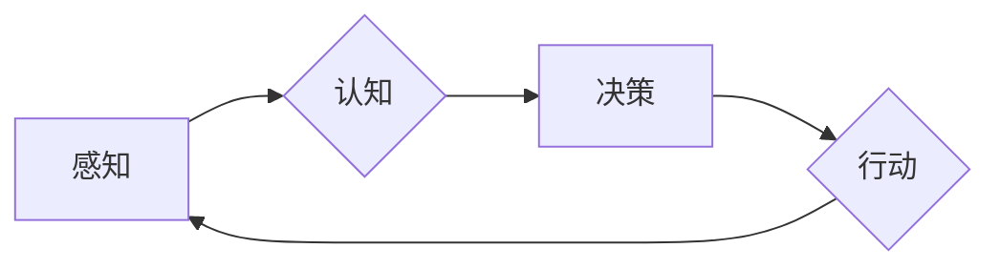
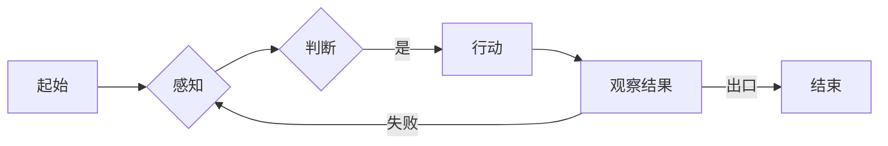

> 关键词：AI Agent，智能体，强化学习，深度学习，环境建模，决策规划，人机交互，自主性，协作，伦理

# AI Agent: AI的下一个风口 当前的研究难点与挑战

人工智能(AI)已经从实验室走进了我们的日常生活，从智能助手到自动驾驶，从医疗诊断到金融分析，AI的应用几乎无处不在。在经历了深度学习、自然语言处理等领域的突破之后，AI Agent成为了人工智能领域下一个风口。AI Agent是一种能够自主感知环境、制定决策并采取行动的智能体，它们在游戏、机器人、自动驾驶、智能客服等多个领域展现出巨大的潜力。本文将深入探讨AI Agent的核心概念、研究难点与挑战。

## 1. 背景介绍

### 1.1 问题的由来

随着计算机科学的快速发展，人工智能技术取得了显著的进步。然而，尽管AI在特定任务上表现出色，但它们仍然缺乏自主性、灵活性和适应性。传统的AI系统通常需要明确的目标和预设的规则，无法在复杂多变的真实环境中自主行动。

AI Agent的概念应运而生，它试图模拟人类的智能行为，使机器能够在不确定的环境中自主感知、决策和行动。AI Agent的研究旨在开发能够适应复杂环境、与其他智能体协作并解决实际问题的智能系统。

### 1.2 研究现状

近年来，AI Agent的研究取得了显著进展，主要集中在以下几个方面：

- 强化学习：通过与环境交互学习最优策略，使智能体能够实现目标。
- 深度学习：利用神经网络对复杂环境进行建模，提高智能体的感知和决策能力。
- 环境建模：研究如何精确地描述和模拟真实世界环境。
- 决策规划：开发高效的决策算法，使智能体能够根据当前状态和目标制定行动方案。
- 人机交互：研究如何让人类与AI Agent有效地沟通和协作。

### 1.3 研究意义

AI Agent的研究具有以下重要意义：

- 提高自动化水平：AI Agent可以自动执行各种任务，提高生产效率和降低人力成本。
- 改善用户体验：AI Agent可以提供个性化的服务，提高用户满意度。
- 促进技术创新：AI Agent的研究推动了人工智能技术的进步，催生了新的应用领域。
- 解决复杂问题：AI Agent可以处理复杂问题，为人类提供新的解决方案。

### 1.4 本文结构

本文将围绕AI Agent的核心概念、研究难点与挑战展开，具体内容如下：

- 第2部分：介绍AI Agent的核心概念和相关的技术体系。
- 第3部分：探讨AI Agent的核心算法原理和具体操作步骤。
- 第4部分：分析AI Agent的数学模型和公式，并举例说明。
- 第5部分：给出AI Agent的代码实例和详细解释说明。
- 第6部分：探讨AI Agent的实际应用场景和未来应用展望。
- 第7部分：推荐AI Agent相关的学习资源、开发工具和参考文献。
- 第8部分：总结AI Agent的未来发展趋势与挑战。
- 第9部分：提供常见问题与解答。

## 2. 核心概念与联系

AI Agent的核心概念包括：

- 感知：智能体通过传感器收集环境信息。
- 认知：智能体根据感知到的信息进行推理和决策。
- 行动：智能体根据决策结果执行行动。
- 自主性：智能体能够在没有人类干预的情况下自主行动。
- 协作：多个智能体可以共同完成任务。

以下是一个简化的AI Agent流程图：



感知、认知、决策和行动是AI Agent的核心环节，它们相互依赖，形成一个闭环的系统。AI Agent的自主性和协作能力是其区别于传统AI系统的主要特点。

## 3. 核心算法原理 & 具体操作步骤

### 3.1 算法原理概述

AI Agent的核心算法主要包括：

- 强化学习：通过奖励机制和策略优化，使智能体在环境中学习最优策略。
- 深度学习：利用神经网络对环境进行建模，提高智能体的感知和决策能力。
- 环境建模：使用概率图模型、隐马尔可夫模型等方法对环境进行建模。
- 决策规划：使用搜索算法、启发式算法等方法制定行动方案。

### 3.2 算法步骤详解

以下是AI Agent的基本操作步骤：

1. **初始化**：设置智能体的初始状态、环境模型、决策策略等。
2. **感知**：智能体通过传感器收集环境信息，如图像、声音、温度等。
3. **认知**：智能体根据感知到的信息进行推理和决策。
4. **决策**：智能体根据当前状态和目标，选择最优行动。
5. **行动**：智能体根据决策结果执行行动。
6. **反馈**：环境对智能体的行动做出响应，智能体根据反馈调整状态。
7. **循环**：重复步骤2-6，使智能体能够适应不断变化的环境。

### 3.3 算法优缺点

- **强化学习**：优点是能够处理复杂的动态环境，缺点是训练时间较长，容易陷入局部最优。
- **深度学习**：优点是能够处理大规模数据，缺点是模型难以解释，对数据质量要求较高。
- **环境建模**：优点是能够对环境进行精确描述，缺点是模型复杂度高，计算量大。
- **决策规划**：优点是能够制定详细的行动方案，缺点是难以处理复杂环境。

### 3.4 算法应用领域

AI Agent的核心算法广泛应用于以下领域：

- 游戏：如国际象棋、围棋、电子竞技等。
- 机器人：如自动驾驶、工业机器人、服务机器人等。
- 自动驾驶：如无人驾驶汽车、无人机等。
- 智能客服：如虚拟助手、智能客服机器人等。

## 4. 数学模型和公式 & 详细讲解 & 举例说明

### 4.1 数学模型构建

AI Agent的数学模型主要包括：

- 状态空间：描述智能体和环境的可能状态。
- 动作空间：描述智能体可能采取的行动。
- 奖励函数：描述智能体采取行动后的奖励。

以下是一个简单的状态-动作-奖励模型：

```latex
\begin{align*}
S &\in \mathcal{S} \\
A &\in \mathcal{A} \\
R &\in \mathbb{R}
\end{align*}
```

其中，$\mathcal{S}$ 为状态空间，$\mathcal{A}$ 为动作空间，$\mathbb{R}$ 为实数集。

### 4.2 公式推导过程

以下是一个简单的Q学习算法的公式推导：

假设智能体在状态 $s$ 采取行动 $a$，得到奖励 $r$ 和下一个状态 $s'$，则Q学习算法的目标是学习状态-动作值函数 $Q(s,a)$。

$$
Q(s,a) = Q(s,a) + \alpha [r + \gamma \max_{a'} Q(s',a') - Q(s,a)]
$$

其中，$\alpha$ 为学习率，$\gamma$ 为折扣因子。

### 4.3 案例分析与讲解

以下是一个简单的AI Agent的例子，它使用Q学习算法在迷宫中找到出口。



在这个例子中，智能体在迷宫中移动，并尝试找到出口。它使用Q学习算法学习最优路径。

## 5. 项目实践：代码实例和详细解释说明

### 5.1 开发环境搭建

为了实现AI Agent，你需要以下开发环境：

- 操作系统：Windows、Linux或macOS
- 编程语言：Python
- 库：NumPy、Pandas、Matplotlib、scikit-learn

### 5.2 源代码详细实现

以下是一个简单的Q学习算法的Python实现：

```python
import numpy as np

class QLearningAgent:
    def __init__(self, num_states, num_actions, alpha=0.1, gamma=0.99):
        self.alpha = alpha
        self.gamma = gamma
        self.q_table = np.zeros((num_states, num_actions))

    def get_action(self, state):
        return np.argmax(self.q_table[state])

    def update(self, state, action, reward, next_state):
        self.q_table[state][action] = (1 - self.alpha) * self.q_table[state][action] + self.alpha * (reward + self.gamma * np.max(self.q_table[next_state]))

# 示例使用
agent = QLearningAgent(num_states=4, num_actions=2)
state = 0
action = agent.get_action(state)
next_state = 1
reward = 1
agent.update(state, action, reward, next_state)
```

### 5.3 代码解读与分析

在这个例子中，我们创建了一个QLearningAgent类，它使用Q学习算法学习状态-动作值函数。在初始化方法中，我们设置了学习率、折扣因子和Q表格。在get_action方法中，我们使用argmax函数选择最优动作。在update方法中，我们根据奖励和下一个状态更新Q表格。

### 5.4 运行结果展示

运行上述代码，智能体将根据Q学习算法在迷宫中找到出口。

## 6. 实际应用场景

AI Agent在实际应用场景中具有广泛的应用，以下是一些典型的应用案例：

- **自动驾驶**：AI Agent可以用于自动驾驶汽车中，使其能够感知周围环境、做出决策并控制车辆行驶。
- **机器人**：AI Agent可以用于工业机器人中，使其能够执行复杂的任务，如装配、焊接、搬运等。
- **游戏**：AI Agent可以用于游戏开发中，使游戏角色能够模拟真实人类的行为。
- **智能客服**：AI Agent可以用于智能客服系统中，使其能够自动回答客户的问题。

## 7. 工具和资源推荐

### 7.1 学习资源推荐

- 《Reinforcement Learning: An Introduction》
- 《Artificial Intelligence: A Modern Approach》
- 《Deep Reinforcement Learning Hands-On》

### 7.2 开发工具推荐

- Python
- TensorFlow
- PyTorch
- OpenAI Gym

### 7.3 相关论文推荐

- "Deep Reinforcement Learning: A Survey" by Volodymyr Mnih et al.
- "Algorithms for Reinforcement Learning" by Csaba Szepesvári
- "Playing Atari with Deep Reinforcement Learning" by Volodymyr Mnih et al.

## 8. 总结：未来发展趋势与挑战

### 8.1 研究成果总结

AI Agent作为人工智能领域的一个重要方向，已经取得了显著的进展。通过强化学习、深度学习等技术，AI Agent能够在复杂环境中进行决策和行动，并在游戏、机器人、自动驾驶等领域得到广泛应用。

### 8.2 未来发展趋势

未来，AI Agent的研究将主要集中在以下几个方面：

- **多智能体系统**：研究多个AI Agent之间的协作和竞争，实现更复杂的任务。
- **强化学习算法**：开发更高效的强化学习算法，提高智能体的学习效率和鲁棒性。
- **深度学习模型**：设计更强大的深度学习模型，提高智能体的感知和决策能力。
- **人机交互**：研究如何让人类与AI Agent更好地协作，提高人机交互的效率和体验。

### 8.3 面临的挑战

AI Agent的研究仍然面临以下挑战：

- **环境建模**：如何精确地建模真实世界环境，是AI Agent研究的一个重要挑战。
- **决策规划**：如何制定有效的决策规划算法，使智能体能够做出最优决策。
- **计算资源**：AI Agent的计算量通常很大，需要大量的计算资源。
- **伦理问题**：AI Agent的决策可能会产生伦理问题，需要制定相应的伦理规范。

### 8.4 研究展望

随着技术的不断进步，AI Agent将在更多领域得到应用，并推动人工智能技术的发展。未来，AI Agent的研究将朝着更加高效、鲁棒、可解释和伦理的方向发展。

## 9. 附录：常见问题与解答

**Q1：什么是AI Agent？**

A：AI Agent是一种能够自主感知环境、制定决策并采取行动的智能体，它能够模拟人类的智能行为，在复杂环境中自主行动。

**Q2：AI Agent有哪些应用场景？**

A：AI Agent的应用场景非常广泛，包括游戏、机器人、自动驾驶、智能客服、金融分析等。

**Q3：AI Agent的研究难点是什么？**

A：AI Agent的研究难点主要包括环境建模、决策规划、计算资源和伦理问题等。

**Q4：如何开发AI Agent？**

A：开发AI Agent需要掌握Python、TensorFlow、PyTorch等编程语言和库，以及强化学习、深度学习等技术。

**Q5：AI Agent的伦理问题如何解决？**

A：AI Agent的伦理问题需要通过制定相应的伦理规范、加强监管和人工干预等方式来解决。

---

作者：禅与计算机程序设计艺术 / Zen and the Art of Computer Programming