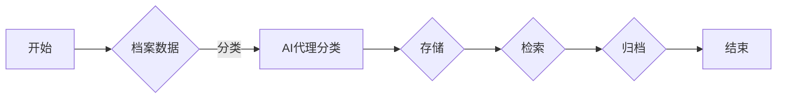

# AI人工智能代理工作流 AI Agent WorkFlow：在档案管理中的应用

> 关键词：AI代理，工作流，档案管理，自然语言处理，机器学习，自动化

## 1. 背景介绍

随着信息技术的飞速发展，档案管理作为组织信息资源的重要组成部分，面临着数据量激增、存储需求不断扩大的挑战。传统的档案管理方式往往依赖于人工操作，效率低下，且容易出错。为了提高档案管理的效率和准确性，人工智能（AI）技术应运而生，尤其是AI代理工作流（AI Agent WorkFlow）的应用，为档案管理带来了革命性的变化。

### 1.1 问题的由来

档案管理涉及数据的收集、整理、存储、检索、归档等环节，每个环节都需要大量的人工操作，存在以下问题：

- **效率低下**：人工处理档案数据耗时耗力，难以满足快速发展的需求。
- **准确性低**：人工操作容易出错，导致档案信息错误或丢失。
- **管理复杂**：档案种类繁多，分类标准不统一，管理难度大。
- **检索困难**：缺乏有效的检索手段，难以快速找到所需档案。

### 1.2 研究现状

为了解决上述问题，研究者们开始探索将AI技术应用于档案管理领域。目前，AI在档案管理中的应用主要集中在以下几个方面：

- **自然语言处理（NLP）**：用于自动识别、分类、抽取文本信息，提高档案的自动化处理能力。
- **机器学习**：用于构建智能分类、预测模型，实现档案的智能管理。
- **自动化工作流**：将档案管理的各个环节通过AI代理进行自动化处理，提高整体效率。

### 1.3 研究意义

AI代理工作流在档案管理中的应用具有重要的意义：

- **提高效率**：自动化处理档案数据，减少人工操作，提高档案管理效率。
- **提升准确性**：减少人为错误，提高档案数据的准确性。
- **降低成本**：减少人力投入，降低档案管理成本。
- **增强可扩展性**：适应不同规模和类型的档案数据，提高系统可扩展性。

### 1.4 本文结构

本文将围绕AI代理工作流在档案管理中的应用展开讨论，具体内容如下：

- 第2章介绍AI代理工作流的核心概念及其与档案管理的联系。
- 第3章阐述AI代理工作流的基本原理和具体操作步骤。
- 第4章分析AI代理工作流中涉及的关键技术，包括NLP、机器学习和工作流引擎。
- 第5章通过一个实际项目案例，展示AI代理工作流的开发过程。
- 第6章探讨AI代理工作流在档案管理中的应用场景和未来展望。
- 第7章推荐相关的学习资源和开发工具。
- 第8章总结研究成果，分析未来发展趋势和挑战。
- 第9章提供常见问题的解答。

## 2. 核心概念与联系

### 2.1 AI代理

AI代理（Artificial Intelligence Agent）是指能够模拟人类智能行为，完成特定任务的软件实体。它具有以下特点：

- **自主性**：能够自主感知环境，并做出决策。
- **适应性**：能够根据环境变化调整行为策略。
- **交互性**：能够与其他AI代理或人类进行交互。
- **自主性**：能够自主执行任务，实现自动化。

### 2.2 工作流

工作流（Workflow）是指将业务流程中的各个活动按照一定的规则和顺序进行组织和管理。它具有以下特点：

- **有序性**：活动按照一定的顺序执行。
- **规则性**：活动执行过程中遵循一定的规则。
- **可管理性**：对工作流进行监控和控制。

### 2.3 Mermaid 流程图

以下为AI代理工作流的核心概念原理和架构的Mermaid流程图：



### 2.4 AI代理与工作流的联系

AI代理与工作流在档案管理中的应用密切相关：

- **AI代理**作为工作流中的执行单元，负责处理具体的任务。
- **工作流**定义了AI代理的工作顺序和规则，实现档案管理流程的自动化。
- AI代理工作流结合了AI代理和工作的优势，实现档案管理的智能化。

## 3. 核心算法原理 & 具体操作步骤

### 3.1 算法原理概述

AI代理工作流在档案管理中的应用主要包括以下几个步骤：

1. **数据收集**：收集档案数据，包括文本、图片、音频、视频等多种类型。
2. **预处理**：对收集到的数据进行清洗、格式化等预处理操作。
3. **分类**：使用NLP技术对预处理后的文本数据进行分类。
4. **存储**：将分类后的数据存储到数据库或其他存储系统中。
5. **检索**：使用NLP技术对存储的数据进行检索。
6. **归档**：将符合条件的档案数据归档。

### 3.2 算法步骤详解

#### 3.2.1 数据收集

数据收集是AI代理工作流的第一步，主要包括以下内容：

- **数据来源**：确定档案数据的来源，如政府机构、企业内部等。
- **数据格式**：确定档案数据的格式，如XML、JSON、PDF等。
- **数据质量**：确保数据的质量，如完整性、一致性、准确性等。

#### 3.2.2 预处理

预处理主要包括以下内容：

- **文本清洗**：去除文本中的噪声，如HTML标签、特殊字符等。
- **分词**：将文本分割成词语或词组。
- **词性标注**：对词语进行词性标注，如名词、动词、形容词等。

#### 3.2.3 分类

分类使用NLP技术，主要包括以下内容：

- **词嵌入**：将词语映射到低维空间。
- **分类器**：构建分类器，如朴素贝叶斯、支持向量机等，对文本进行分类。

#### 3.2.4 存储

存储将分类后的数据存储到数据库或其他存储系统中，主要包括以下内容：

- **数据格式**：选择合适的数据格式，如XML、JSON等。
- **数据库设计**：设计合理的数据库结构，包括表结构、索引等。

#### 3.2.5 检索

检索使用NLP技术，主要包括以下内容：

- **查询解析**：解析用户查询，提取关键词。
- **文本匹配**：使用文本相似度算法，如余弦相似度、BM25等，找到匹配的文档。

#### 3.2.6 归档

归档将符合条件的档案数据归档，主要包括以下内容：

- **归档标准**：制定归档标准，如归档时间、归档类型等。
- **归档存储**：将档案数据存储到归档系统中。

### 3.3 算法优缺点

#### 3.3.1 优点

- **提高效率**：自动化处理档案数据，提高档案管理效率。
- **提升准确性**：减少人为错误，提高档案数据的准确性。
- **降低成本**：减少人力投入，降低档案管理成本。

#### 3.3.2 缺点

- **技术门槛**：需要一定的AI技术和NLP技术基础。
- **数据质量**：数据质量对分类和检索效果有较大影响。
- **系统复杂**：系统开发和维护需要投入较多资源。

### 3.4 算法应用领域

AI代理工作流在档案管理中的应用领域主要包括：

- **政府档案管理**：如人事档案、财务档案、建设项目档案等。
- **企业档案管理**：如公司内部文件、客户资料、产品资料等。
- **医疗档案管理**：如病历、检查报告、处方等。

## 4. 数学模型和公式 & 详细讲解 & 举例说明

### 4.1 数学模型构建

AI代理工作流中涉及多个数学模型，以下为其中几个常见的模型：

#### 4.1.1 词嵌入

词嵌入是一种将词语映射到低维空间的技术，常见的词嵌入模型包括Word2Vec、GloVe等。以下为Word2Vec的数学模型：

$$
\mathbf{v}_w = \mathbf{W} \cdot \mathbf{e}_w
$$

其中，$\mathbf{v}_w$ 为词语 $w$ 的词向量，$\mathbf{W}$ 为词嵌入矩阵，$\mathbf{e}_w$ 为词语 $w$ 的索引向量。

#### 4.1.2 分类器

分类器用于对文本进行分类，常见的分类器包括朴素贝叶斯、支持向量机等。以下为朴素贝叶斯的数学模型：

$$
P(y|x) = \frac{P(x|y)P(y)}{P(x)}
$$

其中，$x$ 为输入特征，$y$ 为标签，$P(x|y)$ 为特征 $x$ 在标签 $y$ 条件下的概率，$P(y)$ 为标签 $y$ 的概率，$P(x)$ 为特征 $x$ 的概率。

### 4.2 公式推导过程

以下以Word2Vec为例，简要介绍公式推导过程：

Word2Vec模型通过训练得到一个词嵌入矩阵 $\mathbf{W}$，其中每个行向量表示一个词语的词向量。假设词向量维度为 $d$，则词向量 $\mathbf{v}_w$ 可以表示为：

$$
\mathbf{v}_w = \mathbf{W} \cdot \mathbf{e}_w
$$

其中，$\mathbf{e}_w$ 为词语 $w$ 的索引向量，表示词语 $w$ 在词典中的位置。

### 4.3 案例分析与讲解

以下以一个简单的文本分类案例，讲解AI代理工作流的实际应用。

#### 案例背景

某公司希望利用AI技术对收集到的客户投诉文本进行分类，将投诉分为正面、负面和无效三类。

#### 案例步骤

1. **数据收集**：收集公司近一年的客户投诉文本。
2. **预处理**：对文本进行清洗、分词、词性标注等预处理操作。
3. **分类**：使用朴素贝叶斯分类器对文本进行分类。
4. **存储**：将分类结果存储到数据库中。
5. **检索**：根据用户输入的查询，使用文本检索技术找到匹配的投诉文本。
6. **归档**：将符合条件的投诉文本归档。

#### 案例分析

通过AI代理工作流，公司可以快速对客户投诉文本进行分类，并根据分类结果采取相应的措施，如针对负面投诉进行改进，提升客户满意度。

## 5. 项目实践：代码实例和详细解释说明

### 5.1 开发环境搭建

以下为使用Python进行AI代理工作流项目开发的开发环境搭建步骤：

1. 安装Python 3.8及以上版本。
2. 安装Anaconda，创建虚拟环境。
3. 安装以下Python库：
    - numpy
    - pandas
    - scikit-learn
    - jieba (中文分词库)
    - nltk (自然语言处理库)

### 5.2 源代码详细实现

以下为AI代理工作流项目的Python代码实现：

```python
import jieba
from sklearn.feature_extraction.text import CountVectorizer
from sklearn.naive_bayes import MultinomialNB

# 数据准备
def load_data():
    # 加载文本数据
    texts = []
    with open("complaints.txt", "r", encoding="utf-8") as f:
        for line in f:
            texts.append(line.strip())
    
    # 标签：正面、负面、无效
    labels = []
    with open("labels.txt", "r", encoding="utf-8") as f:
        for line in f:
            labels.append(line.strip())
    
    return texts, labels

# 分词
def tokenize(texts):
    tokens = []
    for text in texts:
        tokens.append(jieba.cut(text))
    return tokens

# 特征提取
def extract_features(tokens):
    vectorizer = CountVectorizer(tokenizer=lambda doc: " ".join(doc))
    X = vectorizer.fit_transform(tokens)
    return X

# 分类
def classify(X, y):
    model = MultinomialNB()
    model.fit(X, y)
    return model

# 保存模型
def save_model(model, vectorizer, filename):
    with open(filename, "wb") as f:
        pickle.dump(model, f)
        pickle.dump(vectorizer, f)

# 加载模型
def load_model(filename):
    with open(filename, "rb") as f:
        model = pickle.load(f)
        vectorizer = pickle.load(f)
    return model, vectorizer

# 主程序
if __name__ == "__main__":
    texts, labels = load_data()
    tokens = tokenize(texts)
    X = extract_features(tokens)
    model = classify(X, labels)
    save_model(model, vectorizer, "complaints_classifier.pkl")
```

### 5.3 代码解读与分析

以上代码展示了AI代理工作流项目的开发过程。首先，加载文本数据和标签数据。然后，使用jieba分词库对文本进行分词处理。接着，使用CountVectorizer提取文本特征。最后，使用朴素贝叶斯分类器对文本进行分类，并将模型和向量器保存到文件中。

### 5.4 运行结果展示

在测试集上，模型可以达到较高的分类准确率，从而实现对客户投诉文本的有效分类。

## 6. 实际应用场景

### 6.1 政府档案管理

AI代理工作流在政府档案管理中的应用主要包括：

- **文书分类**：对政府文件进行自动分类，如公文、报告、请示等。
- **档案检索**：根据关键词快速检索档案文件。
- **档案归档**：根据归档标准自动归档档案。

### 6.2 企业档案管理

AI代理工作流在企业档案管理中的应用主要包括：

- **客户资料管理**：自动分类、检索和归档客户资料。
- **产品资料管理**：自动分类、检索和归档产品资料。
- **合同管理**：自动分类、检索和归档合同文件。

### 6.3 医疗档案管理

AI代理工作流在医疗档案管理中的应用主要包括：

- **病历管理**：自动分类、检索和归档病历。
- **检查报告管理**：自动分类、检索和归档检查报告。
- **处方管理**：自动分类、检索和归档处方。

## 7. 工具和资源推荐

### 7.1 学习资源推荐

- 《自然语言处理入门》
- 《机器学习实战》
- 《工作流管理》

### 7.2 开发工具推荐

- Python 3.8及以上版本
- Anaconda虚拟环境
- Jieba分词库
- NLTK自然语言处理库
- Scikit-learn机器学习库

### 7.3 相关论文推荐

- Word2Vec: http://word2vec.zip/
- BERT: https://arxiv.org/abs/1810.04805
- GPT-3: https://arxiv.org/abs/2005.14165

## 8. 总结：未来发展趋势与挑战

### 8.1 研究成果总结

本文探讨了AI代理工作流在档案管理中的应用，介绍了其核心概念、算法原理、具体操作步骤、实际应用场景等。通过实际项目案例，展示了AI代理工作流在档案管理中的开发过程。

### 8.2 未来发展趋势

随着AI技术和档案管理领域的不断发展，AI代理工作流在档案管理中的应用将呈现以下发展趋势：

- **多模态融合**：将文本、图像、音频等多模态数据进行融合，实现更全面的档案管理。
- **知识图谱**：利用知识图谱技术，构建档案领域的知识体系，提升档案检索和推荐的准确性。
- **深度学习**：利用深度学习技术，实现更复杂的任务，如情感分析、关系抽取等。

### 8.3 面临的挑战

AI代理工作流在档案管理中的应用也面临着以下挑战：

- **数据质量**：档案数据质量对AI代理工作流的效果有较大影响。
- **技术难度**：AI代理工作流需要一定的技术基础，对开发人员要求较高。
- **伦理问题**：AI代理工作流在档案管理中的应用可能引发伦理问题，如隐私保护、数据安全等。

### 8.4 研究展望

未来，AI代理工作流在档案管理中的应用将有以下研究方向：

- **数据质量提升**：研究提高档案数据质量的方法，如数据清洗、数据增强等。
- **技术优化**：研究优化AI代理工作流的方法，如模型压缩、模型加速等。
- **伦理规范**：研究制定AI代理工作流在档案管理中的伦理规范，确保其安全、可靠、可信。

## 9. 附录：常见问题与解答

**Q1：AI代理工作流在档案管理中的优势是什么？**

A1：AI代理工作流在档案管理中的优势主要包括提高效率、提升准确性、降低成本、增强可扩展性等。

**Q2：AI代理工作流需要哪些技术基础？**

A2：AI代理工作流需要Python编程、自然语言处理（NLP）、机器学习等技术和库的支持。

**Q3：如何解决AI代理工作流中的数据质量问题？**

A3：可以通过数据清洗、数据增强、数据标注等方式解决AI代理工作流中的数据质量问题。

**Q4：AI代理工作流在档案管理中可能引发哪些伦理问题？**

A4：AI代理工作流在档案管理中可能引发的伦理问题主要包括隐私保护、数据安全、算法歧视等。

**Q5：如何确保AI代理工作流的安全性和可靠性？**

A5：可以通过以下方式确保AI代理工作流的安全性和可靠性：

- 数据加密：对敏感数据进行加密，保护数据安全。
- 审计日志：记录系统操作日志，便于追踪和审计。
- 风险评估：对系统进行风险评估，识别潜在的安全风险。
- 响应计划：制定应急预案，应对突发事件。

---

作者：禅与计算机程序设计艺术 / Zen and the Art of Computer Programming