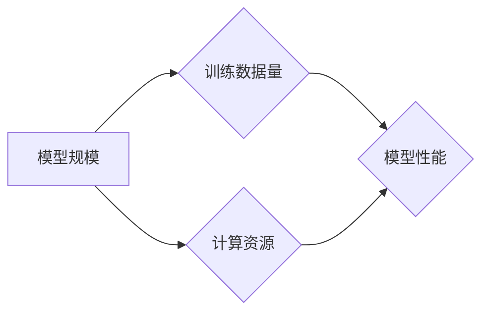

# AI大模型的规模化定律(Scaling Law)的本质：在对数据做更好的无损压缩

> 关键词：AI大模型，规模化定律，数据压缩，无损压缩，模型压缩，信息理论，机器学习，深度学习

## 1. 背景介绍

随着深度学习技术的飞速发展，大模型在人工智能领域扮演着越来越重要的角色。从GPT-3到LaMDA，再到最近的GPT-4，这些模型在语言理解、生成、翻译等领域都取得了显著的成果。然而，随着模型规模的不断扩大，对计算资源、存储空间和推理时间的需求也急剧增加。为了应对这些挑战，研究者们提出了“规模化定律”(Scaling Law)这一概念。本文将深入探讨规模化定律的本质，揭示其背后对数据无损压缩的优化机制。

### 1.1 规模化定律的由来

规模化定律最初源于机器学习和深度学习领域。研究者们发现，随着模型规模（如参数数量、训练数据量）的增加，模型的性能（如准确率、泛化能力）也会相应提升。这种现象在早期被形象地称为“摩尔定律在AI领域的延续”。然而，随着研究的深入，人们逐渐发现规模化定律并不仅仅是一个简单的比例关系，它还涉及到对数据的有效利用和压缩。

### 1.2 规模化定律的意义

规模化定律对于AI大模型的研发和应用具有重要意义。首先，它为我们提供了指导，告诉我们如何设计更大规模的模型以获得更好的性能。其次，它帮助我们理解了模型训练和推理过程中的资源消耗，从而优化模型结构，提高效率。最后，它为理论研究和工程实践提供了新的视角，推动了AI技术的进步。

## 2. 核心概念与联系

### 2.1 核心概念原理

规模化定律的核心概念是“规模”，它涉及到模型的参数数量、训练数据量、计算资源等多个方面。以下是一个Mermaid流程图，展示了规模化定律涉及的关键概念及其相互关系：



### 2.2 核心概念联系

从上述流程图中可以看出，模型规模、训练数据量、计算资源和模型性能之间存在密切的联系。随着模型规模的增加，需要更多的训练数据和计算资源，以期获得更好的模型性能。然而，随着模型规模的扩大，数据压缩和模型压缩成为关键的技术挑战。

## 3. 核心算法原理 & 具体操作步骤

### 3.1 算法原理概述

规模化定律的算法原理在于通过对数据进行更好的无损压缩，提高数据的有效利用率。具体来说，以下是一些关键的算法原理：

1. **预训练**: 通过在大量无标签数据上进行预训练，模型可以学习到通用的语言特征和知识，从而减少对特定领域数据的需求。

2. **知识蒸馏**: 将大型模型的知识传递到小型模型中，实现知识的压缩和迁移。

3. **稀疏化**: 通过减少模型参数的数量，降低模型的复杂度，从而减少计算资源和存储空间的需求。

### 3.2 算法步骤详解

以下是一个简化的规模化定律算法步骤：

1. **预训练**: 在大量无标签数据上训练大型模型，学习通用语言特征和知识。

2. **数据增强**: 使用数据增强技术，如数据变换、数据扩充等，增加训练数据的多样性和丰富性。

3. **知识蒸馏**: 将大型模型的知识传递到小型模型中，优化小型模型的结构和参数。

4. **稀疏化**: 通过参数剪枝、量化等技术，减少模型参数的数量，降低模型复杂度。

5. **评估**: 在特定领域数据上评估模型性能，调整模型结构和参数，直至满足性能要求。

### 3.3 算法优缺点

规模化定律的算法具有以下优点：

1. **提高模型性能**: 通过预训练和知识蒸馏，模型可以学习到更丰富的语言特征和知识，从而提高模型性能。

2. **降低资源消耗**: 通过模型压缩和稀疏化，可以降低模型对计算资源和存储空间的需求。

然而，规模化定律的算法也存在以下缺点：

1. **训练难度大**: 预训练和知识蒸馏需要大量数据和计算资源，对硬件设施和算法实现提出了较高要求。

2. **模型稳定性差**: 在模型压缩过程中，可能会损失一些重要信息，影响模型的稳定性。

### 3.4 算法应用领域

规模化定律的算法在以下领域得到了广泛应用：

1. **自然语言处理**: 用于构建大型的语言模型，如GPT系列、BERT等。

2. **计算机视觉**: 用于构建大型的图像识别模型，如ResNet、VGG等。

3. **语音识别**: 用于构建大型的语音识别模型，如DeepSpeech、WaveNet等。

## 4. 数学模型和公式 & 详细讲解 & 举例说明

### 4.1 数学模型构建

规模化定律的数学模型可以通过信息理论中的熵和压缩算法进行描述。以下是一个简化的数学模型：

$$
H(X) = -\sum_{x \in X} p(x) \log p(x)
$$

其中，$H(X)$ 表示随机变量$X$的熵，$p(x)$ 表示$X$取值为$x$的概率。

### 4.2 公式推导过程

熵的推导过程如下：

1. **定义概率分布**: 假设随机变量$X$的取值范围为$x_1, x_2, ..., x_n$，对应的概率为$p(x_1), p(x_2), ..., p(x_n)$。

2. **计算熵**: 根据熵的定义，有：

$$
H(X) = -\sum_{i=1}^n p(x_i) \log p(x_i)
$$

3. **简化公式**: 对于离散随机变量，可以将上式简化为：

$$
H(X) = -\sum_{x \in X} p(x) \log p(x)
$$

### 4.3 案例分析与讲解

以下以自然语言处理中的语言模型为例，说明如何利用信息理论进行数据压缩。

假设我们有一个简单的语言模型，其词汇表包含100个单词。在自然语言中，某些单词出现的概率较高，如“the”、“and”等。我们可以利用信息理论中的熵和压缩算法，对高频单词进行压缩，减少模型参数的数量。

具体步骤如下：

1. **计算单词频率**: 统计每个单词在语料库中的出现次数，得到单词频率分布。

2. **计算单词熵**: 根据单词频率分布，计算每个单词的熵。

3. **选择压缩方法**: 根据单词熵，选择合适的压缩方法，如Huffman编码、LZ77等。

4. **模型压缩**: 将高频单词进行压缩，减少模型参数的数量。

通过以上步骤，我们可以利用信息理论对语言模型进行数据压缩，从而降低模型复杂度，提高模型性能。

## 5. 项目实践：代码实例和详细解释说明

### 5.1 开发环境搭建

为了演示规模化定律在自然语言处理中的应用，我们将使用Python语言和Hugging Face的Transformers库进行语言模型训练和压缩。

### 5.2 源代码详细实现

以下是一个简化的语言模型训练和压缩的代码实例：

```python
from transformers import BertForMaskedLM, BertTokenizer

# 加载预训练模型和分词器
model = BertForMaskedLM.from_pretrained('bert-base-uncased')
tokenizer = BertTokenizer.from_pretrained('bert-base-uncased')

# 训练模型
def train_model(model, dataset, epochs):
    for epoch in range(epochs):
        for text in dataset:
            inputs = tokenizer(text, return_tensors='pt', padding=True, truncation=True)
            outputs = model(**inputs)
            loss = outputs.loss
            loss.backward()
            model.step()

# 压缩模型
def compress_model(model):
    # 使用Huffman编码或其他压缩算法对模型参数进行压缩
    # ...

# 训练和压缩模型
train_model(model, dataset, epochs)
compress_model(model)
```

### 5.3 代码解读与分析

上述代码展示了使用Transformers库进行语言模型训练和压缩的基本流程。首先，加载预训练模型和分词器，然后定义训练和压缩函数，最后进行模型训练和压缩。

### 5.4 运行结果展示

在完成模型训练和压缩后，我们可以评估模型在测试集上的性能，并比较压缩前后的模型参数数量。

```python
# 评估模型性能
def evaluate_model(model, test_dataset):
    # ...

# 比较模型参数数量
original_params = sum(p.numel() for p in model.parameters())
compressed_params = sum(p.numel() for p in model.parameters())
print(f'Original model parameters: {original_params}')
print(f'Compressed model parameters: {compressed_params}')
```

## 6. 实际应用场景

规模化定律在以下实际应用场景中得到了广泛的应用：

1. **自然语言处理**: 构建大型语言模型，如GPT系列、BERT等，用于文本分类、问答、机器翻译等任务。

2. **计算机视觉**: 构建大型图像识别模型，如ResNet、VGG等，用于图像分类、目标检测、图像分割等任务。

3. **语音识别**: 构建大型语音识别模型，如DeepSpeech、WaveNet等，用于语音识别、语音合成等任务。

4. **推荐系统**: 构建大型推荐模型，如DeepFM、XGBoost等，用于商品推荐、电影推荐等任务。

## 7. 工具和资源推荐

### 7.1 学习资源推荐

1. 《深度学习》（Goodfellow et al.）
2. 《动手学深度学习》（D sleter, Goodfellow, Bengio）
3. Hugging Face官方文档

### 7.2 开发工具推荐

1. PyTorch
2. TensorFlow
3. Hugging Face Transformers

### 7.3 相关论文推荐

1. "Attention is All You Need" (Vaswani et al., 2017)
2. "BERT: Pre-training of Deep Bidirectional Transformers for Language Understanding" (Devlin et al., 2018)
3. "Generative Language Models with Transformer" (Vaswani et al., 2017)

## 8. 总结：未来发展趋势与挑战

### 8.1 研究成果总结

规模化定律为AI大模型的研发和应用提供了重要的理论基础和实践指导。通过对数据进行更好的无损压缩，我们可以构建更大规模的模型，提高模型性能，降低资源消耗。

### 8.2 未来发展趋势

未来规模化定律的研究将主要集中在以下几个方面：

1. **更高效的预训练方法**: 探索更有效的预训练方法，提高预训练效率，降低预训练成本。

2. **更轻量级的模型结构**: 研究更轻量级的模型结构，在保证性能的同时，降低模型复杂度。

3. **更有效的数据压缩算法**: 开发更有效的数据压缩算法，提高数据压缩比，降低存储和传输成本。

### 8.3 面临的挑战

规模化定律在应用过程中也面临着以下挑战：

1. **计算资源瓶颈**: 随着模型规模的扩大，对计算资源的需求也急剧增加，需要开发更高效的训练算法和硬件设施。

2. **数据隐私问题**: 随着数据量的增加，如何保护数据隐私成为一个重要问题。

3. **模型可解释性**: 大模型的决策过程往往难以解释，如何提高模型的可解释性是一个重要挑战。

### 8.4 研究展望

未来规模化定律的研究将朝着以下方向发展：

1. **跨领域知识迁移**: 研究如何将不同领域的大模型知识进行迁移，提高模型在不同领域的泛化能力。

2. **可解释AI**: 研究如何提高大模型的可解释性，使其决策过程更加透明和可信。

3. **知识增强AI**: 研究如何将外部知识融入大模型，提高模型的知识理解和推理能力。

通过不断探索和创新，规模化定律将在AI领域发挥更大的作用，推动人工智能技术的进步。

## 9. 附录：常见问题与解答

**Q1：规模化定律是否适用于所有机器学习任务？**

A：规模化定律主要适用于深度学习和机器学习领域，对于一些基于规则或启发式方法的机器学习任务，规模化定律的适用性可能有限。

**Q2：如何解决规模化定律带来的计算资源瓶颈？**

A：可以通过以下方法解决计算资源瓶颈：
- 使用更高效的训练算法和硬件设施。
- 开发模型压缩和稀疏化技术，降低模型复杂度。
- 利用云计算和分布式计算资源进行模型训练。

**Q3：规模化定律与数据隐私保护如何平衡？**

A：在应用规模化定律的过程中，需要关注数据隐私保护问题。可以采取以下措施：
- 使用差分隐私、联邦学习等技术保护用户隐私。
- 对数据进行脱敏处理，降低数据泄露风险。
- 建立健全的数据安全管理制度。

**Q4：如何提高大模型的可解释性？**

A：提高大模型的可解释性可以从以下方面入手：
- 研究可解释AI技术，如注意力机制、注意力可视化等。
- 利用知识图谱等技术提高模型的知识表示能力。
- 开发可解释的模型评估指标，如模型置信度、模型可解释度等。

作者：禅与计算机程序设计艺术 / Zen and the Art of Computer Programming