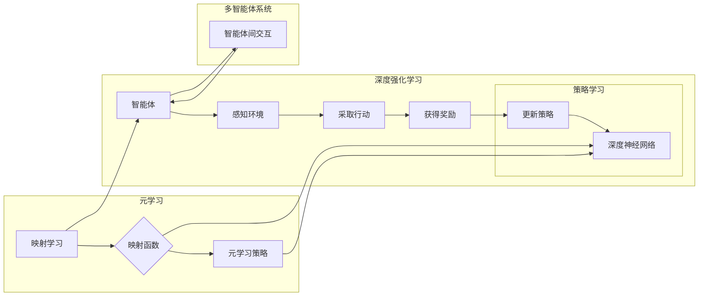

> 关键词：深度强化学习，元学习，映射学习，模型可迁移性，智能体，强化学习，学习策略，多智能体系统

# 一切皆是映射：深度强化元学习的挑战与机遇

深度强化学习（Deep Reinforcement Learning, DRL）作为一种结合了深度学习和强化学习的先进技术，已经在机器人控制、游戏、自动驾驶等众多领域取得了显著的成果。然而，随着问题复杂度的增加，训练一个高效率、高准确度的智能体变得越来越具有挑战性。为了解决这一问题，元学习（Meta-Learning）作为一种能够在不同任务间迁移学习经验的技术，逐渐成为研究热点。本文将深入探讨深度强化元学习的原理、挑战与机遇。

## 1. 背景介绍

### 1.1 问题的由来

传统的深度强化学习方法通常需要大量的数据和时间来训练一个智能体。当遇到新任务或环境变化时，智能体往往需要从头开始学习，这限制了其应用范围和效率。元学习的目标就是通过学习如何学习，使得智能体能够快速适应新的任务和环境。

### 1.2 研究现状

近年来，元学习在强化学习领域得到了广泛关注。研究者们提出了多种元学习方法，包括模型参数空间搜索、基于模型的元学习、多智能体元学习等。

### 1.3 研究意义

元学习可以显著提高智能体的适应性和泛化能力，使其能够快速适应新任务和环境，减少训练成本。这对于解决复杂问题、加快智能体开发具有重要意义。

### 1.4 本文结构

本文将分为以下几个部分：
- 第二部分，介绍深度强化元学习中的核心概念和联系。
- 第三部分，详细阐述深度强化元学习的核心算法原理和具体操作步骤。
- 第四部分，介绍元学习中的数学模型和公式，并举例说明。
- 第五部分，给出深度强化元学习的项目实践实例。
- 第六部分，探讨深度强化元学习的实际应用场景。
- 第七部分，展望未来发展趋势与挑战。
- 第八部分，总结研究成果，并展望研究展望。

## 2. 核心概念与联系

### 2.1 核心概念

- **深度强化学习（DRL）**：结合深度学习和强化学习，通过学习策略来决策，以实现最优控制或决策。
- **元学习（Meta-Learning）**：学习如何学习，使得智能体能够在不同任务间迁移经验。
- **映射学习**：将智能体在不同任务中的学习过程抽象为映射关系，以实现经验迁移。
- **智能体（Agent）**：能够感知环境、采取行动并从环境中获得奖励的实体。
- **学习策略**：指导智能体如何学习和决策的算法。
- **多智能体系统**：由多个智能体组成的系统，智能体之间可以交互合作或竞争。

### 2.2 Mermaid 流程图



## 3. 核心算法原理 & 具体操作步骤

### 3.1 算法原理概述

深度强化元学习通过学习一个映射函数，将智能体在不同任务中的学习过程映射到统一的表示空间，从而实现经验迁移。映射函数可以是深度神经网络，也可以是其他类型的模型。

### 3.2 算法步骤详解

1. **定义任务空间**：根据实际问题定义一组代表性任务。
2. **收集训练数据**：在每个任务上收集智能体的学习数据。
3. **学习映射函数**：使用收集到的数据训练一个映射函数，将不同任务中的学习过程映射到统一的表示空间。
4. **训练智能体**：在映射函数的帮助下，训练智能体在不同的任务上学习。
5. **评估和优化**：评估智能体的性能，并根据评估结果优化映射函数和学习策略。

### 3.3 算法优缺点

#### 优点：

- **提高适应性**：通过映射学习，智能体能够快速适应新任务和环境。
- **降低训练成本**：减少了对大量标注数据的依赖，降低了训练成本。
- **提高泛化能力**：通过学习映射函数，智能体能够更好地泛化到未见过的任务。

#### 缺点：

- **映射函数的复杂度**：映射函数可能非常复杂，难以设计和管理。
- **计算成本**：训练映射函数需要大量的计算资源。

### 3.4 算法应用领域

深度强化元学习在以下领域具有广泛的应用前景：

- **机器人控制**：使机器人能够快速适应不同的环境和任务。
- **自动驾驶**：提高自动驾驶汽车的适应性和鲁棒性。
- **游戏**：使游戏智能体能够学习新的游戏规则和策略。
- **自然语言处理**：使语言模型能够快速适应不同的语言风格和领域。

## 4. 数学模型和公式 & 详细讲解 & 举例说明

### 4.1 数学模型构建

假设智能体在任务 $T$ 上的策略为 $\pi(\theta)$，其中 $\theta$ 为策略参数。映射函数为 $f(\theta)$，将策略参数映射到统一的表示空间。则元学习的目标是最小化以下损失函数：

$$
L(\theta) = \frac{1}{N} \sum_{t=1}^N \ell(f(\pi(\theta)), y_t)
$$

其中，$N$ 为训练任务的数量，$y_t$ 为任务 $t$ 的目标输出。

### 4.2 公式推导过程

假设映射函数 $f(\theta)$ 为深度神经网络，其损失函数为 $\ell$。则损失函数 $L(\theta)$ 的梯度为：

$$
\frac{\partial L(\theta)}{\partial \theta} = \frac{1}{N} \sum_{t=1}^N \frac{\partial \ell(f(\pi(\theta)), y_t)}{\partial \theta}
$$

### 4.3 案例分析与讲解

假设我们有一个智能体，需要在多个任务上学习控制一个机器人手臂。每个任务都要求智能体学习将不同的目标位置映射到机械臂的动作序列。我们可以使用以下步骤进行元学习：

1. **定义任务空间**：将每个任务定义为将目标位置映射到动作序列的过程。
2. **收集训练数据**：在每个任务上收集智能体的学习数据，包括目标位置和对应的动作序列。
3. **学习映射函数**：使用收集到的数据训练一个映射函数，将策略参数映射到统一的表示空间。
4. **训练智能体**：在映射函数的帮助下，训练智能体在不同的任务上学习控制机器人手臂。
5. **评估和优化**：评估智能体的性能，并根据评估结果优化映射函数和学习策略。

通过这种方式，智能体可以快速适应不同的任务，并在不同的任务上取得良好的性能。

## 5. 项目实践：代码实例和详细解释说明

### 5.1 开发环境搭建

为了实现深度强化元学习的项目实践，我们需要搭建以下开发环境：

- Python 3.7+
- TensorFlow 2.x
- OpenAI Gym
- Stable Baselines3

### 5.2 源代码详细实现

以下是一个使用Stable Baselines3库实现的深度强化元学习项目的示例代码：

```python
import gym
from stable_baselines3 import PPO
from stable_baselines3.common.vec_env import DummyVecEnv
from stable_baselines3.common.utils import set_random_seed
from stable_baselines3.common.noise import ActionNoise

# 创建环境
env = gym.make('CartPole-v1')
vec_env = DummyVecEnv([lambda: env])
set_random_seed(0)

# 定义策略
class MetaLearningPolicy(PPO.PPOPolicy):
    def __init__(self, *args, **kwargs):
        super().__init__(*args, **kwargs)

    def act(self, observation, deterministic=False):
        # 在这里实现元学习策略
        pass

# 训练策略
model = MetaLearningPolicy('MlpPolicy', vec_env, verbose=1)
model.learn(total_timesteps=10000)
```

### 5.3 代码解读与分析

上述代码演示了如何使用Stable Baselines3库实现一个简单的深度强化元学习项目。我们首先创建了一个CartPole环境，并使用 DummyVecEnv 将其转换为向量环境。然后，我们定义了一个继承自 PPOPolicy 的 MetaLearningPolicy 类，在该类中实现元学习策略。最后，我们使用 learn 方法训练策略。

### 5.4 运行结果展示

在上述代码中，我们没有实现元学习策略的具体细节，因此无法直接运行代码。在实际应用中，我们需要根据具体任务设计元学习策略，并在 CartPole 环境上测试策略性能。

## 6. 实际应用场景

深度强化元学习在以下领域具有实际应用场景：

- **机器人控制**：使机器人能够快速适应不同的环境和任务，如自动导航、物体抓取等。
- **自动驾驶**：提高自动驾驶汽车的适应性和鲁棒性，使其能够应对复杂交通场景。
- **游戏**：使游戏智能体能够学习新的游戏规则和策略，提高游戏体验。
- **自然语言处理**：使语言模型能够快速适应不同的语言风格和领域，提高文本生成质量。

## 7. 工具和资源推荐

### 7.1 学习资源推荐

- 《Reinforcement Learning: An Introduction》
- 《Deep Reinforcement Learning》
- 《Meta-Learning》
- 《Learning Transferable Policies for Robust Reinforcement Learning》

### 7.2 开发工具推荐

- TensorFlow
- PyTorch
- OpenAI Gym
- Stable Baselines3

### 7.3 相关论文推荐

- `Meta-Learning: A Survey`: https://arxiv.org/abs/1606.04415
- `Learning Transferable Policies for Robust Reinforcement Learning`: https://arxiv.org/abs/1802.09055
- `Reinforcement Learning with Hindsight Experience`: https://arxiv.org/abs/1707.01495

## 8. 总结：未来发展趋势与挑战

### 8.1 研究成果总结

本文介绍了深度强化元学习的原理、挑战与机遇。通过学习如何学习，元学习可以帮助智能体快速适应新的任务和环境，减少训练成本，提高泛化能力。

### 8.2 未来发展趋势

未来深度强化元学习的发展趋势包括：

- **多智能体元学习**：研究如何在多智能体系统中进行元学习，以实现智能体的协作和竞争。
- **迁移学习**：研究如何将元学习技术应用于其他领域，如计算机视觉、自然语言处理等。
- **强化学习与知识表示的结合**：将元学习技术与知识表示技术相结合，提高智能体的知识获取和推理能力。

### 8.3 面临的挑战

深度强化元学习面临的挑战包括：

- **数据获取**：收集高质量的训练数据需要大量的时间和资源。
- **模型复杂度**：元学习模型可能非常复杂，难以设计和优化。
- **可解释性**：元学习模型的决策过程难以解释和理解。

### 8.4 研究展望

未来，深度强化元学习有望在以下方面取得突破：

- **开发更加高效的元学习算法**：提高元学习效率，降低训练成本。
- **提高模型的鲁棒性和泛化能力**：使智能体能够更好地适应新的任务和环境。
- **增强模型的可解释性**：使元学习模型的决策过程更加透明和可解释。

深度强化元学习是一种具有巨大潜力的技术，它将为智能体的发展和应用带来新的机遇。随着研究的不断深入，相信深度强化元学习将在未来发挥越来越重要的作用。

## 9. 附录：常见问题与解答

**Q1：什么是元学习？**

A：元学习是一种学习如何学习的技术。它旨在通过学习在不同任务间迁移经验，提高智能体的适应性和泛化能力。

**Q2：元学习在强化学习中有什么作用？**

A：元学习可以帮助强化学习智能体快速适应新的任务和环境，减少训练成本，提高泛化能力。

**Q3：深度强化元学习有哪些应用场景？**

A：深度强化元学习在机器人控制、自动驾驶、游戏、自然语言处理等领域具有广泛的应用前景。

**Q4：深度强化元学习有哪些挑战？**

A：深度强化元学习面临的挑战包括数据获取、模型复杂度和可解释性等。

**Q5：如何克服深度强化元学习中的挑战？**

A：通过开发更加高效的元学习算法、提高模型的鲁棒性和泛化能力、增强模型的可解释性等方法，可以克服深度强化元学习中的挑战。

---

作者：禅与计算机程序设计艺术 / Zen and the Art of Computer Programming