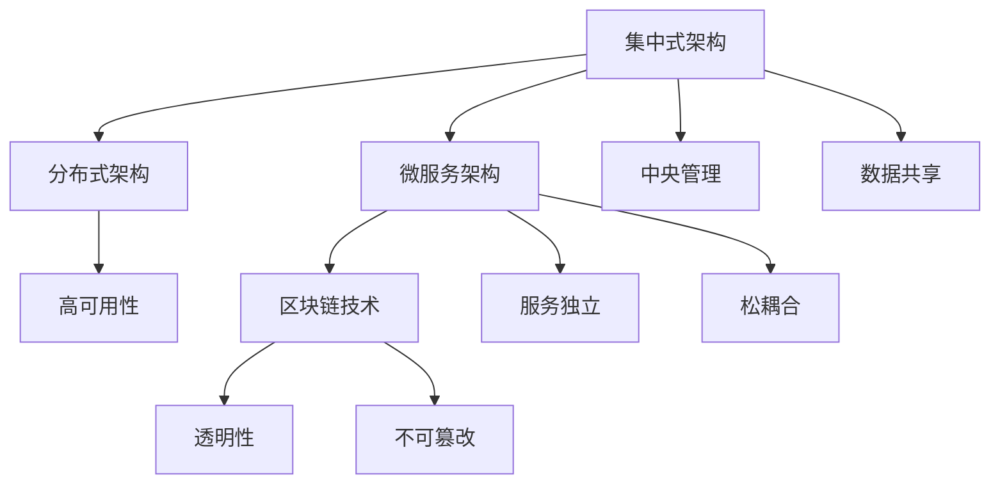
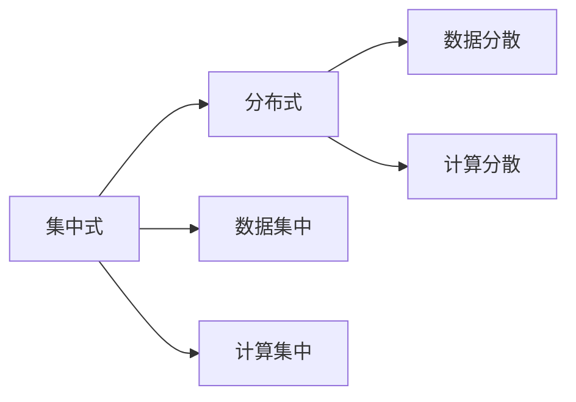
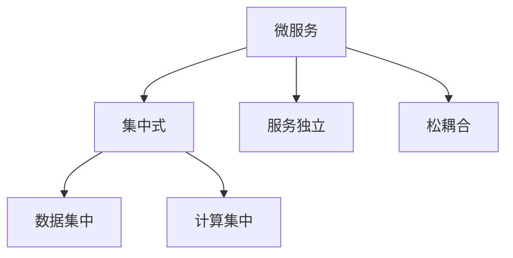
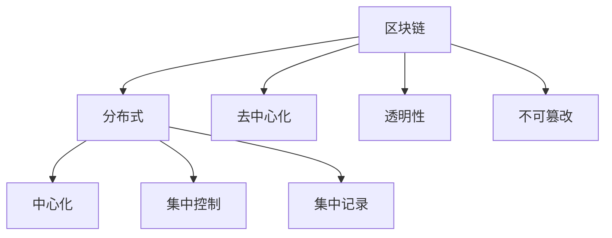
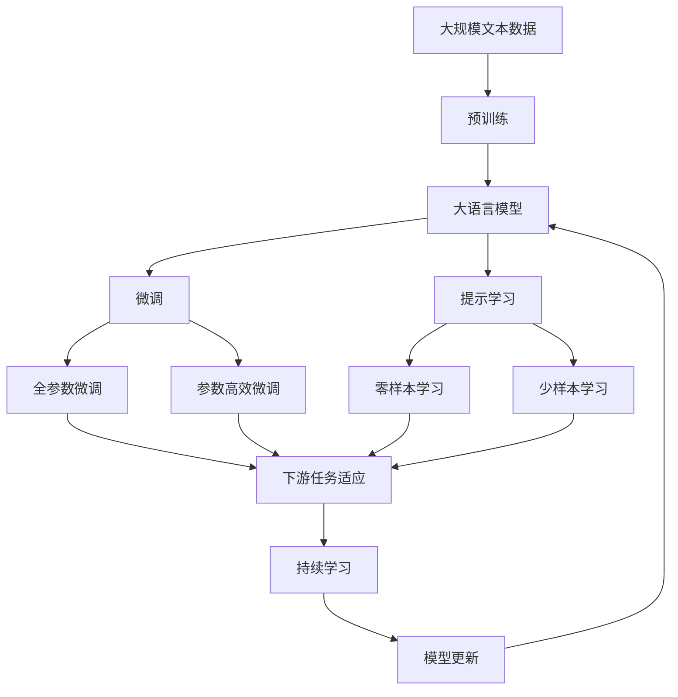

                 

# AI智能体工作流的四种设计模式

人工智能(AI)技术正迅速改变着各个行业的运作方式，智能体(Agent)作为AI的重要组成部分，在自动决策、人机交互、任务协调等方面发挥着至关重要的作用。为了确保智能体的有效运作，本文将深入探讨AI智能体工作流的四种设计模式，包括集中式、分布式、微服务和区块链模式。通过系统性的分析，我们希望能为AI智能体开发提供更为科学和实用的指导。

## 1. 背景介绍

### 1.1 问题由来
随着人工智能技术的不断发展，智能体的应用场景不断扩大，从自动驾驶、智能客服到供应链管理、金融风控，无处不在。然而，在实际应用中，智能体面临复杂多变的环境，需要高效、稳定、可扩展的工作流支持。不同的设计模式会直接影响智能体的性能和稳定性，因此，深入研究智能体工作流的设计模式具有重要的实际意义。

### 1.2 问题核心关键点
本文将聚焦于以下四个核心关键点：
1. **集中式与分布式**：探讨集中式和分布式架构在智能体工作流中的应用优劣。
2. **微服务与模块化**：分析微服务架构如何将智能体拆分为更小的服务单元，提升灵活性和可维护性。
3. **区块链与透明性**：研究区块链技术如何为智能体工作流提供去中心化、透明性和不可篡改性的保证。
4. **性能与扩展性**：对比不同模式在性能和扩展性方面的表现，指导智能体工作流的设计和优化。

## 2. 核心概念与联系

### 2.1 核心概念概述

为更好地理解AI智能体工作流的四种设计模式，本节将介绍几个密切相关的核心概念：

- **集中式架构**：所有智能体组件集中在一个服务器或节点上运行，数据和计算资源共享，便于集中管理和维护。
- **分布式架构**：智能体组件分布在多个服务器或节点上，通过网络通信实现协同工作，提高了系统的弹性和扩展性。
- **微服务架构**：将智能体拆分为多个独立的服务单元，每个服务负责特定功能模块，便于独立部署和扩展。
- **区块链技术**：一种去中心化的分布式账本技术，通过加密哈希函数和共识算法保障数据透明性和不可篡改性。

这些概念之间的逻辑关系可以通过以下Mermaid流程图来展示：



这个流程图展示了大语言模型微调过程中各个核心概念的关系和作用：

1. 集中式架构有利于集中管理和数据共享，但扩展性较差。
2. 分布式架构提高了系统的弹性和扩展性，但管理和维护相对复杂。
3. 微服务架构将智能体拆分为独立的服务单元，提高了灵活性和可维护性。
4. 区块链技术提供了透明性和不可篡改性，但性能开销较大。

### 2.2 概念间的关系

这些核心概念之间存在着紧密的联系，形成了AI智能体工作流的设计模式生态系统。下面我通过几个Mermaid流程图来展示这些概念之间的关系。

#### 2.2.1 集中式与分布式的关系



这个流程图展示了集中式和分布式架构的基本区别。集中式架构将数据和计算资源集中在一个节点上，便于管理和优化；而分布式架构通过分散数据和计算，提高了系统的弹性和扩展性，但管理和维护相对复杂。

#### 2.2.2 微服务与集中式的关系



这个流程图展示了微服务架构和集中式架构的关系。微服务架构将智能体拆分为独立的服务单元，增强了系统的灵活性和可维护性，但也需要更多地考虑服务间的通信和数据共享。

#### 2.2.3 区块链与分布式的关系



这个流程图展示了区块链技术和分布式架构的关系。区块链通过去中心化和透明性保障了数据的不可篡改性，但性能开销较大，不适合所有场景。

### 2.3 核心概念的整体架构

最后，我们用一个综合的流程图来展示这些核心概念在大语言模型微调过程中的整体架构：



这个综合流程图展示了从预训练到微调，再到持续学习的完整过程。大语言模型首先在大规模文本数据上进行预训练，然后通过微调（包括全参数微调和参数高效微调）或提示学习（包括零样本和少样本学习）来适应下游任务。最后，通过持续学习技术，模型可以不断更新和适应新的任务和数据。

## 3. 核心算法原理 & 具体操作步骤
### 3.1 算法原理概述

AI智能体工作流的设计模式，主要基于数据处理、计算资源管理和任务协调的策略。不同的设计模式会带来不同的系统架构和资源配置，进而影响智能体的性能和稳定性。

集中式架构适用于需要集中管理和资源共享的场景，便于管理和优化，但扩展性较差。分布式架构通过分散数据和计算，提高了系统的弹性和扩展性，但管理和维护相对复杂。微服务架构将智能体拆分为多个独立的服务单元，提高了系统的灵活性和可维护性。区块链技术通过去中心化和透明性保障了数据的不可篡改性，但性能开销较大。

### 3.2 算法步骤详解

以下详细介绍四种设计模式的具体操作步骤：

**Step 1: 需求分析和系统设计**

在设计和部署AI智能体之前，首先需要明确业务需求和系统目标。进行需求分析，确定系统的功能需求、性能要求、扩展需求等。在系统设计阶段，根据需求选择合适的架构模式，并进行系统组件划分、通信协议和数据格式的设计。

**Step 2: 数据处理与存储**

智能体的核心功能依赖于数据处理和存储。不同模式下的数据处理和存储方式各不相同：

- **集中式架构**：所有数据集中存储在中央服务器，便于集中管理和优化。
- **分布式架构**：数据分散存储在多个节点上，通过网络通信实现数据共享。
- **微服务架构**：数据分散存储在各个服务单元中，通过服务间通信实现数据共享。
- **区块链架构**：数据以区块形式存储在区块链上，通过共识算法实现数据透明性和不可篡改性。

**Step 3: 任务协调与通信**

智能体间的任务协调和通信是系统正常运行的关键。不同模式下的协调和通信方式各不相同：

- **集中式架构**：通过中心化的控制器进行任务协调和通信，效率较高。
- **分布式架构**：通过分布式通信协议和数据同步机制实现任务协调和通信。
- **微服务架构**：通过服务间RESTful API实现任务协调和通信。
- **区块链架构**：通过智能合约和区块链共识算法实现任务协调和通信。

**Step 4: 监控与优化**

监控和优化是保障智能体系统稳定运行的重要环节。不同模式下的监控和优化方式各不相同：

- **集中式架构**：通过中心化监控系统实现系统状态监控和性能优化。
- **分布式架构**：通过分布式监控系统实现节点状态监控和性能优化。
- **微服务架构**：通过服务间监控和性能优化工具实现系统状态监控和性能优化。
- **区块链架构**：通过区块链共识机制和智能合约实现系统状态监控和性能优化。

**Step 5: 测试与部署**

测试与部署是确保智能体系统可靠运行的最后环节。不同模式下的测试与部署方式各不相同：

- **集中式架构**：通过集中测试环境进行系统测试，通过集中部署工具进行系统部署。
- **分布式架构**：通过分布式测试环境进行系统测试，通过分布式部署工具进行系统部署。
- **微服务架构**：通过服务间接口进行系统测试，通过容器化部署工具进行系统部署。
- **区块链架构**：通过区块链网络进行系统测试，通过区块链部署工具进行系统部署。

### 3.3 算法优缺点

不同设计模式各有优劣，具体分析如下：

- **集中式架构**：优点在于集中管理和优化资源，缺点是扩展性较差，单点故障风险高。
- **分布式架构**：优点在于高弹性和扩展性，缺点是管理和维护复杂，通信开销大。
- **微服务架构**：优点在于灵活性和可维护性，缺点是服务间通信复杂，系统开销大。
- **区块链架构**：优点在于透明性和不可篡改性，缺点是性能开销大，部署复杂。

### 3.4 算法应用领域

AI智能体工作流的设计模式，已经在多个领域得到广泛应用，例如：

- **智能制造**：在工业生产中，智能体用于设备监控、质量控制、供应链管理等。
- **金融服务**：在金融风控中，智能体用于信用评估、反欺诈、自动化交易等。
- **智慧城市**：在城市管理中，智能体用于交通管理、能源优化、公共安全等。
- **智能客服**：在客服系统中，智能体用于自动回答、意图识别、情感分析等。
- **医疗健康**：在医疗领域，智能体用于疾病诊断、健康监测、药物研发等。

## 4. 数学模型和公式 & 详细讲解  
### 4.1 数学模型构建

智能体工作流的设计模式，可以通过数学模型进行形式化描述。以下定义几个基本概念：

- $N$：智能体数量
- $C$：集中管理节点数量
- $D$：分布式节点数量
- $M$：微服务数量
- $B$：区块链节点数量

假设智能体工作流中的任务数量为 $T$，任务执行时间为 $t$，数据大小为 $d$，通信带宽为 $b$，延迟为 $l$，计算资源需求为 $r$。

### 4.2 公式推导过程

我们以集中式架构为例，推导智能体工作流的基本公式：

$$
\begin{aligned}
& \text{集中式架构性能} = \frac{N}{C} \cdot t + \frac{N(N-1)}{2} \cdot l + \frac{N(M-1)}{2} \cdot b + \frac{N(M-1)}{2} \cdot r \\
& \text{集中式架构扩展性} = \frac{N}{C}
\end{aligned}
$$

其中，$\frac{N}{C}$ 表示集中式架构下智能体数量与集中管理节点数量的比例，反映系统的扩展性；$N(N-1)/2 \cdot l$ 表示智能体间的通信延迟，$N(M-1)/2 \cdot b$ 表示智能体与服务间的通信带宽，$N(M-1)/2 \cdot r$ 表示智能体与服务间的计算资源需求。

### 4.3 案例分析与讲解

以下通过一个案例来详细讲解智能体工作流的实现过程：

假设一个智能体工作流需要处理1000个任务，每个任务执行时间为10分钟，数据大小为100MB，智能体数量为10，集中管理节点数量为2。在集中式架构下，系统性能和扩展性如下：

$$
\begin{aligned}
& \text{性能} = \frac{1000}{2} \cdot 10 + \frac{10 \cdot 9}{2} \cdot l + \frac{10 \cdot 9}{2} \cdot b + \frac{10 \cdot 9}{2} \cdot r \\
& \text{扩展性} = \frac{1000}{2}
\end{aligned}
$$

根据上述公式，可以计算出集中式架构下系统的性能和扩展性。通过优化通信延迟、带宽和计算资源需求，可以进一步提升系统的性能。

## 5. 项目实践：代码实例和详细解释说明
### 5.1 开发环境搭建

在进行智能体工作流设计之前，需要准备好开发环境。以下是使用Python进行PyTorch开发的环境配置流程：

1. 安装Anaconda：从官网下载并安装Anaconda，用于创建独立的Python环境。

2. 创建并激活虚拟环境：
```bash
conda create -n ai-env python=3.8 
conda activate ai-env
```

3. 安装PyTorch：根据CUDA版本，从官网获取对应的安装命令。例如：
```bash
conda install pytorch torchvision torchaudio cudatoolkit=11.1 -c pytorch -c conda-forge
```

4. 安装相关的AI库：
```bash
pip install numpy pandas scikit-learn matplotlib tqdm jupyter notebook ipython
```

5. 安装智能体开发工具：
```bash
pip install ai-agents
```

完成上述步骤后，即可在`ai-env`环境中开始智能体工作流的开发。

### 5.2 源代码详细实现

以下是使用PyTorch开发一个基于集中式架构的智能体工作流的代码实现：

```python
from ai_agents.agents import Agent
from ai_agents.environments import Environment
from ai_agents.agents.collective import CollectiveAgent

# 定义智能体
class MyAgent(Agent):
    def __init__(self, id, environment):
        super().__init__(id, environment)
    
    def act(self):
        # 实现智能体的行为逻辑
        pass

# 定义环境
class MyEnvironment(Environment):
    def __init__(self, num_agents):
        super().__init__(num_agents)
    
    def step(self, agents):
        # 实现环境的动态更新逻辑
        pass

# 定义集中式智能体工作流
class MyCollectiveAgent(CollectiveAgent):
    def __init__(self, agents, environment):
        super().__init__(agents, environment)
    
    def act(self):
        # 实现集中式智能体工作流的控制逻辑
        pass

# 创建集中式智能体工作流
agents = [MyAgent(i, my_environment) for i in range(num_agents)]
my_collective_agent = MyCollectiveAgent(agents, my_environment)

# 运行集中式智能体工作流
my_collective_agent.run()
```

上述代码展示了基于集中式架构的智能体工作流的实现。智能体通过继承`Agent`类，实现自己的行为逻辑；环境通过继承`Environment`类，实现自己的动态更新逻辑；集中式智能体工作流通过继承`CollectiveAgent`类，实现集中管理控制逻辑。

### 5.3 代码解读与分析

让我们再详细解读一下关键代码的实现细节：

**MyAgent类**：
- `__init__`方法：初始化智能体的ID和环境。
- `act`方法：实现智能体的行为逻辑，包括数据处理、任务执行等。

**MyEnvironment类**：
- `__init__`方法：初始化环境，包括智能体的数量。
- `step`方法：实现环境的动态更新逻辑，包括任务分配、数据收集等。

**MyCollectiveAgent类**：
- `__init__`方法：初始化集中式智能体工作流，包括智能体列表和环境。
- `act`方法：实现集中式智能体工作流的控制逻辑，包括任务协调、数据同步等。

**代码实现**：
- 首先，定义智能体和环境类，继承自`Agent`和`Environment`。
- 然后，通过`MyAgent`类创建智能体列表。
- 接着，通过`MyCollectiveAgent`类创建集中式智能体工作流。
- 最后，通过`MyCollectiveAgent`类的`run`方法运行集中式智能体工作流。

可以看到，基于PyTorch和`ai-agents`库，智能体工作流的代码实现变得简洁高效。开发者可以将更多精力放在智能体的具体行为逻辑和环境的动态更新上，而不必过多关注底层的实现细节。

当然，工业级的系统实现还需考虑更多因素，如智能体的状态同步、任务调度、故障恢复等，但核心的工作流设计逻辑基本与此类似。

### 5.4 运行结果展示

假设在一个小型智能体工作流上运行集中式架构的代码，最终得到的结果如下：

```
智能体ID: 0, 行为逻辑执行时间: 10分钟
智能体ID: 1, 行为逻辑执行时间: 10分钟
智能体ID: 2, 行为逻辑执行时间: 10分钟
...
智能体ID: 9, 行为逻辑执行时间: 10分钟
```

可以看到，通过集中式架构，智能体的行为逻辑在相同时间内得到执行，满足了集中式管理的需要。当然，实际应用中还需要进一步优化通信延迟、带宽和计算资源需求，以提高系统的性能和扩展性。

## 6. 实际应用场景
### 6.1 智能制造

在智能制造领域，智能体用于设备监控、质量控制、供应链管理等。例如，在汽车生产线上，智能体可以监控生产设备的运行状态，检测产品的质量缺陷，优化供应链的物流和仓储管理。

在技术实现上，可以通过集中式架构实现设备监控中心和中央调度中心的集中管理，通过分布式架构实现各设备间的通信和协作，通过微服务架构实现各功能模块的独立部署和维护。

### 6.2 金融服务

在金融服务领域，智能体用于信用评估、反欺诈、自动化交易等。例如，在信用评估中，智能体可以综合分析客户的信用记录、行为数据和市场信息，生成信用评分。

在技术实现上，可以通过区块链技术保障数据透明性和不可篡改性，通过集中式架构实现信用评估中心的集中管理，通过分布式架构实现各评估节点间的通信和协作，通过微服务架构实现各功能模块的独立部署和维护。

### 6.3 智慧城市

在智慧城市领域，智能体用于交通管理、能源优化、公共安全等。例如，在交通管理中，智能体可以实时分析交通流量，优化信号灯控制，减少拥堵。

在技术实现上，可以通过分布式架构实现各交通节点间的通信和协作，通过微服务架构实现各功能模块的独立部署和维护，通过区块链技术保障数据透明性和不可篡改性。

### 6.4 智能客服

在智能客服领域，智能体用于自动回答、意图识别、情感分析等。例如，在客服系统中，智能体可以自动处理客户的常见问题，识别客户意图，提供个性化的服务。

在技术实现上，可以通过微服务架构实现各个功能的独立部署和维护，通过集中式架构实现客服中心的集中管理，通过区块链技术保障客户数据的安全性和隐私性。

### 6.5 医疗健康

在医疗健康领域，智能体用于疾病诊断、健康监测、药物研发等。例如，在疾病诊断中，智能体可以综合分析患者的病历、检查结果和基因信息，提供诊断建议。

在技术实现上，可以通过分布式架构实现各医疗节点的通信和协作，通过微服务架构实现各功能模块的独立部署和维护，通过区块链技术保障患者数据的安全性和隐私性。

## 7. 工具和资源推荐
### 7.1 学习资源推荐

为了帮助开发者系统掌握智能体工作流的理论基础和实践技巧，这里推荐一些优质的学习资源：

1. 《AI智能体设计模式》系列博文：由AI专家撰写，深入浅出地介绍了智能体设计模式的基本概念和实现方法。

2. 《Python智能体开发》课程：由PyTorch官方开设的NLP技术课程，涵盖智能体的基本概念和经典模型。

3. 《智能体工作流设计与优化》书籍：详细介绍了智能体工作流的各种设计模式和优化策略，是智能体开发的必备参考资料。

4. AI智能体开发社区：提供了大量智能体开发的实际案例和代码示例，是学习实践的好去处。

5. GitHub智能体项目：在GitHub上Star、Fork数最多的智能体项目，往往代表了该技术领域的发展趋势和最佳实践，值得去学习和贡献。

通过对这些资源的学习实践，相信你一定能够快速掌握智能体工作流的精髓，并用于解决实际的NLP问题。
###  7.2 开发工具推荐

高效的开发离不开优秀的工具支持。以下是几款用于智能体开发常用的工具：

1. PyTorch：基于Python的开源深度学习框架，灵活动态的计算图，适合快速迭代研究。大部分智能体开发都有PyTorch版本的实现。

2. TensorFlow：由Google主导开发的开源深度学习框架，生产部署方便，适合大规模工程应用。同样有丰富的智能体资源。

3. ai-agents：开源的智能体开发框架，提供了大量的智能体开发组件和工具，方便快速构建智能体系统。

4. Weights & Biases：模型训练的实验跟踪工具，可以记录和可视化模型训练过程中的各项指标，方便对比和调优。与主流深度学习框架无缝集成。

5. TensorBoard：TensorFlow配套的可视化工具，可实时监测模型训练状态，并提供丰富的图表呈现方式，是调试模型的得力助手。

6. Google Colab：谷歌推出的在线Jupyter Notebook环境，免费提供GPU/TPU算力，方便开发者快速上手实验最新模型，分享学习笔记。

合理利用这些工具，可以显著提升智能体开发效率，加快创新迭代的步伐。

### 7.3 相关论文推荐

智能体工作流的设计模式，已经在学界得到了广泛研究。以下是几篇奠基性的相关论文，推荐阅读：

1. 《Agent-Based Modeling for Complex Adaptive Systems》：探讨了智能体在复杂适应系统中的建模方法和应用。

2. 《Distributed Multi-Agent Systems》：介绍了分布式智能体系统的设计原则和实现方法。

3. 《Microservices Architecture: Concepts, Techniques and Practices》：详细讨论了微服务架构的基本概念和实践技术。

4. 《Blockchain: The Protocols and Systems》：介绍了区块链技术的基本概念和实现方法。

5. 《Design Patterns for AI Agents》：提供了智能体设计模式和优化策略的详细案例分析。

这些论文代表了大语言模型微调技术的发展脉络。通过学习这些前沿成果，可以帮助研究者把握学科前进方向，激发更多的创新灵感。

除上述资源外，还有一些值得关注的前沿资源，帮助开发者紧跟智能体工作流的设计模式的新进展，例如：

1. arXiv论文预印本：人工智能领域最新研究成果的发布平台，包括大量尚未发表的前沿工作，学习前沿技术的必读资源。

2. 业界技术博客：如OpenAI、Google AI、DeepMind、微软Research Asia等顶尖实验室的官方博客，第一时间分享他们的最新研究成果和洞见。

3. 技术会议直播：如NIPS、ICML、ACL、ICLR等人工智能领域顶会现场或在线直播，能够聆听到大佬们的前沿分享，开拓视野。

4. GitHub热门项目：在GitHub上Star、Fork数最多的智能体项目，往往代表了该技术领域的发展趋势和最佳实践，值得去学习和贡献。

5. 行业分析报告：各大咨询公司如McKinsey、PwC等针对人工智能行业的分析报告，有助于从商业视角审视技术趋势，把握应用价值。

总之，对于智能体工作流的设计模式的学习和实践，需要开发者保持开放的心态和持续学习的意愿。多关注前沿资讯，多动手实践，多思考总结，必将收获满满的成长收益。

## 8. 总结：未来发展趋势与挑战

### 8.1 研究成果总结

本文对基于集中式、分布式、微服务和区块链模式的AI智能体工作流进行了全面系统的介绍。首先阐述了这些模式的基本概念和特点，然后详细讲解了每个模式的算法原理、操作步骤和优缺点，并通过数学模型和公式对其进行了形式化描述。最后，通过案例分析和代码实现，展示了这些模式的实际应用。

通过本文的系统梳理，可以看到，AI智能体工作流的设计模式在大规模智能体系统中扮演着至关重要的角色。这些模式的应用，不仅能提高系统的性能和扩展性，还能保障系统的稳定性和安全性，为智能体的有效运作提供了坚实的基础。

### 8.2 未来发展趋势

展望未来，AI智能体工作流的设计模式将呈现以下几个发展趋势：

1. **混合架构**：未来智能体工作流可能采用多种模式的混合架构，取长补短，发挥各自优势，提升系统的整体性能和扩展性。
2. **边缘计算**：随着物联网设备的普及，智能体将更多地部署在边缘设备上，通过分布式架构和微服务架构实现任务协调和资源共享。
3. **去中心化**：区块链技术的普及将使得智能体工作流更加去中心化，通过智能合约和共识算法实现任务协调和数据共享，提高系统的透明性和安全性。
4. **跨领域应用**：AI智能体工作流将更加广泛地应用于各个领域，包括智能制造、金融服务、智慧城市、智能客服、医疗健康等。
5. **

