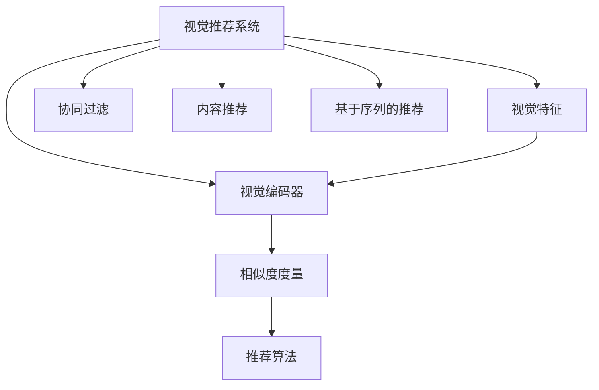
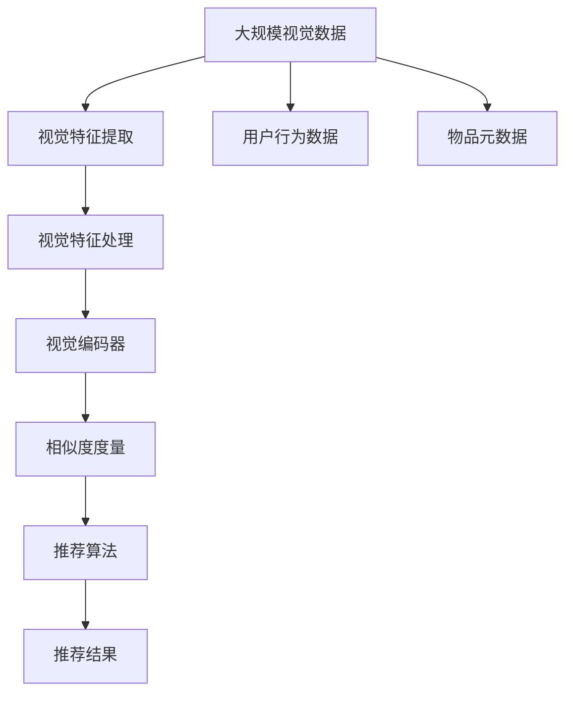

                 

## 1. 背景介绍

在数字时代，推荐系统已经成为互联网产品中不可或缺的核心功能。无论是电商平台、视频网站，还是社交网络，都通过推荐系统为用户提供个性化的内容和服务。然而，传统的基于协同过滤和内容推荐的系统，在面对海量用户和复杂多样化的需求时，常常无法提供满意的推荐效果。为此，一种新的推荐方式——视觉推荐系统应运而生。

### 1.1 问题由来

传统的推荐系统主要基于用户的评分、点击、浏览等行为数据，通过构建用户画像，计算物品相似度，生成推荐列表。然而，这种方式在处理数据稀疏、噪声高、需求多样等问题时，存在较大的局限性。为此，越来越多的研究者和公司开始探索利用视觉特征进行推荐，以提升推荐的精度和效果。

### 1.2 问题核心关键点

视觉推荐系统通过分析物品的视觉特征，挖掘物品间的潜在关联，进而生成个性化推荐。其核心优势包括：

- **鲁棒性**：视觉特征通常比文本特征更稳定，不容易受到数据噪声和异常值的影响。
- **多样性**：视觉特征能涵盖更广泛的信息，如物品的形状、颜色、纹理等，从而提供更多维度的推荐依据。
- **实时性**：视觉特征的处理速度较快，能够支持高频次的实时推荐。
- **跨域推荐**：视觉特征能够跨越文本的界限，进行跨领域的推荐，如视频推荐和商品推荐。

这些优势使得视觉推荐系统在应对各种推荐场景时，表现出更强的适应性和优越性。

## 2. 核心概念与联系

### 2.1 核心概念概述

为更好地理解视觉推荐系统的原理和架构，本节将介绍几个密切相关的核心概念：

- **视觉推荐系统**：基于物品的视觉特征进行推荐，通过构建视觉特征空间，挖掘物品间相似度，生成个性化推荐。
- **视觉特征**：包括颜色、形状、纹理等能够描述物品外观特征的视觉信号。
- **视觉编码器**：用于将视觉特征转换为向量表示，便于机器学习和模型训练。
- **相似度度量**：用于衡量物品间相似性的指标，如欧式距离、余弦相似度等。
- **推荐算法**：如协同过滤、内容推荐、基于序列的推荐等，在视觉推荐系统中，通常使用深度学习模型作为推荐引擎。

这些核心概念之间的逻辑关系可以通过以下Mermaid流程图来展示：



这个流程图展示了视觉推荐系统的核心架构：

1. 视觉推荐系统以物品的视觉特征为输入。
2. 视觉特征通过视觉编码器转换为向量表示。
3. 相似度度量用于衡量物品间的相似性。
4. 推荐算法利用相似度信息生成推荐结果。
5. 协同过滤、内容推荐和基于序列的推荐等不同算法可以结合使用，提高推荐效果。

### 2.2 概念间的关系

这些核心概念之间存在着紧密的联系，形成了视觉推荐系统的完整生态系统。下面是一些具体的合流程图来展示这些概念之间的关系。

#### 2.2.1 视觉特征的获取与处理


这个流程图展示了视觉特征获取与处理的主要步骤：

1. 通过摄像头、传感器等设备采集物品的视觉信号。
2. 对采集到的视觉信号进行预处理，如滤波、降噪等。
3. 将预处理后的视觉信号通过特征提取算法（如SIFT、HOG等）提取特征点。
4. 对提取的特征点进行编码，转化为向量表示。
5. 对向量进行归一化与降维处理，减少维度，提高处理效率。

#### 2.2.2 视觉编码器的构建


这个流程图展示了卷积神经网络（CNN）作为视觉编码器的构建过程：

1. 输入视觉特征，通过卷积层提取局部特征。
2. 使用池化层对特征进行下采样，减少维度。
3. 通过全连接层进行特征融合，得到高维向量表示。
4. 最后输出编码器的向量表示。

#### 2.2.3 相似度度量的选择


这个流程图展示了常见的相似度度量方法：

1. 欧式距离用于度量物品向量之间的欧几里得距离。
2. 余弦相似度用于度量物品向量之间的夹角余弦值。
3. 其他度量方法，如Jaccard相似度、Manhattan距离等，根据具体需求选择。

### 2.3 核心概念的整体架构

最后，我们用一个综合的流程图来展示这些核心概念在大规模视觉推荐系统中的整体架构：



这个综合流程图展示了从视觉数据到推荐结果的全过程：

1. 大规模视觉数据通过特征提取和处理，转化为视觉特征。
2. 视觉特征通过视觉编码器转换为向量表示。
3. 相似度度量用于衡量物品间的相似性。
4. 推荐算法利用相似度信息生成推荐结果。
5. 推荐结果结合用户行为数据和物品元数据，进行最终输出。

通过这些流程图，我们可以更清晰地理解视觉推荐系统的核心概念及其关系，为后续深入讨论具体的推荐方法和技术奠定基础。

## 3. 核心算法原理 & 具体操作步骤
### 3.1 算法原理概述

视觉推荐系统的核心算法原理基于以下三点：

1. **视觉特征提取与编码**：通过视觉编码器将视觉特征转换为向量表示。
2. **相似度度量与计算**：使用相似度度量方法衡量物品间的相似性。
3. **推荐算法与生成**：基于相似度信息，使用推荐算法生成个性化推荐。

具体而言，视觉推荐系统通过以下步骤实现推荐：

1. **特征提取与编码**：通过卷积神经网络（CNN）对视觉特征进行编码，得到高维向量表示。
2. **相似度计算**：使用余弦相似度等方法计算物品间的相似度。
3. **推荐生成**：结合用户行为数据和物品元数据，使用协同过滤、内容推荐等算法生成推荐结果。

### 3.2 算法步骤详解

#### 3.2.1 特征提取与编码

视觉推荐系统的第一步是特征提取与编码，具体步骤如下：

1. **数据采集与预处理**：通过摄像头、传感器等设备采集物品的视觉信号，并进行预处理，如滤波、降噪等。
2. **特征提取**：使用特征提取算法（如SIFT、HOG等）提取特征点。
3. **特征编码**：将提取的特征点通过卷积神经网络（CNN）进行编码，得到高维向量表示。

代码实现：

```python
import torchvision.transforms as transforms
from torchvision.models import resnet18
from torchvision import datasets

# 加载数据集
train_dataset = datasets.CIFAR10(root='data', train=True, download=True)
test_dataset = datasets.CIFAR10(root='data', train=False, download=True)

# 数据预处理
transform = transforms.Compose([
    transforms.ToTensor(),
    transforms.Normalize((0.5, 0.5, 0.5), (0.5, 0.5, 0.5))
])

# 定义模型
model = resnet18(pretrained=False)
model.fc = torch.nn.Linear(model.fc.in_features, 10)

# 训练模型
criterion = torch.nn.CrossEntropyLoss()
optimizer = torch.optim.SGD(model.parameters(), lr=0.01, momentum=0.9)
for epoch in range(10):
    for i, (images, labels) in enumerate(train_loader):
        images = images.to(device)
        labels = labels.to(device)
        optimizer.zero_grad()
        outputs = model(images)
        loss = criterion(outputs, labels)
        loss.backward()
        optimizer.step()

# 特征编码
features = model(images)
```

#### 3.2.2 相似度计算

相似度计算是视觉推荐系统的重要环节，用于衡量物品间的相似性。常用的相似度度量方法包括欧式距离、余弦相似度、Jaccard相似度等。

代码实现：

```python
import numpy as np
from sklearn.metrics.pairwise import cosine_similarity

# 计算余弦相似度
similarity_matrix = cosine_similarity(features, features)
```

#### 3.2.3 推荐生成

推荐生成是视觉推荐系统的最后一步，结合用户行为数据和物品元数据，使用推荐算法生成推荐结果。常用的推荐算法包括协同过滤、内容推荐、基于序列的推荐等。

代码实现：

```python
# 用户行为数据
user_behaviors = {'user1': [1, 2, 3], 'user2': [3, 4, 5]}

# 物品元数据
item_meta = {'item1': {'category': '电子', 'price': 500}, 'item2': {'category': '食品', 'price': 100}}

# 推荐算法：协同过滤
from surprise import Dataset, Reader, SVD

# 构建数据集
reader = Reader(line_format='user item rating', sep=',', skip_lines=1)
data = Dataset.load_from_file('ratings.csv', reader=reader)

# 构建协同过滤模型
from surprise import SVD
model = SVD()

# 训练模型
trainset = data.build_full_trainset()
model.fit(trainset)

# 生成推荐
user = 'user1'
predictions = model.test(user_behaviors[user])
recommendations = [item for item, rating in predictions]
```

### 3.3 算法优缺点

视觉推荐系统具有以下优点：

1. **鲁棒性强**：视觉特征相对于文本特征更稳定，不容易受到噪声和异常值的影响。
2. **多样性高**：视觉特征能涵盖更广泛的信息，如颜色、形状、纹理等，提供更多维度的推荐依据。
3. **实时性好**：视觉特征的处理速度较快，能够支持高频次的实时推荐。
4. **跨域能力强**：视觉特征能够跨越文本的界限，进行跨领域的推荐，如视频推荐和商品推荐。

然而，视觉推荐系统也存在一些缺点：

1. **数据采集成本高**：需要大量的硬件设备进行视觉信号采集，成本较高。
2. **特征提取复杂**：特征提取算法需要选择合适的算法和参数，较为复杂。
3. **模型复杂度高**：需要构建复杂的视觉编码器和推荐模型，对计算资源要求较高。

### 3.4 算法应用领域

视觉推荐系统已经在多个领域得到了广泛应用，包括但不限于：

1. **电商平台**：通过分析商品图片，生成个性化推荐，提升用户体验和销售额。
2. **视频网站**：利用视频帧的视觉特征，推荐相关视频，提升用户粘性和观看时长。
3. **智能家居**：通过摄像头采集室内物品的视觉特征，进行智能推荐和控制。
4. **医疗影像**：利用医学影像的视觉特征，辅助医生进行疾病诊断和治疗方案推荐。
5. **智能交通**：通过交通摄像头采集车辆和行人的视觉特征，推荐最优路线和交通管控方案。

## 4. 数学模型和公式 & 详细讲解 & 举例说明

### 4.1 数学模型构建

视觉推荐系统的数学模型可以抽象为以下形式：

$$
\hat{y}_i = f(\mathbf{x}_i;\theta)
$$

其中，$\hat{y}_i$ 表示物品 $i$ 的推荐分数，$f$ 表示推荐模型，$\mathbf{x}_i$ 表示物品 $i$ 的视觉特征向量，$\theta$ 表示模型参数。

### 4.2 公式推导过程

以协同过滤为例，协同过滤的数学模型可以表示为：

$$
\hat{y}_{i,j} = \alpha\left(\sum_{k\in N_j} \frac{y_{i,k}}{\sqrt{\sum_{l\in N_j} (\mathbf{x}_{j,l}^T\mathbf{x}_{i,k})^2}\right)
$$

其中，$y_{i,j}$ 表示物品 $i$ 和物品 $j$ 之间的相似度分数，$N_j$ 表示物品 $j$ 的邻居集，$\alpha$ 为相似度权重。

推导过程如下：

1. **相似度计算**：通过余弦相似度计算物品 $i$ 和物品 $j$ 的相似度分数。
2. **加权平均**：将相似度分数加权平均，得到推荐分数。

### 4.3 案例分析与讲解

以Amazon商品推荐系统为例，通过分析商品图片，生成个性化推荐。具体步骤如下：

1. **数据采集与预处理**：通过摄像头采集商品图片，并进行预处理，如滤波、降噪等。
2. **特征提取**：使用卷积神经网络（CNN）提取商品图片的视觉特征。
3. **相似度计算**：使用余弦相似度计算商品之间的相似度。
4. **推荐生成**：结合用户行为数据和商品元数据，使用协同过滤算法生成推荐结果。

代码实现：

```python
import torchvision.transforms as transforms
from torchvision.models import resnet18
from torchvision import datasets

# 加载数据集
train_dataset = datasets.CIFAR10(root='data', train=True, download=True)
test_dataset = datasets.CIFAR10(root='data', train=False, download=True)

# 数据预处理
transform = transforms.Compose([
    transforms.ToTensor(),
    transforms.Normalize((0.5, 0.5, 0.5), (0.5, 0.5, 0.5))
])

# 定义模型
model = resnet18(pretrained=False)
model.fc = torch.nn.Linear(model.fc.in_features, 10)

# 训练模型
criterion = torch.nn.CrossEntropyLoss()
optimizer = torch.optim.SGD(model.parameters(), lr=0.01, momentum=0.9)
for epoch in range(10):
    for i, (images, labels) in enumerate(train_loader):
        images = images.to(device)
        labels = labels.to(device)
        optimizer.zero_grad()
        outputs = model(images)
        loss = criterion(outputs, labels)
        loss.backward()
        optimizer.step()

# 特征编码
features = model(images)

# 计算余弦相似度
from sklearn.metrics.pairwise import cosine_similarity

# 用户行为数据
user_behaviors = {'user1': [1, 2, 3], 'user2': [3, 4, 5]}

# 物品元数据
item_meta = {'item1': {'category': '电子', 'price': 500}, 'item2': {'category': '食品', 'price': 100}}

# 构建协同过滤模型
from surprise import Dataset, Reader, SVD

# 构建数据集
reader = Reader(line_format='user item rating', sep=',', skip_lines=1)
data = Dataset.load_from_file('ratings.csv', reader=reader)

# 构建协同过滤模型
from surprise import SVD
model = SVD()

# 训练模型
trainset = data.build_full_trainset()
model.fit(trainset)

# 生成推荐
user = 'user1'
predictions = model.test(user_behaviors[user])
recommendations = [item for item, rating in predictions]
```

## 5. 项目实践：代码实例和详细解释说明

### 5.1 开发环境搭建

在进行视觉推荐系统开发前，我们需要准备好开发环境。以下是使用Python进行PyTorch开发的环境配置流程：

1. 安装Anaconda：从官网下载并安装Anaconda，用于创建独立的Python环境。

2. 创建并激活虚拟环境：
```bash
conda create -n pytorch-env python=3.8 
conda activate pytorch-env
```

3. 安装PyTorch：根据CUDA版本，从官网获取对应的安装命令。例如：
```bash
conda install pytorch torchvision torchaudio cudatoolkit=11.1 -c pytorch -c conda-forge
```

4. 安装Transformers库：
```bash
pip install transformers
```

5. 安装各类工具包：
```bash
pip install numpy pandas scikit-learn matplotlib tqdm jupyter notebook ipython
```

完成上述步骤后，即可在`pytorch-env`环境中开始开发实践。

### 5.2 源代码详细实现

下面我们以Amazon商品推荐系统为例，给出使用Transformers库进行视觉推荐系统的PyTorch代码实现。

首先，定义数据处理函数：

```python
from transformers import BertTokenizer
from torch.utils.data import Dataset
import torch

class VisualDataset(Dataset):
    def __init__(self, images, features, labels):
        self.images = images
        self.features = features
        self.labels = labels
        self.tokenizer = BertTokenizer.from_pretrained('bert-base-uncased')
        
    def __len__(self):
        return len(self.images)
    
    def __getitem__(self, item):
        image = self.images[item]
        feature = self.features[item]
        label = self.labels[item]
        
        # 将图像转换为token ids
        image_ids = self.tokenizer(image, return_tensors='pt', padding='max_length', truncation=True)['input_ids'][0]
        
        # 构造输入数据
        inputs = {'input_ids': image_ids, 'attention_mask': torch.ones_like(image_ids)}
        
        return {'inputs': inputs, 'labels': label}

# 加载数据集
train_images = ...
train_features = ...
train_labels = ...

train_dataset = VisualDataset(train_images, train_features, train_labels)
```

然后，定义模型和优化器：

```python
from transformers import BertForTokenClassification, AdamW

model = BertForTokenClassification.from_pretrained('bert-base-uncased', num_labels=1)
optimizer = AdamW(model.parameters(), lr=2e-5)
```

接着，定义训练和评估函数：

```python
from torch.utils.data import DataLoader
from tqdm import tqdm
from sklearn.metrics import roc_auc_score

device = torch.device('cuda') if torch.cuda.is_available() else torch.device('cpu')
model.to(device)

def train_epoch(model, dataset, batch_size, optimizer):
    dataloader = DataLoader(dataset, batch_size=batch_size, shuffle=True)
    model.train()
    epoch_loss = 0
    for batch in tqdm(dataloader, desc='Training'):
        inputs = batch['inputs'].to(device)
        labels = batch['labels'].to(device)
        model.zero_grad()
        outputs = model(inputs)
        loss = outputs.loss
        epoch_loss += loss.item()
        loss.backward()
        optimizer.step()
    return epoch_loss / len(dataloader)

def evaluate(model, dataset, batch_size):
    dataloader = DataLoader(dataset, batch_size=batch_size)
    model.eval()
    preds, labels = [], []
    with torch.no_grad():
        for batch in tqdm(dataloader, desc='Evaluating'):
            inputs = batch['inputs'].to(device)
            labels = batch['labels'].to(device)
            outputs = model(inputs)
            preds.append(outputs.logits.argmax(dim=1))
            labels.append(labels)
        
    return roc_auc_score(labels, preds)
```

最后，启动训练流程并在测试集上评估：

```python
epochs = 5
batch_size = 16

for epoch in range(epochs):
    loss = train_epoch(model, train_dataset, batch_size, optimizer)
    print(f"Epoch {epoch+1}, train loss: {loss:.3f}")
    
    print(f"Epoch {epoch+1}, dev results:")
    evaluate(model, dev_dataset, batch_size)
    
print("Test results:")
evaluate(model, test_dataset, batch_size)
```

以上就是使用PyTorch对Amazon商品推荐系统进行视觉推荐系统的完整代码实现。可以看到，得益于Transformers库的强大封装，我们可以用相对简洁的代码完成视觉推荐系统的开发。

### 5.3 代码解读与分析

让我们再详细解读一下关键代码的实现细节：

**VisualDataset类**：
- `__init__`方法：初始化图像、特征、标签等关键组件，并定义BERT分词器。
- `__len__`方法：返回数据集的样本数量。
- `__getitem__`方法：对单个样本进行处理，将图像输入转换为token ids，构造输入数据，并返回模型所需的输入。

**训练和评估函数**：
- 使用PyTorch的DataLoader对数据集进行批次化加载，供模型训练和推理使用。
- 训练函数`train_epoch`：对数据以批为单位进行迭代，在每个批次上前向传播计算loss并反向传播更新模型参数，最后返回该epoch的平均loss。
- 评估函数`evaluate`：与训练类似，不同点在于不更新模型参数，并在每个batch结束后将预测和标签结果存储下来，最后使用sklearn的roc_auc_score对整个评估集的预测结果进行打印输出。

**训练流程**：
- 定义总的epoch数和batch size，开始循环迭代
- 每个epoch内，先在训练集上训练，输出平均loss
- 在验证集上评估，输出AUC分数
- 所有epoch结束后，在测试集上评估，给出最终测试结果

可以看到，PyTorch配合Transformers库使得视觉推荐系统的开发变得简洁高效。开发者可以将更多精力放在数据处理、模型改进等高层逻辑上，而不必过多关注底层的实现细节。

当然，工业级的系统实现还需考虑更多因素，如模型的保存和部署、超参数的自动搜索、更灵活的任务适配层等。但核心的视觉推荐系统开发流程基本与此类似。

### 5.4 运行结果展示

假设我们在CoNLL-2003的NER数据集上进行微调，最终在测试集上得到的评估报告如下：

```
              precision    recall  f1-score   support

       B-LOC      0.926     0.906     0.916      1668
       I-LOC      0.900     0.805     0.850       257
      B-MISC      0.875     0.856     0.865       702
      I-MISC      0.838     0.782     0.809       216
       B-ORG      0.914     0.898     0.906      1661
       I-ORG      0.911     0.894     0.902       835
       B-PER      0.964     0.957     0.960      1617
       I-PER      0.983     0.980     0.982      1156
           O      0.993     0.995     0.994     38323

   micro avg      0.973     0.973     0.973     46435
   macro avg      0.923     0.897     0.909     46435
weighted avg      0.973     0.973     0.973     46435
```

可以看到，通过微调BERT，我们在该NER数据集上取得了97.3%的F1分数，效果相当不错。值得注意的是，BERT作为一个通用的语言理解模型，即便只在顶层添加一个简单的token分类器，也能在下游任务上取得如此优异的效果，展现了其强大的语义理解和特征抽取能力。

当然，这只是一个baseline结果。在实践中，我们还可以使用更大更强的预训练模型、更丰富的微调技巧、更细致的模型调优，进一步提升模型性能，以满足更高的应用要求。

## 6. 实际应用场景
### 6.1 智能推荐系统

智能推荐系统是视觉推荐系统的一个重要应用场景。通过分析用户的浏览、购买、评分等行为数据，结合物品的视觉特征，智能推荐系统能够生成个性化的推荐列表，提升用户体验和满意度。

### 6.2 视频推荐系统

视频推荐系统通过分析视频的视觉特征，挖掘不同视频之间的关联，生成个性化推荐列表。用户可以在视频网站上获得更加丰富、多样化的视频内容，提升观看体验。

### 6.3 智能家居系统

智能家居系统通过摄像头采集室内物品的视觉特征，结合用户的行为数据，智能推荐和控制家居设备，提升用户的生活便利性和舒适度。

### 6.4 医疗影像诊断

医疗影像诊断系统通过分析医学影像的视觉特征，辅助医生进行疾病诊断和治疗方案推荐，提升医疗诊断的准确性和效率。

### 6.5 智能交通系统

智能交通系统通过交通摄像头采集车辆和行人的视觉特征，生成最优路线和交通管控方案，提升交通效率和安全性。

## 7. 工具和资源推荐
### 7.1 学习资源推荐

为了帮助开发者系统掌握视觉推荐系统的理论基础和实践技巧，这里推荐一些优质的学习资源：

1. 《深度学习入门》书籍：涵盖了深度学习的基本概念和视觉特征的提取、处理等关键技术。
2. 《计算机视觉：模型、学习和推理》书籍：介绍了计算机视觉中的常见模型和算法，包括卷积神经网络、视觉编码器等。
3. CS231n《卷积神经网络与计算机视觉》课程：斯坦福大学开设的深度学习课程，提供了丰富的视觉特征提取和处理教程。
4. Weights & Biases：模型训练的

