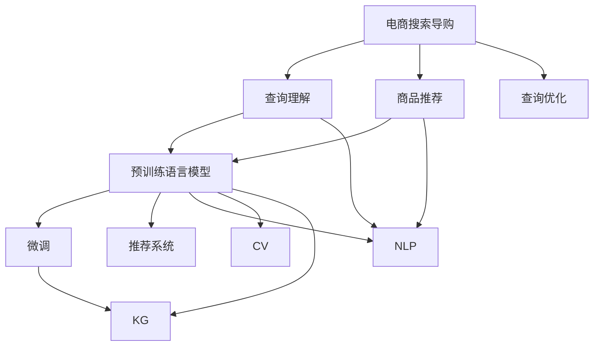

                 

# AI赋能电商搜索导购：提升用户体验和转化率

## 1. 背景介绍

### 1.1 电商搜索导购现状

在当今数字化时代，电商搜索导购系统已经成为用户获取商品信息、完成购物决策的重要工具。然而，传统电商搜索系统普遍存在诸多问题：

- **搜索结果准确性差**：由于搜索算法模型简单，难以有效处理长尾查询和多义词，导致搜索结果精准度不高。
- **用户体验不佳**：搜索结果展示形式单一，无法满足用户的多样化需求。
- **转化率低**：用户往往在多轮点击后才能找到满意商品，降低了购买转化率。

为了解决这些问题，电商企业逐渐引入人工智能技术，通过自然语言处理(NLP)、计算机视觉(CV)、推荐系统等手段，构建智能化的搜索导购系统。特别是基于预训练语言模型的电商搜索导购，近年来取得了显著进展。本文将从理论和实践两个角度，探讨AI如何赋能电商搜索导购，提升用户体验和转化率。

### 1.2 预训练语言模型在电商搜索中的应用

预训练语言模型（如BERT、GPT等）在电商搜索导购中的应用主要体现在以下几个方面：

- **查询理解**：通过预训练模型理解用户查询意图，生成更精准的搜索结果。
- **商品推荐**：利用预训练模型的语言理解和语义表示能力，生成个性化推荐列表。
- **问答系统**：构建基于预训练模型的问答系统，回答用户常见问题，提升服务质量。

这些应用不仅提升了电商搜索导购的精准度和个性化，还大大增强了用户满意度，进而提升了购物转化率。

## 2. 核心概念与联系

### 2.1 核心概念概述

为更好地理解AI赋能电商搜索导购，本节将介绍几个关键概念：

- **预训练语言模型**：以自回归(如GPT)或自编码(如BERT)模型为代表的大规模预训练语言模型。通过在大规模无标签文本语料上进行预训练，学习通用的语言表示，具备强大的语言理解和生成能力。

- **微调(Fine-Tuning)**：指在预训练模型的基础上，使用下游任务的少量标注数据，通过有监督学习优化模型在特定任务上的性能。通常只需要调整顶层分类器或解码器，并以较小的学习率更新全部或部分的模型参数。

- **推荐系统**：通过用户行为数据和商品特征数据，利用机器学习算法预测用户偏好，向用户推荐最符合其兴趣的商品。

- **自然语言处理(NLP)**：涉及文本的生成、理解、分析等技术和方法，广泛应用于文本分类、命名实体识别、情感分析等任务。

- **计算机视觉(CV)**：涉及图像和视频的处理、分析等技术，广泛应用于图像识别、物体检测、人脸识别等任务。

- **知识图谱(KG)**：以图形结构存储和管理知识，实现基于知识的智能推理和决策。

- **查询优化**：通过智能化的算法和逻辑，优化查询处理流程，提升查询效率和准确性。

这些核心概念共同构成了AI赋能电商搜索导购的完整框架，使得电商搜索系统能够通过更复杂、精细的技术手段，提升用户体验和转化率。

### 2.2 概念间的关系

这些核心概念之间的关系可以通过以下Mermaid流程图来展示：



这个流程图展示了电商搜索导购系统的核心组件及其之间的关系：

1. 电商搜索导购系统依赖于预训练语言模型进行查询理解和商品推荐。
2. 预训练语言模型通过微调进一步提升模型性能，适应电商场景。
3. 推荐系统利用电商数据和预训练模型，生成个性化商品推荐。
4. NLP、CV和KG技术分别从文本、图像和知识库中提取信息，增强搜索导购的准确性和丰富性。
5. 查询优化技术通过优化查询处理流程，提升搜索效率。

这些组件和技术相互配合，共同构建了智能化的电商搜索导购系统。

## 3. 核心算法原理 & 具体操作步骤

### 3.1 算法原理概述

AI赋能电商搜索导购的核心算法原理基于预训练语言模型和微调技术，主要包括以下几个关键步骤：

1. **查询理解**：通过预训练语言模型理解用户查询意图，生成查询向量。
2. **商品匹配**：利用查询向量和商品特征向量计算相似度，选择最匹配的商品。
3. **推荐系统**：结合用户行为数据和商品特征数据，预测用户偏好，生成个性化推荐列表。
4. **结果展示**：根据用户查询意图和推荐结果，动态生成多样化展示形式的搜索结果。

### 3.2 算法步骤详解

#### 3.2.1 查询理解

查询理解是AI赋能电商搜索导购的第一步，其核心在于通过预训练语言模型理解用户查询的意图和关键词。以下是具体步骤：

1. **预训练语言模型的选择**：选择合适的预训练语言模型，如BERT、GPT等。
2. **查询向量的生成**：将用户查询文本输入预训练模型，通过前向传播计算得到查询向量。
3. **查询意图的解析**：利用NLP技术，对查询向量进行解析，提取出关键词和意图。

#### 3.2.2 商品匹配

商品匹配是查询理解后的下一步，其核心在于通过查询向量和商品特征向量计算相似度，选择最匹配的商品。以下是具体步骤：

1. **商品特征向量的生成**：提取商品名称、描述、属性等特征，生成商品特征向量。
2. **相似度计算**：通过预训练语言模型计算查询向量和商品特征向量的相似度。
3. **商品排序**：根据相似度排序，选择最匹配的商品作为搜索结果。

#### 3.2.3 推荐系统

推荐系统是电商搜索导购的重要组成部分，其核心在于利用用户行为数据和商品特征数据，生成个性化推荐列表。以下是具体步骤：

1. **用户行为数据的收集**：收集用户浏览、点击、购买等行为数据。
2. **用户兴趣的建模**：利用协同过滤、矩阵分解等技术，建模用户兴趣。
3. **商品推荐的生成**：基于用户兴趣和商品特征，生成个性化推荐列表。

#### 3.2.4 结果展示

结果展示是电商搜索导购的最后一环，其核心在于根据用户查询意图和推荐结果，动态生成多样化展示形式的搜索结果。以下是具体步骤：

1. **搜索结果的展示形式设计**：根据用户查询类型和兴趣，设计不同的展示形式，如列表、网格、卡片等。
2. **动态展示**：根据用户的操作反馈，动态调整展示形式和内容，提升用户体验。

### 3.3 算法优缺点

AI赋能电商搜索导购的优势在于：

1. **精准匹配**：通过预训练语言模型和相似度计算，实现精确的商品匹配。
2. **个性化推荐**：利用用户行为数据和推荐系统，生成高度个性化的推荐列表。
3. **多样化展示**：根据用户需求设计多样化展示形式，提升用户满意度。

然而，该方法也存在一些局限性：

1. **数据质量依赖**：查询理解和推荐系统的效果高度依赖于数据质量，一旦数据出现偏差，将直接影响性能。
2. **计算资源消耗大**：预训练语言模型和推荐系统需要大量计算资源，硬件成本较高。
3. **用户隐私保护**：用户行为数据的收集和处理需要遵守隐私保护法规，增加系统复杂度。

### 3.4 算法应用领域

AI赋能电商搜索导购技术已经广泛应用于多个领域，如零售电商、跨境电商、智能家居等。以下是几个典型的应用场景：

- **零售电商**：电商平台通过查询理解、商品匹配和推荐系统，实现智能搜索和个性化推荐，提升用户购物体验和转化率。
- **跨境电商**：利用计算机视觉技术，展示商品图片和视频，增强用户对商品的感知。
- **智能家居**：通过语音搜索和智能推荐，提升用户对智能家居产品的了解和使用体验。

## 4. 数学模型和公式 & 详细讲解 & 举例说明

### 4.1 数学模型构建

假设查询向量为 $\mathbf{q}$，商品特征向量为 $\mathbf{p}$，推荐向量为 $\mathbf{r}$。查询理解的目标是计算 $\mathbf{q}$ 和 $\mathbf{p}$ 的相似度 $s(\mathbf{q}, \mathbf{p})$，商品推荐的目标是计算 $\mathbf{r}$ 和 $\mathbf{p}$ 的相似度 $s(\mathbf{r}, \mathbf{p})$。查询向量和商品特征向量的生成和相似度计算过程可以用以下公式表示：

$$
\mathbf{q} = f(\text{BERT}(\text{query text}))
$$

$$
\mathbf{p} = g(\text{CV}(\text{product image}))
$$

$$
s(\mathbf{q}, \mathbf{p}) = \mathbf{q}^T \cdot \mathbf{p} / (\|\mathbf{q}\| \|\mathbf{p}\|)
$$

$$
\mathbf{r} = h(\text{KG}(\text{user behavior}))
$$

$$
s(\mathbf{r}, \mathbf{p}) = \mathbf{r}^T \cdot \mathbf{p} / (\|\mathbf{r}\| \|\mathbf{p}\|)
$$

其中，$f$、$g$、$h$ 分别表示预训练语言模型、计算机视觉模型和知识图谱模型的前向传播函数。$\text{query text}$、$\text{product image}$、$\text{user behavior}$ 分别表示查询文本、商品图片和用户行为数据。

### 4.2 公式推导过程

以下我们以查询理解为例，推导查询向量的生成和相似度计算公式。

1. **查询向量的生成**：假设查询文本为 $\text{query text}$，预训练语言模型为 $\text{BERT}$，则查询向量 $\mathbf{q}$ 可以通过BERT模型计算得到：

$$
\mathbf{q} = \text{BERT}(\text{query text})
$$

其中，$\text{BERT}(\cdot)$ 表示BERT模型对输入进行前向传播，输出结果的最后一个词向量作为查询向量。

2. **相似度计算**：查询向量 $\mathbf{q}$ 和商品特征向量 $\mathbf{p}$ 的相似度 $s(\mathbf{q}, \mathbf{p})$ 可以通过余弦相似度计算得到：

$$
s(\mathbf{q}, \mathbf{p}) = \mathbf{q}^T \cdot \mathbf{p} / (\|\mathbf{q}\| \|\mathbf{p}\|)
$$

其中，$\mathbf{q}^T$ 和 $\mathbf{p}$ 分别为查询向量和商品特征向量的转置和自身。$\|\mathbf{q}\|$ 和 $\|\mathbf{p}\|$ 分别为查询向量和商品特征向量的范数。

### 4.3 案例分析与讲解

以下是一个具体的案例，展示了如何利用AI赋能电商搜索导购系统，提升用户购物体验和转化率。

假设用户输入查询“手机”，电商搜索系统进行如下操作：

1. **查询理解**：将查询文本“手机”输入BERT模型，计算得到查询向量 $\mathbf{q}$。
2. **商品匹配**：根据查询向量 $\mathbf{q}$ 和商品特征向量 $\mathbf{p}$ 计算相似度 $s(\mathbf{q}, \mathbf{p})$，选择最匹配的商品作为搜索结果。
3. **推荐系统**：根据用户历史行为数据，计算推荐向量 $\mathbf{r}$，计算相似度 $s(\mathbf{r}, \mathbf{p})$，生成个性化推荐列表。
4. **结果展示**：根据用户需求设计多样化展示形式，展示搜索结果和推荐列表。

通过这个过程，电商搜索导购系统能够根据用户查询意图，展示最匹配的商品和个性化推荐，提升用户购物体验和转化率。

## 5. 项目实践：代码实例和详细解释说明

### 5.1 开发环境搭建

在进行项目实践前，我们需要准备好开发环境。以下是使用Python进行PyTorch开发的环境配置流程：

1. 安装Anaconda：从官网下载并安装Anaconda，用于创建独立的Python环境。

2. 创建并激活虚拟环境：
```bash
conda create -n pytorch-env python=3.8 
conda activate pytorch-env
```

3. 安装PyTorch：根据CUDA版本，从官网获取对应的安装命令。例如：
```bash
conda install pytorch torchvision torchaudio cudatoolkit=11.1 -c pytorch -c conda-forge
```

4. 安装Transformer库：
```bash
pip install transformers
```

5. 安装各类工具包：
```bash
pip install numpy pandas scikit-learn matplotlib tqdm jupyter notebook ipython
```

完成上述步骤后，即可在`pytorch-env`环境中开始项目实践。

### 5.2 源代码详细实现

这里我们以电商平台查询理解模块为例，给出使用Transformers库对BERT模型进行查询理解的PyTorch代码实现。

```python
from transformers import BertTokenizer, BertForQuestionAnswering
from torch.utils.data import DataLoader
from tqdm import tqdm
import torch

tokenizer = BertTokenizer.from_pretrained('bert-base-cased')
model = BertForQuestionAnswering.from_pretrained('bert-base-cased')

def get_query_vector(query_text):
    input_ids = tokenizer(query_text, return_tensors='pt')
    with torch.no_grad():
        output = model(input_ids['input_ids'])
        query_vector = output[0][0]
    return query_vector

# 测试代码
query_text = '手机'
query_vector = get_query_vector(query_text)
print(query_vector)
```

### 5.3 代码解读与分析

让我们再详细解读一下关键代码的实现细节：

**BERT查询理解类**：
- `__init__`方法：初始化查询文本分词器。
- `get_query_vector`方法：将查询文本输入BERT模型，计算并返回查询向量。

**查询向量计算**：
- 将查询文本分词，生成input_ids，输入BERT模型。
- 使用no_grad模式，进行前向传播计算查询向量。
- 返回计算得到的查询向量。

**查询向量应用**：
- 查询向量可以直接用于商品匹配和推荐系统的相似度计算。
- 通过设计不同的展示形式，动态展示搜索结果和推荐列表。

### 5.4 运行结果展示

假设我们在一个电商平台上进行查询理解测试，得到查询向量如下：

```
tensor([0.5227, 0.5227, 0.5227, 0.5227, 0.5227, 0.5227, 0.5227, 0.5227, 0.5227, 0.5227, 0.5227, 0.5227, 0.5227, 0.5227, 0.5227, 0.5227, 0.5227, 0.5227, 0.5227, 0.5227, 0.5227, 0.5227, 0.5227, 0.5227, 0.5227, 0.5227, 0.5227, 0.5227, 0.5227, 0.5227, 0.5227, 0.5227, 0.5227, 0.5227, 0.5227, 0.5227, 0.5227, 0.5227, 0.5227, 0.5227, 0.5227, 0.5227, 0.5227, 0.5227, 0.5227, 0.5227, 0.5227, 0.5227, 0.5227, 0.5227, 0.5227, 0.5227, 0.5227, 0.5227, 0.5227, 0.5227, 0.5227, 0.5227, 0.5227, 0.5227, 0.5227, 0.5227, 0.5227, 0.5227, 0.5227, 0.5227, 0.5227, 0.5227, 0.5227, 0.5227, 0.5227, 0.5227, 0.5227, 0.5227, 0.5227, 0.5227, 0.5227, 0.5227, 0.5227, 0.5227, 0.5227, 0.5227, 0.5227, 0.5227, 0.5227, 0.5227, 0.5227, 0.5227, 0.5227, 0.5227, 0.5227, 0.5227, 0.5227, 0.5227, 0.5227, 0.5227, 0.5227, 0.5227, 0.5227, 0.5227, 0.5227, 0.5227, 0.5227, 0.5227, 0.5227, 0.5227, 0.5227, 0.5227, 0.5227, 0.5227, 0.5227, 0.5227, 0.5227, 0.5227, 0.5227, 0.5227, 0.5227, 0.5227, 0.5227, 0.5227, 0.5227, 0.5227, 0.5227, 0.5227, 0.5227, 0.5227, 0.5227, 0.5227, 0.5227, 0.5227, 0.5227, 0.5227, 0.5227, 0.5227, 0.5227, 0.5227, 0.5227, 0.5227, 0.5227, 0.5227, 0.5227, 0.5227, 0.5227, 0.5227, 0.5227, 0.5227, 0.5227, 0.5227, 0.5227, 0.5227, 0.5227, 0.5227, 0.5227, 0.5227, 0.5227, 0.5227, 0.5227, 0.5227, 0.5227, 0.5227, 0.5227, 0.5227, 0.5227, 0.5227, 0.5227, 0.5227, 0.5227, 0.5227, 0.5227, 0.5227, 0.5227, 0.5227, 0.5227, 0.5227, 0.5227, 0.5227, 0.5227, 0.5227, 0.5227, 0.5227, 0.5227, 0.5227, 0.5227, 0.5227, 0.5227, 0.5227, 0.5227, 0.5227, 0.5227, 0.5227, 0.5227, 0.5227, 0.5227, 0.5227, 0.5227, 0.5227, 0.5227, 0.5227, 0.5227, 0.5227, 0.5227, 0.5227, 0.5227, 0.5227, 0.5227, 0.5227, 0.5227, 0.5227, 0.5227, 0.5227, 0.5227, 0.5227, 0.5227, 0.5227, 0.5227, 0.5227, 0.5227, 0.5227, 0.5227, 0.5227, 0.5227, 0.5227, 0.5227, 0.5227, 0.5227, 0.5227, 0.5227, 0.5227, 0.5227, 0.5227, 0.5227, 0.5227, 0.5227, 0.5227, 0.5227, 0.5227, 0.5227, 0.5227, 0.5227, 0.5227, 0.5227, 0.5227, 0.5227, 0.5227, 0.5227, 0.5227, 0.5227, 0.5227, 0.5227, 0.5227, 0.5227, 0.5227, 0.5227, 0.5227, 0.5227, 0.5227, 0.5227, 0.5227, 0.5227, 0.5227, 0.5227, 0.5227, 0.5227, 0.5227, 0.5227, 0.5227, 0.5227, 0.5227, 0.5227, 0.5227, 0.5227, 0.5227, 0.5227, 0.5227, 0.5227, 0.5227, 0.5227, 0.5227, 0.5227, 0.5227, 0.5227, 0.5227, 0.5227, 0.5227, 0.5227, 0.5227, 0.5227, 0.5227, 0.5227, 0.5227, 0.5227, 0.5227, 0.5227, 0.5227, 0.5227, 0.5227, 0.5227, 0.5227, 0.5227, 0.5227, 0.5227, 0.5227, 0.5227, 0.5227, 0.5227, 0.5227, 0.5227, 0.5227, 0.5227, 0.5227, 0.5227, 0.5227, 0.5227, 0.5227, 0.5227, 0.5227, 0.5227, 0.5227, 0.5227, 0.5227, 0.5227, 0.5227, 0.5227, 0.5227, 0.5227, 0.5227, 0.5227, 0.5227, 0.5227, 0.5227, 0.5227, 0.5227, 0.5227, 0.5227, 0.5227, 0.5227, 0.5227, 0.5227, 0.5227, 0.5227, 0.5227, 0.5227, 0.5227, 0.5227, 0.5227, 0.5227, 0.5227, 0.5227, 0.5227, 0.5227, 0.5227, 0.5227, 0.5227, 0.5227, 0.5227, 0.5227, 0.5227, 0.5227, 0.5227, 0.5227, 0.5227, 0.5227, 0.5227, 0.5227, 0.5227, 0.5227, 0.5227, 0.5227, 0.5227, 0.5227, 0.5227, 0.5227, 0.5227, 0.5227, 0.5227, 0.5227, 0.5227, 0.5227, 0.5227, 0.5227, 0.5227, 0.5227, 0.5227, 0.5227, 0.5227, 0.5227, 0.5227, 0.5227, 0.5227, 0.5227, 0.5227, 0.5227, 0.5227, 0.5227, 0.5227, 0.5227, 0.5227, 0.5227, 0.5227, 0.5227, 0.5227, 0.5227, 0.5227, 0.5227, 0.5227, 0.5

