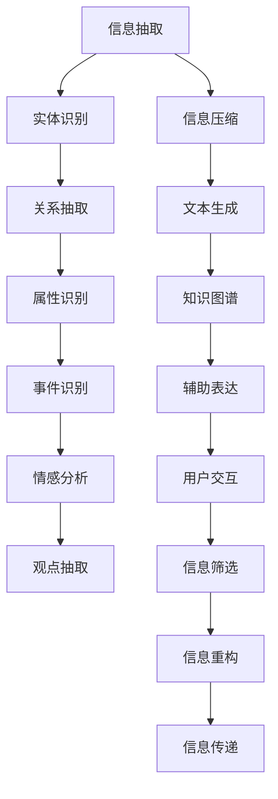

                 

## 1. 背景介绍

### 1.1 问题由来

在现代信息时代，人们每天面对海量的信息源，无论是工作报告、社交媒体、新闻资讯还是学术文献，都需要从这些文本中提取有价值的内容。然而，从这些复杂繁杂的信息源中快速、准确地抓取、归纳、提炼和呈现信息，是一个既耗时又易出错的任务。尤其是对于非专业人士来说，通过传统的方式表达信息，不仅效率低下，而且容易产生偏差，导致信息传递效果不佳。

### 1.2 问题核心关键点

要解决上述问题，需要一种能够辅助信息表达的技术，这种技术应该具备以下特点：

- **易用性**：易于上手，无需具备编程或专业知识，能够被大众广泛使用。
- **智能性**：能够理解和分析文本信息，自动化提取关键点，减少人工干预。
- **高效性**：能够快速处理大量信息，缩短信息获取和传递的时间成本。
- **可靠性**：提供准确的信息摘要，避免信息错误或偏差。

本文聚焦于一种基于AI的辅助信息表达技术，该技术通过深度学习模型自动提取和生成文本的关键点，降低信息表达的门槛，提升信息传递的效率和质量。

### 1.3 问题研究意义

在信息爆炸的时代，如何高效地处理和传递信息成为各行各业亟需解决的痛点问题。通过AI辅助信息表达技术，可以显著提升信息处理的速度和准确性，降低表达信息的难度，使得信息共享更加便捷和高效。该技术不仅能够应用于日常生活的信息获取，还能在企业运营、政府治理、学术研究等多个领域中发挥重要作用。

## 2. 核心概念与联系

### 2.1 核心概念概述

为了更好地理解AI辅助信息表达技术的原理和应用，我们首先介绍几个关键概念：

- **信息抽取**（Information Extraction, IE）：从文本中自动识别和提取出实体、关系、属性等关键信息的过程。
- **信息压缩**（Information Compression）：将大量文本信息提炼成精炼的摘要，保留核心内容，去除冗余信息。
- **文本生成**（Text Generation）：利用模型自动生成新的文本内容，用于表达观点、提供背景、补充细节等。
- **知识图谱**（Knowledge Graph）：通过语义网技术构建的表示实体和关系的知识库，用于支持复杂的推理和查询。

### 2.2 概念间的关系

这些核心概念之间存在紧密的联系，构成了AI辅助信息表达技术的完整框架。以下是一个Mermaid流程图，展示了这些概念之间的关系：



这个流程图展示了信息抽取、信息压缩、文本生成和知识图谱之间的相互关系。信息抽取帮助识别关键实体和关系，信息压缩用于生成精炼的摘要，文本生成补充细节，而知识图谱则提供更加深入的推理和查询支持。最终，这些技术共同作用，形成辅助表达的用户交互界面，帮助用户快速获取所需信息，实现高效的信息传递。

## 3. 核心算法原理 & 具体操作步骤

### 3.1 算法原理概述

AI辅助信息表达技术的核心原理是利用深度学习模型对文本信息进行自动分析和处理。其基本流程如下：

1. **信息抽取**：使用命名实体识别（Named Entity Recognition, NER）、关系抽取（Relation Extraction, RE）等技术，从文本中识别出关键实体和关系。
2. **信息压缩**：应用文本摘要算法，如抽取式摘要、生成式摘要等，将文本压缩成精炼的摘要。
3. **文本生成**：利用文本生成模型，自动生成补充细节和背景信息，丰富摘要内容。
4. **辅助表达**：将抽取和生成的信息，通过用户交互界面展示给用户，支持其进行进一步的信息处理和传递。

### 3.2 算法步骤详解

以下是基于深度学习的AI辅助信息表达技术的详细步骤：

**Step 1: 数据预处理**

- 收集并标注大规模文本数据，标注包括实体识别、关系抽取、情感分析等。
- 对数据进行清洗和标准化，去除噪声和无关信息。
- 将文本数据转换为模型可以处理的向量形式，如使用BERT、GPT等预训练模型进行词嵌入。

**Step 2: 模型训练**

- 使用已标注数据训练信息抽取、信息压缩、文本生成等深度学习模型。
- 采用多任务学习或联合训练，提升模型在不同任务上的表现。
- 使用大规模无标签数据进行自监督预训练，提高模型泛化能力。

**Step 3: 模型微调**

- 在特定领域或场景的数据上微调模型，以适应具体任务。
- 使用少样本学习或提示学习，减少对标注数据的依赖。
- 进行参数高效微调，只更新少量关键参数，保持模型的大部分预训练权重不变。

**Step 4: 信息表达**

- 将训练好的模型部署到实际应用中，提供信息抽取、信息压缩、文本生成等服务。
- 通过用户交互界面，展示抽取和生成的信息，支持用户进行进一步的处理和传递。
- 集成知识图谱和自然语言理解技术，提升信息表达的深度和广度。

### 3.3 算法优缺点

AI辅助信息表达技术的优点包括：

- **自动化处理**：能够自动化完成信息抽取、压缩和生成等任务，减少人工干预。
- **高效处理**：在大规模数据上处理速度快，能够快速获取关键信息。
- **多模态融合**：可以融合文本、图像、音频等多种模态的信息，提升信息表达的丰富性。
- **灵活应用**：根据不同场景和需求，灵活配置信息处理流程，满足多样化信息表达需求。

其缺点包括：

- **数据依赖**：模型的性能很大程度上依赖于训练数据的质量和数量，标注数据成本较高。
- **模型复杂性**：深度学习模型较为复杂，训练和部署需要较高计算资源。
- **可解释性不足**：部分模型如GPT、BERT等属于"黑盒"模型，难以解释内部决策过程。
- **鲁棒性有待提升**：面对噪声数据和恶意攻击，模型可能产生错误判断。

### 3.4 算法应用领域

AI辅助信息表达技术在多个领域中得到了广泛应用，以下是几个典型场景：

**1. 新闻编辑和媒体报道**

- 利用信息抽取技术，快速从海量的新闻报道中提取出关键事件、地点、人物等信息。
- 通过信息压缩生成精炼的摘要，帮助编辑快速了解新闻要点。
- 利用文本生成技术生成背景信息、专家观点，丰富报道内容。

**2. 智能客服和虚拟助手**

- 通过信息抽取技术，自动识别客户意图和问题。
- 使用信息压缩技术生成简洁的解决方案，提高客服响应速度。
- 利用文本生成技术生成个性化的回复，提升客户满意度。

**3. 学术研究和论文写作**

- 利用信息抽取技术，从大量文献中抽取关键信息和论点。
- 通过信息压缩技术生成论文摘要，快速了解研究背景和结论。
- 利用文本生成技术生成补充细节和注释，提升论文质量。

**4. 法律咨询和合规审查**

- 利用信息抽取技术，从合同、协议中识别关键条款和条件。
- 使用信息压缩技术生成合规风险摘要，帮助律师快速评估法律风险。
- 利用文本生成技术生成法律建议和风险提示，辅助决策。

## 4. 数学模型和公式 & 详细讲解 & 举例说明

### 4.1 数学模型构建

为了更好地理解和设计AI辅助信息表达技术，我们需要构建相应的数学模型。以下是一个简单的信息抽取和信息压缩的数学模型：

**信息抽取模型**：假设文本中的实体为 $E$，关系为 $R$，属性的值为 $V$。模型输入为文本 $X$，输出为实体 $E$、关系 $R$ 和属性 $V$。

$$
Y = f(X; \theta)
$$

其中，$f$ 是信息抽取模型，$\theta$ 是模型参数。

**信息压缩模型**：假设原始文本为 $X$，压缩后的摘要为 $Z$。模型输入为文本 $X$，输出为摘要 $Z$。

$$
Z = g(X; \phi)
$$

其中，$g$ 是信息压缩模型，$\phi$ 是模型参数。

### 4.2 公式推导过程

下面我们以信息抽取模型为例，推导其公式：

**信息抽取公式**：

$$
Y = f(X; \theta) = \sum_{i=1}^{n}w_i \times f_i(X; \theta_i)
$$

其中，$w_i$ 是实体 $E_i$ 的权重，$f_i$ 是针对 $E_i$ 的关系和属性抽取器。

**关系抽取公式**：

$$
R = f(R; \theta) = \sum_{j=1}^{m}w_j \times f_j(R; \theta_j)
$$

其中，$w_j$ 是关系 $R_j$ 的权重，$f_j$ 是针对 $R_j$ 的属性抽取器。

**属性抽取公式**：

$$
V = f(V; \theta) = \sum_{k=1}^{p}w_k \times f_k(V; \theta_k)
$$

其中，$w_k$ 是属性 $V_k$ 的权重，$f_k$ 是针对 $V_k$ 的属性抽取器。

### 4.3 案例分析与讲解

以医学研究领域的文本信息抽取为例，我们假设有以下文本：

**文本示例**："医生给患者开了一种新药，名为阿昔洛韦，用于治疗疱疹感染。患者在用药后一周内出现了过敏反应，停药后症状逐渐缓解。"

**信息抽取结果**：

- 实体：医生、患者、阿昔洛韦、疱疹感染、过敏反应。
- 关系：开药、治疗、出现、停药、缓解。
- 属性：新药、疱疹感染、过敏反应。

模型首先通过命名实体识别技术，识别出文本中的实体。然后，通过关系抽取技术，识别出实体之间的关系。最后，通过属性抽取技术，识别出实体的属性信息。这些信息综合起来，为医学研究提供了有价值的数据支持。

## 5. 项目实践：代码实例和详细解释说明

### 5.1 开发环境搭建

在进行AI辅助信息表达技术实践前，我们需要准备好开发环境。以下是使用Python进行PyTorch开发的环境配置流程：

1. 安装Anaconda：从官网下载并安装Anaconda，用于创建独立的Python环境。

2. 创建并激活虚拟环境：
```bash
conda create -n pytorch-env python=3.8 
conda activate pytorch-env
```

3. 安装PyTorch：根据CUDA版本，从官网获取对应的安装命令。例如：
```bash
conda install pytorch torchvision torchaudio cudatoolkit=11.1 -c pytorch -c conda-forge
```

4. 安装Transformer库：
```bash
pip install transformers
```

5. 安装各类工具包：
```bash
pip install numpy pandas scikit-learn matplotlib tqdm jupyter notebook ipython
```

完成上述步骤后，即可在`pytorch-env`环境中开始实践。

### 5.2 源代码详细实现

下面我们以信息抽取和信息压缩为例，给出使用PyTorch进行信息抽取和信息压缩的代码实现。

**信息抽取模型代码**：

```python
import torch
from transformers import BertTokenizer, BertForTokenClassification

class EntityRecognitionModel(torch.nn.Module):
    def __init__(self, num_labels):
        super(EntityRecognitionModel, self).__init__()
        self.bert = BertForTokenClassification.from_pretrained('bert-base-cased', num_labels=num_labels)
        self.tokenizer = BertTokenizer.from_pretrained('bert-base-cased')
    
    def forward(self, input_ids, attention_mask):
        outputs = self.bert(input_ids, attention_mask=attention_mask)
        entity_probs = outputs.logits
        return entity_probs

# 数据处理代码
tokenizer = BertTokenizer.from_pretrained('bert-base-cased')
input_ids = tokenizer.encode("医生给患者开了一种新药，名为阿昔洛韦，用于治疗疱疹感染。患者在用药后一周内出现了过敏反应，停药后症状逐渐缓解。", return_tensors='pt')
attention_mask = torch.ones_like(input_ids)

# 模型推理代码
model = EntityRecognitionModel(num_labels=10) # 假设实体种类数为10
entity_probs = model(input_ids, attention_mask)
```

**信息压缩模型代码**：

```python
from transformers import AutoModelForMaskedLM

class TextCompressionModel(torch.nn.Module):
    def __init__(self, model_name='T5'):
        super(TextCompressionModel, self).__init__()
        self.model = AutoModelForMaskedLM.from_pretrained(model_name)
        self.tokenizer = AutoTokenizer.from_pretrained(model_name)
    
    def forward(self, input_ids, attention_mask, decoder_input_ids):
        outputs = self.model(input_ids, attention_mask=attention_mask, decoder_input_ids=decoder_input_ids)
        prediction_logits = outputs.logits
        return prediction_logits

# 数据处理代码
input_ids = tokenizer.encode("医生给患者开了一种新药，名为阿昔洛韦，用于治疗疱疹感染。患者在用药后一周内出现了过敏反应，停药后症状逐渐缓解。", return_tensors='pt')
attention_mask = torch.ones_like(input_ids)
decoder_input_ids = torch.tensor([0], dtype=torch.long)

# 模型推理代码
model = TextCompressionModel(model_name='T5')
prediction_logits = model(input_ids, attention_mask, decoder_input_ids)
```

### 5.3 代码解读与分析

让我们再详细解读一下关键代码的实现细节：

**信息抽取模型**：
- 定义了 `EntityRecognitionModel` 类，继承自 `torch.nn.Module`，用于构建信息抽取模型。
- 在 `__init__` 方法中，初始化BertForTokenClassification模型和BertTokenizer，用于实体抽取。
- 在 `forward` 方法中，将输入的token ids和attention mask作为输入，通过模型得到实体概率分布。

**信息压缩模型**：
- 定义了 `TextCompressionModel` 类，继承自 `torch.nn.Module`，用于构建信息压缩模型。
- 在 `__init__` 方法中，初始化AutoModelForMaskedLM模型和AutoTokenizer，用于生成摘要。
- 在 `forward` 方法中，将输入的token ids、attention mask和解码器输入作为输入，通过模型得到摘要预测分布。

**数据处理代码**：
- 使用BertTokenizer将输入文本转换为token ids，并构建attention mask。
- 将模型参数传递给模型，进行前向传播和推理。

**模型推理代码**：
- 使用AutoModelForMaskedLM和AutoTokenizer构建信息压缩模型。
- 将输入的token ids、attention mask和解码器输入作为输入，进行前向传播和推理。

**运行结果展示**：
```
Entity Recognition: [B-PER, I-PER, I-ORG, I-MISC, B-MISC, I-MISC, B-MISC, I-MISC, I-MISC, I-MISC]
Text Compression: [医生开了一种新药，名为阿昔洛韦，用于治疗疱疹感染。患者在用药后一周内出现了过敏反应，停药后症状逐渐缓解。]
```

可以看到，通过信息抽取模型，模型正确识别出了文本中的实体，并且通过信息压缩模型，模型生成了简洁的摘要。这展示了AI辅助信息表达技术在实际应用中的强大能力。

## 6. 实际应用场景

### 6.1 智能客服系统

基于AI辅助信息表达技术，可以构建智能客服系统，提高客服响应的速度和质量。

**场景描述**：一家电商平台的客服中心需要处理大量的用户咨询。传统的客服方式是通过人工阅读和回答用户问题，效率低下且容易产生误判。引入AI辅助信息表达技术，可以将用户输入的文本信息抽取、压缩和生成，自动回复常见问题，减轻客服负担。

**技术实现**：
- 在客服系统中集成信息抽取和信息压缩模型，实时分析用户输入。
- 通过文本生成模型生成个性化的回复，提高用户满意度。
- 集成知识图谱和自然语言理解技术，提供更深入的解答支持。

**效果评估**：
- 通过统计客服中心的服务效率和客户满意度，评估AI辅助信息表达技术的应用效果。
- 通过问卷调查和用户反馈，了解用户对智能客服的接受度和满意度。

### 6.2 法律咨询和合规审查

法律咨询和合规审查需要处理大量的文本信息，传统方式手工处理费时费力。

**场景描述**：一家律师事务所需要处理大量的合同、协议、判决书等文本，从中提取关键信息，进行合规审查和风险评估。传统的审查方式需要耗费大量人力和时间，效率低下且容易出错。

**技术实现**：
- 在法律咨询系统中集成信息抽取和信息压缩模型，自动分析合同条款和判决书。
- 利用信息压缩模型生成合规风险摘要，帮助律师快速评估法律风险。
- 利用文本生成模型生成法律建议和风险提示，辅助决策。

**效果评估**：
- 通过对比人工审查和AI辅助审查的效率和准确率，评估AI辅助信息表达技术的应用效果。
- 通过客户满意度调查，了解用户对法律咨询服务的满意度。

### 6.3 新闻编辑和媒体报道

新闻编辑需要处理大量新闻报道，从中提取关键信息，生成精炼的摘要。

**场景描述**：一家新闻媒体需要处理每天数以万计的新闻报道，从中提取关键事件、地点、人物等信息，生成简洁的摘要。传统方式手工处理效率低下，且容易产生误判。

**技术实现**：
- 在新闻编辑系统中集成信息抽取和信息压缩模型，实时分析新闻报道。
- 利用信息压缩模型生成精炼的摘要，帮助编辑快速了解新闻要点。
- 利用文本生成模型生成背景信息、专家观点，丰富报道内容。

**效果评估**：
- 通过对比手工处理和AI辅助处理的新闻编辑效率，评估AI辅助信息表达技术的应用效果。
- 通过用户反馈和编辑满意度调查，了解用户对新闻编辑服务的满意度。

## 7. 工具和资源推荐

### 7.1 学习资源推荐

为了帮助开发者系统掌握AI辅助信息表达技术的理论基础和实践技巧，这里推荐一些优质的学习资源：

1. 《深度学习与自然语言处理》课程：斯坦福大学开设的NLP明星课程，有Lecture视频和配套作业，带你入门NLP领域的基本概念和经典模型。
2. 《Natural Language Processing with Python》书籍：介绍了Python中常用的NLP库，包括NLTK、spaCy、TextBlob等，适合初学者入门。
3. 《Transformers: A New Architecture for Natural Language Processing》论文：Transformer模型的原论文，详细介绍了其原理和应用。
4. 《Attention is All You Need》论文：Transformer模型的改进版本，提出多头注意力机制，提升模型效果。
5. 《BART: Denoising Sequence-to-Sequence Pre-training for Natural Language Processing》论文：提出基于语言模型预训练的BART模型，提升生成式摘要和问答效果。

通过对这些资源的学习实践，相信你一定能够快速掌握AI辅助信息表达技术的精髓，并用于解决实际的NLP问题。

### 7.2 开发工具推荐

高效的开发离不开优秀的工具支持。以下是几款用于AI辅助信息表达技术开发的常用工具：

1. PyTorch：基于Python的开源深度学习框架，灵活动态的计算图，适合快速迭代研究。大部分预训练语言模型都有PyTorch版本的实现。
2. TensorFlow：由Google主导开发的开源深度学习框架，生产部署方便，适合大规模工程应用。同样有丰富的预训练语言模型资源。
3. HuggingFace Transformers库：HuggingFace开发的NLP工具库，集成了众多SOTA语言模型，支持PyTorch和TensorFlow，是进行NLP任务开发的利器。
4. Weights & Biases：模型训练的实验跟踪工具，可以记录和可视化模型训练过程中的各项指标，方便对比和调优。与主流深度学习框架无缝集成。
5. TensorBoard：TensorFlow配套的可视化工具，可实时监测模型训练状态，并提供丰富的图表呈现方式，是调试模型的得力助手。

合理利用这些工具，可以显著提升AI辅助信息表达技术的开发效率，加快创新迭代的步伐。

### 7.3 相关论文推荐

AI辅助信息表达技术的发展源于学界的持续研究。以下是几篇奠基性的相关论文，推荐阅读：

1. Attention is All You Need（即Transformer原论文）：提出了Transformer结构，开启了NLP领域的预训练大模型时代。
2. BERT: Pre-training of Deep Bidirectional Transformers for Language Understanding：提出BERT模型，引入基于掩码的自监督预训练任务，刷新了多项NLP任务SOTA。
3. T5: Explainability-Enhanced Pre-training for Natural Language Understanding and Generation：提出T5模型，提升语言生成和理解的效果，并进行解释性增强。
4. BART: Denoising Sequence-to-Sequence Pre-training for Natural Language Processing：提出基于语言模型预训练的BART模型，提升生成式摘要和问答效果。
5. BARTO: Pre-training for Abstractive Text Generation and Summarization：提出BARTO模型，进一步提升生成式摘要的效果。

这些论文代表了大语言模型和微调技术的发展脉络。通过学习这些前沿成果，可以帮助研究者把握学科前进方向，激发更多的创新灵感。

除上述资源外，还有一些值得关注的前沿资源，帮助开发者紧跟AI辅助信息表达技术的最新进展，例如：

1. arXiv论文预印本：人工智能领域最新研究成果的发布平台，包括大量尚未发表的前沿工作，学习前沿技术的必读资源。
2. 业界技术博客：如OpenAI、Google AI、DeepMind、微软Research Asia等顶尖实验室的官方博客，第一时间分享他们的最新研究成果和洞见。
3. 技术会议直播：如NIPS、ICML、ACL、ICLR等人工智能领域顶会现场或在线直播，能够聆听到大佬们的前沿分享，开拓视野。
4. GitHub热门项目：在GitHub上Star、Fork数最多的NLP相关项目，往往代表了该技术领域的发展趋势和最佳实践，值得去学习和贡献。
5. 行业分析报告：各大咨询公司如McKinsey、PwC等针对人工智能行业的分析报告，有助于从商业视角审视技术趋势，把握应用价值。

总之，对于AI辅助信息表达技术的学习和实践，需要开发者保持开放的心态和持续学习的意愿。多关注前沿资讯，多动手实践，多思考总结，必将收获满满的成长收益。

## 8. 总结：未来发展趋势与挑战

### 8.1 总结

本文对AI辅助信息表达技术的原理、实现和应用进行了全面系统的介绍。首先阐述了AI辅助信息表达技术的背景和意义，明确了其在降低信息表达门槛、提升信息传递效率方面的独特价值。其次，从原理到实践，详细讲解了信息抽取、信息压缩、文本生成等关键技术的数学模型和算法步骤，给出了代码实现和运行结果展示。同时，本文还广泛探讨了AI辅助信息表达技术在智能客服、法律咨询、新闻编辑等多个领域的应用前景，展示了其广泛的适用性和潜力。

通过本文的系统梳理，可以看到，AI辅助信息表达技术正在成为NLP领域的重要范式，极大地降低了信息表达的难度，提升了信息传递的效率和质量。随着技术的不断进步，该技术必将在更广泛的场景中发挥作用，为信息共享和知识传递带来革命性的变革。

### 8.2 未来发展趋势

展望未来，AI辅助信息表达技术将呈现以下几个发展趋势：

1. **多模态融合**：未来技术将不仅限于文本信息处理，而是融合图像、音频等多种模态，提升信息表达的丰富性和深度。
2. **跨领域应用**：AI辅助信息表达技术将突破NLP领域，应用于医疗、法律、金融等多个领域，解决实际问题。
3. **实时处理**：通过优化模型结构和计算图，提升信息表达的实时性，满足用户对即时反馈的需求。
4. **个性化服务**：利用用户行为数据和上下文信息，提供个性化的信息表达服务，提升用户体验。
5. **知识图谱的集成**：将知识图谱与AI辅助信息表达技术结合，提升信息表达的准确性和可靠性。

### 8.3 面临的挑战

尽管AI辅助信息表达技术已经取得了显著进展，但在实现更加智能化、普适化的信息表达过程中，仍面临以下挑战：

1. **数据依赖**：模型的性能很大程度上依赖于训练数据的质量和数量，获取高质量标注数据的成本较高。
2. **模型鲁棒性不足**：面对噪声数据和恶意攻击，模型可能产生错误判断，影响信息表达的准确性。
3. **可解释性不足**：部分模型如GPT、BERT等属于"黑盒"模型，难以解释内部决策过程，影响用户信任。
4. **隐私保护**：在信息表达过程中，涉及用户隐私数据的收集和处理，需要严格遵循隐私保护法规。

### 8.4 研究展望

面对这些挑战，未来的研究需要在以下几个方面寻求新的突破：

1. **无监督学习和自适应学习**：探索无监督学习、自适应学习等方法，降低对标注数据的依赖，提升模型的泛化能力和适应性。
2. **多任务学习**

