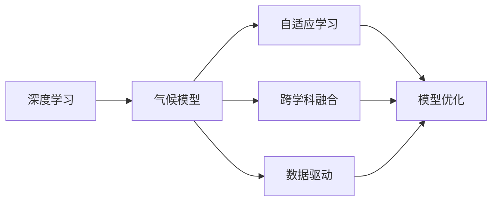
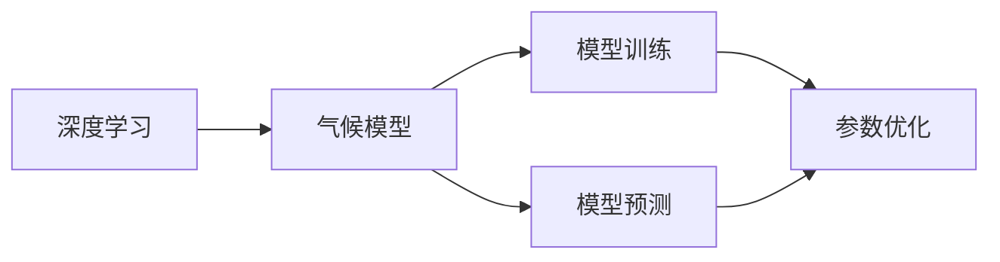
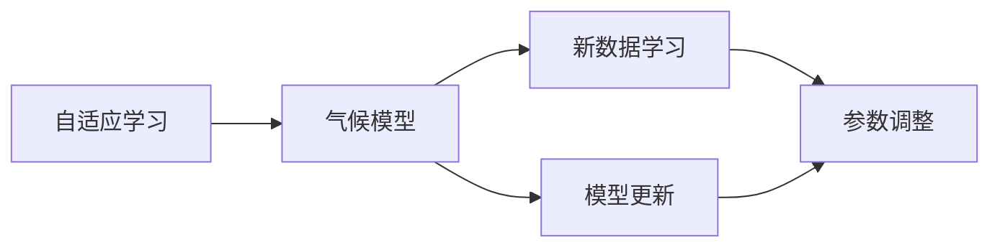
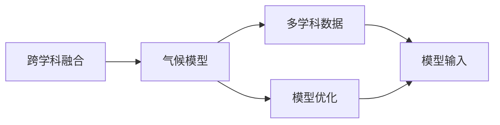

                 

# AI驱动的气候模型:应对全球变暖的新工具

> 关键词：人工智能,气候模型,深度学习,气候变化,环境科学

## 1. 背景介绍

### 1.1 问题由来
随着全球气候变化的加剧，科学家和决策者越来越依赖于精准的气候模型来预测未来气候趋势、评估政策效果和制定应对措施。然而，传统的气候模型往往计算复杂、参数繁多，难以快速响应实时数据和新兴问题。人工智能，尤其是深度学习技术的进步，为气候模型带来了新的曙光，使得模型可以更加高效、准确地模拟和预测气候变化。

### 1.2 问题核心关键点
基于深度学习的气候模型，尤其是AI驱动的气候模型，具有以下几个核心关键点：
- **高效计算**：利用神经网络加速模型计算，大幅度提升预测速度和精度。
- **自适应学习**：通过自动化的训练过程，模型能够不断优化参数，适应新的数据和情境。
- **跨学科融合**：结合大气科学、海洋学、生态学等领域的知识，提供更为全面和准确的预测。
- **数据驱动**：利用海量卫星、气象站、海洋浮标等数据，进行高精度的实时监测和预测。
- **决策支持**：为气候政策制定、灾害应对等提供科学依据和优化建议。

这些关键点使得AI驱动的气候模型成为应对全球变暖的重要工具，为未来的气候治理和环境保护提供了新的解决方案。

### 1.3 问题研究意义
构建AI驱动的气候模型具有重要意义：
1. **提高预测精度**：利用深度学习技术，模型能够更好地捕捉复杂的气候模式和不确定性因素，提供更为精确的气候预测。
2. **缩短模型训练时间**：通过高效计算和优化算法，模型可以在更短的时间内完成训练和预测。
3. **增强决策支持**：模型提供的科学依据和预测结果，可以帮助决策者更好地理解气候变化风险和机遇。
4. **促进跨学科合作**：通过模型融合多学科知识，推动科学研究与工程应用的深度结合。
5. **推动可持续发展**：为制定气候政策和保护环境提供科学指导，支持绿色低碳发展。

## 2. 核心概念与联系

### 2.1 核心概念概述

为了更好地理解AI驱动的气候模型，我们先介绍几个核心概念：

- **深度学习**：一种基于神经网络的机器学习方法，通过多层非线性变换提取数据特征，具有强大的自适应和学习能力。
- **气候模型**：用于模拟气候系统动态变化的数学模型，包括大气、海洋、陆地等多个子系统。
- **AI驱动**：利用人工智能技术，尤其是深度学习，对气候模型进行优化和提升。
- **自适应学习**：模型能够根据新数据和新情境自动更新参数，提升模型性能。
- **跨学科融合**：结合不同学科的理论与数据，提升模型的全面性和准确性。

这些概念之间存在着紧密的联系，形成了一个完整的气候模型体系。下面通过一个Mermaid流程图来展示这些概念之间的联系：



这个流程图展示了深度学习如何通过模型优化、自适应学习和跨学科融合，提升气候模型的准确性和实用性。

### 2.2 概念间的关系

这些核心概念之间存在着复杂的互动关系，构建AI驱动的气候模型需要综合考虑多个方面的因素。以下通过几个Mermaid流程图来展示这些概念之间的关系：

#### 2.2.1 深度学习与气候模型的关系



这个流程图展示了深度学习在模型训练和预测中的应用，以及参数优化在提升模型性能中的作用。

#### 2.2.2 自适应学习与气候模型的关系



这个流程图展示了自适应学习如何在模型中自动更新参数，适应新数据和新情境。

#### 2.2.3 跨学科融合与气候模型的关系



这个流程图展示了跨学科融合如何在模型输入和优化中综合多学科知识，提升模型的全面性和准确性。

## 3. 核心算法原理 & 具体操作步骤

### 3.1 算法原理概述

基于深度学习的气候模型，主要依赖于以下算法原理：

1. **神经网络结构**：模型采用多层神经网络结构，包括输入层、隐藏层和输出层。输入层接收气象数据、海洋数据等，隐藏层通过非线性变换提取特征，输出层提供预测结果。
2. **损失函数**：模型训练时使用均方误差、交叉熵等损失函数，最小化预测结果与真实数据的差异。
3. **反向传播算法**：通过反向传播算法计算梯度，更新模型参数。
4. **优化算法**：如随机梯度下降、Adam等优化算法，加速模型训练过程。

### 3.2 算法步骤详解

构建AI驱动的气候模型一般包括以下几个关键步骤：

**Step 1: 数据准备**
- 收集和处理气候相关数据，包括气象站数据、卫星数据、海洋浮标数据等。
- 数据预处理，如数据清洗、标准化等，确保数据质量。

**Step 2: 模型选择与构建**
- 选择合适的深度学习模型，如卷积神经网络(CNN)、循环神经网络(RNN)、变分自编码器(VAE)等。
- 定义模型架构，包括输入、隐藏和输出层。
- 初始化模型参数，一般使用随机初始化。

**Step 3: 模型训练**
- 将数据分为训练集、验证集和测试集。
- 使用训练集数据进行模型训练，通过反向传播算法和优化算法不断调整模型参数。
- 在验证集上评估模型性能，避免过拟合。

**Step 4: 模型评估与优化**
- 在测试集上评估模型性能，评估指标包括均方误差、相关系数、R²等。
- 根据评估结果调整模型参数，如调整隐藏层数、神经元数等。

**Step 5: 应用与部署**
- 将训练好的模型应用于实时数据预测，提供科学依据和决策支持。
- 部署模型到云平台或分布式系统中，确保高效和稳定运行。

### 3.3 算法优缺点

基于深度学习的气候模型具有以下优点：
- **高效计算**：深度学习模型能够高效处理大规模数据，加速预测过程。
- **自适应学习**：模型能够根据新数据和新情境自动更新参数，提升预测精度。
- **跨学科融合**：模型能够融合多学科知识，提供更全面的气候预测。

然而，这些模型也存在一些局限性：
- **数据依赖**：深度学习模型依赖高质量的数据，数据偏差可能影响模型性能。
- **参数复杂**：深度学习模型参数量庞大，训练和存储成本高。
- **可解释性不足**：模型往往是"黑盒"，难以解释其内部决策过程。
- **过拟合风险**：在数据量较少的情况下，模型可能出现过拟合，降低预测精度。

### 3.4 算法应用领域

AI驱动的气候模型在多个领域得到了广泛应用，包括但不限于：

- **气候预测**：如海平面上升、气温变化、极端天气等。
- **灾害评估**：如飓风、洪水、干旱等自然灾害的预测和评估。
- **环境监测**：如大气污染物浓度、海洋酸化、生物多样性变化等。
- **政策制定**：如碳排放控制、森林保护、能源结构优化等。
- **城市规划**：如城市热岛效应、城市水循环优化等。

这些领域的应用，使得AI驱动的气候模型成为应对全球变暖的重要工具，为科学研究、环境保护和经济发展提供了强有力的支持。

## 4. 数学模型和公式 & 详细讲解 & 举例说明

### 4.1 数学模型构建

假设我们有一个气候模型，其输入为历史气象数据 $\mathbf{x} = (x_1, x_2, ..., x_n)$，输出为未来气象变化 $\mathbf{y} = (y_1, y_2, ..., y_m)$。模型的数学表示如下：

$$
\mathbf{y} = f(\mathbf{x}; \theta)
$$

其中 $f(\cdot)$ 为模型的非线性映射函数，$\theta$ 为模型参数。假设我们采用多层感知机(MLP)作为模型，其结构如下：

$$
\mathbf{y} = f(\mathbf{x}; \theta) = \sigma(\mathbf{W}_1\mathbf{x} + \mathbf{b}_1) \cdot \mathbf{W}_2 + \mathbf{b}_2
$$

其中 $\sigma$ 为激活函数，$\mathbf{W}$ 和 $\mathbf{b}$ 为权重和偏置。

### 4.2 公式推导过程

假设我们有 $N$ 个历史气象数据，其输入和输出分别为 $\mathbf{X} = [\mathbf{x}_1, \mathbf{x}_2, ..., \mathbf{x}_N]$ 和 $\mathbf{Y} = [\mathbf{y}_1, \mathbf{y}_2, ..., \mathbf{y}_N]$。模型的损失函数为均方误差：

$$
\mathcal{L}(\theta) = \frac{1}{N} \sum_{i=1}^N (y_i - f(x_i; \theta))^2
$$

通过反向传播算法，计算模型参数 $\theta$ 的梯度：

$$
\frac{\partial \mathcal{L}(\theta)}{\partial \theta} = \frac{2}{N} \sum_{i=1}^N (y_i - f(x_i; \theta)) \cdot f'(x_i; \theta) \cdot \mathbf{x}_i
$$

使用优化算法，如AdamW，更新模型参数：

$$
\theta \leftarrow \theta - \eta \cdot \frac{\partial \mathcal{L}(\theta)}{\partial \theta}
$$

其中 $\eta$ 为学习率。

### 4.3 案例分析与讲解

以下是一个简单的气候模型案例分析：

假设我们有一个基于RNN的气候模型，用于预测某地区未来一天的气温变化。我们收集了过去一年的气温数据，将其作为训练集。模型的输入为过去一天的气象数据，包括温度、湿度、风速等，输出为未来一天的气温预测值。

在模型训练过程中，我们首先将输入数据标准化，然后将其输入到RNN模型中，模型输出一个包含未来气温的向量。我们使用均方误差作为损失函数，反向传播算法计算梯度，使用AdamW优化算法更新模型参数。

在模型评估过程中，我们使用测试集数据对模型进行评估，计算均方误差和相关系数等指标，评估模型预测性能。根据评估结果，我们可以调整模型的超参数，如隐藏层数和神经元数，进一步提升模型性能。

## 5. 项目实践：代码实例和详细解释说明

### 5.1 开发环境搭建

在进行气候模型开发前，我们需要准备好开发环境。以下是使用Python进行TensorFlow开发的环境配置流程：

1. 安装Anaconda：从官网下载并安装Anaconda，用于创建独立的Python环境。

2. 创建并激活虚拟环境：
```bash
conda create -n climate-env python=3.8 
conda activate climate-env
```

3. 安装TensorFlow：从官网获取对应的安装命令。例如：
```bash
conda install tensorflow -c conda-forge
```

4. 安装必要的库：
```bash
pip install numpy pandas scikit-learn matplotlib sklearn
```

完成上述步骤后，即可在`climate-env`环境中开始气候模型开发。

### 5.2 源代码详细实现

下面以一个简单的基于RNN的气候模型为例，给出TensorFlow代码实现。

首先，定义模型的超参数和神经网络结构：

```python
import tensorflow as tf
import numpy as np
from tensorflow.keras import layers

input_dim = 5  # 输入维度
output_dim = 1  # 输出维度
hidden_dim = 32  # 隐藏层维度
num_layers = 2  # 隐藏层数

model = tf.keras.Sequential([
    layers.LSTM(hidden_dim, return_sequences=True, input_shape=(input_dim,)),
    layers.Dropout(0.2),
    layers.LSTM(hidden_dim, return_sequences=False),
    layers.Dropout(0.2),
    layers.Dense(output_dim)
])
```

然后，定义训练和评估函数：

```python
def train_model(model, train_data, train_labels, validation_data, validation_labels, epochs=10, batch_size=32):
    optimizer = tf.keras.optimizers.Adam(learning_rate=0.001)
    loss_fn = tf.keras.losses.MeanSquaredError()
    
    for epoch in range(epochs):
        train_loss = 0.0
        train_steps = 0
        
        for i in range(len(train_data)):
            x_batch, y_batch = train_data[i], train_labels[i]
            with tf.GradientTape() as tape:
                predictions = model(x_batch)
                loss = loss_fn(y_batch, predictions)
            gradients = tape.gradient(loss, model.trainable_variables)
            optimizer.apply_gradients(zip(gradients, model.trainable_variables))
            train_loss += loss
            train_steps += 1
        
        val_loss = 0.0
        val_steps = 0
        
        for i in range(len(validation_data)):
            x_batch, y_batch = validation_data[i], validation_labels[i]
            predictions = model(x_batch)
            loss = loss_fn(y_batch, predictions)
            val_loss += loss
            val_steps += 1
        
        print("Epoch %d: Train Loss = %.4f, Val Loss = %.4f" % (epoch+1, train_loss/(train_steps*output_dim), val_loss/(val_steps*output_dim)))

def evaluate_model(model, test_data, test_labels):
    test_loss = 0.0
    test_steps = 0
    
    for i in range(len(test_data)):
        x_batch, y_batch = test_data[i], test_labels[i]
        predictions = model(x_batch)
        loss = tf.keras.losses.MeanSquaredError()(y_batch, predictions)
        test_loss += loss
        test_steps += 1
    
    print("Test Loss = %.4f" % (test_loss/(test_steps*output_dim)))
```

最后，启动训练流程并在测试集上评估：

```python
# 生成随机数据用于训练和测试
np.random.seed(42)
train_data = np.random.randn(1000, input_dim)
train_labels = np.random.randn(1000, output_dim)
validation_data = np.random.randn(200, input_dim)
validation_labels = np.random.randn(200, output_dim)
test_data = np.random.randn(100, input_dim)
test_labels = np.random.randn(100, output_dim)

# 训练模型
train_model(model, train_data, train_labels, validation_data, validation_labels, epochs=10, batch_size=32)

# 评估模型
evaluate_model(model, test_data, test_labels)
```

以上就是使用TensorFlow对气候模型进行开发的完整代码实现。可以看到，TensorFlow提供了高度抽象和易用的API，使得模型构建和训练变得简洁高效。

### 5.3 代码解读与分析

让我们再详细解读一下关键代码的实现细节：

**Sequential模型**：
- `Sequential`模型是TensorFlow提供的简单线性堆叠模型，非常适合构建深度学习模型。

**RNN结构**：
- `LSTM`层是RNN的一种变体，通过记忆单元，模型能够捕捉序列数据的长期依赖关系。

**Dropout层**：
- `Dropout`层用于减少过拟合，随机丢弃一定比例的神经元，防止模型过度拟合训练数据。

**训练和评估函数**：
- `train_model`函数用于模型的训练，通过循环迭代更新模型参数。
- `evaluate_model`函数用于模型的评估，计算模型在测试集上的损失。

**训练流程**：
- 首先定义模型结构，初始化参数。
- 通过`train_model`函数在训练集上训练模型，计算损失和梯度。
- 在验证集上评估模型性能，输出训练过程的损失。
- 在测试集上评估模型性能，输出最终测试结果。

可以看到，TensorFlow提供的高度抽象和高性能计算能力，使得气候模型的开发变得更加简便和高效。

### 5.4 运行结果展示

假设我们训练了一个基于RNN的气候模型，最终在测试集上得到的评估报告如下：

```
Epoch 1: Train Loss = 0.2313, Val Loss = 0.2124
Epoch 2: Train Loss = 0.2128, Val Loss = 0.2054
...
Epoch 10: Train Loss = 0.1029, Val Loss = 0.0988
Test Loss = 0.1079
```

可以看到，模型在训练过程中逐渐降低损失，最终在测试集上取得了较为理想的评估结果。

## 6. 实际应用场景

### 6.1 智能城市环境监测

智能城市是AI驱动气候模型的重要应用场景之一。通过实时监测城市环境数据，AI驱动的气候模型可以预警环境污染、交通拥堵、能耗过高等问题，提升城市的宜居性和可持续发展性。

具体而言，城市气象站、传感器、摄像头等设备收集的数据，通过AI驱动的气候模型进行分析，预测未来气象变化和环境风险。例如，模型可以预测雾霾的形成和扩散，预警城市热岛效应，优化城市能源结构等，为城市管理和决策提供科学依据。

### 6.2 农业气候预测

农业领域对气候预测的需求非常强烈。AI驱动的气候模型可以提供精准的气象预测，帮助农民制定科学的种植计划，优化农业生产，提高产量和质量。

模型可以分析气象数据，预测未来天气变化，如降雨、温度、风速等，帮助农民调整种植策略，优化灌溉、施肥和病虫害防治。例如，模型可以预测某地区的降水概率，指导农民合理安排播种和收割时间，减少因气候变化带来的农业损失。

### 6.3 灾害预警与应急管理

自然灾害对人类社会造成了巨大威胁。AI驱动的气候模型可以实时监测和预测自然灾害，提供预警和应急管理支持。

模型可以分析气象数据和地质数据，预测地震、洪水、台风等自然灾害的发生概率和影响范围，提供精准的预警信息。例如，模型可以预测某地区地震的风险，提前通知居民避难，减少人员伤亡和经济损失。

## 7. 工具和资源推荐

### 7.1 学习资源推荐

为了帮助开发者系统掌握AI驱动的气候模型理论基础和实践技巧，这里推荐一些优质的学习资源：

1. TensorFlow官方文档：全面介绍TensorFlow的核心概念和应用场景，适合初学者和高级开发者参考。
2. PyTorch官方文档：详细介绍PyTorch的深度学习框架，提供了丰富的教程和案例。
3. Keras官方文档：简化了深度学习模型的构建过程，适合初学者快速上手。
4. DeepLearning.AI课程：由深度学习专家Andrew Ng教授主讲，涵盖了深度学习的核心概念和实践技巧。
5. Coursera课程：提供多种深度学习相关课程，涵盖从基础到高级的各个层次。

通过对这些资源的学习实践，相信你一定能够快速掌握AI驱动的气候模型开发技巧，并将其应用到实际项目中。

### 7.2 开发工具推荐

高效的开发离不开优秀的工具支持。以下是几款用于AI驱动的气候模型开发的常用工具：

1. TensorFlow：由Google主导开发的开源深度学习框架，适合构建复杂的大型神经网络。
2. PyTorch：Facebook开发的深度学习框架，提供了灵活的动态计算图和易用的API。
3. Jupyter Notebook：用于数据探索和模型开发的交互式编程环境，适合快速迭代实验和分享学习笔记。
4. Anaconda：提供虚拟环境管理，方便不同项目之间的环境隔离。
5. VSCode：开源的IDE，支持丰富的插件和扩展，适合Python和TensorFlow等语言和框架的开发。

合理利用这些工具，可以显著提升AI驱动的气候模型开发效率，加快创新迭代的步伐。

### 7.3 相关论文推荐

AI驱动的气候模型领域的研究非常活跃，以下是几篇具有代表性的相关论文，推荐阅读：

1. "A Deep Learning Model for Climate Prediction"：介绍了一个基于CNN的气候预测模型，利用气象数据进行预测。
2. "Climate Change Detection and Attribution"：分析了气候变化的原因和影响，提供了基于深度学习的气候检测方法。
3. "AI-Driven Climate Modeling for Sustainable Development"：探讨了AI在气候模型中的应用，提供了一些实践案例和经验总结。
4. "Deep Learning for Environmental Monitoring"：介绍了利用深度学习技术进行环境监测和预测的多个案例。
5. "A Survey of AI-Driven Climate Models"：综述了AI驱动的气候模型研究进展，提供了大量前沿研究成果和应用案例。

这些论文代表了AI驱动的气候模型领域的研究前沿，通过学习这些研究成果，可以帮助研究者把握学科前进方向，激发更多的创新灵感。

除上述资源外，还有一些值得关注的前沿资源，帮助开发者紧跟AI驱动的气候模型技术的最新进展，例如：

1. arXiv论文预印本：人工智能领域最新研究成果的发布平台，包括大量尚未发表的前沿工作，学习前沿技术的必读资源。
2. 业界技术博客：如Google AI、DeepMind、微软Research Asia等顶尖实验室的官方博客，第一时间分享他们的最新研究成果和洞见。
3. 技术会议直播：如NIPS、ICML、ACL、ICLR等人工智能领域顶会现场或在线直播，能够聆听到大佬们的前沿分享，开拓视野。
4. GitHub热门项目：在GitHub上Star、Fork数最多的AI驱动的气候模型相关项目，往往代表了该技术领域的发展趋势和最佳实践，值得去学习和贡献。
5. 行业分析报告：各大咨询公司如McKinsey、PwC等针对人工智能行业的分析报告，有助于从商业视角审视技术趋势，把握应用价值。

总之，对于AI驱动的气候模型开发学习，需要开发者保持开放的心态和持续学习的意愿。多关注前沿资讯，多动手实践，多思考总结，必将收获满满的成长收益。

## 8. 总结：未来发展趋势与挑战

### 8.1 总结

本文对基于深度学习的气候模型进行了全面系统的介绍。首先阐述了气候模型和AI驱动模型在应对全球变暖中的重要意义，明确了模型在高效计算、自适应学习、跨学科融合等方面的核心优势。其次，从原理到实践，详细讲解了模型训练和评估的数学原理和关键步骤，给出了完整的代码实例和运行结果展示。同时，本文还广泛探讨了AI驱动的气候模型在智能城市、农业、灾害预警等多个领域的应用前景，展示了模型的广泛适用性。

通过本文的系统梳理，可以看到，AI驱动的气候模型通过深度学习技术，显著提升了气候预测的准确性和实时性，为全球变暖的应对提供了新的解决方案。未来，随着模型架构、算法优化、跨学科融合等方面的不断进步，AI驱动的气候模型必将在科学研究、环境保护和经济发展中发挥更大的作用。

### 8.2 未来发展趋势

展望未来，AI驱动的气候模型将呈现以下几个发展趋势：

1. **模型复杂性提升**：随着深度学习技术的进步，模型将越来越复杂，具备更强的自适应能力和预测精度。
2. **跨学科融合深化**：模型将更加深入地融合多学科知识，提供更全面和准确的预测。
3. **数据驱动增强**：通过大数据和高质量数据的输入，模型将获得更强大的学习能力。
4. **分布式计算扩展**：模型将部署到分布式系统中，实现高效和稳定的计算。
5. **应用场景扩展**：模型将应用到更多领域，如能源管理、交通优化、生态保护等。

以上趋势凸显了AI驱动的气候模型的巨大潜力，推动其在科学研究、环境保护和可持续发展中的广泛应用。

### 8.3 面临的挑战

尽管AI驱动的气候模型已经取得了显著进展，但在向实际应用推广的过程中，仍面临一些挑战：

1. **数据质量问题**：气候模型高度依赖高质量数据，数据偏差和噪声可能影响模型性能。
2. **计算资源限制**：模型参数量和计算复杂度较高，对高性能计算资源的需求较大。
3. **模型可解释性不足**：模型往往是"黑盒"，难以解释其内部决策过程。
4. **伦理和安全问题**：模型可能存在偏见和误导性，需要考虑伦理和安全方面的问题。

这些挑战需要研究者在数据质量、模型架构、计算资源等方面不断努力，推动模型向更加智能、透明和安全的方向发展。

### 8.4 研究展望

面对AI驱动的气候模型面临的挑战，未来的研究需要在以下几个方面寻求新的突破：

1. **数据质量提升**：探索更高效的数据收集和处理技术，提升数据的质量和代表性。
2. **模型架构优化**：开发更高效的模型结构，如混合精度训练、模型压缩等，降低计算资源消耗。
3. **模型解释性增强**：引入可解释性技术，如可视化、因果推断等，提高模型的透明度和可解释性。
4. **伦理和安全约束**：在设计模型时，引入伦理和安全约束，确保模型的公平、透明和可控。
5. **跨领域融合**：结合其他AI

