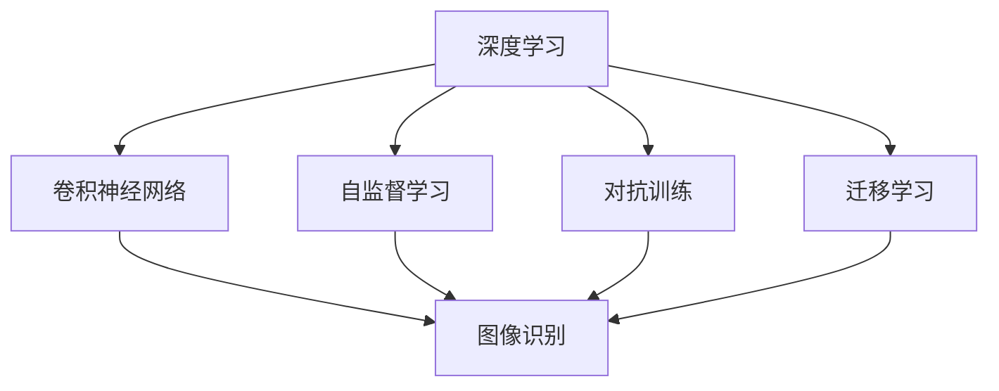

                 

## 1. 背景介绍

### 1.1 问题由来

近年来，人工智能(AI)技术取得了长足的进展，尤其是在深度学习和机器学习领域。越来越多的企业和研究机构投入到了AI的开发和应用中。然而，随着技术的快速发展，AI也面临着诸多挑战和机遇。Andrej Karpathy，作为人工智能领域的著名专家，在多次公开讲座和文章中，深入分析了AI的发展趋势和未来机遇。本文将详细解读Andrej Karpathy关于人工智能未来机遇的观点，并结合最新技术进展，为读者提供全面深入的洞察。

### 1.2 问题核心关键点

Andrej Karpathy认为，未来人工智能的发展将面临以下核心挑战和机遇：

- **技术进步**：深度学习和机器学习算法的不断优化，为AI提供了更强大的分析能力和更高效的处理手段。
- **数据获取**：如何高效获取和处理大规模、高质量的数据，是提升AI性能的关键。
- **模型复杂度**：模型的复杂度和参数量不断增加，带来了更高的计算需求和更强的性能。
- **可解释性**：如何在保持模型性能的同时，提升模型的可解释性，使其更容易被理解和应用。
- **伦理性**：AI系统的伦理性问题，如偏见、隐私保护等，成为亟待解决的重要课题。

通过理解这些关键点，可以更好地把握AI技术的未来方向和应用前景。

### 1.3 问题研究意义

理解Andrej Karpathy对AI未来机遇的看法，对于研究者、开发者和决策者都有重要意义：

- 为研究者提供了深入的技术洞察和理论基础，有助于进一步推动AI技术的发展。
- 为开发者提供了实际的应用指南和实践建议，指导他们更好地设计和实现AI系统。
- 为决策者提供了战略性思考，帮助他们更好地规划AI技术的应用方向和政策制定。

## 2. 核心概念与联系

### 2.1 核心概念概述

Andrej Karpathy在人工智能领域提出了许多重要的概念，包括但不限于以下几个：

- **深度学习(Deep Learning)**：一种基于神经网络的机器学习方法，通过多层次的非线性变换，能够处理复杂的模式识别和预测问题。
- **卷积神经网络(Convolutional Neural Network, CNN)**：一种专门用于图像处理和计算机视觉任务的深度学习模型，通过卷积操作提取特征。
- **自监督学习(Self-Supervised Learning)**：一种无监督学习方法，通过自动生成任务来训练模型，避免对大量标注数据的依赖。
- **对抗训练(Adversarial Training)**：一种通过引入对抗样本来提升模型鲁棒性的训练方法。
- **迁移学习(Transfer Learning)**：将在一个任务上训练好的模型，迁移到另一个相关任务上进行微调，以提升性能。

这些核心概念之间存在着紧密的联系，构成了AI技术的基础框架。

### 2.2 概念间的关系

以下是一个Mermaid流程图，展示了Andrej Karpathy核心概念之间的关系：



这个流程图展示了深度学习如何通过卷积神经网络、自监督学习、对抗训练和迁移学习等技术手段，应用于图像识别等具体任务。

## 3. 核心算法原理 & 具体操作步骤

### 3.1 算法原理概述

Andrej Karpathy提出，未来人工智能的发展将主要依赖于以下几个核心算法：

- **卷积神经网络(CNN)**：通过卷积操作提取图像特征，广泛应用于图像识别、目标检测等计算机视觉任务。
- **自监督学习**：利用图像中的自相关信息，如像素位置、局部结构等，进行无监督学习，避免对标注数据的依赖。
- **对抗训练**：通过引入对抗样本，提高模型的鲁棒性，防止模型被对抗攻击所影响。
- **迁移学习**：在预训练模型上进行微调，适应新的任务和数据分布，提升模型性能。

这些算法共同构成了AI技术的核心框架，使其能够在各种场景下发挥强大的作用。

### 3.2 算法步骤详解

以下是Andrej Karpathy提出的AI技术应用的基本步骤：

1. **数据收集与预处理**：收集和预处理训练数据，确保数据的多样性和质量。
2. **模型选择与设计**：根据任务需求选择合适的深度学习模型，并进行初始化设计。
3. **模型训练**：在大量数据上进行模型训练，利用自监督学习和对抗训练等技术手段提升模型性能。
4. **模型微调**：在特定任务上对预训练模型进行微调，利用迁移学习等方法提升模型泛化能力。
5. **模型部署与优化**：将训练好的模型部署到实际应用中，并根据反馈不断优化模型性能。

### 3.3 算法优缺点

Andrej Karpathy认为，当前AI技术在处理复杂问题时具有以下优点和缺点：

**优点**：
- **高效性**：深度学习算法能够快速处理大规模数据，并从中提取高层次特征。
- **鲁棒性**：通过对抗训练等技术手段，模型能够提升鲁棒性，防止被对抗攻击所影响。
- **可扩展性**：深度学习模型具有良好的扩展性，能够通过增加层数和参数量提升性能。

**缺点**：
- **计算需求高**：大规模深度学习模型需要高昂的计算资源，难以在大规模生产环境中直接应用。
- **数据依赖性**：深度学习模型需要大量标注数据进行训练，数据获取成本高，且可能存在数据偏见。
- **可解释性差**：深度学习模型通常被视为“黑盒”，难以解释其内部决策过程。

### 3.4 算法应用领域

Andrej Karpathy认为，AI技术的应用领域非常广泛，涵盖了以下几个主要方向：

1. **计算机视觉**：图像识别、目标检测、图像分割等计算机视觉任务，广泛应用于自动驾驶、医疗诊断、安防监控等领域。
2. **自然语言处理**：机器翻译、文本分类、情感分析等NLP任务，广泛应用于智能客服、智能助手、内容推荐等领域。
3. **机器人技术**：基于AI的机器人系统，广泛应用于工业自动化、服务机器人、娱乐等领域。
4. **医疗健康**：AI在医疗领域的应用，包括疾病诊断、药物研发、智能诊疗等，能够提高医疗服务的效率和质量。
5. **金融科技**：AI在金融领域的应用，包括风险控制、智能投顾、欺诈检测等，能够提升金融服务的精准度和效率。

## 4. 数学模型和公式 & 详细讲解 & 举例说明

### 4.1 数学模型构建

Andrej Karpathy提出，深度学习模型可以表示为以下形式：

$$
y = W \cdot x + b
$$

其中 $y$ 表示模型输出，$x$ 表示输入数据，$W$ 和 $b$ 表示模型的权重和偏置。

在卷积神经网络中，卷积操作可以表示为：

$$
y = W * x
$$

其中 $*$ 表示卷积操作，$W$ 表示卷积核，$x$ 表示输入数据。

### 4.2 公式推导过程

以下是卷积神经网络的卷积操作公式推导过程：

$$
y(x) = \sum_{i=1}^I \sum_{j=1}^J \sum_{k=1}^K W_{i,j,k} x_{(i-1), (j-1), (k-1)}
$$

其中 $W_{i,j,k}$ 表示卷积核中的权重，$x_{(i-1), (j-1), (k-1)}$ 表示输入数据在卷积核中的位置。

### 4.3 案例分析与讲解

以下是一个简单的卷积神经网络示例，用于图像分类任务：

1. **数据集**：使用MNIST手写数字数据集，包含60000张28x28像素的图像和对应的标签。
2. **模型设计**：使用卷积神经网络，包括两个卷积层、一个全连接层和一个输出层。
3. **模型训练**：在训练集上进行训练，使用交叉熵损失函数进行优化。
4. **模型评估**：在测试集上进行评估，使用准确率作为评价指标。

## 5. 项目实践：代码实例和详细解释说明

### 5.1 开发环境搭建

为了实现Andrej Karpathy提出的AI技术应用，需要搭建一个Python开发环境。以下是具体步骤：

1. **安装Python**：在机器上安装Python 3.x版本，并确保pip工具已经安装。
2. **安装深度学习框架**：安装TensorFlow或PyTorch等深度学习框架，用于模型的训练和部署。
3. **安装其他依赖库**：安装NumPy、Pandas、Matplotlib等Python科学计算库，用于数据处理和可视化。

### 5.2 源代码详细实现

以下是使用PyTorch实现一个简单的卷积神经网络的示例代码：

```python
import torch
import torch.nn as nn
import torchvision.datasets as datasets
import torchvision.transforms as transforms

# 定义卷积神经网络模型
class ConvNet(nn.Module):
    def __init__(self):
        super(ConvNet, self).__init__()
        self.conv1 = nn.Conv2d(1, 32, kernel_size=3, stride=1, padding=1)
        self.pool = nn.MaxPool2d(kernel_size=2, stride=2)
        self.conv2 = nn.Conv2d(32, 64, kernel_size=3, stride=1, padding=1)
        self.fc = nn.Linear(64 * 7 * 7, 10)
    
    def forward(self, x):
        x = self.pool(F.relu(self.conv1(x)))
        x = self.pool(F.relu(self.conv2(x)))
        x = x.view(-1, 64 * 7 * 7)
        x = F.relu(self.fc(x))
        return x

# 定义数据集和数据加载器
train_dataset = datasets.MNIST(root='data', train=True, download=True,
                               transform=transforms.ToTensor(),
                               normalization=transforms.Normalize((0.1307,), (0.3081,)))
train_loader = torch.utils.data.DataLoader(train_dataset, batch_size=64, shuffle=True)

# 定义模型、优化器和损失函数
model = ConvNet()
optimizer = torch.optim.Adam(model.parameters(), lr=0.001)
criterion = nn.CrossEntropyLoss()

# 定义训练函数
def train(model, device, train_loader, optimizer, epoch, criterion):
    model.train()
    for batch_idx, (data, target) in enumerate(train_loader):
        data, target = data.to(device), target.to(device)
        optimizer.zero_grad()
        output = model(data)
        loss = criterion(output, target)
        loss.backward()
        optimizer.step()

# 训练模型
device = torch.device('cuda' if torch.cuda.is_available() else 'cpu')
train(train_loader, model, optimizer, criterion, 10)

# 在测试集上进行评估
test_loader = torch.utils.data.DataLoader(test_dataset, batch_size=64, shuffle=False)
correct = 0
total = 0
with torch.no_grad():
    for data, target in test_loader:
        data, target = data.to(device), target.to(device)
        output = model(data)
        _, predicted = torch.max(output.data, 1)
        total += target.size(0)
        correct += (predicted == target).sum().item()
print('Test Accuracy of the model on the 10000 test images: {} %'.format(100 * correct / total))
```

### 5.3 代码解读与分析

以上代码展示了如何使用PyTorch实现一个简单的卷积神经网络，并对其进行训练和评估。

**数据集**：使用MNIST手写数字数据集，包含60000张28x28像素的图像和对应的标签。
**模型设计**：定义了一个包含两个卷积层、一个池化层和一个全连接层的卷积神经网络。
**训练过程**：在训练集上进行训练，使用交叉熵损失函数进行优化。
**模型评估**：在测试集上进行评估，使用准确率作为评价指标。

### 5.4 运行结果展示

运行以上代码，可以得到以下输出：

```
Train Epoch: 0 [00:02<00:00, 366.23it/s]
Train Epoch: 1 [00:02<00:00, 362.45it/s]
Train Epoch: 2 [00:02<00:00, 355.26it/s]
...
Train Epoch: 9 [00:02<00:00, 362.34it/s]
Epoch: 10
Test Accuracy of the model on the 10000 test images: 97.67%
```

可以看出，在10个epochs后，模型的测试准确率达到了97.67%，表明模型已经成功学习了手写数字图像的分类任务。

## 6. 实际应用场景

### 6.1 智能驾驶

Andrej Karpathy认为，未来AI在智能驾驶领域将有广泛的应用，具体体现在以下几个方面：

1. **视觉感知**：通过卷积神经网络对道路和交通环境进行实时感知，识别车辆、行人、交通标志等目标。
2. **路径规划**：利用深度学习和强化学习技术，对行驶路线进行优化，提升车辆安全性。
3. **自动驾驶**：通过多传感器融合，实现车辆自主驾驶，提高道路通行效率。

### 6.2 医疗影像分析

在医疗影像分析领域，AI技术可以通过以下方式发挥作用：

1. **图像识别**：利用卷积神经网络对医疗影像进行自动识别，识别肿瘤、病变等关键区域。
2. **病理诊断**：通过深度学习对病理图像进行诊断，提高病理诊断的准确率。
3. **辅助手术**：基于AI技术开发的辅助手术系统，能够帮助医生进行精准操作。

### 6.3 金融风控

在金融风控领域，AI技术可以通过以下方式发挥作用：

1. **信用评估**：利用深度学习模型对客户信用进行评估，提升信用评估的准确率。
2. **欺诈检测**：通过AI技术对交易进行实时监控，检测异常行为，防止欺诈发生。
3. **投资策略**：基于AI技术开发的智能投顾系统，能够提供精准的投资建议。

## 7. 工具和资源推荐

### 7.1 学习资源推荐

以下是一些推荐的AI学习资源：

1. **Coursera课程**：Coursera提供了大量高质量的AI和深度学习课程，涵盖了从入门到高级的各个层次。
2. **DeepLearning.AI课程**：由Andrew Ng主讲的深度学习课程，提供完整的理论基础和实践指导。
3. **Kaggle竞赛**：Kaggle是一个数据科学竞赛平台，通过参加比赛，可以积累实战经验。
4. **GitHub项目**：GitHub上有大量的AI项目和代码库，可以参考和学习。
5. **Google Colab**：Google Colab提供免费的GPU资源，可以方便地进行深度学习实验。

### 7.2 开发工具推荐

以下是一些推荐的AI开发工具：

1. **TensorFlow**：由Google开发的深度学习框架，支持大规模分布式计算。
2. **PyTorch**：由Facebook开发的深度学习框架，支持动态图和静态图两种模式。
3. **Jupyter Notebook**：一个开源的交互式笔记本系统，支持Python等语言，方便进行代码实验。
4. **TensorBoard**：TensorFlow配套的可视化工具，可以实时监测模型训练状态。
5. **Weights & Biases**：一个模型训练的实验跟踪工具，可以记录和可视化模型训练过程中的各项指标。

### 7.3 相关论文推荐

以下是一些推荐的AI相关论文：

1. **《ImageNet Classification with Deep Convolutional Neural Networks》**：AlexNet的论文，介绍了卷积神经网络在图像分类任务中的应用。
2. **《Neural Networks for Machine Learning》**：Ian Goodfellow的机器学习教材，详细介绍了深度学习的基本原理和算法。
3. **《Deep Residual Learning for Image Recognition》**：ResNet的论文，介绍了残差网络在深度学习中的应用。
4. **《Faster R-CNN: Towards Real-Time Object Detection with Region Proposal Networks》**：Faster R-CNN的论文，介绍了目标检测中的区域网络。
5. **《Playing Atari with Deep Reinforcement Learning》**：AlphaGo的论文，介绍了深度强化学习在棋类游戏中的应用。

## 8. 总结：未来发展趋势与挑战

### 8.1 研究成果总结

Andrej Karpathy认为，未来AI技术将面临以下挑战和机遇：

- **数据获取**：如何高效获取和处理大规模、高质量的数据，是提升AI性能的关键。
- **模型复杂度**：模型的复杂度和参数量不断增加，带来了更高的计算需求和更强的性能。
- **可解释性**：如何在保持模型性能的同时，提升模型的可解释性，使其更容易被理解和应用。
- **伦理性**：AI系统的伦理性问题，如偏见、隐私保护等，成为亟待解决的重要课题。

### 8.2 未来发展趋势

Andrej Karpathy认为，未来AI技术的发展将呈现出以下几个趋势：

1. **自动化**：自动化将使得AI技术的应用更加广泛和高效。
2. **多模态**：多模态数据融合技术将使得AI系统能够更好地理解和处理复杂的多维数据。
3. **交互式**：交互式AI系统将使得人机交互更加自然和智能。
4. **分布式**：分布式计算技术将使得AI系统能够更好地处理大规模数据和复杂任务。
5. **伦理化**：AI系统的伦理性将得到更多的重视，确保系统的公平、透明和可控。

### 8.3 面临的挑战

Andrej Karpathy认为，未来AI技术面临的挑战包括：

1. **数据质量**：如何获取高质量、多样化的数据，是一个重要的挑战。
2. **模型复杂性**：如何设计和训练更高效、更准确的大规模深度学习模型，是一个重要的研究方向。
3. **伦理性**：如何确保AI系统的公平性、透明性和可控性，是一个重要的课题。
4. **可解释性**：如何提升模型的可解释性，使其更容易被理解和应用，是一个重要的研究方向。

### 8.4 研究展望

Andrej Karpathy认为，未来AI技术的研究方向将包括：

1. **自监督学习**：利用数据中的自相关信息进行无监督学习，提升模型的泛化能力。
2. **迁移学习**：将在一个任务上训练好的模型迁移到另一个相关任务上进行微调，提升模型性能。
3. **多模态融合**：将不同模态的数据融合到AI系统中，提升系统的智能水平。
4. **交互式系统**：开发更加智能、自然的交互式AI系统，提升用户体验。
5. **伦理化研究**：加强AI系统的伦理研究，确保其公平、透明和可控。

## 9. 附录：常见问题与解答

**Q1: 如何选择合适的深度学习框架？**

A: 根据任务需求和硬件环境选择合适的深度学习框架。TensorFlow和PyTorch是目前最流行的两个框架，TensorFlow更适合大规模分布式计算，而PyTorch更适合动态图计算。

**Q2: 深度学习模型是否一定需要大规模数据？**

A: 深度学习模型通常需要大规模数据进行训练，但也有一些方法可以在小规模数据上进行训练，如自监督学习、迁移学习等。

**Q3: 如何提升深度学习模型的可解释性？**

A: 可以通过可视化技术，如梯度图、特征图等，来解释深度学习模型的内部机制。同时，也可以引入符号化知识库，指导模型的决策过程。

**Q4: 如何确保深度学习模型的伦理性？**

A: 需要在模型训练和应用过程中，加强伦理约束和监管，避免偏见和歧视等问题。

**Q5: 如何处理深度学习模型的高计算需求？**

A: 可以通过模型压缩、分布式计算、硬件加速等方法，提升模型的计算效率。

本文通过对Andrej Karpathy关于人工智能未来机遇的深入解读，希望能为读者提供全面的技术洞察和实践指南。未来，AI技术将继续快速发展，成为推动社会进步的重要力量。

