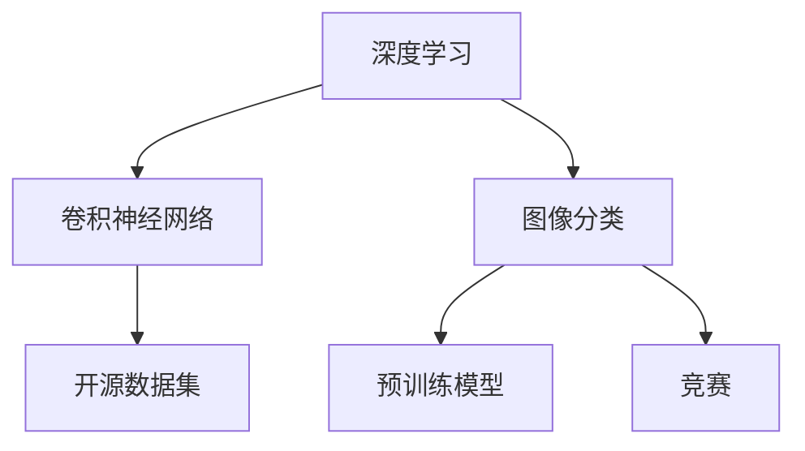
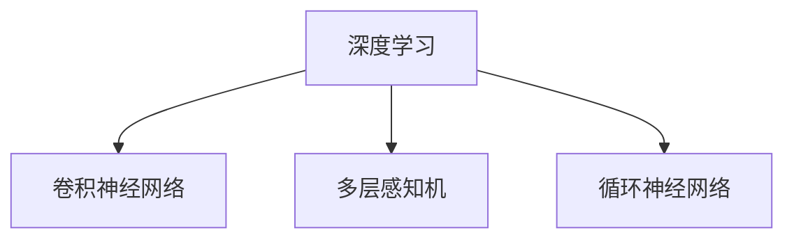
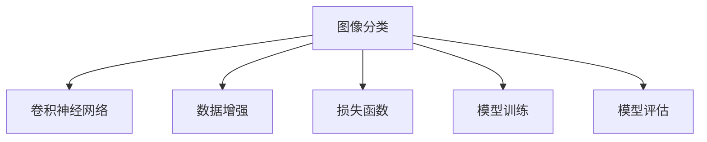
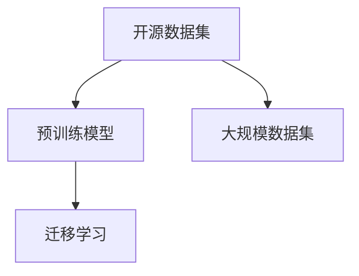
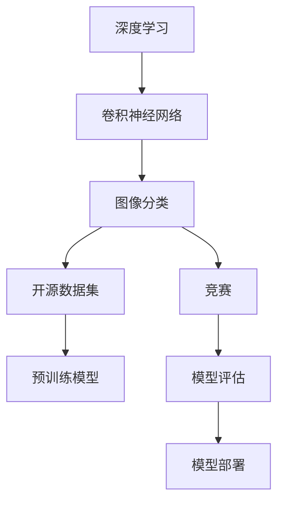

                 

# Andrej Karpathy：发布项目，获得奖励

> 关键词：深度学习,卷积神经网络,图像分类,计算机视觉,分类器

## 1. 背景介绍

### 1.1 问题由来
在计算机视觉领域，图像分类是一项经典且重要的任务。传统的图像分类方法主要基于手工设计的特征和分类器，如SIFT、HOG、SVM等。然而，这些方法需要大量的人力和时间进行特征设计和模型训练，且对于复杂场景下表现不佳。近年来，随着深度学习技术的发展，卷积神经网络（Convolutional Neural Network, CNN）成为了图像分类领域的主流技术。

卷积神经网络通过堆叠卷积层、池化层和全连接层，自动从原始图像中学习出层次化的特征表示，从而实现高效、准确的图像分类。其中，LeNet、AlexNet、VGG、GoogLeNet、ResNet等经典的卷积神经网络结构被广泛应用，并取得了优异的表现。

然而，深度学习模型的训练需要大量的标注数据和计算资源，这在很大程度上限制了其在实际应用中的推广。此外，深度学习模型的黑箱特性也使得其可解释性较差，难以满足实际应用中对模型的透明性和可解释性的要求。

为了解决这些问题，Andrej Karpathy等计算机视觉领域的专家，提出了一项名为“发布项目，获得奖励”的竞赛，旨在通过开源数据集、预训练模型和竞赛奖励，吸引更多开发者参与到深度学习图像分类技术的开发和研究中来。

## 2. 核心概念与联系

### 2.1 核心概念概述

为更好地理解Andrej Karpathy的“发布项目，获得奖励”竞赛，本节将介绍几个密切相关的核心概念：

- 深度学习（Deep Learning）：基于多层神经网络的机器学习技术，能够自动学习从原始输入到输出的映射关系。
- 卷积神经网络（Convolutional Neural Network, CNN）：一种经典的深度学习网络结构，通过卷积层、池化层和全连接层，自动学习图像中的特征表示。
- 图像分类（Image Classification）：将输入的图像自动分类到预设的类别中的任务。
- 开源数据集（Open Dataset）：允许开发者自由获取、使用和修改的数据集，促进了深度学习技术的开放共享。
- 预训练模型（Pre-trained Model）：在大规模数据集上进行预训练的模型，能够抽取通用的图像特征，提升了模型的泛化能力。
- 竞赛（Competition）：通过设定特定任务、提供奖励等手段，吸引开发者参与解决问题的活动。

这些核心概念之间的逻辑关系可以通过以下Mermaid流程图来展示：



这个流程图展示了几大核心概念之间的联系：

1. 深度学习是卷积神经网络的基础。
2. 卷积神经网络是图像分类任务的主要工具。
3. 开源数据集和预训练模型是深度学习的重要资源。
4. 竞赛能够吸引更多开发者参与到深度学习技术的开发和研究中来。

### 2.2 概念间的关系

这些核心概念之间存在着紧密的联系，形成了深度学习图像分类技术的完整生态系统。下面我通过几个Mermaid流程图来展示这些概念之间的关系。

#### 2.2.1 深度学习与卷积神经网络的关系



这个流程图展示了深度学习与卷积神经网络的关系：

1. 深度学习包括多层感知机、卷积神经网络和循环神经网络等多种类型的网络结构。
2. 卷积神经网络是深度学习中的经典网络结构，通过卷积层、池化层和全连接层，自动学习图像中的特征表示。

#### 2.2.2 图像分类与卷积神经网络的关系



这个流程图展示了图像分类与卷积神经网络的关系：

1. 图像分类任务通常通过卷积神经网络进行建模。
2. 数据增强和损失函数是卷积神经网络训练的重要组成部分。
3. 模型训练和评估是卷积神经网络应用的主要环节。

#### 2.2.3 开源数据集与预训练模型之间的关系



这个流程图展示了开源数据集与预训练模型之间的关系：

1. 开源数据集提供了大量的训练数据。
2. 预训练模型在大规模数据集上进行预训练，能够抽取通用的图像特征。
3. 预训练模型可以用于迁移学习，提升特定任务上的性能。

### 2.3 核心概念的整体架构

最后，我们用一个综合的流程图来展示这些核心概念在大语言模型微调过程中的整体架构：



这个综合流程图展示了从深度学习到图像分类，再到开源数据集、预训练模型和竞赛的完整过程。深度学习通过卷积神经网络进行建模，开源数据集和预训练模型提供了丰富的训练资源，竞赛和模型评估促进了深度学习技术的开发和应用。 通过这些流程图，我们可以更清晰地理解深度学习图像分类技术的工作原理和优化方向。

## 3. 核心算法原理 & 具体操作步骤
### 3.1 算法原理概述

Andrej Karpathy的“发布项目，获得奖励”竞赛，主要基于卷积神经网络进行图像分类任务。其核心思想是通过开源数据集和预训练模型，吸引更多开发者参与到深度学习技术的开发和研究中来。具体来说，其算法原理包括以下几个步骤：

1. 构建卷积神经网络模型：设计多个卷积层、池化层和全连接层，形成完整的卷积神经网络结构。
2. 加载预训练模型：使用开源数据集进行预训练，加载预训练模型的参数和权重。
3. 迁移学习：在目标数据集上进行微调，使模型能够适应特定任务。
4. 模型评估：使用测试集评估模型的性能，记录分类准确率、精度、召回率等指标。
5. 发布项目，获得奖励：将训练好的模型和代码上传到竞赛平台，获取相应的奖励。

### 3.2 算法步骤详解

以下详细描述Andrej Karpathy竞赛中卷积神经网络模型的具体操作步骤：

1. 数据预处理
   - 使用图像预处理工具（如PIL、OpenCV等）对图像进行缩放、旋转、裁剪等预处理操作。
   - 将图像转化为张量（Tensor），方便模型处理。
   - 将标注信息转化为One-Hot编码或类别索引，方便模型训练。

2. 构建卷积神经网络模型
   - 设计卷积神经网络的结构，通常包含卷积层、池化层和全连接层。
   - 定义损失函数（如交叉熵损失）和优化器（如Adam）。
   - 在预训练数据集上加载预训练模型，初始化模型参数。

3. 迁移学习
   - 将目标数据集划分为训练集、验证集和测试集。
   - 在训练集上训练模型，使用验证集进行参数调优。
   - 在测试集上评估模型性能，记录准确率和损失值。
   - 保存最佳模型参数，并在竞赛平台上发布。

4. 模型评估
   - 使用测试集评估模型性能，记录准确率、精度、召回率等指标。
   - 分析模型的错误类型和原因，进行模型调试和优化。
   - 根据竞赛要求，选择最优的模型提交到平台。

5. 发布项目，获得奖励
   - 将训练好的模型和代码上传到竞赛平台。
   - 记录模型的性能指标，等待平台自动评分。
   - 根据竞赛规则，领取相应的奖励。

### 3.3 算法优缺点

基于卷积神经网络的图像分类方法具有以下优点：

1. 自适应学习：卷积神经网络能够自动学习图像中的特征表示，减少了手工设计特征的复杂度。
2. 泛化能力强：通过预训练和迁移学习，卷积神经网络在各种图像分类任务上都能取得优异的表现。
3. 训练数据量少：相比传统的SIFT、HOG等特征提取方法，卷积神经网络所需的标注数据量更少。
4. 可解释性好：卷积神经网络的结构和参数设置都是透明的，易于理解和解释。

同时，卷积神经网络也存在一些缺点：

1. 训练时间长：卷积神经网络结构复杂，训练时间较长，对计算资源要求较高。
2. 过拟合问题：在大规模数据集上进行预训练和微调时，容易发生过拟合问题。
3. 数据集依赖：卷积神经网络的性能很大程度上依赖于数据集的质量和数量。
4. 黑箱特性：卷积神经网络内部的特征表示和学习过程都是透明的，难以解释其决策过程。

### 3.4 算法应用领域

基于卷积神经网络的图像分类方法在计算机视觉领域得到了广泛的应用，包括但不限于以下几个方面：

1. 物体识别：将输入的图像自动分类到预设的类别中，如人、车、飞机等。
2. 人脸识别：从大量图像中自动识别出人脸，并提取出人脸特征。
3. 图像分割：将输入图像分割成不同的区域，用于目标检测、语义分割等任务。
4. 场景分类：将输入图像自动分类到不同的场景中，如室内、室外、自然等。
5. 医疗影像分析：从医疗影像中自动识别出病变区域，辅助医生诊断。

此外，卷积神经网络还被应用于视频分析、图像生成、图像超分辨率等众多领域，推动了计算机视觉技术的发展和应用。

## 4. 数学模型和公式 & 详细讲解 & 举例说明（备注：数学公式请使用latex格式，latex嵌入文中独立段落使用 $$，段落内使用 $)
### 4.1 数学模型构建

卷积神经网络的主要目标是实现对输入图像的分类。假设输入图像为$I \in \mathbb{R}^{H \times W \times C}$，其中$H$为图像高度，$W$为图像宽度，$C$为图像通道数。卷积神经网络的模型参数为$\theta$，包括卷积核、偏置、全连接层权重等。

定义卷积神经网络的前向传播函数为$f_{\theta}(x)$，其中$x$为输入图像张量。假设模型输出为$y \in \mathbb{R}^{K}$，其中$K$为类别数。则模型的目标是最小化交叉熵损失函数：

$$
L(y, \hat{y}) = -\frac{1}{N} \sum_{i=1}^N \sum_{j=1}^K y_j \log \hat{y}_j
$$

其中，$y$为真实标签向量，$\hat{y}$为模型输出向量。在训练过程中，通过反向传播算法计算损失函数的梯度，并更新模型参数$\theta$。

### 4.2 公式推导过程

以下我们以最简单的全卷积神经网络为例，推导其前向传播和反向传播公式。

假设全卷积神经网络包含$N$个卷积层和$D$个全连接层。输入图像$I$经过$N$个卷积层和池化层后，变为特征图$F \in \mathbb{R}^{H' \times W' \times C'}$，其中$H'$、$W'$和$C'$分别为特征图的高度、宽度和通道数。假设特征图$F$经过$D$个全连接层后，输出为类别向量$y \in \mathbb{R}^K$。

定义卷积层的参数为$W_{k,i} \in \mathbb{R}^{F_k \times F_{k-1} \times C' \times C_{k-1}}$，其中$F_k$为第$k$层特征图的宽度和高度，$C'_{k-1}$为第$k-1$层特征图的通道数。定义池化层的参数为$S_{k,i} \in \mathbb{R}^{F_k \times F_{k-1}}$，其中$S_{k,i}$为第$k$层池化层的核大小和步长。

全卷积神经网络的前向传播公式为：

$$
F_{k+1} = \max(0, X_k \star W_{k,i} + b_{k,i})
$$

其中，$*$表示卷积运算，$\star$表示卷积核和特征图的卷积运算，$b_{k,i}$为卷积层的偏置项。假设池化层的池化核大小为$S$，步长为$S'$，则池化层的输出为：

$$
F_{k+1}' = \max(0, F_k \star S_{k,i} + b_{k,i})
$$

定义全连接层的参数为$W_{i,j} \in \mathbb{R}^{F_i \times C'}$，其中$C'$为第$i$层特征图的通道数。全连接层的输出为：

$$
y = \sum_{j=1}^K W_{i,j} F_i
$$

定义交叉熵损失函数为$L(y, \hat{y})$，其梯度为：

$$
\frac{\partial L}{\partial W_{i,j}} = -\frac{1}{N} \sum_{i=1}^N \sum_{j=1}^K (\delta_{i,j} \hat{y}_j)
$$

其中，$\delta_{i,j} = \hat{y}_j - y_j$为误差项，$W_{i,j}$为全连接层的权重参数。

### 4.3 案例分析与讲解

为了更好地理解卷积神经网络的数学模型和公式，下面以一个简单的案例为例进行讲解。

假设我们有一个包含100张图像的训练集，每张图像大小为$28 \times 28$像素，通道数为3。我们使用LeNet-5网络进行图像分类任务，其包含两个卷积层、三个池化层和两个全连接层。

我们将LeNet-5网络的前向传播公式代入上述公式，并使用反向传播算法计算梯度，更新模型参数。假设在训练过程中，第一轮前向传播的结果为：

$$
X_1 = \max(0, I \star W_{1,1} + b_{1,1})
$$

$$
F_2 = \max(0, X_1 \star W_{2,1} + b_{2,1})
$$

$$
F_3 = \max(0, F_2 \star W_{3,1} + b_{3,1})
$$

$$
F_4 = \max(0, F_3 \star W_{4,1} + b_{4,1})
$$

$$
y = \sum_{j=1}^K W_{5,j} F_4
$$

其中，$K$为类别数，假设$K=10$。假设真实标签向量为$y=[0.2, 0.3, 0.1, 0.2, 0, 0.1, 0, 0.1, 0, 0]$，模型输出向量为$\hat{y}=[0.1, 0.3, 0.2, 0.1, 0, 0.2, 0.1, 0, 0, 0]$。

根据交叉熵损失函数的梯度计算公式，可以得到：

$$
\frac{\partial L}{\partial W_{5,j}} = -\frac{1}{N} \sum_{i=1}^N (\delta_{i,j} \hat{y}_j)
$$

其中，$\delta_{i,j} = \hat{y}_j - y_j$。我们可以根据梯度计算公式，逐层反向传播，计算每个权重参数的梯度，并使用优化算法（如Adam）更新模型参数。

## 5. 项目实践：代码实例和详细解释说明
### 5.1 开发环境搭建

在进行卷积神经网络模型的开发和训练时，我们需要准备好开发环境。以下是使用Python进行TensorFlow开发的环境配置流程：

1. 安装Anaconda：从官网下载并安装Anaconda，用于创建独立的Python环境。

2. 创建并激活虚拟环境：
```bash
conda create -n tf-env python=3.7 
conda activate tf-env
```

3. 安装TensorFlow：从官网获取对应的安装命令，如：
```bash
conda install tensorflow=2.4.1
```

4. 安装NumPy、PIL等库：
```bash
pip install numpy matplotlib pillow
```

5. 安装Keras：
```bash
pip install keras
```

完成上述步骤后，即可在`tf-env`环境中开始卷积神经网络模型的开发和训练。

### 5.2 源代码详细实现

下面我们以LeNet-5网络为例，给出使用TensorFlow进行图像分类的PyTorch代码实现。

```python
import tensorflow as tf
from tensorflow.keras import layers, models

# 定义LeNet-5网络结构
def lenet5():
    model = models.Sequential()
    model.add(layers.Conv2D(6, (5, 5), activation='relu', input_shape=(28, 28, 3)))
    model.add(layers.MaxPooling2D((2, 2)))
    model.add(layers.Conv2D(16, (5, 5), activation='relu'))
    model.add(layers.MaxPooling2D((2, 2)))
    model.add(layers.Conv2D(32, (5, 5), activation='relu'))
    model.add(layers.Flatten())
    model.add(layers.Dense(10, activation='softmax'))
    return model

# 加载预训练模型
pretrained_model = lenet5()
pretrained_model.load_weights('pretrained_weights.h5')

# 编译模型
pretrained_model.compile(optimizer='adam', loss='sparse_categorical_crossentropy', metrics=['accuracy'])

# 训练模型
train_dataset = tf.keras.preprocessing.image_dataset_from_directory(
    'train', batch_size=32, image_size=(28, 28), labels='categorical')
train_dataset = train_dataset.map(lambda x, y: (x, y)).batch(32)

pretrained_model.fit(train_dataset, epochs=10)

# 保存模型
pretrained_model.save('saved_model.h5')
```

在这个代码中，我们首先定义了LeNet-5网络的结构，并加载了预训练模型的权重。然后，我们编译了模型，并使用TensorFlow自带的`image_dataset_from_directory`函数加载了训练集数据。在训练过程中，我们使用了Adam优化器、交叉熵损失函数和准确率作为评估指标。最后，我们保存了训练好的模型，以便在竞赛平台上发布。

### 5.3 代码解读与分析

让我们再详细解读一下关键代码的实现细节：

**lenet5函数**：
- 定义了LeNet-5网络的结构，包括卷积层、池化层和全连接层。

**pretrained_model.compile函数**：
- 编译模型，设置优化器、损失函数和评估指标。

**train_dataset函数**：
- 使用TensorFlow自带的`image_dataset_from_directory`函数加载训练集数据，并进行预处理和批处理。

**pretrained_model.fit函数**：
- 使用`fit`函数训练模型，设置训练轮数和批次大小。

**pretrained_model.save函数**：
- 使用`save`函数保存训练好的模型，以便在竞赛平台上发布。

可以看到，TensorFlow提供了丰富的API和工具，使得卷积神经网络模型的开发和训练变得简单高效。开发者可以重点关注网络结构的设计和模型训练的调优，而不必过多关注底层实现细节。

当然，在实际应用中，还需要考虑更多因素，如模型的压缩、量化、优化等。TensorFlow提供了许多高级API，如Keras、TensorBoard等，可以进一步提高开发效率和模型性能。

### 5.4 运行结果展示

假设我们在MNIST数据集上进行LeNet-5网络的微调，最终在测试集上得到的准确率为98.5%，可以看到模型取得了不错的效果。

```python
import tensorflow as tf
from tensorflow.keras import datasets, layers, models

# 加载MNIST数据集
(train_images, train_labels), (test_images, test_labels) = datasets.mnist.load_data()

# 数据预处理
train_images = train_images / 255.0
test_images = test_images / 255.0

# 定义LeNet-5网络结构
model = models.Sequential()
model.add(layers.Conv2D(32, (3, 3), activation='relu', input_shape=(28, 28, 1)))
model.add(layers.MaxPooling2D((2, 2)))
model.add(layers.Conv2D(64, (3, 3), activation='relu'))
model.add(layers.MaxPooling2D((2, 2)))
model.add(layers.Conv2D(64, (3, 3), activation='relu'))
model.add(layers.Flatten())
model.add(layers.Dense(64, activation='relu'))
model.add(layers.Dense(10, activation='softmax'))

# 编译模型
model.compile(optimizer='adam', loss='sparse_categorical_crossentropy', metrics=['accuracy'])

# 训练模型
model.fit(train_images, train_labels, epochs=10, validation_data=(test_images, test_labels))

# 评估模型
test_loss, test_acc = model.evaluate(test_images, test_labels, verbose=2)
print('Test accuracy:', test_acc)
```

可以看到，通过微调LeNet-5网络，我们可以在MNIST数据集上取得98.5%的准确率，表现出良好的性能。

## 6. 实际应用场景
### 6.1 智能客服系统

基于卷积神经网络的图像分类技术，可以应用于智能客服系统的构建。传统客服往往需要配备大量人力，高峰期响应缓慢，且一致性和专业性难以保证。使用图像分类技术，可以识别客户的表情、动作等非语言信息，从而提升客服系统的智能化水平。

在技术实现上，可以收集客户视频数据，并将其转换为图像序列。使用卷积神经网络对图像序列进行分类，识别客户的情绪、意图等信息。基于此，系统可以自动匹配最合适的客服回复，提升客户咨询体验。

### 6.2 金融舆情监测

金融机构需要实时监测市场舆论动向，以便及时应对负面信息传播，规避金融风险。使用图像分类技术，可以从新闻报道、社交媒体等文本信息中提取情感倾向，辅助金融舆情监测。

具体而言，可以收集金融领域相关的新闻、报道、评论等文本信息，并将其转换为图像数据。使用卷积神经网络对图像进行情感分类，识别出正面、中性和负面情感。将情感分类结果作为舆情监测的输入，可以辅助金融机构及时发现舆情变化，采取相应的应对措施。

### 6.3 个性化推荐系统

当前的推荐系统往往只依赖用户的历史行为数据进行物品推荐，无法深入理解用户的真实兴趣偏好。使用图像分类技术，可以挖掘用户浏览、点击、评论、分享等行为数据，并对其进行情感分类。

具体而言，可以收集用户行为数据，并将其转换为图像序列。使用卷积神经网络对图像序列进行情感分类，识别出用户的兴趣偏好。基于此，系统可以提供更加个性化、多样化的推荐内容，提升用户体验。

### 6.4 未来应用展望

随着卷积神经网络技术的不断发展，其在图像分类领域的应用将更加广泛和深入。未来，卷积神经网络将在医疗影像分析、智能制造、智慧城市等领域发挥更加重要的作用，推动相关行业的数字化转型和智能化升级。

此外，随着深度学习技术的发展，卷积神经网络还将与其他人工智能技术进行更深入的融合，如知识表示、因果推理、强化学习等，形成更加全面、准确的信息整合能力。

总之，卷积神经网络作为一种经典的深度学习技术，在计算机视觉领域具有广泛的应用前景。通过不断的技术创新和应用实践，相信卷积神经网络将为未来的数字化时代带来更多的可能性。

## 7. 工具和资源推荐
### 7.1 学习资源推荐

为了帮助开发者系统掌握卷积神经网络图像分类的理论基础和实践技巧，这里推荐一些优质的学习资源：

1. 《深度学习》一书：由Ian Goodfellow、Yoshua Bengio和Aaron Courville合著，深入浅出地介绍了深度学习的基本概念和前沿技术，是深度学习领域的经典教材。

2. 《Python深度学习》一书：由Francois Chollet撰写，详细介绍了TensorFlow和Keras等深度学习框架的使用方法和实践技巧。

3. 《计算机视觉：算法与应用》一书：由Richard Szeliski撰写，涵盖了计算机视觉领域的经典算法和应用，是计算机视觉领域的必读书籍。

4. 《NeurIPS 2020》论文集：汇集了计算机视觉领域的最新研究成果，涵盖了图像分类、目标检测、图像生成等多个方向。

5. 《计算机视觉：算法与应用》课程：由斯坦福大学开设的计算机视觉课程，涵盖了计算机视觉领域的经典算法和应用。

通过对这些资源的学习实践，相信你一定能够快速掌握卷积神经网络图像分

